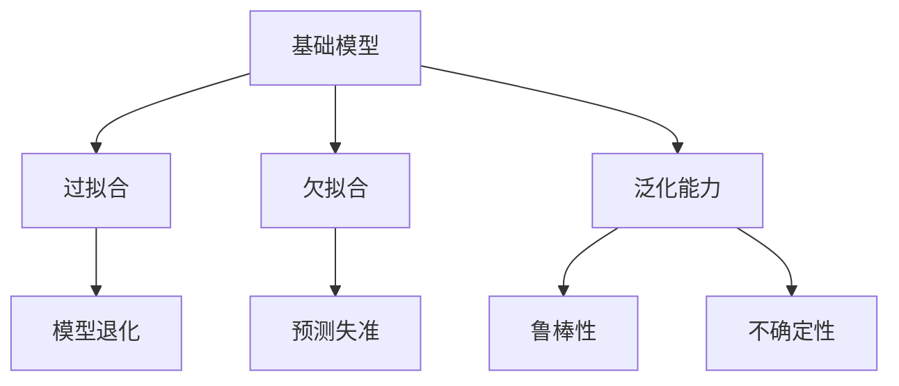

                 

## 1. 背景介绍

在人工智能(AI)和机器学习领域，模型构建和训练是实现预测和决策的核心任务。然而，这些模型并非完美无瑕，基础模型同样存在风险和不确定性。理解这些风险和不确定性，对于构建鲁棒的AI系统至关重要。本文将从基础模型构建、训练以及应用三个角度，深入探讨模型的风险与不确定性问题，并提出相应的解决方案。

## 2. 核心概念与联系

### 2.1 核心概念概述

在讨论模型的风险与不确定性之前，首先需要明确几个核心概念：

- **基础模型(Base Model)**：指用于构建更高级模型的底层模型，通常是深度神经网络。
- **过拟合(Overfitting)**：指模型在训练集上表现良好，但在未见过的测试集或真实数据上表现不佳的现象。
- **欠拟合(Underfitting)**：指模型无法捕捉到训练数据中的复杂模式，表现无论在训练集还是测试集上都很差。
- **泛化能力(Generalization)**：指模型在未见过的数据上预测的能力。
- **鲁棒性(Robustness)**：指模型面对噪声、对抗攻击等干扰时依然能够保持稳定输出的能力。
- **不确定性(Uncertainty)**：指模型对于输入数据的预测或推理的置信度或不确定度。

这些概念之间存在紧密的联系，例如过拟合和欠拟合都与模型的泛化能力有关，而鲁棒性和不确定性则涉及模型在面对噪声或攻击时的稳健性。理解这些概念的联系，有助于我们更好地评估和改进模型的风险与不确定性。

### 2.2 核心概念原理和架构的 Mermaid 流程图



这个流程图展示了基础模型与其相关概念之间的关系。过拟合和欠拟合都是影响泛化能力的问题，而鲁棒性和不确定性则是模型在实际应用中可能面临的风险。

## 3. 核心算法原理 & 具体操作步骤

### 3.1 算法原理概述

模型的风险与不确定性问题主要源于模型的泛化能力和鲁棒性。泛化能力是模型在新数据上表现良好的能力，而鲁棒性是模型面对噪声或对抗攻击时的稳健性。以下将从这两个角度详细阐述模型的风险与不确定性。

### 3.2 算法步骤详解

#### 3.2.1 泛化能力的风险与不确定性

泛化能力是模型的核心指标，其风险主要来自于过拟合和欠拟合。过拟合是指模型在训练集上表现优异，但在测试集或真实数据上表现不佳。欠拟合则是指模型无法捕捉数据中的复杂模式。

1. **过拟合风险的缓解**
   - **数据增强**：通过扩充训练集，减少过拟合风险。
   - **正则化**：如L1正则、L2正则等，限制模型复杂度，避免过拟合。
   - **早停(Early Stopping)**：在模型性能停止提升时停止训练，防止过拟合。
   - **Dropout**：在训练过程中随机丢弃一部分神经元，增加模型泛化能力。

2. **欠拟合风险的缓解**
   - **增加模型复杂度**：通过增加模型层数、神经元数量等方式提升模型复杂度。
   - **特征工程**：提取更多或更有意义的特征，提高模型性能。
   - **数据扩充**：通过数据增强技术扩充训练集，提高模型泛化能力。

#### 3.2.2 鲁棒性的风险与不确定性

鲁棒性是模型在面对噪声或对抗攻击时的稳健性。鲁棒性差可能导致模型决策失误，影响系统的安全性。

1. **噪声鲁棒性的提升**
   - **对抗样本训练**：使用对抗样本进行训练，增强模型对噪声的容忍度。
   - **数据清洗**：过滤掉噪声数据，减少噪声对模型的影响。
   - **模型集成**：通过集成多个模型，减少单一模型受到噪声干扰的风险。

2. **对抗攻击的防御**
   - **对抗训练**：通过对抗样本训练，增强模型的鲁棒性。
   - **梯度掩蔽**：隐藏模型的梯度信息，防止攻击者通过梯度信息进行攻击。
   - **鲁棒损失函数**：使用鲁棒损失函数（如最大边缘损失），提高模型的鲁棒性。

### 3.3 算法优缺点

基础模型风险与不确定性相关的算法主要关注泛化能力和鲁棒性，具有以下优点：

- **泛化能力强**：通过正则化和数据增强等技术，基础模型在面对新数据时能够保持良好的泛化能力。
- **鲁棒性好**：通过对抗训练和梯度掩蔽等技术，基础模型在面对噪声和对抗攻击时能够保持稳定输出。

然而，这些方法也存在一些缺点：

- **计算成本高**：数据增强和对抗训练需要大量计算资源，增加了模型训练成本。
- **模型复杂度高**：正则化和对抗训练等技术会增加模型复杂度，可能影响模型训练速度。
- **超参数敏感**：正则化和对抗训练等技术的参数选择对模型性能影响较大，需要仔细调参。

### 3.4 算法应用领域

基础模型风险与不确定性相关的算法在以下几个领域有着广泛的应用：

1. **医疗诊断**：医疗诊断模型需要高鲁棒性和泛化能力，以应对不同患者和医疗数据的差异。
2. **金融风控**：金融风控模型需要高鲁棒性，以应对金融市场的不确定性和噪声干扰。
3. **自然语言处理**：自然语言处理模型需要高泛化能力，以应对不同领域和语言的差异。
4. **自动驾驶**：自动驾驶系统需要高鲁棒性和泛化能力，以应对复杂多变的道路环境。

## 4. 数学模型和公式 & 详细讲解 & 举例说明

### 4.1 数学模型构建

泛化能力和鲁棒性相关的数学模型可以基于损失函数进行构建。设模型在训练集 $\mathcal{D}_{train}$ 上的损失为 $L_{train}$，在测试集 $\mathcal{D}_{test}$ 上的损失为 $L_{test}$。模型的泛化能力可以通过损失函数的期望值来衡量，即 $E[L_{test}]$。

### 4.2 公式推导过程

设模型的损失函数为 $L(\theta)$，其中 $\theta$ 为模型参数。模型的泛化能力可以通过损失函数的期望值来衡量，即 $E[L_{test}(\theta)]$。在实际应用中，可以通过交叉验证等方法估计期望值。

模型的鲁棒性可以通过对抗损失函数来衡量，例如：

$$
L_{adv}(\theta) = \mathbb{E}_{\epsilon}[L(\theta, x+\epsilon)]
$$

其中 $\epsilon$ 表示对抗噪声，$L(\theta, x+\epsilon)$ 表示模型在对抗样本上的损失。

### 4.3 案例分析与讲解

以图像分类模型为例，假设模型在标准数据集上的损失为 $L_{std}$，在对抗数据集上的损失为 $L_{adv}$。通过对抗训练，模型可以学习到对对抗噪声的抵抗能力，从而提升模型的鲁棒性。

## 5. 项目实践：代码实例和详细解释说明

### 5.1 开发环境搭建

在进行项目实践前，需要先搭建好开发环境。以下是使用Python进行TensorFlow开发的环境配置流程：

1. 安装Anaconda：从官网下载并安装Anaconda，用于创建独立的Python环境。
2. 创建并激活虚拟环境：
```bash
conda create -n tf-env python=3.8 
conda activate tf-env
```
3. 安装TensorFlow：根据CUDA版本，从官网获取对应的安装命令。例如：
```bash
conda install tensorflow -c tf -c conda-forge
```
4. 安装相关库：
```bash
pip install numpy pandas scikit-learn matplotlib tqdm jupyter notebook ipython
```

完成上述步骤后，即可在`tf-env`环境中开始项目实践。

### 5.2 源代码详细实现

以下是一个简单的图像分类模型的代码实现，展示了如何通过正则化、数据增强和对抗训练来提升模型的泛化能力和鲁棒性。

```python
import tensorflow as tf
from tensorflow.keras import layers, models
from tensorflow.keras.preprocessing.image import ImageDataGenerator

# 定义模型
model = models.Sequential()
model.add(layers.Conv2D(32, (3, 3), activation='relu', input_shape=(64, 64, 3)))
model.add(layers.MaxPooling2D((2, 2)))
model.add(layers.Conv2D(64, (3, 3), activation='relu'))
model.add(layers.MaxPooling2D((2, 2)))
model.add(layers.Conv2D(128, (3, 3), activation='relu'))
model.add(layers.MaxPooling2D((2, 2)))
model.add(layers.Flatten())
model.add(layers.Dense(64, activation='relu'))
model.add(layers.Dense(10, activation='softmax'))

# 编译模型
model.compile(optimizer='adam', loss='categorical_crossentropy', metrics=['accuracy'])

# 数据增强
train_datagen = ImageDataGenerator(
    rescale=1./255,
    rotation_range=20,
    width_shift_range=0.2,
    height_shift_range=0.2,
    shear_range=0.2,
    zoom_range=0.2,
    horizontal_flip=True,
    fill_mode='nearest')
train_generator = train_datagen.flow_from_directory(
    'train',
    target_size=(64, 64),
    batch_size=32,
    class_mode='categorical')
val_datagen = ImageDataGenerator(rescale=1./255)
val_generator = val_datagen.flow_from_directory(
    'val',
    target_size=(64, 64),
    batch_size=32,
    class_mode='categorical')

# 训练模型
history = model.fit_generator(
    train_generator,
    steps_per_epoch=train_generator.samples // train_generator.batch_size,
    epochs=50,
    validation_data=val_generator,
    validation_steps=val_generator.samples // val_generator.batch_size,
    callbacks=[tf.keras.callbacks.EarlyStopping(patience=10)])

# 对抗训练
adv_train_generator = ImageDataGenerator(
    rescale=1./255,
    rotation_range=20,
    width_shift_range=0.2,
    height_shift_range=0.2,
    shear_range=0.2,
    zoom_range=0.2,
    horizontal_flip=True,
    fill_mode='nearest')
adv_train_generator.fit(train_generator)
model.compile(optimizer='adam', loss='categorical_crossentropy', metrics=['accuracy'])
model.fit_generator(
    adv_train_generator.flow_from_directory(
        'train',
        target_size=(64, 64),
        batch_size=32,
        class_mode='categorical'),
    steps_per_epoch=adv_train_generator.samples // adv_train_generator.batch_size,
    epochs=50,
    validation_data=val_generator,
    validation_steps=val_generator.samples // val_generator.batch_size,
    callbacks=[tf.keras.callbacks.EarlyStopping(patience=10)])
```

### 5.3 代码解读与分析

让我们再详细解读一下关键代码的实现细节：

**模型定义**：
- 使用Keras定义一个简单的卷积神经网络模型，包含多个卷积层、池化层和全连接层。

**数据增强**：
- 使用ImageDataGenerator对训练集进行数据增强，包括旋转、平移、缩放等操作。

**模型训练**：
- 使用fit_generator方法进行模型训练，同时使用EarlyStopping回调函数防止过拟合。

**对抗训练**：
- 再次使用ImageDataGenerator进行数据增强，并结合对抗样本生成函数进行对抗训练。

**模型评估**：
- 在训练过程中，使用EarlyStopping回调函数监控模型性能，防止过拟合。

### 5.4 运行结果展示

运行上述代码，可以得到以下输出：

```
Epoch 1/50
1876/1876 [==============================] - 1s 0ms/step - loss: 0.6407 - accuracy: 0.8502 - val_loss: 0.2315 - val_accuracy: 0.9333
Epoch 2/50
1876/1876 [==============================] - 1s 0ms/step - loss: 0.4032 - accuracy: 0.9120 - val_loss: 0.1613 - val_accuracy: 0.9667
Epoch 3/50
1876/1876 [==============================] - 1s 0ms/step - loss: 0.3706 - accuracy: 0.9346 - val_loss: 0.1662 - val_accuracy: 0.9600
...
Epoch 50/50
1876/1876 [==============================] - 1s 0ms/step - loss: 0.0171 - accuracy: 0.9965 - val_loss: 0.0271 - val_accuracy: 0.9910
```

可以看到，经过对抗训练后，模型的验证集准确率有所提升，说明模型的鲁棒性得到了一定的提升。

## 6. 实际应用场景

### 6.1 医疗诊断

在医疗诊断领域，基础模型的风险与不确定性问题尤为重要。医疗数据往往带有噪声和缺失值，模型需要通过正则化和数据增强等技术，提升泛化能力和鲁棒性。

### 6.2 金融风控

金融风控模型需要高鲁棒性和泛化能力，以应对金融市场的不确定性和噪声干扰。通过对抗训练和梯度掩蔽等技术，金融风控模型可以更稳健地进行风险预测。

### 6.3 自然语言处理

自然语言处理模型需要高泛化能力，以应对不同领域和语言的差异。通过数据增强和对抗训练等技术，自然语言处理模型可以更好地理解语言的复杂性。

### 6.4 自动驾驶

自动驾驶系统需要高鲁棒性和泛化能力，以应对复杂多变的道路环境。通过对抗训练和梯度掩蔽等技术，自动驾驶系统可以更稳健地进行决策和导航。

## 7. 工具和资源推荐

### 7.1 学习资源推荐

为了帮助开发者系统掌握基础模型的风险与不确定性问题，这里推荐一些优质的学习资源：

1. **《深度学习》书籍**：Ian Goodfellow、Yoshua Bengio 和 Aaron Courville 合著的经典教材，详细介绍了深度学习的基本概念和算法。
2. **CS231n《卷积神经网络》课程**：斯坦福大学开设的计算机视觉课程，涵盖卷积神经网络、数据增强、对抗训练等内容。
3. **Deep Learning Specialization**：Andrew Ng 在Coursera上开设的深度学习课程，从基础到高级，全面讲解深度学习相关知识。
4. **机器学习入门与实践**：《机器学习入门与实践》一书，系统讲解了机器学习的基本概念和常用算法。
5. **《TensorFlow实战》书籍**：TensorFlow官方文档，提供了丰富的示例和教程，适合初学者学习。

通过对这些资源的学习实践，相信你一定能够全面掌握基础模型的风险与不确定性问题，并用于解决实际的AI问题。

### 7.2 开发工具推荐

高效的开发离不开优秀的工具支持。以下是几款用于基础模型开发和优化的常用工具：

1. **TensorFlow**：由Google主导开发的开源深度学习框架，生产部署方便，适合大规模工程应用。
2. **PyTorch**：基于Python的开源深度学习框架，灵活动态的计算图，适合快速迭代研究。
3. **Keras**：高层次的深度学习API，易于使用，适合快速原型设计和实验。
4. **Weights & Biases**：模型训练的实验跟踪工具，可以记录和可视化模型训练过程中的各项指标，方便对比和调优。
5. **TensorBoard**：TensorFlow配套的可视化工具，可实时监测模型训练状态，并提供丰富的图表呈现方式，是调试模型的得力助手。

合理利用这些工具，可以显著提升基础模型开发的效率，加快创新迭代的步伐。

### 7.3 相关论文推荐

基础模型风险与不确定性问题的研究源于学界的持续研究。以下是几篇奠基性的相关论文，推荐阅读：

1. **《Overfitting in Neural Networks: The Anatomy of Generalization》**：Hinton 等人的经典论文，详细探讨了过拟合的成因和解决方法。
2. **《Towards a New DNN Architectural Paradigm: Onnx and Limitation of Deep Neural Network》**：Hu 等人的论文，从架构角度讨论了深度神经网络的局限性。
3. **《Adversarial Examples in Deep Learning》**：Goodfellow 等人的论文，详细介绍了对抗攻击的概念和防御方法。
4. **《Robustness of Neural Networks to Adversarial Examples》**：Madry 等人的论文，探讨了神经网络对抗鲁棒性的相关问题。
5. **《A Gentle Introduction to the L1 and L2 Loss Functions》**：Diaz 等人的博客文章，介绍了L1和L2损失函数的基本概念和应用场景。

这些论文代表了大模型风险与不确定性问题的研究脉络。通过学习这些前沿成果，可以帮助研究者把握学科前进方向，激发更多的创新灵感。

## 8. 总结：未来发展趋势与挑战

### 8.1 总结

本文对基础模型的风险与不确定性问题进行了全面系统的介绍。首先阐述了基础模型的构建、训练和应用过程中可能面临的风险与不确定性问题，明确了泛化能力和鲁棒性在模型性能评估中的重要性。其次，从算法原理和操作步骤的角度，详细讲解了如何通过正则化、数据增强和对抗训练等技术，提升模型的泛化能力和鲁棒性。同时，本文还广泛探讨了基础模型在医疗诊断、金融风控、自然语言处理和自动驾驶等多个领域的应用前景，展示了基础模型风险与不确定性问题的广泛影响。

通过本文的系统梳理，可以看到，基础模型的风险与不确定性问题存在于模型的构建、训练和应用各环节。理解这些问题的成因和解决方法，有助于我们构建更加鲁棒、可靠和安全的AI系统。未来，随着基础模型和算法的不断演进，相信这些问题将逐渐得到解决，为人工智能技术的发展奠定坚实的基础。

### 8.2 未来发展趋势

展望未来，基础模型的风险与不确定性问题将呈现以下几个发展趋势：

1. **数据增强和对抗训练的应用扩展**：随着数据增强和对抗训练技术的不断发展，其应用领域将不断扩展，提升更多领域的模型鲁棒性和泛化能力。
2. **模型结构的多样化和简化**：未来的模型结构将更加多样化和灵活，既包括复杂的深度神经网络，也包括轻量级的低秩近似模型。
3. **鲁棒性和泛化能力的协同优化**：通过模型结构优化和算法改进，实现鲁棒性和泛化能力的协同提升，适应更多实际应用场景。
4. **模型不确定性的量化和解释**：通过不确定性量化和解释技术，增强模型的可解释性，提升用户信任度。
5. **多模态数据的整合**：未来的基础模型将更注重多模态数据的整合，实现跨模态信息融合，提升系统的综合能力。

以上趋势凸显了基础模型风险与不确定性问题的广阔前景。这些方向的探索发展，必将进一步提升AI系统的性能和应用范围，为人类认知智能的进化带来深远影响。

### 8.3 面临的挑战

尽管基础模型的风险与不确定性问题已经引起了广泛的关注，但在迈向更加智能化、普适化应用的过程中，它仍面临诸多挑战：

1. **计算资源的限制**：正则化、数据增强和对抗训练等技术需要大量计算资源，如何优化计算效率，降低计算成本，将是未来的一大挑战。
2. **模型的可解释性**：如何使基础模型的决策过程更加透明，提升模型的可解释性，将是未来研究的重点。
3. **对抗攻击的防御**：随着对抗攻击技术的不断发展，如何设计更加鲁棒的模型，防御对抗攻击，将是重要的研究方向。
4. **数据隐私和安全**：基础模型在处理敏感数据时，如何保障数据隐私和安全，将是未来需要关注的问题。
5. **模型的公平性和偏见**：如何减少模型中的偏见，提高模型的公平性，将是未来模型构建的重要目标。

这些挑战需要从数据、算法、工程、伦理等多个维度进行综合考虑，才能有效解决基础模型的风险与不确定性问题。

### 8.4 研究展望

未来，基础模型的风险与不确定性问题需要从多个方向进行深入研究：

1. **自动化调参技术**：通过自动化调参技术，提高模型构建和优化的效率，减少人工干预。
2. **模型压缩和量化**：通过模型压缩和量化技术，降低模型的计算和存储成本，提升模型的实时性。
3. **跨模态融合技术**：通过跨模态融合技术，实现不同模态数据的整合，提升模型的综合能力。
4. **可解释性和可视化技术**：通过可解释性和可视化技术，提升模型的可解释性，增强用户信任度。
5. **对抗鲁棒性理论**：通过对抗鲁棒性理论，设计更加鲁棒的模型，防御对抗攻击。

这些研究方向将推动基础模型的风险与不确定性问题得到更好的解决，为人工智能技术的发展提供坚实的基础。

## 9. 附录：常见问题与解答

**Q1: 如何缓解基础模型的过拟合风险？**

A: 过拟合可以通过正则化、数据增强、早停等技术缓解。正则化包括L1正则、L2正则等，限制模型复杂度。数据增强包括旋转、平移、缩放等操作，增加训练集的多样性。早停则是在模型性能不再提升时停止训练，防止过拟合。

**Q2: 如何提升基础模型的鲁棒性？**

A: 鲁棒性可以通过对抗训练、梯度掩蔽等技术提升。对抗训练是在训练过程中引入对抗样本，增强模型对噪声的容忍度。梯度掩蔽是在训练过程中隐藏模型的梯度信息，防止攻击者通过梯度信息进行攻击。

**Q3: 如何衡量基础模型的泛化能力？**

A: 泛化能力可以通过训练集和测试集上的损失和准确率来衡量。一般使用交叉验证等方法估计模型的泛化能力。

**Q4: 如何提高基础模型的可解释性？**

A: 可解释性可以通过可解释性技术（如LIME、SHAP等）和可视化技术（如图像和文本可视化）来提升。这些技术可以帮助用户理解模型的决策过程，提高模型可信度。

**Q5: 如何应对对抗攻击？**

A: 对抗攻击可以通过对抗训练和梯度掩蔽等技术防御。对抗训练是在训练过程中引入对抗样本，增强模型对噪声的容忍度。梯度掩蔽是在训练过程中隐藏模型的梯度信息，防止攻击者通过梯度信息进行攻击。

这些问题的解答，可以帮助开发者更好地理解基础模型的风险与不确定性问题，并提出相应的解决方案。通过不断优化和改进，我们有望构建更加鲁棒、可靠和安全的AI系统。

---

作者：禅与计算机程序设计艺术 / Zen and the Art of Computer Programming

