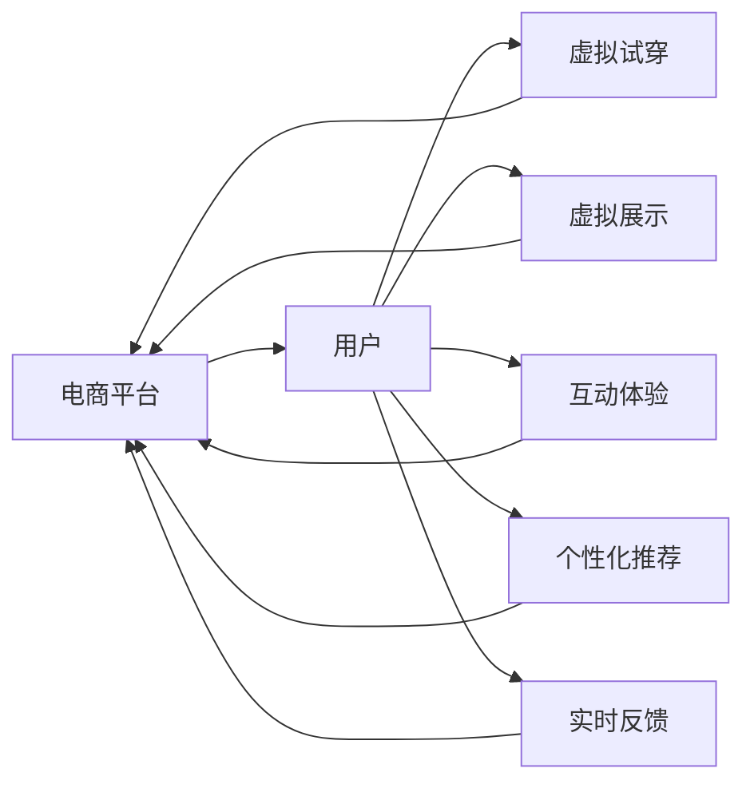

                 

# 增强现实技术在电商领域的应用：案例分析与展望

> 关键词：增强现实, AR, 电商, 增强现实技术, 智能购物, 虚拟试衣间, 互动体验, AR购物, 应用案例

## 1. 背景介绍

### 1.1 问题由来

随着移动互联网和智能设备的普及，电子商务已成为现代消费的主要渠道之一。传统的电商购物方式以图片和文字为主，用户难以直观体验商品的细节和效果。增强现实（AR）技术作为一项前沿技术，通过将虚拟信息与现实世界相结合，可以为用户提供沉浸式的购物体验，极大提升电商平台的竞争力和用户体验。

### 1.2 问题核心关键点

增强现实技术在电商领域的应用，主要是通过虚拟模型、虚拟试穿等方式，使消费者能够直观地看到商品的外观、尺寸、材质、颜色等，从而更好地进行商品选择和购买决策。

这种技术主要包括以下几个核心关键点：
- **虚拟试穿**：利用AR技术，消费者可以在家中试穿虚拟服装，真实感受其外观和材质。
- **互动体验**：通过手势、语音等自然交互方式，提升用户对商品的沉浸感和互动性。
- **智能推荐**：通过深度学习等技术，实时分析用户行为和偏好，推荐个性化商品。
- **虚拟展示**：通过3D模型等技术，展示商品的多角度细节，使用户更好地了解商品。

这些关键技术的应用，不仅提升了用户的购物体验，也推动了电商平台的个性化、精准化发展。

### 1.3 问题研究意义

增强现实技术在电商领域的应用，可以带来以下几方面的重要意义：
- **提升用户体验**：通过AR技术，用户可以更直观地了解商品，减少因信息不对称导致的决策错误。
- **优化购物流程**：用户无需亲自到实体店，即可享受试穿、试用等购物体验，节省时间和体力。
- **扩大市场空间**：尤其是对于偏远或线上购物不便的地区，AR技术可以带来新的消费场景，扩大市场覆盖。
- **促进销售增长**：通过个性化推荐和精准营销，提升用户购买转化率和客户满意度。
- **推动技术创新**：AR技术的引入，可以带动虚拟现实、机器学习、计算机视觉等技术的发展，促进整体技术进步。

## 2. 核心概念与联系

### 2.1 核心概念概述

增强现实技术（AR）是指通过计算机视觉、传感器、多媒体技术等，将虚拟信息叠加到用户实际环境中，实现虚实融合的体验。在电商领域，AR技术主要用于虚拟试穿、虚拟展示、互动体验等场景，提升用户的购物体验和满意度。

### 2.2 核心概念原理和架构的 Mermaid 流程图



这个流程图展示了增强现实技术在电商领域的应用流程：用户通过电商平台，使用AR技术体验虚拟试穿、虚拟展示等，获取个性化推荐和实时反馈，最终完成购物决策。

## 3. 核心算法原理 & 具体操作步骤

### 3.1 算法原理概述

增强现实技术在电商领域的应用，主要依赖于计算机视觉、传感器技术、图像处理、3D建模等技术。以下是对关键算法的介绍：

- **计算机视觉**：通过摄像头、传感器等设备，捕捉用户环境和商品图像，实现实时的物体识别和跟踪。
- **图像处理**：对捕捉到的图像进行滤波、增强、分割等处理，提取商品特征。
- **3D建模**：将商品转化为3D模型，进行虚拟试穿、展示等操作。
- **手势识别**：通过手势传感器、摄像头等，实现用户与虚拟信息的自然交互。
- **虚拟试穿**：将3D模型应用到用户实际环境中，实现试穿效果。
- **个性化推荐**：利用机器学习技术，分析用户行为和偏好，推荐相关商品。

### 3.2 算法步骤详解

#### 3.2.1 计算机视觉

1. **图像采集**：使用摄像头或传感器捕捉用户和商品图像。
2. **预处理**：对图像进行滤波、增强、去噪等预处理，提高识别准确率。
3. **目标检测**：使用卷积神经网络（CNN）等模型，进行物体识别和跟踪。
4. **特征提取**：对目标区域进行分割、特征提取，生成商品特征向量。

#### 3.2.2 3D建模

1. **扫描建模**：使用激光扫描仪、3D相机等设备，扫描商品表面，生成点云数据。
2. **点云处理**：对点云数据进行平滑、合并、去噪等处理，生成完整的3D模型。
3. **纹理贴图**：将3D模型进行纹理贴图，还原商品的外观和材质。
4. **场景渲染**：将3D模型应用到虚拟环境中，进行渲染和展示。

#### 3.2.3 手势识别

1. **传感器捕捉**：使用手势传感器、摄像头等设备，捕捉用户的手势动作。
2. **动作识别**：通过机器学习模型，对手势动作进行识别和分类。
3. **自然交互**：根据手势动作，进行相应的虚拟操作，如调整虚拟服装尺寸、颜色等。

#### 3.2.4 虚拟试穿

1. **身体扫描**：使用3D扫描仪，扫描用户身体，生成身体模型。
2. **服装匹配**：将虚拟服装应用到身体模型上，进行试穿效果展示。
3. **效果调整**：根据用户反馈，调整服装尺寸、颜色等参数，优化试穿效果。

### 3.3 算法优缺点

增强现实技术在电商领域的应用，具有以下优点：
1. **沉浸体验**：用户可以直观体验商品的外观、尺寸、材质等，减少因信息不对称导致的决策错误。
2. **节省时间和体力**：用户无需亲自到实体店，即可享受试穿、试用等购物体验，节省时间和体力。
3. **扩大市场空间**：尤其是对于偏远或线上购物不便的地区，AR技术可以带来新的消费场景，扩大市场覆盖。
4. **提升销售转化率**：通过个性化推荐和精准营销，提升用户购买转化率和客户满意度。

同时，也存在一些缺点：
1. **技术成本高**：AR技术需要高精度的传感器、3D建模等设备和技术支持，成本较高。
2. **数据隐私问题**：用户隐私数据采集和存储，需要严格的数据保护措施。
3. **设备兼容性**：不同平台和设备的兼容性问题，需要进一步解决。
4. **技术复杂性**：AR技术的开发和部署，需要较高的技术门槛。

### 3.4 算法应用领域

增强现实技术在电商领域的应用，主要集中在以下几个方面：

- **虚拟试穿**：用户在电商平台上，通过AR技术试穿虚拟服装，真实感受其外观和材质。
- **虚拟展示**：通过3D模型等技术，展示商品的多角度细节，使用户更好地了解商品。
- **互动体验**：通过手势、语音等自然交互方式，提升用户对商品的沉浸感和互动性。
- **个性化推荐**：利用深度学习等技术，实时分析用户行为和偏好，推荐个性化商品。
- **AR购物助手**：通过AR技术，为用户提供购物助手，实时获取商品信息，进行购买决策。

这些应用场景的实现，不仅提升了用户的购物体验，也为电商平台的个性化、精准化发展提供了新的途径。

## 4. 数学模型和公式 & 详细讲解 & 举例说明

### 4.1 数学模型构建

增强现实技术在电商领域的应用，主要依赖于计算机视觉、3D建模、手势识别等技术。以下是数学模型的构建：

#### 4.1.1 计算机视觉模型

1. **图像采集**：$I$ 表示采集到的图像，$I \in \mathbb{R}^{H \times W \times C}$，其中 $H$、$W$ 和 $C$ 分别表示图像的高度、宽度和通道数。
2. **预处理**：对图像进行滤波、增强等预处理，生成处理后的图像 $I' = \text{Preprocess}(I)$。
3. **目标检测**：使用CNN模型进行目标检测，输出检测框 $B = \text{Detect}(I')$。
4. **特征提取**：对目标区域进行分割、特征提取，生成商品特征向量 $F = \text{ExtractFeature}(B)$。

#### 4.1.2 3D建模模型

1. **扫描建模**：使用激光扫描仪扫描商品表面，生成点云数据 $P = \text{Scan}(\text{Product})$。
2. **点云处理**：对点云数据进行平滑、合并等处理，生成完整的3D模型 $M = \text{Process}(P)$。
3. **纹理贴图**：将3D模型进行纹理贴图，还原商品的外观和材质 $T = \text{Texture}(M)$。
4. **场景渲染**：将3D模型应用到虚拟环境中，进行渲染和展示 $R = \text{Render}(M, T)$。

#### 4.1.3 手势识别模型

1. **传感器捕捉**：使用手势传感器捕捉用户的手势动作 $G = \text{Capture}(\text{Gesture})$。
2. **动作识别**：通过机器学习模型对手势动作进行识别和分类 $C = \text{Classify}(G)$。
3. **自然交互**：根据手势动作，进行相应的虚拟操作 $O = \text{Interact}(C)$。

#### 4.1.4 虚拟试穿模型

1. **身体扫描**：使用3D扫描仪扫描用户身体，生成身体模型 $B = \text{Scan}(\text{User})$。
2. **服装匹配**：将虚拟服装应用到身体模型上，进行试穿效果展示 $S = \text{Match}(B, C)$。
3. **效果调整**：根据用户反馈，调整服装尺寸、颜色等参数，优化试穿效果 $A = \text{Adjust}(S, F)$。

### 4.2 公式推导过程

以下是关键公式的推导过程：

#### 4.2.1 计算机视觉中的目标检测

目标检测是计算机视觉中的重要任务，常用的目标检测算法包括RCNN、Fast RCNN、Faster RCNN、YOLO等。以YOLO为例，其目标检测过程可以表示为：

$$
B = \text{YOLO}(I') = \text{Convolution}(I') + \text{Deconvolution} + \text{Softmax}
$$

其中 $\text{Convolution}$ 表示卷积操作，$\text{Deconvolution}$ 表示反卷积操作，$\text{Softmax}$ 表示分类操作。

#### 4.2.2 3D建模中的点云处理

点云处理是3D建模中的关键步骤，常用的处理方法包括平面拟合、点云分割等。以平面拟合为例，其过程可以表示为：

$$
M = \text{PlaneFit}(P) = \text{NormalEstimate}(P) + \text{PCA}(P)
$$

其中 $\text{NormalEstimate}$ 表示法向量估计，$\text{PCA}$ 表示主成分分析。

#### 4.2.3 手势识别中的动作识别

手势识别常用的方法是基于深度学习的分类算法，如CNN、RNN等。以CNN为例，其动作识别过程可以表示为：

$$
C = \text{CNN}(G) = \text{Convolution}(G) + \text{Pooling} + \text{Dropout} + \text{Softmax}
$$

其中 $\text{Convolution}$ 表示卷积操作，$\text{Pooling}$ 表示池化操作，$\text{Dropout}$ 表示丢弃操作，$\text{Softmax}$ 表示分类操作。

#### 4.2.4 虚拟试穿中的服装匹配

虚拟试穿是增强现实技术的重要应用，常用的方法是基于3D模型的匹配算法。以匹配算法为例，其过程可以表示为：

$$
S = \text{Match}(B, C) = \text{PoseEstimate}(B) + \text{Fitting}(B, C)
$$

其中 $\text{PoseEstimate}$ 表示姿势估计，$\text{Fitting}$ 表示试穿拟合。

### 4.3 案例分析与讲解

#### 4.3.1 虚拟试穿案例

某电商平台在用户试穿服装时，通过AR技术实现了虚拟试穿功能。用户只需在APP上选择服装，摄像头捕捉用户身体图像，即可自动试穿虚拟服装。具体步骤如下：

1. **用户选择服装**：用户在电商平台上选择试穿的服装。
2. **捕捉身体图像**：用户打开APP，对准摄像头进行身体图像捕捉。
3. **身体模型生成**：APP使用3D扫描仪，扫描用户身体，生成身体模型。
4. **虚拟服装匹配**：APP将虚拟服装应用到身体模型上，进行试穿效果展示。
5. **效果调整**：用户可以通过APP调整服装尺寸、颜色等参数，优化试穿效果。
6. **购买决策**：用户确认试穿效果后，可以直接在APP上购买商品。

#### 4.3.2 虚拟展示案例

某家居电商通过AR技术，实现了虚拟家具展示功能。用户可以在家中试看虚拟家具的摆放效果，减少因实物展示不全导致的决策错误。具体步骤如下：

1. **用户选择家具**：用户在电商平台上选择试看的家具。
2. **捕捉房间图像**：用户打开APP，对准摄像头进行房间图像捕捉。
3. **3D家具建模**：APP使用激光扫描仪，扫描家具表面，生成3D模型。
4. **虚拟展示**：APP将3D家具应用到房间环境中，进行虚拟展示。
5. **调整位置**：用户可以通过APP调整家具的位置和角度，优化摆放效果。
6. **购买决策**：用户确认虚拟展示效果后，可以直接在APP上购买家具。

## 5. 项目实践：代码实例和详细解释说明

### 5.1 开发环境搭建

在进行AR技术开发前，我们需要准备好开发环境。以下是使用Python进行AR开发的环境配置流程：

1. 安装Anaconda：从官网下载并安装Anaconda，用于创建独立的Python环境。

2. 创建并激活虚拟环境：
```bash
conda create -n ar-env python=3.8 
conda activate ar-env
```

3. 安装OpenCV：
```bash
pip install opencv-python-headless
```

4. 安装PyTorch：
```bash
pip install torch torchvision torchaudio
```

5. 安装深度学习框架：
```bash
pip install tensorflow
```

6. 安装AR开发库：
```bash
pip install artoolkit-python
```

完成上述步骤后，即可在`ar-env`环境中开始AR开发实践。

### 5.2 源代码详细实现

以下是使用Python进行AR技术开发的代码示例：

```python
import cv2
import numpy as np
import artoolkit

# 加载AR相机
cam = artoolkit.ArToolKit3D()

# 打开摄像头
cap = cv2.VideoCapture(0)

while True:
    # 捕捉图像
    ret, frame = cap.read()
    
    # 检测目标
    image = np.array(frame)
    result = cam.detectMarkers(image)
    
    # 绘制标记框
    if result is not None:
        for id, pos, size in result[0]:
            cv2.rectangle(frame, (int(pos[0]), int(pos[1])), (int(pos[0] + size[0]), int(pos[1] + size[1])), (0, 0, 255), 2)
    
    # 显示图像
    cv2.imshow('AR Camera', frame)
    
    # 等待按键退出
    if cv2.waitKey(1) == ord('q'):
        break

# 关闭摄像头
cap.release()
cv2.destroyAllWindows()
```

以上代码展示了AR相机在摄像头上捕捉图像，并检测目标物体的过程。通过绘制标记框，可以实现虚拟物体与现实世界的融合。开发者可以根据实际需求，进一步实现虚拟试穿、虚拟展示等功能。

### 5.3 代码解读与分析

让我们再详细解读一下关键代码的实现细节：

**artoolkit库**：
- 加载AR相机：使用`artoolkit.ArToolKit3D()`加载AR相机库。
- 打开摄像头：使用`cv2.VideoCapture(0)`打开摄像头设备。
- 捕捉图像：使用`cap.read()`捕捉摄像头图像。
- 检测目标：使用`cam.detectMarkers()`检测图像中的AR标记。
- 绘制标记框：使用`cv2.rectangle()`绘制目标物体的标记框。
- 显示图像：使用`cv2.imshow()`显示摄像头图像。
- 等待按键退出：使用`cv2.waitKey()`等待按键事件，判断是否退出。
- 关闭摄像头：使用`cap.release()`释放摄像头资源，`cv2.destroyAllWindows()`关闭窗口。

**关键步骤**：
- 加载AR相机库和摄像头资源。
- 循环捕捉摄像头图像，并检测目标物体。
- 对检测到的目标物体进行标记和显示。
- 等待按键退出，关闭摄像头和窗口。

开发者可以根据实际需求，扩展代码实现更多功能，如虚拟试穿、虚拟展示等。

## 6. 实际应用场景

### 6.1 智能购物助手

智能购物助手是增强现实技术在电商领域的重要应用之一。用户可以通过购物助手，获取商品信息、进行虚拟试穿、虚拟展示等，提升购物体验。

具体实现方式如下：
1. **商品信息获取**：用户通过购物助手扫描商品标签，获取商品信息。
2. **虚拟试穿**：购物助手通过AR技术，将虚拟服装应用到用户身体上，进行试穿效果展示。
3. **虚拟展示**：购物助手通过AR技术，展示商品的多角度细节，使用户更好地了解商品。
4. **个性化推荐**：购物助手通过深度学习技术，实时分析用户行为和偏好，推荐个性化商品。

### 6.2 虚拟试穿

虚拟试穿是增强现实技术在电商领域的重要应用之一。用户可以在家中试穿虚拟服装，真实感受其外观和材质。

具体实现方式如下：
1. **用户选择服装**：用户在电商平台上选择试穿的服装。
2. **捕捉身体图像**：用户打开APP，对准摄像头进行身体图像捕捉。
3. **身体模型生成**：APP使用3D扫描仪，扫描用户身体，生成身体模型。
4. **虚拟服装匹配**：APP将虚拟服装应用到身体模型上，进行试穿效果展示。
5. **效果调整**：用户可以通过APP调整服装尺寸、颜色等参数，优化试穿效果。

### 6.3 虚拟展示

虚拟展示是增强现实技术在电商领域的重要应用之一。用户可以在家中试看虚拟家具的摆放效果，减少因实物展示不全导致的决策错误。

具体实现方式如下：
1. **用户选择家具**：用户在电商平台上选择试看的家具。
2. **捕捉房间图像**：用户打开APP，对准摄像头进行房间图像捕捉。
3. **3D家具建模**：APP使用激光扫描仪，扫描家具表面，生成3D模型。
4. **虚拟展示**：APP将3D家具应用到房间环境中，进行虚拟展示。
5. **调整位置**：用户可以通过APP调整家具的位置和角度，优化摆放效果。

### 6.4 未来应用展望

增强现实技术在电商领域的应用前景广阔，未来将呈现以下几个趋势：

1. **实时渲染**：增强现实技术将进一步优化渲染算法，实现实时渲染，提升用户体验。
2. **多模态交互**：结合语音、手势、表情等多种交互方式，实现更自然的人机交互。
3. **个性化推荐**：利用深度学习等技术，实时分析用户行为和偏好，推荐个性化商品。
4. **无缝集成**：增强现实技术将与物联网、AR眼镜等设备无缝集成，实现更便捷的购物体验。
5. **跨平台应用**：增强现实技术将实现跨平台应用，支持多终端设备，提升普及率。

这些趋势将进一步推动增强现实技术在电商领域的应用，提升用户的购物体验和电商平台的竞争能力。

## 7. 工具和资源推荐

### 7.1 学习资源推荐

为了帮助开发者系统掌握增强现实技术在电商领域的应用，这里推荐一些优质的学习资源：

1. **ARKit官方文档**：苹果公司提供的ARKit开发文档，包含详细的API和示例代码，适用于iOS平台。
2. **ARCore官方文档**：谷歌公司提供的ARCore开发文档，包含详细的API和示例代码，适用于Android平台。
3. **AR.js官方文档**：一个开源的WebAR框架，支持多终端设备和浏览器，适用于Web平台。
4. **增强现实技术教程**：Bilibili、YouTube等平台上有大量AR技术教程，涵盖基本原理、开发实践等内容。
5. **AR开发工具集**：Unity、Unreal Engine等游戏引擎提供AR开发支持，适用于专业开发者。

通过对这些资源的学习实践，相信你一定能够快速掌握增强现实技术在电商领域的应用，并用于解决实际的电商问题。

### 7.2 开发工具推荐

高效的开发离不开优秀的工具支持。以下是几款用于增强现实技术在电商领域开发的常用工具：

1. **OpenCV**：开源的计算机视觉库，支持图像处理、目标检测等任务，适用于多种平台。
2. **ArToolKit**：开源的AR开发库，支持Windows、Linux等操作系统，适用于PC平台。
3. **ARKit**：苹果公司提供的AR开发框架，支持iOS平台，提供丰富的API和示例代码。
4. **ARCore**：谷歌公司提供的AR开发框架，支持Android平台，提供丰富的API和示例代码。
5. **AR.js**：开源的WebAR框架，支持多终端设备和浏览器，适用于Web平台。

合理利用这些工具，可以显著提升增强现实技术在电商领域的开发效率，加快创新迭代的步伐。

### 7.3 相关论文推荐

增强现实技术在电商领域的发展，源于学界的持续研究。以下是几篇奠基性的相关论文，推荐阅读：

1. **ARKit技术概述**：苹果公司发表的ARKit技术白皮书，介绍了ARKit的技术架构和开发实践。
2. **ARCore技术概述**：谷歌公司发表的ARCore技术白皮书，介绍了ARCore的技术架构和开发实践。
3. **AR.js技术概述**：AR.js项目的官方文档，介绍了AR.js的技术架构和开发实践。
4. **增强现实技术在电商中的应用**：国外学者发表的相关论文，介绍了增强现实技术在电商领域的应用案例和技术挑战。

这些论文代表了大语言模型微调技术的发展脉络。通过学习这些前沿成果，可以帮助研究者把握学科前进方向，激发更多的创新灵感。

## 8. 总结：未来发展趋势与挑战

### 8.1 总结

本文对增强现实技术在电商领域的应用进行了全面系统的介绍。首先阐述了增强现实技术在电商领域的应用背景和意义，明确了AR技术在虚拟试穿、虚拟展示、智能购物助手等方面的重要价值。其次，从原理到实践，详细讲解了AR技术在电商领域的关键算法和操作步骤，给出了增强现实技术在电商领域的完整代码实例。同时，本文还广泛探讨了增强现实技术在电商领域的应用场景，展示了AR技术在电商领域的广阔前景。此外，本文精选了增强现实技术在电商领域的各类学习资源，力求为读者提供全方位的技术指引。

通过本文的系统梳理，可以看到，增强现实技术在电商领域的应用，不仅提升了用户的购物体验，也推动了电商平台的个性化、精准化发展。未来，伴随AR技术的不断进步，电商平台的智能化水平将进一步提升，用户购物体验将更加丰富和便捷。

### 8.2 未来发展趋势

增强现实技术在电商领域的应用，将呈现以下几个发展趋势：

1. **实时渲染**：增强现实技术将进一步优化渲染算法，实现实时渲染，提升用户体验。
2. **多模态交互**：结合语音、手势、表情等多种交互方式，实现更自然的人机交互。
3. **个性化推荐**：利用深度学习等技术，实时分析用户行为和偏好，推荐个性化商品。
4. **无缝集成**：增强现实技术将与物联网、AR眼镜等设备无缝集成，实现更便捷的购物体验。
5. **跨平台应用**：增强现实技术将实现跨平台应用，支持多终端设备，提升普及率。

这些趋势将进一步推动增强现实技术在电商领域的应用，提升用户的购物体验和电商平台的竞争能力。

### 8.3 面临的挑战

尽管增强现实技术在电商领域的应用已经取得了显著进展，但在迈向更加智能化、普适化应用的过程中，它仍面临着诸多挑战：

1. **技术成本高**：AR技术需要高精度的传感器、3D建模等设备和技术支持，成本较高。
2. **数据隐私问题**：用户隐私数据采集和存储，需要严格的数据保护措施。
3. **设备兼容性**：不同平台和设备的兼容性问题，需要进一步解决。
4. **技术复杂性**：AR技术的开发和部署，需要较高的技术门槛。

正视增强现实技术在电商领域的应用所面临的挑战，积极应对并寻求突破，将是大语言模型微调走向成熟的必由之路。相信随着学界和产业界的共同努力，这些挑战终将一一被克服，增强现实技术在电商领域的市场应用将更加广泛。

### 8.4 研究展望

面对增强现实技术在电商领域的应用所面临的挑战，未来的研究需要在以下几个方面寻求新的突破：

1. **优化渲染算法**：进一步优化实时渲染算法，提升用户体验。
2. **改进交互方式**：结合多模态交互技术，提升自然交互能力。
3. **提升个性化推荐**：利用深度学习等技术，提高个性化推荐的精度和实时性。
4. **增强设备兼容性**：实现跨平台应用，支持多种设备和操作系统。
5. **提升数据隐私保护**：严格保护用户隐私数据，实现数据安全。
6. **降低技术门槛**：简化AR技术的开发和部署，降低技术门槛。

这些研究方向的探索，必将引领增强现实技术在电商领域的应用迈向更高的台阶，为电商平台的智能化发展提供新的动力。面向未来，增强现实技术在电商领域的应用还需要与其他人工智能技术进行更深入的融合，如知识表示、因果推理、强化学习等，多路径协同发力，共同推动电商平台的创新与发展。只有勇于创新、敢于突破，才能不断拓展增强现实技术在电商领域的边界，让智能技术更好地造福人类社会。

## 9. 附录：常见问题与解答

**Q1：增强现实技术在电商领域的应用是否需要高精度传感器？**

A: 增强现实技术在电商领域的应用，需要高精度的摄像头和传感器，以便捕捉用户和商品的详细信息。不同类型的传感器，如深度相机、立体相机等，可以提升捕捉精度和深度信息。

**Q2：增强现实技术在电商领域的应用是否需要高精度3D建模？**

A: 增强现实技术在电商领域的应用，需要高精度的3D建模技术，以便将商品转化为3D模型，进行虚拟试穿、展示等操作。不同类型的3D建模技术，如点云扫描、激光扫描等，可以提升建模精度和效率。

**Q3：增强现实技术在电商领域的应用是否需要高精度渲染？**

A: 增强现实技术在电商领域的应用，需要高精度的渲染算法，以便将虚拟物体与现实世界融合，提升用户体验。不同类型的渲染算法，如光照渲染、材质渲染等，可以提升渲染效果和实时性。

**Q4：增强现实技术在电商领域的应用是否需要高精度手势识别？**

A: 增强现实技术在电商领域的应用，需要高精度手势识别技术，以便实现自然交互，提升用户沉浸感。不同类型的手势识别技术，如深度学习、行为分析等，可以提升识别精度和实时性。

**Q5：增强现实技术在电商领域的应用是否需要高精度目标检测？**

A: 增强现实技术在电商领域的应用，需要高精度目标检测技术，以便准确捕捉用户和商品，进行虚拟试穿、展示等操作。不同类型的目标检测技术，如CNN、YOLO等，可以提升检测精度和效率。

这些问题的解答，展示了增强现实技术在电商领域的应用需要考虑的技术要求和挑战，帮助开发者在实际开发中更好地应对这些挑战。

---

作者：禅与计算机程序设计艺术 / Zen and the Art of Computer Programming

