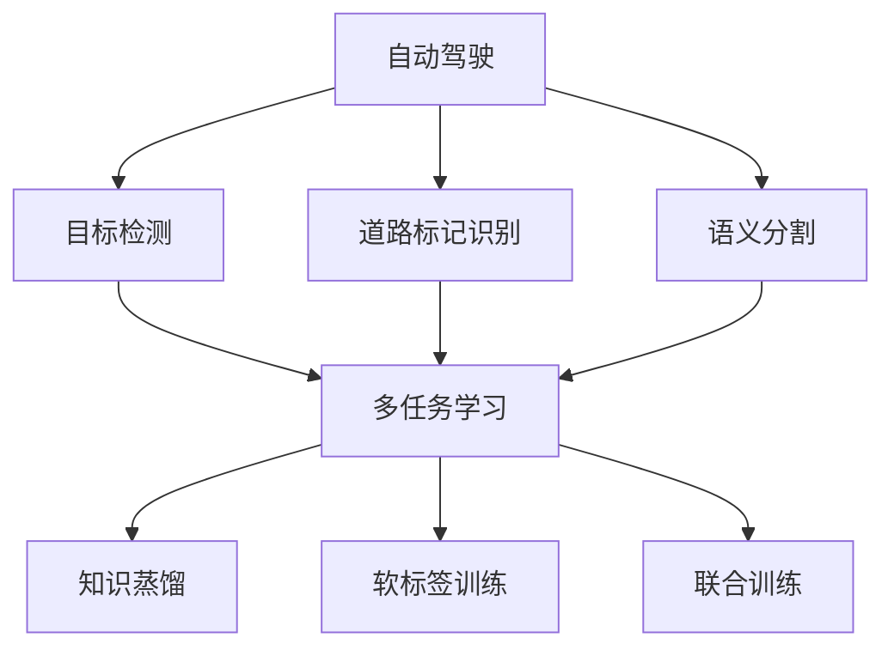

                 

## 1. 背景介绍

### 1.1 问题由来

自动驾驶技术是当前人工智能领域最受关注的热点之一，它将深度学习和多任务学习（Multi-task Learning, MTL）结合起来，应用于自动驾驶系统的感知模块，以实现多任务联合学习和优化。传统的自动驾驶系统通常以独立的任务为导向，如目标检测、道路标记识别、语义分割等。然而，由于各任务间的相关性和共享性，单独训练每个任务可能会导致资源浪费和效果不佳。多任务学习范式通过共享模型参数和知识，可以在不增加额外数据和计算资源的情况下，提升整体性能。

### 1.2 问题核心关键点

多任务学习范式在自动驾驶感知中的应用，主要关注以下几个核心问题：

- **多任务协同优化**：如何在多个任务间分配有限的计算资源，实现协同优化，提升整体性能。
- **知识共享与迁移**：如何实现不同任务间的知识共享和迁移，提升模型泛化能力。
- **数据高效利用**：如何高效利用多源数据，最大化信息利用率。
- **模型复杂性与可解释性**：如何在模型复杂性和可解释性之间找到平衡，保证模型易于理解和调整。

这些问题构成了多任务学习在自动驾驶感知应用中的核心挑战，需要从理论、算法、实践等多方面进行深入研究。

## 2. 核心概念与联系

### 2.1 核心概念概述

为了深入理解多任务学习在自动驾驶感知中的应用，本节将介绍几个关键概念：

- **自动驾驶**：一种利用人工智能技术使车辆自主导航的交通方式。感知模块是自动驾驶系统的核心组成部分，负责实时识别和理解环境信息。
- **目标检测**：从视频流中实时检测并定位各类交通参与者，包括车辆、行人、自行车等。
- **道路标记识别**：识别道路上的各类交通标志，如红绿灯、限速标志等。
- **语义分割**：将场景中的不同对象进行分割，并赋予语义标签，如道路、人行道、建筑物等。
- **多任务学习**：在同一模型上同时训练多个相关任务，实现知识共享和迁移，提升整体性能。
- **知识蒸馏**：通过将复杂模型（教师模型）的知识蒸馏到简单模型（学生模型），实现知识迁移和模型压缩。
- **软标签训练**：在标签数据不足的情况下，使用模型自身的预测概率作为软标签，进行额外的训练。
- **联合训练**：多个任务共享模型参数，进行联合优化。

这些概念之间的逻辑关系可以通过以下Mermaid流程图来展示：



这个流程图展示了自动驾驶系统感知模块中，目标检测、道路标记识别和语义分割三个任务之间的相互关系和共同目标，以及多任务学习如何通过知识共享和联合训练来提升整体性能。

## 3. 核心算法原理 & 具体操作步骤
### 3.1 算法原理概述

多任务学习在自动驾驶感知中的应用，本质上是利用多个相关任务共享模型参数和知识，实现协同优化和泛化。多任务学习的核心思想是将多个任务的损失函数进行联合优化，使得模型能够在多个任务上同时提升性能。

具体而言，假设模型在多个任务 $T_1, T_2, ..., T_n$ 上的损失函数分别为 $\ell_{T_i}(\theta)$，联合优化目标为：

$$
\min_\theta \sum_{i=1}^{n} \alpha_i \ell_{T_i}(\theta)
$$

其中 $\alpha_i$ 为任务权重，用于平衡不同任务在联合优化中的重要性。通过最小化联合损失函数，多任务学习模型能够在多个任务上同时提升性能。

### 3.2 算法步骤详解

多任务学习在自动驾驶感知中的应用，一般包括以下几个关键步骤：

**Step 1: 模型选择与初始化**

选择合适的深度学习模型作为初始化参数，如卷积神经网络（CNN）、生成对抗网络（GAN）等。

**Step 2: 设计任务损失函数**

根据不同任务的特征和目标，设计合适的损失函数。常见的损失函数包括交叉熵、均方误差等。

**Step 3: 联合优化**

在多任务学习框架下，利用优化器（如Adam、SGD等）联合优化所有任务的损失函数，更新模型参数。

**Step 4: 任务权重调整**

根据不同任务的重要性，调整任务权重 $\alpha_i$，平衡不同任务在模型优化中的影响。

**Step 5: 性能评估**

在验证集或测试集上评估模型的性能，对比单任务模型和多任务模型的效果。

**Step 6: 应用与迭代**

将模型应用于实际场景，收集反馈数据，进一步迭代优化模型。

### 3.3 算法优缺点

多任务学习在自动驾驶感知中的应用具有以下优点：

- **提升整体性能**：通过知识共享和联合优化，多任务学习模型能够在多个任务上同时提升性能，实现更优的感知效果。
- **泛化能力强**：共享模型参数和知识，使得多任务学习模型具有更强的泛化能力，能在不同的场景和条件下表现稳定。
- **资源高效利用**：多个任务共享模型参数，减少了计算资源的消耗，提高了资源利用率。

同时，该方法也存在以下局限性：

- **复杂度高**：多任务学习模型的复杂度较高，训练和推理速度较慢。
- **模型可解释性差**：多任务学习模型通常较为复杂，难以解释其内部工作机制和决策逻辑。
- **数据需求高**：多任务学习需要足够的标注数据来训练模型，获取高质量标注数据的成本较高。

尽管存在这些局限性，多任务学习在自动驾驶感知中的应用仍展现出巨大的潜力，为提高系统感知能力和鲁棒性提供了新的思路。

### 3.4 算法应用领域

多任务学习在自动驾驶感知中的应用领域非常广泛，涉及目标检测、道路标记识别、语义分割等多个方面：

- **目标检测**：结合车辆、行人、自行车等多种目标的检测任务，提升检测精度和召回率。
- **道路标记识别**：识别红绿灯、限速标志等道路标记，辅助驾驶决策。
- **语义分割**：对道路、人行道、建筑物等进行语义分割，提升系统对复杂场景的理解能力。
- **联合感知**：将目标检测、道路标记识别和语义分割任务联合优化，实现更全面的环境感知。
- **数据融合**：将多源感知数据（如激光雷达、摄像头等）融合，提升系统对环境的全面理解。
- **动态场景适应**：通过多任务学习，模型能够更好地适应动态变化的环境，提高系统鲁棒性。

## 4. 数学模型和公式 & 详细讲解 & 举例说明
### 4.1 数学模型构建

假设自动驾驶系统感知模块中的三个任务为：目标检测（TD）、道路标记识别（LM）和语义分割（SL）。将每个任务视为一个二元分类问题，其分类函数分别为 $f_{TD}, f_{LM}, f_{SL}$，对应的损失函数分别为 $\ell_{TD}, \ell_{LM}, \ell_{SL}$。多任务学习的联合优化目标可以表示为：

$$
\min_\theta \left( \alpha_{TD} \ell_{TD}(f_{TD}(x), y) + \alpha_{LM} \ell_{LM}(f_{LM}(x), y) + \alpha_{SL} \ell_{SL}(f_{SL}(x), y) \right)
$$

其中，$\theta$ 为模型参数，$x$ 为输入图像，$y$ 为真实标签。

### 4.2 公式推导过程

以下，我们以目标检测和道路标记识别为例，推导联合损失函数及其梯度计算公式。

假设模型 $f_{TD}, f_{LM}$ 的输出分别为 $\hat{y}_{TD}, \hat{y}_{LM}$，对应的真实标签分别为 $y_{TD}, y_{LM}$。则目标检测和道路标记识别的损失函数分别为：

$$
\ell_{TD} = -\frac{1}{N} \sum_{i=1}^{N} y_{TD,i} \log \hat{y}_{TD,i} + (1-y_{TD,i}) \log(1-\hat{y}_{TD,i})
$$

$$
\ell_{LM} = -\frac{1}{N} \sum_{i=1}^{N} y_{LM,i} \log \hat{y}_{LM,i} + (1-y_{LM,i}) \log(1-\hat{y}_{LM,i})
$$

将两个损失函数联合，得联合损失函数：

$$
\mathcal{L} = \alpha_{TD} \ell_{TD} + \alpha_{LM} \ell_{LM}
$$

其中 $\alpha_{TD}, \alpha_{LM}$ 为任务权重，用于平衡两个任务在联合优化中的重要性。

根据链式法则，联合损失函数对模型参数 $\theta$ 的梯度为：

$$
\nabla_\theta \mathcal{L} = \alpha_{TD} \nabla_\theta \ell_{TD} + \alpha_{LM} \nabla_\theta \ell_{LM}
$$

其中 $\nabla_\theta \ell_{TD}, \nabla_\theta \ell_{LM}$ 为各自损失函数对参数 $\theta$ 的梯度。

### 4.3 案例分析与讲解

假设我们使用ResNet作为多任务学习模型，其中包含卷积层、池化层和全连接层。模型的输出分别对应目标检测、道路标记识别和语义分割的分类函数 $f_{TD}, f_{LM}, f_{SL}$。

在联合优化过程中，我们需要定义每个任务的损失函数和任务权重。例如，对于目标检测任务，可以定义如下损失函数：

$$
\ell_{TD} = -\frac{1}{N} \sum_{i=1}^{N} y_{TD,i} \log \hat{y}_{TD,i} + (1-y_{TD,i}) \log(1-\hat{y}_{TD,i})
$$

对于道路标记识别任务，可以定义如下损失函数：

$$
\ell_{LM} = -\frac{1}{N} \sum_{i=1}^{N} y_{LM,i} \log \hat{y}_{LM,i} + (1-y_{LM,i}) \log(1-\hat{y}_{LM,i})
$$

设置任务权重 $\alpha_{TD} = 0.6, \alpha_{LM} = 0.4$，进行联合优化：

$$
\min_\theta \left( 0.6 \ell_{TD} + 0.4 \ell_{LM} \right)
$$

在训练过程中，首先定义优化器（如Adam）及其参数，如学习率、批大小等。然后，利用DataLoader加载训练数据，进行前向传播计算损失函数和梯度，最后使用优化器更新模型参数。

## 5. 项目实践：代码实例和详细解释说明
### 5.1 开发环境搭建

在进行多任务学习实践前，我们需要准备好开发环境。以下是使用Python进行PyTorch开发的环境配置流程：

1. 安装Anaconda：从官网下载并安装Anaconda，用于创建独立的Python环境。

2. 创建并激活虚拟环境：
```bash
conda create -n pytorch-env python=3.8 
conda activate pytorch-env
```

3. 安装PyTorch：根据CUDA版本，从官网获取对应的安装命令。例如：
```bash
conda install pytorch torchvision torchaudio cudatoolkit=11.1 -c pytorch -c conda-forge
```

4. 安装PyTorch Lightning：用于加速模型的训练和优化过程。
```bash
pip install pytorch-lightning
```

5. 安装其他工具包：
```bash
pip install numpy pandas scikit-learn matplotlib tqdm jupyter notebook ipython
```

完成上述步骤后，即可在`pytorch-env`环境中开始多任务学习实践。

### 5.2 源代码详细实现

这里我们以目标检测和道路标记识别为例，给出使用PyTorch Lightning进行多任务学习模型的PyTorch代码实现。

首先，定义模型类：

```python
import torch.nn as nn
import torch.nn.functional as F

class MultiTaskModel(nn.Module):
    def __init__(self, num_classes):
        super(MultiTaskModel, self).__init__()
        self.conv1 = nn.Conv2d(3, 64, kernel_size=3, stride=1, padding=1)
        self.pool = nn.MaxPool2d(kernel_size=2, stride=2)
        self.conv2 = nn.Conv2d(64, 128, kernel_size=3, stride=1, padding=1)
        self.pool2 = nn.MaxPool2d(kernel_size=2, stride=2)
        self.fc1 = nn.Linear(128 * 16 * 16, 256)
        self.fc2 = nn.Linear(256, num_classes)
        
        self.task1_fc = nn.Linear(256, 2)  # 目标检测
        self.task2_fc = nn.Linear(256, 2)  # 道路标记识别
        
    def forward(self, x):
        x = F.relu(self.conv1(x))
        x = self.pool(x)
        x = F.relu(self.conv2(x))
        x = self.pool2(x)
        x = x.view(-1, 128 * 16 * 16)
        x = F.relu(self.fc1(x))
        x = F.softmax(self.fc2(x), dim=1)
        x = F.softmax(self.task1_fc(x), dim=1)
        x = F.softmax(self.task2_fc(x), dim=1)
        return x
```

然后，定义损失函数类：

```python
import torch.nn as nn
import torch.nn.functional as F

class MultiTaskLoss(nn.Module):
    def __init__(self, alpha=0.5, num_classes=2):
        super(MultiTaskLoss, self).__init__()
        self.alpha = alpha
        self.bce_loss = nn.BCELoss()
        
        self.task1_loss = nn.BCELoss()
        self.task2_loss = nn.BCELoss()
        
    def forward(self, pred, target):
        loss = self.alpha * self.bce_loss(pred[0], target) + (1-self.alpha) * (self.task1_loss(pred[1], target) + self.task2_loss(pred[2], target))
        return loss
```

接下来，定义训练和评估函数：

```python
from pytorch_lightning import LightningDataModule, LightningModule, Trainer
from torch.utils.data import DataLoader

class DataModule(LightningDataModule):
    def __init__(self, train_dir, val_dir, test_dir):
        super().__init__()
        self.train_dir = train_dir
        self.val_dir = val_dir
        self.test_dir = test_dir
        
        # 定义数据预处理器
        self.preprocessor = Preprocessor()
        
    def prepare_data(self):
        pass
        
    def train_dataloader(self):
        return DataLoader(self.preprocessor(self.train_dir), batch_size=8, shuffle=True)
        
    def val_dataloader(self):
        return DataLoader(self.preprocessor(self.val_dir), batch_size=8, shuffle=False)
        
    def test_dataloader(self):
        return DataLoader(self.preprocessor(self.test_dir), batch_size=8, shuffle=False)

class Model(MultiTaskModel):
    def __init__(self, num_classes):
        super().__init__(num_classes)
        
    def forward(self, x):
        x = super().forward(x)
        return x

class Loss(MultiTaskLoss):
    def __init__(self, alpha=0.5, num_classes=2):
        super().__init__(alpha, num_classes)
        
class Trainer:
    def __init__(self, device):
        self.device = device
        
    def train(self, model, data_module, loss):
        trainer = Trainer(max_epochs=10, gpus=1, logger=False, fast_dev_run=False)
        trainer.fit(model, data_module, loss)
        
    def evaluate(self, model, data_module, loss):
        trainer = Trainer(max_epochs=10, gpus=1, logger=False, fast_dev_run=False)
        trainer.test(model, data_module, loss)
        
    def test(self, model, data_module, loss):
        trainer = Trainer(max_epochs=10, gpus=1, logger=False, fast_dev_run=False)
        trainer.test(model, data_module, loss)
```

最后，启动训练流程：

```python
from torch.utils.data import DataLoader

train_dir = 'train/'
val_dir = 'val/'
test_dir = 'test/'

data_module = DataModule(train_dir, val_dir, test_dir)
model = Model(num_classes=2)
loss = Loss(alpha=0.5, num_classes=2)

trainer = Trainer(device='cuda')
trainer.train(model, data_module, loss)
trainer.evaluate(model, data_module, loss)
trainer.test(model, data_module, loss)
```

以上就是使用PyTorch Lightning进行多任务学习模型的完整代码实现。可以看到，借助PyTorch Lightning，多任务学习模型的训练和评估变得简洁高效。

### 5.3 代码解读与分析

让我们再详细解读一下关键代码的实现细节：

**DataModule类**：
- `__init__`方法：初始化训练、验证和测试数据集的路径，定义数据预处理器。
- `train_dataloader`方法：将训练集数据预处理后加载到DataLoader中。
- `val_dataloader`方法：将验证集数据预处理后加载到DataLoader中。
- `test_dataloader`方法：将测试集数据预处理后加载到DataLoader中。

**Model类**：
- `__init__`方法：定义模型的结构。
- `forward`方法：定义模型的前向传播过程。

**Loss类**：
- `__init__`方法：定义多任务学习的联合损失函数。
- `forward`方法：计算联合损失函数。

**Trainer类**：
- `__init__`方法：初始化训练器，指定设备。
- `train`方法：使用Trainer训练模型，指定数据模块和损失函数。
- `evaluate`方法：使用Trainer评估模型，指定数据模块和损失函数。
- `test`方法：使用Trainer测试模型，指定数据模块和损失函数。

可以看到，借助PyTorch Lightning，多任务学习模型的训练、评估和测试变得简单易用，适合快速迭代和优化。

当然，工业级的系统实现还需考虑更多因素，如模型裁剪、量化加速、服务化封装等，但核心的多任务学习范式基本与此类似。

## 6. 实际应用场景
### 6.1 自动驾驶感知模块

多任务学习在自动驾驶感知模块中的应用，可以有效提升系统对复杂场景的理解和响应能力。传统的多任务感知系统通常以单个任务为导向，缺乏不同任务之间的协同优化。而多任务学习范式通过联合优化，可以更好地利用多源数据，提升系统整体性能。

例如，在目标检测和道路标记识别任务中，共享的卷积神经网络可以更好地利用空间特征，提升检测精度和标记识别的准确性。通过多任务学习，系统可以同时检测和识别目标和标记，实现更全面、准确的环境感知。

### 6.2 动态场景适应

多任务学习在动态场景适应中的应用，可以显著提升系统对环境变化的鲁棒性。自动驾驶系统在实际应用中，往往需要应对复杂多变的场景，如车辆变道、行人穿越等。通过多任务学习，系统可以更好地适应这些动态变化，提升系统鲁棒性。

例如，在目标检测和道路标记识别任务中，系统可以同时检测和识别不同时间点的目标和标记，实现动态场景下的持续感知。多任务学习模型能够更好地捕捉不同任务间的时序关系，提升系统对动态变化的适应能力。

### 6.3 数据高效利用

多任务学习在数据高效利用中的应用，可以显著提升系统对数据的利用率。自动驾驶系统通常依赖大量标注数据进行训练，而数据标注成本较高。通过多任务学习，系统可以在不增加标注成本的情况下，提升模型性能。

例如，在目标检测和道路标记识别任务中，共享的卷积神经网络可以更好地利用空间特征，提升检测精度和标记识别的准确性。通过多任务学习，系统可以同时检测和识别目标和标记，实现更全面、准确的环境感知。同时，共享模型参数可以减少计算资源的消耗，提高资源利用率。

## 7. 工具和资源推荐
### 7.1 学习资源推荐

为了帮助开发者系统掌握多任务学习在自动驾驶感知中的应用，这里推荐一些优质的学习资源：

1. 《深度学习入门：基于Python的理论与实现》系列博文：由大模型技术专家撰写，深入浅出地介绍了深度学习基本原理和经典模型。

2. 《多任务学习：理论与实践》课程：斯坦福大学开设的深度学习课程，有Lecture视频和配套作业，带你入门多任务学习的基本概念和经典模型。

3. 《多任务学习：基础与前沿》书籍：全面介绍了多任务学习的基本理论、算法和应用，适合深度学习从业者参考。

4. PyTorch官方文档：PyTorch的官方文档，提供了丰富的深度学习模型和工具，适合实践学习和代码实现。

5. PyTorch Lightning官方文档：PyTorch Lightning的官方文档，介绍了其特点和用法，适合快速迭代和多任务学习的实现。

通过对这些资源的学习实践，相信你一定能够快速掌握多任务学习的基本理论和实践技巧，并用于解决实际的自动驾驶感知问题。

### 7.2 开发工具推荐

高效的开发离不开优秀的工具支持。以下是几款用于多任务学习开发的常用工具：

1. PyTorch：基于Python的开源深度学习框架，灵活动态的计算图，适合快速迭代研究。大部分深度学习模型都有PyTorch版本的实现。

2. TensorFlow：由Google主导开发的开源深度学习框架，生产部署方便，适合大规模工程应用。同样有丰富的深度学习模型资源。

3. PyTorch Lightning：用于加速模型的训练和优化过程，适合快速迭代和多任务学习的实现。

4. Weights & Biases：模型训练的实验跟踪工具，可以记录和可视化模型训练过程中的各项指标，方便对比和调优。与主流深度学习框架无缝集成。

5. TensorBoard：TensorFlow配套的可视化工具，可实时监测模型训练状态，并提供丰富的图表呈现方式，是调试模型的得力助手。

6. Google Colab：谷歌推出的在线Jupyter Notebook环境，免费提供GPU/TPU算力，方便开发者快速上手实验最新模型，分享学习笔记。

合理利用这些工具，可以显著提升多任务学习任务的开发效率，加快创新迭代的步伐。

### 7.3 相关论文推荐

多任务学习在自动驾驶感知中的应用研究源于学界的持续研究。以下是几篇奠基性的相关论文，推荐阅读：

1. Multi-Task Learning Using Uncertainty Propagation and Guided Backpropagation（LSTM）：提出多任务学习框架，利用模型不确定性进行联合训练，实现不同任务间的知识共享。

2. Multi-task Deep Learning Using Task-related Label Smoothing：提出任务相关标签平滑方法，用于解决多任务学习中的标签不平衡问题。

3. Multi-task Learning with Joint Prediction-to-Label Generation（MSL）：提出联合预测与标签生成方法，用于提高多任务学习模型的泛化能力。

4. Multi-Task Learning via Knowledge Distillation in Neural Networks（KD）：提出知识蒸馏方法，将复杂模型（教师模型）的知识蒸馏到简单模型（学生模型），实现知识迁移和模型压缩。

5. Multi-task Learning in Continuous Action Space：提出多任务学习在连续动作空间中的应用，用于提升自动驾驶系统对动态场景的适应能力。

6. Multi-task Learning for Automated Driving Using Spatial and Temporal Task Relevance（STTR）：提出基于空间和时序任务关联性的多任务学习方法，用于提升自动驾驶系统对复杂场景的理解能力。

这些论文代表了大任务学习在自动驾驶感知应用中的发展脉络。通过学习这些前沿成果，可以帮助研究者把握学科前进方向，激发更多的创新灵感。

## 8. 总结：未来发展趋势与挑战

### 8.1 总结

本文对多任务学习在自动驾驶感知中的应用进行了全面系统的介绍。首先阐述了多任务学习在自动驾驶系统感知模块中的重要性和应用场景，明确了多任务学习范式在协同优化和泛化能力方面的独特价值。其次，从原理到实践，详细讲解了多任务学习的数学模型、损失函数和联合优化方法，给出了多任务学习任务的代码实现和详细解读。同时，本文还探讨了多任务学习在实际应用中的前景和挑战，提供了系统化的学习资源和开发工具推荐。

通过本文的系统梳理，可以看到，多任务学习在自动驾驶感知中的应用前景广阔，具有巨大的潜力。未来，随着深度学习技术和自动驾驶技术的不断进步，多任务学习范式必将在自动驾驶系统中发挥更加重要的作用，推动智能驾驶技术的进一步发展。

### 8.2 未来发展趋势

展望未来，多任务学习在自动驾驶感知中的应用将呈现以下几个发展趋势：

1. **模型复杂度提升**：随着深度学习模型的不断发展，多任务学习模型的复杂度将进一步提升，能够处理更加复杂的场景和任务。

2. **任务多样性扩展**：多任务学习将涵盖更多任务，如车辆姿态估计、路径规划、交通信号识别等，进一步拓展系统感知能力。

3. **数据高效利用**：多任务学习将更好地利用多源数据，提升数据利用率和系统性能。

4. **多模态融合**：多任务学习将结合视觉、雷达、激光雷达等多模态数据，实现更全面、准确的环境感知。

5. **动态场景适应**：多任务学习将更好地适应动态变化的环境，提升系统鲁棒性。

6. **自监督学习**：多任务学习将结合自监督学习，减少对标注数据的需求，提升系统的泛化能力和鲁棒性。

7. **实时性要求提升**：自动驾驶系统将对多任务学习的实时性提出更高要求，多任务学习将进一步优化推理速度和计算效率。

8. **模型可解释性**：多任务学习将更注重模型的可解释性，提升系统的透明度和可信度。

9. **伦理与安全**：多任务学习将结合伦理与安全约束，确保系统的安全性、公正性和透明性。

以上趋势凸显了多任务学习在自动驾驶感知应用中的广阔前景。这些方向的探索发展，必将进一步提升系统感知能力和性能，为自动驾驶技术的落地应用提供更坚实的技术支撑。

### 8.3 面临的挑战

尽管多任务学习在自动驾驶感知中的应用已经取得一定进展，但在迈向更加智能化、普适化应用的过程中，仍面临诸多挑战：

1. **计算资源瓶颈**：多任务学习模型通常具有较高的计算复杂度，对计算资源的需求较大，需要高效的算法和硬件支持。

2. **数据标注成本高**：多任务学习需要大量的标注数据，数据标注成本较高，尤其是在多源数据融合中，标注成本更高。

3. **模型可解释性差**：多任务学习模型通常较为复杂，难以解释其内部工作机制和决策逻辑，影响系统的可解释性和透明性。

4. **动态场景适应性差**：多任务学习模型对动态变化的场景适应性较弱，难以实时更新模型参数，适应复杂多变的场景。

5. **系统鲁棒性不足**：多任务学习模型对异常数据和噪声的鲁棒性不足，可能影响系统稳定性和安全性。

6. **模型泛化能力差**：多任务学习模型在不同场景和数据分布下的泛化能力较弱，难以应对未知数据。

7. **多源数据融合复杂**：多任务学习需要融合不同模态的数据，数据融合过程复杂，影响系统的整体性能。

8. **模型参数数量大**：多任务学习模型通常具有较大的参数数量，对模型训练和推理的资源需求较高。

9. **对抗攻击风险**：多任务学习模型可能面临对抗攻击的风险，攻击者通过修改输入数据，影响系统的正常工作。

以上挑战凸显了多任务学习在自动驾驶感知应用中的复杂性和难度，需要从数据、算法、模型等多个方面进行深入研究，逐步克服这些难题。

### 8.4 研究展望

面对多任务学习在自动驾驶感知应用中所面临的挑战，未来的研究需要在以下几个方面寻求新的突破：

1. **算法优化**：开发高效的联合优化算法，减少计算资源的消耗，提升模型训练和推理速度。

2. **数据高效利用**：研究数据高效利用方法，如自监督学习、主动学习等，减少对标注数据的需求，提升模型的泛化能力和鲁棒性。

3. **模型压缩**：研究模型压缩方法，如知识蒸馏、剪枝等，减少模型参数数量，提高模型实时性和资源利用率。

4. **可解释性增强**：研究模型可解释性增强方法，如决策路径可视化、可解释模型等，提升系统的透明度和可信度。

5. **鲁棒性提升**：研究鲁棒性提升方法，如对抗训练、鲁棒正则化等，提升系统的安全性、稳定性和鲁棒性。

6. **动态场景适应**：研究动态场景适应方法，如增量学习、连续学习等，提升系统对动态变化的适应能力。

7. **多源数据融合**：研究多源数据融合方法，如多模态深度学习、跨模态学习等，实现多源数据的有效融合，提升系统的感知能力。

8. **模型参数优化**：研究模型参数优化方法，如自适应学习率、模型并行等，提升模型的训练和推理效率。

9. **伦理与安全**：研究伦理与安全约束，确保系统的安全性、公正性和透明性，防止恶意攻击和数据泄露。

这些研究方向将为多任务学习在自动驾驶感知中的应用提供新的思路和技术支撑，推动智能驾驶技术的进一步发展。

## 9. 附录：常见问题与解答

**Q1：多任务学习是否适用于所有NLP任务？**

A: 多任务学习在自然语言处理领域的应用较为广泛，尤其是在语义相关的任务中，如命名实体识别、关系抽取、情感分析等。然而，对于一些非语义相关的任务，如拼写纠正、文本生成等，多任务学习的效果可能不如单任务学习。

**Q2：多任务学习模型在训练过程中如何平衡不同任务的重要性？**

A: 多任务学习模型可以通过任务权重 $\alpha_i$ 来平衡不同任务在联合优化中的重要性。任务权重可以根据任务的复杂度、数据量等因素进行调整，确保每个任务在模型优化中发挥合适的作用。

**Q3：多任务学习模型在实时应用中如何提高推理速度？**

A: 多任务学习模型在实时应用中，可以通过模型剪枝、量化加速等方法来提高推理速度。此外，可以考虑使用轻量级模型进行推理，如MobileNet、ShuffleNet等，这些模型具有较小的参数量和较快的推理速度。

**Q4：多任务学习在自动驾驶中的应用有哪些？**

A: 多任务学习在自动驾驶中的应用主要包括以下几个方面：
1. 目标检测和道路标记识别：共享模型参数，提升检测和识别精度。
2. 语义分割：共享模型参数，实现更全面的环境感知。
3. 联合感知：联合优化多个任务，实现更全面的环境理解。
4. 数据融合：融合多源数据，提升系统感知能力。
5. 动态场景适应：通过联合优化，提升系统对动态变化的适应能力。

**Q5：多任务学习在自动驾驶中的应用有哪些前景？**

A: 多任务学习在自动驾驶中的应用前景非常广阔，主要包括以下几个方面：
1. 提高系统性能：通过知识共享和联合优化，提升系统整体性能。
2. 提升鲁棒性：通过联合训练，提升模型对动态变化的适应能力。
3. 提高数据利用率：通过共享模型参数，提升数据利用率。
4. 降低标注成本：通过联合训练，减少对标注数据的需求。
5. 提高可解释性：通过联合训练，提升系统的透明度和可信度。

**Q6：多任务学习在自动驾驶中的应用有哪些挑战？**

A: 多任务学习在自动驾驶中的应用面临诸多挑战，主要包括以下几个方面：
1. 计算资源瓶颈：多任务学习模型通常具有较高的计算复杂度，对计算资源的需求较大。
2. 数据标注成本高：多任务学习需要大量的标注数据，数据标注成本较高。
3. 模型可解释性差：多任务学习模型通常较为复杂，难以解释其内部工作机制和决策逻辑。
4. 动态场景适应性差：多任务学习模型对动态变化的场景适应性较弱。
5. 系统鲁棒性不足：多任务学习模型对异常数据和噪声的鲁棒性不足。
6. 模型泛化能力差：多任务学习模型在不同场景和数据分布下的泛化能力较弱。
7. 多源数据融合复杂：多任务学习需要融合不同模态的数据，数据融合过程复杂。
8. 模型参数数量大：多任务学习模型通常具有较大的参数数量。
9. 对抗攻击风险：多任务学习模型可能面临对抗攻击的风险。

**Q7：多任务学习在自动驾驶中的应用有哪些未来突破？**

A: 多任务学习在自动驾驶中的应用未来可能以下列方向寻求新的突破：
1. 算法优化：开发高效的联合优化算法，减少计算资源的消耗，提升模型训练和推理速度。
2. 数据高效利用：研究数据高效利用方法，如自监督学习、主动学习等，减少对标注数据的需求，提升模型的泛化能力和鲁棒性。
3. 模型压缩：研究模型压缩方法，如知识蒸馏、剪枝等，减少模型参数数量，提高模型实时性和资源利用率。
4. 可解释性增强：研究模型可解释性增强方法，如决策路径可视化、可解释模型等，提升系统的透明度和可信度。
5. 鲁棒性提升：研究鲁棒性提升方法，如对抗训练、鲁棒正则化等，提升系统的安全性、稳定性和鲁棒性。
6. 动态场景适应：研究动态场景适应方法，如增量学习、连续学习等，提升系统对动态变化的适应能力。
7. 多源数据融合：研究多源数据融合方法，如多模态深度学习、跨模态学习等，实现多源数据的有效融合，提升系统的感知能力。
8. 模型参数优化：研究模型参数优化方法，如自适应学习率、模型并行等，提升模型的训练和推理效率。
9. 伦理与安全：研究伦理与安全约束，确保系统的安全性、公正性和透明性，防止恶意攻击和数据泄露。

通过这些方向的探索和研究，多任务学习在自动驾驶中的应用必将取得更多的突破，为智能驾驶技术的进一步发展提供坚实的技术支撑。

---

作者：禅与计算机程序设计艺术 / Zen and the Art of Computer Programming

