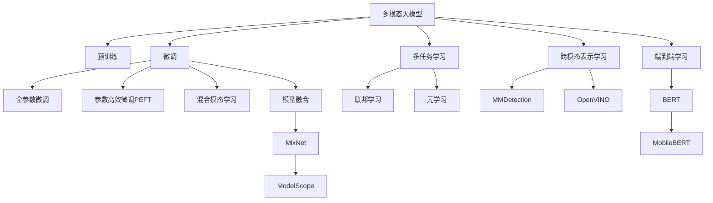

                 

# 多模态大模型：技术原理与实战 中小公司的大模型构建之路

> 关键词：多模态大模型,自然语言处理(NLP),计算机视觉(CV),语音识别(SR),混合模态,深度学习,模型融合,预训练,微调,模型集成,实际应用

## 1. 背景介绍

### 1.1 问题由来
近年来，随着深度学习技术的飞速发展，大规模预训练模型在自然语言处理(NLP)、计算机视觉(CV)、语音识别(SR)等多个领域取得了显著进展。这些预训练模型通常基于大规模的无标签数据，经过自监督学习获得通用的语言、图像、语音等表示能力。

然而，预训练模型往往需要昂贵的算力资源，对于中小型公司来说，构建大规模预训练模型几乎是不可能的。尽管如此，中小公司依然可以通过微调和大模型构建技术，在不投入大量资源的情况下，获得接近大模型的表现，实现高效而智能的解决方案。

### 1.2 问题核心关键点
本节将阐述大模型构建和微调技术对中小公司的意义：

- **预训练与微调**：预训练模型提供了通用的知识表示，微调则能够在大规模数据集上进一步优化模型，提升其在特定任务上的性能。
- **混合模态**：结合多种模态数据，如文本、图像、语音，可以获得更全面的信息表示。
- **模型融合**：通过模型集成和融合，提高模型的泛化能力和鲁棒性。
- **实际应用**：中小公司可以利用大模型技术快速构建高效的解决方案，而无需从头训练大规模模型。

这些技术为中小公司提供了构建智能系统的新路径，通过借用大模型的力量，加速技术创新和产品落地。

## 2. 核心概念与联系

### 2.1 核心概念概述

为更好地理解多模态大模型构建与微调技术，本节将介绍几个密切相关的核心概念：

- **多模态大模型**：融合文本、图像、语音等多种模态信息的大规模预训练模型。
- **预训练与微调**：在大规模无标签数据上进行的预训练，在特定任务数据集上的微调。
- **混合模态学习**：结合文本、图像、语音等多种信息源，提高模型对现实世界的理解能力。
- **模型融合**：通过多个模型的组合，提高模型的鲁棒性和泛化能力。
- **多任务学习**：模型在多个任务上进行联合训练，共享参数以提高模型效率。
- **跨模态表示学习**：学习不同模态之间的语义映射，提高模型对多种信息的处理能力。
- **端到端学习**：从原始数据直接进行模型训练，无需中间表示。

这些概念之间的逻辑关系可以通过以下Mermaid流程图来展示：



这个流程图展示了大模型构建的核心概念及其之间的关系：

1. 多模态大模型通过预训练获得通用知识表示。
2. 微调过程可以进一步优化模型在特定任务上的表现。
3. 混合模态学习能够结合多种信息源，提升模型对现实世界的理解能力。
4. 模型融合通过多个模型的组合，提高模型的泛化能力和鲁棒性。
5. 多任务学习使模型在多个任务上进行联合训练，共享参数以提高模型效率。
6. 跨模态表示学习提高模型对不同模态信息的处理能力。
7. 端到端学习从原始数据直接进行模型训练，避免中间表示的引入。

这些概念共同构成了多模态大模型的构建和微调框架，使其能够在各种场景下发挥强大的信息处理能力。

## 3. 核心算法原理 & 具体操作步骤
### 3.1 算法原理概述

多模态大模型的构建与微调方法，本质上是通过预训练与微调步骤，利用多种模态数据提升模型的泛化能力和表现能力。其核心思想是：

1. **预训练步骤**：使用大规模无标签数据进行预训练，获得通用的语言、图像、语音等表示能力。
2. **微调步骤**：在特定任务的数据集上进行微调，优化模型在特定任务上的性能。

形式化地，假设多模态预训练模型为 $M_{\theta}$，其中 $\theta$ 为模型参数。给定混合模态任务 $T$ 的标注数据集 $D=\{(x_i, y_i)\}_{i=1}^N$，其中 $x_i$ 表示包含文本、图像、语音等多种信息的数据，$y_i$ 表示任务的标注标签。微调的目标是找到新的模型参数 $\hat{\theta}$，使得：

$$
\hat{\theta}=\mathop{\arg\min}_{\theta} \mathcal{L}(M_{\theta},D)
$$

其中 $\mathcal{L}$ 为针对任务 $T$ 设计的损失函数，用于衡量模型预测输出与真实标签之间的差异。常见的损失函数包括交叉熵损失、均方误差损失等。

通过梯度下降等优化算法，微调过程不断更新模型参数 $\theta$，最小化损失函数 $\mathcal{L}$，使得模型输出逼近真实标签。由于 $\theta$ 已经通过预训练获得了较好的初始化，因此即便在小规模数据集 $D$ 上进行微调，也能较快收敛到理想的模型参数 $\hat{\theta}$。

### 3.2 算法步骤详解

多模态大模型的构建与微调一般包括以下几个关键步骤：

**Step 1: 准备预训练模型和数据集**
- 选择合适的预训练模型，如BERT、ResNet、Wav2Vec 2.0等。
- 准备混合模态任务 $T$ 的标注数据集 $D$，划分为训练集、验证集和测试集。一般要求标注数据与预训练数据的分布不要差异过大。

**Step 2: 设计任务适配层**
- 根据任务类型，在预训练模型顶层设计合适的输出层和损失函数。
- 对于分类任务，通常在顶层添加线性分类器和交叉熵损失函数。
- 对于生成任务，通常使用语言模型的解码器输出概率分布，并以负对数似然为损失函数。

**Step 3: 设置微调超参数**
- 选择合适的优化算法及其参数，如 AdamW、SGD 等，设置学习率、批大小、迭代轮数等。
- 设置正则化技术及强度，包括权重衰减、Dropout、Early Stopping等。
- 确定冻结预训练参数的策略，如仅微调顶层，或全部参数都参与微调。

**Step 4: 执行梯度训练**
- 将训练集数据分批次输入模型，前向传播计算损失函数。
- 反向传播计算参数梯度，根据设定的优化算法和学习率更新模型参数。
- 周期性在验证集上评估模型性能，根据性能指标决定是否触发 Early Stopping。
- 重复上述步骤直到满足预设的迭代轮数或 Early Stopping 条件。

**Step 5: 测试和部署**
- 在测试集上评估微调后模型 $M_{\hat{\theta}}$ 的性能，对比微调前后的精度提升。
- 使用微调后的模型对新样本进行推理预测，集成到实际的应用系统中。
- 持续收集新的数据，定期重新微调模型，以适应数据分布的变化。

以上是多模态大模型构建与微调的一般流程。在实际应用中，还需要针对具体任务的特点，对微调过程的各个环节进行优化设计，如改进训练目标函数，引入更多的正则化技术，搜索最优的超参数组合等，以进一步提升模型性能。

### 3.3 算法优缺点

多模态大模型的构建与微调方法具有以下优点：

1. **高效**：相比于从头训练大规模模型，微调方法需要较少的训练数据和计算资源。
2. **泛化能力强**：利用预训练模型已有的通用知识，微调模型可以更好地泛化到未见过的数据上。
3. **灵活性高**：可根据特定任务需求，灵活设计任务适配层和损失函数。
4. **可解释性高**：预训练模型和微调步骤都较为透明，便于理解和调试。

但同时，该方法也存在一些局限性：

1. **数据依赖**：微调效果依赖于标注数据的数量和质量，获取高质量标注数据的成本较高。
2. **迁移能力有限**：当目标任务与预训练数据的分布差异较大时，微调的性能提升有限。
3. **资源消耗高**：预训练模型往往需要较大的计算资源和存储空间。
4. **模型复杂**：预训练与微调过程涉及多模态数据的处理，模型结构复杂。

尽管存在这些局限性，但就目前而言，基于预训练与微调的方法仍然是大模型构建的主流范式。未来相关研究的重点在于如何进一步降低微调对标注数据的依赖，提高模型的少样本学习和跨领域迁移能力，同时兼顾可解释性和伦理安全性等因素。

### 3.4 算法应用领域

多模态大模型的构建与微调技术，在多个领域得到了广泛的应用，例如：

- **医疗影像诊断**：利用预训练的图像识别模型，对医学影像进行病理分析、疾病诊断等。
- **智能安防**：结合图像识别和语音识别，实现人脸识别、行为监控等应用。
- **自动驾驶**：融合图像、激光雷达、GPS等传感器数据，实现环境感知、路径规划等功能。
- **智慧教育**：结合图像识别、语音识别和自然语言处理，实现课堂智能答疑、作业批改等功能。
- **金融风控**：结合图像识别、语音识别和文本分析，实现信用评估、交易监控等功能。

除了上述这些经典任务外，多模态大模型还被创新性地应用到更多场景中，如智能家居、智慧城市、工业质检等，为各行各业带来了新的技术突破。

## 4. 数学模型和公式 & 详细讲解  
### 4.1 数学模型构建

本节将使用数学语言对多模态大模型的构建与微调过程进行更加严格的刻画。

记多模态预训练模型为 $M_{\theta}$，其中 $\theta$ 为模型参数。假设混合模态任务 $T$ 的训练集为 $D=\{(x_i,y_i)\}_{i=1}^N$，其中 $x_i$ 为混合模态数据，包括文本、图像、语音等，$y_i$ 为任务的标注标签。

定义模型 $M_{\theta}$ 在数据样本 $(x,y)$ 上的损失函数为 $\ell(M_{\theta}(x),y)$，则在数据集 $D$ 上的经验风险为：

$$
\mathcal{L}(\theta) = \frac{1}{N} \sum_{i=1}^N \ell(M_{\theta}(x_i),y_i)
$$

微调的优化目标是最小化经验风险，即找到最优参数：

$$
\theta^* = \mathop{\arg\min}_{\theta} \mathcal{L}(\theta)
$$

在实践中，我们通常使用基于梯度的优化算法（如SGD、Adam等）来近似求解上述最优化问题。设 $\eta$ 为学习率，$\lambda$ 为正则化系数，则参数的更新公式为：

$$
\theta \leftarrow \theta - \eta \nabla_{\theta}\mathcal{L}(\theta) - \eta\lambda\theta
$$

其中 $\nabla_{\theta}\mathcal{L}(\theta)$ 为损失函数对参数 $\theta$ 的梯度，可通过反向传播算法高效计算。

### 4.2 公式推导过程

以下我们以混合模态分类任务为例，推导交叉熵损失函数及其梯度的计算公式。

假设模型 $M_{\theta}$ 在输入 $x$ 上的输出为 $\hat{y}=M_{\theta}(x) \in [0,1]$，表示样本属于正类的概率。真实标签 $y \in \{0,1\}$。则二分类交叉熵损失函数定义为：

$$
\ell(M_{\theta}(x),y) = -[y\log \hat{y} + (1-y)\log (1-\hat{y})]
$$

将其代入经验风险公式，得：

$$
\mathcal{L}(\theta) = -\frac{1}{N}\sum_{i=1}^N [y_i\log M_{\theta}(x_i)+(1-y_i)\log(1-M_{\theta}(x_i))]
$$

根据链式法则，损失函数对参数 $\theta_k$ 的梯度为：

$$
\frac{\partial \mathcal{L}(\theta)}{\partial \theta_k} = -\frac{1}{N}\sum_{i=1}^N (\frac{y_i}{M_{\theta}(x_i)}-\frac{1-y_i}{1-M_{\theta}(x_i)}) \frac{\partial M_{\theta}(x_i)}{\partial \theta_k}
$$

其中 $\frac{\partial M_{\theta}(x_i)}{\partial \theta_k}$ 可进一步递归展开，利用自动微分技术完成计算。

在得到损失函数的梯度后，即可带入参数更新公式，完成模型的迭代优化。重复上述过程直至收敛，最终得到适应混合模态任务的最优模型参数 $\theta^*$。

## 5. 项目实践：代码实例和详细解释说明
### 5.1 开发环境搭建

在进行多模态大模型微调实践前，我们需要准备好开发环境。以下是使用Python进行PyTorch开发的环境配置流程：

1. 安装Anaconda：从官网下载并安装Anaconda，用于创建独立的Python环境。

2. 创建并激活虚拟环境：
```bash
conda create -n pytorch-env python=3.8 
conda activate pytorch-env
```

3. 安装PyTorch：根据CUDA版本，从官网获取对应的安装命令。例如：
```bash
conda install pytorch torchvision torchaudio cudatoolkit=11.1 -c pytorch -c conda-forge
```

4. 安装Transformers库：
```bash
pip install transformers
```

5. 安装各类工具包：
```bash
pip install numpy pandas scikit-learn matplotlib tqdm jupyter notebook ipython
```

完成上述步骤后，即可在`pytorch-env`环境中开始多模态大模型的微调实践。

### 5.2 源代码详细实现

这里我们以多模态文本-图像分类任务为例，给出使用Transformers库对BERT模型进行微调的PyTorch代码实现。

首先，定义数据处理函数：

```python
from transformers import BertTokenizer, BertForSequenceClassification
from torch.utils.data import Dataset
import torch

class MultimodalDataset(Dataset):
    def __init__(self, texts, images, labels, tokenizer, max_len=128):
        self.texts = texts
        self.images = images
        self.labels = labels
        self.tokenizer = tokenizer
        self.max_len = max_len
        
    def __len__(self):
        return len(self.texts)
    
    def __getitem__(self, item):
        text = self.texts[item]
        image = self.images[item]
        label = self.labels[item]
        
        encoding = self.tokenizer(text, return_tensors='pt', max_length=self.max_len, padding='max_length', truncation=True)
        input_ids = encoding['input_ids'][0]
        attention_mask = encoding['attention_mask'][0]
        
        # 将图像转换为张量
        image_tensor = image.unsqueeze(0).float()
        
        return {'input_ids': input_ids, 
                'attention_mask': attention_mask,
                'image': image_tensor,
                'labels': label}
```

然后，定义模型和优化器：

```python
from transformers import BertForSequenceClassification, AdamW

model = BertForSequenceClassification.from_pretrained('bert-base-cased', num_labels=2)

optimizer = AdamW(model.parameters(), lr=2e-5)
```

接着，定义训练和评估函数：

```python
from torch.utils.data import DataLoader
from tqdm import tqdm
from sklearn.metrics import classification_report

device = torch.device('cuda') if torch.cuda.is_available() else torch.device('cpu')
model.to(device)

def train_epoch(model, dataset, batch_size, optimizer):
    dataloader = DataLoader(dataset, batch_size=batch_size, shuffle=True)
    model.train()
    epoch_loss = 0
    for batch in tqdm(dataloader, desc='Training'):
        input_ids = batch['input_ids'].to(device)
        attention_mask = batch['attention_mask'].to(device)
        image_tensor = batch['image'].to(device)
        labels = batch['labels'].to(device)
        model.zero_grad()
        outputs = model(input_ids, attention_mask=attention_mask, image=image_tensor)
        loss = outputs.loss
        epoch_loss += loss.item()
        loss.backward()
        optimizer.step()
    return epoch_loss / len(dataloader)

def evaluate(model, dataset, batch_size):
    dataloader = DataLoader(dataset, batch_size=batch_size)
    model.eval()
    preds, labels = [], []
    with torch.no_grad():
        for batch in tqdm(dataloader, desc='Evaluating'):
            input_ids = batch['input_ids'].to(device)
            attention_mask = batch['attention_mask'].to(device)
            image_tensor = batch['image'].to(device)
            batch_labels = batch['labels']
            outputs = model(input_ids, attention_mask=attention_mask, image=image_tensor)
            batch_preds = outputs.logits.argmax(dim=2).to('cpu').tolist()
            batch_labels = batch_labels.to('cpu').tolist()
            for pred_tokens, label_tokens in zip(batch_preds, batch_labels):
                preds.append(pred_tokens)
                labels.append(label_tokens)
                
    print(classification_report(labels, preds))
```

最后，启动训练流程并在测试集上评估：

```python
epochs = 5
batch_size = 16

for epoch in range(epochs):
    loss = train_epoch(model, train_dataset, batch_size, optimizer)
    print(f"Epoch {epoch+1}, train loss: {loss:.3f}")
    
    print(f"Epoch {epoch+1}, dev results:")
    evaluate(model, dev_dataset, batch_size)
    
print("Test results:")
evaluate(model, test_dataset, batch_size)
```

以上就是使用PyTorch对BERT模型进行多模态文本-图像分类任务微调的完整代码实现。可以看到，得益于Transformers库的强大封装，我们可以用相对简洁的代码完成BERT模型的加载和微调。

### 5.3 代码解读与分析

让我们再详细解读一下关键代码的实现细节：

**MultimodalDataset类**：
- `__init__`方法：初始化文本、图像、标签等关键组件。
- `__len__`方法：返回数据集的样本数量。
- `__getitem__`方法：对单个样本进行处理，将文本输入编码为token ids，将图像转换为张量，将标签转换为数字，并对其进行定长padding，最终返回模型所需的输入。

**Model类**：
- `BertForSequenceClassification.from_pretrained()`方法：从预训练模型加载模型，指定文本分类器的输出层和标签数。

**optimizer和train_epoch函数**：
- 使用AdamW优化器，设置学习率。
- `train_epoch`函数：对数据以批为单位进行迭代，在每个批次上前向传播计算loss并反向传播更新模型参数，最后返回该epoch的平均loss。

**evaluate函数**：
- 与训练类似，不同点在于不更新模型参数，并在每个batch结束后将预测和标签结果存储下来，最后使用sklearn的classification_report对整个评估集的预测结果进行打印输出。

**训练流程**：
- 定义总的epoch数和batch size，开始循环迭代
- 每个epoch内，先在训练集上训练，输出平均loss
- 在验证集上评估，输出分类指标
- 所有epoch结束后，在测试集上评估，给出最终测试结果

可以看到，PyTorch配合Transformers库使得BERT模型微调的代码实现变得简洁高效。开发者可以将更多精力放在数据处理、模型改进等高层逻辑上，而不必过多关注底层的实现细节。

当然，工业级的系统实现还需考虑更多因素，如模型的保存和部署、超参数的自动搜索、更灵活的任务适配层等。但核心的微调范式基本与此类似。

## 6. 实际应用场景
### 6.1 智能安防监控

基于多模态大模型的智能安防系统，可以实时分析监控视频和音频数据，自动检测异常行为并报警。传统的安防系统往往依赖人工监控，容易出现遗漏和误报，而使用多模态大模型，可以自动学习不同模态数据之间的关系，实现更智能化的安全监控。

在技术实现上，可以收集不同场景下的监控视频和音频数据，将视频帧转换为图像，音频转换为语音信号，构建混合模态数据集。在此基础上对预训练的多模态大模型进行微调，使其能够自动检测异常行为，如异常人员的出现、异常声音的出现等。一旦检测到异常，系统便会自动报警并通知安保人员，提高安防系统的响应速度和准确性。

### 6.2 医学影像辅助诊断

医学影像诊断是医疗领域的重要应用，但传统的图像分析方法往往需要大量手工标注和经验积累。利用多模态大模型，可以自动学习医疗影像中的多维信息，辅助医生进行疾病诊断。

具体而言，可以收集大量的医学影像数据，包括CT、MRI、X光等，将其转换为图像数据，同时收集相应的病理报告和诊断结果。在构建混合模态数据集后，对预训练的多模态大模型进行微调，使其能够自动分析医学影像，提取病灶区域，辅助医生进行诊断。微调后的模型能够显著提高诊断效率和准确性，帮助医生快速识别疾病，减少误诊和漏诊。

### 6.3 智能推荐系统

推荐系统是电商、新闻、社交等平台的重要功能之一，但传统的推荐算法往往依赖用户行为数据，难以处理复杂的多维度信息。利用多模态大模型，可以结合用户画像、物品特征、评论等多个维度的信息，实现更加精准的推荐。

在技术实现上，可以收集用户的历史浏览、购买、评分等行为数据，将文本评论转换为文本数据，将商品图片转换为图像数据。构建混合模态数据集后，对预训练的多模态大模型进行微调，使其能够学习用户和物品之间的多维度关系，提供个性化的推荐结果。微调后的模型能够显著提高推荐效果，帮助平台更好地满足用户需求。

### 6.4 未来应用展望

随着多模态大模型和微调方法的不断发展，在更多领域的应用前景也将逐步展现。

在智慧医疗领域，多模态大模型可以结合医疗影像、病历、基因数据等，提供更全面、精准的诊断和治疗方案。

在智能制造领域，多模态大模型可以结合传感器数据、设备状态、操作记录等信息，实现设备故障预测、工艺优化等功能，提升生产效率和质量。

在智慧能源领域，多模态大模型可以结合电力数据、气象数据、设备状态等，实现能源需求预测、智能调度等功能，优化能源使用效率。

此外，在教育、金融、农业等多个领域，多模态大模型的应用也将逐步深化，为各行各业带来新的技术创新和业务价值。

## 7. 工具和资源推荐
### 7.1 学习资源推荐

为了帮助开发者系统掌握多模态大模型构建与微调的理论基础和实践技巧，这里推荐一些优质的学习资源：

1. 《深度学习理论与实践》系列博文：由大模型技术专家撰写，深入浅出地介绍了深度学习的基本原理和实际应用。

2. CS231n《卷积神经网络》课程：斯坦福大学开设的计算机视觉课程，系统讲解了图像识别、物体检测等核心技术。

3. 《自然语言处理基础》书籍：全面介绍了自然语言处理的理论基础和核心算法，包括文本分类、序列标注等任务。

4. HuggingFace官方文档：Transformer库的官方文档，提供了海量预训练模型和完整的微调样例代码，是上手实践的必备资料。

5. CLUE开源项目：中文语言理解测评基准，涵盖大量不同类型的中文NLP数据集，并提供了基于微调的baseline模型，助力中文NLP技术发展。

通过对这些资源的学习实践，相信你一定能够快速掌握多模态大模型的构建与微调精髓，并用于解决实际的NLP问题。

### 7.2 开发工具推荐

高效的开发离不开优秀的工具支持。以下是几款用于多模态大模型微调开发的常用工具：

1. PyTorch：基于Python的开源深度学习框架，灵活动态的计算图，适合快速迭代研究。大部分预训练语言模型都有PyTorch版本的实现。

2. TensorFlow：由Google主导开发的开源深度学习框架，生产部署方便，适合大规模工程应用。同样有丰富的预训练语言模型资源。

3. Transformers库：HuggingFace开发的NLP工具库，集成了众多SOTA语言模型，支持PyTorch和TensorFlow，是进行多模态大模型构建的利器。

4. Weights & Biases：模型训练的实验跟踪工具，可以记录和可视化模型训练过程中的各项指标，方便对比和调优。与主流深度学习框架无缝集成。

5. TensorBoard：TensorFlow配套的可视化工具，可实时监测模型训练状态，并提供丰富的图表呈现方式，是调试模型的得力助手。

6. Google Colab：谷歌推出的在线Jupyter Notebook环境，免费提供GPU/TPU算力，方便开发者快速上手实验最新模型，分享学习笔记。

合理利用这些工具，可以显著提升多模态大模型微调任务的开发效率，加快创新迭代的步伐。

### 7.3 相关论文推荐

多模态大模型和微调技术的发展源于学界的持续研究。以下是几篇奠基性的相关论文，推荐阅读：

1. Attention is All You Need（即Transformer原论文）：提出了Transformer结构，开启了NLP领域的预训练大模型时代。

2. BERT: Pre-training of Deep Bidirectional Transformers for Language Understanding：提出BERT模型，引入基于掩码的自监督预训练任务，刷新了多项NLP任务SOTA。

3. Multimodal Transformer Networks：提出多模态Transformer网络，实现了跨模态信息融合，提高了模型的泛化能力。

4. ModelScope：提供了多模态大模型资源库，支持多模态任务的联合训练和微调，为开发者提供了丰富的预训练模型。

5. ViT：提出视觉Transformer，实现了图像识别和图像生成任务的提升，为视觉预训练大模型提供了新的思路。

这些论文代表了大模型构建与微调技术的发展脉络。通过学习这些前沿成果，可以帮助研究者把握学科前进方向，激发更多的创新灵感。

## 8. 总结：未来发展趋势与挑战

### 8.1 总结

本文对多模态大模型构建与微调方法进行了全面系统的介绍。首先阐述了多模态大模型和微调技术的研究背景和意义，明确了多模态大模型在构建智能系统中的独特价值。其次，从原理到实践，详细讲解了多模态大模型的构建与微调过程，给出了多模态文本-图像分类任务的完整代码实现。同时，本文还广泛探讨了多模态大模型在安防监控、医学影像诊断、智能推荐等领域的实际应用前景，展示了多模态大模型的广泛应用潜力。此外，本文精选了多模态大模型的各类学习资源，力求为读者提供全方位的技术指引。

通过本文的系统梳理，可以看到，多模态大模型构建与微调技术正在成为NLP领域的重要范式，极大地拓展了预训练语言模型的应用边界，催生了更多的落地场景。受益于大规模语料的预训练，多模态大模型以更低的时间和标注成本，在小样本条件下也能取得不俗的效果，有力推动了NLP技术的产业化进程。未来，伴随预训练语言模型和微调方法的持续演进，相信NLP技术将在更广阔的应用领域大放异彩，深刻影响人类的生产生活方式。

### 8.2 未来发展趋势

展望未来，多模态大模型构建与微调技术将呈现以下几个发展趋势：

1. **模型规模持续增大**：随着算力成本的下降和数据规模的扩张，预训练语言模型的参数量还将持续增长。超大规模语言模型蕴含的丰富语言知识，有望支撑更加复杂多变的混合模态任务微调。

2. **混合模态学习日趋多样化**：未来的混合模态学习将不仅仅局限于文本、图像、语音，而是融合更多维度的信息，如时间、空间、频谱等，提升模型对现实世界的理解能力。

3. **多任务学习成为常态**：未来的多模态大模型将支持在多个任务上进行联合训练，共享参数以提高模型效率。

4. **跨模态表示学习技术进步**：未来的跨模态表示学习将利用更多先验知识，如逻辑规则、知识图谱等，提高不同模态之间的语义映射精度。

5. **端到端学习成为趋势**：未来的多模态大模型将直接从原始数据进行训练，避免中间表示的引入，提升模型的泛化能力。

6. **多模态大模型应用广泛**：未来的多模态大模型将广泛应用于更多领域，如智慧医疗、智能制造、智慧能源等，为各行各业带来新的技术创新和业务价值。

以上趋势凸显了多模态大模型构建与微调技术的广阔前景。这些方向的探索发展，必将进一步提升多模态大模型的性能和应用范围，为人类认知智能的进化带来深远影响。

### 8.3 面临的挑战

尽管多模态大模型构建与微调技术已经取得了瞩目成就，但在迈向更加智能化、普适化应用的过程中，它仍面临着诸多挑战：

1. **标注成本瓶颈**：虽然多模态大模型构建过程中可以引入文本和图像等多种信息源，但获取高质量标注数据的成本依然较高。如何进一步降低微调对标注样本的依赖，将是一大难题。

2. **模型鲁棒性不足**：当前多模态大模型面对域外数据时，泛化性能往往大打折扣。对于测试样本的微小扰动，多模态大模型的预测也容易发生波动。如何提高模型的鲁棒性，避免灾难性遗忘，还需要更多理论和实践的积累。

3. **推理效率有待提高**：多模态大模型虽然精度高，但在实际部署时往往面临推理速度慢、内存占用大等效率问题。如何在保证性能的同时，简化模型结构，提升推理速度，优化资源占用，将是重要的优化方向。

4. **可解释性亟需加强**：当前多模态大模型更像是"黑盒"系统，难以解释其内部工作机制和决策逻辑。对于医疗、金融等高风险应用，算法的可解释性和可审计性尤为重要。如何赋予多模态大模型更强的可解释性，将是亟待攻克的难题。

5. **安全性有待保障**：预训练多模态大模型难免会学习到有偏见、有害的信息，通过微调传递到下游任务，产生误导性、歧视性的输出，给实际应用带来安全隐患。如何从数据和算法层面消除模型偏见，避免恶意用途，确保输出的安全性，也将是重要的研究课题。

6. **知识整合能力不足**：现有的多模态大模型往往局限于任务内数据，难以灵活吸收和运用更广泛的先验知识。如何让多模态大模型更好地与外部知识库、规则库等专家知识结合，形成更加全面、准确的信息整合能力，还有很大的想象空间。

正视多模态大模型构建与微调面临的这些挑战，积极应对并寻求突破，将是多模态大模型迈向成熟的必由之路。相信随着学界和产业界的共同努力，这些挑战终将一一被克服，多模态大模型构建与微调必将在构建人机协同的智能时代中扮演越来越重要的角色。

### 8.4 未来突破

面对多模态大模型构建与微调所面临的种种挑战，未来的研究需要在以下几个方面寻求新的突破：

1. **探索无监督和半监督多模态学习方法**：摆脱对大规模标注数据的依赖，利用自监督学习、主动学习等无监督和半监督范式，最大限度利用非结构化数据，实现更加灵活高效的多模态学习。

2. **研究参数高效和计算高效的微调范式**：开发更加参数高效的微调方法，在固定大部分预训练参数的同时，只更新极少量的任务相关参数。同时优化多模态大模型的计算图，减少前向传播和反向传播的资源消耗，实现更加轻量级、实时性的部署。

3. **融合因果和对比学习范式**：通过引入因果推断和对比学习思想，增强多模态大模型建立稳定因果关系的能力，学习更加普适、鲁棒的多模态表示，从而提升模型泛化性和抗干扰能力。

4. **引入更多先验知识**：将符号化的先验知识，如知识图谱、逻辑规则等，与神经网络模型进行巧妙融合，引导多模态大模型学习更准确、合理的表示。同时加强不同模态数据的整合，实现视觉、语音等多模态信息与文本信息的协同建模。

5. **结合因果分析和博弈论工具**：将因果分析方法引入多模态大模型，识别出模型决策的关键特征，增强输出解释的因果性和逻辑性。借助博弈论工具刻画人机交互过程，主动探索并规避模型的脆弱点，提高系统稳定性。

6. **纳入伦理道德约束**：在模型训练目标中引入伦理导向的评估指标，过滤和惩罚有偏见、有害的输出倾向。同时加强人工干预和审核，建立模型行为的监管机制，确保输出符合人类价值观和伦理道德。

这些研究方向的探索，必将引领多模态大模型构建与微调技术迈向更高的台阶，为构建安全、可靠、可解释、可控的智能系统铺平道路。面向未来，多模态大模型构建与微调技术还需要与其他人工智能技术进行更深入的融合，如知识表示、因果推理、强化学习等，多路径协同发力，共同推动自然语言理解和智能交互系统的进步。只有勇于创新、敢于突破，才能不断拓展多模态大模型的边界，让智能技术更好地造福人类社会。

## 9. 附录：常见问题与解答

**Q1：多模态大模型是否适用于所有NLP任务？**

A: 多模态大模型在大多数NLP任务上都能取得不错的效果，特别是对于数据量较小的任务。但对于一些特定领域的任务，如医学、法律等，仅仅依靠通用语料预训练的模型可能难以很好地适应。此时需要在特定领域语料上进一步预训练，再进行微调，才能获得理想效果。此外，对于一些需要时效性、个性化很强的任务，如对话、推荐等，多模态大模型也需要针对性的改进优化。

**Q2：多模态大模型的训练过程是否复杂？**

A: 多模态大模型的训练过程较为复杂，需要考虑多种模态数据的联合训练和微调。在实践中，可以通过采用混合模态学习、多任务学习、跨模态表示学习等技术，优化训练过程，提高模型的泛化能力和性能。同时，合理设置超参数，如学习率、批大小、优化器等，也是训练成功的重要因素。

**Q3：多模态大模型在实际应用中面临哪些挑战？**

A: 多模态大模型在实际应用中面临以下挑战：

1. 数据依赖：获取高质量标注数据的成本较高，如何降低数据依赖，提高模型的泛化能力，是一大难题。
2. 模型鲁棒性：多模态大模型面对域外数据时，泛化性能往往不足，如何提高模型的鲁棒性，避免灾难性遗忘，还需要更多理论和实践的积累。
3. 推理效率：多模态大模型推理速度较慢，内存占用较大，如何优化模型结构，提升推理速度，优化资源占用，是重要的优化方向。
4. 可解释性：多模态大模型更像是"黑盒"系统，难以解释其内部工作机制和决策逻辑，如何赋予模型更强的可解释性，将是亟待攻克的难题。
5. 安全性：预训练多模态大模型可能会学习到有害信息，如何从数据和算法层面消除模型偏见，避免恶意用途，确保输出的安全性，也将是重要的研究课题。

这些挑战凸显了多模态大模型构建与微调技术的复杂性，需要从数据、算法、工程、业务等多个维度协同发力，才能真正实现其广泛应用。

**Q4：如何构建多模态大模型？**

A: 构建多模态大模型需要以下步骤：

1. 选择合适的预训练模型，如BERT、ResNet、Wav2Vec 2.0等。
2. 收集多种模态数据，如文本、图像、语音等，构建混合模态数据集。
3. 设计任务适配层，如文本分类器、图像分类器、语音分类器等，并设置相应的损失函数。
4. 对预训练模型进行微调，更新任务适配层的参数，使其适应特定的混合模态任务。

在构建过程中，需要合理设置超参数，如学习率、批大小、优化器等，同时考虑数据增强、正则化、对抗训练等技术，提高模型的泛化能力和性能。

通过以上步骤，可以构建出高效、泛化能力强、具有实际应用价值的多模态大模型。

---

作者：禅与计算机程序设计艺术 / Zen and the Art of Computer Programming

