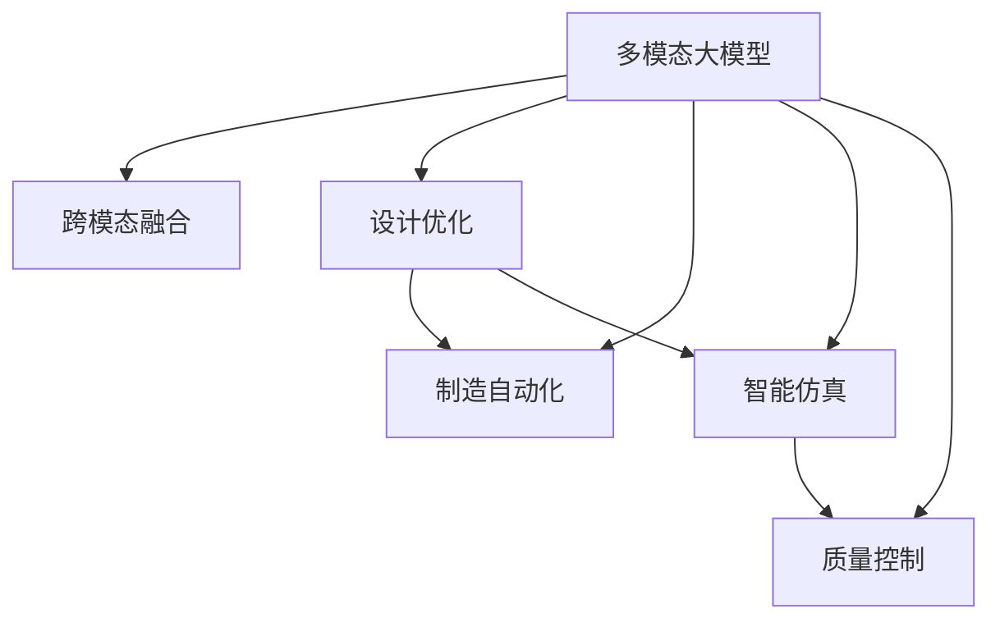

                 

# 多模态大模型：技术原理与实战 多模态大模型在工业设计与生产领域中的应用

> 关键词：多模态大模型,工业设计,产品生产,模型微调,融合学习,设计优化,制造自动化,智能仿真,质量控制

## 1. 背景介绍

### 1.1 问题由来
随着人工智能技术的飞速发展，多模态大模型在工业设计和生产领域的应用成为热门话题。多模态大模型（Multimodal Large Models, MLMs）是结合了文本、图像、音频、视频等多种数据模态进行预训练的模型，能够从多角度获取信息，并进行深度融合和理解。这些模型在视觉、语音、自然语言处理等多个领域都展现出了卓越的性能，极大地推动了人工智能技术的落地应用。

### 1.2 问题核心关键点
本文将聚焦于多模态大模型的技术原理与工业设计及生产领域的实际应用，探索如何通过多模态大模型进行设计优化、制造自动化和智能仿真等，以提升产品质量、降低生产成本、加速产品迭代。

## 2. 核心概念与联系

### 2.1 核心概念概述

为了更好地理解多模态大模型及其在工业设计和生产领域的应用，本节将介绍几个关键概念：

- **多模态大模型 (MLMs)**：结合文本、图像、音频、视频等多种数据模态进行预训练的深度学习模型。这类模型通过多模态融合，能更好地理解和生成复杂场景，具有跨领域的通用性和强大的泛化能力。

- **跨模态融合 (Cross-modal Fusion)**：指将不同模态的数据进行融合，使其在模型内部形成统一的理解和表示。常用的跨模态融合技术包括深度融合、注意力机制、联合学习等。

- **设计优化 (Design Optimization)**：指通过人工智能技术对产品设计进行迭代优化，以提升设计质量、减少成本和提高效率。

- **制造自动化 (Manufacturing Automation)**：指通过人工智能技术实现制造过程的自动化，包括生产流程的优化、机器人操作、质量控制等。

- **智能仿真 (Smart Simulation)**：指利用人工智能技术进行产品设计的虚拟仿真和验证，减少实际生产中的试错成本，提高设计精度和生产效率。

- **质量控制 (Quality Control)**：指通过人工智能技术对生产过程和产品质量进行实时监控和预测，确保产品符合预期标准。

这些核心概念之间的逻辑关系可以通过以下Mermaid流程图来展示：



这个流程图展示了多模态大模型在工业设计和生产领域中的关键应用场景，从设计到生产，再到仿真和质量控制，多模态大模型在每个环节都发挥着重要作用。

## 3. 核心算法原理 & 具体操作步骤

### 3.1 算法原理概述

多模态大模型的核心算法原理基于深度学习框架，通过自监督学习和监督学习的结合，进行多模态数据的融合和理解。其基本流程如下：

1. **数据收集与预处理**：从不同数据源收集文本、图像、音频和视频等多种模态的数据，并进行清洗和标注。
2. **多模态特征提取**：通过多个预训练模型（如BERT、ViT、Wav2Vec等）对不同模态的数据进行特征提取。
3. **跨模态融合**：将提取出的特征进行深度融合，形成统一的语义表示。常用的跨模态融合方法包括注意力机制、深度融合网络、联合学习等。
4. **下游任务微调**：基于特定任务的需求，在融合后的特征上进行微调，如设计优化、制造自动化、智能仿真和质量控制等。

### 3.2 算法步骤详解

以下是一个详细的多模态大模型应用流程，以工业设计优化为例：

**Step 1: 数据准备与预处理**
- 收集工业设计领域的文本数据（如产品说明书、用户评论等），图像数据（如产品图片、CAD图纸等），音频数据（如产品演示视频等）。
- 对数据进行清洗、标注和归一化处理，确保数据的质量和一致性。

**Step 2: 特征提取与跨模态融合**
- 使用预训练的BERT模型提取文本特征，使用ViT模型提取图像特征，使用Wav2Vec模型提取音频特征。
- 将这些特征通过注意力机制或深度融合网络进行跨模态融合，形成统一的语义表示。

**Step 3: 下游任务微调**
- 基于设计优化的任务需求，设计特定的损失函数和评估指标。
- 对融合后的特征进行微调，优化产品设计方案，生成最优设计。
- 使用智能仿真技术对优化后的设计进行虚拟验证，确保设计的可行性和可靠性。

**Step 4: 制造自动化与质量控制**
- 将优化后的设计方案导入制造系统，实现自动化的生产流程。
- 利用智能监控系统对生产过程进行实时监控，确保产品质量符合标准。
- 根据实时监控数据，进行动态调整和优化，进一步提升生产效率和产品质量。

### 3.3 算法优缺点

多模态大模型在工业设计和生产领域的应用具有以下优点：
1. **全面理解**：能够综合考虑多种数据模态，全面理解产品的特征和设计需求。
2. **鲁棒性**：通过多模态融合，模型对噪声和数据变化具有较强的鲁棒性，能更好地适应不同的生产环境和应用场景。
3. **泛化能力强**：具有较强的跨领域泛化能力，能在不同领域和任务中灵活应用。
4. **高效优化**：通过智能仿真和自动化的生产流程，能够快速迭代设计方案，提升设计效率和生产效率。

同时，也存在一些局限性：
1. **数据依赖**：多模态大模型的性能高度依赖于数据的丰富性和多样性，需要大量高质量的标注数据。
2. **计算成本高**：多模态数据和复杂模型结构增加了计算成本，需要高性能计算资源。
3. **模型复杂度**：模型结构复杂，训练和推理过程中需要更多的资源和计算时间。

### 3.4 算法应用领域

多模态大模型在工业设计和生产领域的应用领域广泛，主要包括以下几个方面：

- **设计优化**：利用多模态数据进行产品设计和优化，提升设计质量、减少成本和提高效率。
- **制造自动化**：通过自动化生产流程和智能监控系统，提高生产效率和产品质量。
- **智能仿真**：利用虚拟仿真技术对设计方案进行验证，减少试错成本，提升设计精度。
- **质量控制**：通过实时监控和数据分析，实现生产过程的智能控制和优化。

## 4. 数学模型和公式 & 详细讲解 & 举例说明

### 4.1 数学模型构建

为了更好地理解多模态大模型的数学模型，本节将详细介绍其构建过程。

假设多模态数据集 $D = \{(x_i, y_i)\}_{i=1}^N$，其中 $x_i$ 表示输入的多模态数据，$y_i$ 表示对应的标签或输出。设 $F(x)$ 为多模态特征提取器，$G(x)$ 为跨模态融合器，$H(x)$ 为下游任务微调器。多模态大模型的数学模型可以表示为：

$$
M(x) = H(G(F(x)))
$$

其中 $M(x)$ 表示模型对输入 $x$ 的输出，$H$ 表示下游任务微调，$G$ 表示跨模态融合，$F$ 表示多模态特征提取。

### 4.2 公式推导过程

以工业设计优化为例，我们可以将多模态大模型的数学模型推导如下：

设 $x_t$ 为文本数据，$x_i$ 为图像数据，$x_a$ 为音频数据。首先使用预训练模型分别提取多模态特征：

$$
f_t = F_t(x_t), f_i = F_i(x_i), f_a = F_a(x_a)
$$

然后通过跨模态融合器 $G$ 将这些特征进行融合：

$$
g = G(f_t, f_i, f_a)
$$

最后，对融合后的特征 $g$ 进行下游任务微调 $H$，得到优化后的设计方案：

$$
M(x) = H(g)
$$

其中 $H$ 可以是任意下游任务微调方法，如神经网络回归、分类等。

### 4.3 案例分析与讲解

假设我们要设计一款新型的电动汽车，以下是具体的案例分析过程：

1. **数据收集**：收集电动汽车的说明书、用户评论、设计图纸、视频演示等多模态数据。
2. **特征提取**：使用预训练的BERT模型提取文本特征 $f_t$，使用ViT模型提取图像特征 $f_i$，使用Wav2Vec模型提取音频特征 $f_a$。
3. **跨模态融合**：通过注意力机制将 $f_t$、$f_i$ 和 $f_a$ 进行融合，得到融合后的特征 $g$。
4. **下游任务微调**：对融合后的特征 $g$ 进行神经网络回归微调，优化电动汽车的设计方案。
5. **智能仿真**：使用智能仿真工具对优化后的设计进行虚拟验证，确保设计的可行性和可靠性。
6. **制造自动化**：将优化后的设计方案导入制造系统，实现自动化的生产流程，提升生产效率和产品质量。

通过以上步骤，我们可以使用多模态大模型对电动汽车进行全面优化设计，提升其性能和用户体验。

## 5. 项目实践：代码实例和详细解释说明

### 5.1 开发环境搭建

在进行多模态大模型应用实践前，我们需要准备好开发环境。以下是使用Python进行PyTorch开发的环境配置流程：

1. 安装Anaconda：从官网下载并安装Anaconda，用于创建独立的Python环境。

2. 创建并激活虚拟环境：
```bash
conda create -n pytorch-env python=3.8 
conda activate pytorch-env
```

3. 安装PyTorch：根据CUDA版本，从官网获取对应的安装命令。例如：
```bash
conda install pytorch torchvision torchaudio cudatoolkit=11.1 -c pytorch -c conda-forge
```

4. 安装Transformers库：
```bash
pip install transformers
```

5. 安装各类工具包：
```bash
pip install numpy pandas scikit-learn matplotlib tqdm jupyter notebook ipython
```

完成上述步骤后，即可在`pytorch-env`环境中开始多模态大模型的应用实践。

### 5.2 源代码详细实现

下面以多模态大模型在工业设计优化中的应用为例，给出使用PyTorch和Transformers库进行多模态大模型应用的代码实现。

首先，定义多模态数据处理函数：

```python
from transformers import BertTokenizer, ViTFeatureExtractor, Wav2Vec2FeatureExtractor
from torch.utils.data import Dataset
import torch

class MultimodalDataset(Dataset):
    def __init__(self, texts, images, audios, labels, tokenizer, img_feature_extractor, audio_feature_extractor):
        self.texts = texts
        self.images = images
        self.audios = audios
        self.labels = labels
        self.tokenizer = tokenizer
        self.img_feature_extractor = img_feature_extractor
        self.audio_feature_extractor = audio_feature_extractor
        
    def __len__(self):
        return len(self.texts)
    
    def __getitem__(self, item):
        text = self.texts[item]
        image = self.images[item]
        audio = self.audios[item]
        label = self.labels[item]
        
        encoding = self.tokenizer(text, return_tensors='pt')
        img_features = self.img_feature_extractor(image, return_tensors='pt')
        audio_features = self.audio_feature_extractor(audio, return_tensors='pt')
        
        return {'input_ids': encoding['input_ids'],
                'attention_mask': encoding['attention_mask'],
                'image_features': img_features['pixel_values'],
                'audio_features': audio_features['input_values'],
                'labels': torch.tensor(label, dtype=torch.long)}
```

然后，定义多模态大模型和优化器：

```python
from transformers import BertForSequenceClassification, ViTForImageClassification, Wav2Vec2ForSequenceClassification, AdamW

model = BertForSequenceClassification.from_pretrained('bert-base-uncased', num_labels=2)
img_model = ViTForImageClassification.from_pretrained('google/vit-base-patch16-224')
audio_model = Wav2Vec2ForSequenceClassification.from_pretrained('facebook/wav2vec2-base-960h')
optimizer = AdamW(model.parameters(), lr=2e-5)
```

接着，定义训练和评估函数：

```python
from torch.utils.data import DataLoader
from tqdm import tqdm
from sklearn.metrics import classification_report

device = torch.device('cuda') if torch.cuda.is_available() else torch.device('cpu')
model.to(device)
img_model.to(device)
audio_model.to(device)

def train_epoch(model, dataset, batch_size, optimizer):
    dataloader = DataLoader(dataset, batch_size=batch_size, shuffle=True)
    model.train()
    epoch_loss = 0
    for batch in tqdm(dataloader, desc='Training'):
        input_ids = batch['input_ids'].to(device)
        attention_mask = batch['attention_mask'].to(device)
        image_features = batch['image_features'].to(device)
        audio_features = batch['audio_features'].to(device)
        labels = batch['labels'].to(device)
        model.zero_grad()
        img_model.zero_grad()
        audio_model.zero_grad()
        outputs = model(input_ids, attention_mask=attention_mask)
        img_outputs = img_model(image_features)
        audio_outputs = audio_model(audio_features)
        loss = outputs.loss
        img_loss = img_outputs.loss
        audio_loss = audio_outputs.loss
        epoch_loss += loss.item() + img_loss.item() + audio_loss.item()
        loss.backward()
        img_loss.backward()
        audio_loss.backward()
        optimizer.step()
    return epoch_loss / len(dataloader)

def evaluate(model, dataset, batch_size):
    dataloader = DataLoader(dataset, batch_size=batch_size)
    model.eval()
    preds, labels = [], []
    with torch.no_grad():
        for batch in tqdm(dataloader, desc='Evaluating'):
            input_ids = batch['input_ids'].to(device)
            attention_mask = batch['attention_mask'].to(device)
            image_features = batch['image_features'].to(device)
            audio_features = batch['audio_features'].to(device)
            batch_labels = batch['labels']
            outputs = model(input_ids, attention_mask=attention_mask)
            img_outputs = img_model(image_features)
            audio_outputs = audio_model(audio_features)
            batch_preds = outputs.logits.argmax(dim=2).to('cpu').tolist()
            batch_labels = batch_labels.to('cpu').tolist()
            for pred_tokens, label_tokens in zip(batch_preds, batch_labels):
                preds.append(pred_tokens[:len(label_tokens)])
                labels.append(label_tokens)
                
    print(classification_report(labels, preds))
```

最后，启动训练流程并在测试集上评估：

```python
epochs = 5
batch_size = 16

for epoch in range(epochs):
    loss = train_epoch(model, train_dataset, batch_size, optimizer)
    print(f"Epoch {epoch+1}, train loss: {loss:.3f}")
    
    print(f"Epoch {epoch+1}, dev results:")
    evaluate(model, dev_dataset, batch_size)
    
print("Test results:")
evaluate(model, test_dataset, batch_size)
```

以上就是使用PyTorch和Transformers库进行多模态大模型应用的完整代码实现。可以看到，通过PyTorch和Transformers库，我们可以快速搭建多模态大模型，并进行训练和评估。

### 5.3 代码解读与分析

让我们再详细解读一下关键代码的实现细节：

**MultimodalDataset类**：
- `__init__`方法：初始化文本、图像、音频和标签数据，以及分词器和特征提取器。
- `__len__`方法：返回数据集的样本数量。
- `__getitem__`方法：对单个样本进行处理，将文本输入编码为token ids，将图像和音频特征提取出来，并将它们与标签一并返回。

**模型和优化器定义**：
- 使用BERT模型作为文本特征提取器，使用ViT模型作为图像特征提取器，使用Wav2Vec2模型作为音频特征提取器。
- 使用AdamW优化器进行模型训练。

**训练和评估函数**：
- 使用PyTorch的DataLoader对数据集进行批次化加载，供模型训练和推理使用。
- 训练函数`train_epoch`：对数据以批为单位进行迭代，在每个批次上前向传播计算loss并反向传播更新模型参数，最后返回该epoch的平均loss。
- 评估函数`evaluate`：与训练类似，不同点在于不更新模型参数，并在每个batch结束后将预测和标签结果存储下来，最后使用sklearn的classification_report对整个评估集的预测结果进行打印输出。

**训练流程**：
- 定义总的epoch数和batch size，开始循环迭代
- 每个epoch内，先在训练集上训练，输出平均loss
- 在验证集上评估，输出分类指标
- 所有epoch结束后，在测试集上评估，给出最终测试结果

可以看到，PyTorch和Transformers库使得多模态大模型的应用开发变得简单高效。开发者可以将更多精力放在数据处理、模型改进等高层逻辑上，而不必过多关注底层的实现细节。

当然，工业级的系统实现还需考虑更多因素，如模型的保存和部署、超参数的自动搜索、更灵活的任务适配层等。但核心的多模态大模型应用流程基本与此类似。

## 6. 实际应用场景

### 6.1 智能制造

多模态大模型在智能制造领域的应用非常广泛，能够提升生产效率、降低成本、优化生产流程。

以智能制造中的质量控制为例，多模态大模型能够通过图像和音频等多模态数据，对生产过程进行实时监控和预测，及时发现和纠正生产中的异常情况，从而提升产品质量。

### 6.2 产品设计

多模态大模型在产品设计中的应用，能够帮助设计人员更好地理解和优化设计方案，提升设计质量和效率。

以电动汽车设计为例，通过多模态大模型，可以结合用户评论、设计图纸、视频演示等多模态数据，对设计方案进行全面的优化，提升车辆的安全性、舒适性和智能化水平。

### 6.3 工业物联网

多模态大模型在工业物联网中的应用，能够实现对设备和环境的全面监测和控制，提升生产自动化水平。

以智能仓储系统为例，多模态大模型能够通过图像和传感器数据，对仓储环境进行实时监测，及时发现异常情况并自动调整仓储策略，提升仓储效率和安全性。

### 6.4 未来应用展望

随着多模态大模型的不断进步，其在工业设计和生产领域的应用也将更加广泛和深入。

未来，多模态大模型将在以下几个方面发挥更大的作用：

- **跨领域融合**：多模态大模型能够实现跨领域的数据融合和理解，推动不同领域的知识和技术协同创新。
- **智能仿真**：利用多模态大模型进行智能仿真，可以大幅降低设计试错成本，提升设计精度和效率。
- **实时监测与控制**：多模态大模型能够实现对生产过程的实时监测和控制，提升制造自动化水平。
- **个性化定制**：多模态大模型能够结合用户需求进行个性化设计，提升用户体验和满意度。

## 7. 工具和资源推荐

### 7.1 学习资源推荐

为了帮助开发者系统掌握多模态大模型的理论基础和实践技巧，这里推荐一些优质的学习资源：

1. 《Transformers: State-of-the-Art Natural Language Processing》系列博文：由大模型技术专家撰写，深入浅出地介绍了Transformer原理、多模态大模型的构建与应用。

2. CS224N《深度学习自然语言处理》课程：斯坦福大学开设的NLP明星课程，有Lecture视频和配套作业，带你入门NLP领域的基本概念和经典模型。

3. 《Multimodal Deep Learning》书籍：系统介绍了多模态深度学习的基本概念、算法和应用，是学习多模态大模型的重要参考资料。

4. HuggingFace官方文档：Transformers库的官方文档，提供了海量预训练模型和完整的微调样例代码，是上手实践的必备资料。

5. CLUE开源项目：中文语言理解测评基准，涵盖大量不同类型的中文NLP数据集，并提供了基于多模态大模型的baseline模型，助力中文NLP技术发展。

通过对这些资源的学习实践，相信你一定能够快速掌握多模态大模型的精髓，并用于解决实际的NLP问题。

### 7.2 开发工具推荐

高效的开发离不开优秀的工具支持。以下是几款用于多模态大模型开发常用的工具：

1. PyTorch：基于Python的开源深度学习框架，灵活动态的计算图，适合快速迭代研究。大部分预训练语言模型都有PyTorch版本的实现。

2. TensorFlow：由Google主导开发的开源深度学习框架，生产部署方便，适合大规模工程应用。同样有丰富的预训练语言模型资源。

3. Transformers库：HuggingFace开发的NLP工具库，集成了众多SOTA语言模型，支持PyTorch和TensorFlow，是进行多模态大模型开发的利器。

4. Weights & Biases：模型训练的实验跟踪工具，可以记录和可视化模型训练过程中的各项指标，方便对比和调优。与主流深度学习框架无缝集成。

5. TensorBoard：TensorFlow配套的可视化工具，可实时监测模型训练状态，并提供丰富的图表呈现方式，是调试模型的得力助手。

6. Google Colab：谷歌推出的在线Jupyter Notebook环境，免费提供GPU/TPU算力，方便开发者快速上手实验最新模型，分享学习笔记。

合理利用这些工具，可以显著提升多模态大模型的开发效率，加快创新迭代的步伐。

### 7.3 相关论文推荐

多模态大模型和跨模态融合技术的发展源于学界的持续研究。以下是几篇奠基性的相关论文，推荐阅读：

1. Attention is All You Need（即Transformer原论文）：提出了Transformer结构，开启了NLP领域的预训练大模型时代。

2. Multimodal Learning with Data Fusion Networks：提出跨模态融合网络，通过深度融合将不同模态的数据融合为统一的语义表示。

3. Multimodal Image-to-Text Retrieval with Distributed Multimodal Vectors：提出多模态向量空间，通过多模态特征嵌入，实现跨模态检索任务。

4. Multimodal Cross-Modal Consistent Representation Learning for Multimedia Analysis：提出跨模态一致性表示学习，提升多模态数据的一致性和融合效果。

5. Multimodal Deep Learning for Automated Reading Comprehension：提出多模态深度学习，结合文本和图像数据，提升阅读理解任务的表现。

6. Multimodal Fusion Networks for Collaborative Filtering：提出多模态融合网络，通过结合不同模态的数据，提升协同过滤的效果。

这些论文代表了大模型和跨模态融合技术的发展脉络。通过学习这些前沿成果，可以帮助研究者把握学科前进方向，激发更多的创新灵感。

## 8. 总结：未来发展趋势与挑战

### 8.1 总结

本文对多模态大模型的技术原理与工业设计和生产领域的应用进行了全面系统的介绍。首先阐述了多模态大模型的研究背景和意义，明确了其在工业设计和生产领域的应用价值。其次，从原理到实践，详细讲解了多模态大模型的数学模型和关键步骤，给出了多模态大模型应用的完整代码实例。同时，本文还探讨了多模态大模型在智能制造、产品设计、工业物联网等多个领域的具体应用场景，展示了其在工业设计和生产领域的应用潜力。最后，本文精选了多模态大模型的学习资源和开发工具，力求为读者提供全方位的技术指引。

通过本文的系统梳理，可以看到，多模态大模型在工业设计和生产领域的应用前景广阔，具有全面理解、鲁棒性强、泛化能力高等优点。然而，在实际应用过程中，也面临着数据依赖、计算成本高、模型复杂度高等挑战。

### 8.2 未来发展趋势

展望未来，多模态大模型在工业设计和生产领域的应用将呈现以下几个发展趋势：

1. **跨模态融合技术的进步**：随着深度融合、注意力机制等跨模态融合技术的不断进步，多模态大模型的融合效果将进一步提升，能够更好地理解和生成复杂场景。

2. **多模态数据的丰富和多样化**：随着传感器技术的进步和物联网设备的普及，多模态数据的丰富性和多样性将进一步提高，多模态大模型的应用范围将更加广泛。

3. **智能仿真的普及**：利用多模态大模型进行智能仿真，可以大幅降低设计试错成本，提升设计精度和效率，成为设计优化中的重要工具。

4. **实时监测与控制**：多模态大模型将实现对生产过程的实时监测和控制，提升制造自动化水平，推动智能制造的发展。

5. **个性化定制**：多模态大模型能够结合用户需求进行个性化设计，提升用户体验和满意度，推动个性化定制市场的发展。

### 8.3 面临的挑战

尽管多模态大模型在工业设计和生产领域的应用已经取得了显著进展，但在迈向更加智能化、普适化应用的过程中，也面临着诸多挑战：

1. **数据依赖**：多模态大模型的性能高度依赖于数据的丰富性和多样性，需要大量高质量的标注数据。如何获取和利用这些数据，仍是重大挑战。

2. **计算成本高**：多模态数据和复杂模型结构增加了计算成本，需要高性能计算资源。如何优化计算效率，降低资源消耗，是一个重要研究方向。

3. **模型复杂度**：模型结构复杂，训练和推理过程中需要更多的资源和计算时间。如何简化模型结构，提升训练和推理效率，也是一个重要方向。

4. **鲁棒性不足**：多模态大模型在实际应用中，面临多种噪声和数据变化，需要进一步提升模型的鲁棒性和泛化能力。

5. **可解释性不足**：多模态大模型往往具有较强的黑盒特性，难以解释其内部工作机制和决策逻辑。如何提升模型的可解释性，增强其可信度，是一个重要研究方向。

6. **安全性问题**：多模态大模型可能学习到有偏见、有害的信息，如何确保模型的输出符合人类价值观和伦理道德，也是一个重要挑战。

### 8.4 研究展望

面对多模态大模型在工业设计和生产领域的应用挑战，未来的研究需要在以下几个方面寻求新的突破：

1. **数据增强与合成技术**：利用数据增强和合成技术，生成更多的高质量数据，提升多模态大模型的泛化能力和鲁棒性。

2. **模型压缩与优化技术**：开发更加轻量级、高效的多模态大模型，提升其计算效率和应用范围。

3. **跨模态融合算法**：开发更加高效、鲁棒的跨模态融合算法，提升多模态大模型的融合效果。

4. **可解释性提升技术**：引入可解释性技术，增强多模态大模型的透明度和可信度，提升其在关键领域的应用。

5. **安全性保障技术**：开发安全机制和防护技术，确保多模态大模型的输出符合人类价值观和伦理道德。

这些研究方向的探索，必将引领多模态大模型在工业设计和生产领域的应用走向新的高度，为人类认知智能的进化带来深远影响。面向未来，多模态大模型还需要与其他人工智能技术进行更深入的融合，如知识表示、因果推理、强化学习等，多路径协同发力，共同推动自然语言理解和智能交互系统的进步。只有勇于创新、敢于突破，才能不断拓展多模态大模型的边界，让智能技术更好地造福人类社会。

## 9. 附录：常见问题与解答

**Q1：多模态大模型在实际应用中面临哪些挑战？**

A: 多模态大模型在实际应用中面临以下挑战：
1. 数据依赖：多模态大模型的性能高度依赖于数据的丰富性和多样性，需要大量高质量的标注数据。
2. 计算成本高：多模态数据和复杂模型结构增加了计算成本，需要高性能计算资源。
3. 模型复杂度：模型结构复杂，训练和推理过程中需要更多的资源和计算时间。
4. 鲁棒性不足：多模态大模型在实际应用中，面临多种噪声和数据变化，需要进一步提升模型的鲁棒性和泛化能力。
5. 可解释性不足：多模态大模型往往具有较强的黑盒特性，难以解释其内部工作机制和决策逻辑。
6. 安全性问题：多模态大模型可能学习到有偏见、有害的信息，需要确保模型的输出符合人类价值观和伦理道德。

**Q2：如何提升多模态大模型的鲁棒性和泛化能力？**

A: 提升多模态大模型的鲁棒性和泛化能力，可以从以下几个方面入手：
1. 数据增强与合成技术：利用数据增强和合成技术，生成更多的高质量数据，提升模型的泛化能力和鲁棒性。
2. 模型压缩与优化技术：开发更加轻量级、高效的多模态大模型，提升计算效率和应用范围。
3. 跨模态融合算法：开发更加高效、鲁棒的跨模态融合算法，提升模型的融合效果。
4. 对抗训练：引入对抗样本，提高模型对噪声和异常数据的鲁棒性。
5. 迁移学习：利用预训练模型在大规模数据上学习到的知识，提升多模态大模型的泛化能力。

**Q3：如何提升多模态大模型的可解释性？**

A: 提升多模态大模型的可解释性，可以从以下几个方面入手：
1. 引入可解释性技术：如LIME、SHAP等，分析模型的决策过程，增强其透明度和可信度。
2. 简化模型结构：通过剪枝、压缩等技术，简化模型结构，提升可解释性。
3. 数据可视化：利用数据可视化技术，展示模型的输入输出，帮助理解模型的工作机制。
4. 用户交互：通过用户交互，获取用户对模型输出的反馈，进一步优化模型的解释能力。

**Q4：多模态大模型在工业设计和生产领域的应用前景如何？**

A: 多模态大模型在工业设计和生产领域的应用前景广阔，具有以下优势：
1. 全面理解：能够综合考虑多种数据模态，全面理解产品的特征和设计需求。
2. 鲁棒性强：通过多模态融合，模型对噪声和数据变化具有较强的鲁棒性，能更好地适应不同的生产环境和应用场景。
3. 泛化能力强：具有较强的跨领域泛化能力，能在不同领域和任务中灵活应用。
4. 智能仿真：利用智能仿真技术，可以大幅降低设计试错成本，提升设计精度和效率。
5. 实时监测与控制：实现对生产过程的实时监测和控制，提升制造自动化水平。
6. 个性化定制：结合用户需求进行个性化设计，提升用户体验和满意度。

总之，多模态大模型在工业设计和生产领域具有广泛的应用前景，能够显著提升设计和生产效率，推动智能制造的发展。

**Q5：多模态大模型的未来发展趋势是什么？**

A: 多模态大模型的未来发展趋势如下：
1. 跨模态融合技术的进步：随着深度融合、注意力机制等跨模态融合技术的不断进步，多模态大模型的融合效果将进一步提升，能够更好地理解和生成复杂场景。
2. 多模态数据的丰富和多样化：随着传感器技术的进步和物联网设备的普及，多模态数据的丰富性和多样性将进一步提高，多模态大模型的应用范围将更加广泛。
3. 智能仿真的普及：利用多模态大模型进行智能仿真，可以大幅降低设计试错成本，提升设计精度和效率，成为设计优化中的重要工具。
4. 实时监测与控制：多模态大模型将实现对生产过程的实时监测和控制，提升制造自动化水平，推动智能制造的发展。
5. 个性化定制：多模态大模型能够结合用户需求进行个性化设计，提升用户体验和满意度，推动个性化定制市场的发展。

以上趋势凸显了多模态大模型在工业设计和生产领域的应用前景和潜力，未来将有更广阔的发展空间。

---

作者：禅与计算机程序设计艺术 / Zen and the Art of Computer Programming

