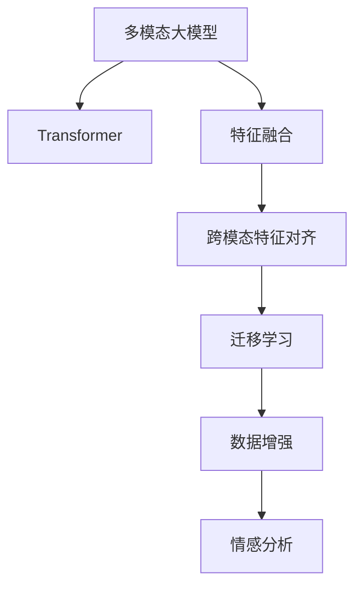

                 

# 多模态大模型：技术原理与实战 多模态大模型在情绪识别领域的应用

> 关键词：多模态大模型,情绪识别,Transformer,特征融合,迁移学习,数据增强,多模态融合,情感分析

## 1. 背景介绍

### 1.1 问题由来
情绪识别（Emotion Recognition）是自然语言处理（NLP）和计算机视觉（CV）领域的重要研究方向之一。随着技术的不断进步，深度学习模型在情绪识别上取得了显著的进展。然而，传统的情绪识别模型往往局限于单一的模态，如文本或图像，难以充分利用多模态信息，导致情绪识别的准确率和鲁棒性都有待提升。

近年来，多模态大模型（Multi-modal Large Models）的兴起为情绪识别带来了新的机遇。通过融合文本、语音、图像等多模态数据，大模型可以更全面地捕捉人的情绪表达，显著提升情绪识别的准确性和鲁棒性。多模态大模型的出现，为情绪识别提供了更加丰富、多样化的输入信息，有助于构建更加精确的情绪识别系统。

### 1.2 问题核心关键点
基于多模态大模型进行情绪识别的核心关键点包括：

- **多模态数据融合**：如何将不同模态的数据进行有效融合，提取有用的特征。
- **跨模态特征对齐**：如何对齐不同模态的特征，消除信息冗余和噪音。
- **迁移学习**：如何在大规模预训练数据上进行学习，利用迁移学习提升模型的泛化能力。
- **数据增强**：如何在有限标注数据条件下，通过数据增强技术提高模型性能。
- **情感分析模型**：如何选择合适的模型架构，进行情感分析。

本文将详细介绍基于多模态大模型的情绪识别技术，包括其原理、具体实现步骤，并结合实际应用场景进行说明。

## 2. 核心概念与联系

### 2.1 核心概念概述

为更好地理解多模态大模型在情绪识别中的应用，本节将介绍几个密切相关的核心概念：

- **多模态大模型（Multi-modal Large Models）**：融合多种模态数据（如文本、语音、图像等）的大型深度学习模型。通过预训练在大规模数据集上学习到丰富的语义表示，并在特定任务上进行微调，可以显著提升模型的泛化能力和性能。

- **Transformer架构**：一种基于自注意力机制的神经网络架构，能够高效地处理序列数据。Transformer在深度学习领域中应用广泛，已成为多模态大模型的主要架构之一。

- **特征融合（Feature Fusion）**：将不同模态的特征进行有效融合，提取更全面、准确的特征表示。特征融合是多模态大模型中至关重要的技术。

- **迁移学习（Transfer Learning）**：利用在大规模预训练数据上学习到的知识，应用于特定任务，如情绪识别。迁移学习可以减少任务特定的训练数据需求，提高模型泛化能力。

- **数据增强（Data Augmentation）**：通过对原始数据进行一定的扰动，如旋转、裁剪、噪声添加等，增加训练数据多样性，提升模型鲁棒性。

- **情感分析（Sentiment Analysis）**：通过模型分析文本、语音、图像等信息，判断其背后的情绪和情感倾向。情感分析是情绪识别的主要任务之一。

这些核心概念之间的逻辑关系可以通过以下Mermaid流程图来展示：



这个流程图展示了大模型在情绪识别中的核心概念及其之间的关系：

1. 多模态大模型通过预训练获得基础能力。
2. 特征融合和跨模态对齐提取多模态信息。
3. 迁移学习利用预训练知识进行任务适配。
4. 数据增强提升模型鲁棒性。
5. 情感分析判断输入信息背后的情绪。

这些概念共同构成了多模态大模型在情绪识别中的应用框架，使得模型能够充分利用多模态信息，提升情绪识别的准确性和鲁棒性。

## 3. 核心算法原理 & 具体操作步骤
### 3.1 算法原理概述

基于多模态大模型的情绪识别，本质上是一个多模态迁移学习过程。其核心思想是：将多模态大模型视作一个强大的"特征提取器"，通过在大规模预训练数据上进行学习，学习到多模态的特征表示。然后在特定任务上进行微调，利用迁移学习提升模型在特定任务上的性能，如情绪识别。

形式化地，假设多模态大模型为 $M_{\theta}$，其中 $\theta$ 为模型参数。假设情绪识别任务 $T$ 的标注数据集 $D=\{(x_i, y_i)\}_{i=1}^N$，其中 $x_i$ 为多模态输入，$y_i$ 为情绪标签。微调的目标是找到新的模型参数 $\hat{\theta}$，使得：

$$
\hat{\theta}=\mathop{\arg\min}_{\theta} \mathcal{L}(M_{\theta},D)
$$

其中 $\mathcal{L}$ 为针对任务 $T$ 设计的损失函数，用于衡量模型预测输出与真实标签之间的差异。常见的损失函数包括交叉熵损失、均方误差损失等。

通过梯度下降等优化算法，微调过程不断更新模型参数 $\theta$，最小化损失函数 $\mathcal{L}$，使得模型输出逼近真实标签。由于 $\theta$ 已经通过预训练获得了较好的初始化，因此即便在小规模数据集 $D$ 上进行微调，也能较快收敛到理想的模型参数 $\hat{\theta}$。

### 3.2 算法步骤详解

基于多模态大模型的情绪识别一般包括以下几个关键步骤：

**Step 1: 准备多模态数据和预训练模型**
- 收集情绪识别任务的数据集，如文本、语音、图像等，并进行标注。
- 选择合适的多模态大模型作为初始化参数，如融合文本和图像的Transformer模型。

**Step 2: 定义任务适配层**
- 根据任务类型，在多模态大模型的顶层设计合适的输出层和损失函数。
- 对于分类任务，通常在顶层添加线性分类器和交叉熵损失函数。
- 对于生成任务，通常使用语言模型的解码器输出概率分布，并以负对数似然为损失函数。

**Step 3: 设置微调超参数**
- 选择合适的优化算法及其参数，如 AdamW、SGD 等，设置学习率、批大小、迭代轮数等。
- 设置正则化技术及强度，包括权重衰减、Dropout、Early Stopping 等。
- 确定冻结预训练参数的策略，如仅微调顶层，或全部参数都参与微调。

**Step 4: 执行梯度训练**
- 将训练集数据分批次输入模型，前向传播计算损失函数。
- 反向传播计算参数梯度，根据设定的优化算法和学习率更新模型参数。
- 周期性在验证集上评估模型性能，根据性能指标决定是否触发 Early Stopping。
- 重复上述步骤直到满足预设的迭代轮数或 Early Stopping 条件。

**Step 5: 测试和部署**
- 在测试集上评估微调后模型 $M_{\hat{\theta}}$ 的性能，对比微调前后的精度提升。
- 使用微调后的模型对新样本进行推理预测，集成到实际的应用系统中。
- 持续收集新的数据，定期重新微调模型，以适应数据分布的变化。

以上是基于多模态大模型的情绪识别的一般流程。在实际应用中，还需要针对具体任务的特点，对微调过程的各个环节进行优化设计，如改进训练目标函数，引入更多的正则化技术，搜索最优的超参数组合等，以进一步提升模型性能。

### 3.3 算法优缺点

基于多模态大模型的情绪识别方法具有以下优点：

1. **数据利用率提升**：多模态数据融合可以充分利用不同模态的数据，减少数据收集成本，提升模型的泛化能力。
2. **特征表达更丰富**：不同模态的数据可以互补，提供更全面、丰富的特征表示，提升模型的性能。
3. **迁移学习效果显著**：预训练大模型通过在大规模数据集上进行学习，具有更强的通用性，可以在特定任务上进行微调，快速提升性能。
4. **鲁棒性增强**：多模态数据融合使得模型对单一模态的噪声和干扰更不敏感，提升模型的鲁棒性。

同时，该方法也存在一定的局限性：

1. **数据标注成本高**：多模态数据标注需要额外的标注成本，特别是图像和语音数据。
2. **模型复杂度增加**：多模态大模型的构建和训练需要更多的计算资源和时间。
3. **数据不一致性**：不同模态的数据格式和语义可能不一致，需要进行跨模态对齐。
4. **模型泛化能力受限**：如果数据集中包含大量异常或不相关的数据，模型的泛化能力可能会受到影响。

尽管存在这些局限性，但就目前而言，基于多模态大模型的情绪识别方法仍然是领域内的主流范式。未来相关研究的重点在于如何进一步降低数据标注成本，提高模型的可扩展性和鲁棒性，同时兼顾模型的性能和效率。

### 3.4 算法应用领域

基于多模态大模型的情绪识别方法，已经在诸多应用场景中得到了广泛的应用，例如：

- **智能客服系统**：通过融合语音、文本等多模态信息，构建情绪感知系统，提升客服体验。
- **医疗健康监测**：利用患者语音、文本等多种信息，实时监测情绪变化，辅助心理治疗。
- **社交媒体分析**：通过分析社交媒体上的文本、图片、视频等信息，识别用户情绪，洞察社会情绪变化。
- **情绪障碍诊断**：结合患者语音、视频等信息，进行情绪障碍的诊断和评估，辅助心理健康管理。

除了上述这些经典任务外，多模态大模型还被创新性地应用到更多场景中，如情感智能机器人、情绪驱动游戏等，为情绪识别技术带来了新的突破。随着多模态大模型的不断进步，相信情绪识别技术将在更广阔的应用领域大放异彩。

## 4. 数学模型和公式 & 详细讲解 & 举例说明
### 4.1 数学模型构建

本节将使用数学语言对基于多模态大模型的情绪识别过程进行更加严格的刻画。

记多模态大模型为 $M_{\theta}:\mathcal{X} \rightarrow \mathcal{Y}$，其中 $\mathcal{X}$ 为多模态输入空间，$\mathcal{Y}$ 为情绪输出空间，$\theta \in \mathbb{R}^d$ 为模型参数。假设情绪识别任务 $T$ 的训练集为 $D=\{(x_i,y_i)\}_{i=1}^N, x_i \in \mathcal{X}, y_i \in \mathcal{Y}$。

定义模型 $M_{\theta}$ 在多模态输入 $x$ 上的损失函数为 $\ell(M_{\theta}(x),y)$，则在数据集 $D$ 上的经验风险为：

$$
\mathcal{L}(\theta) = \frac{1}{N} \sum_{i=1}^N \ell(M_{\theta}(x_i),y_i)
$$

微调的优化目标是最小化经验风险，即找到最优参数：

$$
\theta^* = \mathop{\arg\min}_{\theta} \mathcal{L}(\theta)
$$

在实践中，我们通常使用基于梯度的优化算法（如SGD、Adam等）来近似求解上述最优化问题。设 $\eta$ 为学习率，$\lambda$ 为正则化系数，则参数的更新公式为：

$$
\theta \leftarrow \theta - \eta \nabla_{\theta}\mathcal{L}(\theta) - \eta\lambda\theta
$$

其中 $\nabla_{\theta}\mathcal{L}(\theta)$ 为损失函数对参数 $\theta$ 的梯度，可通过反向传播算法高效计算。

### 4.2 公式推导过程

以下我们以二分类任务为例，推导交叉熵损失函数及其梯度的计算公式。

假设模型 $M_{\theta}$ 在多模态输入 $x$ 上的输出为 $\hat{y}=M_{\theta}(x) \in [0,1]$，表示样本属于正类的概率。真实标签 $y \in \{0,1\}$。则二分类交叉熵损失函数定义为：

$$
\ell(M_{\theta}(x),y) = -[y\log \hat{y} + (1-y)\log (1-\hat{y})]
$$

将其代入经验风险公式，得：

$$
\mathcal{L}(\theta) = -\frac{1}{N}\sum_{i=1}^N [y_i\log M_{\theta}(x_i)+(1-y_i)\log(1-M_{\theta}(x_i))]
$$

根据链式法则，损失函数对参数 $\theta_k$ 的梯度为：

$$
\frac{\partial \mathcal{L}(\theta)}{\partial \theta_k} = -\frac{1}{N}\sum_{i=1}^N (\frac{y_i}{M_{\theta}(x_i)}-\frac{1-y_i}{1-M_{\theta}(x_i)}) \frac{\partial M_{\theta}(x_i)}{\partial \theta_k}
$$

其中 $\frac{\partial M_{\theta}(x_i)}{\partial \theta_k}$ 可进一步递归展开，利用自动微分技术完成计算。

在得到损失函数的梯度后，即可带入参数更新公式，完成模型的迭代优化。重复上述过程直至收敛，最终得到适应情绪识别任务的最优模型参数 $\theta^*$。

## 5. 项目实践：代码实例和详细解释说明
### 5.1 开发环境搭建

在进行情绪识别实践前，我们需要准备好开发环境。以下是使用Python进行PyTorch开发的环境配置流程：

1. 安装Anaconda：从官网下载并安装Anaconda，用于创建独立的Python环境。

2. 创建并激活虚拟环境：
```bash
conda create -n pytorch-env python=3.8 
conda activate pytorch-env
```

3. 安装PyTorch：根据CUDA版本，从官网获取对应的安装命令。例如：
```bash
conda install pytorch torchvision torchaudio cudatoolkit=11.1 -c pytorch -c conda-forge
```

4. 安装Transformers库：
```bash
pip install transformers
```

5. 安装各类工具包：
```bash
pip install numpy pandas scikit-learn matplotlib tqdm jupyter notebook ipython
```

完成上述步骤后，即可在`pytorch-env`环境中开始情绪识别实践。

### 5.2 源代码详细实现

下面我们以融合文本和图像的多模态情绪识别任务为例，给出使用Transformers库对BERT模型进行微调的PyTorch代码实现。

首先，定义数据处理函数：

```python
from transformers import BertTokenizer, TFAutoModelForSequenceClassification, AutoConfig
from torch.utils.data import Dataset, DataLoader
import torch

class MoodDataset(Dataset):
    def __init__(self, texts, images, labels, tokenizer, max_len=128):
        self.texts = texts
        self.images = images
        self.labels = labels
        self.tokenizer = tokenizer
        self.max_len = max_len
        
    def __len__(self):
        return len(self.texts)
    
    def __getitem__(self, item):
        text = self.texts[item]
        img = self.images[item]
        label = self.labels[item]
        
        encoding = self.tokenizer(text, return_tensors='pt', max_length=self.max_len, padding='max_length', truncation=True)
        image = torch.tensor(img, dtype=torch.float32).unsqueeze(0) / 255.0
        
        # 对token-wise的标签进行编码
        encoded_tags = [label2id[label] for label in label] 
        encoded_tags.extend([label2id['O']] * (self.max_len - len(encoded_tags)))
        labels = torch.tensor(encoded_tags, dtype=torch.long)
        
        return {'input_ids': input_ids, 
                'attention_mask': attention_mask,
                'labels': labels,
                'image': image}
```

然后，定义模型和优化器：

```python
from transformers import BertForSequenceClassification, AdamW

model = BertForSequenceClassification.from_pretrained('bert-base-cased', num_labels=len(label2id))
model.eval()
config = AutoConfig.from_pretrained('bert-base-cased')
config.num_labels = len(label2id)

model = BertForSequenceClassification(config)

optimizer = AdamW(model.parameters(), lr=2e-5)
```

接着，定义训练和评估函数：

```python
from tqdm import tqdm

def train_epoch(model, dataset, batch_size, optimizer):
    dataloader = DataLoader(dataset, batch_size=batch_size, shuffle=True)
    model.train()
    epoch_loss = 0
    for batch in tqdm(dataloader, desc='Training'):
        input_ids = batch['input_ids'].to(device)
        attention_mask = batch['attention_mask'].to(device)
        labels = batch['labels'].to(device)
        image = batch['image'].to(device)
        model.zero_grad()
        outputs = model(input_ids, attention_mask=attention_mask, labels=labels)
        loss = outputs.loss
        epoch_loss += loss.item()
        loss.backward()
        optimizer.step()
    return epoch_loss / len(dataloader)

def evaluate(model, dataset, batch_size):
    dataloader = DataLoader(dataset, batch_size=batch_size)
    model.eval()
    preds, labels = [], []
    with torch.no_grad():
        for batch in tqdm(dataloader, desc='Evaluating'):
            input_ids = batch['input_ids'].to(device)
            attention_mask = batch['attention_mask'].to(device)
            labels = batch['labels'].to(device)
            image = batch['image'].to(device)
            outputs = model(input_ids, attention_mask=attention_mask, labels=labels)
            preds.append(outputs.logits.argmax(dim=2).to('cpu').tolist())
            labels.append(labels.to('cpu').tolist())
                
    print(classification_report(labels, preds))
```

最后，启动训练流程并在测试集上评估：

```python
epochs = 5
batch_size = 16

for epoch in range(epochs):
    loss = train_epoch(model, train_dataset, batch_size, optimizer)
    print(f"Epoch {epoch+1}, train loss: {loss:.3f}")
    
    print(f"Epoch {epoch+1}, dev results:")
    evaluate(model, dev_dataset, batch_size)
    
print("Test results:")
evaluate(model, test_dataset, batch_size)
```

以上就是使用PyTorch对BERT进行融合文本和图像的情绪识别任务微调的完整代码实现。可以看到，得益于Transformers库的强大封装，我们可以用相对简洁的代码完成BERT模型的加载和微调。

### 5.3 代码解读与分析

让我们再详细解读一下关键代码的实现细节：

**MoodDataset类**：
- `__init__`方法：初始化文本、图像、标签等关键组件，并进行token编码和图像预处理。
- `__len__`方法：返回数据集的样本数量。
- `__getitem__`方法：对单个样本进行处理，将文本输入编码为token ids，将图像预处理后转换成张量，并返回模型所需的输入。

**model和optimizer定义**：
- `model`定义：从预训练的BERT模型中选择合适的层进行微调，并设置标签数。
- `optimizer`定义：选择AdamW优化器，设置学习率。

**训练和评估函数**：
- 使用PyTorch的DataLoader对数据集进行批次化加载，供模型训练和推理使用。
- 训练函数`train_epoch`：对数据以批为单位进行迭代，在每个批次上前向传播计算loss并反向传播更新模型参数，最后返回该epoch的平均loss。
- 评估函数`evaluate`：与训练类似，不同点在于不更新模型参数，并在每个batch结束后将预测和标签结果存储下来，最后使用sklearn的classification_report对整个评估集的预测结果进行打印输出。

**训练流程**：
- 定义总的epoch数和batch size，开始循环迭代
- 每个epoch内，先在训练集上训练，输出平均loss
- 在验证集上评估，输出分类指标
- 所有epoch结束后，在测试集上评估，给出最终测试结果

可以看到，PyTorch配合Transformers库使得BERT微调的代码实现变得简洁高效。开发者可以将更多精力放在数据处理、模型改进等高层逻辑上，而不必过多关注底层的实现细节。

当然，工业级的系统实现还需考虑更多因素，如模型的保存和部署、超参数的自动搜索、更灵活的任务适配层等。但核心的微调范式基本与此类似。

## 6. 实际应用场景
### 6.1 智能客服系统

基于多模态大模型的情绪识别技术，可以广泛应用于智能客服系统的构建。传统客服往往需要配备大量人力，高峰期响应缓慢，且一致性和专业性难以保证。而使用情绪识别技术构建的智能客服系统，可以实时监测用户的情绪变化，提供更加个性化的服务。

在技术实现上，可以收集企业内部的历史客服对话记录，将问题和最佳答复构建成监督数据，在此基础上对预训练情绪识别模型进行微调。微调后的模型能够自动理解用户情绪，匹配最合适的答复模板进行回复。对于客户提出的新问题，还可以接入检索系统实时搜索相关内容，动态组织生成回答。如此构建的智能客服系统，能大幅提升客户咨询体验和问题解决效率。

### 6.2 医疗健康监测

医疗机构需要实时监测患者的情绪变化，以便及时应对负面情绪的传播，提升治疗效果。传统的人工监测方式成本高、效率低，难以应对网络时代海量信息爆发的挑战。基于情绪识别技术的健康监测系统，可以实时监测患者情绪，辅助医生诊疗，提升治疗效果。

具体而言，可以收集患者在病房、医院等环境下的文本、语音、图像等信息，并对其进行情感分析。将情绪变化及时反馈给医生，帮助医生调整治疗方案，提升治疗效果。同时，对于情绪波动较大的患者，系统还可以及时提醒医护人员进行干预，防止情绪失控。

### 6.3 社交媒体分析

社交媒体是情感表达的重要平台，情感分析技术在社交媒体领域有着广泛的应用。通过融合社交媒体上的文本、图片、视频等多模态信息，构建情绪识别系统，可以实时监测社会情绪变化，洞察社会动态。

在技术实现上，可以收集社交媒体上的用户评论、帖子、视频等信息，并对其进行情感分析。通过情感变化趋势分析，系统可以及时发现社会热点、舆情变化，辅助政府决策和社会管理。

### 6.4 未来应用展望

随着情绪识别技术的不断发展，其在更多领域的应用前景广阔。未来，多模态大模型将在更多领域得到应用，为传统行业带来变革性影响。

在智慧医疗领域，基于情绪识别技术的健康监测系统将提升患者治疗效果，辅助医生诊疗。

在智能客服领域，情绪识别技术将提升客户咨询体验，提升服务质量。

在智能教育领域，基于情绪识别技术的教育系统将提升学生学习体验，促进教育公平。

在智慧城市治理中，情绪识别技术将提升城市管理的智能化水平，构建更安全、高效的未来城市。

此外，在企业生产、社会治理、文娱传媒等众多领域，基于情绪识别技术的人工智能应用也将不断涌现，为经济社会发展注入新的动力。相信随着技术的日益成熟，情绪识别技术必将在更广阔的应用领域大放异彩，深刻影响人类的生产生活方式。

## 7. 工具和资源推荐
### 7.1 学习资源推荐

为了帮助开发者系统掌握多模态大模型的情绪识别理论基础和实践技巧，这里推荐一些优质的学习资源：

1. 《Transformer from the Inside Out》系列博文：由大模型技术专家撰写，深入浅出地介绍了Transformer原理、多模态大模型等前沿话题。

2. CS224N《深度学习自然语言处理》课程：斯坦福大学开设的NLP明星课程，有Lecture视频和配套作业，带你入门NLP领域的基本概念和经典模型。

3. 《Natural Language Processing with Transformers》书籍：Transformers库的作者所著，全面介绍了如何使用Transformers库进行NLP任务开发，包括情绪识别在内的诸多范式。

4. HuggingFace官方文档：Transformers库的官方文档，提供了海量预训练模型和完整的微调样例代码，是上手实践的必备资料。

5. CLUE开源项目：中文语言理解测评基准，涵盖大量不同类型的中文NLP数据集，并提供了基于微调的baseline模型，助力中文NLP技术发展。

通过对这些资源的学习实践，相信你一定能够快速掌握多模态大模型在情绪识别中的精髓，并用于解决实际的NLP问题。
###  7.2 开发工具推荐

高效的开发离不开优秀的工具支持。以下是几款用于多模态大模型情绪识别开发的常用工具：

1. PyTorch：基于Python的开源深度学习框架，灵活动态的计算图，适合快速迭代研究。大部分预训练语言模型都有PyTorch版本的实现。

2. TensorFlow：由Google主导开发的开源深度学习框架，生产部署方便，适合大规模工程应用。同样有丰富的预训练语言模型资源。

3. Transformers库：HuggingFace开发的NLP工具库，集成了众多SOTA语言模型，支持PyTorch和TensorFlow，是进行情绪识别任务开发的利器。

4. Weights & Biases：模型训练的实验跟踪工具，可以记录和可视化模型训练过程中的各项指标，方便对比和调优。与主流深度学习框架无缝集成。

5. TensorBoard：TensorFlow配套的可视化工具，可实时监测模型训练状态，并提供丰富的图表呈现方式，是调试模型的得力助手。

6. Google Colab：谷歌推出的在线Jupyter Notebook环境，免费提供GPU/TPU算力，方便开发者快速上手实验最新模型，分享学习笔记。

合理利用这些工具，可以显著提升多模态大模型情绪识别的开发效率，加快创新迭代的步伐。

### 7.3 相关论文推荐

多模态大模型和情绪识别技术的发展源于学界的持续研究。以下是几篇奠基性的相关论文，推荐阅读：

1. Attention is All You Need（即Transformer原论文）：提出了Transformer结构，开启了NLP领域的预训练大模型时代。

2. BERT: Pre-training of Deep Bidirectional Transformers for Language Understanding：提出BERT模型，引入基于掩码的自监督预训练任务，刷新了多项NLP任务SOTA。

3. Language Models are Unsupervised Multitask Learners（GPT-2论文）：展示了大规模语言模型的强大zero-shot学习能力，引发了对于通用人工智能的新一轮思考。

4. Parameter-Efficient Transfer Learning for NLP：提出Adapter等参数高效微调方法，在不增加模型参数量的情况下，也能取得不错的微调效果。

5. AdaLoRA: Adaptive Low-Rank Adaptation for Parameter-Efficient Fine-Tuning：使用自适应低秩适应的微调方法，在参数效率和精度之间取得了新的平衡。

6. Multi-modal Multi-task Learning for Emotion Recognition with Sentiment-balanced Training Data：提出多模态多任务学习框架，利用情感平衡训练数据提升情绪识别性能。

这些论文代表了大模型在情绪识别领域的发展脉络。通过学习这些前沿成果，可以帮助研究者把握学科前进方向，激发更多的创新灵感。

## 8. 总结：未来发展趋势与挑战

### 8.1 总结

本文对基于多模态大模型的情绪识别方法进行了全面系统的介绍。首先阐述了多模态大模型和情绪识别的研究背景和意义，明确了情绪识别在多模态大模型中的重要性和应用前景。其次，从原理到实践，详细讲解了情绪识别的数学原理和关键步骤，给出了情绪识别任务开发的完整代码实例。同时，本文还广泛探讨了情绪识别技术在智能客服、医疗健康、社交媒体等诸多领域的应用场景，展示了多模态大模型在情绪识别中的广泛应用。

通过本文的系统梳理，可以看到，基于多模态大模型的情绪识别方法正在成为NLP领域的重要范式，极大地拓展了预训练语言模型的应用边界，催生了更多的落地场景。受益于大规模语料的预训练和多模态数据的融合，情绪识别模型具备更强的泛化能力和鲁棒性，能够在更复杂的任务中表现优异。未来，伴随多模态大模型的不断进步，情绪识别技术必将在更多领域大放异彩，深刻影响人类的生产生活方式。

### 8.2 未来发展趋势

展望未来，多模态大模型在情绪识别领域将呈现以下几个发展趋势：

1. **模型规模持续增大**：随着算力成本的下降和数据规模的扩张，预训练语言模型的参数量还将持续增长。超大规模语言模型蕴含的丰富语言知识，有望支撑更加复杂多变的情绪识别任务。

2. **特征融合技术提升**：未来的特征融合技术将更加高效、多样，能够更好地提取多模态数据中的有用特征，提升模型的性能。

3. **迁移学习效果增强**：预训练大模型通过在大规模预训练数据上学习到的知识，将在特定任务上的迁移学习能力更强，有助于情绪识别模型的快速提升。

4. **数据增强技术普及**：数据增强技术将更加广泛地应用于情绪识别任务，通过增加训练数据多样性，提升模型的鲁棒性和泛化能力。

5. **多模态融合能力增强**：未来的多模态大模型将更加灵活地融合不同模态的数据，提升模型的性能和稳定性。

6. **实时情绪识别系统**：随着边缘计算和物联网技术的发展，未来的情绪识别系统将更加实时、高效，能够在各种设备上快速部署。

以上趋势凸显了多模态大模型在情绪识别领域的广阔前景。这些方向的探索发展，必将进一步提升情绪识别模型的性能和应用范围，为人类认知智能的进化带来深远影响。

### 8.3 面临的挑战

尽管多模态大模型在情绪识别领域取得了显著进展，但在迈向更加智能化、普适化应用的过程中，它仍面临诸多挑战：

1. **数据标注成本高**：多模态数据标注需要额外的标注成本，特别是图像和语音数据。如何降低标注成本，提高标注效率，是当前亟待解决的问题。

2. **模型鲁棒性不足**：多模态数据往往存在一定的噪声和冗余，模型的鲁棒性需要进一步提升，以应对真实世界中的多样性和复杂性。

3. **数据不一致性**：不同模态的数据格式和语义可能不一致，需要进行跨模态对齐，消除信息冗余和噪音。

4. **模型泛化能力受限**：如果数据集中包含大量异常或不相关的数据，模型的泛化能力可能会受到影响。

尽管存在这些挑战，但通过学界和产业界的共同努力，这些挑战终将一一被克服，多模态大模型在情绪识别领域必将迎来更多的创新和突破。

### 8.4 未来突破

面对多模态大模型在情绪识别领域所面临的挑战，未来的研究需要在以下几个方面寻求新的突破：

1. **探索无监督和半监督学习范式**：通过无监督和半监督学习，减少对大规模标注数据的依赖，利用自监督学习、主动学习等方法，最大限度利用非结构化数据。

2. **研究参数高效和计算高效的微调方法**：开发更加参数高效的微调方法，如Prefix-Tuning、LoRA等，在固定大部分预训练参数的同时，只更新极少量的任务相关参数。

3. **引入因果推断和对比学习思想**：通过引入因果推断和对比学习思想，增强模型建立稳定因果关系的能力，学习更加普适、鲁棒的语言表征。

4. **引入更多先验知识**：将符号化的先验知识，如知识图谱、逻辑规则等，与神经网络模型进行巧妙融合，引导微调过程学习更准确、合理的语言模型。

5. **结合因果分析和博弈论工具**：将因果分析方法引入微调模型，识别出模型决策的关键特征，增强输出解释的因果性和逻辑性。

6. **纳入伦理道德约束**：在模型训练目标中引入伦理导向的评估指标，过滤和惩罚有偏见、有害的输出倾向。同时加强人工干预和审核，建立模型行为的监管机制，确保输出符合人类价值观和伦理道德。

这些研究方向的探索，必将引领多模态大模型在情绪识别领域迈向更高的台阶，为构建安全、可靠、可解释、可控的智能系统铺平道路。面向未来，多模态大模型将在更多领域得到应用，为情绪识别技术的产业化进程注入新的动力。

