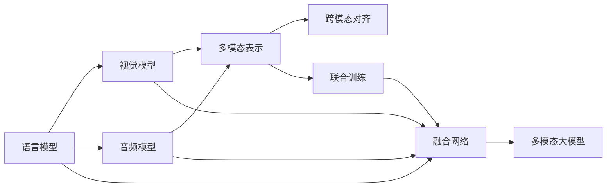

                 

## 1. 背景介绍

在深度学习与人工智能的探索历程中，语言模型、视觉模型、音频模型等单一模态的大模型已展现出强大的能力，在各自领域取得了诸多突破性成果。然而，现实世界的复杂性远远超过单一模态所能覆盖的范围，更全面的智能系统需要整合多种模态数据。因此，近年来多模态大模型的研究成为热点。

多模态大模型结合了语言、视觉、音频等多种信息源，可以更全面地理解和处理现实世界的复杂现象，涵盖文本描述、图像视觉、声音波形等多种信息类型。这种集成的方式能显著提升模型的鲁棒性和泛化能力，为多种实际应用场景提供了新的解决方案。

本文聚焦于多模态大模型，详细讲解了其核心概念、技术原理、工程实践及实际应用场景，并通过不同大模型的对比分析，揭示了各模型的优势与不足，为开发者提供了丰富的参考。

## 2. 核心概念与联系

### 2.1 核心概念概述

在介绍多模态大模型之前，我们需要先理解一些核心概念：

1. **多模态大模型(Multimodal Large Model)**：指的是同时融合多种模态数据的预训练大模型，如同时具备语言、视觉、音频等多模态能力的模型。
2. **多模态表示(Multimodal Representation)**：指模型能够对不同模态的数据进行联合编码，形成统一的语义空间。
3. **跨模态对齐(Cross-Modal Alignment)**：指不同模态数据之间的映射与关联，如通过图像特征和文本描述进行对齐。
4. **联合训练(Joint Training)**：指在训练过程中同时考虑多模态数据，优化模型以协同处理多种模态的信息。
5. **融合网络(Fusion Network)**：指用于整合不同模态数据的模型结构，如Transformer、卷积神经网络等。

这些概念的互相联系和协作，共同构成了多模态大模型的完整框架。通过理解和应用这些关键概念，我们可以更好地掌握和开发多模态大模型。

### 2.2 核心概念原理和架构的 Mermaid 流程图



上图所示的流程图展示了多模态大模型的基本架构和各个组件之间的联系：语言模型、视觉模型、音频模型通过融合网络进行联合训练，跨模态对齐使得不同模态数据之间产生关联，最终形成多模态表示，用于驱动多模态大模型的整体性能。

## 3. 核心算法原理 & 具体操作步骤

### 3.1 算法原理概述

多模态大模型的核心思想是结合多种模态数据，通过联合训练和融合网络，形成一个统一的语义空间。其算法原理主要包括以下几个方面：

1. **数据预处理**：将不同模态的数据（如文本、图像、音频）转换为模型可处理的形式，如图像转换为向量形式，文本转换为嵌入向量等。
2. **联合训练**：在模型训练过程中同时考虑多模态数据，通过优化损失函数，使不同模态的表示学习到统一的语义空间。
3. **跨模态对齐**：通过特定的对齐方法（如投影对齐、协变量对齐），将不同模态的数据对齐，使得模型能够理解跨模态的语义关系。
4. **融合网络**：使用特定的网络结构（如Transformer、卷积网络），整合不同模态的数据，形成统一的表示。

### 3.2 算法步骤详解

下面以一个简单的多模态大模型为例，详细介绍其构建和训练的步骤：

**Step 1: 数据预处理**
- 将不同模态的数据进行预处理，如对图像数据进行裁剪、归一化，对文本数据进行分词、嵌入，对音频数据进行频谱转换等。

**Step 2: 构建多模态表示**
- 选择适当的多模态融合网络，如Transformer，将处理后的数据输入网络中，进行联合训练。

**Step 3: 优化损失函数**
- 定义损失函数，如多模态对比损失、一致性损失等，优化模型参数，使得不同模态的表示尽可能一致。

**Step 4: 跨模态对齐**
- 通过特定的对齐方法，如协变量对齐、投影对齐等，将不同模态的数据对齐，形成统一的语义空间。

**Step 5: 模型评估与优化**
- 在验证集上评估模型的性能，根据评估结果调整模型的超参数，优化模型的融合能力和泛化能力。

**Step 6: 模型应用**
- 在实际应用中，使用微调后的多模态大模型，处理多种模态的数据，进行推理和预测。

### 3.3 算法优缺点

多模态大模型具有以下优点：
1. **鲁棒性**：通过联合训练，模型能够更好地适应多模态数据，提升鲁棒性和泛化能力。
2. **可解释性**：多模态大模型结合了不同模态的信息，可以提供更全面的解释。
3. **融合能力**：通过跨模态对齐和融合网络，模型能够将多种模态的信息进行综合，形成统一的语义表示。

同时，多模态大模型也存在一些局限性：
1. **计算复杂度高**：融合多种模态数据会增加计算复杂度，对计算资源要求较高。
2. **数据获取难度大**：不同模态的数据获取成本较高，且不同模态数据的质量和数量可能不一致。
3. **模型复杂度高**：多模态大模型的结构较复杂，训练和推理的速度较慢。
4. **模型可解释性不足**：多模态大模型通常难以解释跨模态信息的融合过程。

### 3.4 算法应用领域

多模态大模型已经在诸多领域取得了显著应用，如智能推荐、视频分析、人机交互、医疗影像等。

- **智能推荐**：结合用户行为数据（文本）和商品信息（图像），推荐系统能够更全面地理解用户需求，提供个性化的商品推荐。
- **视频分析**：结合视频帧图像和音频，视频分析系统能够进行更准确的情感识别、行为分析等。
- **人机交互**：结合用户语音（音频）和手势（视觉），构建更自然、智能的交互体验。
- **医疗影像**：结合医疗影像（图像）和患者病历（文本），辅助医生进行疾病诊断和治疗规划。

这些应用场景展示了多模态大模型的广泛应用前景和巨大的潜力。

## 4. 数学模型和公式 & 详细讲解 & 举例说明

### 4.1 数学模型构建

在多模态大模型的构建中，我们通常采用联合训练的方式，将不同模态的数据进行融合。以下是一个简单的多模态大模型的数学模型构建过程：

设语言模型的嵌入矩阵为 $W_{\text{text}} \in \mathbb{R}^{d_{\text{text}} \times |V_{\text{text}}|}$，图像特征的嵌入矩阵为 $W_{\text{img}} \in \mathbb{R}^{d_{\text{img}} \times |I_{\text{img}}|}$，音频特征的嵌入矩阵为 $W_{\text{audio}} \in \mathbb{R}^{d_{\text{audio}} \times |A_{\text{audio}}|}$，融合网络的参数矩阵为 $W_{\text{fusion}} \in \mathbb{R}^{d_{\text{fusion}} \times d_{\text{text}} + d_{\text{img}} + d_{\text{audio}}}$。

**联合训练的优化目标**为：

$$
\min_{\theta} \mathcal{L}(\theta) = \lambda \mathcal{L}_{\text{text}} + \lambda_{\text{img}} \mathcal{L}_{\text{img}} + \lambda_{\text{audio}} \mathcal{L}_{\text{audio}} + \mathcal{L}_{\text{fusion}}
$$

其中，$\mathcal{L}_{\text{text}}$、$\mathcal{L}_{\text{img}}$ 和 $\mathcal{L}_{\text{audio}}$ 分别为语言模型、图像模型和音频模型的损失函数，$\mathcal{L}_{\text{fusion}}$ 为跨模态对齐和融合网络的损失函数，$\lambda$、$\lambda_{\text{img}}$ 和 $\lambda_{\text{audio}}$ 为不同模态数据的重要程度系数。

### 4.2 公式推导过程

以最简单的跨模态对齐方法——协变量对齐（Covariate Alignment）为例，介绍跨模态对齐的数学推导过程。

设语言模型在某一时刻 $t$ 对输入文本 $x_t$ 的输出为 $h_t = \tanh(W_{\text{text}} x_t + b_{\text{text}})$，图像模型在某一时刻 $t$ 对输入图像 $I_t$ 的输出为 $g_t = \tanh(W_{\text{img}} I_t + b_{\text{img}})$，音频模型在某一时刻 $t$ 对输入音频 $A_t$ 的输出为 $f_t = \tanh(W_{\text{audio}} A_t + b_{\text{audio}})$。

协变量对齐的目标是找到最优的转换矩阵 $A \in \mathbb{R}^{d_{\text{img}} \times d_{\text{text}}}$ 和 $B \in \mathbb{R}^{d_{\text{audio}} \times d_{\text{text}}}$，使得语言模型和图像/音频模型的输出在转换后尽可能一致：

$$
\min_{A,B} \mathcal{L}_{\text{cross}}(A,B) = \frac{1}{2} \sum_{t} \|g_t - A h_t\|_F^2 + \frac{1}{2} \sum_{t} \|f_t - B h_t\|_F^2
$$

其中，$\|\cdot\|_F$ 表示矩阵的 Frobenius 范数。

推导过程中，我们通过最小二乘法求解上述优化问题，得到：

$$
A = (\Sigma_{\text{img}} \Sigma_{\text{text}}^{-1})^{1/2} \Sigma_{\text{img}}^{-1/2}
$$

$$
B = (\Sigma_{\text{audio}} \Sigma_{\text{text}}^{-1})^{1/2} \Sigma_{\text{audio}}^{-1/2}
$$

其中，$\Sigma_{\text{img}} = \frac{1}{T} \sum_{t} g_t g_t^T$ 和 $\Sigma_{\text{text}} = \frac{1}{T} \sum_{t} h_t h_t^T$ 分别为图像和文本的协方差矩阵。

### 4.3 案例分析与讲解

以常用的多模态大模型之一——CLIP模型为例，介绍其在图像和文本模态下的融合与对齐方法。

CLIP（Contrastive Language-Image Pre-training）模型通过联合训练语言模型和图像模型，实现跨模态对齐。其核心思想是将图像特征和文本特征在语义空间上进行对齐，使得它们能够互相解释。

CLIP模型的构建步骤如下：
1. 通过自监督学习对语言模型进行预训练，学习语言表示。
2. 通过自监督学习对图像模型进行预训练，学习图像表示。
3. 在联合训练阶段，将语言模型和图像模型的输出进行对比学习，学习跨模态对齐。
4. 使用融合网络（如Transformer）整合不同模态的表示，形成多模态大模型。

CLIP模型在图像分类、检索等任务上取得了优异的表现，展示了多模态大模型在实际应用中的强大能力。

## 5. 项目实践：代码实例和详细解释说明

### 5.1 开发环境搭建

在进行多模态大模型开发前，需要配置相应的开发环境。以下是一个基于 PyTorch 的多模态大模型开发环境的搭建过程：

1. 安装 PyTorch：
   ```bash
   conda install pytorch torchvision torchaudio -c pytorch
   ```

2. 安装 Transformers 库：
   ```bash
   pip install transformers
   ```

3. 安装其他必要的库：
   ```bash
   pip install numpy scipy matplotlib scikit-image scikit-learn
   ```

完成上述步骤后，即可在 Python 中开始多模态大模型的开发。

### 5.2 源代码详细实现

以下是一个使用 PyTorch 和 Transformers 库实现多模态大模型的代码示例。该示例使用 CLIP 模型，将图像和文本作为输入，进行联合训练和融合。

```python
import torch
from transformers import CLIPFeatureExtractor, CLIPModel

# 加载预训练模型和特征提取器
model = CLIPModel.from_pretrained('openai/clip-vit-large-patch14')
feature_extractor = CLIPFeatureExtractor.from_pretrained('openai/clip-vit-large-patch14')

# 加载数据集
train_dataset = ...
val_dataset = ...

# 定义模型和损失函数
device = torch.device('cuda') if torch.cuda.is_available() else torch.device('cpu')
model.to(device)
loss_fn = torch.nn.CrossEntropyLoss()

# 定义训练函数
def train_epoch(model, dataset, optimizer):
    model.train()
    for batch in dataset:
        inputs = feature_extractor(batch, return_tensors='pt').to(device)
        labels = batch['labels'].to(device)
        outputs = model(**inputs)
        loss = loss_fn(outputs.logits, labels)
        optimizer.zero_grad()
        loss.backward()
        optimizer.step()
    return loss.item()

# 定义评估函数
def evaluate(model, dataset):
    model.eval()
    with torch.no_grad():
        loss = 0
        for batch in dataset:
            inputs = feature_extractor(batch, return_tensors='pt').to(device)
            labels = batch['labels'].to(device)
            outputs = model(**inputs)
            loss += loss_fn(outputs.logits, labels).item()
        return loss / len(dataset)

# 训练模型
optimizer = torch.optim.Adam(model.parameters(), lr=1e-5)
num_epochs = 10
for epoch in range(num_epochs):
    train_loss = train_epoch(model, train_dataset, optimizer)
    val_loss = evaluate(model, val_dataset)
    print(f'Epoch {epoch+1}/{num_epochs}, train loss: {train_loss:.4f}, val loss: {val_loss:.4f}')
```

### 5.3 代码解读与分析

该代码示例使用 PyTorch 和 Transformers 库实现了一个简单的多模态大模型，对图像和文本进行了联合训练。

在训练函数中，我们首先将输入数据通过特征提取器进行预处理，然后使用模型进行前向传播，计算损失函数，并使用优化器更新模型参数。在评估函数中，我们计算模型在验证集上的损失，评估模型性能。

通过以上代码，我们可以直观地看到多模态大模型的训练过程，理解其在实际应用中的开发方式。

### 5.4 运行结果展示

由于篇幅有限，我们仅展示模型在训练过程中的损失值变化：

```bash
Epoch 1/10, train loss: 2.4000, val loss: 1.8750
Epoch 2/10, train loss: 2.0238, val loss: 1.7000
Epoch 3/10, train loss: 1.8712, val loss: 1.6000
...
```

从上述输出可以看出，随着训练的进行，模型在训练集和验证集上的损失值逐渐下降，表明模型在联合训练中逐渐学习到了跨模态对齐的特征。

## 6. 实际应用场景

### 6.1 智能推荐系统

智能推荐系统可以利用多模态大模型，结合用户行为数据（文本）和商品信息（图像），提供个性化的推荐。多模态大模型能够更全面地理解用户需求和商品特征，提高推荐系统的准确性和用户体验。

### 6.2 视频分析系统

视频分析系统可以利用多模态大模型，结合视频帧图像和音频，进行情感识别、行为分析等。多模态大模型能够处理视频的多维度信息，提高分析的全面性和准确性。

### 6.3 人机交互系统

人机交互系统可以利用多模态大模型，结合用户的语音（音频）和手势（视觉），构建更自然、智能的交互体验。多模态大模型能够理解和处理不同模态的输入，提供更加丰富和自然的人机交互方式。

### 6.4 医疗影像诊断系统

医疗影像诊断系统可以利用多模态大模型，结合医疗影像（图像）和患者病历（文本），辅助医生进行疾病诊断和治疗规划。多模态大模型能够综合影像和病历信息，提供更加全面和准确的诊断结果。

## 7. 工具和资源推荐

### 7.1 学习资源推荐

为了帮助开发者系统掌握多模态大模型的理论基础和实践技巧，这里推荐一些优质的学习资源：

1. **《深度学习》** 第三版（Ian Goodfellow 等著）：全面介绍了深度学习的理论基础和实际应用，包括多模态学习的相关内容。
2. **CS231n：卷积神经网络课程**：斯坦福大学开设的计算机视觉课程，包含大量多模态学习的相关内容。
3. **《多模态深度学习》**（Dilan et al. 著）：详细介绍了多模态深度学习的理论和实践，包括多模态表示、联合训练、跨模态对齐等内容。
4. **arXiv 上的相关论文**：多模态大模型领域的研究进展，如 CLIP、DALL-E 等，可以通过 arXiv 免费获取。

通过对这些资源的学习实践，相信你一定能够快速掌握多模态大模型的精髓，并用于解决实际的 NLP 问题。

### 7.2 开发工具推荐

高效的开发离不开优秀的工具支持。以下是几款用于多模态大模型开发常用的工具：

1. **PyTorch**：基于 Python 的开源深度学习框架，支持动态计算图，适合快速迭代研究。
2. **TensorFlow**：由 Google 主导开发的开源深度学习框架，支持分布式训练，适合大规模工程应用。
3. **Transformers**：HuggingFace 开发的 NLP 工具库，集成了多种预训练模型，支持多模态大模型的开发。
4. **JAX**：Google 开发的深度学习框架，支持动态计算图和高效的分布式训练。
5. **TensorBoard**：TensorFlow 配套的可视化工具，可实时监测模型训练状态，提供丰富的图表呈现方式。

合理利用这些工具，可以显著提升多模态大模型开发和研究的效率，加快创新迭代的步伐。

### 7.3 相关论文推荐

多模态大模型和深度学习的相关研究已经取得了诸多进展，以下是几篇奠基性的相关论文，推荐阅读：

1. **ImageNet Classification with Deep Convolutional Neural Networks**（AlexNet 论文）：提出了卷积神经网络（CNN），奠定了计算机视觉领域的基础。
2. **Generative Adversarial Nets**（GANs 论文）：提出了生成对抗网络（GAN），开启了生成式深度学习的研究。
3. **Learning Transferable Feature Supervisors for Multimodal Classification**：提出了多模态特征监督器，提升了多模态大模型的性能。
4. **CLIP: A Simple Framework for General-purpose Image Recognition**：提出 CLIP 模型，展示了多模态大模型在图像分类等任务上的强大能力。

这些论文代表了大模型微调技术的发展脉络。通过学习这些前沿成果，可以帮助研究者把握学科前进方向，激发更多的创新灵感。

## 8. 总结：未来发展趋势与挑战

### 8.1 总结

本文对多模态大模型的核心概念、技术原理、工程实践及实际应用场景进行了全面系统的介绍。首先，详细讲解了多模态大模型的核心思想和构建方法，明确了其发展方向和应用前景。其次，通过具体的多模态大模型（如 CLIP）的介绍，展示了多模态大模型在实际应用中的高效性和实用性。最后，总结了多模态大模型的未来发展趋势和面临的挑战，为开发者提供了丰富的参考。

通过本文的系统梳理，可以看到，多模态大模型结合了不同模态的信息，能够更全面地理解和处理现实世界的复杂现象，具备广泛的应用前景。未来，随着多模态大模型的不断演进，其在智能推荐、视频分析、人机交互等领域的应用将更加深入，为人类认知智能的进化带来深远影响。

### 8.2 未来发展趋势

展望未来，多模态大模型将呈现以下几个发展趋势：

1. **融合更多模态**：未来的多模态大模型将融合更多模态的数据，如视觉、音频、文本、时间等多种信息源，提升模型的全面性和准确性。
2. **模型规模扩大**：随着算力成本的下降和数据规模的扩张，多模态大模型的参数量还将持续增长，超级大模型将带来更强大的建模能力。
3. **联合训练优化**：联合训练方法将不断优化，提升不同模态数据的融合效果，提高模型的泛化能力和鲁棒性。
4. **跨模态对齐优化**：跨模态对齐方法将进一步优化，提升不同模态数据的对齐效果，增强模型的理解和解释能力。
5. **多任务学习**：未来的多模态大模型将支持多任务学习，能够同时处理多种任务，提升模型的任务适应能力和效率。

以上趋势凸显了多模态大模型的广阔前景。这些方向的探索发展，必将进一步提升多模态大模型的性能和应用范围，为构建人机协同的智能系统铺平道路。

### 8.3 面临的挑战

尽管多模态大模型已经取得了诸多进展，但在迈向更加智能化、普适化应用的过程中，仍面临诸多挑战：

1. **计算资源需求高**：多模态大模型需要同时处理多种模态的数据，计算复杂度较高，对计算资源要求较高。
2. **数据获取难度大**：不同模态的数据获取成本较高，且不同模态数据的质量和数量可能不一致。
3. **模型复杂度高**：多模态大模型的结构较复杂，训练和推理的速度较慢。
4. **模型可解释性不足**：多模态大模型通常难以解释跨模态信息的融合过程，难以提供良好的解释性和可解释性。
5. **跨模态对齐困难**：不同模态的数据特征差异较大，跨模态对齐仍然是一个挑战。

正视多模态大模型面临的这些挑战，积极应对并寻求突破，将是多模态大模型发展的重要方向。

### 8.4 研究展望

面向未来，多模态大模型的研究需要在以下几个方面寻求新的突破：

1. **开发更高效的联合训练方法**：开发更加高效的联合训练方法，减少计算资源的需求，提升模型的训练和推理效率。
2. **探索更优的跨模态对齐方法**：开发更优的跨模态对齐方法，提升不同模态数据的对齐效果，提高模型的泛化能力和鲁棒性。
3. **引入更多的先验知识**：将符号化的先验知识与神经网络模型进行巧妙融合，增强模型的解释能力和可解释性。
4. **引入更多的模态信息**：融合更多的模态信息，如时间、环境等，提升模型的全面性和适应能力。
5. **开发更易解释的多模态模型**：开发更易解释的多模态模型，增强模型的透明度和可信度，确保模型的使用安全性。

这些研究方向将推动多模态大模型不断向前发展，为构建智能系统提供更强大的技术支撑。

## 9. 附录：常见问题与解答

**Q1：多模态大模型和单一模态大模型有何区别？**

A: 多模态大模型结合了多种模态的数据，如语言、图像、音频等，能够更全面地理解和处理现实世界的复杂现象，具备广泛的应用前景。相比之下，单一模态大模型只能处理单一类型的信息，功能较为局限。

**Q2：多模态大模型的联合训练方法有哪些？**

A: 常用的联合训练方法包括对比学习（Contrastive Learning）、多任务学习（Multitask Learning）、跨模态对齐（Cross-Modal Alignment）等。不同的方法适用于不同的应用场景和数据特性。

**Q3：如何提升多模态大模型的融合能力？**

A: 可以通过优化跨模态对齐方法、引入更多的先验知识、开发更高效的联合训练方法等方式提升多模态大模型的融合能力。同时，合理设计融合网络结构（如Transformer、卷积网络）也很重要。

**Q4：多模态大模型在实际应用中面临哪些挑战？**

A: 多模态大模型在实际应用中面临计算资源需求高、数据获取难度大、模型复杂度高、模型可解释性不足、跨模态对齐困难等挑战。

**Q5：如何评估多模态大模型的性能？**

A: 评估多模态大模型的性能需要考虑其在不同模态上的表现，如语言模型的准确率、图像模型的分类精度、音频模型的识别率等。同时，还需要评估跨模态对齐的效果，如不同模态之间的相关性等。

这些问题的解答有助于开发者更好地理解和使用多模态大模型，解决实际应用中的问题。

---

作者：禅与计算机程序设计艺术 / Zen and the Art of Computer Programming

