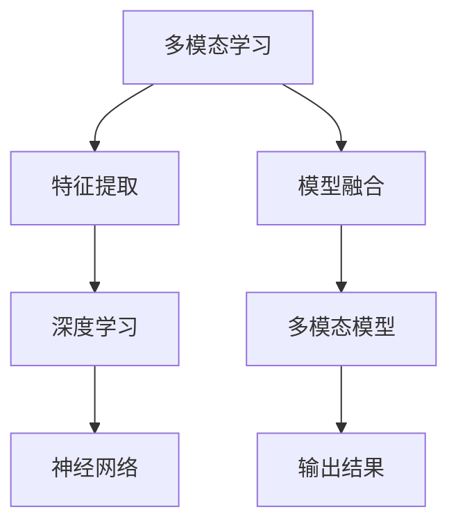

                 

# 多模态学习原理与代码实战案例讲解

> 关键词：多模态学习,特征提取,模型融合,深度学习,PyTorch

## 1. 背景介绍

### 1.1 问题由来
随着人工智能技术的发展，单一模态的数据（如文本、图像、音频）已经难以满足复杂多变的现实需求。多模态数据融合技术应运而生，通过综合多种数据模态的特性，增强模型的感知能力和泛化能力，从而提升智能系统的表现。

多模态学习，即利用多模态数据进行训练和推理，已经成为AI领域的研究热点。其应用场景包括：图像描述生成、语音识别、跨模态检索、自动驾驶、医疗影像分析等。多模态学习通过融合多源信息，实现更为精细的语义理解，具备更强的泛化能力和鲁棒性。

### 1.2 问题核心关键点
多模态学习主要涉及以下几个关键问题：
1. **特征提取**：如何将不同模态的数据转换成统一的向量空间，使得不同模态的数据可以相互融合。
2. **模型融合**：如何设计多模态模型，将不同模态的特征进行合理融合，得到高质量的输出结果。
3. **融合策略**：如何选择合适的方法将不同模态的特征进行组合，使得融合结果既充分利用了多模态信息，又能够简化模型的计算和训练。

多模态学习的目标是通过多种数据源的结合，提升模型的综合能力，在实际应用中取得更好的效果。

### 1.3 问题研究意义
多模态学习的研究意义在于：
1. **增强感知能力**：通过多模态信息的结合，模型能够捕捉到更为丰富的信息，从而提升感知能力。
2. **提升泛化能力**：多模态数据通常具备更好的泛化能力，能够在各种应用场景中表现优异。
3. **推动应用落地**：多模态学习技术能够支持更多复杂的应用场景，促进AI技术的广泛应用。
4. **促进跨学科发展**：多模态学习涉及计算机视觉、自然语言处理、语音识别等多个学科，有利于跨学科的研究与交流。

## 2. 核心概念与联系

### 2.1 核心概念概述

为更好地理解多模态学习的核心概念，本节将介绍几个密切相关的核心概念：

- **多模态学习**：利用多种数据模态进行训练和推理的技术，提升模型的感知能力和泛化能力。
- **特征提取**：将不同模态的数据转换为可用于模型训练的向量表示。
- **模型融合**：将不同模态的特征进行融合，得到最终的高质量输出。
- **深度学习**：基于多层神经网络进行复杂数据建模和处理的技术，是实现多模态学习的重要手段。
- **PyTorch**：开源深度学习框架，支持动态计算图和GPU加速，广泛应用于多模态学习研究。

这些核心概念之间的逻辑关系可以通过以下Mermaid流程图来展示：



这个流程图展示了大语言模型的核心概念及其之间的关系：

1. 多模态学习利用多种数据模态进行训练和推理，提升模型的感知能力和泛化能力。
2. 特征提取将不同模态的数据转换为可用于模型训练的向量表示。
3. 模型融合将不同模态的特征进行融合，得到最终的高质量输出。
4. 深度学习基于多层神经网络进行复杂数据建模和处理。
5. 多模态模型是实现多模态学习的重要手段。
6. 输出结果是模型融合的结果，用于实际应用场景。

这些概念共同构成了多模态学习的学习和应用框架，使其能够在各种场景下发挥强大的感知能力。通过理解这些核心概念，我们可以更好地把握多模态学习的原理和优化方向。

## 3. 核心算法原理 & 具体操作步骤
### 3.1 算法原理概述

多模态学习的核心思想是通过将多种数据模态的特征进行融合，得到更加全面、准确的结果。其基本流程包括以下几个步骤：

1. **特征提取**：将不同模态的数据转换为可用于模型训练的向量表示。
2. **模型融合**：将不同模态的特征进行融合，得到最终的高质量输出。
3. **训练与推理**：在融合后的特征上进行深度学习模型的训练和推理。

通过深度学习模型，可以将不同模态的特征进行有效融合，得到高质量的输出结果。常用的深度学习框架包括TensorFlow、PyTorch等，其中PyTorch以其动态计算图和GPU加速的特点，成为多模态学习的主流框架。

### 3.2 算法步骤详解

多模态学习的基本流程包括以下几个关键步骤：

**Step 1: 准备数据集**
- 收集多模态数据集，包括文本、图像、音频等不同类型的数据。
- 对数据进行预处理，如文本分词、图像预处理等，使得数据适合进行模型训练。

**Step 2: 特征提取**
- 对不同模态的数据进行特征提取，得到可用于模型训练的向量表示。
- 常用的特征提取方法包括：
  - 文本：使用Word2Vec、BERT等预训练模型提取文本特征。
  - 图像：使用卷积神经网络(CNN)提取图像特征。
  - 语音：使用Mel频谱、MFCC等方法提取语音特征。

**Step 3: 模型融合**
- 将提取出的不同模态特征进行融合，得到最终的高质量输出。
- 常用的模型融合方法包括：
  - 拼接：将不同模态的特征直接拼接在一起，得到多维向量。
  - 加权拼接：对不同模态的特征进行加权拼接，使得重要特征得到更多的关注。
  - 多模态注意力机制：使用注意力机制对不同模态的特征进行加权融合。

**Step 4: 训练与推理**
- 在融合后的特征上进行深度学习模型的训练和推理。
- 常用的深度学习框架包括TensorFlow、PyTorch等。
- 使用训练后的模型进行推理，得到实际应用中的输出结果。

### 3.3 算法优缺点

多模态学习具有以下优点：
1. **增强感知能力**：通过多种数据模态的结合，模型能够捕捉到更为丰富的信息。
2. **提升泛化能力**：多模态数据通常具备更好的泛化能力，能够在各种应用场景中表现优异。
3. **推动应用落地**：多模态学习技术能够支持更多复杂的应用场景，促进AI技术的广泛应用。

同时，该方法也存在一定的局限性：
1. **数据获取难度高**：不同模态的数据通常难以获取，特别是在某些特殊场景中。
2. **数据格式不统一**：不同模态的数据格式各异，需要进行复杂的转换和处理。
3. **计算资源消耗大**：多模态学习模型通常较大，训练和推理的计算资源消耗较大。
4. **融合策略复杂**：如何设计合适的融合策略，使得不同模态的特征得到合理利用，是一个复杂的问题。

尽管存在这些局限性，但多模态学习在多个应用领域中已经取得了显著成效，展示了其巨大的潜力。未来相关研究的重点在于如何进一步降低数据获取难度，提高融合策略的鲁棒性，优化计算资源消耗，使得多模态学习技术能够更好地应用于实际问题。

### 3.4 算法应用领域

多模态学习已经在多个领域中得到了广泛的应用，例如：

- **图像描述生成**：将图像和文本数据进行融合，生成对图像的详细描述。
- **语音识别**：结合语音和文本数据，提升语音识别的准确性。
- **跨模态检索**：通过融合多模态数据，实现跨模态的检索和匹配。
- **自动驾驶**：结合图像、雷达、激光雷达等数据，提升自动驾驶系统的感知能力。
- **医疗影像分析**：结合图像和文本数据，辅助医生进行疾病诊断。

除了上述这些经典任务外，多模态学习还被创新性地应用到更多场景中，如虚拟现实、增强现实、智能家居等，为人工智能技术带来了新的突破。随着预训练模型和特征提取方法的不断进步，相信多模态学习技术将在更广泛的领域大放异彩。

## 4. 数学模型和公式 & 详细讲解 & 举例说明

### 4.1 数学模型构建

本节将使用数学语言对多模态学习的数学模型进行更加严格的刻画。

记多模态数据集为 $D=\{(x_{t,i}, x_{i,j}, x_{i,k})\}_{i=1}^N, x_{t,i} \in \mathcal{X}_t, x_{i,j} \in \mathcal{X}_j, x_{i,k} \in \mathcal{X}_k$，其中 $\mathcal{X}_t, \mathcal{X}_j, \mathcal{X}_k$ 分别为文本、图像、语音等数据类型，$x_{t,i}$ 表示文本数据，$x_{i,j}$ 表示图像数据，$x_{i,k}$ 表示语音数据。

定义特征提取函数 $f_t, f_j, f_k$，分别将文本、图像、语音数据转换为向量表示，得到特征 $t, j, k$。设融合函数为 $g$，将不同模态的特征进行融合，得到最终的输出结果 $y$。

定义损失函数 $\mathcal{L}$，用于衡量模型的输出结果与真实标签 $y^*$ 之间的差异。在训练过程中，最小化损失函数 $\mathcal{L}$，使得模型的输出结果尽可能逼近真实标签。

### 4.2 公式推导过程

以下我们以图像描述生成任务为例，推导多模态学习模型的损失函数及其梯度的计算公式。

假设输入图像为 $x_i \in \mathcal{X}_j$，文本描述为 $x_t \in \mathcal{X}_t$。定义特征提取函数 $f_t, f_j$，分别提取文本和图像的特征表示。设文本描述的嵌入向量为 $t$，图像的嵌入向量为 $j$，融合后的特征表示为 $y$。定义特征融合函数 $g$ 为拼接方式，即 $g(t, j) = [t, j]$。

假设输出为图像描述 $y^*$，则图像描述生成的任务可以表示为：

$$
\hat{y} = g(f_t(x_t), f_j(x_i))
$$

定义损失函数为交叉熵损失，即：

$$
\mathcal{L}(y^*, \hat{y}) = -\frac{1}{N} \sum_{i=1}^N [y_i^* \log \hat{y}_i + (1-y_i^*) \log (1-\hat{y}_i)]
$$

根据链式法则，损失函数对文本嵌入向量 $t$ 的梯度为：

$$
\frac{\partial \mathcal{L}(y^*, \hat{y})}{\partial t} = -\frac{\partial g(f_t(x_t), f_j(x_i))}{\partial t} \frac{\partial \mathcal{L}(y^*, \hat{y})}{\partial g(f_t(x_t), f_j(x_i))]
$$

其中，$\frac{\partial g(f_t(x_t), f_j(x_i))}{\partial t}$ 表示融合函数 $g$ 对文本嵌入向量 $t$ 的导数，可以通过自动微分技术计算得到。

在得到损失函数的梯度后，即可带入模型参数更新公式，完成模型的迭代优化。重复上述过程直至收敛，最终得到适应多模态任务的最优模型参数。

## 5. 项目实践：代码实例和详细解释说明

### 5.1 开发环境搭建

在进行多模态学习实践前，我们需要准备好开发环境。以下是使用Python进行PyTorch开发的环境配置流程：

1. 安装Anaconda：从官网下载并安装Anaconda，用于创建独立的Python环境。

2. 创建并激活虚拟环境：
```bash
conda create -n pytorch-env python=3.8 
conda activate pytorch-env
```

3. 安装PyTorch：根据CUDA版本，从官网获取对应的安装命令。例如：
```bash
conda install pytorch torchvision torchaudio cudatoolkit=11.1 -c pytorch -c conda-forge
```

4. 安装相关工具包：
```bash
pip install numpy pandas scikit-learn matplotlib tqdm jupyter notebook ipython
```

完成上述步骤后，即可在`pytorch-env`环境中开始多模态学习实践。

### 5.2 源代码详细实现

下面我们以图像描述生成任务为例，给出使用PyTorch进行多模态学习的代码实现。

首先，定义多模态学习模型：

```python
import torch
import torch.nn as nn
import torch.nn.functional as F

class MultimodalModel(nn.Module):
    def __init__(self, embed_dim, img_feat_dim, text_feat_dim):
        super(MultimodalModel, self).__init__()
        self.img_embed = nn.Sequential(
            nn.Conv2d(3, img_feat_dim, kernel_size=3, stride=1, padding=1),
            nn.ReLU(),
            nn.Linear(img_feat_dim, embed_dim)
        )
        self.text_embed = nn.Sequential(
            nn.Embedding(vocab_size, embed_dim),
            nn.Linear(embed_dim, embed_dim)
        )
        self.fusion = nn.Linear(2*embed_dim, embed_dim)
        self.fc = nn.Linear(embed_dim, vocab_size)

    def forward(self, img, text):
        img = self.img_embed(img)
        text = self.text_embed(text)
        cat = torch.cat([img, text], dim=1)
        fusion = self.fusion(cat)
        out = self.fc(fusion)
        return out
```

然后，定义损失函数和优化器：

```python
from torch.optim import Adam

# 定义交叉熵损失函数
criterion = nn.CrossEntropyLoss()

# 定义优化器
model = MultimodalModel(embed_dim, img_feat_dim, text_feat_dim)
optimizer = Adam(model.parameters(), lr=0.001)
```

接着，定义训练和评估函数：

```python
from torch.utils.data import DataLoader
from tqdm import tqdm

# 定义训练函数
def train(model, data_loader, optimizer, device):
    model.train()
    total_loss = 0
    for i, (img, text, target) in enumerate(data_loader):
        img, text, target = img.to(device), text.to(device), target.to(device)
        optimizer.zero_grad()
        output = model(img, text)
        loss = criterion(output, target)
        loss.backward()
        optimizer.step()
        total_loss += loss.item()
    return total_loss / len(data_loader)

# 定义评估函数
def evaluate(model, data_loader, device):
    model.eval()
    total_loss = 0
    with torch.no_grad():
        for i, (img, text, target) in enumerate(data_loader):
            img, text, target = img.to(device), text.to(device), target.to(device)
            output = model(img, text)
            loss = criterion(output, target)
            total_loss += loss.item()
    return total_loss / len(data_loader)
```

最后，启动训练流程并在测试集上评估：

```python
epochs = 10
batch_size = 32
device = torch.device('cuda' if torch.cuda.is_available() else 'cpu')

for epoch in range(epochs):
    train_loss = train(model, train_loader, optimizer, device)
    print(f'Epoch {epoch+1}, train loss: {train_loss:.3f}')
    eval_loss = evaluate(model, val_loader, device)
    print(f'Epoch {epoch+1}, val loss: {eval_loss:.3f}')
```

以上就是使用PyTorch进行图像描述生成任务的多模态学习代码实现。可以看到，得益于PyTorch的动态计算图和丰富的工具库，多模态学习任务的开发变得简洁高效。

### 5.3 代码解读与分析

让我们再详细解读一下关键代码的实现细节：

**MultimodalModel类**：
- `__init__`方法：初始化特征提取层和融合层，以及全连接层。
- `forward`方法：定义前向传播过程，将图像和文本特征进行拼接，再经过融合和全连接层输出。

**损失函数和优化器**：
- 使用PyTorch的`nn.CrossEntropyLoss`作为损失函数，适用于多类别分类任务。
- 使用`torch.optim.Adam`优化器，支持动态学习率调整，适用于深度神经网络模型的训练。

**训练和评估函数**：
- 使用PyTorch的`DataLoader`对数据集进行批次化加载，供模型训练和推理使用。
- 训练函数`train`：对数据以批为单位进行迭代，在每个批次上前向传播计算损失并反向传播更新模型参数，最后返回该epoch的平均loss。
- 评估函数`evaluate`：与训练类似，不同点在于不更新模型参数，并在每个batch结束后将预测和标签结果存储下来，最后使用均值计算评估集的损失。

**训练流程**：
- 定义总的epoch数和batch size，开始循环迭代
- 每个epoch内，先在训练集上训练，输出平均loss
- 在验证集上评估，输出平均loss
- 重复上述步骤直至收敛

可以看到，PyTorch配合多模态学习模型的代码实现变得简洁高效。开发者可以将更多精力放在数据处理、模型改进等高层逻辑上，而不必过多关注底层的实现细节。

当然，工业级的系统实现还需考虑更多因素，如模型的保存和部署、超参数的自动搜索、更灵活的任务适配层等。但核心的多模态学习范式基本与此类似。

## 6. 实际应用场景
### 6.1 智能家居

多模态学习技术可以应用于智能家居系统的构建。传统的家居系统通常只能通过单一传感器进行监测和控制，无法全面感知家庭环境。通过结合多模态数据，智能家居系统可以实现更为精细的感知和控制。

例如，结合图像和语音数据，智能家居系统可以识别家庭成员的身份和行为，并根据指令控制家电设备的开关、温度等参数。结合图像和温度传感器数据，系统可以自动识别家庭成员的情感状态，并调整室内环境以提供舒适体验。这些应用场景展示了多模态学习在智能家居中的广泛应用，带来了更为智能化和个性化的家居体验。

### 6.2 医疗影像分析

医疗影像分析是多模态学习在医疗领域的重要应用之一。在医疗影像分析中，结合图像和文本数据，可以提升疾病的诊断准确率和诊疗效率。

例如，结合X光图像和医生的病历记录，系统可以自动识别影像中的病变区域，并提供相关的病史和诊断建议。结合超声图像和医生的临床数据，系统可以预测疾病的发生概率，并提供个性化的诊疗方案。这些应用场景展示了多模态学习在医疗影像分析中的巨大潜力，为医疗行业的智能化转型提供了新的方向。

### 6.3 自动驾驶

自动驾驶是多模态学习在智能交通领域的重要应用之一。在自动驾驶中，结合图像、雷达、激光雷达等数据，系统可以全面感知道路环境，提升驾驶的安全性和可靠性。

例如，结合图像和雷达数据，系统可以实时检测交通标志和行人，并提供预警和避让方案。结合激光雷达和GPS数据，系统可以实时计算车辆位置和姿态，并优化行驶路径。这些应用场景展示了多模态学习在自动驾驶中的广泛应用，为智能交通的全面落地提供了新的可能。

### 6.4 未来应用展望

随着多模态学习技术的不断发展，其在更多领域中的应用前景将更加广阔。未来，多模态学习技术有望在以下几个方向取得突破：

1. **跨模态推理**：结合多模态数据进行推理，提升智能系统的综合能力。例如，结合图像和文本数据进行图像描述生成，结合语音和文本数据进行语音识别。

2. **跨领域迁移学习**：利用多模态学习技术，实现跨领域的迁移学习，提升模型在不同领域之间的泛化能力。例如，利用文本和图像数据进行跨领域情感分析，利用语音和文本数据进行跨领域语音识别。

3. **多模态生成对抗网络**：结合多模态数据进行生成对抗网络训练，生成高质量的多模态数据。例如，结合图像和文本数据生成图像描述，结合语音和文本数据生成语音文本。

4. **多模态交互界面**：结合多模态数据进行交互界面的优化，提升用户交互体验。例如，结合语音和文本数据进行智能客服，结合图像和语音数据进行虚拟现实交互。

5. **多模态增强现实**：结合多模态数据进行增强现实系统的优化，提升用户体验。例如，结合图像和语音数据进行AR游戏交互，结合图像和文本数据进行AR导航。

这些应用方向的探索，将进一步拓展多模态学习技术的边界，为人工智能技术带来新的突破。未来，随着多模态学习技术的不断演进，其在各个领域的应用将更加广泛，为智能系统的智能化、自动化和人性化提供新的可能性。

## 7. 工具和资源推荐
### 7.1 学习资源推荐

为了帮助开发者系统掌握多模态学习的理论基础和实践技巧，这里推荐一些优质的学习资源：

1. **深度学习入门**：
   - 《深度学习》：Ian Goodfellow等著，全面介绍了深度学习的基本原理和应用。
   - 《Python深度学习》：Francois Chollet著，介绍了使用Keras框架进行深度学习开发的实践方法。

2. **多模态学习相关**：
   - 《多模态机器学习》：Yifan Hu等著，介绍了多模态机器学习的基本原理和应用。
   - 《多模态深度学习》：Omar Al-Shedivat等著，介绍了使用深度学习进行多模态信息融合的方法。

3. **PyTorch官方文档**：
   - PyTorch官方文档：提供了完整的PyTorch框架和工具库的文档，是学习多模态学习的重要参考资料。

4. **相关论文推荐**：
   - "FusionNet: An End-to-End Fusion Network for Cross-modal Retrieval"：使用了多模态注意力机制进行特征融合。
   - "Multi-Modal Feature Fusion for Image Captioning"：使用拼接和注意力机制进行特征融合，取得了良好的效果。

通过对这些资源的学习实践，相信你一定能够快速掌握多模态学习的精髓，并用于解决实际的NLP问题。

### 7.2 开发工具推荐

高效的开发离不开优秀的工具支持。以下是几款用于多模态学习开发的常用工具：

1. **PyTorch**：开源深度学习框架，支持动态计算图和GPU加速，广泛应用于多模态学习研究。
2. **TensorFlow**：由Google主导开发的开源深度学习框架，生产部署方便，适合大规模工程应用。
3. **HuggingFace Transformers库**：集成了众多预训练模型，支持多种深度学习框架，方便进行多模态学习开发。
4. **Weights & Biases**：模型训练的实验跟踪工具，可以记录和可视化模型训练过程中的各项指标，方便对比和调优。
5. **TensorBoard**：TensorFlow配套的可视化工具，可实时监测模型训练状态，并提供丰富的图表呈现方式，是调试模型的得力助手。

合理利用这些工具，可以显著提升多模态学习任务的开发效率，加快创新迭代的步伐。

### 7.3 相关论文推荐

多模态学习的研究方向涉及多个学科，相关论文众多。以下是几篇奠基性的相关论文，推荐阅读：

1. "Learning Multimodal Representation"：提出了多模态表示学习的框架，通过最大化跨模态相似性进行特征融合。
2. "Deep Joint Modeling of Visual and Textual Features"：结合图像和文本数据，使用深度神经网络进行多模态特征融合。
3. "FusionNet: An End-to-End Fusion Network for Cross-modal Retrieval"：使用了多模态注意力机制进行特征融合，取得了良好的效果。
4. "Multi-Modal Feature Fusion for Image Captioning"：使用拼接和注意力机制进行特征融合，取得了显著的改进效果。

这些论文代表了大语言模型微调技术的发展脉络。通过学习这些前沿成果，可以帮助研究者把握学科前进方向，激发更多的创新灵感。

## 8. 总结：未来发展趋势与挑战

### 8.1 总结

本文对多模态学习的基本原理和实际应用进行了全面系统的介绍。首先阐述了多模态学习的背景和意义，明确了多模态学习在增强感知能力、提升泛化能力等方面的优势。其次，从原理到实践，详细讲解了多模态学习的数学模型和操作步骤，给出了多模态学习任务开发的完整代码实例。同时，本文还探讨了多模态学习在智能家居、医疗影像、自动驾驶等多个领域的应用前景，展示了其巨大的潜力。

通过本文的系统梳理，可以看到，多模态学习技术正在成为AI领域的研究热点，为多种复杂应用场景提供了新的解决方案。未来，随着多模态学习技术的不断发展，其在各个领域的应用将更加广泛，为智能系统的智能化、自动化和人性化提供新的可能性。

### 8.2 未来发展趋势

展望未来，多模态学习技术将呈现以下几个发展趋势：

1. **融合策略多样性**：未来将涌现更多多样化的融合策略，如多模态注意力机制、多模态对抗网络等，进一步提升融合效果。
2. **跨模态推理**：结合多模态数据进行推理，提升智能系统的综合能力，如结合图像和文本数据进行图像描述生成。
3. **跨领域迁移学习**：利用多模态学习技术，实现跨领域的迁移学习，提升模型在不同领域之间的泛化能力，如利用文本和图像数据进行跨领域情感分析。
4. **多模态增强现实**：结合多模态数据进行增强现实系统的优化，提升用户体验，如结合图像和语音数据进行AR游戏交互。
5. **多模态生成对抗网络**：结合多模态数据进行生成对抗网络训练，生成高质量的多模态数据，如结合图像和文本数据生成图像描述。

这些趋势凸显了多模态学习技术的广泛应用前景，必将进一步推动人工智能技术的进步。

### 8.3 面临的挑战

尽管多模态学习技术在多个应用领域中已经取得了显著成效，但在迈向更加智能化、普适化应用的过程中，仍面临诸多挑战：

1. **数据获取难度**：不同模态的数据通常难以获取，特别是在某些特殊场景中。如何降低数据获取难度，提升数据的丰富性和多样性，是一个重要的问题。
2. **数据格式不统一**：不同模态的数据格式各异，需要进行复杂的转换和处理。如何设计通用的数据格式和处理方法，使得不同模态的数据能够无缝融合，是一个需要解决的问题。
3. **计算资源消耗**：多模态学习模型通常较大，训练和推理的计算资源消耗较大。如何优化模型结构，提高计算效率，是一个需要攻克的难题。
4. **融合策略复杂性**：如何设计合适的融合策略，使得不同模态的特征得到合理利用，是一个复杂的问题。如何引入更多的先验知识，如符号化的先验知识，进一步提升融合效果，也是一个需要解决的问题。

尽管存在这些挑战，但多模态学习技术的不断发展，将在多个领域中取得突破，为智能系统的智能化、自动化和人性化提供新的可能性。

### 8.4 研究展望

面对多模态学习面临的挑战，未来的研究需要在以下几个方面寻求新的突破：

1. **数据增强技术**：引入更多的数据增强技术，提升数据的丰富性和多样性，降低数据获取难度。
2. **通用数据格式**：设计通用的数据格式和处理方法，使得不同模态的数据能够无缝融合。
3. **模型压缩与优化**：优化模型结构，提高计算效率，降低计算资源消耗。
4. **融合策略优化**：设计更加多样化和高效的多模态融合策略，进一步提升融合效果。
5. **跨模态迁移学习**：利用多模态学习技术，实现跨模态迁移学习，提升模型在不同领域之间的泛化能力。

这些研究方向的研究，将推动多模态学习技术的进一步演进，为人工智能技术带来新的突破。未来，随着多模态学习技术的不断发展，其在各个领域的应用将更加广泛，为智能系统的智能化、自动化和人性化提供新的可能性。

## 9. 附录：常见问题与解答

**Q1：多模态学习是否适用于所有NLP任务？**

A: 多模态学习在许多NLP任务中都有广泛的应用，特别是对于数据量较小的任务。但对于一些特定领域的任务，如医学、法律等，仅仅依靠通用语料预训练的模型可能难以很好地适应。此时需要在特定领域语料上进一步预训练，再进行多模态融合，才能获得理想效果。此外，对于一些需要时效性、个性化很强的任务，如对话、推荐等，多模态学习方法也需要针对性的改进优化。

**Q2：多模态学习如何提高感知能力和泛化能力？**

A: 多模态学习通过结合多种数据源的信息，可以捕捉到更为丰富的语义特征。例如，结合图像和文本数据进行图像描述生成，可以提升模型的感知能力。通过多模态特征融合，模型能够学习到更为全面的语义信息，从而提升泛化能力。例如，结合语音和文本数据进行语音识别，可以提升模型在不同环境下的鲁棒性和泛化能力。

**Q3：多模态学习在实际应用中面临哪些挑战？**

A: 多模态学习在实际应用中面临以下挑战：

1. **数据获取难度**：不同模态的数据通常难以获取，特别是在某些特殊场景中。如何降低数据获取难度，提升数据的丰富性和多样性，是一个重要的问题。
2. **数据格式不统一**：不同模态的数据格式各异，需要进行复杂的转换和处理。如何设计通用的数据格式和处理方法，使得不同模态的数据能够无缝融合，是一个需要解决的问题。
3. **计算资源消耗**：多模态学习模型通常较大，训练和推理的计算资源消耗较大。如何优化模型结构，提高计算效率，是一个需要攻克的难题。
4. **融合策略复杂性**：如何设计合适的融合策略，使得不同模态的特征得到合理利用，是一个复杂的问题。如何引入更多的先验知识，如符号化的先验知识，进一步提升融合效果，也是一个需要解决的问题。

**Q4：多模态学习在图像描述生成任务中的实现方法？**

A: 在图像描述生成任务中，多模态学习可以通过以下步骤实现：

1. **数据准备**：收集包含图像和文本描述的训练数据集。
2. **特征提取**：使用预训练模型提取图像和文本的特征表示。
3. **融合策略**：选择适合的融合策略，如拼接、加权拼接、多模态注意力机制等。
4. **模型训练**：在融合后的特征上进行深度学习模型的训练。
5. **模型评估**：在测试集上评估模型的性能，调整超参数以获得最优结果。

在实际实现中，可以使用深度学习框架如PyTorch、TensorFlow等，结合多模态学习任务的具体需求，进行模型设计和训练。

---

作者：禅与计算机程序设计艺术 / Zen and the Art of Computer Programming

