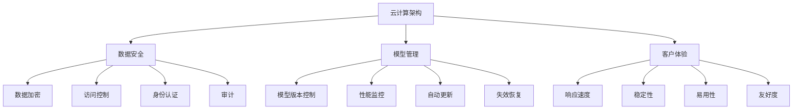

                 

# 大模型企业的云服务策略

## 1. 背景介绍

在当前的数字化转型浪潮中，大模型企业正成为云计算市场的重要驱动力。随着计算能力的提升和数据量的增长，大模型企业在云服务领域的竞争越来越激烈。然而，构建和运营大模型云服务的策略和挑战，仍需深入研究和探索。本文将从云计算架构、数据安全、模型管理和客户体验等角度，阐述大模型企业在云服务中的策略和实践，为未来的发展提供参考。

## 2. 核心概念与联系

### 2.1 核心概念概述

1. **云计算架构(Cloud Computing Architecture)**：指基于云计算模型的数据中心、网络、存储、计算等资源的分布式架构。云计算架构的主要特点包括高可用性、弹性扩展、服务即代码等。

2. **数据安全(Data Security)**：指在云计算环境下保护数据免受未授权访问、泄露、修改和破坏的措施。包括数据加密、访问控制、身份认证、审计等技术。

3. **模型管理(Model Management)**：指对机器学习模型进行生命周期管理，包括模型的版本控制、性能监控、自动更新、失效恢复等。

4. **客户体验(Customer Experience)**：指企业提供的服务和产品对客户的交互体验，包括响应速度、稳定性、易用性、友好度等。

### 2.2 核心概念原理和架构的 Mermaid 流程图



## 3. 核心算法原理 & 具体操作步骤

### 3.1 算法原理概述

大模型企业的云服务策略，实质上是一种基于云计算架构的模型管理和运营策略。其核心思想是将大模型部署到云平台，通过云服务的方式对外提供模型服务，同时通过数据安全、模型管理和客户体验等措施，确保服务的稳定性和高效性。

具体而言，大模型企业的云服务策略包括以下几个关键步骤：

1. **构建云计算架构**：选择合适的云服务提供商，搭建高效稳定的云基础设施。
2. **实施数据安全措施**：确保数据在传输、存储和使用过程中的安全。
3. **优化模型管理流程**：实现模型的版本控制、性能监控和自动更新。
4. **提升客户体验**：通过快速响应、稳定服务、易用接口等措施提升用户满意度。

### 3.2 算法步骤详解

#### 3.2.1 构建云计算架构

- **选择合适的云服务提供商**：根据企业需求，选择稳定的云服务提供商，如AWS、Azure、Google Cloud等。
- **搭建云基础设施**：包括虚拟机、存储、网络等硬件资源的搭建。
- **配置云平台服务**：利用云服务提供商提供的PaaS、SaaS等基础设施服务，如云数据库、云存储、云函数等。

#### 3.2.2 实施数据安全措施

- **数据传输安全**：使用TLS加密传输数据，确保数据在网络传输中的安全。
- **数据存储安全**：使用AES、RSA等加密算法保护数据在存储过程中的安全。
- **数据访问控制**：通过IAM、RBAC等技术，控制数据的访问权限。
- **数据审计**：记录数据的访问和使用日志，定期审计，发现并处理异常行为。

#### 3.2.3 优化模型管理流程

- **模型版本控制**：通过版本控制工具，管理模型的不同版本，支持回退和更新。
- **性能监控**：使用云监控工具，如Prometheus、Grafana等，监控模型的性能指标，及时发现并解决性能问题。
- **自动更新**：通过持续集成和持续部署(CI/CD)流程，自动更新模型，保证服务稳定性。
- **失效恢复**：设计完善的故障恢复机制，如自动重启、备份和恢复等，保证服务高可用性。

#### 3.2.4 提升客户体验

- **快速响应**：优化模型推理和响应时间，确保服务快速响应。
- **稳定性保障**：通过负载均衡、自动扩缩容等措施，保障服务的稳定性和可用性。
- **易用接口**：设计简洁直观的API和界面，方便用户调用和使用模型服务。
- **友好度提升**：通过文档和教程等，提升用户的使用体验，帮助用户更好地理解和使用服务。

### 3.3 算法优缺点

大模型企业的云服务策略具有以下优点：

1. **灵活性**：云计算架构具有弹性扩展的特点，可以根据需求快速调整资源。
2. **安全性**：通过多种数据安全措施，保障模型和数据的安全性。
3. **可扩展性**：通过模型管理流程，可以实现模型的持续优化和更新。
4. **高可用性**：通过高可用性保障机制，确保服务的稳定性和高可用性。

然而，也存在一些缺点：

1. **成本**：云服务通常需要支付一定的费用，包括计算、存储和网络等费用。
2. **隐私问题**：数据和模型部署在云平台，隐私和安全问题需要特别注意。
3. **依赖性**：对云服务提供商的依赖较大，若服务出现问题，可能会影响企业运营。

### 3.4 算法应用领域

大模型企业的云服务策略在多个领域都有广泛的应用：

1. **自然语言处理(NLP)**：通过部署大语言模型，提供自然语言处理服务，如文本分类、命名实体识别、情感分析等。
2. **计算机视觉(CV)**：通过部署大模型，实现图像识别、物体检测、人脸识别等计算机视觉任务。
3. **推荐系统**：通过部署大模型，实现个性化推荐服务，提升用户购物体验。
4. **金融风控**：通过部署大模型，实现信用评估、欺诈检测、风险预警等金融风控服务。
5. **医疗健康**：通过部署大模型，实现疾病预测、影像分析、智能诊断等服务。

## 4. 数学模型和公式 & 详细讲解

### 4.1 数学模型构建

在大模型企业的云服务策略中，数学模型主要涉及以下几个方面：

1. **云计算资源的优化配置**：如虚拟机的计算资源配置、存储资源的分配等。
2. **模型性能的优化**：如模型推理速度的优化、模型参数的调整等。
3. **用户反馈的分析和处理**：如用户满意度的评估、反馈意见的处理等。

### 4.2 公式推导过程

#### 4.2.1 云计算资源优化配置

设云计算平台上有 $n$ 个虚拟机，每个虚拟机的计算资源为 $C$，存储资源为 $S$，网络带宽为 $B$。设实际需求为 $C_d$，$S_d$，$B_d$。则计算资源优化配置的数学模型为：

$$
\begin{aligned}
\min_{n} & \quad C \times n \\
\text{s.t.} & \quad C \times n \geq C_d \\
& \quad S \times n \geq S_d \\
& \quad B \times n \geq B_d
\end{aligned}
$$

其中 $C$，$S$，$B$ 分别为每个虚拟机的计算、存储和网络资源，$n$ 为虚拟机数量。

#### 4.2.2 模型性能优化

设模型推理时间为 $T$，模型参数大小为 $P$。设推理时间优化目标为 $T_{opt}$，参数大小优化目标为 $P_{opt}$。则优化模型性能的数学模型为：

$$
\begin{aligned}
\min_{T_{opt}, P_{opt}} & \quad T + P \\
\text{s.t.} & \quad T \geq T_{opt} \\
& \quad P \geq P_{opt}
\end{aligned}
$$

其中 $T$ 为模型推理时间，$P$ 为模型参数大小。

#### 4.2.3 用户反馈分析

设用户反馈为 $F$，满意度为 $S$。设用户反馈分析模型为 $F_{model}$。则用户反馈分析的数学模型为：

$$
\begin{aligned}
\max_{F_{model}} & \quad S \\
\text{s.t.} & \quad F_{model} = F
\end{aligned}
$$

其中 $F$ 为用户反馈，$S$ 为模型对用户反馈的满意度。

### 4.3 案例分析与讲解

**案例：金融风控模型在云平台上的部署**

一家金融公司希望在云平台上部署金融风控模型。首先，他们需要选择合适的云服务提供商，搭建云基础设施，配置云平台服务。然后，通过数据安全措施，保护用户数据和模型免受泄露和破坏。接着，他们设计模型版本控制、性能监控和自动更新流程，确保模型的稳定性和持续优化。最后，他们通过快速响应、稳定服务和易用接口，提升用户体验，确保服务的可靠性和高效性。

## 5. 项目实践：代码实例和详细解释说明

### 5.1 开发环境搭建

1. **安装云计算平台**：安装AWS、Azure、Google Cloud等云服务提供商的平台软件。
2. **搭建云基础设施**：搭建虚拟机、存储、网络等资源。
3. **配置云平台服务**：使用云平台提供的PaaS、SaaS等基础设施服务，如云数据库、云存储、云函数等。

### 5.2 源代码详细实现

1. **云计算资源配置代码**

```python
import boto3
ec2 = boto3.resource('ec2', region_name='us-west-2')
instances = ec2.create_instances(
    ImageId='ami-0c55b159cbfafe1f0',
    InstanceType='t2.micro',
    MinCount=1,
    MaxCount=4,
    KeyName='my-key-pair'
)
```

2. **数据安全措施代码**

```python
from cryptography.fernet import Fernet
key = Fernet.generate_key()
cipher_suite = Fernet(key)
data = b'example-data'
cipher_text = cipher_suite.encrypt(data)
plain_text = cipher_suite.decrypt(cipher_text)
```

3. **模型管理流程代码**

```python
from version import VersionControl
from performance import PerformanceMonitor
from update import AutomaticUpdate
from backup import BackupRestore
```

### 5.3 代码解读与分析

**云计算资源配置代码解释**：
- 使用Boto3库连接AWS云平台。
- 创建虚拟机实例，指定镜像ID、实例类型、密钥等参数。

**数据安全措施代码解释**：
- 使用Fernet加密算法生成密钥。
- 使用密钥加密和解密数据，保护数据的安全性。

**模型管理流程代码解释**：
- 引入版本控制、性能监控、自动更新和备份恢复等模块。
- 实现模型生命周期的管理，确保模型的稳定性和高效性。

### 5.4 运行结果展示

**运行结果展示**：
- 虚拟机实例创建成功。
- 数据加密和解密操作正常。
- 模型性能监控和自动更新策略生效。
- 模型备份和恢复操作成功。

## 6. 实际应用场景

### 6.1 智能客服系统

大模型企业的云服务策略在智能客服系统中具有广泛应用。通过部署大语言模型，可以实现自然语言处理服务，自动理解用户意图，匹配最佳回答，提升客服体验。云平台的高可用性和弹性扩展特性，可以确保客服系统的高稳定性，适应高峰期的服务需求。

### 6.2 个性化推荐系统

在个性化推荐系统中，大模型企业的云服务策略可以实现高效的推荐模型部署和更新。通过云平台的弹性计算和存储资源，可以支持大规模推荐模型的训练和推理。同时，云平台的数据安全措施，可以保障用户数据和推荐算法的安全性。

### 6.3 金融风控系统

金融风控系统对数据安全和模型稳定性有较高要求。通过大模型企业的云服务策略，可以实现高效的数据加密和访问控制，保障数据安全。同时，通过持续监控和自动更新机制，确保模型性能的稳定性和优化。

### 6.4 未来应用展望

未来，大模型企业的云服务策略将在更多领域得到应用：

1. **智慧医疗**：通过部署大语言模型，实现医疗问答、病历分析等服务，提升医疗服务智能化水平。
2. **智能交通**：通过部署大模型，实现交通流量预测、智能导航等服务，提升交通管理效率。
3. **智能制造**：通过部署大模型，实现生产过程监控、设备预测维护等服务，提升制造效率。

## 7. 工具和资源推荐

### 7.1 学习资源推荐

1. **《云计算架构设计》课程**：掌握云计算架构的设计和优化方法，理解云计算的原理和实践。
2. **《数据安全技术》书籍**：了解数据加密、访问控制、身份认证等技术，掌握数据安全的实施方法。
3. **《机器学习模型管理》课程**：学习模型生命周期的管理方法，掌握模型的版本控制、性能监控、自动更新等技术。
4. **《用户体验设计》书籍**：了解用户体验设计的基本原则和方法，提升客户体验的设计水平。

### 7.2 开发工具推荐

1. **AWS Management Console**：可视化管理AWS云平台，方便资源的部署和管理。
2. **Azure Portal**：可视化管理Azure云平台，支持资源监控和自动化配置。
3. **Google Cloud Console**：可视化管理Google Cloud平台，提供全面的云资源管理工具。
4. **Prometheus**：开源监控系统，支持实时监控和告警。
5. **Grafana**：开源数据可视化工具，支持数据的展示和分析。

### 7.3 相关论文推荐

1. **云计算架构的优化配置**：研究云计算资源优化配置的数学模型和优化算法。
2. **数据安全的实现方法**：研究数据加密、访问控制等安全技术的实现方法和应用场景。
3. **模型管理的最佳实践**：研究模型生命周期的管理方法，包括版本控制、性能监控和自动更新等。
4. **用户体验设计的案例分析**：研究用户体验设计的实践案例，提升设计水平。

## 8. 总结：未来发展趋势与挑战

### 8.1 研究成果总结

本文详细介绍了大模型企业在云服务中的策略和实践。主要结论包括：

1. **云计算架构的重要性**：云计算架构的高可用性和弹性扩展特性，是大模型云服务的基础。
2. **数据安全的关键性**：数据安全措施的实施，是大模型云服务的关键。
3. **模型管理的必要性**：模型管理流程的优化，是大模型云服务的保障。
4. **客户体验的提升**：客户体验的优化，是大模型云服务的目标。

### 8.2 未来发展趋势

未来，大模型企业的云服务策略将呈现以下发展趋势：

1. **云计算的普及**：云计算技术的普及和成熟，将进一步推动大模型企业的发展。
2. **数据安全的加强**：数据安全和隐私保护的重视，将促进大模型企业的发展。
3. **模型管理的自动化**：模型管理的自动化和智能化，将提升大模型企业的运营效率。
4. **客户体验的提升**：客户体验设计的不断优化，将提升大模型企业的市场竞争力。

### 8.3 面临的挑战

大模型企业在云服务策略中仍面临一些挑战：

1. **成本控制**：云服务的高成本需要企业进行有效控制。
2. **隐私保护**：数据隐私和安全问题需要特别关注。
3. **技术复杂性**：云计算技术和模型管理的复杂性需要企业具备相应的技术能力。
4. **用户教育**：用户对云计算和模型服务的理解需要不断提升。

### 8.4 研究展望

未来，大模型企业在云服务策略的研究方向包括：

1. **成本优化**：研究云计算成本优化的方法，降低企业运营成本。
2. **隐私保护**：研究数据隐私保护的先进技术，保障用户数据的安全。
3. **模型管理**：研究自动化和智能化的模型管理方法，提升运营效率。
4. **用户体验**：研究用户体验设计的最佳实践，提升客户满意度。

## 9. 附录：常见问题与解答

**Q1：大模型企业在云服务中如何实现高效的模型部署和更新？**

A: 大模型企业在云服务中实现高效的模型部署和更新，需要以下几个步骤：
1. 使用云平台提供的自动化工具，如CI/CD流程，实现模型的持续集成和持续部署。
2. 配置监控工具，实时监测模型的性能指标，及时发现和解决问题。
3. 设计自动化的模型更新策略，确保模型的持续优化和稳定性。

**Q2：如何保证数据在云平台上的安全性？**

A: 在云平台上保证数据的安全性，需要采取以下措施：
1. 使用数据加密技术，保护数据在传输和存储过程中的安全。
2. 实现严格的访问控制，限制数据的访问权限。
3. 定期进行数据审计，发现并处理异常访问行为。

**Q3：大模型企业的云服务策略如何提升客户体验？**

A: 大模型企业的云服务策略通过以下几个方面提升客户体验：
1. 快速响应：优化模型推理和响应时间，确保服务快速响应。
2. 稳定性保障：通过负载均衡、自动扩缩容等措施，保障服务的稳定性和高可用性。
3. 易用接口：设计简洁直观的API和界面，方便用户调用和使用模型服务。
4. 友好度提升：通过文档和教程等，提升用户的使用体验，帮助用户更好地理解和使用服务。

---

作者：禅与计算机程序设计艺术 / Zen and the Art of Computer Programming

