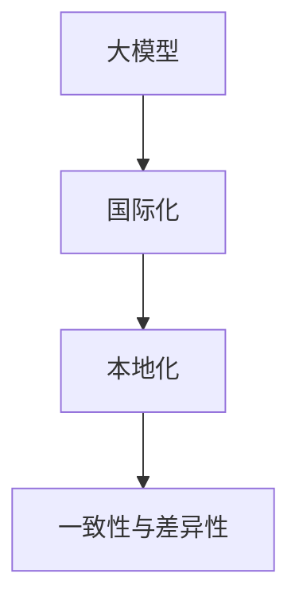

                 

# 大模型企业的国际化本地化策略

## 1. 背景介绍

### 1.1 问题由来
在全球化大潮的驱动下，企业纷纷将业务拓展至海外市场。然而，不同国家和地区在语言、文化、法规等方面存在巨大差异，使得跨国业务面临诸多挑战。传统的一体化解决方案往往无法适应复杂多变的本地需求，因此需要引入本地化策略，以实现真正的全球一体化。

大模型企业也不例外，随着AI大模型（如BERT、GPT-3等）的横空出世，其在NLP、推荐系统、广告推荐等领域表现出前所未有的强大能力，为企业的国际化扩展提供了重要支撑。但大模型本身普遍存在高成本、高复杂度、高风险等问题，需要在本地化策略的指导下，才能真正落地实施。

### 1.2 问题核心关键点
大模型企业在国际化过程中，需要兼顾全球一致性和本地差异化，这是一对矛盾。全球一致性要求各地区业务尽量统一，以降低管理复杂度，而本地差异化要求模型能够适应不同市场、法规、语言等需求，提供个性化、定制化的服务。因此，大模型企业的国际化本地化策略，需要在“本地适应性”和“全球一致性”之间找到平衡点，实现高效、精准、灵活的全球运营。

## 2. 核心概念与联系

### 2.1 核心概念概述

为更好地理解大模型企业的国际化本地化策略，本节将介绍几个密切相关的核心概念：

- 大模型：指基于深度学习的大规模预训练语言模型，如BERT、GPT-3等。
- 国际化：指企业将业务拓展至海外市场，提供全球化服务的过程。
- 本地化：指在国际化基础上，根据不同国家和地区的需求，对产品、服务、营销等环节进行调整，实现更好的市场适应性。
- 一致性与差异性：全球一致性要求各地区业务尽量统一，以降低管理复杂度；本地差异性要求模型能够适应不同市场、法规、语言等需求，提供个性化、定制化的服务。

这些核心概念之间的逻辑关系可以通过以下Mermaid流程图来展示：



这个流程图展示了大模型企业的核心概念及其之间的关系：

1. 大模型通过预训练获得基础能力。
2. 国际化要求模型能够适应全球市场需求，提供一致性服务。
3. 本地化对模型进行调整，以适应不同市场的差异性需求。
4. 一致性与差异性，是大模型企业需要平衡的两大关键要素。

这些概念共同构成了大模型企业的国际化本地化策略框架，使其能够在各市场间实现高效、精准、灵活的全球运营。通过理解这些核心概念，我们可以更好地把握大模型企业在国际化过程中的关键点。

## 3. 核心算法原理 & 具体操作步骤

### 3.1 算法原理概述

大模型企业的国际化本地化策略，本质上是如何在全球一致性和本地差异性之间找到平衡点。其核心思想是：

- **一致性**：确保各地区业务的基本要素和运行逻辑一致，以减少复杂度和管理成本。
- **差异性**：针对不同市场的需求，对产品、服务、营销等环节进行本地化调整，以提升市场适应性和用户体验。

具体而言，大模型企业需要遵循以下步骤：

1. **预训练与微调**：在各地区使用相同的预训练模型，并在本地数据集上微调，以适应当地需求。
2. **标准化与定制化**：在保证基本功能一致的前提下，根据各地区特色，提供定制化的服务。
3. **多语言与跨文化**：引入多语言支持和跨文化理解，以适应不同语言和文化背景的用户。
4. **法规与合规**：遵守各地区的法律法规，确保业务合规运营。

### 3.2 算法步骤详解

以下是大模型企业国际化本地化策略的具体操作步骤：

**Step 1: 选择预训练模型与微调数据**

- 选择适合自己业务的大规模预训练模型，如BERT、GPT-3等。
- 在目标市场收集并标注本地数据集，用于微调模型。

**Step 2: 模型微调与本地化调整**

- 在本地数据集上微调预训练模型，调整模型参数以适应当地需求。
- 根据本地文化特点，调整产品界面、交互方式、内容展示等。

**Step 3: 标准化与定制化**

- 保持业务流程、数据格式、API接口等基本一致，确保全球统一。
- 根据各地区特色，提供差异化的服务功能，满足本地用户需求。

**Step 4: 多语言与跨文化支持**

- 引入多语言模型和跨文化理解技术，支持不同语言和文化背景的用户。
- 提供多语言支持，包括模型输入输出、界面显示、用户交互等。

**Step 5: 法规与合规**

- 根据各地区的法律法规，制定本地化的业务运营规则。
- 进行合规性审查，确保业务合法合规。

**Step 6: 监控与优化**

- 持续监控各地区业务的运行状态，收集反馈信息。
- 根据反馈和运营数据，不断优化模型和服务，提升用户体验。

### 3.3 算法优缺点

大模型企业的国际化本地化策略具有以下优点：

1. **效率提升**：通过标准化与一致性管理，减少了复杂度和管理成本。
2. **用户体验改善**：根据本地文化特点，提供差异化服务，提升用户满意度。
3. **合规性强**：遵守各地区法律法规，确保业务合法合规。
4. **市场适应性强**：通过多语言和跨文化支持，拓展全球市场。

但该策略也存在一定的局限性：

1. **资源投入大**：需要进行多次微调和本地化调整，成本较高。
2. **管理复杂**：需要平衡一致性与差异性，管理难度较大。
3. **数据质量要求高**：本地化微调需要高质量的本地数据集，数据获取难度大。
4. **模型复杂性高**：多语言和多文化支持，增加了模型的复杂性。

尽管存在这些局限性，但就目前而言，大模型企业的国际化本地化策略仍然是最主流的方式。未来相关研究的重点在于如何进一步降低本地化成本，提高本地化效率，同时兼顾全球一致性。

### 3.4 算法应用领域

大模型企业的国际化本地化策略在多个领域都得到了广泛应用，例如：

- NLP：多语言支持、本地化情感分析、本地化命名实体识别等。
- 推荐系统：本地化推荐算法、跨文化推荐策略、多语言推荐内容等。
- 广告推荐：本地化广告内容、跨文化广告创意、合规广告投放等。
- 语音识别：本地化语音识别模型、跨文化语音理解、多语言语音合成等。
- 计算机视觉：本地化物体识别、跨文化图像理解、多语言图像标注等。

除了上述这些领域外，大模型企业的国际化本地化策略也在更多场景中得到应用，如智慧城市、智能交通、智能家居等，为全球企业的智能化转型提供了新的技术路径。

## 4. 数学模型和公式 & 详细讲解  
### 4.1 数学模型构建

本节将使用数学语言对大模型企业的国际化本地化策略进行更加严格的刻画。

记大模型为 $M$，其中 $M=\{M_1, M_2, ..., M_n\}$，表示全球各地区的模型版本。假设模型在地区 $i$ 的本地微调数据集为 $D_i=\{(x_j, y_j)\}_{j=1}^{N_i}$，其中 $x_j$ 为输入数据，$y_j$ 为标签。

定义本地微调后模型 $M_{i\theta}$ 在数据集 $D_i$ 上的损失函数为 $\mathcal{L}_i(\theta)$，则在地区 $i$ 的微调目标是最小化损失函数：

$$
\theta_i^* = \mathop{\arg\min}_{\theta} \mathcal{L}_i(\theta)
$$

在保证全球一致性的前提下，对模型进行本地微调，得到本地化的模型版本 $M_{i\theta}$。同时，根据不同市场的需求，进行定制化的服务调整。

### 4.2 公式推导过程

以下我们以情感分析任务为例，推导本地化情感分析模型的损失函数及其梯度的计算公式。

假设模型在输入 $x$ 上的输出为 $\hat{y}=M_{\theta}(x) \in [0,1]$，表示情感倾向为正类的概率。真实标签 $y \in \{0,1\}$。则二分类交叉熵损失函数定义为：

$$
\ell(M_{\theta}(x),y) = -[y\log \hat{y} + (1-y)\log (1-\hat{y})]
$$

将其代入本地微调损失函数 $\mathcal{L}_i(\theta)$，得：

$$
\mathcal{L}_i(\theta) = -\frac{1}{N_i}\sum_{j=1}^{N_i} [y_j\log M_{\theta}(x_j)+(1-y_j)\log(1-M_{\theta}(x_j))]
$$

根据链式法则，损失函数对参数 $\theta_k$ 的梯度为：

$$
\frac{\partial \mathcal{L}_i(\theta)}{\partial \theta_k} = -\frac{1}{N_i}\sum_{j=1}^{N_i} (\frac{y_j}{M_{\theta}(x_j)}-\frac{1-y_j}{1-M_{\theta}(x_j)}) \frac{\partial M_{\theta}(x_j)}{\partial \theta_k}
$$

其中 $\frac{\partial M_{\theta}(x_j)}{\partial \theta_k}$ 可进一步递归展开，利用自动微分技术完成计算。

在得到损失函数的梯度后，即可带入参数更新公式，完成模型的迭代优化。重复上述过程直至收敛，最终得到适应本地需求的最优模型参数 $\theta_i^*$。

## 5. 项目实践：代码实例和详细解释说明
### 5.1 开发环境搭建

在进行国际化本地化策略实践前，我们需要准备好开发环境。以下是使用Python进行PyTorch开发的环境配置流程：

1. 安装Anaconda：从官网下载并安装Anaconda，用于创建独立的Python环境。

2. 创建并激活虚拟环境：
```bash
conda create -n pytorch-env python=3.8 
conda activate pytorch-env
```

3. 安装PyTorch：根据CUDA版本，从官网获取对应的安装命令。例如：
```bash
conda install pytorch torchvision torchaudio cudatoolkit=11.1 -c pytorch -c conda-forge
```

4. 安装Transformer库：
```bash
pip install transformers
```

5. 安装各类工具包：
```bash
pip install numpy pandas scikit-learn matplotlib tqdm jupyter notebook ipython
```

完成上述步骤后，即可在`pytorch-env`环境中开始国际化本地化策略实践。

### 5.2 源代码详细实现

这里我们以情感分析任务为例，给出使用Transformers库对BERT模型进行本地微调的PyTorch代码实现。

首先，定义情感分析任务的数据处理函数：

```python
from transformers import BertTokenizer
from torch.utils.data import Dataset
import torch

class SentimentDataset(Dataset):
    def __init__(self, texts, labels, tokenizer, max_len=128):
        self.texts = texts
        self.labels = labels
        self.tokenizer = tokenizer
        self.max_len = max_len
        
    def __len__(self):
        return len(self.texts)
    
    def __getitem__(self, item):
        text = self.texts[item]
        label = self.labels[item]
        
        encoding = self.tokenizer(text, return_tensors='pt', max_length=self.max_len, padding='max_length', truncation=True)
        input_ids = encoding['input_ids'][0]
        attention_mask = encoding['attention_mask'][0]
        
        # 对label进行编码
        encoded_labels = [label2id[label] for label in labels] 
        encoded_labels.extend([label2id['O']] * (self.max_len - len(encoded_labels)))
        labels = torch.tensor(encoded_labels, dtype=torch.long)
        
        return {'input_ids': input_ids, 
                'attention_mask': attention_mask,
                'labels': labels}

# 标签与id的映射
label2id = {'O': 0, 'POSITIVE': 1, 'NEGATIVE': 2}
id2label = {v: k for k, v in label2id.items()}

# 创建dataset
tokenizer = BertTokenizer.from_pretrained('bert-base-cased')

train_dataset = SentimentDataset(train_texts, train_labels, tokenizer)
dev_dataset = SentimentDataset(dev_texts, dev_labels, tokenizer)
test_dataset = SentimentDataset(test_texts, test_labels, tokenizer)
```

然后，定义模型和优化器：

```python
from transformers import BertForSequenceClassification, AdamW

model = BertForSequenceClassification.from_pretrained('bert-base-cased', num_labels=len(label2id))

optimizer = AdamW(model.parameters(), lr=2e-5)
```

接着，定义训练和评估函数：

```python
from torch.utils.data import DataLoader
from tqdm import tqdm
from sklearn.metrics import classification_report

device = torch.device('cuda') if torch.cuda.is_available() else torch.device('cpu')
model.to(device)

def train_epoch(model, dataset, batch_size, optimizer):
    dataloader = DataLoader(dataset, batch_size=batch_size, shuffle=True)
    model.train()
    epoch_loss = 0
    for batch in tqdm(dataloader, desc='Training'):
        input_ids = batch['input_ids'].to(device)
        attention_mask = batch['attention_mask'].to(device)
        labels = batch['labels'].to(device)
        model.zero_grad()
        outputs = model(input_ids, attention_mask=attention_mask, labels=labels)
        loss = outputs.loss
        epoch_loss += loss.item()
        loss.backward()
        optimizer.step()
    return epoch_loss / len(dataloader)

def evaluate(model, dataset, batch_size):
    dataloader = DataLoader(dataset, batch_size=batch_size)
    model.eval()
    preds, labels = [], []
    with torch.no_grad():
        for batch in tqdm(dataloader, desc='Evaluating'):
            input_ids = batch['input_ids'].to(device)
            attention_mask = batch['attention_mask'].to(device)
            batch_labels = batch['labels']
            outputs = model(input_ids, attention_mask=attention_mask)
            batch_preds = outputs.logits.argmax(dim=2).to('cpu').tolist()
            batch_labels = batch_labels.to('cpu').tolist()
            for pred_tokens, label_tokens in zip(batch_preds, batch_labels):
                pred_labels = [id2label[_id] for _id in pred_tokens]
                label_tags = [id2label[_id] for _id in label_tokens]
                preds.append(pred_labels[:len(label_tags)])
                labels.append(label_tags)
                
    print(classification_report(labels, preds))
```

最后，启动训练流程并在测试集上评估：

```python
epochs = 5
batch_size = 16

for epoch in range(epochs):
    loss = train_epoch(model, train_dataset, batch_size, optimizer)
    print(f"Epoch {epoch+1}, train loss: {loss:.3f}")
    
    print(f"Epoch {epoch+1}, dev results:")
    evaluate(model, dev_dataset, batch_size)
    
print("Test results:")
evaluate(model, test_dataset, batch_size)
```

以上就是使用PyTorch对BERT进行情感分析任务本地微调的完整代码实现。可以看到，得益于Transformers库的强大封装，我们可以用相对简洁的代码完成BERT模型的加载和微调。

### 5.3 代码解读与分析

让我们再详细解读一下关键代码的实现细节：

**SentimentDataset类**：
- `__init__`方法：初始化文本、标签、分词器等关键组件。
- `__len__`方法：返回数据集的样本数量。
- `__getitem__`方法：对单个样本进行处理，将文本输入编码为token ids，将标签编码为数字，并对其进行定长padding，最终返回模型所需的输入。

**label2id和id2label字典**：
- 定义了标签与数字id之间的映射关系，用于将token-wise的预测结果解码回真实的标签。

**训练和评估函数**：
- 使用PyTorch的DataLoader对数据集进行批次化加载，供模型训练和推理使用。
- 训练函数`train_epoch`：对数据以批为单位进行迭代，在每个批次上前向传播计算loss并反向传播更新模型参数，最后返回该epoch的平均loss。
- 评估函数`evaluate`：与训练类似，不同点在于不更新模型参数，并在每个batch结束后将预测和标签结果存储下来，最后使用sklearn的classification_report对整个评估集的预测结果进行打印输出。

**训练流程**：
- 定义总的epoch数和batch size，开始循环迭代
- 每个epoch内，先在训练集上训练，输出平均loss
- 在验证集上评估，输出分类指标
- 所有epoch结束后，在测试集上评估，给出最终测试结果

可以看到，PyTorch配合Transformers库使得BERT微调的代码实现变得简洁高效。开发者可以将更多精力放在数据处理、模型改进等高层逻辑上，而不必过多关注底层的实现细节。

当然，工业级的系统实现还需考虑更多因素，如模型的保存和部署、超参数的自动搜索、更灵活的任务适配层等。但核心的微调范式基本与此类似。

## 6. 实际应用场景
### 6.1 智能客服系统

基于大模型的智能客服系统，通过本地微调可以更好地适应不同地区的用户需求，提供个性化的服务。比如，针对中国市场，可以通过本地微调优化对话模型，使其能理解中文的复杂表达方式，提供更自然的交互体验。

在技术实现上，可以收集目标市场的历史客服对话记录，将问题-答案对作为微调数据，训练模型学习匹配答案。对于新客户的问题，还可以接入检索系统实时搜索相关内容，动态组织生成回答。如此构建的智能客服系统，能大幅提升客户咨询体验和问题解决效率。

### 6.2 金融舆情监测

金融企业需要实时监测市场舆论动向，以便及时应对负面信息传播，规避金融风险。传统的人工监测方式成本高、效率低，难以应对网络时代海量信息爆发的挑战。基于大模型的文本分类和情感分析技术，为金融舆情监测提供了新的解决方案。

具体而言，可以收集金融领域相关的新闻、报道、评论等文本数据，并对其进行主题标注和情感标注。在此基础上对预训练语言模型进行本地微调，使其能够自动判断文本属于何种主题，情感倾向是正面、中性还是负面。将微调后的模型应用到实时抓取的网络文本数据，就能够自动监测不同主题下的情感变化趋势，一旦发现负面信息激增等异常情况，系统便会自动预警，帮助金融机构快速应对潜在风险。

### 6.3 个性化推荐系统

当前的推荐系统往往只依赖用户的历史行为数据进行物品推荐，无法深入理解用户的真实兴趣偏好。基于大模型的个性化推荐系统，通过本地微调可以更好地挖掘用户行为背后的语义信息，从而提供更精准、多样的推荐内容。

在实践中，可以收集用户浏览、点击、评论、分享等行为数据，提取和用户交互的物品标题、描述、标签等文本内容。将文本内容作为模型输入，用户的后续行为（如是否点击、购买等）作为监督信号，在此基础上微调预训练语言模型。微调后的模型能够从文本内容中准确把握用户的兴趣点。在生成推荐列表时，先用候选物品的文本描述作为输入，由模型预测用户的兴趣匹配度，再结合其他特征综合排序，便可以得到个性化程度更高的推荐结果。

### 6.4 未来应用展望

随着大模型企业的国际化本地化策略不断演进，基于微调范式将在更多领域得到应用，为传统行业数字化转型升级提供新的技术路径。

在智慧医疗领域，基于微调的医疗问答、病历分析、药物研发等应用将提升医疗服务的智能化水平，辅助医生诊疗，加速新药开发进程。

在智能教育领域，微调技术可应用于作业批改、学情分析、知识推荐等方面，因材施教，促进教育公平，提高教学质量。

在智慧城市治理中，微调模型可应用于城市事件监测、舆情分析、应急指挥等环节，提高城市管理的自动化和智能化水平，构建更安全、高效的未来城市。

此外，在企业生产、社会治理、文娱传媒等众多领域，基于大模型微调的人工智能应用也将不断涌现，为经济社会发展注入新的动力。相信随着技术的日益成熟，国际化本地化策略将成为大模型企业的重要范式，推动人工智能技术在全球范围内加速落地。

## 7. 工具和资源推荐
### 7.1 学习资源推荐

为了帮助开发者系统掌握大模型企业的国际化本地化策略的理论基础和实践技巧，这里推荐一些优质的学习资源：

1. 《Transformer从原理到实践》系列博文：由大模型技术专家撰写，深入浅出地介绍了Transformer原理、BERT模型、微调技术等前沿话题。

2. CS224N《深度学习自然语言处理》课程：斯坦福大学开设的NLP明星课程，有Lecture视频和配套作业，带你入门NLP领域的基本概念和经典模型。

3. 《Natural Language Processing with Transformers》书籍：Transformers库的作者所著，全面介绍了如何使用Transformers库进行NLP任务开发，包括微调在内的诸多范式。

4. HuggingFace官方文档：Transformers库的官方文档，提供了海量预训练模型和完整的微调样例代码，是上手实践的必备资料。

5. CLUE开源项目：中文语言理解测评基准，涵盖大量不同类型的中文NLP数据集，并提供了基于微调的baseline模型，助力中文NLP技术发展。

通过对这些资源的学习实践，相信你一定能够快速掌握大模型企业的国际化本地化策略的精髓，并用于解决实际的NLP问题。
###  7.2 开发工具推荐

高效的开发离不开优秀的工具支持。以下是几款用于大模型企业国际化本地化策略开发的常用工具：

1. PyTorch：基于Python的开源深度学习框架，灵活动态的计算图，适合快速迭代研究。大部分预训练语言模型都有PyTorch版本的实现。

2. TensorFlow：由Google主导开发的开源深度学习框架，生产部署方便，适合大规模工程应用。同样有丰富的预训练语言模型资源。

3. Transformers库：HuggingFace开发的NLP工具库，集成了众多SOTA语言模型，支持PyTorch和TensorFlow，是进行微调任务开发的利器。

4. Weights & Biases：模型训练的实验跟踪工具，可以记录和可视化模型训练过程中的各项指标，方便对比和调优。与主流深度学习框架无缝集成。

5. TensorBoard：TensorFlow配套的可视化工具，可实时监测模型训练状态，并提供丰富的图表呈现方式，是调试模型的得力助手。

6. Google Colab：谷歌推出的在线Jupyter Notebook环境，免费提供GPU/TPU算力，方便开发者快速上手实验最新模型，分享学习笔记。

合理利用这些工具，可以显著提升大模型企业国际化本地化策略的开发效率，加快创新迭代的步伐。

### 7.3 相关论文推荐

大模型企业国际化本地化策略的发展源于学界的持续研究。以下是几篇奠基性的相关论文，推荐阅读：

1. Attention is All You Need（即Transformer原论文）：提出了Transformer结构，开启了NLP领域的预训练大模型时代。

2. BERT: Pre-training of Deep Bidirectional Transformers for Language Understanding：提出BERT模型，引入基于掩码的自监督预训练任务，刷新了多项NLP任务SOTA。

3. Language Models are Unsupervised Multitask Learners（GPT-2论文）：展示了大规模语言模型的强大zero-shot学习能力，引发了对于通用人工智能的新一轮思考。

4. Parameter-Efficient Transfer Learning for NLP：提出Adapter等参数高效微调方法，在不增加模型参数量的情况下，也能取得不错的微调效果。

5. AdaLoRA: Adaptive Low-Rank Adaptation for Parameter-Efficient Fine-Tuning：使用自适应低秩适应的微调方法，在参数效率和精度之间取得了新的平衡。

这些论文代表了大模型企业国际化本地化策略的发展脉络。通过学习这些前沿成果，可以帮助研究者把握学科前进方向，激发更多的创新灵感。

## 8. 总结：未来发展趋势与挑战

### 8.1 总结

本文对大模型企业的国际化本地化策略进行了全面系统的介绍。首先阐述了大模型企业和国际化本地化策略的研究背景和意义，明确了本地化在企业全球运营中的重要作用。其次，从原理到实践，详细讲解了本地化策略的数学原理和关键步骤，给出了本地化策略任务开发的完整代码实例。同时，本文还广泛探讨了本地化策略在智能客服、金融舆情、个性化推荐等多个行业领域的应用前景，展示了本地化策略范式的巨大潜力。此外，本文精选了本地化策略的各类学习资源，力求为读者提供全方位的技术指引。

通过本文的系统梳理，可以看到，大模型企业的国际化本地化策略不仅能够提升业务的全球适应性，还能有效降低管理复杂度和成本，成为企业国际化战略的重要工具。未来，伴随大模型的持续演进和本地化技术的不断进步，基于本地化策略的大模型企业必将在全球市场中占据重要地位，引领新一轮的智能变革。

### 8.2 未来发展趋势

展望未来，大模型企业的国际化本地化策略将呈现以下几个发展趋势：

1. **模型规模持续增大**：随着算力成本的下降和数据规模的扩张，预训练语言模型的参数量还将持续增长。超大规模语言模型蕴含的丰富语言知识，有望支撑更加复杂多变的本地需求。

2. **本地化方法多样性**：除了传统的本地微调外，未来会涌现更多本地化方法，如Prompt-based Learning、Adapter等，在固定大部分预训练参数的同时，只更新极少量的本地参数。

3. **持续学习成为常态**：随着数据分布的不断变化，本地化模型也需要持续学习新知识以保持性能。如何在不遗忘原有知识的同时，高效吸收新样本信息，将成为重要的研究课题。

4. **标注样本需求降低**：受启发于提示学习(Prompt-based Learning)的思路，未来的本地化方法将更好地利用大模型的语言理解能力，通过更加巧妙的任务描述，在更少的标注样本上也能实现理想的本地化效果。

5. **多语言与跨文化支持**：引入多语言模型和跨文化理解技术，支持不同语言和文化背景的用户，拓展全球市场。

6. **法规与合规**：遵守各地区的法律法规，确保业务合法合规。

以上趋势凸显了大模型企业国际化本地化策略的广阔前景。这些方向的探索发展，必将进一步提升本地化策略的效果，为构建安全、可靠、可解释、可控的智能系统铺平道路。

### 8.3 面临的挑战

尽管大模型企业的国际化本地化策略已经取得了显著进展，但在迈向更加智能化、普适化应用的过程中，它仍面临诸多挑战：

1. **标注成本瓶颈**：尽管本地微调需要标注数据量较预训练时大幅减少，但对于某些任务，获取高质量标注数据的成本仍较高。如何进一步降低本地化成本，将是一大难题。

2. **本地化效果泛化**：不同地区的本地化模型需要具备良好的泛化性能，以适应新数据和新场景。如何在不同地区本地化模型间实现一致性，避免过拟合，需要更多研究和实践。

3. **多语言和文化差异**：不同语言和文化背景下的用户需求差异较大，如何在保持一致性的前提下，提供个性化的本地服务，仍需深入探索。

4. **模型复杂性高**：多语言和多文化支持，增加了模型的复杂性，如何在保证性能的前提下，减少模型大小和计算资源消耗，是重要的优化方向。

尽管存在这些挑战，但就目前而言，大模型企业的国际化本地化策略仍然是最主流的方式。未来相关研究的重点在于如何进一步降低本地化成本，提高本地化效率，同时兼顾全球一致性。

### 8.4 研究展望

面对大模型企业国际化本地化策略所面临的种种挑战，未来的研究需要在以下几个方面寻求新的突破：

1. **探索无监督和半监督本地化方法**：摆脱对大规模标注数据的依赖，利用自监督学习、主动学习等无监督和半监督范式，最大限度利用非结构化数据，实现更加灵活高效的本地化。

2. **研究参数高效和计算高效的本地化方法**：开发更加参数高效的本地化方法，在固定大部分预训练参数的同时，只更新极少量的本地参数。同时优化本地化模型的计算图，减少前向传播和反向传播的资源消耗，实现更加轻量级、实时性的部署。

3. **融合因果和对比学习范式**：通过引入因果推断和对比学习思想，增强本地化模型建立稳定因果关系的能力，学习更加普适、鲁棒的语言表征，从而提升模型泛化性和抗干扰能力。

4. **引入更多先验知识**：将符号化的先验知识，如知识图谱、逻辑规则等，与神经网络模型进行巧妙融合，引导本地化过程学习更准确、合理的语言模型。同时加强不同模态数据的整合，实现视觉、语音等多模态信息与文本信息的协同建模。

5. **结合因果分析和博弈论工具**：将因果分析方法引入本地化模型，识别出模型决策的关键特征，增强输出解释的因果性和逻辑性。借助博弈论工具刻画人机交互过程，主动探索并规避模型的脆弱点，提高系统稳定性。

6. **纳入伦理道德约束**：在本地化模型的训练目标中引入伦理导向的评估指标，过滤和惩罚有偏见、有害的输出倾向。同时加强人工干预和审核，建立模型行为的监管机制，确保输出符合人类价值观和伦理道德。

这些研究方向的探索，必将引领大模型企业国际化本地化策略技术迈向更高的台阶，为构建安全、可靠、可解释、可控的智能系统铺平道路。面向未来，大模型企业国际化本地化策略需要与其他人工智能技术进行更深入的融合，如知识表示、因果推理、强化学习等，多路径协同发力，共同推动自然语言理解和智能交互系统的进步。只有勇于创新、敢于突破，才能不断拓展语言模型的边界，让智能技术更好地造福人类社会。

## 9. 附录：常见问题与解答

**Q1：大模型本地化策略是否适用于所有NLP任务？**

A: 大模型本地化策略在大多数NLP任务上都能取得不错的效果，特别是对于数据量较小的任务。但对于一些特定领域的任务，如医学、法律等，仅仅依靠通用语料预训练的模型可能难以很好地适应。此时需要在特定领域语料上进一步预训练，再进行本地化，才能获得理想效果。此外，对于一些需要时效性、个性化很强的任务，如对话、推荐等，本地化方法也需要针对性的改进优化。

**Q2：本地化策略如何确保全球一致性与本地差异性的平衡？**

A: 本地化策略的核心在于确保全球一致性和本地差异性的平衡。具体而言：

1. 保持业务流程、数据格式、API接口等基本一致，以降低管理复杂度。
2. 根据本地文化特点，调整产品界面、交互方式、内容展示等，以提升用户满意度。
3. 引入多语言模型和跨文化理解技术，支持不同语言和文化背景的用户。
4. 遵守各地区的法律法规，确保业务合法合规。

这些措施共同构成了本地化策略的实施框架，帮助企业在保持一致性的前提下，适应不同市场的需求。

**Q3：本地化策略在资源投入和成本控制方面有哪些挑战？**

A: 本地化策略需要考虑多个因素，包括本地微调、本地化调整、多语言支持、法规合规等，因此在资源投入和成本控制方面面临诸多挑战：

1. 本地微调需要获取高质量的本地数据集，数据获取难度大。
2. 本地化调整需要根据不同市场特点，进行定制化开发，开发成本高。
3. 多语言支持增加了模型的复杂性，计算资源消耗大。
4. 法规合规需要不断审查和更新，合规成本高。

尽管存在这些挑战，但通过采用参数高效微调、模型裁剪、量化加速等技术手段，可以显著降低本地化策略的资源投入和成本。

**Q4：本地化策略如何保证本地微调的鲁棒性和泛化性能？**

A: 本地化策略需要保证本地微调的鲁棒性和泛化性能，主要通过以下几个措施：

1. 数据增强：通过回译、近义替换等方式扩充训练集，增加数据多样性。
2. 正则化技术：使用L2正则、Dropout、Early Stopping等防止过拟合。
3. 对抗训练：引入对抗样本，提高模型鲁棒性。
4. 持续学习：不断更新本地微调模型，适应新数据和新场景。
5. 多语言和文化理解：引入多语言模型和跨文化理解技术，提升泛化性能。

这些措施共同构成本地化策略的实现框架，帮助本地微调模型具备更好的鲁棒性和泛化性能。

**Q5：本地化策略在落地部署时需要注意哪些问题？**

A: 本地化策略在落地部署时，需要注意以下问题：

1. 模型裁剪：去除不必要的层和参数，减小模型尺寸，加快推理速度。
2. 量化加速：将浮点模型转为定点模型，压缩存储空间，提高计算效率。
3. 服务化封装：将模型封装为标准化服务接口，便于集成调用。
4. 弹性伸缩：根据请求流量动态调整资源配置，平衡服务质量和成本。
5. 监控与优化：持续监控各地区业务的运行状态，收集反馈信息。
6. 安全防护：采用访问鉴权、数据脱敏等措施，保障数据和模型安全。

合理利用这些措施，可以显著提升本地化策略的落地效果，确保其在全球范围内的顺利实施。

---

作者：禅与计算机程序设计艺术 / Zen and the Art of Computer Programming

