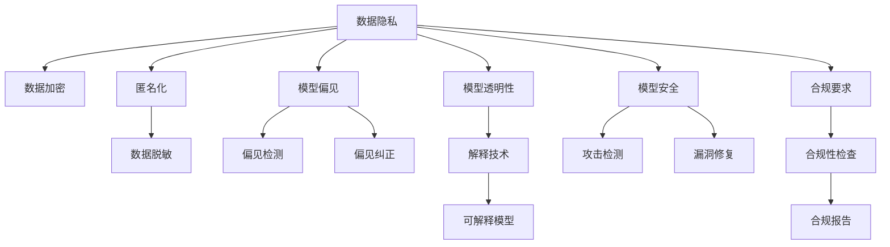

                 

## 1. 背景介绍

### 1.1 问题由来

随着人工智能(AI)和大数据技术的飞速发展，企业利用大模型（如深度学习模型、Transformer模型等）进行业务决策和运营优化已经成为常态。这些大模型基于海量的数据训练得到，通常具有强大的数据分析和预测能力，能显著提升企业的业务效率和竞争力。但与此同时，大模型也带来了新的风险和合规挑战，尤其在金融、医疗、司法等高风险领域，模型的安全和合规问题愈发受到重视。

### 1.2 问题核心关键点

当前，企业在应用大模型时面临的主要风险和合规挑战包括：

1. **数据隐私风险**：大模型训练和应用过程中涉及大量敏感数据，如何保护数据隐私不被泄露是一个重大问题。
2. **模型偏见和歧视**：大模型可能学习到数据中的偏见和歧视，导致模型决策存在不公平性。
3. **模型透明性和可解释性**：大模型通常被视为“黑盒”系统，难以解释其内部决策过程，这在法律和伦理层面存在重大风险。
4. **安全漏洞**：大模型可能存在未被发现的漏洞，被攻击者利用进行恶意攻击。
5. **合规要求**：不同行业和地区对大模型应用有不同的合规要求，如GDPR、CCPA等。

本文将从风险管理和合规策略两个维度出发，探讨如何有效应对这些问题，确保大模型在企业应用中的安全性和合规性。

## 2. 核心概念与联系

### 2.1 核心概念概述

为更好地理解风险管理和合规策略的框架，本节将介绍几个核心概念：

- **数据隐私**：指数据在使用、存储和传输过程中不被未授权访问和泄露的保障。
- **模型偏见**：指模型在不同群体或样本上表现不一致的现象，如性别偏见、种族歧视等。
- **模型透明性和可解释性**：指模型决策过程的透明性和结果的可解释性，帮助用户理解模型如何做出决策。
- **模型安全**：指模型在攻击和入侵面前的鲁棒性和安全性。
- **合规要求**：指企业在应用大模型时需遵守的法律、法规和行业标准，如GDPR、CCPA等。

这些核心概念之间的逻辑关系可以通过以下Mermaid流程图来展示：



这个流程图展示了大模型企业应用过程中各个关键概念之间的联系：

1. 数据隐私通过数据加密、匿名化和脱敏等技术进行保障。
2. 模型偏见通过偏见检测和纠正等方法进行处理。
3. 模型透明性和可解释性通过解释技术实现，构建可解释模型。
4. 模型安全通过攻击检测和漏洞修复等手段进行防护。
5. 合规要求通过合规性检查和报告，确保模型应用符合法律和行业标准。

这些概念共同构成了大模型企业风险管理和合规策略的框架，旨在全面应对模型应用中的各种挑战。

## 3. 核心算法原理 & 具体操作步骤
### 3.1 算法原理概述

大模型企业的风险管理和合规策略，本质上是一种风险控制和合规约束的管理方法。其核心思想是：通过数据处理、模型训练、模型应用等各环节的精心设计和严格监控，最大限度地降低模型应用的风险和合规风险，确保模型在企业应用中的安全性和合规性。

形式化地，假设企业应用的大模型为 $M$，在数据集 $D$ 上进行训练，并用于业务决策。风险管理和合规策略的目标是找到最优策略 $S$，使得：

$$
S = \mathop{\arg\min}_{S} \mathcal{R}(M,D,S)
$$

其中 $\mathcal{R}$ 为风险和合规约束函数，用于衡量模型 $M$ 在策略 $S$ 下的风险和合规性。

### 3.2 算法步骤详解

大模型企业的风险管理和合规策略主要包括以下几个关键步骤：

**Step 1: 数据隐私保护**

- 数据加密：使用加密算法保护数据在传输和存储过程中的安全。
- 数据匿名化：通过去除或模糊化个人标识信息，保护用户隐私。
- 数据脱敏：对敏感数据进行处理，使其无法直接识别。

**Step 2: 模型偏见检测与纠正**

- 偏见检测：使用统计方法和机器学习技术，识别模型中存在的偏见。
- 偏见纠正：通过重新采样、模型微调等方法，纠正模型中的偏见。

**Step 3: 模型透明性和可解释性提升**

- 解释技术：使用LIME、SHAP等方法，解释模型预测结果。
- 可解释模型：设计和使用可解释性强的模型，如决策树、规则库等。

**Step 4: 模型安全防护**

- 攻击检测：使用入侵检测系统和异常检测技术，监控模型应用中的潜在攻击。
- 漏洞修复：定期进行模型代码审计和漏洞扫描，修复发现的安全漏洞。

**Step 5: 合规性检查与报告**

- 合规性检查：使用合规性检查工具，确保模型应用符合法律和行业标准。
- 合规报告：定期生成合规性报告，监控合规风险。

以上是风险管理和合规策略的一般流程。在实际应用中，还需要针对具体模型和业务特点，对各环节进行优化设计，如引入更多正则化技术，搜索最优的超参数组合等，以进一步提升模型性能。

### 3.3 算法优缺点

大模型企业的风险管理和合规策略具有以下优点：

1. **综合性强**：综合考虑数据隐私、模型偏见、模型安全、合规要求等多个方面，全面保障模型应用的安全性和合规性。
2. **预防性强**：通过事前预防、事中监控、事后修复的策略，有效降低模型应用中的各类风险。
3. **可操作性强**：各项措施具有较强的操作性和可行性，便于企业实施。

同时，该策略也存在一定的局限性：

1. **复杂度高**：涉及数据处理、模型训练、模型应用等多个环节，实施过程较为复杂。
2. **资源消耗大**：数据加密、模型微调等操作需要大量计算资源，成本较高。
3. **难以全面覆盖**：有些潜在风险和合规问题可能难以完全覆盖，存在一定的遗漏风险。

尽管存在这些局限性，但就目前而言，大模型企业的风险管理和合规策略仍是保障模型应用安全性和合规性的重要范式。未来相关研究的重点在于如何进一步降低策略实施的复杂度，提高资源效率，同时兼顾模型的风险覆盖和合规性。

### 3.4 算法应用领域

大模型企业的风险管理和合规策略在金融、医疗、司法等高风险领域已经得到了广泛的应用，成为保障模型应用安全性和合规性的重要手段。

在金融领域，基于风险管理和合规策略的智能投顾系统、信用评分模型等，能显著提升风险控制和反欺诈能力，保障金融系统的安全稳定。

在医疗领域，利用解释技术和可解释模型，帮助医生理解模型诊断结果，提升医疗决策的透明性和可靠性。同时，通过隐私保护和合规性检查，保障患者数据安全和隐私权。

在司法领域，应用模型偏见检测和纠正技术，确保司法判决的公平性和公正性。通过解释技术和合规性检查，提高司法决策的可解释性和透明度。

除了上述这些经典应用外，大模型企业的风险管理和合规策略也被创新性地应用到更多场景中，如智能合约、智慧城市治理、工业智能化等，为各行业带来了新的保障机制。随着技术不断演进，未来大模型在更多领域的应用将更加广泛，风险管理和合规策略的需求也将进一步提升。

## 4. 数学模型和公式 & 详细讲解 & 举例说明
### 4.1 数学模型构建

本节将使用数学语言对大模型企业的风险管理和合规策略进行更加严格的刻画。

记大模型为 $M$，训练数据集为 $D=\{(x_i,y_i)\}_{i=1}^N, x_i \in \mathcal{X}, y_i \in \mathcal{Y}$。假设风险和合规约束函数为 $\mathcal{R}(M,D,S) = R_1(M,D,S) + R_2(M,D,S) + R_3(M,D,S) + R_4(M,D,S)$，其中：

- $R_1$ 为数据隐私保护损失函数
- $R_2$ 为模型偏见检测损失函数
- $R_3$ 为模型透明性和可解释性提升损失函数
- $R_4$ 为模型安全防护损失函数

### 4.2 公式推导过程

以下我们以数据隐私保护为例，推导数据加密的数学模型及其优化公式。

假设数据集 $D$ 中包含敏感信息 $S \in \mathcal{S}$，使用AES加密算法进行保护，加密过程如下：

1. 对数据 $x$ 进行哈希处理，得到哈希值 $H(x)$。
2. 将哈希值 $H(x)$ 与密钥 $k$ 进行异或运算，得到加密后的数据 $x'$。

其数学模型为：

$$
x' = H(x) \oplus k
$$

其中 $\oplus$ 表示异或运算，$H(x)$ 为哈希函数，$k$ 为加密密钥。

在优化过程中，目标是最小化数据隐私保护损失函数，即：

$$
\mathcal{L}_{隐私}(M,D,S) = \sum_{i=1}^N \max(0, \log_2 \text{Pr}[\text{Decrypt}(x'_i, k_i) \neq x_i])
$$

其中 $\text{Pr}$ 表示概率，$\text{Decrypt}$ 表示解密函数。目标是最小化加密后数据解密错误概率，即保证加密后的数据难以被还原。

### 4.3 案例分析与讲解

在实际应用中，数据隐私保护需要结合具体业务场景进行设计。以下以医疗数据隐私保护为例：

**案例背景**：一家医疗机构利用机器学习模型对患者病历进行风险评估，但由于病历中包含大量敏感信息，如姓名、地址、病史等，数据隐私问题亟需解决。

**解决方案**：
1. **数据脱敏**：对病历中的敏感信息进行模糊化处理，如将姓名替换为“患者1”、“患者2”，将地址隐去具体位置信息。
2. **数据加密**：对处理后的病历数据进行加密存储和传输，确保数据在处理、存储和传输过程中不被未授权访问和泄露。
3. **访问控制**：设计严格的访问权限管理，仅授权的医生和数据分析师能够访问加密后的病历数据。

通过以上措施，可以有效保障医疗数据隐私安全，降低隐私泄露风险。

## 5. 项目实践：代码实例和详细解释说明
### 5.1 开发环境搭建

在进行风险管理和合规策略的实践前，我们需要准备好开发环境。以下是使用Python进行安全管理开发的环境配置流程：

1. 安装Anaconda：从官网下载并安装Anaconda，用于创建独立的Python环境。

2. 创建并激活虚拟环境：
```bash
conda create -n security-env python=3.8 
conda activate security-env
```

3. 安装必要的安全管理库：
```bash
pip install cryptography pymysql sqlalchemy flask
```

4. 安装数据库：
```bash
sudo apt-get install postgresql postgresql-contrib
```

5. 配置数据库：
```bash
sudo systemctl enable postgresql
sudo systemctl start postgresql
```

完成上述步骤后，即可在`security-env`环境中开始风险管理和合规策略的实践。

### 5.2 源代码详细实现

下面我们以数据脱敏和加密实践为例，给出使用Python的代码实现。

**数据脱敏**

```python
import pandas as pd
import numpy as np

def anonymize_data(df, sensitive_cols):
    for col in sensitive_cols:
        df[col] = df[col].apply(anonymize)
    return df

def anonymize(value):
    if isinstance(value, str):
        return anonymize_str(value)
    elif isinstance(value, float):
        return anonymize_float(value)
    else:
        return value

def anonymize_str(value):
    return value[:3] + '**' + value[-3:]

def anonymize_float(value):
    return np.round(value, 2)

# 应用到实际数据
sensitive_cols = ['name', 'address', 'phone']
df = anonymize_data(df, sensitive_cols)
```

**数据加密**

```python
from cryptography.fernet import Fernet

# 生成密钥
key = Fernet.generate_key()

# 创建Fernet对象
f = Fernet(key)

# 加密数据
def encrypt_data(df, columns):
    for col in columns:
        df[col] = df[col].apply(lambda x: f.encrypt(x.encode()).decode())
    return df

# 解密数据
def decrypt_data(df, columns):
    for col in columns:
        df[col] = df[col].apply(lambda x: f.decrypt(x.encode()).decode())
    return df

# 应用到实际数据
columns = ['sensitive_data']
df = encrypt_data(df, columns)
df_decrypted = decrypt_data(df, columns)
```

### 5.3 代码解读与分析

让我们再详细解读一下关键代码的实现细节：

**数据脱敏函数**

- `anonymize_data`函数：遍历敏感列，调用`anonymize`函数进行脱敏处理。
- `anonymize`函数：根据不同类型的数据，采用不同脱敏策略。对于字符串类型，截断前3个字符和后3个字符，中间用`**`代替；对于浮点数类型，保留两位小数。
- `apply`函数：对指定列中的每个元素应用相应的脱敏函数。

**数据加密函数**

- `encrypt_data`函数：遍历需要加密的列，对每行数据调用`encrypt`函数进行加密。
- `encrypt`函数：使用`Fernet`对象对字符串进行加密。
- `decrypt_data`函数：遍历需要解密列，对每行数据调用`decrypt`函数进行解密。
- `decrypt`函数：使用`Fernet`对象对加密字符串进行解密。

这些函数可以应用于实际的数据库和存储系统中，确保数据在处理和存储过程中的隐私保护。

## 6. 实际应用场景
### 6.1 金融风险控制

在金融领域，风险管理和合规策略的智能投顾系统、信用评分模型等，能显著提升风险控制和反欺诈能力，保障金融系统的安全稳定。具体应用如下：

**智能投顾系统**

- 数据隐私保护：对用户个人信息进行脱敏处理，确保用户隐私安全。
- 模型偏见检测：检测和纠正模型中的性别偏见、年龄偏见等，确保模型公平性。
- 模型透明性：使用可解释模型，确保用户理解模型决策过程。
- 模型安全：监控模型应用中的潜在攻击，定期修复发现的安全漏洞。

**信用评分模型**

- 数据隐私保护：对用户个人信息进行加密处理，保护用户隐私。
- 模型偏见检测：检测和纠正模型中的种族偏见、地域偏见等，确保模型公平性。
- 模型透明性：使用可解释模型，确保用户理解模型决策过程。
- 模型安全：监控模型应用中的潜在攻击，定期修复发现的安全漏洞。

通过应用风险管理和合规策略，金融企业能够有效降低数据隐私泄露和模型安全风险，提升金融系统的安全性和合规性。

### 6.2 医疗决策支持

在医疗领域，利用解释技术和可解释模型，帮助医生理解模型诊断结果，提升医疗决策的透明性和可靠性。具体应用如下：

**智能诊断系统**

- 数据隐私保护：对患者个人信息进行脱敏处理，确保患者隐私安全。
- 模型偏见检测：检测和纠正模型中的性别偏见、年龄偏见等，确保模型公平性。
- 模型透明性：使用可解释模型，确保医生理解模型诊断过程。
- 模型安全：监控模型应用中的潜在攻击，定期修复发现的安全漏洞。

**智能辅助系统**

- 数据隐私保护：对患者个人信息进行加密处理，保护患者隐私。
- 模型偏见检测：检测和纠正模型中的种族偏见、地域偏见等，确保模型公平性。
- 模型透明性：使用可解释模型，确保医生理解模型辅助决策过程。
- 模型安全：监控模型应用中的潜在攻击，定期修复发现的安全漏洞。

通过应用风险管理和合规策略，医疗机构能够有效降低数据隐私泄露和模型安全风险，提升医疗决策的透明性和可靠性。

### 6.3 司法决策支持

在司法领域，应用模型偏见检测和纠正技术，确保司法判决的公平性和公正性。具体应用如下：

**智能判决系统**

- 数据隐私保护：对案件信息进行脱敏处理，确保案件隐私安全。
- 模型偏见检测：检测和纠正模型中的种族偏见、地域偏见等，确保模型公平性。
- 模型透明性：使用可解释模型，确保法官理解模型判决过程。
- 模型安全：监控模型应用中的潜在攻击，定期修复发现的安全漏洞。

**智能辅助系统**

- 数据隐私保护：对案件信息进行加密处理，保护案件隐私。
- 模型偏见检测：检测和纠正模型中的性别偏见、地域偏见等，确保模型公平性。
- 模型透明性：使用可解释模型，确保法官理解模型辅助决策过程。
- 模型安全：监控模型应用中的潜在攻击，定期修复发现的安全漏洞。

通过应用风险管理和合规策略，司法机构能够有效降低数据隐私泄露和模型安全风险，提升司法判决的公平性和公正性。

### 6.4 未来应用展望

随着大模型技术和风险管理策略的不断发展，基于风险管理和合规策略的应用场景将更加广泛，为各行业带来了新的保障机制。

在智慧城市治理中，利用智能合约、区块链等技术，构建透明、可信的决策系统，提升城市管理的自动化和智能化水平。

在工业智能化中，应用可解释模型和模型安全技术，提升工业生产的自动化和智能化水平，确保生产过程的安全性和合规性。

此外，在智能合约、智慧城市治理、工业智能化等更多场景中，风险管理和合规策略的需求也将进一步提升。随着技术不断演进，未来大模型在更多领域的应用将更加广泛，风险管理和合规策略的需求也将进一步提升。

## 7. 工具和资源推荐
### 7.1 学习资源推荐

为了帮助开发者系统掌握大模型企业的风险管理和合规策略的理论基础和实践技巧，这里推荐一些优质的学习资源：

1. 《数据隐私保护与风险管理》系列博文：由数据隐私保护专家撰写，深入浅出地介绍了数据隐私保护的基本概念和前沿技术。

2. 《机器学习模型偏见检测与纠正》课程：斯坦福大学开设的NLP明星课程，有Lecture视频和配套作业，带你入门模型偏见检测与纠正的基本概念和技术。

3. 《模型解释与透明性》书籍：微软首席科学家所著，全面介绍了模型解释与透明性的原理和实践方法，是模型透明性提升的重要参考资料。

4. 《安全编程指南》书籍：由Google安全团队撰写，详细介绍了安全编程的最佳实践和技术，是开发安全系统的必备书籍。

5. 《GDPR与CCPA合规指南》书籍：详细介绍了GDPR和CCPA等重要数据隐私法规，帮助企业合规合规管理。

通过对这些资源的学习实践，相信你一定能够快速掌握大模型企业风险管理和合规策略的精髓，并用于解决实际的业务问题。
###  7.2 开发工具推荐

高效的开发离不开优秀的工具支持。以下是几款用于风险管理和合规策略开发的常用工具：

1. PyTorch：基于Python的开源深度学习框架，灵活动态的计算图，适合快速迭代研究。

2. TensorFlow：由Google主导开发的开源深度学习框架，生产部署方便，适合大规模工程应用。

3. Scikit-learn：用于数据预处理、特征工程、模型训练等环节的Python库，功能强大且易用。

4. Apache Kafka：实时数据流处理平台，支持高吞吐量的数据传输，适合处理大规模数据流。

5. Apache Cassandra：分布式数据库系统，支持高可扩展性和高可用性，适合大规模数据存储。

6. ELK Stack：日志管理、监控和分析平台，支持数据收集、处理和分析，是监控和分析系统的重要工具。

合理利用这些工具，可以显著提升大模型企业风险管理和合规策略的开发效率，加快创新迭代的步伐。

### 7.3 相关论文推荐

大模型企业风险管理和合规策略的发展源于学界的持续研究。以下是几篇奠基性的相关论文，推荐阅读：

1. 《Data Privacy-Preserving Machine Learning: A Survey》：综述了数据隐私保护技术的研究现状和发展趋势。

2. 《Bias Detection and Mitigation in Machine Learning Models》：介绍模型偏见检测和纠正的基本方法和最新技术。

3. 《Explainable Artificial Intelligence》：探讨模型透明性和可解释性的基本原理和前沿技术。

4. 《Secure Machine Learning》：综述了模型安全的防护技术和方法。

5. 《Compliance and Ethical Considerations in AI》：讨论了AI系统合规性和伦理道德的基本问题和实践方法。

这些论文代表了大模型企业风险管理和合规策略的研究脉络。通过学习这些前沿成果，可以帮助研究者把握学科前进方向，激发更多的创新灵感。

## 8. 总结：未来发展趋势与挑战

### 8.1 总结

本文对大模型企业的风险管理和合规策略进行了全面系统的介绍。首先阐述了风险管理和合规策略的研究背景和意义，明确了风险管理和合规策略在保障大模型应用中的安全性和合规性方面的独特价值。其次，从原理到实践，详细讲解了风险管理和合规策略的数学原理和关键步骤，给出了风险管理策略的代码实例和详细解释。同时，本文还广泛探讨了风险管理和合规策略在金融、医疗、司法等高风险领域的应用前景，展示了其在保障模型应用安全性和合规性方面的巨大潜力。

通过本文的系统梳理，可以看到，大模型企业的风险管理和合规策略正在成为保障模型应用安全性和合规性的重要范式，极大地拓展了预训练语言模型的应用边界，催生了更多的落地场景。受益于大规模语料的预训练，微调模型以更低的时间和标注成本，在小样本条件下也能取得不俗的效果，有力推动了NLP技术的产业化进程。未来，伴随预训练语言模型和微调方法的持续演进，相信NLP技术将在更广阔的应用领域大放异彩，深刻影响人类的生产生活方式。

### 8.2 未来发展趋势

展望未来，大模型企业的风险管理和合规策略将呈现以下几个发展趋势：

1. **技术自动化**：随着AI技术的不断发展，风险管理和合规策略将更加自动化和智能化，通过算法自动检测和修复潜在风险。

2. **模型透明性增强**：未来模型透明性技术将进一步提升，通过更多的解释方法和技术，帮助用户理解和信任模型决策。

3. **合规要求动态更新**：随着法律法规的变化，合规性检查和报告将更加动态化，及时更新合规要求和标准。

4. **跨领域应用拓展**：未来风险管理和合规策略将在更多领域得到应用，如智慧城市治理、工业智能化等。

5. **模型偏见消除**：通过更先进的偏见检测和纠正技术，消除模型中的固有偏见，提升模型的公平性和公正性。

6. **模型安全防护提升**：随着安全威胁的增加，模型安全防护技术将进一步提升，确保模型应用的安全性。

以上趋势凸显了大模型企业风险管理和合规策略的发展前景。这些方向的探索发展，必将进一步提升大模型在企业应用中的安全性和合规性，保障模型应用的价值和效益。

### 8.3 面临的挑战

尽管大模型企业的风险管理和合规策略已经取得了瞩目成就，但在迈向更加智能化、普适化应用的过程中，它仍面临着诸多挑战：

1. **技术复杂度高**：风险管理和合规策略涉及数据隐私、模型偏见、模型透明性等多个方面，实施过程较为复杂。
2. **资源消耗大**：数据加密、模型微调等操作需要大量计算资源，成本较高。
3. **难以全面覆盖**：有些潜在风险和合规问题可能难以完全覆盖，存在一定的遗漏风险。
4. **模型解释性不足**：当前模型通常被视为“黑盒”系统，难以解释其内部决策过程。

尽管存在这些挑战，但就目前而言，大模型企业的风险管理和合规策略仍是保障模型应用安全性和合规性的重要范式。未来相关研究的重点在于如何进一步降低策略实施的复杂度，提高资源效率，同时兼顾模型的风险覆盖和合规性。

### 8.4 研究展望

面对大模型企业风险管理和合规策略所面临的挑战，未来的研究需要在以下几个方面寻求新的突破：

1. **技术自动化**：开发自动化的风险检测和修复技术，减少人工干预，提升检测效率和准确性。
2. **模型透明性**：通过更多的解释方法和技术，增强模型的透明性，帮助用户理解和信任模型决策。
3. **跨领域应用**：将风险管理和合规策略与其他AI技术进行更深入的融合，如知识表示、因果推理、强化学习等，实现多路径协同发力。
4. **模型偏见消除**：开发更先进的偏见检测和纠正技术，消除模型中的固有偏见，提升模型的公平性和公正性。
5. **模型安全防护**：结合攻击检测和漏洞修复技术，提升模型应用的鲁棒性和安全性。
6. **合规要求动态更新**：随着法律法规的变化，及时更新合规性检查和报告，确保模型应用符合最新的合规要求。

这些研究方向的探索，必将引领大模型企业风险管理和合规策略技术迈向更高的台阶，为构建安全、可靠、可解释、可控的智能系统铺平道路。面向未来，大模型企业风险管理和合规策略还需要与其他人工智能技术进行更深入的融合，共同推动自然语言理解和智能交互系统的进步。只有勇于创新、敢于突破，才能不断拓展语言模型的边界，让智能技术更好地造福人类社会。

## 9. 附录：常见问题与解答

**Q1：大模型企业如何处理数据隐私问题？**

A: 数据隐私保护是风险管理和合规策略的重要组成部分。以下是一些常用的数据隐私保护措施：

1. **数据加密**：使用加密算法对数据进行加密存储和传输，确保数据在处理、存储和传输过程中不被未授权访问和泄露。
2. **数据脱敏**：对敏感信息进行模糊化处理，如去除或模糊化个人标识信息，确保用户隐私安全。
3. **访问控制**：设计严格的访问权限管理，仅授权的人员才能访问敏感数据。
4. **差分隐私**：在数据统计分析中引入噪声，保护个体隐私。

**Q2：大模型企业如何应对模型偏见问题？**

A: 模型偏见是大模型应用中的重大挑战，以下是一些常用的模型偏见检测和纠正方法：

1. **偏见检测**：使用统计方法和机器学习技术，识别模型中存在的偏见。
2. **偏见纠正**：通过重新采样、模型微调等方法，纠正模型中的偏见。
3. **公平性约束**：在模型训练过程中加入公平性约束，确保模型输出公平性。
4. **偏差消除**：使用偏差消除技术，如重新加权、模型融合等，消除模型中的固有偏见。

**Q3：大模型企业如何提升模型透明性？**

A: 模型透明性是保障模型应用安全性和合规性的重要手段，以下是一些常用的模型透明性提升方法：

1. **模型解释技术**：使用LIME、SHAP等方法，解释模型预测结果。
2. **可解释模型**：设计和使用可解释性强的模型，如决策树、规则库等。
3. **透明性审计**：定期进行透明性审计，确保模型决策过程透明。

**Q4：大模型企业如何应对安全漏洞？**

A: 模型安全是保障模型应用安全性和合规性的重要手段，以下是一些常用的模型安全防护方法：

1. **攻击检测**：使用入侵检测系统和异常检测技术，监控模型应用中的潜在攻击。
2. **漏洞修复**：定期进行模型代码审计和漏洞扫描，修复发现的安全漏洞。
3. **安全编码规范**：制定和遵守安全编码规范，确保模型应用的安全性。

**Q5：大模型企业如何确保合规性？**

A: 合规性是保障模型应用安全性和合规性的重要手段，以下是一些常用的合规性检查和报告方法：

1. **合规性检查**：使用合规性检查工具，确保模型应用符合法律和行业标准。
2. **合规性报告**：定期生成合规性报告，监控合规风险。
3. **合规培训**：对相关人员进行合规性培训，提升合规意识。

这些措施可以帮助大模型企业在数据隐私、模型偏见、模型透明性、模型安全、合规要求等方面，全面提升风险管理和合规策略的效果，保障模型应用的安全性和合规性。

---

作者：禅与计算机程序设计艺术 / Zen and the Art of Computer Programming

