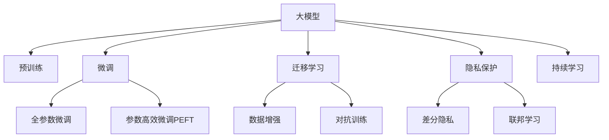

                 

## 1. 背景介绍

### 1.1 问题由来

在AI的浪潮中，大模型作为核心驱动力，以其广泛的适用性和强大的能力，吸引着无数创业者和投资者的目光。然而，大模型的开发与部署需要面对众多挑战，如高性能计算资源需求、数据获取与标注成本、算法复杂性、模型与数据隐私保护等。这些挑战不仅考验着技术实力，还涉及到商业运营的多个方面，对初创企业构成了极大的考验。

### 1.2 问题核心关键点

1. **高性能计算需求**：大规模模型的训练与推理需要消耗大量的计算资源。
2. **数据获取与标注**：高质量的数据是训练大模型的基础，数据获取与标注成本高昂。
3. **算法复杂性**：大模型的构建涉及复杂的深度学习架构和超参数调优。
4. **隐私保护**：在处理敏感数据时，如何确保数据隐私与模型安全性。
5. **落地应用**：如何将大模型应用于实际业务，实现商业价值。

### 1.3 问题研究意义

研究大模型创业中的技术创新，对于企业把握技术前沿、优化资源配置、降低运营成本、提升业务价值具有重要意义。它不仅能够帮助企业规避技术风险，还能够推动技术创新，提升企业竞争力，促进AI技术在各行业的落地应用。

## 2. 核心概念与联系

### 2.1 核心概念概述

- **大模型**：指通过大规模数据训练得到的深度学习模型，如BERT、GPT-3、DALL·E等。具有强大的泛化能力与表示能力。
- **预训练**：指在大规模无标签数据上进行自监督学习，学习通用的语言表示，为后续微调做准备。
- **微调**：指在预训练模型基础上，使用下游任务的标注数据进一步优化，提升模型在特定任务上的表现。
- **迁移学习**：利用预训练模型在下游任务上的知识迁移，减少标注数据需求，加速模型训练。
- **参数高效微调**：仅调整部分模型参数，避免过拟合，提高微调效率。
- **隐私保护**：在模型训练与推理过程中，确保数据隐私与安全。

### 2.2 核心概念联系

这些核心概念通过以下Mermaid流程图展示了它们之间的联系：



大模型通过预训练学习到通用的知识，通过微调适配特定任务，迁移学习则利用已有的知识加速新任务的训练，参数高效微调进一步提升模型的效率，隐私保护保证数据安全，持续学习保持模型的时效性。

## 3. 核心算法原理 & 具体操作步骤

### 3.1 算法原理概述

大模型创业中的核心算法原理主要围绕以下几个方面展开：

1. **高性能计算**：通过并行计算、模型剪枝、量化等技术，优化计算资源使用。
2. **数据获取与标注**：利用主动学习、数据增强、半监督学习等技术，降低标注成本，提升数据质量。
3. **算法优化**：通过参数高效微调、模型压缩、知识蒸馏等技术，提高模型效率，降低计算需求。
4. **隐私保护**：采用差分隐私、联邦学习等技术，确保数据隐私与模型安全。

### 3.2 算法步骤详解

以下以高性能计算为例，介绍其主要步骤：

1. **并行计算**：使用多GPU或多TPU进行分布式训练，加快模型训练速度。
2. **模型剪枝**：通过去除冗余参数，减少计算量和存储需求。
3. **量化**：将模型从浮点运算转化为定点运算，降低存储与计算成本。
4. **混合精度训练**：使用混合精度（如FP16）进行训练，提升训练效率。
5. **模型压缩**：通过知识蒸馏、网络修剪等技术，压缩模型大小。

### 3.3 算法优缺点

高性能计算的优点在于显著提升模型训练和推理的速度，缺点是硬件投入高，对技术和资源要求严格。数据获取与标注则降低了模型训练的初始成本，但也存在数据质量与数据隐私保护等问题。算法优化能够提高模型效率，但技术实现复杂，需要深入研究。隐私保护则涉及伦理与法律问题，需要谨慎处理。

### 3.4 算法应用领域

高性能计算、数据获取与标注、算法优化、隐私保护等技术在大模型创业中的应用广泛，涉及自然语言处理、计算机视觉、医疗健康、金融服务等多个领域。

## 4. 数学模型和公式 & 详细讲解 & 举例说明

### 4.1 数学模型构建

以量化为例，假设有模型参数 $\theta$，量化后的参数为 $\tilde{\theta}$，量化因子为 $q$。量化过程可以表示为：

$$
\tilde{\theta} = q \cdot \theta
$$

其中 $q$ 为量化因子，通常为整数。

### 4.2 公式推导过程

量化过程中，模型的计算精度损失可以通过以下公式来计算：

$$
\Delta_{\epsilon} = \frac{\sigma_{\tilde{y}}^2}{\sigma_{y}^2}
$$

其中 $\sigma_{\tilde{y}}$ 为量化后输出结果的标准差，$\sigma_{y}$ 为原始输出结果的标准差。

### 4.3 案例分析与讲解

假设原始模型参数 $\theta$ 大小为 1024，量化因子 $q=4$。量化后模型参数大小为 256，推理速度提升了两倍，但精度损失为 $1/4^2 = 1/16$。

## 5. 项目实践：代码实例和详细解释说明

### 5.1 开发环境搭建

- **安装Python**：在Linux或macOS下安装Python，推荐使用3.7或更高版本。
- **安装TensorFlow**：使用pip安装，并安装GPU支持版本。
- **安装PyTorch**：使用pip安装，并安装GPU支持版本。
- **安装TensorBoard**：用于模型监控与调试。
- **安装PyTorch Lightning**：用于简化模型训练过程。

### 5.2 源代码详细实现

以下是一个简单的全连接神经网络的量化代码示例：

```python
import torch
from torch import nn

class QuantizedNet(nn.Module):
    def __init__(self):
        super().__init__()
        self.fc1 = nn.Linear(784, 256)
        self.fc2 = nn.Linear(256, 10)
        self.q1 = nn.quantize_per_tensor((-1, 1), 0)
        self.q2 = nn.quantize_per_tensor((-1, 1), 0)

    def forward(self, x):
        x = self.q1(x)
        x = self.fc1(x)
        x = self.q2(x)
        x = self.fc2(x)
        return x

model = QuantizedNet()
model.to(device)
```

### 5.3 代码解读与分析

上述代码中，我们定义了一个量化后的全连接神经网络。通过 `nn.quantize_per_tensor` 函数进行量化，指定量化范围和量化后元素值。在 `forward` 方法中，通过逐层量化进行前向传播。

### 5.4 运行结果展示

通过对比原始模型和量化模型的推理速度和精度，可以直观地看到量化带来的提升和损失。

## 6. 实际应用场景

### 6.1 自动驾驶

在自动驾驶中，大模型可以用于感知、决策与控制。高性能计算可以大幅缩短模型训练时间，提升模型的实时性。数据增强技术可以在训练过程中生成更多样化的数据，提高模型泛化能力。参数高效微调可以优化模型结构，减少计算资源消耗。隐私保护技术可以确保车辆数据安全。

### 6.2 医疗健康

在医疗健康领域，大模型可以用于疾病诊断、个性化治疗、医疗影像分析等。高性能计算可以加速模型训练，提升诊断速度。数据获取与标注可以通过半监督学习、主动学习等方式降低成本。隐私保护技术可以保护患者隐私，确保数据安全。

### 6.3 金融服务

在金融服务中，大模型可以用于风险评估、欺诈检测、投资决策等。高性能计算可以加快模型训练，提升服务响应速度。数据获取与标注可以通过金融数据公开、伪造数据等方式进行。隐私保护技术可以确保金融数据安全。

## 7. 工具和资源推荐

### 7.1 学习资源推荐

- **Deep Learning Specialization**：由Coursera提供，涵盖深度学习的多个方面，包括大模型构建与优化。
- **TensorFlow Tutorial**：由TensorFlow官方提供，包含详细的学习资源与示例代码。
- **PyTorch Lightning**：由Hugging Face提供，提供模型训练的便捷工具。

### 7.2 开发工具推荐

- **PyTorch Lightning**：提供便捷的模型训练与调优功能。
- **TensorBoard**：提供模型监控与调试功能。
- **ONNX**：提供模型转换与部署功能。

### 7.3 相关论文推荐

- **Depthwise Separable Convolutional Layer in Recognition of Handwritten Text**：介绍深度可分离卷积，用于减少模型参数量。
- **Quantization and Quantization-Aware Training of Neural Networks for Resource-Efficient Inference**：研究量化与量化感知训练，优化模型推理速度。

## 8. 总结：未来发展趋势与挑战

### 8.1 总结

本文介绍了大模型创业中的核心算法原理和操作步骤，并结合实际应用场景进行了详细讲解。通过分析核心概念间的联系，深入探讨了高性能计算、数据获取与标注、算法优化与隐私保护等技术在大模型创业中的应用。

### 8.2 未来发展趋势

1. **模型自动化**：未来模型开发将更加自动化，降低开发门槛。
2. **模型小型化**：模型将向更小、更高效的方向发展，便于部署与应用。
3. **多模态融合**：模型将融合多模态数据，提升对复杂场景的理解能力。
4. **隐私保护**：隐私保护技术将更加成熟，确保数据安全。
5. **持续学习**：模型将具备持续学习能力，适应数据分布变化。

### 8.3 面临的挑战

1. **技术门槛**：模型开发与优化需要高水平的技术支持。
2. **数据安全**：数据隐私与模型安全仍需严格保障。
3. **落地应用**：模型需要适应特定业务需求，实现商业化应用。

### 8.4 研究展望

未来的研究应集中在以下几个方面：

1. **自动化模型开发**：降低模型开发门槛，提升开发效率。
2. **模型高效优化**：开发更高效的量化与压缩技术，减少资源消耗。
3. **隐私保护技术**：开发更多隐私保护算法，确保数据安全。
4. **跨模态融合**：开发更多融合多模态数据的模型。
5. **持续学习**：开发更多持续学习的算法，提升模型性能。

## 9. 附录：常见问题与解答

### Q1: 大模型的训练需要哪些硬件资源？

A: 大模型的训练需要高性能计算资源，包括多GPU或多TPU。同时还需要足够的内存和存储资源。

### Q2: 如何降低数据标注成本？

A: 可以通过半监督学习、主动学习、数据增强等技术，减少标注数据需求。

### Q3: 量化对模型精度有影响吗？

A: 量化会降低模型精度，但可以通过优化量化策略与算法，减少精度损失。

### Q4: 如何保护模型训练与推理中的隐私？

A: 可以使用差分隐私、联邦学习等技术，确保数据隐私与安全。

### Q5: 持续学习在大模型中的应用有哪些？

A: 持续学习可以提升模型性能，应对数据分布变化，应用于金融、医疗等业务场景。

---

作者：禅与计算机程序设计艺术 / Zen and the Art of Computer Programming

