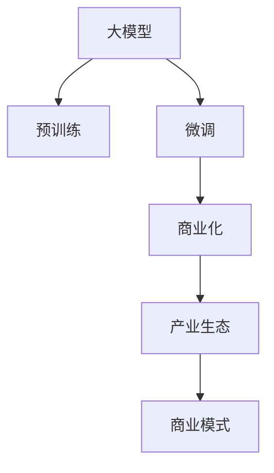

                 

# 大模型商业化:新商业模式和产业生态孕育

> 关键词：大模型,商业化,新模式,产业生态,技术趋势,应用场景

## 1. 背景介绍

### 1.1 问题由来
随着深度学习技术的快速发展，大模型（Big Models）如OpenAI的GPT-3、Google的BERT等在全球范围内引起了广泛关注。大模型通过大规模无标签数据预训练，在各种自然语言处理（NLP）任务中取得了显著的性能提升。然而，这些模型通常以巨额的研究经费和计算资源为代价，其商业化和应用前景一度备受质疑。近年来，随着AI商业化应用的推进，大模型也开始逐步步入商业化落地阶段，催生了全新的商业模式和产业生态。

### 1.2 问题核心关键点
大模型的商业化不仅关乎模型的技术性能，更涉及如何高效地将模型转化为产品和服务，同时在产业生态中寻找合适的应用场景。以下是商业化过程的几个核心关键点：
- **商业可行性分析**：评估模型的实际应用效果和商业价值。
- **应用场景挖掘**：识别适合大模型应用的具体领域，实现最大化的商业回报。
- **商业模式创新**：开发符合市场需求的商业模式，形成稳定的商业模式闭环。
- **产业生态建设**：构建包括开发者、用户、合作伙伴在内的生态系统，推动大规模应用。

## 2. 核心概念与联系

### 2.1 核心概念概述

为更好地理解大模型商业化的过程，本节将介绍几个密切相关的核心概念：

- **大模型（Big Models）**：指在深度学习中具有上亿甚至数十亿参数的大规模预训练模型，如GPT系列、BERT、XLNet等。通过在大规模无标签数据上进行预训练，大模型具备强大的学习能力和泛化性能。
- **预训练（Pre-training）**：指在无标签数据上训练模型，使其学习通用的语言表示。常见的预训练任务包括自回归语言模型、掩码语言模型等。
- **微调（Fine-tuning）**：指在大模型上针对特定任务进行有监督的训练，调整模型参数以适应具体任务。微调可以大幅提升模型在特定任务上的表现。
- **迁移学习（Transfer Learning）**：指在大模型上进行微调，使得模型在不同任务间实现知识迁移。预训练-微调过程即是一种典型的迁移学习方式。
- **商业化（Commercialization）**：指将技术成果转化为具有商业价值的商业模式和产品服务，实现技术转化为经济效益的过程。
- **产业生态（Industrial Ecosystem）**：指由技术、市场、合作伙伴等多个要素组成的商业环境，形成良性互动和共生共荣的局面。

这些概念之间的逻辑关系可以通过以下Mermaid流程图来展示：



这个流程图展示了大模型商业化的核心概念及其之间的关系：

1. 大模型通过预训练获得基础能力。
2. 微调在大模型上进行特定任务优化，提升性能。
3. 商业化将模型转化为产品和服务，创造商业价值。
4. 产业生态为商业化提供基础环境，促进模型广泛应用。

这些概念共同构成了大模型商业化的理论基础，为其商业化路径提供了方向性指引。

## 3. 核心算法原理 & 具体操作步骤
### 3.1 算法原理概述

大模型的商业化核心在于如何将技术成果转化为商业价值，这一过程通常包括以下几个步骤：

- **技术评估**：评估模型的实际应用效果和商业潜力。
- **市场分析**：分析潜在用户群体的需求，选择最佳应用场景。
- **商业设计**：设计符合市场需求的商业模式，如订阅、按需付费等。
- **产品开发**：开发产品原型，进行测试和优化。
- **市场推广**：通过营销策略和渠道，将产品推向市场。
- **用户反馈**：收集用户反馈，持续改进产品和服务。

以上步骤是一个循环往复的过程，需要不断迭代和优化。

### 3.2 算法步骤详解

以下是商业化过程的详细步骤：

**Step 1: 技术评估**
- 对大模型进行应用场景测试，评估其性能和效果。
- 进行商业可行性分析，包括市场规模、利润空间、用户需求等。
- 通过用户测试和数据分析，确定模型在实际应用中的可行性。

**Step 2: 市场分析**
- 研究目标市场和潜在用户群体，分析用户需求和痛点。
- 识别适合大模型应用的具体领域，如智能客服、舆情分析、推荐系统等。
- 进行市场竞争分析，评估竞争对手的市场占有率和优势。

**Step 3: 商业设计**
- 根据市场分析结果，设计符合用户需求的商业模式。
- 确定产品形态，如API、SDK、插件等。
- 制定定价策略，包括一次性购买、订阅服务等。

**Step 4: 产品开发**
- 开发产品原型，并进行功能测试和性能优化。
- 收集用户反馈，不断改进产品功能和服务质量。
- 设计用户界面和交互方式，提升用户体验。

**Step 5: 市场推广**
- 制定营销策略，包括内容营销、社交媒体推广等。
- 选择合适的渠道，如应用商店、官网、第三方平台等。
- 进行市场宣传和用户教育，提升品牌知名度。

**Step 6: 用户反馈**
- 收集用户反馈，进行持续改进和优化。
- 定期发布新版本，提升产品稳定性和功能完善度。
- 建立用户支持和服务体系，提高用户满意度。

### 3.3 算法优缺点

大模型商业化方法具有以下优点：
- **高效性能**：大模型具有强大的学习和泛化能力，可以快速适应新场景和新任务，提升应用效果。
- **广泛适用性**：适合各种NLP任务，如问答、翻译、摘要等，有较高的灵活性和通用性。
- **高收益潜力**：大模型在特定领域的应用可以带来显著的经济效益，如降低运营成本、提升用户体验等。

同时，也存在一些缺点：
- **高门槛**：研发和商业化过程需要大量的资金和技术支持，门槛较高。
- **数据隐私**：大模型需要大量数据进行预训练，数据隐私和安全问题不容忽视。
- **技术复杂**：大模型的技术实现复杂，商业化过程需要不断调试和优化。
- **市场需求不确定**：市场对新技术的接受度存在不确定性，商业化过程风险较高。

尽管存在这些缺点，但大模型的商业化前景广阔，特别是在需求高、市场大的NLP领域。未来相关研究的重点在于如何降低商业化门槛，提高市场适应性和用户接受度，同时确保数据隐私和技术安全。

### 3.4 算法应用领域

大模型的商业化应用已经广泛应用于多个行业领域，例如：

- **智能客服**：使用大模型进行对话生成、意图识别和情感分析，提升客户服务体验和效率。
- **舆情分析**：利用大模型进行情感分析和主题分类，实时监测和分析网络舆情。
- **推荐系统**：结合大模型进行个性化推荐，提升用户推荐准确度和满意度。
- **医疗健康**：通过大模型进行医学文本分析，辅助医生诊断和治疗决策。
- **金融风控**：使用大模型进行信用评估、欺诈检测和风险预警，保障金融安全。
- **自动驾驶**：结合自然语言处理和语音识别技术，实现车机交互和自动导航。

除了上述这些领域，大模型还在法律咨询、教育培训、智能家居等多个领域实现了商业应用，为各行各业带来了新的商业机遇。

## 4. 数学模型和公式 & 详细讲解 & 举例说明

### 4.1 数学模型构建

为了更好地理解大模型商业化的技术基础，本节将详细构建大模型商业化的数学模型。

假设大模型为 $M_{\theta}$，其中 $\theta$ 为模型参数。在商业化过程中，大模型需要被微调以适应特定任务 $T$。微调的目标是最小化经验风险 $\mathcal{L}(\theta)$，即：

$$
\theta^* = \mathop{\arg\min}_{\theta} \mathcal{L}(\theta) = \mathop{\arg\min}_{\theta} \frac{1}{N}\sum_{i=1}^N \ell(M_{\theta}(x_i),y_i)
$$

其中 $\ell(\cdot)$ 为损失函数，$x_i$ 和 $y_i$ 分别为样本和标签。

### 4.2 公式推导过程

以情感分析任务为例，假设模型输出为 $M_{\theta}(x)$，真实标签为 $y \in \{-1,1\}$，则二分类交叉熵损失函数为：

$$
\ell(M_{\theta}(x),y) = -y\log(M_{\theta}(x)) - (1-y)\log(1-M_{\theta}(x))
$$

将其代入经验风险公式，得：

$$
\mathcal{L}(\theta) = -\frac{1}{N}\sum_{i=1}^N [y_i\log M_{\theta}(x_i)+(1-y_i)\log(1-M_{\theta}(x_i))]
$$

根据链式法则，损失函数对参数 $\theta_k$ 的梯度为：

$$
\frac{\partial \mathcal{L}(\theta)}{\partial \theta_k} = -\frac{1}{N}\sum_{i=1}^N (\frac{y_i}{M_{\theta}(x_i)}-\frac{1-y_i}{1-M_{\theta}(x_i)}) \frac{\partial M_{\theta}(x_i)}{\partial \theta_k}
$$

其中 $\frac{\partial M_{\theta}(x_i)}{\partial \theta_k}$ 可进一步递归展开，利用自动微分技术完成计算。

### 4.3 案例分析与讲解

假设有一家电商平台，希望利用大模型进行商品推荐系统。推荐系统需要预测用户对商品的评分，即情感分类任务。模型为 $M_{\theta}$，训练数据集为 $\{(x_i,y_i)\}_{i=1}^N$，其中 $x_i$ 为商品描述，$y_i$ 为用户评分。

使用二分类交叉熵损失函数，构建推荐系统微调模型。微调过程如下：

1. **准备数据集**：收集商品描述和用户评分数据，构建训练集、验证集和测试集。

2. **选择模型**：使用大模型（如BERT、GPT）作为推荐系统的基础模型。

3. **添加任务适配层**：在顶层添加线性分类器和交叉熵损失函数。

4. **设置微调超参数**：包括学习率、批大小、迭代轮数等。

5. **执行梯度训练**：在训练集上执行前向传播和反向传播，最小化损失函数。

6. **测试和部署**：在测试集上评估微调后模型的性能，并进行上线部署。

最终，通过微调，大模型能够学习到商品描述和用户评分之间的关系，快速生成商品推荐，提升用户满意度。

## 5. 项目实践：代码实例和详细解释说明
### 5.1 开发环境搭建

在进行大模型商业化实践前，我们需要准备好开发环境。以下是使用Python进行PyTorch开发的环境配置流程：

1. 安装Anaconda：从官网下载并安装Anaconda，用于创建独立的Python环境。

2. 创建并激活虚拟环境：
```bash
conda create -n pytorch-env python=3.8 
conda activate pytorch-env
```

3. 安装PyTorch：根据CUDA版本，从官网获取对应的安装命令。例如：
```bash
conda install pytorch torchvision torchaudio cudatoolkit=11.1 -c pytorch -c conda-forge
```

4. 安装Transformers库：
```bash
pip install transformers
```

5. 安装各类工具包：
```bash
pip install numpy pandas scikit-learn matplotlib tqdm jupyter notebook ipython
```

完成上述步骤后，即可在`pytorch-env`环境中开始商业化实践。

### 5.2 源代码详细实现

这里以推荐系统为例，给出使用Transformers库对BERT模型进行商业化微调的PyTorch代码实现。

首先，定义推荐系统的数据处理函数：

```python
from transformers import BertTokenizer
from torch.utils.data import Dataset
import torch

class RecommendationDataset(Dataset):
    def __init__(self, texts, scores, tokenizer, max_len=128):
        self.texts = texts
        self.scores = scores
        self.tokenizer = tokenizer
        self.max_len = max_len
        
    def __len__(self):
        return len(self.texts)
    
    def __getitem__(self, item):
        text = self.texts[item]
        score = self.scores[item]
        
        encoding = self.tokenizer(text, return_tensors='pt', max_length=self.max_len, padding='max_length', truncation=True)
        input_ids = encoding['input_ids'][0]
        attention_mask = encoding['attention_mask'][0]
        
        # 对token-wise的评分进行编码
        encoded_scores = [score2id[_score] for _score in score] 
        encoded_scores.extend([score2id['O']] * (self.max_len - len(encoded_scores)))
        labels = torch.tensor(encoded_scores, dtype=torch.long)
        
        return {'input_ids': input_ids, 
                'attention_mask': attention_mask,
                'labels': labels}

# 评分与id的映射
score2id = {'O': 0, 'good': 1, 'bad': 2}
id2score = {v: k for k, v in score2id.items()}

# 创建dataset
tokenizer = BertTokenizer.from_pretrained('bert-base-cased')

train_dataset = RecommendationDataset(train_texts, train_scores, tokenizer)
dev_dataset = RecommendationDataset(dev_texts, dev_scores, tokenizer)
test_dataset = RecommendationDataset(test_texts, test_scores, tokenizer)
```

然后，定义模型和优化器：

```python
from transformers import BertForTokenClassification, AdamW

model = BertForTokenClassification.from_pretrained('bert-base-cased', num_labels=len(score2id))

optimizer = AdamW(model.parameters(), lr=2e-5)
```

接着，定义训练和评估函数：

```python
from torch.utils.data import DataLoader
from tqdm import tqdm
from sklearn.metrics import classification_report

device = torch.device('cuda') if torch.cuda.is_available() else torch.device('cpu')
model.to(device)

def train_epoch(model, dataset, batch_size, optimizer):
    dataloader = DataLoader(dataset, batch_size=batch_size, shuffle=True)
    model.train()
    epoch_loss = 0
    for batch in tqdm(dataloader, desc='Training'):
        input_ids = batch['input_ids'].to(device)
        attention_mask = batch['attention_mask'].to(device)
        labels = batch['labels'].to(device)
        model.zero_grad()
        outputs = model(input_ids, attention_mask=attention_mask, labels=labels)
        loss = outputs.loss
        epoch_loss += loss.item()
        loss.backward()
        optimizer.step()
    return epoch_loss / len(dataloader)

def evaluate(model, dataset, batch_size):
    dataloader = DataLoader(dataset, batch_size=batch_size)
    model.eval()
    preds, labels = [], []
    with torch.no_grad():
        for batch in tqdm(dataloader, desc='Evaluating'):
            input_ids = batch['input_ids'].to(device)
            attention_mask = batch['attention_mask'].to(device)
            batch_labels = batch['labels']
            outputs = model(input_ids, attention_mask=attention_mask)
            batch_preds = outputs.logits.argmax(dim=2).to('cpu').tolist()
            batch_labels = batch_labels.to('cpu').tolist()
            for pred_tokens, label_tokens in zip(batch_preds, batch_labels):
                pred_scores = [id2score[_id] for _id in pred_tokens]
                label_scores = [id2score[_id] for _id in label_tokens]
                preds.append(pred_scores[:len(label_scores)])
                labels.append(label_scores)
                
    print(classification_report(labels, preds))
```

最后，启动训练流程并在测试集上评估：

```python
epochs = 5
batch_size = 16

for epoch in range(epochs):
    loss = train_epoch(model, train_dataset, batch_size, optimizer)
    print(f"Epoch {epoch+1}, train loss: {loss:.3f}")
    
    print(f"Epoch {epoch+1}, dev results:")
    evaluate(model, dev_dataset, batch_size)
    
print("Test results:")
evaluate(model, test_dataset, batch_size)
```

以上就是使用PyTorch对BERT进行推荐系统微调的完整代码实现。可以看到，得益于Transformers库的强大封装，我们可以用相对简洁的代码完成BERT模型的加载和微调。

### 5.3 代码解读与分析

让我们再详细解读一下关键代码的实现细节：

**RecommendationDataset类**：
- `__init__`方法：初始化文本、评分、分词器等关键组件。
- `__len__`方法：返回数据集的样本数量。
- `__getitem__`方法：对单个样本进行处理，将文本输入编码为token ids，将评分编码为数字，并对其进行定长padding，最终返回模型所需的输入。

**score2id和id2score字典**：
- 定义了评分与数字id之间的映射关系，用于将token-wise的预测结果解码回真实的评分。

**训练和评估函数**：
- 使用PyTorch的DataLoader对数据集进行批次化加载，供模型训练和推理使用。
- 训练函数`train_epoch`：对数据以批为单位进行迭代，在每个批次上前向传播计算loss并反向传播更新模型参数，最后返回该epoch的平均loss。
- 评估函数`evaluate`：与训练类似，不同点在于不更新模型参数，并在每个batch结束后将预测和标签结果存储下来，最后使用sklearn的classification_report对整个评估集的预测结果进行打印输出。

**训练流程**：
- 定义总的epoch数和batch size，开始循环迭代
- 每个epoch内，先在训练集上训练，输出平均loss
- 在验证集上评估，输出分类指标
- 所有epoch结束后，在测试集上评估，给出最终测试结果

可以看到，PyTorch配合Transformers库使得BERT微调的代码实现变得简洁高效。开发者可以将更多精力放在数据处理、模型改进等高层逻辑上，而不必过多关注底层的实现细节。

当然，工业级的系统实现还需考虑更多因素，如模型的保存和部署、超参数的自动搜索、更灵活的任务适配层等。但核心的商业化范式基本与此类似。

## 6. 实际应用场景
### 6.1 智能客服系统

基于大模型商业化的对话技术，可以广泛应用于智能客服系统的构建。传统客服往往需要配备大量人力，高峰期响应缓慢，且一致性和专业性难以保证。而使用商业化的大模型进行对话生成，可以7x24小时不间断服务，快速响应客户咨询，用自然流畅的语言解答各类常见问题。

在技术实现上，可以收集企业内部的历史客服对话记录，将问题和最佳答复构建成监督数据，在此基础上对预训练对话模型进行微调。微调后的对话模型能够自动理解用户意图，匹配最合适的答案模板进行回复。对于客户提出的新问题，还可以接入检索系统实时搜索相关内容，动态组织生成回答。如此构建的智能客服系统，能大幅提升客户咨询体验和问题解决效率。

### 6.2 金融舆情监测

金融机构需要实时监测市场舆论动向，以便及时应对负面信息传播，规避金融风险。传统的人工监测方式成本高、效率低，难以应对网络时代海量信息爆发的挑战。基于大模型商业化的文本分类和情感分析技术，为金融舆情监测提供了新的解决方案。

具体而言，可以收集金融领域相关的新闻、报道、评论等文本数据，并对其进行主题标注和情感标注。在此基础上对预训练语言模型进行微调，使其能够自动判断文本属于何种主题，情感倾向是正面、中性还是负面。将商业化后的模型应用到实时抓取的网络文本数据，就能够自动监测不同主题下的情感变化趋势，一旦发现负面信息激增等异常情况，系统便会自动预警，帮助金融机构快速应对潜在风险。

### 6.3 个性化推荐系统

当前的推荐系统往往只依赖用户的历史行为数据进行物品推荐，无法深入理解用户的真实兴趣偏好。基于大模型商业化的个性化推荐系统可以更好地挖掘用户行为背后的语义信息，从而提供更精准、多样的推荐内容。

在实践中，可以收集用户浏览、点击、评论、分享等行为数据，提取和用户交互的物品标题、描述、标签等文本内容。将文本内容作为模型输入，用户的后续行为（如是否点击、购买等）作为监督信号，在此基础上微调预训练语言模型。商业化后的模型能够从文本内容中准确把握用户的兴趣点。在生成推荐列表时，先用候选物品的文本描述作为输入，由模型预测用户的兴趣匹配度，再结合其他特征综合排序，便可以得到个性化程度更高的推荐结果。

### 6.4 未来应用展望

随着大模型商业化和应用场景的不断拓展，基于商业化的大模型微调方法将在更多领域得到应用，为传统行业带来变革性影响。

在智慧医疗领域，基于商业化的医疗问答、病历分析、药物研发等应用将提升医疗服务的智能化水平，辅助医生诊疗，加速新药开发进程。

在智能教育领域，商业化的大模型可以应用于作业批改、学情分析、知识推荐等方面，因材施教，促进教育公平，提高教学质量。

在智慧城市治理中，商业化的大模型可应用于城市事件监测、舆情分析、应急指挥等环节，提高城市管理的自动化和智能化水平，构建更安全、高效的未来城市。

此外，在企业生产、社会治理、文娱传媒等众多领域，基于商业化的大模型AI应用也将不断涌现，为经济社会发展注入新的动力。相信随着技术的日益成熟，商业化方法将成为AI落地应用的重要范式，推动人工智能技术在垂直行业的规模化落地。总之，大模型的商业化需要开发者根据具体任务，不断迭代和优化模型、数据和算法，方能得到理想的效果。

## 7. 工具和资源推荐
### 7.1 学习资源推荐

为了帮助开发者系统掌握大模型商业化的理论基础和实践技巧，这里推荐一些优质的学习资源：

1. 《Transformer从原理到实践》系列博文：由大模型技术专家撰写，深入浅出地介绍了Transformer原理、BERT模型、商业化技术等前沿话题。

2. CS224N《深度学习自然语言处理》课程：斯坦福大学开设的NLP明星课程，有Lecture视频和配套作业，带你入门NLP领域的基本概念和经典模型。

3. 《Natural Language Processing with Transformers》书籍：Transformers库的作者所著，全面介绍了如何使用Transformers库进行NLP任务开发，包括商业化在内的诸多范式。

4. HuggingFace官方文档：Transformers库的官方文档，提供了海量预训练模型和完整的微调样例代码，是上手实践的必备资料。

5. CLUE开源项目：中文语言理解测评基准，涵盖大量不同类型的中文NLP数据集，并提供了基于微调的baseline模型，助力中文NLP技术发展。

通过对这些资源的学习实践，相信你一定能够快速掌握大模型商业化的精髓，并用于解决实际的NLP问题。
###  7.2 开发工具推荐

高效的开发离不开优秀的工具支持。以下是几款用于大模型商业化开发的常用工具：

1. PyTorch：基于Python的开源深度学习框架，灵活动态的计算图，适合快速迭代研究。大部分预训练语言模型都有PyTorch版本的实现。

2. TensorFlow：由Google主导开发的开源深度学习框架，生产部署方便，适合大规模工程应用。同样有丰富的预训练语言模型资源。

3. Transformers库：HuggingFace开发的NLP工具库，集成了众多SOTA语言模型，支持PyTorch和TensorFlow，是进行商业化任务开发的利器。

4. Weights & Biases：模型训练的实验跟踪工具，可以记录和可视化模型训练过程中的各项指标，方便对比和调优。与主流深度学习框架无缝集成。

5. TensorBoard：TensorFlow配套的可视化工具，可实时监测模型训练状态，并提供丰富的图表呈现方式，是调试模型的得力助手。

6. Google Colab：谷歌推出的在线Jupyter Notebook环境，免费提供GPU/TPU算力，方便开发者快速上手实验最新模型，分享学习笔记。

合理利用这些工具，可以显著提升大模型商业化的开发效率，加快创新迭代的步伐。

### 7.3 相关论文推荐

大模型商业化技术的发展源于学界的持续研究。以下是几篇奠基性的相关论文，推荐阅读：

1. Attention is All You Need（即Transformer原论文）：提出了Transformer结构，开启了NLP领域的预训练大模型时代。

2. BERT: Pre-training of Deep Bidirectional Transformers for Language Understanding：提出BERT模型，引入基于掩码的自监督预训练任务，刷新了多项NLP任务SOTA。

3. Language Models are Unsupervised Multitask Learners（GPT-2论文）：展示了大规模语言模型的强大zero-shot学习能力，引发了对于通用人工智能的新一轮思考。

4. Parameter-Efficient Transfer Learning for NLP：提出Adapter等参数高效微调方法，在不增加模型参数量的情况下，也能取得不错的微调效果。

5. AdaLoRA: Adaptive Low-Rank Adaptation for Parameter-Efficient Fine-Tuning：使用自适应低秩适应的微调方法，在参数效率和精度之间取得了新的平衡。

6. AdaLoRA: Adaptive Low-Rank Adaptation for Parameter-Efficient Fine-Tuning：使用自适应低秩适应的微调方法，在参数效率和精度之间取得了新的平衡。

这些论文代表了大模型商业化技术的发展脉络。通过学习这些前沿成果，可以帮助研究者把握学科前进方向，激发更多的创新灵感。

## 8. 总结：未来发展趋势与挑战

### 8.1 总结

本文对大模型商业化的过程进行了全面系统的介绍。首先阐述了大模型商业化的背景和意义，明确了商业化过程的核心目标和方法。其次，从原理到实践，详细讲解了大模型商业化的数学模型和关键步骤，给出了商业化任务开发的完整代码实例。同时，本文还广泛探讨了大模型在智能客服、金融舆情、推荐系统等多个行业领域的应用前景，展示了大模型商业化的巨大潜力。此外，本文精选了商业化技术的各类学习资源，力求为开发者提供全方位的技术指引。

通过本文的系统梳理，可以看到，大模型商业化已经初步具备了一定的实践基础，并在多个领域实现了应用。未来，随着技术的不断演进和产业生态的逐步完善，大模型的商业化前景将更加广阔，其价值也将逐步显现。

### 8.2 未来发展趋势

展望未来，大模型商业化技术将呈现以下几个发展趋势：

1. **商业化平台普及**：随着大模型预训练和微调技术的成熟，越来越多的商业化平台将涌现，为开发者提供便捷的微调工具和模型库。

2. **低成本微调**：随着算力资源的降低和自动化微调技术的发展，微调过程将更加高效，成本将逐步降低。

3. **全栈解决方案**：商业化平台将提供从数据准备到模型部署的一站式解决方案，降低开发门槛，加速模型落地。

4. **多模态融合**：未来的大模型将不仅包含语言模型，还会融合视觉、音频等多种模态，提升模型的综合表现力。

5. **智能编排**：基于云计算和大数据技术，实现模型的智能编排和调度，提升资源利用效率。

6. **实时微调**：实现模型的实时微调，支持动态数据和场景变化，保持模型性能的持续优化。

以上趋势凸显了大模型商业化技术的广阔前景。这些方向的探索发展，必将进一步提升大模型的应用效果和市场接受度，加速商业化进程。

### 8.3 面临的挑战

尽管大模型商业化前景广阔，但在迈向更加智能化、普适化应用的过程中，它仍面临诸多挑战：

1. **数据隐私和安全**：大模型需要大量数据进行预训练，数据隐私和安全问题不容忽视。如何保护用户隐私，同时利用数据提升模型性能，仍需深入研究。

2. **模型鲁棒性**：大模型面对域外数据时，泛化性能往往大打折扣。如何提高模型鲁棒性，避免灾难性遗忘，还需要更多理论和实践的积累。

3. **计算资源需求**：大规模语言模型的计算需求仍然较高，如何降低计算资源成本，实现高效训练和推理，仍需进一步优化。

4. **模型复杂性**：大模型通常具有上亿甚至数十亿参数，模型复杂性高，难以进行部署和维护。如何简化模型结构，提升部署效率，将是重要的优化方向。

5. **商业化风险**：大模型的商业化过程中，如何规避市场风险和用户需求变化风险，保持产品的市场竞争力和用户满意度，仍需深入研究。

6. **伦理和法律问题**：大模型在应用过程中可能面临伦理和法律问题，如何确保模型的公平性和公正性，避免歧视性输出，仍需深入研究。

尽管存在这些挑战，但大模型的商业化前景广阔，特别是在需求高、市场大的NLP领域。未来相关研究的重点在于如何降低商业化门槛，提高市场适应性和用户接受度，同时确保数据隐私和技术安全。

### 8.4 研究展望

面对大模型商业化所面临的种种挑战，未来的研究需要在以下几个方面寻求新的突破：

1. **无监督和半监督商业化方法**：摆脱对大规模标注数据的依赖，利用自监督学习、主动学习等无监督和半监督范式，最大限度利用非结构化数据，实现更加灵活高效的商业化。

2. **参数高效和计算高效的商业化范式**：开发更加参数高效的商业化方法，在固定大部分预训练参数的同时，只更新极少量的任务相关参数。同时优化商业化模型的计算图，减少前向传播和反向传播的资源消耗，实现更加轻量级、实时性的部署。

3. **多模态商业化**：将符号化的先验知识，如知识图谱、逻辑规则等，与神经网络模型进行巧妙融合，引导商业化过程学习更准确、合理的语言模型。同时加强不同模态数据的整合，实现视觉、语音等多模态信息与文本信息的协同建模。

4. **因果分析和博弈论工具**：将因果分析方法引入商业化模型，识别出模型决策的关键特征，增强输出解释的因果性和逻辑性。借助博弈论工具刻画人机交互过程，主动探索并规避模型的脆弱点，提高系统稳定性。

5. **伦理和法律约束**：在模型训练目标中引入伦理导向的评估指标，过滤和惩罚有偏见、有害的输出倾向。同时加强人工干预和审核，建立模型行为的监管机制，确保输出符合人类价值观和伦理道德。

这些研究方向的探索，必将引领大模型商业化技术迈向更高的台阶，为构建安全、可靠、可解释、可控的智能系统铺平道路。面向未来，大模型的商业化需要与其他人工智能技术进行更深入的融合，如知识表示、因果推理、强化学习等，多路径协同发力，共同推动自然语言理解和智能交互系统的进步。只有勇于创新、敢于突破，才能不断拓展语言模型的边界，让智能技术更好地造福人类社会。

## 9. 附录：常见问题与解答

**Q1：大模型商业化是否适用于所有NLP任务？**

A: 大模型商业化在大多数NLP任务上都能取得不错的效果，特别是对于数据量较小的任务。但对于一些特定领域的任务，如医学、法律等，仅仅依靠通用语料预训练的模型可能难以很好地适应。此时需要在特定领域语料上进一步预训练，再进行微调，才能获得理想效果。此外，对于一些需要时效性、个性化很强的任务，如对话、推荐等，商业化方法也需要针对性的改进优化。

**Q2：商业化过程中如何选择最适合的商业模式？**

A: 选择适合的商业模式需要考虑多个因素，包括市场需求、技术复杂度、竞争环境等。以下是几种常见的商业模式：

1. **按需付费（Pay-per-Use）**：用户按使用量付费，适合对性能要求较高、用户需求变化较快的场景。

2. **订阅服务（Subscription）**：用户按月或按年付费，适合对性能要求一般、用户需求相对稳定的场景。

3. **开源免费（Open Source Free）**：将模型开源免费，通过社区支持和广告收入获取收益，适合技术驱动型公司和开源社区。

4. **联合开发（Collaborative Development）**：与行业合作伙伴共同开发，通过技术合作、数据共享等方式实现共赢，适合企业合作型项目。

选择合适的商业模式需要根据具体应用场景和用户需求进行综合评估，找到最合适的商业模式组合。

**Q3：大模型商业化过程中需要注意哪些问题？**

A: 大模型商业化过程中需要注意以下问题：

1. **数据隐私和安全**：保护用户数据隐私，确保模型训练和使用过程的安全性。

2. **模型鲁棒性**：避免模型在测试集和训练集上性能差异过大，确保模型在真实环境中的稳定性和可靠性。

3. **计算资源成本**：优化计算资源使用，降低商业化过程中的成本。

4. **模型复杂性**：简化模型结构，提升部署效率，确保商业化产品的易用性。

5. **市场风险**：评估市场风险，制定应对策略，确保商业化的可持续性。

6. **用户反馈**：收集用户反馈，持续改进商业化产品，提升用户体验。

合理应对这些问题，可以确保大模型商业化顺利进行，实现经济效益和社会价值。

**Q4：大模型商业化如何实现持续优化？**

A: 实现大模型商业化的持续优化需要从多个方面入手：

1. **用户反馈收集**：通过用户反馈不断优化模型性能和用户体验。

2. **模型迭代更新**：根据最新数据和任务需求，定期更新和迭代模型，保持模型性能的持续提升。

3. **算法优化**：持续改进算法模型，提升模型训练和推理效率。

4. **数据增强**：通过数据增强技术，丰富数据集，提升模型泛化能力。

5. **技术升级**：采用最新技术，如迁移学习、模型压缩、分布式训练等，优化商业化产品。

6. **用户教育**：通过用户教育和技术支持，提升用户使用体验和满意度。

通过不断迭代优化，大模型商业化产品将更加智能、高效、稳定，为用户带来更好的使用体验。

**Q5：大模型商业化过程中如何保护用户隐私？**

A: 大模型商业化过程中保护用户隐私是至关重要的，以下是几种常见方法：

1. **数据匿名化**：对用户数据进行匿名化处理，防止数据泄露。

2. **隐私保护技术**：采用差分隐私、联邦学习等技术，保护用户隐私。

3. **用户同意**：获取用户同意，确保用户数据的使用符合其意愿。

4. **数据存储加密**：对用户数据进行加密存储，防止数据泄露。

5. **数据使用限制**：限制用户数据的访问和使用，确保数据仅用于商业化模型的训练和推理。

通过这些方法，可以有效地保护用户隐私，确保大模型商业化的安全性和合法性。

---

作者：禅与计算机程序设计艺术 / Zen and the Art of Computer Programming

