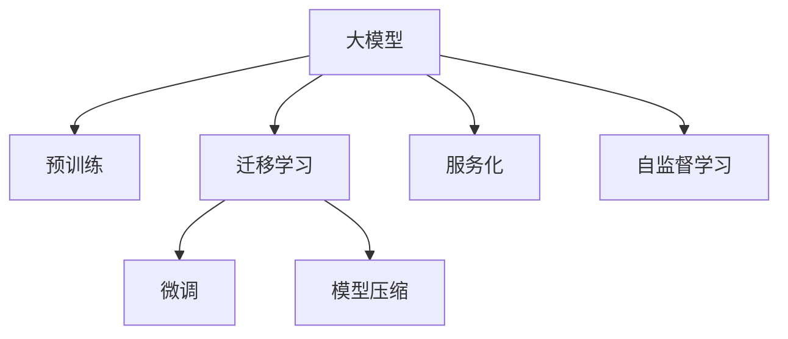

                 

# 大模型在to B市场的应用

> 关键词：大模型，AI应用，To B市场，人工智能商业化，企业解决方案，AI效率提升，客户服务优化

## 1. 背景介绍

### 1.1 问题由来
随着人工智能技术的不断进步，大模型在商业化应用中的地位越来越重要。然而，传统的人工智能技术通常只关注单个或小规模的业务问题，难以真正落地到企业级场景中，未能发挥其最大价值。而大模型的出现，为解决这一问题提供了可能。大模型以其强大的处理能力和泛化能力，能够应对更复杂、大规模的业务需求，从而在to B市场中崭露头角。

### 1.2 问题核心关键点
大模型在to B市场的应用，核心在于其能够提供高效、灵活、可扩展的AI解决方案。与传统小模型相比，大模型在处理大规模数据时，具备更快的速度和更高的准确性，同时还能通过迁移学习快速适应不同业务场景。但大模型在实际应用中，也面临数据量、模型复杂度、推理速度等诸多挑战，需要进一步的优化和创新。

## 2. 核心概念与联系

### 2.1 核心概念概述

为了更好地理解大模型在to B市场的应用，本文将介绍几个密切相关的核心概念：

- 大模型（Large Model）：指参数量在亿级以上的预训练模型，通常用于解决复杂和高度抽象的问题，如自然语言处理、计算机视觉、语音识别等。
- 预训练（Pre-training）：指在大规模无标签数据上对模型进行训练，使其学习到通用的知识表示。
- 迁移学习（Transfer Learning）：将预训练模型知识迁移到特定任务上，以提高模型在该任务上的表现。
- 微调（Fine-tuning）：在预训练模型的基础上，使用小规模标注数据进一步训练模型，使其适应特定任务。
- 模型压缩（Model Compression）：通过剪枝、量化等技术，减少模型参数和计算量，提高推理效率。
- 服务化（Serviceization）：将大模型封装为标准化的API接口，便于企业快速集成和使用。
- 自监督学习（Self-supervised Learning）：利用无标签数据进行训练，减少对标注数据的依赖。

这些概念之间的逻辑关系可以通过以下Mermaid流程图来展示：



这个流程图展示了大模型从预训练到服务化应用的整体流程。

## 3. 核心算法原理 & 具体操作步骤
### 3.1 算法原理概述

大模型在to B市场的应用，主要基于预训练-迁移学习范式。该范式通过在大规模数据上预训练模型，学习到通用的语言和知识表示，然后在特定业务场景下通过微调进一步优化模型，使其具备针对该场景的特定能力。

形式化地，假设预训练模型为 $M_{\theta}$，其中 $\theta$ 为预训练得到的模型参数。给定特定业务场景 $S$ 的数据集 $D_S=\{(x_i, y_i)\}_{i=1}^N$，其中 $x_i$ 为输入数据，$y_i$ 为标注结果，则微调的目标是找到新的模型参数 $\hat{\theta}$，使得：

$$
\hat{\theta} = \mathop{\arg\min}_{\theta} \mathcal{L}(M_{\theta},D_S)
$$

其中 $\mathcal{L}$ 为针对场景 $S$ 设计的损失函数，用于衡量模型在 $D_S$ 上的表现。常见的损失函数包括交叉熵损失、均方误差损失等。

### 3.2 算法步骤详解

基于预训练-迁移学习的范式，大模型在to B市场的应用主要包括以下关键步骤：

**Step 1: 准备预训练模型和数据集**
- 选择合适的预训练模型 $M_{\theta}$，如BERT、GPT等，并确保其与目标业务场景的语料库相似。
- 准备目标业务场景 $S$ 的标注数据集 $D_S$，划分为训练集、验证集和测试集。数据集应涵盖典型场景的典型数据，以确保模型具有良好的泛化能力。

**Step 2: 设计任务适配层**
- 根据目标业务场景，设计合适的输出层和损失函数。例如，在自然语言处理场景中，通常使用分类器的交叉熵损失函数。
- 设计特定的任务数据预处理流程，确保输入数据符合模型要求。

**Step 3: 执行微调**
- 使用小批量数据进行微调，以避免模型过拟合。
- 设置合理的学习率、批大小、迭代轮数等超参数。
- 在微调过程中使用正则化技术，如L2正则、Dropout等，提高模型的泛化能力。

**Step 4: 测试和部署**
- 在测试集上评估微调后的模型性能，确保其符合业务需求。
- 将模型封装为标准化的API接口，供企业客户使用。
- 定期收集新数据，重新微调模型，以应对业务需求的变化。

### 3.3 算法优缺点

大模型在to B市场的应用具有以下优点：

1. **高效灵活**：大模型通过迁移学习，可以快速适应不同业务场景，并在小规模数据上取得良好效果。
2. **鲁棒性强**：由于在大规模数据上预训练，模型具有较强的泛化能力，能应对各种业务变化。
3. **可扩展性**：大模型可以无缝扩展到不同的企业客户，满足不同规模和复杂度的需求。

同时，大模型在to B市场的应用也存在一些局限性：

1. **数据需求高**：大模型需要大量的高质量数据进行预训练和微调，对标注数据的需求较高。
2. **资源消耗大**：大模型参数量庞大，推理计算资源消耗大，需要在硬件上进行特殊配置。
3. **部署复杂**：大模型的服务化部署需要考虑模型的集成、接口设计、性能优化等问题。
4. **可解释性差**：大模型的决策过程复杂，难以解释其内部工作机制，增加了应用的复杂度。

## 4. 数学模型和公式 & 详细讲解 & 举例说明

### 4.1 数学模型构建

在to B市场中，大模型的应用通常涉及复杂的业务场景，其数学模型的构建需要考虑多方面的因素。以下以自然语言处理（NLP）场景为例，展示如何构建大模型的数学模型。

假设目标业务场景是文本分类，预训练模型为BERT，微调任务的损失函数为交叉熵损失，训练集为 $D_S=\{(x_i, y_i)\}_{i=1}^N$，其中 $x_i$ 为输入文本，$y_i$ 为文本所属的类别。则微调的数学模型为：

$$
\mathcal{L}(\theta) = -\frac{1}{N}\sum_{i=1}^N \ell(M_{\theta}(x_i),y_i)
$$

其中 $\ell$ 为交叉熵损失函数，$M_{\theta}$ 为预训练模型。

### 4.2 公式推导过程

根据交叉熵损失函数，可以进一步推导出模型在训练集 $D_S$ 上的损失函数：

$$
\mathcal{L}(\theta) = -\frac{1}{N}\sum_{i=1}^N \sum_{j=1}^C y_{ij}\log(M_{\theta}(x_i)_j)
$$

其中 $C$ 为类别数，$y_{ij}$ 为样本 $i$ 属于类别 $j$ 的标签，$M_{\theta}(x_i)_j$ 为模型在类别 $j$ 上的预测概率。

使用反向传播算法，计算模型参数 $\theta$ 的梯度，根据梯度下降等优化算法更新模型参数，最小化损失函数：

$$
\theta \leftarrow \theta - \eta \nabla_{\theta}\mathcal{L}(\theta)
$$

其中 $\eta$ 为学习率，$\nabla_{\theta}\mathcal{L}(\theta)$ 为损失函数对参数 $\theta$ 的梯度。

### 4.3 案例分析与讲解

假设在to B市场的应用场景为金融风险评估，使用的预训练模型为GPT。在金融风险评估中，主要任务是判断客户是否存在违约风险。通过在金融风险标注数据上微调GPT，可以得到一个准确率较高的风险评估模型。

假设训练集为 $D_S=\{(x_i, y_i)\}_{i=1}^N$，其中 $x_i$ 为客户的信用报告，$y_i \in \{0,1\}$ 表示客户是否存在违约风险。则微调的数学模型为：

$$
\mathcal{L}(\theta) = -\frac{1}{N}\sum_{i=1}^N \ell(M_{\theta}(x_i),y_i)
$$

其中 $\ell$ 为二分类交叉熵损失函数。

## 5. 项目实践：代码实例和详细解释说明
### 5.1 开发环境搭建

在进行to B市场的大模型应用开发前，我们需要准备好开发环境。以下是使用Python进行PyTorch开发的环境配置流程：

1. 安装Anaconda：从官网下载并安装Anaconda，用于创建独立的Python环境。
2. 创建并激活虚拟环境：
```bash
conda create -n pytorch-env python=3.8 
conda activate pytorch-env
```
3. 安装PyTorch：根据CUDA版本，从官网获取对应的安装命令。例如：
```bash
conda install pytorch torchvision torchaudio cudatoolkit=11.1 -c pytorch -c conda-forge
```
4. 安装Transformers库：
```bash
pip install transformers
```
5. 安装各类工具包：
```bash
pip install numpy pandas scikit-learn matplotlib tqdm jupyter notebook ipython
```

完成上述步骤后，即可在`pytorch-env`环境中开始to B市场的大模型应用开发。

### 5.2 源代码详细实现

下面以金融风险评估为例，给出使用Transformers库对GPT模型进行微调的PyTorch代码实现。

首先，定义金融风险评估任务的标注数据：

```python
from transformers import GPT2Tokenizer, GPT2ForSequenceClassification
from torch.utils.data import Dataset, DataLoader
import torch

class FinanceRiskDataset(Dataset):
    def __init__(self, texts, labels, tokenizer, max_len=128):
        self.texts = texts
        self.labels = labels
        self.tokenizer = tokenizer
        self.max_len = max_len
        
    def __len__(self):
        return len(self.texts)
    
    def __getitem__(self, item):
        text = self.texts[item]
        label = self.labels[item]
        
        encoding = self.tokenizer(text, return_tensors='pt', max_length=self.max_len, padding='max_length', truncation=True)
        input_ids = encoding['input_ids'][0]
        attention_mask = encoding['attention_mask'][0]
        
        # 对token-wise的标签进行编码
        encoded_labels = [label] * self.max_len
        labels = torch.tensor(encoded_labels, dtype=torch.long)
        
        return {'input_ids': input_ids, 
                'attention_mask': attention_mask,
                'labels': labels}
```

然后，定义模型和优化器：

```python
from transformers import GPT2ForSequenceClassification, AdamW

model = GPT2ForSequenceClassification.from_pretrained('gpt2', num_labels=2)

optimizer = AdamW(model.parameters(), lr=2e-5)
```

接着，定义训练和评估函数：

```python
from tqdm import tqdm
from sklearn.metrics import classification_report

device = torch.device('cuda') if torch.cuda.is_available() else torch.device('cpu')
model.to(device)

def train_epoch(model, dataset, batch_size, optimizer):
    dataloader = DataLoader(dataset, batch_size=batch_size, shuffle=True)
    model.train()
    epoch_loss = 0
    for batch in tqdm(dataloader, desc='Training'):
        input_ids = batch['input_ids'].to(device)
        attention_mask = batch['attention_mask'].to(device)
        labels = batch['labels'].to(device)
        model.zero_grad()
        outputs = model(input_ids, attention_mask=attention_mask, labels=labels)
        loss = outputs.loss
        epoch_loss += loss.item()
        loss.backward()
        optimizer.step()
    return epoch_loss / len(dataloader)

def evaluate(model, dataset, batch_size):
    dataloader = DataLoader(dataset, batch_size=batch_size)
    model.eval()
    preds, labels = [], []
    with torch.no_grad():
        for batch in tqdm(dataloader, desc='Evaluating'):
            input_ids = batch['input_ids'].to(device)
            attention_mask = batch['attention_mask'].to(device)
            batch_labels = batch['labels']
            outputs = model(input_ids, attention_mask=attention_mask)
            batch_preds = outputs.logits.argmax(dim=2).to('cpu').tolist()
            batch_labels = batch_labels.to('cpu').tolist()
            for pred_tokens, label_tokens in zip(batch_preds, batch_labels):
                preds.append(pred_tokens[:len(label_tokens)])
                labels.append(label_tokens)
                
    print(classification_report(labels, preds))
```

最后，启动训练流程并在测试集上评估：

```python
epochs = 5
batch_size = 16

for epoch in range(epochs):
    loss = train_epoch(model, finance_risk_dataset, batch_size, optimizer)
    print(f"Epoch {epoch+1}, train loss: {loss:.3f}")
    
    print(f"Epoch {epoch+1}, dev results:")
    evaluate(model, finance_risk_dev_dataset, batch_size)
    
print("Test results:")
evaluate(model, finance_risk_test_dataset, batch_size)
```

以上就是使用PyTorch对GPT进行金融风险评估任务微调的完整代码实现。可以看到，得益于Transformers库的强大封装，我们可以用相对简洁的代码完成GPT模型的加载和微调。

### 5.3 代码解读与分析

让我们再详细解读一下关键代码的实现细节：

**FinanceRiskDataset类**：
- `__init__`方法：初始化文本、标签、分词器等关键组件。
- `__len__`方法：返回数据集的样本数量。
- `__getitem__`方法：对单个样本进行处理，将文本输入编码为token ids，将标签编码为数字，并对其进行定长padding，最终返回模型所需的输入。

**GPT2ForSequenceClassification类**：
- 从预训练模型中加载GPT2作为初始化参数，指定输出层为序列分类层。

**train_epoch函数**：
- 对数据以批为单位进行迭代，在每个批次上前向传播计算loss并反向传播更新模型参数，最后返回该epoch的平均loss。

**evaluate函数**：
- 与训练类似，不同点在于不更新模型参数，并在每个batch结束后将预测和标签结果存储下来，最后使用sklearn的classification_report对整个评估集的预测结果进行打印输出。

**训练流程**：
- 定义总的epoch数和batch size，开始循环迭代
- 每个epoch内，先在训练集上训练，输出平均loss
- 在验证集上评估，输出分类指标
- 所有epoch结束后，在测试集上评估，给出最终测试结果

可以看到，PyTorch配合Transformers库使得GPT微调的代码实现变得简洁高效。开发者可以将更多精力放在数据处理、模型改进等高层逻辑上，而不必过多关注底层的实现细节。

当然，工业级的系统实现还需考虑更多因素，如模型的保存和部署、超参数的自动搜索、更灵活的任务适配层等。但核心的微调范式基本与此类似。

## 6. 实际应用场景
### 6.1 金融风险评估

在金融风险评估中，大模型可以应用于信用风险评估、欺诈检测、市场风险预测等任务。通过在大规模金融数据上预训练，再通过特定金融任务的微调，大模型可以学习到金融领域特有的知识和规则，从而快速适应新的业务场景。

例如，某银行想要评估客户的信用风险，可以使用GPT模型在大规模的客户信用报告数据上进行预训练，然后在银行的客户信用报告数据集上进行微调。微调后的模型可以分析客户的财务状况、历史行为等，综合预测其违约风险。

### 6.2 医疗诊断

在医疗诊断中，大模型可以应用于疾病预测、病历分析、医学影像分析等任务。通过在大规模医疗数据上预训练，再通过特定的医学诊断任务的微调，大模型可以学习到医学领域的知识，从而提供精准的诊断建议。

例如，某医院想要使用大模型进行疾病预测，可以使用BERT模型在大规模的电子病历和医学文献数据上进行预训练，然后在医院的电子病历数据集上进行微调。微调后的模型可以分析患者的病历记录，结合先验知识进行疾病预测，从而帮助医生做出更准确的诊断。

### 6.3 智能客服

在智能客服中，大模型可以应用于自然语言理解和生成任务。通过在大规模的客户对话数据上进行预训练，再通过特定的客服任务（如自动回复、问题分类等）的微调，大模型可以学习到客户语境和需求，从而提供高效的智能客服服务。

例如，某电商平台想要提供智能客服服务，可以使用GPT模型在大规模的客户对话数据上进行预训练，然后在电商平台客户对话数据集上进行微调。微调后的模型可以分析客户的咨询意图，提供快速准确的回复，从而提升客户满意度。

### 6.4 未来应用展望

随着大模型和微调技术的不断发展，其在to B市场的应用也将不断扩展，为各行各业带来新的变革。未来，大模型可能会在以下几个方面有新的突破：

1. **领域特定微调**：针对特定领域的业务需求，开发具有领域特性的预训练和微调模型，提升模型在该领域的适应能力。
2. **自监督学习**：利用无标签数据进行预训练，减少对标注数据的依赖，降低成本。
3. **知识图谱融合**：将知识图谱与大模型结合，提升模型的推理和解释能力。
4. **动态微调**：根据业务需求的变化，动态调整模型参数，提高模型的时效性。
5. **多模态融合**：将文本、图像、语音等多种模态数据融合，提升模型的综合能力。
6. **模型压缩和优化**：通过剪枝、量化等技术，优化大模型的资源消耗，提高推理效率。

## 7. 工具和资源推荐
### 7.1 学习资源推荐

为了帮助开发者系统掌握大模型在to B市场的应用技术，这里推荐一些优质的学习资源：

1. 《Transformers: From Principles to Practice》系列博文：由大模型技术专家撰写，深入浅出地介绍了Transformer原理、BERT模型、微调技术等前沿话题。

2. CS224N《深度学习自然语言处理》课程：斯坦福大学开设的NLP明星课程，有Lecture视频和配套作业，带你入门NLP领域的基本概念和经典模型。

3. 《Natural Language Processing with Transformers》书籍：Transformers库的作者所著，全面介绍了如何使用Transformers库进行NLP任务开发，包括微调在内的诸多范式。

4. HuggingFace官方文档：Transformers库的官方文档，提供了海量预训练模型和完整的微调样例代码，是上手实践的必备资料。

5. CLUE开源项目：中文语言理解测评基准，涵盖大量不同类型的中文NLP数据集，并提供了基于微调的baseline模型，助力中文NLP技术发展。

通过对这些资源的学习实践，相信你一定能够快速掌握大模型在to B市场的应用技巧，并用于解决实际的NLP问题。

### 7.2 开发工具推荐

高效的开发离不开优秀的工具支持。以下是几款用于大模型在to B市场开发常用的工具：

1. PyTorch：基于Python的开源深度学习框架，灵活动态的计算图，适合快速迭代研究。大部分预训练语言模型都有PyTorch版本的实现。

2. TensorFlow：由Google主导开发的开源深度学习框架，生产部署方便，适合大规模工程应用。同样有丰富的预训练语言模型资源。

3. Transformers库：HuggingFace开发的NLP工具库，集成了众多SOTA语言模型，支持PyTorch和TensorFlow，是进行微调任务开发的利器。

4. Weights & Biases：模型训练的实验跟踪工具，可以记录和可视化模型训练过程中的各项指标，方便对比和调优。与主流深度学习框架无缝集成。

5. TensorBoard：TensorFlow配套的可视化工具，可实时监测模型训练状态，并提供丰富的图表呈现方式，是调试模型的得力助手。

6. Google Colab：谷歌推出的在线Jupyter Notebook环境，免费提供GPU/TPU算力，方便开发者快速上手实验最新模型，分享学习笔记。

合理利用这些工具，可以显著提升大模型在to B市场的应用开发效率，加快创新迭代的步伐。

### 7.3 相关论文推荐

大模型在to B市场的应用源于学界的持续研究。以下是几篇奠基性的相关论文，推荐阅读：

1. Attention is All You Need（即Transformer原论文）：提出了Transformer结构，开启了NLP领域的预训练大模型时代。

2. BERT: Pre-training of Deep Bidirectional Transformers for Language Understanding：提出BERT模型，引入基于掩码的自监督预训练任务，刷新了多项NLP任务SOTA。

3. Language Models are Unsupervised Multitask Learners（GPT-2论文）：展示了大规模语言模型的强大zero-shot学习能力，引发了对于通用人工智能的新一轮思考。

4. Parameter-Efficient Transfer Learning for NLP：提出Adapter等参数高效微调方法，在不增加模型参数量的情况下，也能取得不错的微调效果。

5. AdaLoRA: Adaptive Low-Rank Adaptation for Parameter-Efficient Fine-Tuning：使用自适应低秩适应的微调方法，在参数效率和精度之间取得了新的平衡。

6. Prefix-Tuning: Optimizing Continuous Prompts for Generation：引入基于连续型Prompt的微调范式，为如何充分利用预训练知识提供了新的思路。

这些论文代表了大模型在to B市场的应用发展脉络。通过学习这些前沿成果，可以帮助研究者把握学科前进方向，激发更多的创新灵感。

## 8. 总结：未来发展趋势与挑战
### 8.1 总结

本文对大模型在to B市场的应用进行了全面系统的介绍。首先阐述了大模型和微调技术的研究背景和意义，明确了其在to B市场中作为高效、灵活、可扩展的AI解决方案的价值。其次，从原理到实践，详细讲解了预训练-迁移学习的数学原理和关键步骤，给出了to B市场的大模型应用代码实例。同时，本文还广泛探讨了模型在金融风险评估、医疗诊断、智能客服等多个行业领域的应用前景，展示了其广阔的应用前景。此外，本文精选了微调技术的各类学习资源，力求为读者提供全方位的技术指引。

通过本文的系统梳理，可以看到，大模型在to B市场的应用已经成为推动企业级AI应用的重要驱动力。它通过高效利用大规模数据，快速适应不同业务场景，为各行各业带来了新的机会。未来，随着技术的进一步发展，大模型必将在更多领域落地应用，成为构建智能企业的重要基础设施。

### 8.2 未来发展趋势

展望未来，大模型在to B市场的应用将呈现以下几个发展趋势：

1. **多模态融合**：未来的大模型将不仅仅是文本处理的专家，而是集成了语音、图像、视频等多种模态数据的综合处理系统，具备更强的跨模态信息整合能力。

2. **领域特定模型**：针对不同行业的需求，开发具有领域特色的预训练和微调模型，提升模型在该领域的适应能力。

3. **动态微调**：根据业务需求的变化，实时调整模型参数，提高模型的时效性和适应性。

4. **自监督学习**：利用无标签数据进行预训练，减少对标注数据的依赖，降低成本。

5. **模型压缩和优化**：通过剪枝、量化等技术，优化大模型的资源消耗，提高推理效率。

6. **知识图谱融合**：将知识图谱与大模型结合，提升模型的推理和解释能力。

以上趋势凸显了大模型在to B市场应用的广阔前景。这些方向的探索发展，必将进一步提升模型的性能和应用范围，为人工智能技术的商业化落地铺平道路。

### 8.3 面临的挑战

尽管大模型在to B市场的应用前景广阔，但也面临着诸多挑战：

1. **数据需求高**：大模型需要大量的高质量数据进行预训练和微调，对标注数据的需求较高。
2. **资源消耗大**：大模型参数量庞大，推理计算资源消耗大，需要在硬件上进行特殊配置。
3. **部署复杂**：大模型的服务化部署需要考虑模型的集成、接口设计、性能优化等问题。
4. **可解释性差**：大模型的决策过程复杂，难以解释其内部工作机制，增加了应用的复杂度。
5. **安全性有待保障**：预训练语言模型可能学习到有害信息，需要通过数据和算法层面消除模型偏见，确保输出安全性。

这些挑战需要从数据、算法、工程、业务等多个维度协同发力，才能真正实现大模型在to B市场的广泛应用。相信随着学界和产业界的共同努力，这些挑战终将一一被克服，大模型必将在构建智能企业中扮演越来越重要的角色。

### 8.4 研究展望

面对大模型在to B市场应用的挑战，未来的研究需要在以下几个方面寻求新的突破：

1. **领域特定微调**：开发具有领域特色的预训练和微调模型，提升模型在该领域的适应能力。
2. **自监督学习**：利用无标签数据进行预训练，减少对标注数据的依赖，降低成本。
3. **知识图谱融合**：将知识图谱与大模型结合，提升模型的推理和解释能力。
4. **动态微调**：根据业务需求的变化，实时调整模型参数，提高模型的时效性。
5. **模型压缩和优化**：通过剪枝、量化等技术，优化大模型的资源消耗，提高推理效率。
6. **多模态融合**：将文本、图像、语音等多种模态数据融合，提升模型的综合能力。

这些研究方向将引领大模型在to B市场的持续创新和应用突破，为人工智能技术在垂直行业的落地提供新的动力。只有勇于创新、敢于突破，才能不断拓展大模型的边界，让智能技术更好地服务于企业。

## 9. 附录：常见问题与解答

**Q1：大模型在to B市场的应用流程是什么？**

A: 大模型在to B市场的应用主要基于预训练-迁移学习的范式。具体流程包括：
1. 准备预训练模型和数据集
2. 设计任务适配层
3. 执行微调
4. 测试和部署

**Q2：如何优化大模型的推理效率？**

A: 优化大模型的推理效率可以从以下几个方面入手：
1. 模型压缩：通过剪枝、量化等技术，减少模型参数和计算量，提高推理效率。
2. 硬件优化：使用GPU/TPU等高性能设备，提高计算速度。
3. 并行计算：采用分布式计算框架，实现模型并行推理，提高计算效率。
4. 算法优化：优化推理算法，减少计算复杂度，提高推理速度。

**Q3：大模型在to B市场的应用有哪些？**

A: 大模型在to B市场的应用范围非常广泛，包括但不限于以下几个领域：
1. 金融风险评估
2. 医疗诊断
3. 智能客服
4. 智能推荐
5. 安全监控
6. 市场分析

**Q4：大模型在to B市场面临的主要挑战是什么？**

A: 大模型在to B市场面临的主要挑战包括：
1. 数据需求高
2. 资源消耗大
3. 部署复杂
4. 可解释性差
5. 安全性有待保障

---

作者：禅与计算机程序设计艺术 / Zen and the Art of Computer Programming

