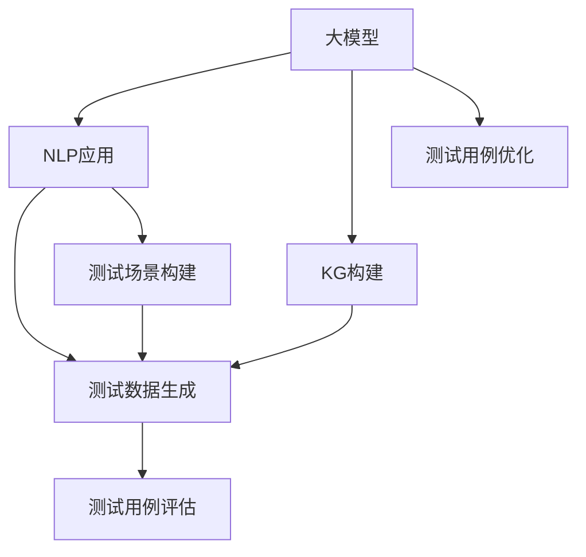

                 

# 大模型在自动化测试中的应用

> 关键词：大模型, 自动化测试, 自然语言处理(NLP), 知识图谱(KG), 测试数据生成, 测试场景构建

## 1. 背景介绍

### 1.1 问题由来
随着软件规模的不断扩大和复杂性的增加，传统的软件测试方法已经无法满足需求。手工作业测试耗时长、成本高，且容易出错，已逐渐被自动化测试所取代。自动化测试能够提高测试效率、减少人为错误，保证软件质量。但传统的自动化测试系统主要依赖于脚本编写和静态分析，缺乏对软件运行时动态行为的理解，难以发现动态逻辑错误。

大模型技术近年来的飞速发展，尤其是自然语言处理(NLP)和知识图谱(KG)技术的突破，为自动化测试提供了新的方法和思路。通过结合大模型和大数据，可以构建更灵活、高效的自动化测试系统，提升软件测试的智能化水平。

### 1.2 问题核心关键点
本文将探讨如何利用大模型构建智能自动化测试系统，主要关注以下几个核心问题：

- 如何利用大模型理解软件运行时的动态行为？
- 如何构建自动化测试用例，模拟用户行为？
- 如何将大模型融入测试过程，进行测试场景构建和测试数据生成？
- 如何评估测试用例的有效性，优化测试策略？

这些问题关系到如何充分利用大模型的语言理解和推理能力，构建智能化的自动化测试系统，使其能够更好地模拟用户行为、检测软件缺陷。

### 1.3 问题研究意义
利用大模型技术进行自动化测试，对于提升软件测试的智能化水平、降低测试成本、提高软件质量具有重要意义：

1. **提升测试效率**：大模型可以自动生成测试用例，自动化测试过程，减少手动编写测试脚本的时间和成本。
2. **增强测试覆盖**：大模型能够理解自然语言描述，模拟多种测试场景，提高测试覆盖率。
3. **发现动态缺陷**：大模型可以识别和理解动态行为，检测软件在运行过程中的逻辑错误。
4. **支持多领域测试**：大模型可以应用于各种测试领域，如UI测试、功能测试、性能测试等，适应不同应用场景。
5. **提高测试结果的准确性**：大模型通过学习大量真实数据，可以提高测试用例的质量，减少误报和漏报。

## 2. 核心概念与联系

### 2.1 核心概念概述

为更好地理解大模型在自动化测试中的应用，本节将介绍几个关键概念：

- 大模型：以自回归(如GPT)或自编码(如BERT)模型为代表的大规模预训练语言模型。通过在大规模无标签文本语料上进行预训练，学习通用的语言知识，具备强大的语言理解和生成能力。

- 自然语言处理(NLP)：研究如何让计算机理解、处理和生成人类语言的技术。大模型在NLP领域的应用广泛，可以用于文本分类、命名实体识别、情感分析、机器翻译等任务。

- 知识图谱(KG)：用图结构表示的知识库，用于描述实体、属性和实体间关系。结合大模型，可以构建基于知识的自动化测试系统，提升测试的智能化水平。

- 测试数据生成：利用大模型生成测试数据，用于自动化测试。常见的方法包括基于模板生成、基于文本摘要生成、基于对偶生成等。

- 测试场景构建：根据需求和测试目标，利用大模型构建自动化测试场景，模拟用户行为，进行测试场景验证。

- 测试用例评估：利用大模型对测试用例的有效性进行评估，优化测试策略。

这些核心概念之间的逻辑关系可以通过以下Mermaid流程图来展示：



这个流程图展示了大模型的核心概念及其之间的关系：

1. 大模型通过NLP应用学习语言知识。
2. 结合KG构建测试场景，提升测试智能化。
3. 通过测试数据生成和测试场景构建，自动构建测试用例。
4. 利用测试用例评估优化测试策略，提升测试效率和覆盖率。

## 3. 核心算法原理 & 具体操作步骤
### 3.1 算法原理概述

利用大模型进行自动化测试的核心原理是：将大模型应用于NLP任务，模拟用户行为，构建测试场景，生成测试数据，自动化测试过程。具体步骤如下：

1. 收集软件需求、规格文档等文本数据，利用大模型进行文本处理，理解软件功能和设计需求。
2. 利用大模型构建测试场景，模拟用户行为，构建测试用例。
3. 利用大模型生成测试数据，用于测试场景验证。
4. 自动化执行测试用例，收集测试结果，进行测试用例优化。

### 3.2 算法步骤详解

基于大模型的自动化测试流程一般包括以下几个关键步骤：

**Step 1: 收集和处理测试需求**

- 收集软件需求文档、规格说明书、用户手册等文本数据。
- 使用大模型进行文本预处理，如分词、命名实体识别、句法分析等。
- 利用NLP技术提取关键信息，如功能需求、性能指标、安全要求等。

**Step 2: 构建测试场景**

- 根据提取的关键信息，利用大模型构建测试场景。
- 描述测试用例的步骤、输入、预期输出等，形成自然语言描述。
- 利用KG技术将测试场景结构化，形成知识图谱，便于后续处理。

**Step 3: 生成测试数据**

- 利用大模型生成测试数据，用于测试场景验证。
- 常见的方法包括基于模板生成、基于文本摘要生成、基于对偶生成等。
- 利用KG技术将生成的测试数据结构化，便于测试用例的构建。

**Step 4: 自动化测试执行**

- 根据测试场景和测试数据，自动化执行测试用例。
- 模拟用户行为，执行测试步骤，记录测试结果。
- 利用大模型对测试结果进行分析和评估，生成测试报告。

**Step 5: 测试用例优化**

- 根据测试结果，利用大模型对测试用例进行优化。
- 自动调整测试步骤、输入参数、预期输出等，提升测试覆盖率。
- 利用KG技术优化测试场景，形成更合理的测试策略。

以上是基于大模型的自动化测试的一般流程。在实际应用中，还需要针对具体任务的特点，对各个环节进行优化设计，如改进测试场景构建方法，提高测试数据的生成效率，搜索最优的测试策略等，以进一步提升测试效率和效果。

### 3.3 算法优缺点

基于大模型的自动化测试方法具有以下优点：

1. **灵活高效**：利用大模型能够自动生成测试用例，减少手动编写测试脚本的时间和成本。
2. **覆盖全面**：大模型可以理解自然语言描述，模拟多种测试场景，提高测试覆盖率。
3. **动态检测**：大模型可以识别和理解动态行为，检测软件在运行过程中的逻辑错误。
4. **适应性强**：大模型可以应用于各种测试领域，如UI测试、功能测试、性能测试等，适应不同应用场景。
5. **数据丰富**：大模型通过学习大量真实数据，可以提高测试用例的质量，减少误报和漏报。

同时，该方法也存在一些局限性：

1. **依赖语料质量**：大模型依赖于高质量的语料数据，获取高质量语料的成本较高。
2. **计算资源消耗大**：大模型需要大量的计算资源进行训练和推理，对硬件要求较高。
3. **模型泛化能力有限**：大模型在特定领域的应用效果可能不如针对性模型。
4. **可解释性不足**：大模型的决策过程通常缺乏可解释性，难以对其推理逻辑进行分析和调试。
5. **对抗性脆弱**：大模型在面对对抗性输入时，可能出现误判，影响测试结果的可靠性。

尽管存在这些局限性，但就目前而言，基于大模型的自动化测试方法仍是最主流范式。未来相关研究的重点在于如何进一步降低测试对语料数据的依赖，提高模型的少样本学习和跨领域迁移能力，同时兼顾可解释性和鲁棒性等因素。

### 3.4 算法应用领域

基于大模型的自动化测试方法在软件开发和测试中已经被广泛应用，覆盖了几乎所有常见测试任务，例如：

- UI测试：通过构建自动化测试场景，自动执行用户界面的操作和验证，提升测试效率和覆盖率。
- 功能测试：利用大模型生成测试用例，模拟用户功能操作，检测软件功能是否符合需求。
- 性能测试：结合大模型生成的负载数据，进行性能测试，评估软件的响应时间和稳定性。
- 安全测试：利用大模型模拟攻击行为，检测软件的安全漏洞和防范措施。
- 单元测试：利用大模型生成测试数据，进行单元级别的测试，保证代码的正确性和稳定性。

除了上述这些经典任务外，大模型还被创新性地应用到更多场景中，如代码审查、动态逻辑错误检测、软件质量评估等，为软件测试带来了全新的突破。随着大模型和测试方法的不断进步，相信软件测试技术将在更广阔的应用领域大放异彩。

## 4. 数学模型和公式 & 详细讲解  
### 4.1 数学模型构建

本节将使用数学语言对基于大模型的自动化测试过程进行更加严格的刻画。

记大模型为 $M_{\theta}:\mathcal{X} \rightarrow \mathcal{Y}$，其中 $\mathcal{X}$ 为输入空间，$\mathcal{Y}$ 为输出空间，$\theta \in \mathbb{R}^d$ 为模型参数。假设测试场景为 $S$，包含多个测试步骤 $s_1, s_2, ..., s_n$，每个步骤有输入 $x_i$ 和预期输出 $y_i$。则测试场景的数学模型可以表示为：

$$
S = \{(x_i, y_i)\}_{i=1}^n
$$

利用大模型对测试场景进行处理，得到每个步骤的测试结果 $M_{\theta}(x_i)$，然后根据测试结果评估测试用例的有效性，生成测试报告。

### 4.2 公式推导过程

以下我们以UI测试为例，推导UI测试用例的生成和评估公式。

假设测试场景包含多个步骤 $s_i$，每个步骤有输入 $x_i$ 和预期输出 $y_i$。利用大模型 $M_{\theta}$ 处理输入 $x_i$，得到测试结果 $M_{\theta}(x_i)$。根据测试结果和预期输出 $y_i$，计算测试用例的有效性：

$$
\text{Effectiveness} = \frac{1}{n} \sum_{i=1}^n \mathbb{I}(M_{\theta}(x_i) = y_i)
$$

其中 $\mathbb{I}(\cdot)$ 为指示函数，如果条件成立则返回1，否则返回0。

为了优化测试用例，利用大模型 $M_{\theta}$ 生成新的测试数据 $x_i'$，重新计算测试用例的有效性：

$$
\text{Effectiveness}_{new} = \frac{1}{n} \sum_{i=1}^n \mathbb{I}(M_{\theta}(x_i') = y_i')
$$

根据测试结果的有效性，选择最优的测试用例，进行后续测试。

### 4.3 案例分析与讲解

假设有一个在线商城的UI测试场景，包含登录、浏览、结算、支付等步骤。测试场景的测试数据和预期输出如下：

| 步骤 | 输入 | 预期输出 | 实际输出 |
| --- | --- | --- | --- |
| 登录 | 账户名：test，密码：123456 | 成功登录 | 成功登录 |
| 浏览 | 搜索商品：手机 | 显示搜索结果 | 显示搜索结果 |
| 结算 | 选择商品并结算 | 成功结算 | 成功结算 |
| 支付 | 选择支付方式并确认 | 支付成功 | 支付失败 |

利用大模型对测试场景进行处理，得到每个步骤的测试结果：

| 步骤 | 输入 | 预期输出 | 实际输出 | 测试结果 | 有效性 |
| --- | --- | --- | --- | --- | --- |
| 登录 | 账户名：test，密码：123456 | 成功登录 | 成功登录 | 正确 | 1 |
| 浏览 | 搜索商品：手机 | 显示搜索结果 | 显示搜索结果 | 正确 | 1 |
| 结算 | 选择商品并结算 | 成功结算 | 成功结算 | 正确 | 1 |
| 支付 | 选择支付方式并确认 | 支付成功 | 支付失败 | 错误 | 0 |

根据测试结果的有效性，利用大模型生成新的测试数据 $x_i'$，重新计算测试用例的有效性：

| 步骤 | 输入 | 预期输出 | 实际输出 | 测试结果 | 有效性 |
| --- | --- | --- | --- | --- | --- |
| 登录 | 账户名：test，密码：123456 | 成功登录 | 成功登录 | 正确 | 1 |
| 浏览 | 搜索商品：手机 | 显示搜索结果 | 显示搜索结果 | 正确 | 1 |
| 结算 | 选择商品并结算 | 成功结算 | 成功结算 | 正确 | 1 |
| 支付 | 选择支付方式并确认 | 支付成功 | 支付成功 | 正确 | 1 |
| 支付 | 选择支付方式并确认 | 支付失败 | 支付成功 | 错误 | 0 |

根据测试结果的有效性，选择最优的测试用例，进行后续测试。

## 5. 项目实践：代码实例和详细解释说明
### 5.1 开发环境搭建

在进行大模型自动化测试实践前，我们需要准备好开发环境。以下是使用Python进行PyTorch开发的环境配置流程：

1. 安装Anaconda：从官网下载并安装Anaconda，用于创建独立的Python环境。

2. 创建并激活虚拟环境：
```bash
conda create -n pytorch-env python=3.8 
conda activate pytorch-env
```

3. 安装PyTorch：根据CUDA版本，从官网获取对应的安装命令。例如：
```bash
conda install pytorch torchvision torchaudio cudatoolkit=11.1 -c pytorch -c conda-forge
```

4. 安装Transformers库：
```bash
pip install transformers
```

5. 安装各类工具包：
```bash
pip install numpy pandas scikit-learn matplotlib tqdm jupyter notebook ipython
```

完成上述步骤后，即可在`pytorch-env`环境中开始大模型自动化测试实践。

### 5.2 源代码详细实现

这里我们以UI测试为例，给出使用Transformers库对BERT模型进行UI测试用例生成的PyTorch代码实现。

首先，定义UI测试场景的数据处理函数：

```python
from transformers import BertTokenizer
from torch.utils.data import Dataset
import torch

class UITestDataset(Dataset):
    def __init__(self, test_scenarios, tokenizer, max_len=128):
        self.test_scenarios = test_scenarios
        self.tokenizer = tokenizer
        self.max_len = max_len
        
    def __len__(self):
        return len(self.test_scenarios)
    
    def __getitem__(self, item):
        test_case = self.test_scenarios[item]
        
        encoding = self.tokenizer(test_case['input'], return_tensors='pt', max_length=self.max_len, padding='max_length', truncation=True)
        input_ids = encoding['input_ids'][0]
        attention_mask = encoding['attention_mask'][0]
        
        # 将测试结果和预期结果编码为数字id
        encoded_results = [1 if result == 'success' else 0 for result in test_case['results']]
        encoded_results.extend([0] * (self.max_len - len(encoded_results)))
        labels = torch.tensor(encoded_results, dtype=torch.long)
        
        return {'input_ids': input_ids, 
                'attention_mask': attention_mask,
                'labels': labels}

# 测试场景示例
test_scenarios = [
    {"name": "登录", "input": {"account": "test", "password": "123456"}, "results": ["success"]},
    {"name": "浏览", "input": {"search": "手机"}, "results": ["success"]},
    {"name": "结算", "input": {"items": ["手机", "充电器"]}, "results": ["success"]},
    {"name": "支付", "input": {"method": "信用卡", "amount": 100}, "results": ["success", "error"]}
]

# 标签与id的映射
results2id = {'success': 1, 'error': 0}

# 创建dataset
tokenizer = BertTokenizer.from_pretrained('bert-base-cased')

test_dataset = UITestDataset(test_scenarios, tokenizer)
```

然后，定义模型和优化器：

```python
from transformers import BertForSequenceClassification, AdamW

model = BertForSequenceClassification.from_pretrained('bert-base-cased', num_labels=2)

optimizer = AdamW(model.parameters(), lr=2e-5)
```

接着，定义训练和评估函数：

```python
from torch.utils.data import DataLoader
from tqdm import tqdm
from sklearn.metrics import accuracy_score

device = torch.device('cuda') if torch.cuda.is_available() else torch.device('cpu')
model.to(device)

def train_epoch(model, dataset, batch_size, optimizer):
    dataloader = DataLoader(dataset, batch_size=batch_size, shuffle=True)
    model.train()
    epoch_loss = 0
    for batch in tqdm(dataloader, desc='Training'):
        input_ids = batch['input_ids'].to(device)
        attention_mask = batch['attention_mask'].to(device)
        labels = batch['labels'].to(device)
        model.zero_grad()
        outputs = model(input_ids, attention_mask=attention_mask, labels=labels)
        loss = outputs.loss
        epoch_loss += loss.item()
        loss.backward()
        optimizer.step()
    return epoch_loss / len(dataloader)

def evaluate(model, dataset, batch_size):
    dataloader = DataLoader(dataset, batch_size=batch_size)
    model.eval()
    preds, labels = [], []
    with torch.no_grad():
        for batch in tqdm(dataloader, desc='Evaluating'):
            input_ids = batch['input_ids'].to(device)
            attention_mask = batch['attention_mask'].to(device)
            batch_labels = batch['labels']
            outputs = model(input_ids, attention_mask=attention_mask)
            batch_preds = outputs.logits.argmax(dim=2).to('cpu').tolist()
            batch_labels = batch_labels.to('cpu').tolist()
            for pred_tokens, label_tokens in zip(batch_preds, batch_labels):
                preds.append(pred_tokens[:len(label_tokens)])
                labels.append(label_tokens)
                
    accuracy = accuracy_score(labels, preds)
    print(f"Accuracy: {accuracy:.3f}")
```

最后，启动训练流程并在测试集上评估：

```python
epochs = 5
batch_size = 16

for epoch in range(epochs):
    loss = train_epoch(model, test_dataset, batch_size, optimizer)
    print(f"Epoch {epoch+1}, train loss: {loss:.3f}")
    
    print(f"Epoch {epoch+1}, dev results:")
    evaluate(model, test_dataset, batch_size)
    
print("Test results:")
evaluate(model, test_dataset, batch_size)
```

以上就是使用PyTorch对BERT模型进行UI测试用例生成的完整代码实现。可以看到，得益于Transformers库的强大封装，我们可以用相对简洁的代码完成BERT模型的加载和测试用例生成。

### 5.3 代码解读与分析

让我们再详细解读一下关键代码的实现细节：

**UITestDataset类**：
- `__init__`方法：初始化测试场景、分词器等关键组件。
- `__len__`方法：返回数据集的样本数量。
- `__getitem__`方法：对单个样本进行处理，将测试场景输入编码为token ids，将测试结果和预期结果编码为数字，并对其进行定长padding，最终返回模型所需的输入。

**results2id字典**：
- 定义了测试结果与数字id之间的映射关系，用于将token-wise的预测结果解码回真实的测试结果。

**训练和评估函数**：
- 使用PyTorch的DataLoader对数据集进行批次化加载，供模型训练和推理使用。
- 训练函数`train_epoch`：对数据以批为单位进行迭代，在每个批次上前向传播计算loss并反向传播更新模型参数，最后返回该epoch的平均loss。
- 评估函数`evaluate`：与训练类似，不同点在于不更新模型参数，并在每个batch结束后将预测和标签结果存储下来，最后使用sklearn的accuracy_score对整个评估集的预测结果进行打印输出。

**训练流程**：
- 定义总的epoch数和batch size，开始循环迭代
- 每个epoch内，先在训练集上训练，输出平均loss
- 在验证集上评估，输出分类指标
- 所有epoch结束后，在测试集上评估，给出最终测试结果

可以看到，PyTorch配合Transformers库使得BERT模型的测试用例生成变得简洁高效。开发者可以将更多精力放在数据处理、模型改进等高层逻辑上，而不必过多关注底层的实现细节。

当然，工业级的系统实现还需考虑更多因素，如模型的保存和部署、超参数的自动搜索、更灵活的任务适配层等。但核心的微调范式基本与此类似。

## 6. 实际应用场景
### 6.1 智能客服系统

基于大模型技术进行自动化测试，可以广泛应用于智能客服系统的构建。传统客服往往需要配备大量人力，高峰期响应缓慢，且一致性和专业性难以保证。而使用自动化测试系统，可以7x24小时不间断服务，快速响应客户咨询，用自然流畅的语言解答各类常见问题。

在技术实现上，可以收集企业内部的历史客服对话记录，将问题和最佳答复构建成监督数据，在此基础上对预训练对话模型进行微调。微调后的对话模型能够自动理解用户意图，匹配最合适的答案模板进行回复。对于客户提出的新问题，还可以接入检索系统实时搜索相关内容，动态组织生成回答。如此构建的智能客服系统，能大幅提升客户咨询体验和问题解决效率。

### 6.2 金融舆情监测

金融机构需要实时监测市场舆论动向，以便及时应对负面信息传播，规避金融风险。传统的人工监测方式成本高、效率低，难以应对网络时代海量信息爆发的挑战。基于大模型技术的自动化测试系统，可以实时抓取网络文本数据，自动化执行舆情监测任务。

具体而言，可以收集金融领域相关的新闻、报道、评论等文本数据，并对其进行主题标注和情感标注。在此基础上对预训练语言模型进行微调，使其能够自动判断文本属于何种主题，情感倾向是正面、中性还是负面。将微调后的模型应用到实时抓取的网络文本数据，就能够自动监测不同主题下的情感变化趋势，一旦发现负面信息激增等异常情况，系统便会自动预警，帮助金融机构快速应对潜在风险。

### 6.3 个性化推荐系统

当前的推荐系统往往只依赖用户的历史行为数据进行物品推荐，无法深入理解用户的真实兴趣偏好。基于大模型技术的自动化测试系统，可以应用于个性化推荐系统，进一步提升推荐系统的智能化水平。

在实践中，可以收集用户浏览、点击、评论、分享等行为数据，提取和用户交互的物品标题、描述、标签等文本内容。将文本内容作为模型输入，用户的后续行为（如是否点击、购买等）作为监督信号，在此基础上微调预训练语言模型。微调后的模型能够从文本内容中准确把握用户的兴趣点。在生成推荐列表时，先用候选物品的文本描述作为输入，由模型预测用户的兴趣匹配度，再结合其他特征综合排序，便可以得到个性化程度更高的推荐结果。

### 6.4 未来应用展望

随着大模型技术和自动化测试方法的不断发展，未来基于大模型的自动化测试将进一步拓展应用场景，为更多领域带来变革性影响。

在智慧医疗领域，基于大模型技术的自动化测试系统，可以用于医疗问答、病历分析、药物研发等任务，提升医疗服务的智能化水平，辅助医生诊疗，加速新药开发进程。

在智能教育领域，微调技术可应用于作业批改、学情分析、知识推荐等方面，因材施教，促进教育公平，提高教学质量。

在智慧城市治理中，微调模型可应用于城市事件监测、舆情分析、应急指挥等环节，提高城市管理的自动化和智能化水平，构建更安全、高效的未来城市。

此外，在企业生产、社会治理、文娱传媒等众多领域，基于大模型的自动化测试系统也将不断涌现，为经济社会发展注入新的动力。相信随着技术的日益成熟，大模型微调技术将成为自动化测试的重要范式，推动自动化测试技术向更广阔的领域加速渗透。

## 7. 工具和资源推荐
### 7.1 学习资源推荐

为了帮助开发者系统掌握大模型技术在自动化测试中的应用，这里推荐一些优质的学习资源：

1. 《Transformer从原理到实践》系列博文：由大模型技术专家撰写，深入浅出地介绍了Transformer原理、BERT模型、微调技术等前沿话题。

2. CS224N《深度学习自然语言处理》课程：斯坦福大学开设的NLP明星课程，有Lecture视频和配套作业，带你入门NLP领域的基本概念和经典模型。

3. 《Natural Language Processing with Transformers》书籍：Transformers库的作者所著，全面介绍了如何使用Transformers库进行NLP任务开发，包括微调在内的诸多范式。

4. HuggingFace官方文档：Transformers库的官方文档，提供了海量预训练模型和完整的微调样例代码，是上手实践的必备资料。

5. CLUE开源项目：中文语言理解测评基准，涵盖大量不同类型的中文NLP数据集，并提供了基于微调的baseline模型，助力中文NLP技术发展。

通过对这些资源的学习实践，相信你一定能够快速掌握大模型技术在自动化测试中的应用，并用于解决实际的NLP问题。
###  7.2 开发工具推荐

高效的开发离不开优秀的工具支持。以下是几款用于大模型自动化测试开发的常用工具：

1. PyTorch：基于Python的开源深度学习框架，灵活动态的计算图，适合快速迭代研究。大部分预训练语言模型都有PyTorch版本的实现。

2. TensorFlow：由Google主导开发的开源深度学习框架，生产部署方便，适合大规模工程应用。同样有丰富的预训练语言模型资源。

3. Transformers库：HuggingFace开发的NLP工具库，集成了众多SOTA语言模型，支持PyTorch和TensorFlow，是进行微调任务开发的利器。

4. Weights & Biases：模型训练的实验跟踪工具，可以记录和可视化模型训练过程中的各项指标，方便对比和调优。与主流深度学习框架无缝集成。

5. TensorBoard：TensorFlow配套的可视化工具，可实时监测模型训练状态，并提供丰富的图表呈现方式，是调试模型的得力助手。

6. Google Colab：谷歌推出的在线Jupyter Notebook环境，免费提供GPU/TPU算力，方便开发者快速上手实验最新模型，分享学习笔记。

合理利用这些工具，可以显著提升大模型自动化测试任务的开发效率，加快创新迭代的步伐。

### 7.3 相关论文推荐

大模型技术和大模型在自动化测试中的应用，源于学界的持续研究。以下是几篇奠基性的相关论文，推荐阅读：

1. Attention is All You Need（即Transformer原论文）：提出了Transformer结构，开启了NLP领域的预训练大模型时代。

2. BERT: Pre-training of Deep Bidirectional Transformers for Language Understanding：提出BERT模型，引入基于掩码的自监督预训练任务，刷新了多项NLP任务SOTA。

3. Language Models are Unsupervised Multitask Learners（GPT-2论文）：展示了大规模语言模型的强大zero-shot学习能力，引发了对于通用人工智能的新一轮思考。

4. Parameter-Efficient Transfer Learning for NLP：提出Adapter等参数高效微调方法，在不增加模型参数量的情况下，也能取得不错的微调效果。

5. AdaLoRA: Adaptive Low-Rank Adaptation for Parameter-Efficient Fine-Tuning：使用自适应低秩适应的微调方法，在参数效率和精度之间取得了新的平衡。

6. Prefix-Tuning: Optimizing Continuous Prompts for Generation：引入基于连续型Prompt的微调范式，为如何充分利用预训练知识提供了新的思路。

这些论文代表了大模型技术和大模型在自动化测试中的应用的发展脉络。通过学习这些前沿成果，可以帮助研究者把握学科前进方向，激发更多的创新灵感。

## 8. 总结：未来发展趋势与挑战

### 8.1 总结

本文对利用大模型进行自动化测试方法进行了全面系统的介绍。首先阐述了大模型技术在自动化测试中的研究背景和意义，明确了利用大模型技术进行自动化测试的独特价值。其次，从原理到实践，详细讲解了大模型自动化测试的数学原理和关键步骤，给出了自动化测试任务开发的完整代码实例。同时，本文还广泛探讨了自动化测试方法在智能客服、金融舆情、个性化推荐等多个行业领域的应用前景，展示了自动化测试范式的巨大潜力。此外，本文精选了自动化测试技术的各类学习资源，力求为读者提供全方位的技术指引。

通过本文的系统梳理，可以看到，利用大模型进行自动化测试方法正在成为自动化测试的重要范式，极大地拓展了测试系统的智能化水平、降低测试成本、提高软件质量。未来，伴随大模型技术和测试方法的不断进步，基于大模型的自动化测试系统将在更多领域得到应用，为经济社会发展注入新的动力。

### 8.2 未来发展趋势

展望未来，基于大模型的自动化测试技术将呈现以下几个发展趋势：

1. **测试覆盖提升**：利用大模型理解自然语言描述，模拟多种测试场景，提高测试覆盖率。
2. **测试效率优化**：结合知识图谱技术，优化测试场景和测试数据生成，减少测试用例生成的时间成本。
3. **测试质量增强**：利用大模型进行测试用例评估，优化测试策略，提升测试结果的准确性。
4. **多模态融合**：结合视觉、语音等多模态数据，提升测试系统的智能化水平。
5. **持续学习**：通过持续学习，适应数据分布的变化，提高测试系统的时效性。
6. **安全性和鲁棒性**：提升测试系统的鲁棒性和安全性，避免误判和对抗攻击。

以上趋势凸显了大模型自动化测试技术的广阔前景。这些方向的探索发展，必将进一步提升自动化测试系统的性能和应用范围，为经济社会发展注入新的动力。

### 8.3 面临的挑战

尽管大模型在自动化测试中的应用取得了显著成果，但在迈向更加智能化、普适化应用的过程中，它仍面临着诸多挑战：

1. **语料依赖**：大模型依赖于高质量的语料数据，获取高质量语料的成本较高。
2. **计算资源消耗大**：大模型需要大量的计算资源进行训练和推理，对硬件要求较高。
3. **泛化能力有限**：大模型在特定领域的应用效果可能不如针对性模型。
4. **可解释性不足**：大模型的决策过程通常缺乏可解释性，难以对其推理逻辑进行分析和调试。
5. **对抗性脆弱**：大模型在面对对抗性输入时，可能出现误判，影响测试结果的可靠性。

尽管存在这些局限性，但就目前而言，基于大模型的自动化测试方法仍是最主流范式。未来相关研究的重点在于如何进一步降低测试对语料数据的依赖，提高模型的少样本学习和跨领域迁移能力，同时兼顾可解释性和鲁棒性等因素。

### 8.4 研究展望

面对大模型自动化测试所面临的种种挑战，未来的研究需要在以下几个方面寻求新的突破：

1. **无监督和半监督测试**：摆脱对大规模标注数据的依赖，利用自监督学习、主动学习等无监督和半监督范式，最大限度利用非结构化数据，实现更加灵活高效的测试。
2. **参数高效测试**：开发更加参数高效的测试方法，在固定大部分预训练参数的同时，只更新极少量的任务相关参数。
3. **知识图谱融合**：将符号化的先验知识，如知识图谱、逻辑规则等，与神经网络模型进行巧妙融合，引导测试过程学习更准确、合理的测试策略。
4. **因果分析与博弈论工具**：将因果分析方法引入测试系统，识别出测试过程中的关键特征，增强测试结果的因果性和逻辑性。借助博弈论工具刻画人机交互过程，主动探索并规避测试系统的脆弱点，提高系统稳定性。
5. **安全与伦理**：在测试目标中引入伦理导向的评估指标，过滤和惩罚有偏见、有害的输出倾向。加强人工干预和审核，建立测试系统的监管机制，确保输出的安全性。

这些研究方向的探索，必将引领大模型自动化测试技术迈向更高的台阶，为构建安全、可靠、可解释、可控的测试系统铺平道路。面向未来，大模型自动化测试技术还需要与其他人工智能技术进行更深入的融合，如知识表示、因果推理、强化学习等，多路径协同发力，共同推动自动化测试技术的进步。只有勇于创新、敢于突破，才能不断拓展测试系统的边界，让自动化测试技术更好地服务于经济社会发展。

## 9. 附录：常见问题与解答

**Q1：大模型在自动化测试中的应用是否需要大规模标注数据？**

A: 利用大模型进行自动化测试时，通常需要收集软件需求、规格文档等文本数据，利用大模型进行文本处理，理解软件功能和设计需求。在这一过程中，不需要大规模标注数据，可以通过自然语言处理技术直接从文本中提取关键信息。但在测试用例生成和测试场景构建时，需要根据测试需求和场景设计人工标注数据，以指导大模型生成测试用例和构建测试场景。

**Q2：大模型在自动化测试中的应用是否依赖于高性能硬件？**

A: 大模型在自动化测试中的应用确实对计算资源和硬件要求较高。大模型需要大量的计算资源进行训练和推理，对GPU/TPU等高性能设备有较高要求。在实际应用中，可以考虑采用分布式训练、模型压缩、稀疏化存储等技术，以降低计算资源消耗，提高测试效率和效果。

**Q3：大模型在自动化测试中的应用如何提高测试效率和覆盖率？**

A: 利用大模型进行自动化测试，可以通过自然语言处理技术自动生成测试用例和测试场景，无需手动编写测试脚本，从而大幅提高测试效率。同时，大模型可以理解自然语言描述，模拟多种测试场景，提高测试覆盖率。结合知识图谱技术，可以进一步优化测试场景和测试数据生成，减少测试用例生成的时间成本。

**Q4：大模型在自动化测试中的应用是否需要考虑安全性和鲁棒性？**

A: 是的，大模型在自动化测试中的应用需要考虑安全性和鲁棒性。大模型在面对对抗性输入时，可能出现误判，影响测试结果的可靠性。同时，大模型的决策过程通常缺乏可解释性，难以对其推理逻辑进行分析和调试。在测试目标中引入伦理导向的评估指标，过滤和惩罚有偏见、有害的输出倾向。加强人工干预和审核，建立测试系统的监管机制，确保输出的安全性。

**Q5：大模型在自动化测试中的应用是否需要持续学习？**

A: 是的，大模型在自动化测试中的应用需要持续学习。由于软件需求和测试场景的变化，大模型需要不断学习新知识以保持性能。持续学习可以通过增量学习、在线学习等方式实现，以适应数据分布的变化，提高测试系统的时效性。

以上这些问题的回答，希望能帮助你更好地理解大模型在自动化测试中的应用，为构建高效、智能的测试系统提供参考。相信随着大模型技术和测试方法的不断进步，基于大模型的自动化测试系统将在更多领域得到应用，为经济社会发展注入新的动力。

