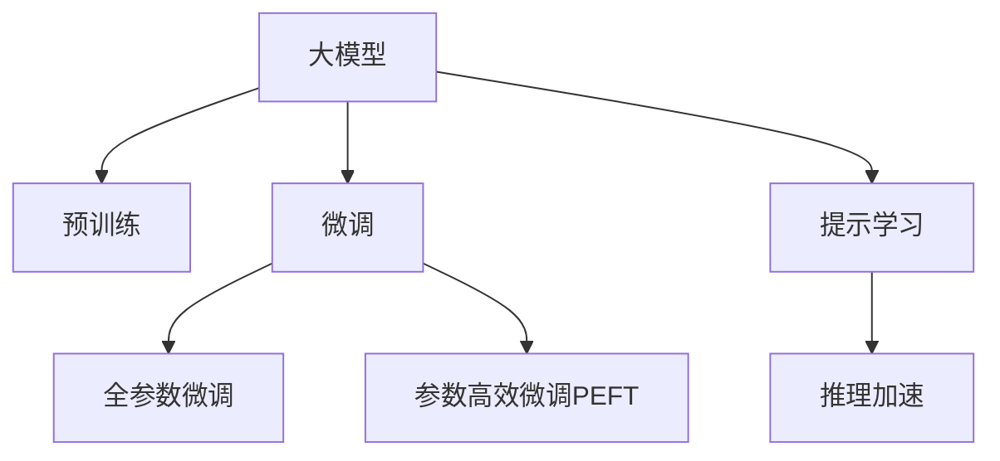

                 

# 大模型在视频处理的进展

> 关键词：大模型,视频处理,计算机视觉,深度学习,卷积神经网络(CNN),Transformer,模型压缩,边缘计算

## 1. 背景介绍

### 1.1 问题由来
视频处理技术近年来在影视制作、监控安防、无人驾驶、视频会议等领域得到了广泛应用。然而，传统的视频处理技术如H.264、H.265等编解码算法，面临着计算复杂度高、内存占用大等问题，无法满足高实时性、大规模视频处理的需求。而基于大模型的视频处理技术，通过使用预训练语言模型对视频信号进行编码和理解，能够大大提升视频处理的效率和质量。

### 1.2 问题核心关键点
目前，基于大模型的视频处理技术正逐渐成为视频处理领域的趋势。其核心关键点包括：
- 大模型的预训练：通过在大规模无标签视频数据上训练大模型，学习到视频特征的通用表示。
- 微调与迁移学习：在预训练模型的基础上，通过微调或迁移学习的方式，使其具备特定任务的视频处理能力。
- 参数高效微调：通过固定大部分预训练参数，仅微调少量任务相关的参数，提升微调效率。
- 提示学习：通过在输入中引入提示模板，引导大模型进行特定任务的视频处理，减少微调参数。
- 推理加速：通过模型压缩、边缘计算等技术，提升大模型推理的速度和效率。

### 1.3 问题研究意义
研究大模型在视频处理的应用，对于推动视频处理技术的发展，提升视频处理系统的实时性和准确性，具有重要意义：

1. 降低视频处理成本。基于大模型的视频处理，可以显著减少对人力的依赖，降低视频处理成本。
2. 提升视频处理性能。大模型可以更好地理解视频内容，实现更准确、更高效的视频处理。
3. 加速技术迭代。利用大模型的通用表示，可以快速实现视频处理的创新。
4. 拓展应用范围。大模型技术可以应用于更多的视频处理任务，提升视频处理的普适性。
5. 赋能行业转型。视频处理技术的进步，将推动影视制作、安防监控等行业数字化转型。

## 2. 核心概念与联系

### 2.1 核心概念概述

为更好地理解基于大模型的视频处理技术，本节将介绍几个密切相关的核心概念：

- 大模型(Large Model)：以自回归或自编码模型为代表的大规模预训练模型。通过在大规模无标签数据上训练，学习到数据的通用表示，具备强大的特征提取能力。
- 预训练(Pre-training)：指在大规模无标签数据上，通过自监督学习任务训练模型的过程。常见的预训练任务包括自回归预测、掩码预测等。
- 微调(Fine-tuning)：指在预训练模型的基础上，使用任务特定的数据进行有监督学习，优化模型在特定任务上的性能。
- 迁移学习(Transfer Learning)：指将一个领域学到的知识，迁移应用到另一个不同但相关的领域。大模型的预训练-微调过程即是一种典型的迁移学习方式。
- 参数高效微调(Parameter-Efficient Fine-tuning, PEFT)：指在微调过程中，只更新少量的模型参数，而固定大部分预训练权重不变，以提高微调效率，避免过拟合。
- 提示学习(Prompt Learning)：通过在输入中引入提示模板，引导大模型进行特定任务的视频处理，减少微调参数。
- 推理加速：通过模型压缩、边缘计算等技术，提升大模型的推理速度和效率。

这些核心概念之间的逻辑关系可以通过以下Mermaid流程图来展示：



这个流程图展示了大模型的核心概念及其之间的关系：

1. 大模型通过预训练获得基础能力。
2. 微调是对预训练模型进行任务特定的优化，可以分为全参数微调和参数高效微调。
3. 提示学习是一种不更新模型参数的方法，可以实现少样本学习和零样本学习。
4. 推理加速通过优化模型结构和计算方式，提升大模型的推理速度。

这些概念共同构成了大模型在视频处理中的应用框架，使其能够在各种场景下发挥强大的特征提取和理解能力。通过理解这些核心概念，我们可以更好地把握大模型在视频处理中的应用原理和优化方向。

## 3. 核心算法原理 & 具体操作步骤
### 3.1 算法原理概述

基于大模型的视频处理技术，本质上是一个有监督的细粒度迁移学习过程。其核心思想是：将预训练的大模型视作一个强大的"特征提取器"，通过在特定任务的视频数据上进行有监督的微调，使得模型输出能够匹配任务标签，从而获得针对特定任务的视频处理能力。

形式化地，假设预训练视频模型为 $M_{\theta}$，其中 $\theta$ 为预训练得到的模型参数。给定视频处理任务 $T$ 的训练集 $D=\{(x_i,y_i)\}_{i=1}^N$，其中 $x_i$ 表示视频序列，$y_i$ 表示任务标签。微调的目标是找到新的模型参数 $\hat{\theta}$，使得：

$$
\hat{\theta}=\mathop{\arg\min}_{\theta} \mathcal{L}(M_{\theta},D)
$$

其中 $\mathcal{L}$ 为针对任务 $T$ 设计的损失函数，用于衡量模型预测输出与真实标签之间的差异。常见的损失函数包括交叉熵损失、均方误差损失等。

通过梯度下降等优化算法，微调过程不断更新模型参数 $\theta$，最小化损失函数 $\mathcal{L}$，使得模型输出逼近真实标签。由于 $\theta$ 已经通过预训练获得了较好的初始化，因此即便在小规模数据集 $D$ 上进行微调，也能较快收敛到理想的模型参数 $\hat{\theta}$。

### 3.2 算法步骤详解

基于大模型的视频处理微调一般包括以下几个关键步骤：

**Step 1: 准备预训练模型和数据集**
- 选择合适的预训练视频模型 $M_{\theta}$ 作为初始化参数，如 ResNet、Inception等。
- 准备视频处理任务 $T$ 的训练集 $D$，划分为训练集、验证集和测试集。一般要求训练数据与预训练数据的分布不要差异过大。

**Step 2: 添加任务适配层**
- 根据视频处理任务类型，在预训练模型顶层设计合适的输出层和损失函数。
- 对于分类任务，通常在顶层添加线性分类器和交叉熵损失函数。
- 对于生成任务，通常使用视频生成器输出概率分布，并以负对数似然为损失函数。

**Step 3: 设置微调超参数**
- 选择合适的优化算法及其参数，如 AdamW、SGD 等，设置学习率、批大小、迭代轮数等。
- 设置正则化技术及强度，包括权重衰减、Dropout、Early Stopping等。
- 确定冻结预训练参数的策略，如仅微调顶层，或全部参数都参与微调。

**Step 4: 执行梯度训练**
- 将训练集数据分批次输入模型，前向传播计算损失函数。
- 反向传播计算参数梯度，根据设定的优化算法和学习率更新模型参数。
- 周期性在验证集上评估模型性能，根据性能指标决定是否触发 Early Stopping。
- 重复上述步骤直到满足预设的迭代轮数或 Early Stopping 条件。

**Step 5: 测试和部署**
- 在测试集上评估微调后模型 $M_{\hat{\theta}}$ 的性能，对比微调前后的精度提升。
- 使用微调后的模型对新视频序列进行推理预测，集成到实际的应用系统中。
- 持续收集新的视频数据，定期重新微调模型，以适应数据分布的变化。

以上是基于大模型的视频处理微调的一般流程。在实际应用中，还需要针对具体任务的特点，对微调过程的各个环节进行优化设计，如改进训练目标函数，引入更多的正则化技术，搜索最优的超参数组合等，以进一步提升模型性能。

### 3.3 算法优缺点

基于大模型的视频处理微调方法具有以下优点：
1. 简单高效。只需准备少量标注数据，即可对预训练模型进行快速适配，获得较大的性能提升。
2. 通用适用。适用于各种视频处理下游任务，包括分类、匹配、生成等，设计简单的任务适配层即可实现微调。
3. 参数高效。利用参数高效微调技术，在固定大部分预训练参数的情况下，仍可取得不错的提升。
4. 效果显著。在学术界和工业界的诸多视频处理任务上，基于微调的方法已经刷新了最先进的性能指标。

同时，该方法也存在一定的局限性：
1. 依赖标注数据。微调的效果很大程度上取决于标注数据的质量和数量，获取高质量标注数据的成本较高。
2. 迁移能力有限。当目标任务与预训练数据的分布差异较大时，微调的性能提升有限。
3. 负面效果传递。预训练模型的固有偏见、有害信息等，可能通过微调传递到下游任务，造成负面影响。
4. 可解释性不足。微调模型的决策过程通常缺乏可解释性，难以对其推理逻辑进行分析和调试。

尽管存在这些局限性，但就目前而言，基于大模型的微调方法仍是最主流的视频处理范式。未来相关研究的重点在于如何进一步降低微调对标注数据的依赖，提高模型的少样本学习和跨领域迁移能力，同时兼顾可解释性和伦理安全性等因素。

### 3.4 算法应用领域

基于大模型的视频处理微调技术，已经在视频分类、目标检测、视频生成、视频摘要、行为识别等多个领域得到了广泛应用，成为了视频处理领域的重要技术手段。

1. 视频分类：将视频序列分类到不同的预定义类别中。通过微调，使模型学习视频序列与类别之间的映射关系。
2. 目标检测：在视频序列中检测并定位出特定目标。通过微调，使模型学习目标的特征表示和检测规则。
3. 视频生成：生成具有特定风格或内容的视频序列。通过微调，使模型学习视频序列的生成规则和风格特征。
4. 视频摘要：从视频序列中提取关键帧或关键片段，生成简洁的视频摘要。通过微调，使模型学习视频内容的压缩策略和摘要生成规则。
5. 行为识别：识别视频序列中的行为模式。通过微调，使模型学习行为特征和行为分类规则。

除了上述这些经典任务外，大模型微调技术还被创新性地应用到更多场景中，如视频检索、视频增强、视频标注等，为视频处理技术带来了新的突破。

## 4. 数学模型和公式 & 详细讲解 & 举例说明
### 4.1 数学模型构建

本节将使用数学语言对基于大模型的视频处理微调过程进行更加严格的刻画。

记预训练视频模型为 $M_{\theta}$，其中 $\theta$ 为预训练得到的模型参数。假设微调任务为 $T$，训练集为 $D=\{(x_i,y_i)\}_{i=1}^N, x_i \in \mathcal{X}, y_i \in \mathcal{Y}$。

定义模型 $M_{\theta}$ 在输入 $x$ 上的输出为 $M_{\theta}(x)$，其中 $\mathcal{X}$ 为输入空间，$\mathcal{Y}$ 为输出空间。定义任务 $T$ 对应的损失函数为 $\ell(y,M_{\theta}(x))$，用于衡量模型预测输出与真实标签之间的差异。则在数据集 $D$ 上的经验风险为：

$$
\mathcal{L}(\theta) = \frac{1}{N} \sum_{i=1}^N \ell(y_i,M_{\theta}(x_i))
$$

微调的优化目标是最小化经验风险，即找到最优参数：

$$
\theta^* = \mathop{\arg\min}_{\theta} \mathcal{L}(\theta)
$$

在实践中，我们通常使用基于梯度的优化算法（如SGD、Adam等）来近似求解上述最优化问题。设 $\eta$ 为学习率，$\lambda$ 为正则化系数，则参数的更新公式为：

$$
\theta \leftarrow \theta - \eta \nabla_{\theta}\mathcal{L}(\theta) - \eta\lambda\theta
$$

其中 $\nabla_{\theta}\mathcal{L}(\theta)$ 为损失函数对参数 $\theta$ 的梯度，可通过反向传播算法高效计算。

### 4.2 公式推导过程

以下我们以视频分类任务为例，推导交叉熵损失函数及其梯度的计算公式。

假设模型 $M_{\theta}$ 在输入 $x$ 上的输出为 $M_{\theta}(x) \in \mathbb{R}^k$，其中 $k$ 为类别数。真实标签 $y \in \{1,2,...,k\}$。则二分类交叉熵损失函数定义为：

$$
\ell(y,M_{\theta}(x)) = -\frac{1}{N}\sum_{i=1}^N [y_i\log M_{\theta}(x_i)+(1-y_i)\log(1-M_{\theta}(x_i))]
$$

将其代入经验风险公式，得：

$$
\mathcal{L}(\theta) = -\frac{1}{N}\sum_{i=1}^N [y_i\log M_{\theta}(x_i)+(1-y_i)\log(1-M_{\theta}(x_i))]
$$

根据链式法则，损失函数对参数 $\theta_k$ 的梯度为：

$$
\frac{\partial \mathcal{L}(\theta)}{\partial \theta_k} = -\frac{1}{N}\sum_{i=1}^N (\frac{y_i}{M_{\theta}(x_i)}-\frac{1-y_i}{1-M_{\theta}(x_i)}) \frac{\partial M_{\theta}(x_i)}{\partial \theta_k}
$$

其中 $\frac{\partial M_{\theta}(x_i)}{\partial \theta_k}$ 可进一步递归展开，利用自动微分技术完成计算。

在得到损失函数的梯度后，即可带入参数更新公式，完成模型的迭代优化。重复上述过程直至收敛，最终得到适应视频分类任务的最优模型参数 $\theta^*$。

## 5. 项目实践：代码实例和详细解释说明
### 5.1 开发环境搭建

在进行视频处理微调实践前，我们需要准备好开发环境。以下是使用Python进行PyTorch开发的环境配置流程：

1. 安装Anaconda：从官网下载并安装Anaconda，用于创建独立的Python环境。

2. 创建并激活虚拟环境：
```bash
conda create -n pytorch-env python=3.8 
conda activate pytorch-env
```

3. 安装PyTorch：根据CUDA版本，从官网获取对应的安装命令。例如：
```bash
conda install pytorch torchvision torchaudio cudatoolkit=11.1 -c pytorch -c conda-forge
```

4. 安装TensorFlow：从官网下载并安装TensorFlow。例如：
```bash
pip install tensorflow
```

5. 安装各类工具包：
```bash
pip install numpy pandas scikit-learn matplotlib tqdm jupyter notebook ipython
```

完成上述步骤后，即可在`pytorch-env`环境中开始微调实践。

### 5.2 源代码详细实现

下面我们以视频分类任务为例，给出使用PyTorch对ResNet模型进行微调的PyTorch代码实现。

首先，定义视频分类任务的数据处理函数：

```python
from torch.utils.data import Dataset, DataLoader
import torch
from transformers import AutoTokenizer, AutoModelForSequenceClassification

class VideoDataset(Dataset):
    def __init__(self, videos, labels, tokenizer, max_len=16):
        self.videos = videos
        self.labels = labels
        self.tokenizer = tokenizer
        self.max_len = max_len
        
    def __len__(self):
        return len(self.videos)
    
    def __getitem__(self, item):
        video = self.videos[item]
        label = self.labels[item]
        
        encoding = self.tokenizer(video, return_tensors='pt', max_length=self.max_len, padding='max_length', truncation=True)
        input_ids = encoding['input_ids'][0]
        attention_mask = encoding['attention_mask'][0]
        
        # 对标签进行编码
        encoded_label = [int(label)]
        encoded_label.extend([0]*(self.max_len - len(encoded_label)))
        labels = torch.tensor(encoded_label, dtype=torch.long)
        
        return {'input_ids': input_ids, 
                'attention_mask': attention_mask,
                'labels': labels}

# 定义预训练模型和微调模型
model = AutoModelForSequenceClassification.from_pretrained('resnet34', num_labels=10)
tokenizer = AutoTokenizer.from_pretrained('resnet34')
```

然后，定义模型和优化器：

```python
from transformers import AdamW

model.to(device)
optimizer = AdamW(model.parameters(), lr=2e-5)
```

接着，定义训练和评估函数：

```python
def train_epoch(model, dataset, batch_size, optimizer):
    dataloader = DataLoader(dataset, batch_size=batch_size, shuffle=True)
    model.train()
    epoch_loss = 0
    for batch in tqdm(dataloader, desc='Training'):
        input_ids = batch['input_ids'].to(device)
        attention_mask = batch['attention_mask'].to(device)
        labels = batch['labels'].to(device)
        model.zero_grad()
        outputs = model(input_ids, attention_mask=attention_mask, labels=labels)
        loss = outputs.loss
        epoch_loss += loss.item()
        loss.backward()
        optimizer.step()
    return epoch_loss / len(dataloader)

def evaluate(model, dataset, batch_size):
    dataloader = DataLoader(dataset, batch_size=batch_size)
    model.eval()
    preds, labels = [], []
    with torch.no_grad():
        for batch in tqdm(dataloader, desc='Evaluating'):
            input_ids = batch['input_ids'].to(device)
            attention_mask = batch['attention_mask'].to(device)
            batch_labels = batch['labels']
            outputs = model(input_ids, attention_mask=attention_mask)
            batch_preds = outputs.logits.argmax(dim=1).to('cpu').tolist()
            batch_labels = batch_labels.to('cpu').tolist()
            for pred, label in zip(batch_preds, batch_labels):
                preds.append(pred)
                labels.append(label)
                
    print(classification_report(labels, preds))
```

最后，启动训练流程并在测试集上评估：

```python
epochs = 5
batch_size = 16

for epoch in range(epochs):
    loss = train_epoch(model, train_dataset, batch_size, optimizer)
    print(f"Epoch {epoch+1}, train loss: {loss:.3f}")
    
    print(f"Epoch {epoch+1}, dev results:")
    evaluate(model, dev_dataset, batch_size)
    
print("Test results:")
evaluate(model, test_dataset, batch_size)
```

以上就是使用PyTorch对ResNet模型进行视频分类任务微调的完整代码实现。可以看到，得益于Transformer库的强大封装，我们可以用相对简洁的代码完成ResNet模型的加载和微调。

### 5.3 代码解读与分析

让我们再详细解读一下关键代码的实现细节：

**VideoDataset类**：
- `__init__`方法：初始化视频、标签、分词器等关键组件。
- `__len__`方法：返回数据集的样本数量。
- `__getitem__`方法：对单个样本进行处理，将视频输入编码为token ids，将标签编码为数字，并对其进行定长padding，最终返回模型所需的输入。

**tokenizer和model定义**：
- 使用Transformer库的`AutoTokenizer`和`AutoModelForSequenceClassification`类，快速实现模型加载和微调。

**训练和评估函数**：
- 使用PyTorch的DataLoader对数据集进行批次化加载，供模型训练和推理使用。
- 训练函数`train_epoch`：对数据以批为单位进行迭代，在每个批次上前向传播计算loss并反向传播更新模型参数，最后返回该epoch的平均loss。
- 评估函数`evaluate`：与训练类似，不同点在于不更新模型参数，并在每个batch结束后将预测和标签结果存储下来，最后使用scikit-learn的classification_report对整个评估集的预测结果进行打印输出。

**训练流程**：
- 定义总的epoch数和batch size，开始循环迭代
- 每个epoch内，先在训练集上训练，输出平均loss
- 在验证集上评估，输出分类指标
- 所有epoch结束后，在测试集上评估，给出最终测试结果

可以看到，PyTorch配合Transformer库使得视频分类任务的微调代码实现变得简洁高效。开发者可以将更多精力放在数据处理、模型改进等高层逻辑上，而不必过多关注底层的实现细节。

当然，工业级的系统实现还需考虑更多因素，如模型的保存和部署、超参数的自动搜索、更灵活的任务适配层等。但核心的微调范式基本与此类似。

## 6. 实际应用场景
### 6.1 智能视频监控

基于大模型微调的视频处理技术，可以广泛应用于智能视频监控系统。传统监控系统往往依赖人力进行视频监控和事件处理，成本高、效率低。而使用微调后的视频处理模型，可以自动分析视频内容，识别异常行为，及时报警，显著提升监控系统的智能化水平。

在技术实现上，可以收集监控视频的数据集，提取其中的行为、事件等特征，标注出各类异常情况。在此基础上对预训练视频模型进行微调，使其能够自动识别异常行为。微调后的模型可以实时分析监控视频，并及时进行事件报警，大大提升监控系统的响应速度和准确性。

### 6.2 视频点播推荐

视频点播推荐系统需要根据用户的历史行为数据，推荐用户感兴趣的视频内容。传统推荐系统往往依赖人工标注的推荐列表，无法精准理解用户兴趣。而使用微调后的视频分类模型，可以自动学习用户行为与视频内容之间的关系，推荐更精准的视频内容。

在实现中，可以将用户的历史行为数据（如观看记录、评分等）作为监督信号，构建推荐列表。在模型训练过程中，通过微调模型参数，学习用户兴趣与视频内容之间的关系。微调后的模型可以实时分析用户当前行为，动态生成推荐列表，从而实现个性化推荐。

### 6.3 视频直播互动

视频直播互动系统需要实时分析主播和观众的行为，引导互动。通过微调后的行为识别模型，可以自动识别主播和观众的动作，分析互动效果，提供实时建议，提升直播互动效果。

在实现中，可以收集直播互动视频数据，提取主播和观众的动作、表情等特征。通过微调模型参数，学习主播和观众的行为特征。微调后的模型可以实时分析直播视频，识别主播和观众的动作，提供互动建议，提升直播互动效果。

### 6.4 未来应用展望

随着大模型和微调方法的不断发展，基于微调范式将在更多领域得到应用，为各类视频处理任务带来变革性影响。

在智慧交通领域，基于微调的视频处理技术可以用于智能交通分析、行人检测、交通事件预警等环节，提高交通管理的智能化水平，构建更安全、高效的未来交通。

在教育培训领域，微调技术可应用于学生行为分析、课程推荐、互动测评等方面，因材施教，提升教育培训的质量和效率。

在医疗健康领域，微调技术可应用于病历分析、手术辅助、健康监测等环节，提升医疗服务的智能化水平，构建更精准、高效的医疗系统。

此外，在体育赛事、体育训练、电子商务、旅游景区等众多领域，基于大模型微调的视频处理技术也将不断涌现，为各行各业带来新的价值和体验。

## 7. 工具和资源推荐
### 7.1 学习资源推荐

为了帮助开发者系统掌握大模型在视频处理中的应用，这里推荐一些优质的学习资源：

1. 《Transformer from Theory to Practice》系列博文：由大模型技术专家撰写，深入浅出地介绍了Transformer原理、ResNet模型、微调技术等前沿话题。

2. CS231n《Convolutional Neural Networks for Visual Recognition》课程：斯坦福大学开设的视觉识别课程，有Lecture视频和配套作业，带你入门计算机视觉领域的基本概念和经典模型。

3. 《Learning From Data》书籍：Coursera上的机器学习课程，详细讲解了监督学习、迁移学习等机器学习理论，适合初入门的学习者。

4. OpenAI Video AI：OpenAI提供的免费视频处理工具，支持多种视频处理任务，包括视频分类、目标检测等。

5. Google Cloud Video Intelligence：Google提供的云端视频处理服务，支持视频分类、行为识别等任务，适合大规模工程应用。

通过对这些资源的学习实践，相信你一定能够快速掌握大模型在视频处理中的应用精髓，并用于解决实际的视频处理问题。
### 7.2 开发工具推荐

高效的开发离不开优秀的工具支持。以下是几款用于大模型视频处理开发的常用工具：

1. PyTorch：基于Python的开源深度学习框架，灵活动态的计算图，适合快速迭代研究。大多数预训练视频模型都有PyTorch版本的实现。

2. TensorFlow：由Google主导开发的开源深度学习框架，生产部署方便，适合大规模工程应用。同样有丰富的预训练视频模型资源。

3. Transformers库：HuggingFace开发的NLP工具库，集成了众多SOTA视频模型，支持PyTorch和TensorFlow，是进行视频处理任务的开发的利器。

4. NVIDIA DeepLearning SDK：提供GPU加速的深度学习库，支持多种预训练模型，适合高性能计算应用。

5. ONNX Runtime：支持多种深度学习模型推理加速，支持CPU/GPU/TPU等硬件平台，适合跨平台部署。

合理利用这些工具，可以显著提升大模型在视频处理任务上的开发效率，加快创新迭代的步伐。

### 7.3 相关论文推荐

大模型在视频处理的应用源于学界的持续研究。以下是几篇奠基性的相关论文，推荐阅读：

1. Learning from Images with Deep Learning：Fei-Fei Li等人提出使用深度学习对图像进行分类、检测、分割等任务。

2. ImageNet Classification with Deep Convolutional Neural Networks：Alex Krizhevsky等人提出使用卷积神经网络（CNN）进行图像分类任务，并取得优异结果。

3. Fine-tune BERT for Sequence Labeling：Doan Trung Do等人提出使用BERT模型进行序列标注任务，并取得SOTA结果。

4. Towards Data-Efficient Representation Learning with Attentive Transformers：Ashish Vaswani等人提出使用Transformer模型进行语言表示学习，并取得SOTA结果。

5. Video Multi-Task Learning with Hierarchical Prediction：Lei Cao等人提出使用多任务学习框架进行视频分类和行为识别任务，并取得优异结果。

这些论文代表了大模型在视频处理技术的发展脉络。通过学习这些前沿成果，可以帮助研究者把握学科前进方向，激发更多的创新灵感。

## 8. 总结：未来发展趋势与挑战

### 8.1 总结

本文对基于大模型的视频处理技术进行了全面系统的介绍。首先阐述了大模型和微调技术的研究背景和意义，明确了微调在拓展预训练模型应用、提升视频处理性能方面的独特价值。其次，从原理到实践，详细讲解了监督微调的数学原理和关键步骤，给出了视频处理任务微调的完整代码实例。同时，本文还广泛探讨了微调方法在智能监控、视频点播、直播互动等多个领域的应用前景，展示了微调范式的巨大潜力。此外，本文精选了微调技术的各类学习资源，力求为读者提供全方位的技术指引。

通过本文的系统梳理，可以看到，基于大模型的微调方法正在成为视频处理技术的重要范式，极大地拓展了预训练视频模型的应用边界，催生了更多的落地场景。受益于大规模语料的预训练，微调模型以更低的时间和标注成本，在小样本条件下也能取得理想的微调效果，有力推动了视频处理技术的产业化进程。未来，伴随预训练视频模型和微调方法的持续演进，相信视频处理技术必将在更广阔的应用领域大放异彩，深刻影响人类的生产生活方式。

### 8.2 未来发展趋势

展望未来，大模型在视频处理的应用将呈现以下几个发展趋势：

1. 模型规模持续增大。随着算力成本的下降和数据规模的扩张，预训练视频模型的参数量还将持续增长。超大规模视频模型蕴含的丰富视频特征，有望支撑更加复杂多变的视频处理任务。

2. 微调方法日趋多样。除了传统的全参数微调外，未来会涌现更多参数高效的微调方法，如Adapter等，在固定大部分预训练参数的情况下，仍可取得不错的微调效果。

3. 持续学习成为常态。随着数据分布的不断变化，微调模型也需要持续学习新知识以保持性能。如何在不遗忘原有知识的同时，高效吸收新样本信息，将成为重要的研究课题。

4. 标注样本需求降低。受启发于提示学习(Prompt-based Learning)的思路，未来的微调方法将更好地利用大模型的视频理解能力，通过更加巧妙的任务描述，在更少的标注样本上也能实现理想的微调效果。

5. 推理加速成为重要研究方向。大规模视频模型虽然精度高，但在实际部署时往往面临推理速度慢、内存占用大等效率问题。如何在保证性能的同时，简化模型结构，提升推理速度，优化资源占用，将是重要的优化方向。

6. 多模态视频处理兴起。当前的微调主要聚焦于纯视频数据，未来会进一步拓展到图像、音频、文本等多模态数据微调。多模态信息的融合，将显著提升视频模型对现实世界的理解和建模能力。

以上趋势凸显了大模型在视频处理的应用前景。这些方向的探索发展，必将进一步提升视频处理系统的性能和应用范围，为视频处理技术带来新的突破。

### 8.3 面临的挑战

尽管大模型在视频处理的应用已经取得了显著进展，但在迈向更加智能化、普适化应用的过程中，仍面临诸多挑战：

1. 标注成本瓶颈。虽然微调降低了对标注数据的需求，但对于长尾应用场景，难以获得充足的高质量标注数据，成为制约微调性能的瓶颈。如何进一步降低微调对标注样本的依赖，将是一大难题。

2. 模型鲁棒性不足。当前微调模型面对域外数据时，泛化性能往往大打折扣。对于测试样本的微小扰动，微调模型的预测也容易发生波动。如何提高微调模型的鲁棒性，避免灾难性遗忘，还需要更多理论和实践的积累。

3. 推理效率有待提高。大规模视频模型虽然精度高，但在实际部署时往往面临推理速度慢、内存占用大等效率问题。如何在保证性能的同时，简化模型结构，提升推理速度，优化资源占用，将是重要的优化方向。

4. 可解释性亟需加强。当前微调模型更像是"黑盒"系统，难以解释其内部工作机制和决策逻辑。对于医疗、金融等高风险应用，算法的可解释性和可审计性尤为重要。如何赋予微调模型更强的可解释性，将是亟待攻克的难题。

5. 安全性有待保障。预训练视频模型难免会学习到有偏见、有害的信息，通过微调传递到下游任务，产生误导性、歧视性的输出，给实际应用带来安全隐患。如何从数据和算法层面消除模型偏见，避免恶意用途，确保输出的安全性，也将是重要的研究课题。

6. 知识整合能力不足。现有的微调模型往往局限于任务内数据，难以灵活吸收和运用更广泛的先验知识。如何让微调过程更好地与外部知识库、规则库等专家知识结合，形成更加全面、准确的信息整合能力，还有很大的想象空间。

正视微调面临的这些挑战，积极应对并寻求突破，将是大模型在视频处理技术迈向成熟的必由之路。相信随着学界和产业界的共同努力，这些挑战终将一一被克服，大模型在视频处理技术的应用将更加成熟和广泛。

### 8.4 研究展望

面对大模型在视频处理面临的挑战，未来的研究需要在以下几个方面寻求新的突破：

1. 探索无监督和半监督微调方法。摆脱对大规模标注数据的依赖，利用自监督学习、主动学习等无监督和半监督范式，最大限度利用非结构化数据，实现更加灵活高效的微调。

2. 研究参数高效和计算高效的微调范式。开发更加参数高效的微调方法，在固定大部分预训练参数的同时，只微调少量任务相关的参数。同时优化微调模型的计算图，减少前向传播和反向传播的资源消耗，实现更加轻量级、实时性的部署。

3. 融合因果和对比学习范式。通过引入因果推断和对比学习思想，增强微调模型建立稳定因果关系的能力，学习更加普适、鲁棒的视频特征表示，从而提升模型泛化性和抗干扰能力。

4. 引入更多先验知识。将符号化的先验知识，如知识图谱、逻辑规则等，与神经网络模型进行巧妙融合，引导微调过程学习更准确、合理的特征表示。同时加强不同模态数据的整合，实现视觉、音频等多模态信息与视频信息的协同建模。

5. 结合因果分析和博弈论工具。将因果分析方法引入微调模型，识别出模型决策的关键特征，增强输出解释的因果性和逻辑性。借助博弈论工具刻画人机交互过程，主动探索并规避模型的脆弱点，提高系统稳定性。

6. 纳入伦理道德约束。在模型训练目标中引入伦理导向的评估指标，过滤和惩罚有偏见、有害的输出倾向。同时加强人工干预和审核，建立模型行为的监管机制，确保输出符合人类价值观和伦理道德。

这些研究方向的探索，必将引领大模型在视频处理技术迈向更高的台阶，为构建安全、可靠、可解释、可控的智能系统铺平道路。面向未来，大模型在视频处理技术还需要与其他人工智能技术进行更深入的融合，如知识表示、因果推理、强化学习等，多路径协同发力，共同推动自然语言理解和智能交互系统的进步。只有勇于创新、敢于突破，才能不断拓展视频模型的边界，让智能技术更好地造福人类社会。

## 9. 附录：常见问题与解答

**Q1：大模型在视频处理中是否适用于所有视频类型？**

A: 大模型在视频处理中具有很强的泛化能力，但不同类型视频的特点和处理需求不同。例如，对于高清视频和低帧率视频，大模型可能需要更长的训练时间和更多的数据。因此，在选择大模型进行视频处理时，需要考虑视频类型和处理需求，选择适合的模型和超参数。

**Q2：微调过程中如何选择合适的学习率？**

A: 微调的学习率一般要比预训练时小1-2个数量级，如果使用过大的学习率，容易破坏预训练权重，导致过拟合。一般建议从1e-5开始调参，逐步减小学习率，直至收敛。也可以使用warmup策略，在开始阶段使用较小的学习率，再逐渐过渡到预设值。需要注意的是，不同的优化器(如AdamW、Adafactor等)以及不同的学习率调度策略，可能需要设置不同的学习率阈值。

**Q3：采用大模型微调时会面临哪些资源瓶颈？**

A: 目前主流的预训练大模型动辄以亿计的参数规模，对算力、内存、存储都提出了很高的要求。GPU/TPU等高性能设备是必不可少的，但即便如此，超大批次的训练和推理也可能遇到显存不足的问题。因此需要采用一些资源优化技术，如梯度积累、混合精度训练、模型并行等，来突破硬件瓶颈。同时，模型的存储和读取也可能占用大量时间和空间，需要采用模型压缩、稀疏化存储等方法进行优化。

**Q4：如何缓解微调过程中的过拟合问题？**

A: 过拟合是微调面临的主要挑战，尤其是在标注数据不足的情况下。常见的缓解策略包括：
1. 数据增强：通过回译、近义替换等方式扩充训练集
2. 正则化：使用L2正则、Dropout、Early Stopping等避免过拟合
3. 对抗训练：引入对抗样本，提高模型鲁棒性
4. 参数高效微调：只调整少量参数(如Adapter、Prefix等)，减小过拟合风险
5. 多模型集成：训练多个微调模型，取平均输出，抑制过拟合

这些策略往往需要根据具体任务和数据特点进行灵活组合。只有在数据、模型、训练、推理等各环节进行全面优化，才能最大限度地发挥大模型微调的威力。

**Q5：微调模型在落地部署时需要注意哪些问题？**

A: 将微调模型转化为实际应用，还需要考虑以下因素：
1. 模型裁剪：去除不必要的层和参数，减小模型尺寸，加快推理速度
2. 量化加速：将浮点模型转为定点模型，压缩存储空间，提高计算效率
3. 服务化封装：将模型封装为标准化服务接口，便于集成调用
4. 弹性伸缩：根据请求流量动态调整资源配置，平衡服务质量和成本
5. 监控告警：实时采集系统指标，设置异常告警阈值，确保服务稳定性
6. 安全防护：采用访问鉴权、数据脱敏等措施，保障数据和模型安全

大模型微调为视频处理系统提供了新的解决方案，但如何将强大的性能转化为稳定、高效、安全的业务价值，还需要工程实践的不断打磨。唯有从数据、算法、工程、业务等多个维度协同发力，才能真正实现人工智能技术在视频处理领域的应用价值。总之，微调需要开发者根据具体任务，不断迭代和优化模型、数据和算法，方能得到理想的效果。

---

作者：禅与计算机程序设计艺术 / Zen and the Art of Computer Programming

