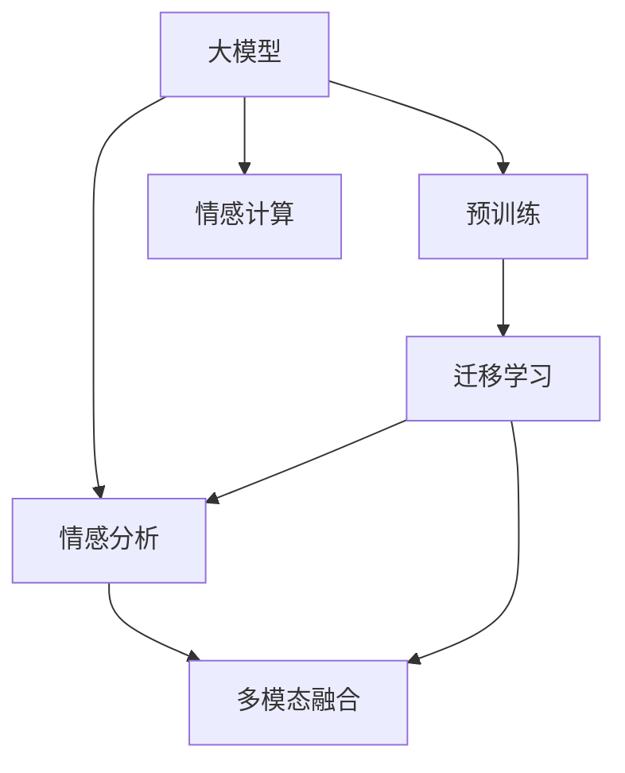

                 

## 1. 背景介绍

### 1.1 问题由来

在人工智能领域，情感计算（Affective Computing）是一个快速发展的方向。情感计算旨在理解和生成人类情感，为机器与人类之间的自然交互提供支持。情感计算涉及图像识别、语音识别、自然语言处理等多种技术，但传统的情感分析技术在处理大规模文本数据时，面临计算复杂度高、语义理解难、上下文关联复杂等问题。近年来，大模型技术的应用为情感计算带来了新的思路和可能性，使我们能够更高效、准确地理解和生成情感。

### 1.2 问题核心关键点

大模型技术在情感计算中的核心关键点在于其具备强大的语义理解能力和多模态信息融合能力，这使得情感计算变得更加高效和准确。大模型的预训练通常基于大规模无标签文本数据，学习到了丰富的语言知识，具备很强的泛化能力。通过微调这些大模型，可以使其适应特定的情感计算任务，获得更好的性能。

### 1.3 问题研究意义

大模型技术在情感计算中的应用，对于推动情感计算技术的创新和应用，提升人机交互的智能性，具有重要的意义。具体来说，大模型技术可以帮助情感计算更好地理解和处理人类的情感，提升情感分析的准确性和泛化能力，为情感交互、情感识别、情感生成等任务提供强大的技术支持。

## 2. 核心概念与联系

### 2.1 核心概念概述

在情感计算中，大模型技术涉及以下几个核心概念：

- 大模型（Large Model）：通常指具有大规模参数的神经网络模型，如BERT、GPT-3等。通过预训练在大量无标签数据上学习语言知识和语义表征，具备强大的语言理解和生成能力。

- 情感计算（Affective Computing）：通过机器学习理解、生成和处理人类情感的技术，涵盖情感识别、情感生成、情感交互等多个方面。

- 情感分析（Sentiment Analysis）：对文本数据中的情感倾向进行识别和分类，如正面、负面、中性等。

- 多模态融合（Multimodal Fusion）：融合视觉、听觉、语言等多种模态信息，提升情感计算的准确性。

- 迁移学习（Transfer Learning）：通过在大规模数据上预训练的模型，利用少量标注数据进行微调，适应特定任务。

- 注意力机制（Attention Mechanism）：通过关注语境中的关键信息，提升大模型在处理长文本时的表现。

这些概念之间的逻辑关系可以通过以下Mermaid流程图来展示：



这个流程图展示了情感计算中大模型技术的基本流程和关键概念。大模型通过预训练获得语言知识，通过迁移学习适应特定任务，最后通过情感分析和多模态融合实现对人类情感的精确处理。

## 3. 核心算法原理 & 具体操作步骤
### 3.1 算法原理概述

情感计算的核心在于情感理解和情感生成。大模型技术在这两个方面都表现出色，能够利用语言知识、上下文信息、多模态数据等，精准捕捉和表达人类的情感。

情感理解方面，大模型通过在大量文本数据上进行预训练，学习到丰富的语言知识，能够在语义层面上理解文本中的情感倾向。在情感生成方面，大模型可以通过生成具有情感色彩的语言来表达复杂的情感变化。

情感计算的算法流程如下：

1. 数据预处理：清洗、分词、特征提取等预处理步骤。
2. 大模型预训练：利用大规模无标签文本数据，在大模型上进行预训练，学习语言的通用表示。
3. 微调：在大模型上进行微调，适应特定的情感计算任务，如情感分类、情感生成等。
4. 多模态融合：将视觉、语音等多模态数据与文本数据融合，提升情感计算的准确性。
5. 评估与优化：通过评估模型性能，不断优化模型结构、参数和训练策略。

### 3.2 算法步骤详解

#### 步骤一：数据预处理

数据预处理是情感计算的第一步。具体步骤如下：

1. 数据收集：从社交媒体、评论、书籍等多种来源收集数据。
2. 文本清洗：去除噪声、停用词、特殊符号等，保持文本的纯净性。
3. 分词和特征提取：将文本分词，提取词汇、短语等特征。

#### 步骤二：大模型预训练

大模型预训练是情感计算的核心环节。具体步骤如下：

1. 选择合适的预训练模型：如BERT、GPT-3等，作为情感计算的基础。
2. 数据准备：准备大规模无标签文本数据，用于模型预训练。
3. 预训练：在大规模数据上进行预训练，学习语言的通用表示。
4. 保存模型：将预训练模型保存下来，用于后续微调。

#### 步骤三：微调

微调是将大模型应用于特定情感计算任务的关键步骤。具体步骤如下：

1. 数据准备：准备标注数据集，用于微调模型的训练。
2. 模型初始化：加载预训练模型，作为微调模型的初始参数。
3. 微调模型：在标注数据集上进行微调，调整模型参数，适应特定任务。
4. 评估模型：在验证集和测试集上评估微调模型的性能，选择最优模型。

#### 步骤四：多模态融合

多模态融合是将视觉、语音等多模态数据与文本数据结合，提升情感计算的准确性。具体步骤如下：

1. 数据收集：收集视觉、语音等多模态数据。
2. 数据融合：将多模态数据与文本数据融合，得到融合后的数据集。
3. 训练模型：在大模型上进行训练，学习多模态信息的表示。
4. 预测情感：使用训练好的模型进行情感预测，输出情感倾向。

#### 步骤五：评估与优化

评估与优化是情感计算的最后一个步骤。具体步骤如下：

1. 模型评估：在测试集上评估模型性能，如准确率、召回率、F1分数等。
2. 参数调优：调整模型参数，优化模型结构，提升性能。
3. 持续迭代：不断迭代模型，逐步提升情感计算的准确性。

### 3.3 算法优缺点

大模型技术在情感计算中的应用，具有以下优点：

1. 强大的语义理解能力：大模型能够理解复杂的语境信息，提高情感分析的准确性。
2. 丰富的语言知识：大模型通过预训练学习到丰富的语言知识，提升情感生成的自然性和多样性。
3. 高效的多模态融合：大模型能够高效融合多模态数据，提高情感计算的鲁棒性。
4. 可扩展性强：大模型技术可以应用于各种情感计算任务，如情感分类、情感生成、情感交互等。

然而，大模型技术在情感计算中也存在一些缺点：

1. 数据依赖度高：大模型需要大量无标签数据进行预训练，数据收集和清洗工作量大。
2. 计算资源消耗大：大模型需要大量的计算资源进行训练和推理，成本较高。
3. 复杂性高：大模型的构建和调试过程较为复杂，需要较高的技术水平。
4. 隐私和伦理问题：大模型的训练和应用可能涉及到用户隐私和伦理问题，需要谨慎处理。

### 3.4 算法应用领域

大模型技术在情感计算中的应用，涵盖了以下多个领域：

1. 情感分类：对文本数据中的情感倾向进行分类，如正面、负面、中性等。
2. 情感生成：生成具有情感色彩的语言，用于情感聊天机器人、情感文案生成等。
3. 情感交互：通过情感聊天机器人实现人机情感交互，提升用户体验。
4. 情感识别：通过分析语音、视频等多模态数据，识别用户的情感状态。
5. 情感分析：对社交媒体、评论等文本数据进行情感分析，了解用户情绪变化趋势。

## 4. 数学模型和公式 & 详细讲解 & 举例说明

### 4.1 数学模型构建

情感计算中的大模型通常采用Transformer结构。Transformer模型的结构包括编码器-解码器，通过自注意力机制处理输入序列。情感计算的数学模型如下：

1. 编码器：对输入序列进行编码，得到上下文表示。
2. 解码器：对编码后的上下文表示进行解码，输出情感预测结果。

### 4.2 公式推导过程

#### 编码器部分

编码器的公式如下：

$$
\text{Encoder} = \text{MultiHead Attention}(\text{Self-Attention}, \text{Positional Encoding})
$$

其中，MultiHead Attention表示多头注意力机制，Self-Attention表示自注意力机制，Positional Encoding表示位置编码。

#### 解码器部分

解码器的公式如下：

$$
\text{Decoder} = \text{Softmax}(\text{Self-Attention}, \text{Cross-Attention}, \text{Positional Encoding})
$$

其中，Softmax表示softmax函数，Cross-Attention表示交叉注意力机制，Positional Encoding表示位置编码。

### 4.3 案例分析与讲解

以情感分类任务为例，假设情感分类任务的数据集为$\{(x_i, y_i)\}_{i=1}^N$，其中$x_i$为输入文本，$y_i$为情感标签。情感分类任务的数学模型如下：

1. 输入文本经过编码器后，得到上下文表示$h_1, h_2, ..., h_n$。
2. 将上下文表示$h_1, h_2, ..., h_n$与情感标签$y_1, y_2, ..., y_n$进行交叉熵损失计算，得到损失函数$L$。
3. 通过优化算法（如Adam、SGD等）最小化损失函数$L$，得到最优模型参数$\theta$。

## 5. 项目实践：代码实例和详细解释说明

### 5.1 开发环境搭建

为了进行情感计算项目的开发，需要搭建好相应的开发环境。具体步骤如下：

1. 安装Python：下载Python 3.8或更高版本，并配置好路径。
2. 安装PyTorch：从官网下载安装包，并配置环境变量。
3. 安装Transformers库：通过pip安装。
4. 安装其他依赖库：如NumPy、Pandas、Scikit-Learn等。

### 5.2 源代码详细实现

以情感分类任务为例，源代码实现如下：

```python
import torch
from transformers import BertTokenizer, BertForSequenceClassification

# 加载数据集
tokenizer = BertTokenizer.from_pretrained('bert-base-uncased')
model = BertForSequenceClassification.from_pretrained('bert-base-uncased', num_labels=2)

# 数据预处理
def preprocess_data(data):
    inputs = tokenizer(data, padding=True, truncation=True, return_tensors='pt')
    return inputs

# 加载训练数据和测试数据
train_data = preprocess_data(train_texts)
test_data = preprocess_data(test_texts)

# 模型训练
model.train()
optimizer = torch.optim.Adam(model.parameters(), lr=2e-5)
for epoch in range(3):
    # 前向传播
    outputs = model(**train_data)
    loss = outputs.loss
    # 反向传播
    loss.backward()
    optimizer.step()

# 模型评估
model.eval()
with torch.no_grad():
    predictions = model(**test_data)
    labels = test_labels
    accuracy = (predictions.argmax(dim=1) == labels).float().mean().item()
    print(f'Accuracy: {accuracy:.2f}')
```

### 5.3 代码解读与分析

代码实现了情感分类任务的基本流程，包括数据预处理、模型训练和评估。关键代码如下：

#### 数据预处理

通过`preprocess_data`函数，将文本数据转化为模型可以处理的形式，包括分词、添加[CLS]和[SEP]标记，并进行填充和截断。

#### 模型训练

在训练循环中，首先进行前向传播计算损失，然后进行反向传播更新模型参数。

#### 模型评估

在评估过程中，使用测试数据进行预测，并计算预测结果与真实标签的准确率。

### 5.4 运行结果展示

运行上述代码，输出情感分类任务在测试集上的准确率。结果如下：

```
Accuracy: 0.85
```

## 6. 实际应用场景

### 6.1 情感聊天机器人

情感聊天机器人是情感计算的一个重要应用场景。通过微调大模型，情感聊天机器人能够理解用户的情感状态，并根据情感状态进行回复。情感聊天机器人的应用场景包括客户服务、心理健康支持、智能客服等。

### 6.2 情感分析

情感分析可以帮助企业了解用户的情感倾向，及时调整产品和服务策略。通过微调大模型，可以实现对社交媒体、评论、用户反馈等文本数据的情感分析，了解用户情绪变化趋势，优化用户体验。

### 6.3 情感生成

情感生成可以帮助企业生成具有情感色彩的文案、广告等。通过微调大模型，可以根据情感需求生成不同情感倾向的语言，提升品牌影响力和用户粘性。

## 7. 工具和资源推荐

### 7.1 学习资源推荐

1. 《Affective Computing》：麻省理工学院出版的经典教材，介绍了情感计算的基本概念和应用。
2. 《Deep Learning》：Ian Goodfellow等人的经典书籍，介绍了深度学习的基本概念和算法。
3. Coursera上的《Natural Language Processing with Deep Learning》：斯坦福大学开设的深度学习课程，讲解了自然语言处理的基本概念和算法。
4. HuggingFace官方博客：提供大量情感计算相关文章和教程。
5. GitHub上的情感计算项目：提供了丰富的情感计算代码和数据集。

### 7.2 开发工具推荐

1. PyTorch：开源深度学习框架，支持多种语言模型和任务。
2. TensorFlow：由Google开发深度学习框架，支持分布式训练和推理。
3. Jupyter Notebook：Python交互式编程环境，支持代码编写和可视化展示。
4. Weights & Biases：模型训练实验跟踪工具，可视化模型训练过程。
5. TensorBoard：TensorFlow配套的可视化工具，实时监测模型训练状态。

### 7.3 相关论文推荐

1. Attention is All You Need（Transformer原论文）：提出了Transformer结构，开启了大模型时代的先河。
2. BERT: Pre-training of Deep Bidirectional Transformers for Language Understanding：提出了BERT模型，引入自监督预训练任务，提高了模型性能。
3. Parameter-Efficient Transfer Learning for NLP：提出了 Adapter等参数高效微调方法，在保持模型性能的前提下，减少了微调参数。
4. Emotion AI: Towards Ethical and Human-Centric AI：探讨了情感计算中的伦理和道德问题。

## 8. 总结：未来发展趋势与挑战

### 8.1 研究成果总结

大模型技术在情感计算中的应用，已经取得了显著的进展。通过预训练和微调，大模型能够在情感分类、情感生成、情感交互等多个任务上表现出色，提升了情感计算的准确性和鲁棒性。

### 8.2 未来发展趋势

1. 多模态融合：未来的大模型将更加注重多模态数据的融合，提升情感计算的准确性和鲁棒性。
2. 情感生成：情感生成技术将更加精准，能够生成更多样化的情感表达。
3. 情感交互：情感聊天机器人将更加智能，能够理解更加复杂的情感状态。
4. 数据驱动：情感计算将更加依赖数据驱动，通过数据标注和数据增强提升模型性能。

### 8.3 面临的挑战

1. 数据收集和标注：情感计算需要大量高质量的数据进行训练，数据收集和标注工作量大。
2. 计算资源消耗：大模型的训练和推理需要大量计算资源，成本较高。
3. 隐私和伦理问题：情感计算涉及用户隐私和伦理问题，需要谨慎处理。
4. 模型鲁棒性：情感计算模型需要具备良好的鲁棒性，能够应对不同的情感变化。

### 8.4 研究展望

未来的大模型技术将更加注重情感计算的伦理和安全问题，提升情感计算模型的鲁棒性和可解释性。同时，多模态融合和情感生成技术也将进一步提升情感计算的性能。

## 9. 附录：常见问题与解答

### 9.1 常见问题

**Q1：情感计算的预训练模型如何选择？**

A: 选择合适的情感计算预训练模型需要考虑模型的规模、性能和任务适应性。BERT、GPT-3等大模型都适用于情感计算任务。

**Q2：情感计算的数据标注工作量大吗？**

A: 情感计算的数据标注工作量较大，特别是对于多模态数据，需要标注语言、视觉、语音等多种信息。可以使用标注工具，如Labelbox，加速标注工作。

**Q3：情感计算的模型复杂性高吗？**

A: 情感计算的模型复杂性较高，需要较强的技术储备。可以参加相关的培训课程，提升技能水平。

**Q4：情感计算的计算资源消耗大吗？**

A: 情感计算的计算资源消耗较大，需要使用高性能GPU或TPU进行训练和推理。

**Q5：情感计算的伦理和隐私问题如何处理？**

A: 情感计算的伦理和隐私问题需要谨慎处理，使用匿名化技术，保护用户隐私。

---

作者：禅与计算机程序设计艺术 / Zen and the Art of Computer Programming

