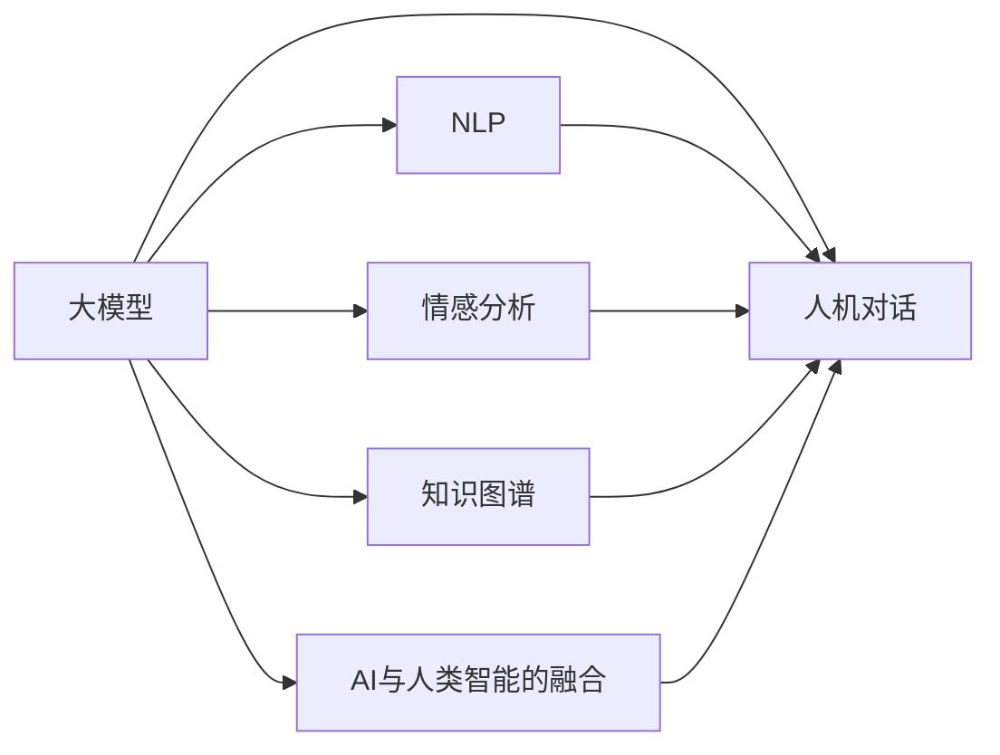

                 

# 大模型的人机协作:人工智能与人类智能的融合

> 关键词：大模型,人机协作,AI与人类智能,融合,机器学习,深度学习,自然语言处理,情感分析,知识图谱,人机对话

## 1. 背景介绍

### 1.1 问题由来

在过去的几十年中，人工智能（AI）技术迅猛发展，尤其是在深度学习和大数据驱动下，各类智能模型已经能够处理复杂任务，展现出超越人类的能力。然而，尽管AI模型在某些领域表现出色，但人机协作仍然具有不可替代的价值。传统机器学习与人工智能模型往往缺乏人类对于上下文和情感的理解，无法完全模拟人类复杂的认知和决策过程。

### 1.2 问题核心关键点

如何有效结合AI和人类智能，构建智能人机协作系统，成为当前AI领域的重要研究方向。核心问题包括：

1. **如何利用AI模型提高决策效率**：AI模型可以处理大量数据，快速计算，但缺乏人类情感和语境理解能力。
2. **如何融入人类知识与直觉**：AI模型需要结合人类专家知识和直觉，提升决策质量。
3. **如何构建动态适应性系统**：系统应具备学习新知识和适应环境变化的能力。
4. **如何确保系统的透明性与可解释性**：人机协作系统需具备可解释性，便于用户理解和信任。
5. **如何实现高效的人机交互**：提升人机互动的自然性和友好性。

## 2. 核心概念与联系

### 2.1 核心概念概述

在探讨大模型与人类智能的融合时，需要明确几个关键概念：

- **大模型（Large Model）**：通常指经过大规模数据训练，拥有海量参数和强大计算能力的深度学习模型。以Transformer结构为代表的大模型，如GPT-3、BERT等，在自然语言处理、图像识别等任务上表现优异。

- **人机协作（Human-Machine Collaboration）**：指人机系统通过分工协作，结合各自优势完成复杂任务。人负责任务的理解和规划，机器负责具体执行和计算。

- **人工智能与人类智能的融合（AI-Human Fusion）**：将AI模型的计算能力和人类智能的决策经验结合起来，实现更高效、更智能的人机协作。

- **自然语言处理（Natural Language Processing, NLP）**：研究如何让机器理解、处理和生成自然语言，是大模型与人类智能融合的重要领域。

- **情感分析（Sentiment Analysis）**：识别文本中的情感倾向，是构建智能人机对话的重要基础。

- **知识图谱（Knowledge Graph）**：以图的形式表示实体及其关系，是融合知识与智能的有效工具。

- **人机对话（Human-Machine Dialogue）**：实现人类与机器之间自然、流畅的交流，是大模型应用的关键场景。

这些核心概念之间的关系可以通过以下Mermaid流程图来展示：



该流程图展示了大模型与人类智能融合的全流程：大模型通过处理自然语言、分析情感、融入知识图谱，与人类智能协作，实现高效的人机对话。

## 3. 核心算法原理 & 具体操作步骤

### 3.1 算法原理概述

大模型与人类智能的融合，主要通过两种方式实现：

1. **数据增强与知识注入**：利用大模型处理数据，获得洞察，同时通过人类专家的反馈，优化模型。
2. **迭代优化与集成决策**：通过反复迭代，结合大模型的计算能力和人类专家的经验，逐步优化决策过程。

### 3.2 算法步骤详解

以一个医疗诊断系统为例，详细阐述大模型与人类智能融合的步骤：

1. **数据准备**：收集临床数据，包括患者病历、影像数据等，标记为“已确诊”和“未确诊”。
2. **模型训练**：使用大模型（如BERT）对数据进行预训练，学习疾病特征。
3. **知识注入**：由医生对模型输出的初步诊断进行标注，如修正错误诊断。
4. **迭代优化**：通过反复迭代，优化模型参数，结合医生标注数据，提升诊断准确性。
5. **集成决策**：将大模型输出的诊断结果与医生经验结合，进行综合判断。

### 3.3 算法优缺点

**优点**：

- **高效处理复杂任务**：大模型能够处理海量数据，快速进行计算。
- **结合人类专业知识**：通过迭代优化和知识注入，提升决策质量。
- **动态适应**：模型能够学习新知识，适应环境变化。

**缺点**：

- **数据需求量大**：需要大量高质量标注数据，获取成本高。
- **计算资源需求大**：大模型训练和推理需要高性能硬件支持。
- **可解释性不足**：模型决策过程难以解释。

### 3.4 算法应用领域

大模型与人类智能的融合在多个领域具有广泛应用：

- **医疗诊断**：结合患者数据和专家知识，提升诊断准确性。
- **金融分析**：通过大数据分析，结合专家经验，优化投资决策。
- **智能客服**：利用自然语言处理，结合专家知识库，提高服务质量。
- **教育推荐**：通过学习用户行为，结合教师经验，提供个性化教学方案。
- **智能交通**：结合实时数据和大模型分析，优化交通管理。

## 4. 数学模型和公式 & 详细讲解  
### 4.1 数学模型构建

构建一个大模型与人类智能融合的数学模型，需要考虑以下几个方面：

1. **数据表示**：将临床数据、患者病历等转化为机器可理解的形式。
2. **特征提取**：使用大模型提取数据中的关键特征。
3. **决策规则**：结合专家知识，建立决策规则。
4. **优化目标**：通过优化模型参数，提升决策效果。

假设大模型为$f(x; \theta)$，其中$x$表示输入数据，$\theta$为模型参数。决策规则为$D(x)$，代表人类专家的判断。融合后的决策函数为$h(x)$。

### 4.2 公式推导过程

以医疗诊断为例，推导融合后的决策函数$h(x)$：

1. **数据表示**：将患者病历转换为向量形式$x = [x_1, x_2, ..., x_n]$，其中$x_i$表示第$i$个特征。
2. **特征提取**：使用大模型$f(x; \theta)$提取特征$y = f(x; \theta)$。
3. **决策规则**：根据专家知识，建立决策规则$D(y)$，如“当$y$大于某个阈值时，诊断为阳性”。
4. **融合决策**：将$f(x; \theta)$输出与专家规则$D(y)$结合，得到融合后的决策$h(x)$：
   $$
   h(x) = D(f(x; \theta))
   $$

### 4.3 案例分析与讲解

假设有一个医疗诊断系统，利用BERT模型对患者病历进行特征提取，提取结果为向量$y = f(x; \theta)$。专家根据向量大小和临床经验，建立如下决策规则：

- 当$y > 0.5$时，诊断为阳性；
- 当$y < 0.5$时，诊断为阴性；
- 当$y = 0.5$时，进行复诊。

将专家规则应用到大模型输出上，融合后的决策函数$h(x)$为：

$$
h(x) = 
\begin{cases}
1, & y > 0.5 \\
0, & y < 0.5 \\
2, & y = 0.5
\end{cases}
$$

## 5. 项目实践：代码实例和详细解释说明

### 5.1 开发环境搭建

在进行项目实践前，我们需要准备好开发环境。以下是使用Python进行PyTorch开发的环境配置流程：

1. 安装Anaconda：从官网下载并安装Anaconda，用于创建独立的Python环境。
2. 创建并激活虚拟环境：
```bash
conda create -n pytorch-env python=3.8 
conda activate pytorch-env
```
3. 安装PyTorch：根据CUDA版本，从官网获取对应的安装命令。例如：
```bash
conda install pytorch torchvision torchaudio cudatoolkit=11.1 -c pytorch -c conda-forge
```
4. 安装Transformers库：
```bash
pip install transformers
```
5. 安装各类工具包：
```bash
pip install numpy pandas scikit-learn matplotlib tqdm jupyter notebook ipython
```

完成上述步骤后，即可在`pytorch-env`环境中开始项目实践。

### 5.2 源代码详细实现

下面我们以医疗诊断系统为例，给出使用Transformers库对BERT模型进行微调的PyTorch代码实现。

首先，定义数据处理函数：

```python
from transformers import BertTokenizer
from torch.utils.data import Dataset
import torch

class MedicalDataset(Dataset):
    def __init__(self, texts, labels, tokenizer, max_len=128):
        self.texts = texts
        self.labels = labels
        self.tokenizer = tokenizer
        self.max_len = max_len
        
    def __len__(self):
        return len(self.texts)
    
    def __getitem__(self, item):
        text = self.texts[item]
        label = self.labels[item]
        
        encoding = self.tokenizer(text, return_tensors='pt', max_length=self.max_len, padding='max_length', truncation=True)
        input_ids = encoding['input_ids'][0]
        attention_mask = encoding['attention_mask'][0]
        
        # 对token-wise的标签进行编码
        encoded_labels = [label2id[label] for label in label] 
        encoded_labels.extend([label2id['N']]*(self.max_len - len(encoded_labels)))
        labels = torch.tensor(encoded_labels, dtype=torch.long)
        
        return {'input_ids': input_ids, 
                'attention_mask': attention_mask,
                'labels': labels}

# 标签与id的映射
label2id = {'N': 0, 'P': 1}
id2label = {v: k for k, v in label2id.items()}

# 创建dataset
tokenizer = BertTokenizer.from_pretrained('bert-base-cased')

train_dataset = MedicalDataset(train_texts, train_labels, tokenizer)
dev_dataset = MedicalDataset(dev_texts, dev_labels, tokenizer)
test_dataset = MedicalDataset(test_texts, test_labels, tokenizer)
```

然后，定义模型和优化器：

```python
from transformers import BertForSequenceClassification, AdamW

model = BertForSequenceClassification.from_pretrained('bert-base-cased', num_labels=len(label2id))

optimizer = AdamW(model.parameters(), lr=2e-5)
```

接着，定义训练和评估函数：

```python
from torch.utils.data import DataLoader
from tqdm import tqdm
from sklearn.metrics import classification_report

device = torch.device('cuda') if torch.cuda.is_available() else torch.device('cpu')
model.to(device)

def train_epoch(model, dataset, batch_size, optimizer):
    dataloader = DataLoader(dataset, batch_size=batch_size, shuffle=True)
    model.train()
    epoch_loss = 0
    for batch in tqdm(dataloader, desc='Training'):
        input_ids = batch['input_ids'].to(device)
        attention_mask = batch['attention_mask'].to(device)
        labels = batch['labels'].to(device)
        model.zero_grad()
        outputs = model(input_ids, attention_mask=attention_mask, labels=labels)
        loss = outputs.loss
        epoch_loss += loss.item()
        loss.backward()
        optimizer.step()
    return epoch_loss / len(dataloader)

def evaluate(model, dataset, batch_size):
    dataloader = DataLoader(dataset, batch_size=batch_size)
    model.eval()
    preds, labels = [], []
    with torch.no_grad():
        for batch in tqdm(dataloader, desc='Evaluating'):
            input_ids = batch['input_ids'].to(device)
            attention_mask = batch['attention_mask'].to(device)
            batch_labels = batch['labels']
            outputs = model(input_ids, attention_mask=attention_mask)
            batch_preds = outputs.logits.argmax(dim=2).to('cpu').tolist()
            batch_labels = batch_labels.to('cpu').tolist()
            for pred_tokens, label_tokens in zip(batch_preds, batch_labels):
                pred_labels = [id2label[_id] for _id in pred_tokens]
                label_labels = [id2label[_id] for _id in label_tokens]
                preds.append(pred_labels[:len(label_labels)])
                labels.append(label_labels)
                
    print(classification_report(labels, preds))
```

最后，启动训练流程并在测试集上评估：

```python
epochs = 5
batch_size = 16

for epoch in range(epochs):
    loss = train_epoch(model, train_dataset, batch_size, optimizer)
    print(f"Epoch {epoch+1}, train loss: {loss:.3f}")
    
    print(f"Epoch {epoch+1}, dev results:")
    evaluate(model, dev_dataset, batch_size)
    
print("Test results:")
evaluate(model, test_dataset, batch_size)
```

以上就是使用PyTorch对BERT进行医疗诊断任务微调的完整代码实现。可以看到，得益于Transformers库的强大封装，我们可以用相对简洁的代码完成BERT模型的加载和微调。

### 5.3 代码解读与分析

让我们再详细解读一下关键代码的实现细节：

**MedicalDataset类**：
- `__init__`方法：初始化文本、标签、分词器等关键组件。
- `__len__`方法：返回数据集的样本数量。
- `__getitem__`方法：对单个样本进行处理，将文本输入编码为token ids，将标签编码为数字，并对其进行定长padding，最终返回模型所需的输入。

**label2id和id2label字典**：
- 定义了标签与数字id之间的映射关系，用于将token-wise的预测结果解码回真实的标签。

**训练和评估函数**：
- 使用PyTorch的DataLoader对数据集进行批次化加载，供模型训练和推理使用。
- 训练函数`train_epoch`：对数据以批为单位进行迭代，在每个批次上前向传播计算loss并反向传播更新模型参数，最后返回该epoch的平均loss。
- 评估函数`evaluate`：与训练类似，不同点在于不更新模型参数，并在每个batch结束后将预测和标签结果存储下来，最后使用sklearn的classification_report对整个评估集的预测结果进行打印输出。

**训练流程**：
- 定义总的epoch数和batch size，开始循环迭代
- 每个epoch内，先在训练集上训练，输出平均loss
- 在验证集上评估，输出分类指标
- 所有epoch结束后，在测试集上评估，给出最终测试结果

可以看到，PyTorch配合Transformers库使得BERT微调的代码实现变得简洁高效。开发者可以将更多精力放在数据处理、模型改进等高层逻辑上，而不必过多关注底层的实现细节。

当然，工业级的系统实现还需考虑更多因素，如模型的保存和部署、超参数的自动搜索、更灵活的任务适配层等。但核心的微调范式基本与此类似。

## 6. 实际应用场景

### 6.1 智能客服系统

基于大模型微调的对话技术，可以广泛应用于智能客服系统的构建。传统客服往往需要配备大量人力，高峰期响应缓慢，且一致性和专业性难以保证。而使用微调后的对话模型，可以7x24小时不间断服务，快速响应客户咨询，用自然流畅的语言解答各类常见问题。

在技术实现上，可以收集企业内部的历史客服对话记录，将问题和最佳答复构建成监督数据，在此基础上对预训练对话模型进行微调。微调后的对话模型能够自动理解用户意图，匹配最合适的答案模板进行回复。对于客户提出的新问题，还可以接入检索系统实时搜索相关内容，动态组织生成回答。如此构建的智能客服系统，能大幅提升客户咨询体验和问题解决效率。

### 6.2 金融舆情监测

金融机构需要实时监测市场舆论动向，以便及时应对负面信息传播，规避金融风险。传统的人工监测方式成本高、效率低，难以应对网络时代海量信息爆发的挑战。基于大语言模型微调的文本分类和情感分析技术，为金融舆情监测提供了新的解决方案。

具体而言，可以收集金融领域相关的新闻、报道、评论等文本数据，并对其进行主题标注和情感标注。在此基础上对预训练语言模型进行微调，使其能够自动判断文本属于何种主题，情感倾向是正面、中性还是负面。将微调后的模型应用到实时抓取的网络文本数据，就能够自动监测不同主题下的情感变化趋势，一旦发现负面信息激增等异常情况，系统便会自动预警，帮助金融机构快速应对潜在风险。

### 6.3 个性化推荐系统

当前的推荐系统往往只依赖用户的历史行为数据进行物品推荐，无法深入理解用户的真实兴趣偏好。基于大语言模型微调技术，个性化推荐系统可以更好地挖掘用户行为背后的语义信息，从而提供更精准、多样的推荐内容。

在实践中，可以收集用户浏览、点击、评论、分享等行为数据，提取和用户交互的物品标题、描述、标签等文本内容。将文本内容作为模型输入，用户的后续行为（如是否点击、购买等）作为监督信号，在此基础上微调预训练语言模型。微调后的模型能够从文本内容中准确把握用户的兴趣点。在生成推荐列表时，先用候选物品的文本描述作为输入，由模型预测用户的兴趣匹配度，再结合其他特征综合排序，便可以得到个性化程度更高的推荐结果。

### 6.4 未来应用展望

随着大语言模型和微调方法的不断发展，基于微调范式将在更多领域得到应用，为传统行业带来变革性影响。

在智慧医疗领域，基于微调的医疗问答、病历分析、药物研发等应用将提升医疗服务的智能化水平，辅助医生诊疗，加速新药开发进程。

在智能教育领域，微调技术可应用于作业批改、学情分析、知识推荐等方面，因材施教，促进教育公平，提高教学质量。

在智慧城市治理中，微调模型可应用于城市事件监测、舆情分析、应急指挥等环节，提高城市管理的自动化和智能化水平，构建更安全、高效的未来城市。

此外，在企业生产、社会治理、文娱传媒等众多领域，基于大模型微调的人工智能应用也将不断涌现，为经济社会发展注入新的动力。相信随着预训练语言模型和微调方法的持续演进，大语言模型微调必将在构建人机协同的智能时代中扮演越来越重要的角色。

## 7. 工具和资源推荐

### 7.1 学习资源推荐

为了帮助开发者系统掌握大语言模型微调的理论基础和实践技巧，这里推荐一些优质的学习资源：

1. 《Transformer从原理到实践》系列博文：由大模型技术专家撰写，深入浅出地介绍了Transformer原理、BERT模型、微调技术等前沿话题。

2. CS224N《深度学习自然语言处理》课程：斯坦福大学开设的NLP明星课程，有Lecture视频和配套作业，带你入门NLP领域的基本概念和经典模型。

3. 《Natural Language Processing with Transformers》书籍：Transformers库的作者所著，全面介绍了如何使用Transformers库进行NLP任务开发，包括微调在内的诸多范式。

4. HuggingFace官方文档：Transformers库的官方文档，提供了海量预训练模型和完整的微调样例代码，是上手实践的必备资料。

5. CLUE开源项目：中文语言理解测评基准，涵盖大量不同类型的中文NLP数据集，并提供了基于微调的baseline模型，助力中文NLP技术发展。

通过对这些资源的学习实践，相信你一定能够快速掌握大语言模型微调的精髓，并用于解决实际的NLP问题。

### 7.2 开发工具推荐

高效的开发离不开优秀的工具支持。以下是几款用于大语言模型微调开发的常用工具：

1. PyTorch：基于Python的开源深度学习框架，灵活动态的计算图，适合快速迭代研究。大部分预训练语言模型都有PyTorch版本的实现。

2. TensorFlow：由Google主导开发的开源深度学习框架，生产部署方便，适合大规模工程应用。同样有丰富的预训练语言模型资源。

3. Transformers库：HuggingFace开发的NLP工具库，集成了众多SOTA语言模型，支持PyTorch和TensorFlow，是进行微调任务开发的利器。

4. Weights & Biases：模型训练的实验跟踪工具，可以记录和可视化模型训练过程中的各项指标，方便对比和调优。与主流深度学习框架无缝集成。

5. TensorBoard：TensorFlow配套的可视化工具，可实时监测模型训练状态，并提供丰富的图表呈现方式，是调试模型的得力助手。

6. Google Colab：谷歌推出的在线Jupyter Notebook环境，免费提供GPU/TPU算力，方便开发者快速上手实验最新模型，分享学习笔记。

合理利用这些工具，可以显著提升大语言模型微调任务的开发效率，加快创新迭代的步伐。

### 7.3 相关论文推荐

大语言模型和微调技术的发展源于学界的持续研究。以下是几篇奠基性的相关论文，推荐阅读：

1. Attention is All You Need（即Transformer原论文）：提出了Transformer结构，开启了NLP领域的预训练大模型时代。

2. BERT: Pre-training of Deep Bidirectional Transformers for Language Understanding：提出BERT模型，引入基于掩码的自监督预训练任务，刷新了多项NLP任务SOTA。

3. Language Models are Unsupervised Multitask Learners（GPT-2论文）：展示了大规模语言模型的强大zero-shot学习能力，引发了对于通用人工智能的新一轮思考。

4. Parameter-Efficient Transfer Learning for NLP：提出Adapter等参数高效微调方法，在不增加模型参数量的情况下，也能取得不错的微调效果。

5. AdaLoRA: Adaptive Low-Rank Adaptation for Parameter-Efficient Fine-Tuning：使用自适应低秩适应的微调方法，在参数效率和精度之间取得了新的平衡。

6. Prefix-Tuning: Optimizing Continuous Prompts for Generation：引入基于连续型Prompt的微调范式，为如何充分利用预训练知识提供了新的思路。

这些论文代表了大语言模型微调技术的发展脉络。通过学习这些前沿成果，可以帮助研究者把握学科前进方向，激发更多的创新灵感。

## 8. 总结：未来发展趋势与挑战

### 8.1 总结

本文对大模型与人类智能的融合进行了全面系统的介绍。首先阐述了大模型和微调技术的背景与意义，明确了融合在提升决策效率、融入专业知识、构建动态适应性系统等方面的重要作用。其次，从原理到实践，详细讲解了大模型与人类智能融合的数学模型、核心算法及具体操作步骤，给出了微调任务开发的完整代码实例。同时，本文还广泛探讨了融合技术在智能客服、金融舆情、个性化推荐等众多行业领域的应用前景，展示了融合范式的巨大潜力。最后，本文精选了微调技术的各类学习资源，力求为读者提供全方位的技术指引。

通过本文的系统梳理，可以看到，大模型与人类智能的融合技术正在成为NLP领域的重要范式，极大地拓展了预训练语言模型的应用边界，催生了更多的落地场景。受益于大规模语料的预训练和微调方法的不断进步，相信NLP技术将在更广阔的应用领域大放异彩，深刻影响人类的生产生活方式。

### 8.2 未来发展趋势

展望未来，大模型与人类智能的融合技术将呈现以下几个发展趋势：

1. **模型规模持续增大**：随着算力成本的下降和数据规模的扩张，预训练语言模型的参数量还将持续增长。超大规模语言模型蕴含的丰富语言知识，有望支撑更加复杂多变的下游任务微调。

2. **融合方法日趋多样**：除了传统的数据增强和迭代优化，未来将涌现更多参数高效的融合方法，如AdaLoRA、Prompt Tuning等，在固定大部分预训练参数的同时，只更新极少量的任务相关参数。

3. **动态适应能力增强**：未来模型将具备更加灵活的动态适应能力，能够根据环境和任务的变化快速调整参数和规则。

4. **跨模态融合普及**：未来的融合模型将更多地融合视觉、语音、文本等多模态信息，提升系统的感知能力和理解能力。

5. **知识图谱与模型的结合**：知识图谱将成为融合模型的重要工具，帮助模型理解复杂的语义关系，提升决策准确性。

6. **伦理与安全性保障**：未来的融合模型将更加注重伦理与安全性，避免模型的偏见和有害输出，确保系统的透明性和可解释性。

以上趋势凸显了大模型与人类智能融合技术的广阔前景。这些方向的探索发展，必将进一步提升NLP系统的性能和应用范围，为人类认知智能的进化带来深远影响。

### 8.3 面临的挑战

尽管大模型与人类智能的融合技术已经取得了瞩目成就，但在迈向更加智能化、普适化应用的过程中，它仍面临着诸多挑战：

1. **数据需求量大**：需要大量的高质量标注数据，获取成本高。
2. **计算资源需求大**：大模型训练和推理需要高性能硬件支持。
3. **可解释性不足**：模型决策过程难以解释。
4. **鲁棒性不足**：模型面对复杂多变的环境和任务时，鲁棒性可能不足。
5. **安全性有待保障**：模型可能学习到有害信息，产生误导性输出。

正视融合技术面临的这些挑战，积极应对并寻求突破，将是大模型与人类智能融合技术走向成熟的必由之路。

### 8.4 研究展望

面向未来，大模型与人类智能的融合技术需要在以下几个方面寻求新的突破：

1. **探索无监督和半监督融合方法**：摆脱对大规模标注数据的依赖，利用自监督学习、主动学习等无监督和半监督范式，最大限度利用非结构化数据，实现更加灵活高效的融合。

2. **研究参数高效和计算高效的融合范式**：开发更加参数高效的融合方法，在固定大部分预训练参数的同时，只更新极少量的任务相关参数。同时优化融合模型的计算图，减少前向传播和反向传播的资源消耗，实现更加轻量级、实时性的部署。

3. **融合因果分析和博弈论工具**：将因果分析方法引入融合模型，识别出模型决策的关键特征，增强输出解释的因果性和逻辑性。借助博弈论工具刻画人机交互过程，主动探索并规避模型的脆弱点，提高系统稳定性。

4. **纳入伦理道德约束**：在模型训练目标中引入伦理导向的评估指标，过滤和惩罚有偏见、有害的输出倾向。同时加强人工干预和审核，建立模型行为的监管机制，确保输出符合人类价值观和伦理道德。

这些研究方向的探索，必将引领大模型与人类智能融合技术迈向更高的台阶，为构建安全、可靠、可解释、可控的智能系统铺平道路。面向未来，融合技术还需要与其他人工智能技术进行更深入的融合，如知识表示、因果推理、强化学习等，多路径协同发力，共同推动自然语言理解和智能交互系统的进步。只有勇于创新、敢于突破，才能不断拓展语言模型的边界，让智能技术更好地造福人类社会。

## 9. 附录：常见问题与解答

**Q1：大模型与人类智能融合是否适用于所有NLP任务？**

A: 大模型与人类智能融合技术在大多数NLP任务上都能取得不错的效果，特别是对于数据量较小的任务。但对于一些特定领域的任务，如医学、法律等，仅仅依靠通用语料预训练的模型可能难以很好地适应。此时需要在特定领域语料上进一步预训练，再进行融合，才能获得理想效果。此外，对于一些需要时效性、个性化很强的任务，如对话、推荐等，融合方法也需要针对性的改进优化。

**Q2：融合过程中如何选择合适的学习率？**

A: 融合的学习率一般要比预训练时小1-2个数量级，如果使用过大的学习率，容易破坏预训练权重，导致过拟合。一般建议从1e-5开始调参，逐步减小学习率，直至收敛。也可以使用warmup策略，在开始阶段使用较小的学习率，再逐渐过渡到预设值。需要注意的是，不同的优化器(如AdamW、Adafactor等)以及不同的学习率调度策略，可能需要设置不同的学习率阈值。

**Q3：融合系统中如何进行高效的知识注入？**

A: 知识注入是融合系统的重要环节，可以通过以下方法实现：

1. **专家知识融合**：利用专家知识库，对模型输出进行校正和优化。
2. **在线学习**：系统不断从专家反馈中学习，调整模型参数。
3. **强化学习**：通过奖励机制，激励模型学习并优化决策。

**Q4：融合系统如何在多模态数据融合中表现更好？**

A: 多模态数据融合是未来融合系统的一个重要发展方向。以下是一些提升多模态融合效果的建议：

1. **特征对齐**：将不同模态的特征对齐，提升融合效果。
2. **融合算法优化**：使用先进的多模态融合算法，提升融合准确性。
3. **跨模态理解**：提升模型对多模态数据的理解能力，增强融合效果。

**Q5：融合系统如何确保决策的透明性与可解释性？**

A: 决策的透明性与可解释性是大模型与人类智能融合系统的重要指标。以下是一些提升系统透明性的方法：

1. **可解释模型**：选择具有可解释性的模型，如决策树、规则系统等。
2. **模型解释工具**：使用模型解释工具，如LIME、SHAP等，帮助理解模型决策过程。
3. **多模型集成**：使用多模型集成，提升系统透明性和鲁棒性。

通过本文的系统梳理，可以看到，大模型与人类智能的融合技术正在成为NLP领域的重要范式，极大地拓展了预训练语言模型的应用边界，催生了更多的落地场景。受益于大规模语料的预训练和微调方法的不断进步，相信NLP技术将在更广阔的应用领域大放异彩，深刻影响人类的生产生活方式。

---

作者：禅与计算机程序设计艺术 / Zen and the Art of Computer Programming

