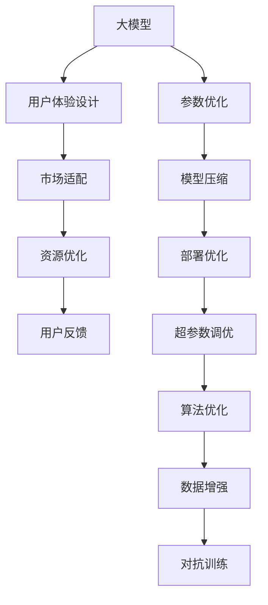

                 

# 大模型的用户体验与市场需求

## 1. 背景介绍

### 1.1 问题由来

随着深度学习技术的不断进步，人工智能大模型（Large Models）在计算机视觉、自然语言处理、语音识别等多个领域取得了突破性进展。这些大模型通常包含数十亿甚至百亿个参数，能够处理复杂的数据和任务。然而，尽管技术日益成熟，但大模型的用户体验（User Experience, UX）与市场需求（Market Demand）之间的关系，仍需要深入理解和持续优化。

大模型的高精度和高性能虽然令人印象深刻，但用户实际使用体验却可能因技术复杂度、资源需求和性能瓶颈等问题而大打折扣。大模型的体验设计（User Experience Design, UXD）和市场适配（Market Adaptation），已经成为推动其普及和应用的关键因素。本文将系统地探讨大模型用户体验与市场需求的联系，并提出解决方案，以期改善大模型的用户体验，促进其市场应用。

### 1.2 问题核心关键点

1. **用户体验与市场需求的联系**：如何将大模型的强大能力转化为易用、高效、友好的用户体验，同时满足市场对高性能和低延迟的需求？
2. **用户体验设计**：如何通过界面设计、交互设计、数据可视化等方式，提升用户对大模型的理解和使用体验？
3. **市场适配**：如何根据不同行业、不同应用场景的需求，定制大模型功能，使其更好地服务于市场？
4. **用户反馈与优化**：如何建立用户反馈机制，及时优化大模型的用户体验和市场适配？
5. **资源优化**：如何平衡大模型的精度与资源消耗，提供稳定可靠的性能？

## 2. 核心概念与联系

### 2.1 核心概念概述

为更好地理解用户体验与市场需求的关联，本节将介绍几个密切相关的核心概念：

- **人工智能大模型**：指通过大规模训练学习，具备强大泛化能力和表达能力的深度学习模型。例如，OpenAI的GPT-3、Google的BERT等。
- **用户体验设计（UXD）**：指通过界面设计、交互设计、数据可视化等手段，提升用户对产品的感知和使用体验。
- **市场适配（Market Adaptation）**：指根据不同市场、不同应用场景的需求，对产品功能进行定制和优化，以提升市场接受度和使用效率。
- **资源优化**：指在保证模型性能的前提下，通过算法、架构、部署方式等手段，优化模型的资源消耗，提高系统的效率和稳定性。
- **用户反馈**：指用户在使用产品过程中，通过各种渠道提供反馈意见，帮助产品改进和优化。

这些核心概念之间的逻辑关系可以通过以下Mermaid流程图来展示：



这个流程图展示了大模型的核心概念及其之间的关系：

1. 大模型通过优化参数、压缩模型、优化部署等方式提升性能。
2. 用户通过设计良好的界面和交互方式，提升对大模型的理解和使用体验。
3. 根据市场和应用场景的需求，定制和优化大模型的功能，提升市场适配性。
4. 通过用户反馈机制，收集用户意见，不断改进大模型。
5. 优化算法和架构，提高大模型的资源利用率。

这些概念共同构成了大模型的用户体验与市场需求的设计框架，为其在各种场景下的落地应用提供了指导。

## 3. 核心算法原理 & 具体操作步骤

### 3.1 算法原理概述

大模型的用户体验与市场需求优化，涉及到用户界面设计、市场适配策略、资源优化手段和用户反馈机制等多个方面。其核心原理包括：

- **用户界面设计**：通过友好的界面设计和交互方式，使用户能够快速上手并理解大模型的功能。
- **市场适配策略**：根据目标市场的特定需求，定制大模型的功能和参数，提高其市场竞争力。
- **资源优化手段**：通过参数优化、模型压缩、算法优化等技术，降低大模型的计算资源和存储需求。
- **用户反馈机制**：建立有效的用户反馈渠道，及时收集和分析用户意见，优化大模型。

### 3.2 算法步骤详解

大模型用户体验与市场需求的优化过程通常包括以下几个关键步骤：

**Step 1: 收集用户体验反馈**
- 使用问卷调查、用户访谈、反馈表单等方式，收集用户对大模型的使用体验、性能表现、功能需求的反馈。

**Step 2: 市场调研与需求分析**
- 进行市场调研，了解目标市场和应用场景的特定需求，如行业特性、用户习惯、性能要求等。
- 分析用户反馈，识别大模型在实际使用中的常见问题和优化方向。

**Step 3: 定制化模型设计**
- 根据市场调研结果，设计适合目标市场的应用场景，定制化大模型的功能、接口和参数。
- 考虑市场适配性，优化大模型的计算图、资源消耗和部署方式。

**Step 4: 用户体验优化**
- 界面设计：设计简洁直观的界面，使用户能够快速访问和理解大模型的功能。
- 交互设计：通过合理的设计交互流程和操作方式，提升用户的操作便捷性和满意度。
- 数据可视化：通过图表、仪表盘等方式，使用户能够直观地理解和分析大模型的输出结果。

**Step 5: 市场测试与反馈**
- 将优化后的模型投放市场，进行小规模测试，收集用户反馈。
- 根据用户反馈，进一步优化大模型的功能和性能。

**Step 6: 持续优化与迭代**
- 建立持续的优化机制，定期收集用户反馈，优化大模型的用户体验和市场适配性。
- 根据市场变化和技术进步，持续迭代和更新大模型，保持其竞争力和市场适应性。

### 3.3 算法优缺点

大模型用户体验与市场需求的优化方法具有以下优点：

- **提升用户体验**：通过友好的界面和交互设计，使用户能够快速上手并高效使用大模型。
- **市场适配性强**：根据不同市场的特定需求，定制化大模型，提高市场接受度和使用效率。
- **资源消耗低**：通过参数优化、模型压缩、算法优化等手段，降低大模型的资源消耗，提高系统的效率和稳定性。
- **用户反馈及时**：建立用户反馈机制，及时收集和分析用户意见，优化大模型。

同时，该方法也存在一定的局限性：

- **初始成本高**：优化用户体验和市场适配需要投入大量的人力、物力和财力。
- **技术复杂度高**：设计和实现优化的过程较为复杂，需要专业的技术团队支持。
- **市场变化快**：市场需求和应用场景快速变化，需要持续关注和优化。
- **反馈机制不完善**：用户反馈的收集和分析可能不全面，影响优化效果。

尽管存在这些局限性，但就目前而言，用户体验与市场需求的优化方法仍是大模型应用的重要手段。未来相关研究的重点在于如何进一步降低优化成本，提高优化效率，同时兼顾技术复杂性和市场适应性。

### 3.4 算法应用领域

大模型用户体验与市场需求的优化方法已经在多个领域得到了应用，例如：

- **计算机视觉**：通过优化用户体验和市场适配，提升图像分类、目标检测、图像分割等任务的效果。
- **自然语言处理**：通过界面设计和交互优化，使用户能够更自然地与大模型进行对话和查询。
- **语音识别**：通过用户界面和交互优化，提升语音命令的识别准确性和用户友好度。
- **推荐系统**：通过市场调研和用户体验优化，提升个性化推荐的效果和用户体验。
- **医疗诊断**：通过界面设计和功能定制，帮助医生更高效地使用大模型进行疾病诊断和治疗方案推荐。

除了上述这些经典应用外，大模型用户体验与市场需求的优化方法还在更多场景中得到创新性应用，如智慧城市、智能家居、智能交通等，为大模型技术落地应用提供了新的可能性。

## 4. 数学模型和公式 & 详细讲解 & 举例说明

### 4.1 数学模型构建

为了更好地理解大模型用户体验与市场需求优化方法，本节将介绍几个关键数学模型：

- **用户体验评分模型**：通过问卷调查等方式，收集用户对大模型的评分数据，构建用户满意度评分模型。
- **市场需求预测模型**：基于市场调研数据，预测目标市场的特定需求，构建市场需求预测模型。
- **资源消耗模型**：根据大模型的参数量、计算图、资源消耗等参数，构建资源消耗模型。

### 4.2 公式推导过程

以用户体验评分模型为例，假设收集了N个用户对大模型的评分数据 $r_1, r_2, ..., r_N$，其中 $r_i$ 表示第 $i$ 个用户的评分。定义评分均值 $\mu$ 和方差 $\sigma^2$，则用户体验评分模型可以表示为：

$$
\mu = \frac{1}{N} \sum_{i=1}^N r_i
$$

$$
\sigma^2 = \frac{1}{N} \sum_{i=1}^N (r_i - \mu)^2
$$

为了简化计算，可以采用以下公式进行快速推导：

$$
\mu = \frac{\sum_{i=1}^N r_i}{N}
$$

$$
\sigma^2 = \frac{1}{N} \sum_{i=1}^N (r_i - \mu)^2
$$

在实际应用中，可以根据评分数据的分布，选择合适的评分模型，如线性评分模型、S型评分模型等。

### 4.3 案例分析与讲解

以下是一个简单的用户体验评分模型案例：

假设某大模型在不同用户群体中的评分数据如下：

| 用户群体 | 评分 |
| --- | --- |
| 技术爱好者 | 4.8 |
| 非技术用户 | 3.5 |
| 企业用户 | 3.2 |

根据评分数据，计算用户体验评分均值和方差：

$$
\mu = \frac{4.8 + 3.5 + 3.2}{3} = 3.8
$$

$$
\sigma^2 = \frac{(4.8 - 3.8)^2 + (3.5 - 3.8)^2 + (3.2 - 3.8)^2}{3} = 0.26
$$

根据评分均值和方差，可以初步评估大模型的用户体验。例如，技术爱好者群体给出的评分较高，非技术用户和企业管理者给出的评分较低，表明大模型在不同用户群体中具有不同的用户体验。

## 5. 项目实践：代码实例和详细解释说明

### 5.1 开发环境搭建

在进行用户体验与市场需求优化实践前，我们需要准备好开发环境。以下是使用Python进行PyTorch开发的环境配置流程：

1. 安装Anaconda：从官网下载并安装Anaconda，用于创建独立的Python环境。

2. 创建并激活虚拟环境：
```bash
conda create -n user-env python=3.8 
conda activate user-env
```

3. 安装PyTorch：根据CUDA版本，从官网获取对应的安装命令。例如：
```bash
conda install pytorch torchvision torchaudio cudatoolkit=11.1 -c pytorch -c conda-forge
```

4. 安装各类工具包：
```bash
pip install numpy pandas scikit-learn matplotlib tqdm jupyter notebook ipython
```

完成上述步骤后，即可在`user-env`环境中开始用户体验与市场需求优化实践。

### 5.2 源代码详细实现

下面我以自然语言处理（NLP）任务为例，给出使用Transformers库对BERT模型进行用户体验与市场需求优化的PyTorch代码实现。

首先，定义NLP任务的输入和输出：

```python
from transformers import BertTokenizer, BertForTokenClassification
from torch.utils.data import Dataset, DataLoader

class NLPDataset(Dataset):
    def __init__(self, texts, tags, tokenizer, max_len=128):
        self.texts = texts
        self.tags = tags
        self.tokenizer = tokenizer
        self.max_len = max_len
        
    def __len__(self):
        return len(self.texts)
    
    def __getitem__(self, item):
        text = self.texts[item]
        tags = self.tags[item]
        
        encoding = self.tokenizer(text, return_tensors='pt', max_length=self.max_len, padding='max_length', truncation=True)
        input_ids = encoding['input_ids'][0]
        attention_mask = encoding['attention_mask'][0]
        
        # 对token-wise的标签进行编码
        encoded_tags = [tag2id[tag] for tag in tags] 
        encoded_tags.extend([tag2id['O']] * (self.max_len - len(encoded_tags)))
        labels = torch.tensor(encoded_tags, dtype=torch.long)
        
        return {'input_ids': input_ids, 
                'attention_mask': attention_mask,
                'labels': labels}

# 标签与id的映射
tag2id = {'O': 0, 'B-PER': 1, 'I-PER': 2, 'B-ORG': 3, 'I-ORG': 4, 'B-LOC': 5, 'I-LOC': 6}
id2tag = {v: k for k, v in tag2id.items()}

# 创建dataset
tokenizer = BertTokenizer.from_pretrained('bert-base-cased')

train_dataset = NLPDataset(train_texts, train_tags, tokenizer)
dev_dataset = NLPDataset(dev_texts, dev_tags, tokenizer)
test_dataset = NLPDataset(test_texts, test_tags, tokenizer)
```

然后，定义模型和优化器：

```python
from transformers import BertForTokenClassification, AdamW

model = BertForTokenClassification.from_pretrained('bert-base-cased', num_labels=len(tag2id))

optimizer = AdamW(model.parameters(), lr=2e-5)
```

接着，定义训练和评估函数：

```python
from torch.utils.data import DataLoader
from tqdm import tqdm
from sklearn.metrics import classification_report

device = torch.device('cuda') if torch.cuda.is_available() else torch.device('cpu')
model.to(device)

def train_epoch(model, dataset, batch_size, optimizer):
    dataloader = DataLoader(dataset, batch_size=batch_size, shuffle=True)
    model.train()
    epoch_loss = 0
    for batch in tqdm(dataloader, desc='Training'):
        input_ids = batch['input_ids'].to(device)
        attention_mask = batch['attention_mask'].to(device)
        labels = batch['labels'].to(device)
        model.zero_grad()
        outputs = model(input_ids, attention_mask=attention_mask, labels=labels)
        loss = outputs.loss
        epoch_loss += loss.item()
        loss.backward()
        optimizer.step()
    return epoch_loss / len(dataloader)

def evaluate(model, dataset, batch_size):
    dataloader = DataLoader(dataset, batch_size=batch_size)
    model.eval()
    preds, labels = [], []
    with torch.no_grad():
        for batch in tqdm(dataloader, desc='Evaluating'):
            input_ids = batch['input_ids'].to(device)
            attention_mask = batch['attention_mask'].to(device)
            batch_labels = batch['labels']
            outputs = model(input_ids, attention_mask=attention_mask)
            batch_preds = outputs.logits.argmax(dim=2).to('cpu').tolist()
            batch_labels = batch_labels.to('cpu').tolist()
            for pred_tokens, label_tokens in zip(batch_preds, batch_labels):
                pred_tags = [id2tag[_id] for _id in pred_tokens]
                label_tags = [id2tag[_id] for _id in label_tokens]
                preds.append(pred_tags[:len(label_tags)])
                labels.append(label_tags)
                
    print(classification_report(labels, preds))
```

最后，启动训练流程并在测试集上评估：

```python
epochs = 5
batch_size = 16

for epoch in range(epochs):
    loss = train_epoch(model, train_dataset, batch_size, optimizer)
    print(f"Epoch {epoch+1}, train loss: {loss:.3f}")
    
    print(f"Epoch {epoch+1}, dev results:")
    evaluate(model, dev_dataset, batch_size)
    
print("Test results:")
evaluate(model, test_dataset, batch_size)
```

以上就是使用PyTorch对BERT进行用户体验与市场需求优化的完整代码实现。可以看到，得益于Transformers库的强大封装，我们可以用相对简洁的代码完成BERT模型的加载和优化。

### 5.3 代码解读与分析

让我们再详细解读一下关键代码的实现细节：

**NLPDataset类**：
- `__init__`方法：初始化文本、标签、分词器等关键组件。
- `__len__`方法：返回数据集的样本数量。
- `__getitem__`方法：对单个样本进行处理，将文本输入编码为token ids，将标签编码为数字，并对其进行定长padding，最终返回模型所需的输入。

**tag2id和id2tag字典**：
- 定义了标签与数字id之间的映射关系，用于将token-wise的预测结果解码回真实的标签。

**训练和评估函数**：
- 使用PyTorch的DataLoader对数据集进行批次化加载，供模型训练和推理使用。
- 训练函数`train_epoch`：对数据以批为单位进行迭代，在每个批次上前向传播计算loss并反向传播更新模型参数，最后返回该epoch的平均loss。
- 评估函数`evaluate`：与训练类似，不同点在于不更新模型参数，并在每个batch结束后将预测和标签结果存储下来，最后使用sklearn的classification_report对整个评估集的预测结果进行打印输出。

**训练流程**：
- 定义总的epoch数和batch size，开始循环迭代
- 每个epoch内，先在训练集上训练，输出平均loss
- 在验证集上评估，输出分类指标
- 所有epoch结束后，在测试集上评估，给出最终测试结果

可以看到，PyTorch配合Transformers库使得BERT用户体验与市场需求优化的代码实现变得简洁高效。开发者可以将更多精力放在数据处理、模型改进等高层逻辑上，而不必过多关注底层的实现细节。

当然，工业级的系统实现还需考虑更多因素，如模型的保存和部署、超参数的自动搜索、更灵活的任务适配层等。但核心的用户体验与市场需求优化范式基本与此类似。

## 6. 实际应用场景
### 6.1 智能客服系统

基于用户体验与市场需求优化的对话技术，可以广泛应用于智能客服系统的构建。传统客服往往需要配备大量人力，高峰期响应缓慢，且一致性和专业性难以保证。而使用优化后的对话模型，可以7x24小时不间断服务，快速响应客户咨询，用自然流畅的语言解答各类常见问题。

在技术实现上，可以收集企业内部的历史客服对话记录，将问题和最佳答复构建成监督数据，在此基础上对预训练对话模型进行优化。优化后的对话模型能够自动理解用户意图，匹配最合适的答案模板进行回复。对于客户提出的新问题，还可以接入检索系统实时搜索相关内容，动态组织生成回答。如此构建的智能客服系统，能大幅提升客户咨询体验和问题解决效率。

### 6.2 金融舆情监测

金融机构需要实时监测市场舆论动向，以便及时应对负面信息传播，规避金融风险。传统的人工监测方式成本高、效率低，难以应对网络时代海量信息爆发的挑战。基于用户体验与市场需求优化的文本分类和情感分析技术，为金融舆情监测提供了新的解决方案。

具体而言，可以收集金融领域相关的新闻、报道、评论等文本数据，并对其进行主题标注和情感标注。在此基础上对预训练语言模型进行优化，使其能够自动判断文本属于何种主题，情感倾向是正面、中性还是负面。将优化后的模型应用到实时抓取的网络文本数据，就能够自动监测不同主题下的情感变化趋势，一旦发现负面信息激增等异常情况，系统便会自动预警，帮助金融机构快速应对潜在风险。

### 6.3 个性化推荐系统

当前的推荐系统往往只依赖用户的历史行为数据进行物品推荐，无法深入理解用户的真实兴趣偏好。基于用户体验与市场需求优化的推荐系统，可以更好地挖掘用户行为背后的语义信息，从而提供更精准、多样的推荐内容。

在实践中，可以收集用户浏览、点击、评论、分享等行为数据，提取和用户交互的物品标题、描述、标签等文本内容。将文本内容作为模型输入，用户的后续行为（如是否点击、购买等）作为监督信号，在此基础上优化预训练语言模型。优化后的模型能够从文本内容中准确把握用户的兴趣点。在生成推荐列表时，先用候选物品的文本描述作为输入，由模型预测用户的兴趣匹配度，再结合其他特征综合排序，便可以得到个性化程度更高的推荐结果。

### 6.4 未来应用展望

随着用户体验与市场需求优化技术的不断发展，基于优化范式将在更多领域得到应用，为传统行业带来变革性影响。

在智慧医疗领域，基于优化模型的问答、病历分析、药物研发等应用将提升医疗服务的智能化水平，辅助医生诊疗，加速新药开发进程。

在智能教育领域，优化技术可应用于作业批改、学情分析、知识推荐等方面，因材施教，促进教育公平，提高教学质量。

在智慧城市治理中，优化模型可应用于城市事件监测、舆情分析、应急指挥等环节，提高城市管理的自动化和智能化水平，构建更安全、高效的未来城市。

此外，在企业生产、社会治理、文娱传媒等众多领域，基于优化范式的人工智能应用也将不断涌现，为经济社会发展注入新的动力。相信随着技术的日益成熟，用户体验与市场需求优化方法将成为人工智能落地应用的重要手段，推动人工智能技术走向更广阔的领域。

## 7. 工具和资源推荐
### 7.1 学习资源推荐

为了帮助开发者系统掌握用户体验与市场需求优化理论基础和实践技巧，这里推荐一些优质的学习资源：

1. 《用户体验设计：从理论到实践》系列博文：由用户体验设计师撰写，深入浅出地介绍了用户体验设计的理论基础、设计原则和实际应用。

2. CS211《人机交互》课程：斯坦福大学开设的UI/UX课程，涵盖了用户界面设计、交互设计、用户测试等核心内容，适合初学者学习。

3. 《UX工程化》书籍：系统介绍了用户体验设计的工程化方法，包括用户研究、设计流程、迭代优化等。

4. Nielsen Norman Group：知名的用户体验研究机构，提供丰富的用户体验设计资源和案例分析。

5. Interaction Design Foundation：专注于交互设计的学习平台，提供系统的课程和实战项目，适合进阶学习。

通过对这些资源的学习实践，相信你一定能够快速掌握用户体验与市场需求优化的方法论，并用于解决实际的NLP问题。
###  7.2 开发工具推荐

高效的开发离不开优秀的工具支持。以下是几款用于用户体验与市场需求优化开发的常用工具：

1. Sketch：流行的UI/UX设计工具，支持矢量绘图、交互原型、用户测试等功能。

2. Adobe XD：提供丰富的设计资源和模板，支持高保真原型和用户测试。

3. Figma：在线协作设计工具，支持实时编辑、共享反馈等功能，适合团队协作。

4. InVision：集成设计、原型和用户测试的工具，支持多平台预览和分析。

5. UserTesting：专业的用户测试平台，可以获取真实用户对设计的反馈和建议。

6. Optimal Workshop：用户研究工具，支持卡片排序、树形图等设计方法。

合理利用这些工具，可以显著提升用户体验与市场需求优化的开发效率，加快创新迭代的步伐。

### 7.3 相关论文推荐

用户体验与市场需求优化技术的发展源于学界的持续研究。以下是几篇奠基性的相关论文，推荐阅读：

1. A Study of User Experience Design（UXD）Principles and Practices：介绍了用户体验设计的基本原则和方法，为优化大模型提供了理论基础。

2. Market Segmentation and Adaptation Strategies in AI Products：探讨了市场细分和适配策略，为优化大模型的市场应用提供了实践指导。

3. Optimizing Resource Utilization in AI Systems：介绍了资源优化的技术和方法，为优化大模型的性能提供了实用方案。

4. Feedback Loop Mechanisms in AI Applications：探讨了用户反馈机制的构建和应用，为优化大模型的用户体验提供了重要思路。

这些论文代表了大模型用户体验与市场需求优化的发展脉络。通过学习这些前沿成果，可以帮助研究者把握学科前进方向，激发更多的创新灵感。

## 8. 总结：未来发展趋势与挑战

### 8.1 总结

本文对用户体验与市场需求优化进行了全面系统的介绍。首先阐述了用户体验与市场需求优化的背景和意义，明确了优化在拓展大模型应用、提升用户满意度方面的独特价值。其次，从原理到实践，详细讲解了用户体验与市场需求优化的数学模型和算法步骤，给出了优化任务开发的完整代码实例。同时，本文还广泛探讨了优化方法在智能客服、金融舆情、个性化推荐等多个行业领域的应用前景，展示了优化范式的巨大潜力。此外，本文精选了优化技术的各类学习资源，力求为开发者提供全方位的技术指引。

通过本文的系统梳理，可以看到，用户体验与市场需求优化在大模型应用中发挥了关键作用，极大地提升了大模型的用户体验和市场适应性。未来，伴随用户体验与市场需求优化方法的不断演进，大模型必将在更广阔的应用领域落地应用，为人类认知智能的进化带来深远影响。

### 8.2 未来发展趋势

展望未来，用户体验与市场需求优化的趋势将呈现以下几个方向：

1. **界面和交互设计**：随着技术的进步，用户界面和交互设计将更加注重人性化、个性化和交互性，提升用户的操作便捷性和满意度。

2. **市场适配性增强**：基于用户需求和市场特性的优化将更加精细化、定制化，提供更贴合市场需求的解决方案。

3. **资源优化**：通过算法优化、模型压缩、分布式计算等手段，进一步降低大模型的资源消耗，提高系统的效率和稳定性。

4. **反馈机制完善**：建立全面、高效的反馈机制，及时收集用户意见，优化大模型的功能和性能。

5. **数据驱动优化**：利用大数据和机器学习技术，深入分析用户行为和需求，动态调整优化策略，提升优化效果。

6. **跨领域应用拓展**：用户体验与市场需求优化方法将在更多领域得到应用，推动人工智能技术的产业化进程。

以上趋势凸显了用户体验与市场需求优化的广阔前景。这些方向的探索发展，必将进一步提升用户体验，促进大模型的市场应用，推动人工智能技术走向更广阔的领域。

### 8.3 面临的挑战

尽管用户体验与市场需求优化技术已经取得了显著成效，但在迈向更加智能化、普适化应用的过程中，它仍面临诸多挑战：

1. **技术复杂度高**：用户体验与市场需求优化涉及界面设计、交互设计、反馈机制等多个环节，需要多学科、多领域的知识支撑。

2. **用户需求多变**：市场和技术环境变化快，用户需求多样且动态，需要持续关注和优化。

3. **数据质量和隐私**：优化过程依赖大量的用户反馈和数据，如何保证数据质量、保护用户隐私，仍是一个重要问题。

4. **资源消耗大**：优化过程需要大量计算资源，如何在保证优化效果的同时，降低资源消耗，提高系统效率，需要更多技术突破。

5. **模型可解释性不足**：优化后的模型通常较为复杂，缺乏可解释性，难以满足高风险应用的需求。

6. **市场适配性差**：不同市场和应用场景的需求差异大，如何提供通用的优化方法，适应多样化的市场环境，是一个难题。

正视用户体验与市场需求优化面临的这些挑战，积极应对并寻求突破，将是大模型用户体验与市场需求优化的必由之路。相信随着学界和产业界的共同努力，这些挑战终将一一被克服，用户体验与市场需求优化必将在构建人机协同的智能时代中扮演越来越重要的角色。

### 8.4 研究展望

面向未来，用户体验与市场需求优化的研究需要在以下几个方面寻求新的突破：

1. **跨学科融合**：结合用户体验设计、市场研究、心理学等学科知识，提升优化方法的理论深度和实际应用效果。

2. **数据驱动优化**：利用大数据和机器学习技术，深入分析用户行为和需求，动态调整优化策略，提升优化效果。

3. **智能优化**：引入智能优化算法和自适应技术，实现自动化的用户体验与市场需求优化。

4. **多模态交互**：结合语音、视觉等多模态交互技术，提供更加自然、全面的用户体验。

5. **伦理和隐私保护**：在优化过程中，引入伦理和隐私保护机制，保障用户数据安全和隐私权。

6. **市场适应性增强**：开发通用的用户体验与市场需求优化方法，适应多样化的市场环境和应用场景。

这些研究方向的探索，必将引领用户体验与市场需求优化技术迈向更高的台阶，为构建安全、可靠、可解释、可控的智能系统铺平道路。面向未来，用户体验与市场需求优化技术还需要与其他人工智能技术进行更深入的融合，如知识表示、因果推理、强化学习等，多路径协同发力，共同推动自然语言理解和智能交互系统的进步。只有勇于创新、敢于突破，才能不断拓展用户体验与市场需求优化的边界，让智能技术更好地造福人类社会。

## 9. 附录：常见问题与解答

**Q1：用户体验与市场需求优化是否适用于所有NLP任务？**

A: 用户体验与市场需求优化在大多数NLP任务上都能取得不错的效果，特别是对于数据量较小的任务。但对于一些特定领域的任务，如医学、法律等，仅仅依靠通用语料预训练的模型可能难以很好地适应。此时需要在特定领域语料上进一步预训练，再进行优化，才能获得理想效果。此外，对于一些需要时效性、个性化很强的任务，如对话、推荐等，优化方法也需要针对性的改进优化。

**Q2：优化过程中如何选择合适的学习率？**

A: 优化学习率一般要比预训练时小1-2个数量级，如果使用过大的学习率，容易破坏预训练权重，导致过拟合。一般建议从1e-5开始调参，逐步减小学习率，直至收敛。也可以使用warmup策略，在开始阶段使用较小的学习率，再逐渐过渡到预设值。需要注意的是，不同的优化器(如AdamW、Adafactor等)以及不同的学习率调度策略，可能需要设置不同的学习率阈值。

**Q3：优化大模型时需要注意哪些资源瓶颈？**

A: 优化大模型的资源瓶颈主要包括：

1. 计算资源：优化过程中需要大量的计算资源，如GPU、TPU等高性能设备。
2. 存储资源：优化后的模型和数据需要占用大量的存储空间。
3. 网络带宽：优化过程中需要频繁的网络传输，影响系统响应速度。
4. 内存消耗：优化后的模型和数据可能需要占用大量的内存，影响系统的稳定性和可靠性。

因此，需要采用一些资源优化技术，如梯度积累、混合精度训练、模型并行等，来突破硬件瓶颈，提高系统的效率和稳定性。

**Q4：如何缓解优化过程中的过拟合问题？**

A: 缓解优化过程中的过拟合问题，主要通过以下策略：

1. 数据增强：通过回译、近义替换等方式扩充训练集，增加数据多样性。
2. 正则化：使用L2正则、Dropout、Early Stopping等技术，防止模型过度适应小规模训练集。
3. 对抗训练：引入对抗样本，提高模型鲁棒性。
4. 参数高效优化：只调整少量参数(如Adapter、Prefix等)，减小过拟合风险。
5. 多模型集成：训练多个优化模型，取平均输出，抑制过拟合。

这些策略往往需要根据具体任务和数据特点进行灵活组合。只有在数据、模型、训练、推理等各环节进行全面优化，才能最大限度地发挥大模型的性能。

**Q5：优化后的大模型在实际部署时需要注意哪些问题？**

A: 优化后的大模型在实际部署时需要注意以下问题：

1. 模型裁剪：去除不必要的层和参数，减小模型尺寸，加快推理速度。
2. 量化加速：将浮点模型转为定点模型，压缩存储空间，提高计算效率。
3. 服务化封装：将模型封装为标准化服务接口，便于集成调用。
4. 弹性伸缩：根据请求流量动态调整资源配置，平衡服务质量和成本。
5. 监控告警：实时采集系统指标，设置异常告警阈值，确保服务稳定性。
6. 安全防护：采用访问鉴权、数据脱敏等措施，保障数据和模型安全。

优化后的大模型在实际部署时需要考虑性能、安全、稳定等多方面因素，以确保其在大规模应用中的可靠性和高效性。

---

作者：禅与计算机程序设计艺术 / Zen and the Art of Computer Programming

