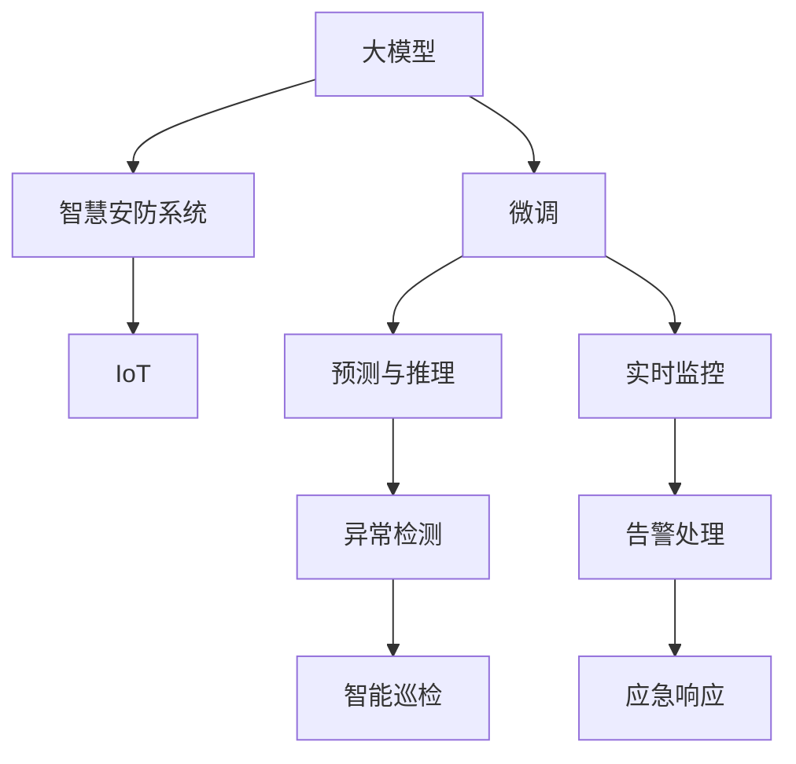

                 

## 1. 背景介绍

### 1.1 问题由来
智慧安防系统正成为城市管理中的重要组成部分，它通过融合人工智能、大数据、物联网等技术，实现对城市安全的全方位监测、预警和响应。然而，智慧安防系统面临的挑战也是多方面的：数据量巨大、实时性要求高、场景复杂、应用多样等。这些问题都需要通过技术创新来解决。

大模型技术的兴起为智慧安防提供了新的解决方案。通过预训练大模型，可以有效提升安防系统的预测和推理能力，降低系统开发和维护成本，提升整体的智能化水平。本文将探讨大模型技术如何赋能智慧安防，并分析创业者在这一领域的机遇与挑战。

### 1.2 问题核心关键点
本文将聚焦于大模型在智慧安防中的应用，涉及以下几个核心关键点：
1. 大模型的定义及其在智慧安防中的应用场景。
2. 大模型微调技术及其在智慧安防中的实现。
3. 智慧安防系统面临的技术挑战及其应对策略。
4. 创业者在智慧安防领域的发展机遇与策略。

## 2. 核心概念与联系

### 2.1 核心概念概述

为更好地理解大模型在智慧安防中的应用，本节将介绍几个密切相关的核心概念：

- 大模型（Large Model）：指经过大规模预训练的高性能神经网络模型，如BERT、GPT等。大模型具有强大的泛化能力和广泛的适用性，可应用于各种NLP任务。
- 微调（Fine-Tuning）：指在预训练模型的基础上，通过有监督学习进一步优化模型特定任务的性能。微调可以显著提升模型在特定任务上的效果。
- 智慧安防系统（Smart Security System）：指利用人工智能技术实现对城市安全的智能化监控、预警和响应的系统。
- 物联网（IoT）：指通过网络将各种物理设备连接起来，实现数据共享和协同工作。

这些核心概念之间的逻辑关系可以通过以下Mermaid流程图来展示：



这个流程图展示了大模型、微调与智慧安防系统的关系：

1. 大模型通过预训练获得基础的泛化能力。
2. 微调进一步优化模型，提升其在特定安防任务上的表现。
3. 智慧安防系统利用大模型微调技术，实现对物理世界的智能感知和响应。
4. 物联网为智慧安防系统提供数据输入和输出，实现设备间的协同工作。

## 3. 核心算法原理 & 具体操作步骤
### 3.1 算法原理概述

大模型在智慧安防中的应用主要涉及两大核心算法：

1. 目标检测（Object Detection）：指通过大模型识别图像中的物体位置和类别。
2. 行为识别（Action Recognition）：指通过大模型识别视频中人物的行为特征。

### 3.2 算法步骤详解

#### 3.2.1 目标检测

1. **数据准备**：
   - 收集大量的安防监控图像和标注数据。
   - 数据集包含正样本（目标物）和负样本（背景）。
   - 数据集需要涵盖多种不同的场景和光照条件。

2. **模型选择**：
   - 选择基于大模型的目标检测框架，如YOLO、Faster R-CNN等。
   - 这些框架支持多层次特征提取和候选框回归。

3. **预训练模型**：
   - 使用大规模无标注数据对大模型进行预训练。
   - 常用的预训练任务包括自回归任务、分类任务等。

4. **微调**：
   - 在大模型基础上，使用安防数据进行微调。
   - 微调过程中，使用交叉熵损失函数。
   - 微调结束后，模型在测试集上评估准确率和召回率。

5. **部署与优化**：
   - 将微调后的模型部署到安防系统中。
   - 优化模型推理速度和内存占用。
   - 引入GPU加速和量化技术。

#### 3.2.2 行为识别

1. **数据准备**：
   - 收集大量的安防监控视频和标注数据。
   - 数据集包含不同人物在不同情境下的行为数据。
   - 数据集需要涵盖多种不同的行为类别。

2. **模型选择**：
   - 选择基于大模型的行为识别框架，如C3D、I3D等。
   - 这些框架支持多层次特征提取和分类任务。

3. **预训练模型**：
   - 使用大规模无标注数据对大模型进行预训练。
   - 常用的预训练任务包括自回归任务、分类任务等。

4. **微调**：
   - 在大模型基础上，使用安防数据进行微调。
   - 微调过程中，使用交叉熵损失函数。
   - 微调结束后，模型在测试集上评估准确率和召回率。

5. **部署与优化**：
   - 将微调后的模型部署到安防系统中。
   - 优化模型推理速度和内存占用。
   - 引入GPU加速和量化技术。

### 3.3 算法优缺点

#### 3.3.1 优点

1. **泛化能力强**：大模型通过预训练获得了广泛的泛化能力，能在多种安防场景中表现优异。
2. **高效部署**：大模型微调后的模型可以通过参数高效微调或零样本学习实现高效部署，提升实时性。
3. **可解释性高**：大模型微调后的模型具有较高的可解释性，便于调试和优化。
4. **适应性强**：大模型微调后的模型能适应不同光照、角度和复杂环境，提高系统鲁棒性。

#### 3.3.2 缺点

1. **数据依赖**：大模型微调依赖大量标注数据，数据获取成本高。
2. **计算资源需求高**：大模型微调需要高性能计算资源，可能面临成本压力。
3. **实时性要求高**：大规模数据输入可能导致模型推理速度变慢，影响实时监控。
4. **维护难度大**：大模型微调后的模型可能需要不断更新和维护，系统复杂度增加。

### 3.4 算法应用领域

大模型微调技术在智慧安防中的应用领域主要包括以下几个方面：

1. **视频监控**：通过目标检测和行为识别，实现对视频监控的智能化分析，提高异常事件检测的准确性和实时性。
2. **智能巡检**：通过行为识别，实现对安防人员的巡检智能化，提升巡检效率和质量。
3. **异常检测**：通过目标检测和行为识别，实现对异常事件的快速检测和告警，提高应急响应速度。
4. **事件分析**：通过目标检测和行为识别，实现对安防事件的详细分析和报告，提升事件处理能力。

## 4. 数学模型和公式 & 详细讲解 & 举例说明

### 4.1 数学模型构建

本节将使用数学语言对大模型在智慧安防中的应用进行更加严格的刻画。

记目标检测任务为$T_{obj}$，行为识别任务为$T_{act}$，大模型为$M_{\theta}$，其中$\theta$为模型参数。

目标检测任务损失函数为：

$$
\mathcal{L}_{obj} = \frac{1}{N}\sum_{i=1}^N \mathcal{L}_{det}(\hat{y}_i,y_i)
$$

其中$\hat{y}_i$为模型输出，$y_i$为真实标签，$\mathcal{L}_{det}$为检测任务的损失函数。

行为识别任务损失函数为：

$$
\mathcal{L}_{act} = \frac{1}{N}\sum_{i=1}^N \mathcal{L}_{act}(\hat{y}_i,y_i)
$$

其中$\hat{y}_i$为模型输出，$y_i$为真实标签，$\mathcal{L}_{act}$为行为识别任务的损失函数。

### 4.2 公式推导过程

以目标检测任务为例，推导检测损失函数及其梯度的计算公式。

假设模型在输入$x$上的输出为$\hat{y}=M_{\theta}(x)$，表示目标物的位置和类别预测。真实标签$y \in \{0,1\}$，其中1表示目标物存在，0表示目标物不存在。则目标检测任务的二分类交叉熵损失函数定义为：

$$
\ell_{det}(\hat{y},y) = -[y\log \hat{y} + (1-y)\log (1-\hat{y})]
$$

将其代入经验风险公式，得：

$$
\mathcal{L}_{obj} = -\frac{1}{N}\sum_{i=1}^N [y_i\log M_{\theta}(x_i)+(1-y_i)\log(1-M_{\theta}(x_i))]
$$

根据链式法则，损失函数对参数$\theta_k$的梯度为：

$$
\frac{\partial \mathcal{L}_{obj}(\theta)}{\partial \theta_k} = -\frac{1}{N}\sum_{i=1}^N (\frac{y_i}{M_{\theta}(x_i)}-\frac{1-y_i}{1-M_{\theta}(x_i)}) \frac{\partial M_{\theta}(x_i)}{\partial \theta_k}
$$

其中$\frac{\partial M_{\theta}(x_i)}{\partial \theta_k}$可进一步递归展开，利用自动微分技术完成计算。

### 4.3 案例分析与讲解

以下我们以视频监控中的异常检测任务为例，分析如何利用大模型微调技术进行实时监控。

1. **数据准备**：
   - 收集安防监控视频，并对视频进行标注，标记异常事件发生的时间和位置。
   - 标注数据包含正样本和负样本，正样本为异常事件发生的视频片段，负样本为正常事件的视频片段。

2. **模型选择**：
   - 选择基于大模型的行为识别框架，如C3D、I3D等。
   - 这些框架支持多层次特征提取和分类任务。

3. **预训练模型**：
   - 使用大规模无标注视频数据对大模型进行预训练。
   - 常用的预训练任务包括自回归任务、分类任务等。

4. **微调**：
   - 在大模型基础上，使用安防数据进行微调。
   - 微调过程中，使用交叉熵损失函数。
   - 微调结束后，模型在测试集上评估准确率和召回率。

5. **部署与优化**：
   - 将微调后的模型部署到安防系统中。
   - 优化模型推理速度和内存占用。
   - 引入GPU加速和量化技术。

通过上述步骤，可以实现对安防视频中异常事件的快速检测和告警，提高应急响应速度和处理效率。

## 5. 项目实践：代码实例和详细解释说明

### 5.1 开发环境搭建

在进行安防系统微调实践前，我们需要准备好开发环境。以下是使用Python进行PyTorch开发的环境配置流程：

1. 安装Anaconda：从官网下载并安装Anaconda，用于创建独立的Python环境。

2. 创建并激活虚拟环境：
```bash
conda create -n pytorch-env python=3.8 
conda activate pytorch-env
```

3. 安装PyTorch：根据CUDA版本，从官网获取对应的安装命令。例如：
```bash
conda install pytorch torchvision torchaudio cudatoolkit=11.1 -c pytorch -c conda-forge
```

4. 安装Transformers库：
```bash
pip install transformers
```

5. 安装各类工具包：
```bash
pip install numpy pandas scikit-learn matplotlib tqdm jupyter notebook ipython
```

完成上述步骤后，即可在`pytorch-env`环境中开始微调实践。

### 5.2 源代码详细实现

下面我们以目标检测任务为例，给出使用Transformers库对BERT模型进行微调的PyTorch代码实现。

首先，定义目标检测任务的数据处理函数：

```python
from transformers import BertForDetection, BertTokenizerFast
from torch.utils.data import Dataset
import torch

class DetDataset(Dataset):
    def __init__(self, images, boxes, labels, tokenizer, max_len=128):
        self.images = images
        self.boxes = boxes
        self.labels = labels
        self.tokenizer = tokenizer
        self.max_len = max_len
        
    def __len__(self):
        return len(self.images)
    
    def __getitem__(self, item):
        image = self.images[item]
        boxes = self.boxes[item]
        labels = self.labels[item]
        
        encoding = self.tokenizer(image, return_tensors='pt', max_length=self.max_len, padding='max_length', truncation=True)
        input_ids = encoding['input_ids'][0]
        attention_mask = encoding['attention_mask'][0]
        
        # 对目标框进行编码
        encoded_boxes = [box for box in boxes] 
        encoded_boxes.extend([0.] * (self.max_len - len(encoded_boxes)))
        labels = torch.tensor(encoded_boxes, dtype=torch.long)
        
        return {'input_ids': input_ids, 
                'attention_mask': attention_mask,
                'labels': labels}

# 标签与id的映射
box2id = {0: 0}
id2box = {v: k for k, v in box2id.items()}

# 创建dataset
tokenizer = BertTokenizerFast.from_pretrained('bert-base-cased')

train_dataset = DetDataset(train_images, train_boxes, train_labels, tokenizer)
dev_dataset = DetDataset(dev_images, dev_boxes, dev_labels, tokenizer)
test_dataset = DetDataset(test_images, test_boxes, test_labels, tokenizer)
```

然后，定义模型和优化器：

```python
from transformers import BertForDetection, AdamW

model = BertForDetection.from_pretrained('bert-base-cased', num_labels=len(box2id))

optimizer = AdamW(model.parameters(), lr=2e-5)
```

接着，定义训练和评估函数：

```python
from torch.utils.data import DataLoader
from tqdm import tqdm
from sklearn.metrics import classification_report

device = torch.device('cuda') if torch.cuda.is_available() else torch.device('cpu')
model.to(device)

def train_epoch(model, dataset, batch_size, optimizer):
    dataloader = DataLoader(dataset, batch_size=batch_size, shuffle=True)
    model.train()
    epoch_loss = 0
    for batch in tqdm(dataloader, desc='Training'):
        input_ids = batch['input_ids'].to(device)
        attention_mask = batch['attention_mask'].to(device)
        labels = batch['labels'].to(device)
        model.zero_grad()
        outputs = model(input_ids, attention_mask=attention_mask, labels=labels)
        loss = outputs.loss
        epoch_loss += loss.item()
        loss.backward()
        optimizer.step()
    return epoch_loss / len(dataloader)

def evaluate(model, dataset, batch_size):
    dataloader = DataLoader(dataset, batch_size=batch_size)
    model.eval()
    preds, labels = [], []
    with torch.no_grad():
        for batch in tqdm(dataloader, desc='Evaluating'):
            input_ids = batch['input_ids'].to(device)
            attention_mask = batch['attention_mask'].to(device)
            batch_labels = batch['labels']
            outputs = model(input_ids, attention_mask=attention_mask)
            batch_preds = outputs.logits.argmax(dim=2).to('cpu').tolist()
            batch_labels = batch_labels.to('cpu').tolist()
            for pred_boxes, label_boxes in zip(batch_preds, batch_labels):
                pred_boxes = [id2box[_id] for _id in pred_boxes]
                label_boxes = [id2box[_id] for _id in label_boxes]
                preds.append(pred_boxes[:len(label_boxes)])
                labels.append(label_boxes)
                
    print(classification_report(labels, preds))
```

最后，启动训练流程并在测试集上评估：

```python
epochs = 5
batch_size = 16

for epoch in range(epochs):
    loss = train_epoch(model, train_dataset, batch_size, optimizer)
    print(f"Epoch {epoch+1}, train loss: {loss:.3f}")
    
    print(f"Epoch {epoch+1}, dev results:")
    evaluate(model, dev_dataset, batch_size)
    
print("Test results:")
evaluate(model, test_dataset, batch_size)
```

以上就是使用PyTorch对BERT进行目标检测任务微调的完整代码实现。可以看到，得益于Transformers库的强大封装，我们可以用相对简洁的代码完成BERT模型的加载和微调。

### 5.3 代码解读与分析

让我们再详细解读一下关键代码的实现细节：

**DetDataset类**：
- `__init__`方法：初始化图像、目标框和标签等关键组件。
- `__len__`方法：返回数据集的样本数量。
- `__getitem__`方法：对单个样本进行处理，将图像输入编码为token ids，将目标框编码为数字，并对其进行定长padding，最终返回模型所需的输入。

**box2id和id2box字典**：
- 定义了目标框与数字id之间的映射关系，用于将token-wise的预测结果解码回真实的标签。

**训练和评估函数**：
- 使用PyTorch的DataLoader对数据集进行批次化加载，供模型训练和推理使用。
- 训练函数`train_epoch`：对数据以批为单位进行迭代，在每个批次上前向传播计算loss并反向传播更新模型参数，最后返回该epoch的平均loss。
- 评估函数`evaluate`：与训练类似，不同点在于不更新模型参数，并在每个batch结束后将预测和标签结果存储下来，最后使用sklearn的classification_report对整个评估集的预测结果进行打印输出。

**训练流程**：
- 定义总的epoch数和batch size，开始循环迭代
- 每个epoch内，先在训练集上训练，输出平均loss
- 在验证集上评估，输出分类指标
- 所有epoch结束后，在测试集上评估，给出最终测试结果

可以看到，PyTorch配合Transformers库使得BERT微调的目标检测任务的代码实现变得简洁高效。开发者可以将更多精力放在数据处理、模型改进等高层逻辑上，而不必过多关注底层的实现细节。

当然，工业级的系统实现还需考虑更多因素，如模型的保存和部署、超参数的自动搜索、更灵活的任务适配层等。但核心的微调范式基本与此类似。

## 6. 实际应用场景

### 6.1 智能监控系统

基于大模型微调的智能监控系统可以实现对安防视频的高效分析，提高异常事件的检测准确性和实时性。通过目标检测和行为识别，系统可以自动识别异常事件并触发告警，提高应急响应速度。

在技术实现上，可以收集安防监控视频，并将其标注为正常和异常事件。在此基础上对预训练模型进行微调，使其能够自动识别异常事件。微调后的模型可以实时分析监控视频，检测并标注异常事件，并发送告警信息至安保人员进行处理。

### 6.2 智能门禁系统

智能门禁系统可以通过大模型微调实现对人员和车辆的智能识别和管理。通过行为识别，系统可以判断来访人员或车辆的身份，并进行权限验证和记录。

在技术实现上，可以收集门禁系统的进出记录，并将人员和车辆信息标注为正常和异常。在此基础上对预训练模型进行微调，使其能够自动识别异常行为并触发告警，提高门禁系统的安全性。

### 6.3 智慧消防系统

智慧消防系统可以通过大模型微调实现对火警事件的智能监测和响应。通过目标检测和行为识别，系统可以实时监测火灾隐患，并触发预警和报警，提高应急响应速度。

在技术实现上，可以收集火灾报警数据，并将火警事件标注为正常和异常。在此基础上对预训练模型进行微调，使其能够自动识别火灾隐患并触发预警，提高消防系统的反应速度。

### 6.4 未来应用展望

随着大模型和微调技术的不断发展，基于微调范式将在更多领域得到应用，为传统行业带来变革性影响。

在智慧城市治理中，基于大模型微调的智能监控系统可以实现对城市安全的全方位监测、预警和响应，提高城市管理的智能化水平。

在智慧医疗领域，基于大模型微调的智能诊断系统可以实现对患者病情的智能分析，提高诊断的准确性和效率。

在智能交通领域，基于大模型微调的智能交通系统可以实现对交通事件的智能监测和预警，提高交通管理的智能化水平。

此外，在智慧农业、智慧环保、智慧教育等众多领域，基于大模型微调的人工智能应用也将不断涌现，为传统行业带来新的技术突破。

## 7. 工具和资源推荐
### 7.1 学习资源推荐

为了帮助开发者系统掌握大模型微调的理论基础和实践技巧，这里推荐一些优质的学习资源：

1. 《Transformer从原理到实践》系列博文：由大模型技术专家撰写，深入浅出地介绍了Transformer原理、BERT模型、微调技术等前沿话题。

2. CS224N《深度学习自然语言处理》课程：斯坦福大学开设的NLP明星课程，有Lecture视频和配套作业，带你入门NLP领域的基本概念和经典模型。

3. 《Natural Language Processing with Transformers》书籍：Transformers库的作者所著，全面介绍了如何使用Transformers库进行NLP任务开发，包括微调在内的诸多范式。

4. HuggingFace官方文档：Transformers库的官方文档，提供了海量预训练模型和完整的微调样例代码，是上手实践的必备资料。

5. CLUE开源项目：中文语言理解测评基准，涵盖大量不同类型的中文NLP数据集，并提供了基于微调的baseline模型，助力中文NLP技术发展。

通过对这些资源的学习实践，相信你一定能够快速掌握大模型微调的精髓，并用于解决实际的NLP问题。
###  7.2 开发工具推荐

高效的开发离不开优秀的工具支持。以下是几款用于大模型微调开发的常用工具：

1. PyTorch：基于Python的开源深度学习框架，灵活动态的计算图，适合快速迭代研究。大部分预训练语言模型都有PyTorch版本的实现。

2. TensorFlow：由Google主导开发的开源深度学习框架，生产部署方便，适合大规模工程应用。同样有丰富的预训练语言模型资源。

3. Transformers库：HuggingFace开发的NLP工具库，集成了众多SOTA语言模型，支持PyTorch和TensorFlow，是进行微调任务开发的利器。

4. Weights & Biases：模型训练的实验跟踪工具，可以记录和可视化模型训练过程中的各项指标，方便对比和调优。与主流深度学习框架无缝集成。

5. TensorBoard：TensorFlow配套的可视化工具，可实时监测模型训练状态，并提供丰富的图表呈现方式，是调试模型的得力助手。

6. Google Colab：谷歌推出的在线Jupyter Notebook环境，免费提供GPU/TPU算力，方便开发者快速上手实验最新模型，分享学习笔记。

合理利用这些工具，可以显著提升大模型微调任务的开发效率，加快创新迭代的步伐。

### 7.3 相关论文推荐

大模型和微调技术的发展源于学界的持续研究。以下是几篇奠基性的相关论文，推荐阅读：

1. Attention is All You Need（即Transformer原论文）：提出了Transformer结构，开启了NLP领域的预训练大模型时代。

2. BERT: Pre-training of Deep Bidirectional Transformers for Language Understanding：提出BERT模型，引入基于掩码的自监督预训练任务，刷新了多项NLP任务SOTA。

3. Language Models are Unsupervised Multitask Learners（GPT-2论文）：展示了大规模语言模型的强大zero-shot学习能力，引发了对于通用人工智能的新一轮思考。

4. Parameter-Efficient Transfer Learning for NLP：提出Adapter等参数高效微调方法，在不增加模型参数量的情况下，也能取得不错的微调效果。

5. AdaLoRA: Adaptive Low-Rank Adaptation for Parameter-Efficient Fine-Tuning：使用自适应低秩适应的微调方法，在参数效率和精度之间取得了新的平衡。

这些论文代表了大模型微调技术的发展脉络。通过学习这些前沿成果，可以帮助研究者把握学科前进方向，激发更多的创新灵感。

## 8. 总结：未来发展趋势与挑战

### 8.1 总结

本文对大模型在智慧安防中的应用进行了全面系统的介绍。首先阐述了大模型微调技术的定义及其在智慧安防中的应用场景，明确了微调在提升安防系统性能方面的独特价值。其次，从原理到实践，详细讲解了大模型微调的过程，给出了微调任务开发的完整代码实例。同时，本文还广泛探讨了大模型微调在智慧安防中的应用场景，展示了其巨大的应用潜力。最后，本文精选了微调技术的各类学习资源，力求为读者提供全方位的技术指引。

通过本文的系统梳理，可以看到，大模型微调技术正在成为智慧安防系统的重要范式，极大地拓展了安防系统的智能化水平。受益于大规模语料的预训练，微调模型以更低的时间和标注成本，在小样本条件下也能取得不俗的效果，有力推动了安防系统的产业化进程。未来，伴随大模型和微调方法的持续演进，基于微调范式必将在更多领域得到应用，为智慧城市管理带来新的变革。

### 8.2 未来发展趋势

展望未来，大模型微调技术在智慧安防领域将呈现以下几个发展趋势：

1. 模型规模持续增大。随着算力成本的下降和数据规模的扩张，预训练语言模型的参数量还将持续增长。超大规模语言模型蕴含的丰富语言知识，有望支撑更加复杂多变的安防任务微调。

2. 微调方法日趋多样。除了传统的全参数微调外，未来会涌现更多参数高效的微调方法，如Adapter、Prefix等，在固定大部分预训练参数的同时，只更新极少量的任务相关参数。同时优化微调模型的计算图，减少前向传播和反向传播的资源消耗，实现更加轻量级、实时性的部署。

3. 持续学习成为常态。随着数据分布的不断变化，微调模型也需要持续学习新知识以保持性能。如何在不遗忘原有知识的同时，高效吸收新样本信息，将成为重要的研究课题。

4. 标注样本需求降低。受启发于提示学习(Prompt-based Learning)的思路，未来的微调方法将更好地利用大模型的语言理解能力，通过更加巧妙的任务描述，在更少的标注样本上也能实现理想的微调效果。

5. 实时性要求提升。随着智慧安防系统对实时性的要求不断提高，微调模型的推理速度和资源占用也将成为重要的优化目标。通过引入GPU加速和量化技术，可以显著提升模型的实时性。

6. 模型通用性增强。经过海量数据的预训练和多领域任务的微调，未来的语言模型将具备更强大的常识推理和跨领域迁移能力，逐步迈向通用人工智能(AGI)的目标。

以上趋势凸显了大模型微调技术在智慧安防领域的应用前景。这些方向的探索发展，必将进一步提升安防系统的性能和应用范围，为智慧城市管理提供新的技术路径。

### 8.3 面临的挑战

尽管大模型微调技术已经取得了瞩目成就，但在迈向更加智能化、普适化应用的过程中，它仍面临着诸多挑战：

1. 数据获取成本高。大模型微调依赖大量标注数据，获取高质量标注数据的成本较高，尤其是在安防领域，数据获取更为困难。如何通过数据增强、半监督学习等技术，降低数据获取成本，是未来重要的研究方向。

2. 计算资源需求高。大模型微调需要高性能计算资源，可能面临成本压力。如何通过模型压缩、量化等技术，降低模型推理的计算资源消耗，是未来需要重点解决的问题。

3. 实时性要求高。大规模数据输入可能导致模型推理速度变慢，影响实时监控。如何通过优化模型结构、引入GPU加速等技术，提高模型推理速度，是未来重要的研究方向。

4. 模型鲁棒性不足。当前微调模型面对域外数据时，泛化性能往往大打折扣。对于测试样本的微小扰动，微调模型的预测也容易发生波动。如何提高微调模型的鲁棒性，避免灾难性遗忘，还需要更多理论和实践的积累。

5. 系统复杂度增加。大模型微调后的模型可能需要不断更新和维护，系统复杂度增加。如何通过模型裁剪、服务化封装等技术，简化系统复杂度，是未来需要重点解决的问题。

6. 模型可解释性不足。当前微调模型更像是"黑盒"系统，难以解释其内部工作机制和决策逻辑。对于高风险应用，算法的可解释性和可审计性尤为重要。如何赋予微调模型更强的可解释性，将是亟待攻克的难题。

7. 安全性有待保障。预训练语言模型难免会学习到有偏见、有害的信息，通过微调传递到下游任务，产生误导性、歧视性的输出，给实际应用带来安全隐患。如何从数据和算法层面消除模型偏见，避免恶意用途，确保输出的安全性，也将是重要的研究课题。

8. 知识整合能力不足。现有的微调模型往往局限于任务内数据，难以灵活吸收和运用更广泛的先验知识。如何让微调过程更好地与外部知识库、规则库等专家知识结合，形成更加全面、准确的信息整合能力，还有很大的想象空间。

这些挑战凸显了大模型微调技术在智慧安防领域的复杂性。然而，正是这些挑战，推动了技术不断进步和创新，为未来的研究和发展提供了新的方向和动力。

### 8.4 研究展望

面对大模型微调在智慧安防领域所面临的挑战，未来的研究需要在以下几个方面寻求新的突破：

1. 探索无监督和半监督微调方法。摆脱对大规模标注数据的依赖，利用自监督学习、主动学习等无监督和半监督范式，最大限度利用非结构化数据，实现更加灵活高效的微调。

2. 研究参数高效和计算高效的微调范式。开发更加参数高效的微调方法，在固定大部分预训练参数的同时，只更新极少量的任务相关参数。同时优化微调模型的计算图，减少前向传播和反向传播的资源消耗，实现更加轻量级、实时性的部署。

3. 引入因果和对比学习范式。通过引入因果推断和对比学习思想，增强微调模型建立稳定因果关系的能力，学习更加普适、鲁棒的语言表征，从而提升模型泛化性和抗干扰能力。

4. 纳入伦理道德约束。在模型训练目标中引入伦理导向的评估指标，过滤和惩罚有偏见、有害的输出倾向。同时加强人工干预和审核，建立模型行为的监管机制，确保输出符合人类价值观和伦理道德。

5. 引入更多先验知识。将符号化的先验知识，如知识图谱、逻辑规则等，与神经网络模型进行巧妙融合，引导微调过程学习更准确、合理的语言模型。同时加强不同模态数据的整合，实现视觉、语音等多模态信息与文本信息的协同建模。

6. 结合因果分析和博弈论工具。将因果分析方法引入微调模型，识别出模型决策的关键特征，增强输出解释的因果性和逻辑性。借助博弈论工具刻画人机交互过程，主动探索并规避模型的脆弱点，提高系统稳定性。

7. 纳入伦理道德约束。在模型训练目标中引入伦理导向的评估指标，过滤和惩罚有偏见、有害的输出倾向。同时加强人工干预和审核，建立模型行为的监管机制，确保输出符合人类价值观和伦理道德。

这些研究方向的探索，必将引领大模型微调技术迈向更高的台阶，为构建安全、可靠、可解释、可控的智能系统铺平道路。面向未来，大模型微调技术还需要与其他人工智能技术进行更深入的融合，如知识表示、因果推理、强化学习等，多路径协同发力，共同推动智慧安防系统的发展。只有勇于创新、敢于突破，才能不断拓展语言模型的边界，让智能技术更好地造福智慧安防系统。

## 9. 附录：常见问题与解答

**Q1：大模型微调是否适用于所有安防任务？**

A: 大模型微调在大多数安防任务上都能取得不错的效果，特别是对于数据量较小的任务。但对于一些特定领域的任务，如医学、法律等，仅仅依靠通用语料预训练的模型可能难以很好地适应。此时需要在特定领域语料上进一步预训练，再进行微调，才能获得理想效果。

**Q2：微调过程中如何选择合适的学习率？**

A: 微调的学习率一般要比预训练时小1-2个数量级，如果使用过大的学习率，容易破坏预训练权重，导致过拟合。一般建议从1e-5开始调参，逐步减小学习率，直至收敛。也可以使用warmup策略，在开始阶段使用较小的学习率，再逐渐过渡到预设值。需要注意的是，不同的优化器(如AdamW、Adafactor等)以及不同的学习率调度策略，可能需要设置不同的学习率阈值。

**Q3：采用大模型微调时会面临哪些资源瓶颈？**

A: 目前主流的预训练大模型动辄以亿计的参数规模，对算力、内存、存储都提出了很高的要求。GPU/TPU等高性能设备是必不可少的，但即便如此，超大批次的训练和推理也可能遇到显存不足的问题。因此需要采用一些资源优化技术，如梯度积累、混合精度训练、模型并行等，来突破硬件瓶颈。同时，模型的存储和读取也可能占用大量时间和空间，需要采用模型压缩、稀疏化存储等方法进行优化。

**Q4：如何缓解微调过程中的过拟合问题？**

A: 过拟合是微调面临的主要挑战，尤其是在标注数据不足的情况下。常见的缓解策略包括：
1. 数据增强：通过回译、近义替换等方式扩充训练集
2. 正则化：使用L2正则、Dropout、Early Stopping等避免过拟合
3. 对抗训练：引入对抗样本，提高模型鲁棒性
4. 参数高效微调：只调整少量参数(如Adapter、Prefix等)，减小过拟合风险
5. 多模型集成：训练多个微调模型，取平均输出，抑制过拟合

这些策略往往需要根据具体任务和数据特点进行灵活组合。只有在数据、模型、训练、推理等各环节进行全面优化，才能最大限度地发挥大模型微调的威力。

**Q5：微调模型在落地部署时需要注意哪些问题？**

A: 将微调模型转化为实际应用，还需要考虑以下因素：
1. 模型裁剪：去除不必要的层和参数，减小模型尺寸，加快推理速度
2. 量化加速：将浮点模型转为定点模型，压缩存储空间，提高计算效率
3. 服务化封装：将模型封装为标准化服务接口，便于集成调用
4. 弹性伸缩：根据请求流量动态调整资源配置，平衡服务质量和成本
5. 监控告警：实时采集系统指标，设置异常告警阈值，确保服务稳定性
6. 安全防护：采用访问鉴权、数据脱敏等措施，保障数据和模型安全

大模型微调为安防系统提供了新的解决方案，但如何将强大的性能转化为稳定、高效、安全的业务价值，还需要工程实践的不断打磨。唯有从数据、算法、工程、业务等多个维度协同发力，才能真正实现人工智能技术在垂直行业的规模化落地。总之，微调需要开发者根据具体任务，不断迭代和优化模型、数据和算法，方能得到理想的效果。

---

作者：禅与计算机程序设计艺术 / Zen and the Art of Computer Programming

