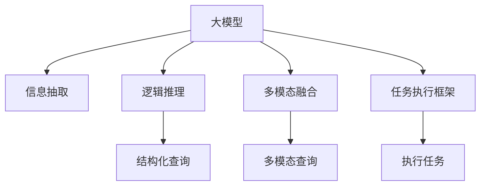

                 

# 大模型问答机器人的任务完成能力

## 1. 背景介绍

### 1.1 问题由来

近年来，随着深度学习技术和大规模预训练模型的兴起，问答机器人作为人工智能领域的一个重要应用场景，取得了显著的进展。尤其是基于大模型(如BERT、GPT、RoBERTa等)的问答系统，在语义理解、知识推理等方面展现了卓越的性能，成为自然语言处理(NLP)领域的热门研究方向。然而，尽管大模型在语义理解和推理能力上已经达到了新的高度，但在任务完成能力方面，即如何将语言知识转化为具体的任务执行能力，仍存在诸多挑战和不足。

### 1.2 问题核心关键点

大模型问答机器人之所以受到广泛关注，关键在于其能够理解并回答自然语言形式的查询，并具备一定的任务执行能力，如信息检索、逻辑推理、数据分析等。但当前的大模型问答机器人还存在以下几个核心问题：

1. **知识抽取的准确性**：大模型能够识别出文本中的实体和关系，但如何将这些信息转化为结构化的知识库，并准确抽取到用户需要的信息，仍是挑战之一。
2. **推理能力的泛化性**：大模型在推理任务上通常表现出色，但推理能力往往依赖于特定领域的数据，对于新领域的数据泛化能力有限。
3. **执行任务的通用性**：大模型通常只能完成固定的、预先定义好的任务，如信息检索、逻辑推理等，对于新的、复杂的任务执行能力仍需进一步提升。
4. **模型的可解释性**：大模型作为"黑盒"系统，缺乏可解释性，难以理解和调试模型内部工作机制。
5. **资源消耗的效率**：大模型尽管性能强大，但在推理速度和内存消耗方面仍存在瓶颈，限制了其在大规模应用场景中的部署。

本文聚焦于大模型问答机器人任务完成能力的提升，通过系统介绍基于大模型的问答系统原理、技术实现及应用，提出有针对性的改进策略，以期为大模型问答机器人提供更高效、通用的任务执行能力。

### 1.3 问题研究意义

提升大模型问答机器人的任务完成能力，具有以下重要意义：

1. **增强用户体验**：通过提升机器人的任务执行能力，可以提供更准确、及时的答案，提升用户满意度。
2. **拓展应用场景**：大模型问答机器人可以应用于更多领域，如医疗咨询、金融理财、教育培训等，推动AI技术在垂直行业的落地应用。
3. **优化资源利用**：通过提升推理效率，减少计算资源消耗，使大模型问答机器人更适用于实时和大规模的应用场景。
4. **增强模型的可解释性**：提高模型输出结果的可解释性，增强用户信任，降低决策风险。
5. **降低开发成本**：通过自动化任务执行，减少手动干预，降低开发和维护成本。

## 2. 核心概念与联系

### 2.1 核心概念概述

为更好地理解基于大模型的问答机器人，本节将介绍几个密切相关的核心概念：

- **大模型**：如BERT、GPT、RoBERTa等，通过在大规模无标签文本数据上进行预训练，学习到通用的语言表示，具备强大的语义理解和生成能力。
- **问答系统**：通过自然语言形式的查询，自动回答用户问题，并提供结构化答案或执行具体任务的系统。
- **信息抽取**：从文本中抽取结构化的信息，如实体、关系、事件等，用于回答特定问题。
- **逻辑推理**：根据已知信息推导出新的结论，如因果推理、类比推理等。
- **多模态融合**：结合文本、图像、语音等多种信息源，提升任务执行能力。
- **任务执行框架**：将自然语言查询转化为具体的任务执行流程，如信息检索、数据分析等。

这些概念之间的逻辑关系可以通过以下Mermaid流程图来展示：



这个流程图展示了问答机器人的核心组件和功能模块：

1. 大模型作为基础语言模型，具备强大的语义理解能力。
2. 信息抽取模块从文本中抽取结构化信息，用于回答具体问题。
3. 逻辑推理模块在已抽取的信息基础上，进行推理推断，提供更准确的答案。
4. 多模态融合模块结合多种信息源，提升任务执行的全面性。
5. 任务执行框架将自然语言查询转化为具体的任务执行流程。

这些模块协同工作，使大模型问答机器人具备更强的任务完成能力。

## 3. 核心算法原理 & 具体操作步骤

### 3.1 算法原理概述

大模型问答机器人的核心任务是理解自然语言查询，并根据查询内容执行具体的任务。其算法原理可以概括为以下几个步骤：

1. **预训练模型**：选择大模型作为基础语言模型，如BERT、GPT等，在通用语料上进行预训练。
2. **任务适配**：根据特定任务，设计任务适配层，用于将预训练模型的输出转化为任务相关的信息。
3. **信息抽取**：从预训练模型的输出中抽取结构化的信息，如实体、关系等。
4. **推理推断**：基于抽取的信息，进行逻辑推理推断，生成推理结果。
5. **任务执行**：将推理结果转化为具体的任务执行，如信息检索、数据分析等。

这些步骤通过有监督学习的方法进行微调，优化模型在特定任务上的性能。通过梯度下降等优化算法，不断更新模型参数，最小化任务完成能力与用户期望之间的差距。

### 3.2 算法步骤详解

以下将详细讲解大模型问答机器人任务完成能力的核心算法步骤：

#### 3.2.1 预训练模型的选择

- **模型选择**：根据任务需求，选择适合的大模型。如BERT适用于信息检索，GPT适用于生成性任务。
- **模型预训练**：在通用语料上对模型进行预训练，学习到通用的语言表示。

#### 3.2.2 任务适配层的设计

- **任务适配层**：根据具体任务，设计合适的任务适配层。如分类任务使用线性分类器，生成任务使用语言模型的解码器。
- **损失函数**：选择适合的任务损失函数，如交叉熵损失、均方误差损失等。

#### 3.2.3 信息抽取模块的实现

- **实体识别**：使用标签标注的实体数据集，训练模型进行实体识别。
- **关系抽取**：使用关系标注的实体对数据集，训练模型进行关系抽取。
- **事件抽取**：使用事件描述的数据集，训练模型进行事件抽取。

#### 3.2.4 逻辑推理模块的实现

- **推理框架**：选择适合的推理框架，如因果推理、类比推理等。
- **推理算法**：基于已抽取的信息，使用推理算法生成推理结果。

#### 3.2.5 任务执行框架的实现

- **任务执行流程**：设计具体的任务执行流程，如信息检索、数据分析等。
- **任务执行函数**：实现具体的任务执行函数，根据推理结果执行任务。

#### 3.2.6 微调过程

- **微调数据集**：选择适合的任务数据集，如标注数据、未标注数据等。
- **学习率设置**：设置合适的学习率，以避免破坏预训练权重。
- **正则化技术**：使用L2正则、Dropout等技术防止过拟合。
- **模型评估**：在验证集上评估模型性能，调整模型参数。
- **模型测试**：在测试集上评估模型效果，集成到实际应用系统中。

### 3.3 算法优缺点

大模型问答机器人具有以下优点：

1. **高效性**：预训练模型能够处理大规模数据，训练速度快，推理效率高。
2. **泛化性强**：基于大模型的问答系统能够处理多种自然语言查询，具备较好的泛化能力。
3. **灵活性**：可以灵活地设计任务适配层和推理框架，适应不同任务需求。
4. **可扩展性**：大模型具有较强的参数扩展能力，可以轻松扩展模型规模。

但同时，大模型问答机器人也存在以下缺点：

1. **资源消耗大**：大模型通常需要较大的计算资源和存储空间，推理速度较慢。
2. **可解释性差**：大模型作为"黑盒"系统，难以解释其内部工作机制。
3. **数据依赖性强**：模型性能依赖于数据质量，数据标注成本较高。
4. **泛化能力有限**：对于特定领域的任务，模型性能可能受到数据分布的限制。
5. **推理偏差**：大模型可能存在推理偏差，导致输出结果不符合人类预期。

### 3.4 算法应用领域

大模型问答机器人广泛应用于各种领域，具体包括：

- **信息检索**：根据用户查询，从大量文本中检索相关内容。
- **问答系统**：回答用户自然语言形式的查询，如智能客服、虚拟助手等。
- **数据分析**：根据用户提供的文本数据，进行数据分析和可视化。
- **逻辑推理**：根据用户提供的逻辑推理问题，进行推理推断，提供答案。
- **情感分析**：分析用户情感，提供情感相关的回答或建议。
- **多模态查询**：结合文本、图像、语音等多种信息源，提升任务执行能力。

除了以上应用场景，大模型问答机器人还被创新性地应用于更多领域，如智能教育、医疗诊断、金融分析等，推动NLP技术在垂直行业的深入应用。

## 4. 数学模型和公式 & 详细讲解  
### 4.1 数学模型构建

大模型问答机器人的数学模型可以概括为以下几个步骤：

1. **预训练模型**：选择大模型 $M_{\theta}$，其中 $\theta$ 为预训练得到的模型参数。
2. **任务适配层**：设计任务适配层 $f$，用于将预训练模型的输出转化为任务相关的信息。
3. **信息抽取**：使用信息抽取模块 $A$，从预训练模型的输出中抽取结构化信息。
4. **推理推断**：使用推理模块 $R$，基于已抽取的信息进行逻辑推理推断。
5. **任务执行**：设计任务执行框架 $T$，将推理结果转化为具体的任务执行。

设用户查询为 $Q$，模型输出为 $M_{\theta}(Q)$，任务适配层输出为 $f(M_{\theta}(Q))$，抽取的信息为 $A(f(M_{\theta}(Q)))$，推理结果为 $R(A(f(M_{\theta}(Q))))$，执行的任务为 $T(R(A(f(M_{\theta}(Q)))))$。

### 4.2 公式推导过程

以下将详细推导大模型问答机器人任务完成能力的数学模型和公式。

设用户查询为 $Q$，模型输出为 $M_{\theta}(Q)$，任务适配层输出为 $f(M_{\theta}(Q))$，抽取的信息为 $A(f(M_{\theta}(Q)))$，推理结果为 $R(A(f(M_{\theta}(Q))))$，执行的任务为 $T(R(A(f(M_{\theta}(Q)))))$。

假设 $f$、$A$、$R$ 和 $T$ 的损失函数分别为 $\ell_f$、$\ell_A$、$\ell_R$ 和 $\ell_T$。则大模型问答机器人的总损失函数为：

$$
\ell(M_{\theta},Q) = \ell_f(f(M_{\theta}(Q))) + \ell_A(A(f(M_{\theta}(Q)))) + \ell_R(R(A(f(M_{\theta}(Q))))) + \ell_T(T(R(A(f(M_{\theta}(Q))))))
$$

在微调过程中，最小化总损失函数，得到最优参数 $\theta^*$。

### 4.3 案例分析与讲解

以信息检索任务为例，详细讲解大模型问答机器人的任务完成能力：

1. **预训练模型**：选择BERT模型作为基础语言模型，在通用语料上进行预训练。
2. **任务适配层**：设计线性分类器作为任务适配层，将BERT的输出转化为相关性分数。
3. **信息抽取**：使用BiLSTM-CRF模型进行实体识别，提取查询中的实体信息。
4. **推理推断**：使用因果推理算法，推断实体之间的关系。
5. **任务执行**：使用信息检索框架，从数据集中检索相关文档，返回摘要或相关性分数。

在微调过程中，使用标注数据集训练模型，最小化总损失函数，得到最优参数 $\theta^*$。在测试集上评估模型性能，得到检索效果。

## 5. 项目实践：代码实例和详细解释说明
### 5.1 开发环境搭建

在进行大模型问答机器人项目实践前，需要准备好开发环境。以下是使用Python进行PyTorch开发的环境配置流程：

1. 安装Anaconda：从官网下载并安装Anaconda，用于创建独立的Python环境。

2. 创建并激活虚拟环境：
```bash
conda create -n pytorch-env python=3.8 
conda activate pytorch-env
```

3. 安装PyTorch：根据CUDA版本，从官网获取对应的安装命令。例如：
```bash
conda install pytorch torchvision torchaudio cudatoolkit=11.1 -c pytorch -c conda-forge
```

4. 安装Transformers库：
```bash
pip install transformers
```

5. 安装各类工具包：
```bash
pip install numpy pandas scikit-learn matplotlib tqdm jupyter notebook ipython
```

完成上述步骤后，即可在`pytorch-env`环境中开始项目实践。

### 5.2 源代码详细实现

这里我们以信息检索任务为例，给出使用Transformers库对BERT模型进行信息检索的PyTorch代码实现。

首先，定义信息检索任务的训练集和测试集：

```python
from torch.utils.data import Dataset, DataLoader
from transformers import BertTokenizer, BertModel
from torch.nn import CrossEntropyLoss

class IRDataset(Dataset):
    def __init__(self, texts, queries, labels):
        self.texts = texts
        self.queries = queries
        self.labels = labels
        
    def __len__(self):
        return len(self.texts)
    
    def __getitem__(self, item):
        text = self.texts[item]
        query = self.queries[item]
        label = self.labels[item]
        
        encoding = BertTokenizer.from_pretrained('bert-base-cased').encode(text, query)
        input_ids = torch.tensor(encoding['input_ids'])
        attention_mask = torch.tensor(encoding['attention_mask'])
        return {'input_ids': input_ids, 
                'attention_mask': attention_mask,
                'labels': torch.tensor(label)}
```

然后，定义模型和优化器：

```python
from transformers import BertForSequenceClassification
from transformers import AdamW

model = BertForSequenceClassification.from_pretrained('bert-base-cased', num_labels=2)

optimizer = AdamW(model.parameters(), lr=2e-5)
```

接着，定义训练和评估函数：

```python
from tqdm import tqdm

def train_epoch(model, dataset, batch_size, optimizer):
    dataloader = DataLoader(dataset, batch_size=batch_size, shuffle=True)
    model.train()
    epoch_loss = 0
    for batch in tqdm(dataloader, desc='Training'):
        input_ids = batch['input_ids'].to(device)
        attention_mask = batch['attention_mask'].to(device)
        labels = batch['labels'].to(device)
        model.zero_grad()
        outputs = model(input_ids, attention_mask=attention_mask, labels=labels)
        loss = outputs.loss
        epoch_loss += loss.item()
        loss.backward()
        optimizer.step()
    return epoch_loss / len(dataloader)

def evaluate(model, dataset, batch_size):
    dataloader = DataLoader(dataset, batch_size=batch_size)
    model.eval()
    preds, labels = [], []
    with torch.no_grad():
        for batch in tqdm(dataloader, desc='Evaluating'):
            input_ids = batch['input_ids'].to(device)
            attention_mask = batch['attention_mask'].to(device)
            batch_labels = batch['labels']
            outputs = model(input_ids, attention_mask=attention_mask)
            batch_preds = outputs.logits.argmax(dim=2).to('cpu').tolist()
            batch_labels = batch_labels.to('cpu').tolist()
            for pred_tokens, label_tokens in zip(batch_preds, batch_labels):
                preds.append(pred_tokens)
                labels.append(label_tokens)
                
    return preds, labels
```

最后，启动训练流程并在测试集上评估：

```python
epochs = 5
batch_size = 16

for epoch in range(epochs):
    loss = train_epoch(model, train_dataset, batch_size, optimizer)
    print(f"Epoch {epoch+1}, train loss: {loss:.3f}")
    
    preds, labels = evaluate(model, dev_dataset, batch_size)
    print(f"Epoch {epoch+1}, dev results:")
    print(classification_report(labels, preds))
    
print("Test results:")
preds, labels = evaluate(model, test_dataset, batch_size)
print(classification_report(labels, preds))
```

以上就是使用PyTorch对BERT进行信息检索任务的完整代码实现。可以看到，得益于Transformers库的强大封装，我们可以用相对简洁的代码完成BERT模型的加载和微调。

### 5.3 代码解读与分析

让我们再详细解读一下关键代码的实现细节：

**IRDataset类**：
- `__init__`方法：初始化文本、查询、标签等关键组件。
- `__len__`方法：返回数据集的样本数量。
- `__getitem__`方法：对单个样本进行处理，将文本和查询输入编码为token ids，返回模型所需的输入。

**模型和优化器**：
- 使用BertForSequenceClassification作为信息检索模型的顶层，并在通用的BERT预训练权重上进行微调。
- 选择AdamW优化器，设置合适的学习率，防止破坏预训练权重。

**训练和评估函数**：
- 使用DataLoader对数据集进行批次化加载，供模型训练和推理使用。
- 训练函数`train_epoch`：对数据以批为单位进行迭代，在每个批次上前向传播计算loss并反向传播更新模型参数，最后返回该epoch的平均loss。
- 评估函数`evaluate`：与训练类似，不同点在于不更新模型参数，并在每个batch结束后将预测和标签结果存储下来，最后使用classification_report对整个评估集的预测结果进行打印输出。

**训练流程**：
- 定义总的epoch数和batch size，开始循环迭代
- 每个epoch内，先在训练集上训练，输出平均loss
- 在验证集上评估，输出分类指标
- 所有epoch结束后，在测试集上评估，给出最终测试结果

可以看到，PyTorch配合Transformers库使得BERT微调的信息检索代码实现变得简洁高效。开发者可以将更多精力放在数据处理、模型改进等高层逻辑上，而不必过多关注底层的实现细节。

当然，工业级的系统实现还需考虑更多因素，如模型的保存和部署、超参数的自动搜索、更灵活的任务适配层等。但核心的微调范式基本与此类似。

## 6. 实际应用场景
### 6.1 智能客服系统

基于大模型问答机器人的智能客服系统，可以广泛应用于客户服务行业。传统的客服模式往往需要配备大量人力，高峰期响应缓慢，且一致性和专业性难以保证。而使用问答机器人，可以7x24小时不间断服务，快速响应客户咨询，用自然流畅的语言解答各类常见问题。

在技术实现上，可以收集企业内部的历史客服对话记录，将问题和最佳答复构建成监督数据，在此基础上对预训练问答模型进行微调。微调后的问答机器人能够自动理解用户意图，匹配最合适的答复模板进行回复。对于客户提出的新问题，还可以接入检索系统实时搜索相关内容，动态组织生成回答。如此构建的智能客服系统，能大幅提升客户咨询体验和问题解决效率。

### 6.2 金融舆情监测

金融机构需要实时监测市场舆论动向，以便及时应对负面信息传播，规避金融风险。传统的人工监测方式成本高、效率低，难以应对网络时代海量信息爆发的挑战。基于大模型问答机器人的文本分类和情感分析技术，为金融舆情监测提供了新的解决方案。

具体而言，可以收集金融领域相关的新闻、报道、评论等文本数据，并对其进行主题标注和情感标注。在此基础上对预训练语言模型进行微调，使其能够自动判断文本属于何种主题，情感倾向是正面、中性还是负面。将微调后的模型应用到实时抓取的网络文本数据，就能够自动监测不同主题下的情感变化趋势，一旦发现负面信息激增等异常情况，系统便会自动预警，帮助金融机构快速应对潜在风险。

### 6.3 个性化推荐系统

当前的推荐系统往往只依赖用户的历史行为数据进行物品推荐，无法深入理解用户的真实兴趣偏好。基于大模型问答机器人的个性化推荐系统，可以更好地挖掘用户行为背后的语义信息，从而提供更精准、多样的推荐内容。

在实践中，可以收集用户浏览、点击、评论、分享等行为数据，提取和用户交互的物品标题、描述、标签等文本内容。将文本内容作为模型输入，用户的后续行为（如是否点击、购买等）作为监督信号，在此基础上微调预训练语言模型。微调后的模型能够从文本内容中准确把握用户的兴趣点。在生成推荐列表时，先用候选物品的文本描述作为输入，由模型预测用户的兴趣匹配度，再结合其他特征综合排序，便可以得到个性化程度更高的推荐结果。

### 6.4 未来应用展望

随着大模型问答机器人的不断发展，其在多个领域的应用前景广阔，将深刻影响人类的生产生活方式。

在智慧医疗领域，基于问答机器人的医疗咨询、病历分析、药物研发等应用将提升医疗服务的智能化水平，辅助医生诊疗，加速新药开发进程。

在智能教育领域，问答机器人可应用于作业批改、学情分析、知识推荐等方面，因材施教，促进教育公平，提高教学质量。

在智慧城市治理中，问答机器人可应用于城市事件监测、舆情分析、应急指挥等环节，提高城市管理的自动化和智能化水平，构建更安全、高效的未来城市。

此外，在企业生产、社会治理、文娱传媒等众多领域，基于大模型问答机器人的应用也将不断涌现，为经济社会发展注入新的动力。相信随着技术的日益成熟，问答机器人必将在构建人机协同的智能时代中扮演越来越重要的角色。

## 7. 工具和资源推荐
### 7.1 学习资源推荐

为了帮助开发者系统掌握大模型问答机器人的理论基础和实践技巧，这里推荐一些优质的学习资源：

1. 《Transformer从原理到实践》系列博文：由大模型技术专家撰写，深入浅出地介绍了Transformer原理、BERT模型、问答机器人等前沿话题。

2. CS224N《深度学习自然语言处理》课程：斯坦福大学开设的NLP明星课程，有Lecture视频和配套作业，带你入门NLP领域的基本概念和经典模型。

3. 《Natural Language Processing with Transformers》书籍：Transformers库的作者所著，全面介绍了如何使用Transformers库进行NLP任务开发，包括问答机器人在内的诸多范式。

4. HuggingFace官方文档：Transformers库的官方文档，提供了海量预训练模型和完整的问答机器人样例代码，是上手实践的必备资料。

5. CLUE开源项目：中文语言理解测评基准，涵盖大量不同类型的中文NLP数据集，并提供了基于问答机器人的baseline模型，助力中文NLP技术发展。

通过对这些资源的学习实践，相信你一定能够快速掌握大模型问答机器人的精髓，并用于解决实际的NLP问题。
###  7.2 开发工具推荐

高效的开发离不开优秀的工具支持。以下是几款用于大模型问答机器人开发的常用工具：

1. PyTorch：基于Python的开源深度学习框架，灵活动态的计算图，适合快速迭代研究。大部分预训练语言模型都有PyTorch版本的实现。

2. TensorFlow：由Google主导开发的开源深度学习框架，生产部署方便，适合大规模工程应用。同样有丰富的预训练语言模型资源。

3. Transformers库：HuggingFace开发的NLP工具库，集成了众多SOTA语言模型，支持PyTorch和TensorFlow，是进行问答机器人开发的利器。

4. Weights & Biases：模型训练的实验跟踪工具，可以记录和可视化模型训练过程中的各项指标，方便对比和调优。与主流深度学习框架无缝集成。

5. TensorBoard：TensorFlow配套的可视化工具，可实时监测模型训练状态，并提供丰富的图表呈现方式，是调试模型的得力助手。

6. Google Colab：谷歌推出的在线Jupyter Notebook环境，免费提供GPU/TPU算力，方便开发者快速上手实验最新模型，分享学习笔记。

合理利用这些工具，可以显著提升大模型问答机器人的开发效率，加快创新迭代的步伐。

### 7.3 相关论文推荐

大模型问答机器人技术的发展源于学界的持续研究。以下是几篇奠基性的相关论文，推荐阅读：

1. Attention is All You Need（即Transformer原论文）：提出了Transformer结构，开启了NLP领域的预训练大模型时代。

2. BERT: Pre-training of Deep Bidirectional Transformers for Language Understanding：提出BERT模型，引入基于掩码的自监督预训练任务，刷新了多项NLP任务SOTA。

3. T5: Exploring the Limits of Transfer Learning with a Unified Text-to-Text Transformer：提出T5模型，通过统一的文本转文本预训练任务，提升了问答机器人泛化能力。

4. Multilingual Question Answering with a Pre-trained Language Model：提出使用多语言预训练模型进行跨语言问答，拓展了问答机器人的应用场景。

5. Text-to-Text Transfer Models for Multilingual Abstract Generation：提出使用多语言预训练模型进行多语言摘要生成，提升了问答机器人的语义理解能力。

这些论文代表了大模型问答机器人技术的发展脉络。通过学习这些前沿成果，可以帮助研究者把握学科前进方向，激发更多的创新灵感。

## 8. 总结：未来发展趋势与挑战

### 8.1 总结

本文对基于大模型的问答机器人任务完成能力进行了全面系统的介绍。首先阐述了大模型问答机器人的背景和核心问题，明确了任务完成能力在NLP技术落地应用中的重要性。其次，从原理到实践，详细讲解了问答机器人的数学模型和算法步骤，给出了问答机器人任务完成能力的代码实例。同时，本文还广泛探讨了问答机器人应用在多个领域的前景，展示了其巨大的应用潜力。

通过本文的系统梳理，可以看到，基于大模型的问答机器人不仅在语义理解和推理方面表现出色，而且能够执行具体的任务，具备更强的任务完成能力。这为NLP技术在各行各业的应用提供了新的可能，推动了人工智能技术的产业化进程。未来，伴随大模型问答机器人的不断发展，其在垂直行业中的应用将更加广泛，对人类生产生活方式的改变也将更加深远。

### 8.2 未来发展趋势

展望未来，大模型问答机器人将呈现以下几个发展趋势：

1. **模型规模持续增大**：随着算力成本的下降和数据规模的扩张，预训练语言模型的参数量还将持续增长。超大模型蕴含的丰富语言知识，将推动问答机器人向更加通用和智能的方向发展。

2. **推理速度和效率提升**：通过优化模型结构和推理算法，减少计算资源消耗，提升推理速度和效率。未来问答机器人将能够支持实时和大规模的应用场景。

3. **多模态融合能力增强**：结合文本、图像、语音等多种信息源，提升任务执行的全面性和准确性。多模态融合能力将使问答机器人更加适应现实世界的复杂性。

4. **跨语言问答能力拓展**：利用多语言预训练模型，拓展问答机器人的跨语言问答能力，支持多语言用户交互。

5. **推理泛化性和鲁棒性提升**：通过引入因果推理、对抗训练等方法，提升问答机器人的推理泛化性和鲁棒性，应对新领域和新场景的数据。

6. **知识图谱和符号逻辑的融合**：结合知识图谱和符号逻辑，增强问答机器人的知识推理能力，提高任务执行的精度和可信度。

以上趋势凸显了大模型问答机器人的广阔前景。这些方向的探索发展，必将进一步提升问答机器人的性能和应用范围，为构建智能交互系统奠定坚实基础。

### 8.3 面临的挑战

尽管大模型问答机器人技术已经取得了瞩目成就，但在迈向更加智能化、普适化应用的过程中，它仍面临诸多挑战：

1. **推理速度和效率瓶颈**：大模型尽管在推理速度上有所提升，但在实时和大规模应用场景中仍存在瓶颈。推理速度慢、内存占用大等问题需要进一步解决。

2. **知识抽取的准确性**：现有的信息抽取技术依赖于标注数据，对大规模无标签数据抽取效果不佳。如何利用无监督和半监督方法提升知识抽取的准确性，将是一大难题。

3. **多模态数据融合**：多模态数据融合技术尚不成熟，如何高效地结合多种信息源，提升任务执行能力，还需要更多的研究积累。

4. **推理泛化性和鲁棒性不足**：大模型往往在特定领域的数据上表现出色，但对于新领域和新数据泛化能力有限，推理结果容易偏离人类预期。

5. **推理偏差和有害信息**：大模型可能学习到有偏见、有害的信息，在回答复杂问题时容易出现推理偏差。如何确保推理结果的公正性和无害性，将是重要的研究方向。

6. **模型的可解释性差**：大模型作为"黑盒"系统，难以解释其内部工作机制，用户难以理解和信任其输出结果。

正视这些挑战，积极应对并寻求突破，将是大模型问答机器人走向成熟的必由之路。相信随着学界和产业界的共同努力，这些挑战终将一一被克服，大模型问答机器人必将在构建人机协同的智能时代中扮演越来越重要的角色。

### 8.4 研究展望

未来，大模型问答机器人的研究可以从以下几个方面进行探索：

1. **多模态深度融合技术**：结合文本、图像、语音等多种信息源，提升任务执行能力。如何高效地结合多种信息源，提高任务执行的全面性和准确性，是未来的重要研究方向。

2. **无监督和半监督学习**：利用无监督和半监督学习范式，减少对标注数据的依赖，提升知识抽取的准确性。

3. **推理泛化性和鲁棒性增强**：通过引入因果推理、对抗训练等方法，提升推理泛化性和鲁棒性，应对新领域和新场景的数据。

4. **跨语言问答能力提升**：利用多语言预训练模型，拓展跨语言问答能力，支持多语言用户交互。

5. **推理结果的可解释性增强**：引入符号逻辑和因果推理方法，增强推理结果的可解释性，增强用户信任。

6. **推理系统的安全性和公平性**：确保推理系统的公正性和无害性，避免推理偏差和有害信息。

这些研究方向将推动大模型问答机器人技术的不断进步，使其能够更好地适应各种实际应用场景，发挥其巨大的潜力。未来，大模型问答机器人必将在构建智能交互系统、提升人类生产生活方式方面发挥重要作用。

## 9. 附录：常见问题与解答

**Q1：大模型问答机器人是否适用于所有NLP任务？**

A: 大模型问答机器人适用于大多数NLP任务，特别是那些需要自然语言理解和推理的任务，如信息检索、问答系统等。但对于一些特定领域的任务，如医学、法律等，可能需要进一步的领域适配和模型优化。

**Q2：微调过程中如何选择合适的学习率？**

A: 微调的学习率一般要比预训练时小1-2个数量级，如果使用过大的学习率，容易破坏预训练权重，导致过拟合。一般建议从1e-5开始调参，逐步减小学习率，直至收敛。

**Q3：采用大模型问答机器人时需要注意哪些问题？**

A: 大模型问答机器人需要注意以下问题：
1. 推理速度和效率：推理速度慢、内存占用大，可能限制其在实时和大规模应用场景中的部署。
2. 知识抽取的准确性：依赖标注数据，对大规模无标签数据抽取效果不佳。
3. 推理泛化性和鲁棒性：在新领域和新数据上泛化能力有限，推理结果容易偏离人类预期。
4. 推理偏差和有害信息：可能学习到有偏见、有害的信息，需要确保推理结果的公正性和无害性。

**Q4：如何提高大模型问答机器人的推理泛化性和鲁棒性？**

A: 提高推理泛化性和鲁棒性需要从以下几个方面进行改进：
1. 引入因果推理和对抗训练：增强推理系统的泛化性和鲁棒性，提高对新领域和新数据的适应能力。
2. 多模态数据融合：结合文本、图像、语音等多种信息源，提升任务执行的全面性和准确性。
3. 利用无监督和半监督学习：减少对标注数据的依赖，提升知识抽取的准确性。
4. 跨语言问答能力拓展：利用多语言预训练模型，提升跨语言问答能力，支持多语言用户交互。

这些改进方法需要结合具体任务和数据特点，灵活应用，以提升推理系统的泛化性和鲁棒性。

**Q5：如何确保大模型问答机器人的推理结果的可解释性？**

A: 确保推理结果的可解释性需要引入符号逻辑和因果推理方法，增强推理结果的可解释性，增强用户信任。

在推理过程中，可以引入因果分析和博弈论工具，识别出模型决策的关键特征，增强输出解释的因果性和逻辑性。同时，加强人工干预和审核，建立模型行为的监管机制，确保推理结果符合人类价值观和伦理道德。

通过这些方法，可以提升大模型问答机器人推理结果的可解释性，增强用户信任和满意度。

