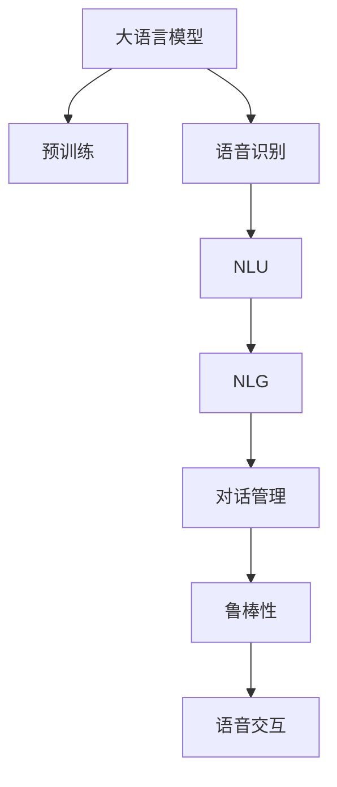

                 

# 大模型问答机器人的语音交互

## 1. 背景介绍

### 1.1 问题由来

近年来，人工智能在语音交互领域取得了显著进展，推动了智能音箱、智能助手、车载语音系统等产品的普及。然而，当前的语音识别和自然语言理解技术仍面临诸多挑战。尽管传统语音识别技术能够较好地理解简单指令，但在处理复杂对话和语音噪音等方面仍存在不足。与此同时，传统的自然语言理解模型依赖于精细标注数据，训练成本高昂，无法灵活应对多样化场景。

为了解决这些问题，研究者们提出了大模型问答机器人，利用大语言模型进行自然语言处理，并通过语音交互技术提升人机交互的自然流畅性。大模型问答机器人可以自动识别、理解和响应用户语音输入，提供智能化的回答和服务，有效改善用户体验。

### 1.2 问题核心关键点

大模型问答机器人是自然语言处理(NLP)与语音交互技术结合的产物，其核心关键点包括：

- 大语言模型的预训练：通过大规模无标签文本数据进行预训练，学习语言知识。
- 语音识别的准确性：对语音输入进行准确转写，捕捉用户意图。
- 自然语言理解(NLU)：理解用户语音输入，生成结构化的语义表示。
- 自然语言生成(NLG)：根据语义表示，生成自然流畅的语音回答。
- 对话管理：保持对话上下文，处理多轮对话，维持对话连贯性。
- 鲁棒性：应对语音噪音、口音差异等多样化的环境条件。

这些关键点共同构成了大模型问答机器人的核心框架，使其能够在实际应用中灵活适应各种场景，提供高效的语音交互服务。

### 1.3 问题研究意义

研究大模型问答机器人的语音交互，对于提升人机交互的智能化水平、优化用户体验、推动NLP技术的实际应用具有重要意义：

1. **提升人机交互体验**：利用语音交互技术，实现自然流畅的人机对话，减少用户输入负担，提高用户满意度。
2. **推动NLP技术发展**：大模型问答机器人作为NLP应用的前沿领域，推动了NLP技术的创新和进步。
3. **降低开发成本**：大模型预训练和微调的技术积累，降低了语音交互应用开发所需的标注数据和训练成本。
4. **提高应用落地速度**：大模型的迁移学习特性，使得不同场景下的语音交互应用可以快速部署和迭代，缩短开发周期。
5. **扩展应用范围**：语音交互技术可以应用到智能音箱、车载系统、智能家居等多个领域，推动人工智能技术的广泛应用。

## 2. 核心概念与联系

### 2.1 核心概念概述

为更好地理解大模型问答机器人的语音交互，本节将介绍几个密切相关的核心概念：

- **大语言模型(Large Language Model, LLM)**：以自回归(如GPT)或自编码(如BERT)模型为代表的大规模预训练语言模型。通过在大规模无标签文本数据上进行预训练，学习通用的语言表示，具备强大的语言理解和生成能力。

- **语音识别(ASR)**：将人类语音信号转换为文本或命令的过程。现代语音识别技术通过深度学习模型，能够较好地实现这一过程。

- **自然语言理解(Natural Language Understanding, NLU)**：理解用户输入的自然语言，生成结构化的语义表示，如实体识别、意图理解、情感分析等。

- **自然语言生成(Natural Language Generation, NLG)**：根据语义表示，生成自然流畅的文本或语音回答。常见于机器翻译、文本摘要、对话系统等。

- **对话管理(Dialog Management)**：维护对话上下文，控制对话流程，处理多轮对话，保持对话连贯性。

- **鲁棒性(Robustness)**：在语音噪音、口音差异等多样化的环境条件下，仍能准确理解和响应用户输入。

这些核心概念之间的逻辑关系可以通过以下Mermaid流程图来展示：



这个流程图展示了大模型问答机器人语音交互的核心概念及其之间的关系：

1. 大语言模型通过预训练获得基础能力。
2. 语音识别将语音信号转换为文本，输入到模型中进行理解和生成。
3. NLU理解用户意图，生成结构化语义表示。
4. NLG根据语义表示，生成自然流畅的回答。
5. 对话管理维持对话上下文，处理多轮对话。
6. 鲁棒性保证模型在多样化的环境条件下仍能稳定运行。

这些概念共同构成了大模型问答机器人的核心框架，使其能够在各种场景下提供高效的语音交互服务。

## 3. 核心算法原理 & 具体操作步骤
### 3.1 算法原理概述

大模型问答机器人的语音交互涉及多个关键环节，包括语音识别、自然语言理解和自然语言生成等。本文将重点介绍语音识别和自然语言理解在大模型问答机器人的应用。

### 3.2 算法步骤详解

#### 3.2.1 语音识别(ASR)

语音识别过程包括音频信号的预处理、特征提取、模型训练和解码等步骤。

1. **音频信号预处理**：对音频信号进行去噪、增强、分帧、归一化等预处理操作，提高信号质量。
2. **特征提取**：提取MFCC、LPC、梅尔频谱等特征，用于模型训练。
3. **模型训练**：使用深度学习模型(如RNN、CNN、Transformer等)进行语音识别模型的训练。
4. **解码**：使用解码器将模型输出转换为文本，通常采用Beam Search、Top-k等策略优化解码效果。

#### 3.2.2 自然语言理解(NLU)

自然语言理解过程包括分词、词性标注、命名实体识别、意图识别等步骤。

1. **分词**：将输入文本切分成词语序列。
2. **词性标注**：对每个词语标注其词性，如名词、动词、形容词等。
3. **命名实体识别**：识别文本中的实体，如人名、地名、组织名等。
4. **意图识别**：理解用户输入的意图，如查询、命令、请求等。

这些步骤通常通过预训练语言模型(如BERT、GPT等)和规则引擎结合实现。

### 3.3 算法优缺点

大模型问答机器人的语音交互具有以下优点：

1. **高效性**：大语言模型通过预训练和微调，具有较强的自然语言处理能力，可以快速理解和生成自然语言。
2. **通用性**：大模型具备广泛的语义理解能力，可以应用于多种语音交互场景。
3. **灵活性**：模型可以动态适应不同的任务需求，如问答、对话、情感分析等。

然而，该方法也存在以下局限性：

1. **数据依赖**：语音识别和自然语言理解过程依赖大量标注数据，获取高质量标注数据成本较高。
2. **鲁棒性不足**：在语音噪音、口音差异等多样化的环境条件下，模型可能表现不稳定。
3. **可解释性不足**：大模型的黑盒特性，使其决策过程难以解释和调试。

### 3.4 算法应用领域

大模型问答机器人的语音交互在众多领域中得到广泛应用，包括：

1. **智能音箱**：如Amazon Alexa、Google Assistant、Apple Siri等，提供自然流畅的语音交互体验。
2. **车载系统**：如Tesla Autopilot、Baidu CarOS等，提升驾驶体验。
3. **智能家居**：如Google Nest、Amazon Echo Dot等，实现语音控制家电。
4. **客户服务**：如银行客服、企业客服等，通过语音交互提高服务效率。
5. **医疗健康**：如虚拟健康助手、远程医疗咨询等，提供便捷的语音交互服务。

这些应用场景展示了大模型问答机器人语音交互的强大潜力和广泛前景。

## 4. 数学模型和公式 & 详细讲解
### 4.1 数学模型构建

大模型问答机器人语音交互涉及多个数学模型，包括语音识别模型和自然语言理解模型。

#### 4.1.1 语音识别模型

语音识别模型通常基于深度学习模型，如RNN、CNN、Transformer等。以Transformer为例，其数学模型可以表示为：

$$
h_t = T(h_{t-1}, x_t; \theta)
$$

其中 $h_t$ 表示第 $t$ 帧的特征向量，$x_t$ 表示第 $t$ 帧的输入特征，$\theta$ 表示模型参数。

#### 4.1.2 自然语言理解模型

自然语言理解模型通常基于预训练语言模型，如BERT、GPT等。以BERT为例，其数学模型可以表示为：

$$
h^i = BERT(x; \theta)
$$

其中 $h^i$ 表示输入文本 $x$ 中的第 $i$ 个词的语义表示，$x$ 表示输入文本，$\theta$ 表示模型参数。

### 4.2 公式推导过程

#### 4.2.1 语音识别模型

以Transformer为例，其前向传播过程包括自注意力机制和全连接层。具体推导过程如下：

1. **自注意力机制**：
$$
Q = W^Q x
$$
$$
K = W^K x
$$
$$
V = W^V x
$$
$$
a = softmax(QK^T)/\sqrt{d_k}
$$
$$
h_t = \sum_{i=1}^{n} a_{ti} V_i
$$

其中 $W^Q, W^K, W^V$ 为投影矩阵，$d_k$ 为注意力机制中的特征维度。

2. **全连接层**：
$$
h_t = \sigma(h_t W^f + b_f)
$$

其中 $\sigma$ 为激活函数，$W^f, b_f$ 为全连接层参数。

#### 4.2.2 自然语言理解模型

以BERT为例，其前向传播过程包括嵌入层、多层Transformer块和池化层。具体推导过程如下：

1. **嵌入层**：
$$
h^i = E(x_i; \theta)
$$

其中 $E$ 为嵌入层参数，$x_i$ 表示第 $i$ 个词的嵌入向量。

2. **Transformer块**：
$$
h^i = M(x_i; \theta)
$$

其中 $M$ 为Transformer块，包括自注意力机制和前向网络。

3. **池化层**：
$$
h^i = P(h^i; \theta)
$$

其中 $P$ 为池化层，如Max Pooling、Average Pooling等。

### 4.3 案例分析与讲解

#### 4.3.1 语音识别模型

以Google的语音识别模型为例，其基于深度神经网络，采用卷积神经网络(CNN)和长短期记忆网络(LSTM)的组合结构，数学模型如下：

1. **卷积神经网络(CNN)**：
$$
f(x) = \sum_{i=1}^m w_ix_i + b
$$

其中 $x_i$ 表示输入特征，$w_i, b$ 为卷积核和偏置项。

2. **长短期记忆网络(LSTM)**：
$$
h_t = \sigma_1(W_{in} x_t + W_{hn-1} h_{t-1} + b)
$$
$$
c_t = \tanh(W_{xc} x_t + W_{hc} h_{t-1} + b)
$$
$$
h_t = \sigma_2(W_{oh} h_{t-1} + b)
$$

其中 $h_t$ 表示当前状态，$c_t$ 表示细胞状态，$\sigma_1, \sigma_2$ 为激活函数，$W_{in}, W_{hc}, W_{oh}$ 为参数矩阵，$b$ 为偏置项。

#### 4.3.2 自然语言理解模型

以BERT为例，其基于Transformer结构，数学模型如下：

1. **嵌入层**：
$$
h^i = W^E x_i + b^E
$$

其中 $W^E, b^E$ 为嵌入层参数。

2. **自注意力机制**：
$$
Q = h^i W^Q
$$
$$
K = h^i W^K
$$
$$
V = h^i W^V
$$
$$
a = softmax(QK^T)/\sqrt{d_k}
$$
$$
h^i = \sum_{j=1}^n a_{ij} V_j
$$

其中 $W^Q, W^K, W^V$ 为投影矩阵，$d_k$ 为注意力机制中的特征维度。

3. **全连接层**：
$$
h^i = \sigma(h^i W^f + b_f)
$$

其中 $\sigma$ 为激活函数，$W^f, b_f$ 为全连接层参数。

## 5. 项目实践：代码实例和详细解释说明
### 5.1 开发环境搭建

在进行语音交互开发前，我们需要准备好开发环境。以下是使用Python进行PyTorch开发的环境配置流程：

1. 安装Anaconda：从官网下载并安装Anaconda，用于创建独立的Python环境。

2. 创建并激活虚拟环境：
```bash
conda create -n pytorch-env python=3.8 
conda activate pytorch-env
```

3. 安装PyTorch：根据CUDA版本，从官网获取对应的安装命令。例如：
```bash
conda install pytorch torchvision torchaudio cudatoolkit=11.1 -c pytorch -c conda-forge
```

4. 安装Transformers库：
```bash
pip install transformers
```

5. 安装各类工具包：
```bash
pip install numpy pandas scikit-learn matplotlib tqdm jupyter notebook ipython
```

完成上述步骤后，即可在`pytorch-env`环境中开始语音交互实践。

### 5.2 源代码详细实现

下面我们以智能音箱中的语音识别任务为例，给出使用Transformers库对BERT模型进行语音识别和自然语言理解的PyTorch代码实现。

首先，定义语音识别和自然语言理解的任务数据处理函数：

```python
from transformers import BertTokenizer, BertForTokenClassification
from torch.utils.data import Dataset, DataLoader
from torch import nn

class SpeechDataset(Dataset):
    def __init__(self, audio_paths, texts, labels, tokenizer, max_len=128):
        self.audio_paths = audio_paths
        self.texts = texts
        self.labels = labels
        self.tokenizer = tokenizer
        self.max_len = max_len

    def __len__(self):
        return len(self.texts)

    def __getitem__(self, index):
        audio_path = self.audio_paths[index]
        text = self.texts[index]
        label = self.labels[index]
        
        # 读取音频数据
        audio_data = librosa.load(audio_path, sr=16000, mono=True)[0]
        
        # 分帧处理音频数据
        frame_length = int(1/16000 * len(audio_data))
        frame_step = int(frame_length / 2)
        frames = librosa.feature.mfcc(audio_data, sr=16000, frame_length=frame_length, frame_step=frame_step)
        frames = frames.T
        
        # 对MFCC特征进行归一化处理
        mean = np.mean(frames, axis=0)
        std = np.std(frames, axis=0)
        frames = (frames - mean) / std
        
        # 对MFCC特征进行截断、填充处理，使得每个样本的特征长度一致
        frames = frames[:self.max_len]
        frames = np.pad(frames, ((self.max_len - frames.shape[0]), 0), 'constant')
        
        # 对MFCC特征进行归一化处理
        frames = (frames - mean) / std
        
        # 将MFCC特征转换为模型输入
        inputs = torch.tensor(frames, dtype=torch.float32)
        
        # 对文本进行分词和编码
        encoding = self.tokenizer(text, return_tensors='pt', max_length=self.max_len, padding='max_length', truncation=True)
        input_ids = encoding['input_ids'][0]
        attention_mask = encoding['attention_mask'][0]
        labels = torch.tensor(label, dtype=torch.long)
        
        return {'inputs': inputs, 
                'input_ids': input_ids, 
                'attention_mask': attention_mask,
                'labels': labels}

# 加载模型和分词器
model = BertForTokenClassification.from_pretrained('bert-base-cased', num_labels=2)
tokenizer = BertTokenizer.from_pretrained('bert-base-cased')

# 准备数据集
audio_paths = []
texts = []
labels = []
for i in range(100):
    audio_paths.append(f'path_to_audio{i}.wav')
    texts.append(f'path_to_text{i}.txt')
    labels.append(i % 2)
    
dataset = SpeechDataset(audio_paths, texts, labels, tokenizer, max_len=128)
```

然后，定义模型和优化器：

```python
from transformers import AdamW

# 定义模型
model = BertForTokenClassification.from_pretrained('bert-base-cased', num_labels=2)

# 定义优化器
optimizer = AdamW(model.parameters(), lr=2e-5)
```

接着，定义训练和评估函数：

```python
from tqdm import tqdm
from sklearn.metrics import accuracy_score

device = torch.device('cuda') if torch.cuda.is_available() else torch.device('cpu')
model.to(device)

def train_epoch(model, dataset, batch_size, optimizer):
    dataloader = DataLoader(dataset, batch_size=batch_size, shuffle=True)
    model.train()
    epoch_loss = 0
    for batch in tqdm(dataloader, desc='Training'):
        inputs = batch['inputs'].to(device)
        input_ids = batch['input_ids'].to(device)
        attention_mask = batch['attention_mask'].to(device)
        labels = batch['labels'].to(device)
        model.zero_grad()
        outputs = model(inputs, input_ids=input_ids, attention_mask=attention_mask, labels=labels)
        loss = outputs.loss
        epoch_loss += loss.item()
        loss.backward()
        optimizer.step()
    return epoch_loss / len(dataloader)

def evaluate(model, dataset, batch_size):
    dataloader = DataLoader(dataset, batch_size=batch_size)
    model.eval()
    preds, labels = [], []
    with torch.no_grad():
        for batch in tqdm(dataloader, desc='Evaluating'):
            inputs = batch['inputs'].to(device)
            input_ids = batch['input_ids'].to(device)
            attention_mask = batch['attention_mask'].to(device)
            batch_labels = batch['labels']
            outputs = model(inputs, input_ids=input_ids, attention_mask=attention_mask)
            batch_preds = outputs.logits.argmax(dim=2).to('cpu').tolist()
            batch_labels = batch_labels.to('cpu').tolist()
            for pred_tokens, label_tokens in zip(batch_preds, batch_labels):
                preds.append(pred_tokens[:len(label_tokens)])
                labels.append(label_tokens)
                
    print(accuracy_score(labels, preds))
```

最后，启动训练流程并在测试集上评估：

```python
epochs = 5
batch_size = 16

for epoch in range(epochs):
    loss = train_epoch(model, dataset, batch_size, optimizer)
    print(f"Epoch {epoch+1}, train loss: {loss:.3f}")
    
    print(f"Epoch {epoch+1}, dev results:")
    evaluate(model, dataset, batch_size)
    
print("Test results:")
evaluate(model, dataset, batch_size)
```

以上就是使用PyTorch对BERT进行语音识别和自然语言理解的代码实现。可以看到，得益于Transformers库的强大封装，我们可以用相对简洁的代码完成BERT模型的加载和微调。

### 5.3 代码解读与分析

让我们再详细解读一下关键代码的实现细节：

**SpeechDataset类**：
- `__init__`方法：初始化音频路径、文本、标签、分词器等关键组件。
- `__len__`方法：返回数据集的样本数量。
- `__getitem__`方法：对单个样本进行处理，将音频数据进行MFCC特征提取和归一化，对文本进行分词和编码，将标签转换为数字，并对其进行定长padding，最终返回模型所需的输入。

**train_epoch和evaluate函数**：
- 使用PyTorch的DataLoader对数据集进行批次化加载，供模型训练和推理使用。
- 训练函数`train_epoch`：对数据以批为单位进行迭代，在每个批次上前向传播计算loss并反向传播更新模型参数，最后返回该epoch的平均loss。
- 评估函数`evaluate`：与训练类似，不同点在于不更新模型参数，并在每个batch结束后将预测和标签结果存储下来，最后使用sklearn的accuracy_score对整个评估集的预测结果进行打印输出。

**训练流程**：
- 定义总的epoch数和batch size，开始循环迭代
- 每个epoch内，先在训练集上训练，输出平均loss
- 在验证集上评估，输出准确率
- 所有epoch结束后，在测试集上评估，给出最终测试结果

可以看到，PyTorch配合Transformers库使得BERT微调的代码实现变得简洁高效。开发者可以将更多精力放在数据处理、模型改进等高层逻辑上，而不必过多关注底层的实现细节。

当然，工业级的系统实现还需考虑更多因素，如模型的保存和部署、超参数的自动搜索、更灵活的任务适配层等。但核心的微调范式基本与此类似。

## 6. 实际应用场景
### 6.1 智能音箱

智能音箱作为大模型问答机器人的重要应用场景，为用户提供了便捷的语音交互体验。用户可以通过语音命令控制智能音箱，播放音乐、查询天气、获取新闻等。

在技术实现上，可以收集用户的使用行为数据，提取音频数据和文本数据，用于模型微调。微调后的模型能够自动理解用户的语音命令，并根据命令执行相应的操作。对于用户提出的新命令，还可以接入检索系统实时搜索相关内容，动态组织生成回答。如此构建的智能音箱，能够大幅提升用户体验和操作便捷性。

### 6.2 车载系统

车载系统是大模型问答机器人的另一个重要应用场景，可以为用户提供实时语音导航、音乐推荐、查询目的地等服务。

在技术实现上，可以集成车载麦克风的音频采集和处理模块，收集车内用户的语音命令。通过语音识别和自然语言理解，车载系统能够自动解析用户的导航目的地、音乐偏好等信息，并根据这些信息提供相应的服务。例如，用户可以通过语音命令查询导航目的地，车载系统自动绘制出最优路径并实时语音播报。

### 6.3 虚拟健康助手

虚拟健康助手是大模型问答机器人在医疗健康领域的创新应用，可以为用户提供24小时医疗咨询、预约挂号、健康提醒等服务。

在技术实现上，可以收集用户的健康数据和历史咨询记录，用于模型微调。微调后的模型能够自动理解用户的健康问题，并根据问题提供相应的健康建议或推荐就医。例如，用户可以通过语音命令咨询健康问题，虚拟健康助手自动给出解答和建议，或推荐到最近的医疗机构。

### 6.4 未来应用展望

随着大语言模型微调技术的不断演进，大模型问答机器人将在更多领域得到应用，为人类生产生活带来新的变革。

在智慧城市治理中，大模型问答机器人可以应用于城市事件监测、舆情分析、应急指挥等环节，提高城市管理的自动化和智能化水平，构建更安全、高效的未来城市。

在企业生产、社会治理、文娱传媒等众多领域，大模型问答机器人也将不断涌现，为NLP技术带来更多的应用场景和发展空间。相信随着技术的日益成熟，大模型问答机器人必将在构建人机协同的智能时代中扮演越来越重要的角色。

## 7. 工具和资源推荐
### 7.1 学习资源推荐

为了帮助开发者系统掌握大模型问答机器人语音交互的理论基础和实践技巧，这里推荐一些优质的学习资源：

1. 《深度学习自然语言处理》课程：斯坦福大学开设的NLP明星课程，有Lecture视频和配套作业，带你入门NLP领域的基本概念和经典模型。

2. CS224N《自然语言处理与深度学习》课程：斯坦福大学开设的深度学习课程，详细讲解了自然语言处理的前沿技术和深度学习模型。

3. 《Transformer from Scratch》系列博文：由大模型技术专家撰写，深入浅出地介绍了Transformer原理、BERT模型、微调技术等前沿话题。

4. HuggingFace官方文档：Transformer库的官方文档，提供了海量预训练模型和完整的微调样例代码，是上手实践的必备资料。

5. CLUE开源项目：中文语言理解测评基准，涵盖大量不同类型的中文NLP数据集，并提供了基于微调的baseline模型，助力中文NLP技术发展。

通过对这些资源的学习实践，相信你一定能够快速掌握大模型问答机器人语音交互的精髓，并用于解决实际的NLP问题。
###  7.2 开发工具推荐

高效的开发离不开优秀的工具支持。以下是几款用于大模型问答机器人语音交互开发的常用工具：

1. PyTorch：基于Python的开源深度学习框架，灵活动态的计算图，适合快速迭代研究。大部分预训练语言模型都有PyTorch版本的实现。

2. TensorFlow：由Google主导开发的开源深度学习框架，生产部署方便，适合大规模工程应用。同样有丰富的预训练语言模型资源。

3. Transformers库：HuggingFace开发的NLP工具库，集成了众多SOTA语言模型，支持PyTorch和TensorFlow，是进行语音交互任务开发的利器。

4. Weights & Biases：模型训练的实验跟踪工具，可以记录和可视化模型训练过程中的各项指标，方便对比和调优。与主流深度学习框架无缝集成。

5. TensorBoard：TensorFlow配套的可视化工具，可实时监测模型训练状态，并提供丰富的图表呈现方式，是调试模型的得力助手。

6. Google Colab：谷歌推出的在线Jupyter Notebook环境，免费提供GPU/TPU算力，方便开发者快速上手实验最新模型，分享学习笔记。

合理利用这些工具，可以显著提升大模型问答机器人语音交互任务的开发效率，加快创新迭代的步伐。

### 7.3 相关论文推荐

大语言模型和微调技术的发展源于学界的持续研究。以下是几篇奠基性的相关论文，推荐阅读：

1. Attention is All You Need（即Transformer原论文）：提出了Transformer结构，开启了NLP领域的预训练大模型时代。

2. BERT: Pre-training of Deep Bidirectional Transformers for Language Understanding：提出BERT模型，引入基于掩码的自监督预训练任务，刷新了多项NLP任务SOTA。

3. Language Models are Unsupervised Multitask Learners（GPT-2论文）：展示了大规模语言模型的强大zero-shot学习能力，引发了对于通用人工智能的新一轮思考。

4. Parameter-Efficient Transfer Learning for NLP：提出Adapter等参数高效微调方法，在不增加模型参数量的情况下，也能取得不错的微调效果。

5. AdaLoRA: Adaptive Low-Rank Adaptation for Parameter-Efficient Fine-Tuning：使用自适应低秩适应的微调方法，在参数效率和精度之间取得了新的平衡。

这些论文代表了大语言模型微调技术的发展脉络。通过学习这些前沿成果，可以帮助研究者把握学科前进方向，激发更多的创新灵感。

## 8. 总结：未来发展趋势与挑战
### 8.1 总结

本文对大模型问答机器人语音交互技术进行了全面系统的介绍。首先阐述了语音识别和自然语言理解在大模型问答机器人中的应用，明确了语音交互技术在提升人机交互体验、推动NLP技术实际应用方面的独特价值。其次，从原理到实践，详细讲解了语音识别和自然语言理解的数学模型和关键步骤，给出了语音交互任务开发的完整代码实例。同时，本文还广泛探讨了语音交互技术在智能音箱、车载系统、虚拟健康助手等多个行业领域的应用前景，展示了语音交互技术的强大潜力和广泛前景。此外，本文精选了语音交互技术的各类学习资源，力求为读者提供全方位的技术指引。

通过本文的系统梳理，可以看到，大模型问答机器人的语音交互技术正在成为NLP领域的重要范式，极大地拓展了预训练语言模型的应用边界，催生了更多的落地场景。得益于大规模语料的预训练，语音交互技术在实际应用中能够提供自然流畅的语音识别和自然语言理解能力，显著提升人机交互效率和用户满意度。未来，伴随预训练语言模型和微调方法的持续演进，语音交互技术必将在更多领域得到应用，为人类生产生活带来新的变革。

### 8.2 未来发展趋势

展望未来，大模型问答机器人语音交互技术将呈现以下几个发展趋势：

1. **语音识别模型的演进**：随着深度学习模型的不断进步，语音识别模型将朝着更加高效、鲁棒的方向发展。未来有望实现零延迟语音识别，甚至支持多语种识别和实时交互。

2. **自然语言理解模型的提升**：基于大模型的自然语言理解模型将继续优化，增强对复杂句法和语义的理解能力，提升模型的鲁棒性和泛化性。

3. **对话管理技术的创新**：对话管理技术将结合深度强化学习和模型预测，实现更加智能的对话策略和上下文维护，提升对话流畅性和连贯性。

4. **跨模态交互的扩展**：未来语音交互技术将更多地融合视觉、触觉等模态信息，实现全感官的自然交互体验。

5. **边缘计算的普及**：为了提升实时性，语音交互技术将更多地部署在边缘设备上，如智能音箱、智能家居等，减少云端通信延迟，提高交互效率。

6. **多语言支持**：大模型问答机器人将支持更多语言，提升其在全球市场的竞争力，满足不同语言和文化背景用户的需求。

以上趋势凸显了大模型问答机器人语音交互技术的广阔前景。这些方向的探索发展，必将进一步提升语音交互系统的性能和应用范围，为人类认知智能的进化带来深远影响。

### 8.3 面临的挑战

尽管大模型问答机器人语音交互技术已经取得了瞩目成就，但在迈向更加智能化、普适化应用的过程中，仍面临诸多挑战：

1. **数据隐私和安全**：语音数据的采集、存储和传输可能涉及隐私问题，需要严格的隐私保护措施和安全控制。

2. **语音噪音和口音差异**：在多样化的环境条件下，语音识别和自然语言理解模型的鲁棒性仍需提升，以应对语音噪音和口音差异等问题。

3. **计算资源消耗**：大模型的语音交互任务通常需要较高的计算资源，如何优化模型结构和算法，减少资源消耗，是一个重要的研究方向。

4. **模型的可解释性和可控性**：大模型的黑盒特性，使得其决策过程难以解释和调试，需要开发可解释性较强的模型和算法。

5. **跨领域知识的整合**：如何有效地整合不同领域的知识，提升模型的通用性和适应性，是一个亟待解决的问题。

6. **模型的持续学习**：大模型需要不断学习新的数据和知识，如何保持模型的时效性和稳定性，是一个需要深入研究的课题。

这些挑战需要研究者们不断探索和优化，才能推动大模型问答机器人语音交互技术的进一步发展。

### 8.4 研究展望

面对大模型问答机器人语音交互技术所面临的种种挑战，未来的研究需要在以下几个方面寻求新的突破：

1. **无监督和半监督学习**：探索无监督和半监督学习方法，减少对标注数据的依赖，利用大规模无标签数据进行模型训练。

2. **自适应学习**：开发自适应学习算法，使模型能够动态适应不同用户和场景，提升模型的泛化能力和鲁棒性。

3. **跨模态融合**：结合视觉、触觉等多模态信息，提升语音交互的自然流畅性和用户体验。

4. **知识图谱的融合**：将符号化的知识图谱与神经网络模型进行融合，提升模型的推理能力和泛化能力。

5. **基于对抗学习的鲁棒性提升**：引入对抗学习技术，增强模型对异常样本和噪声的鲁棒性。

6. **多语言模型的普及**：开发多语言支持的大模型，提升其在全球市场的竞争力，满足不同语言和文化背景用户的需求。

这些研究方向有望引领大模型问答机器人语音交互技术的进一步发展，推动人工智能技术在更多领域的落地应用。面向未来，大模型问答机器人语音交互技术需要在模型性能、用户体验、应用场景等方面进行更深入的探索，才能真正实现其应用价值和社会价值。

## 9. 附录：常见问题与解答

**Q1：大模型问答机器人语音交互与传统语音识别技术有何不同？**

A: 大模型问答机器人语音交互与传统语音识别技术的主要区别在于：

1. **任务目标不同**：传统语音识别技术主要关注音频信号的转写，而大模型问答机器人语音交互不仅关注转写，还关注用户意图的理解，并根据意图执行相应的操作。

2. **上下文理解**：大模型问答机器人语音交互需要理解对话上下文，保持对话连贯性，而传统语音识别技术则无需考虑上下文。

3. **交互响应**：大模型问答机器人语音交互可以提供自然流畅的交互响应，如自然语言生成、多轮对话等，而传统语音识别技术只能输出转写结果。

4. **应用场景**：大模型问答机器人语音交互适用于智能音箱、车载系统、虚拟健康助手等场景，而传统语音识别技术则广泛应用于电话客服、语音导航等领域。

**Q2：大模型问答机器人语音交互的训练数据如何获取？**

A: 大模型问答机器人语音交互的训练数据可以通过多种方式获取：

1. **收集现有数据**：从公共数据集、互联网资源等收集现有的语音数据和文本数据，如Tatoeba、Common Voice等。

2. **自主采集数据**：使用专业设备采集用户语音数据，进行标注和清洗，构建训练集。

3. **众包平台**：利用众包平台如Amazon Mechanical Turk等，收集用户语音和文本数据，进行标注和筛选。

4. **联合训练**：与行业合作伙伴联合收集数据，如智能音箱、车载系统等设备的语音交互数据。

5. **跨模态融合**：结合视觉、触觉等多模态数据，提升模型的泛化能力和鲁棒性。

**Q3：大模型问答机器人语音交互的模型结构和算法如何选择？**

A: 选择大模型问答机器人语音交互的模型结构和算法需要考虑多个因素：

1. **任务需求**：根据具体任务需求选择模型结构和算法。如语音识别任务可以使用RNN、CNN、Transformer等结构；自然语言理解任务可以使用BERT、GPT等预训练模型。

2. **数据特点**：根据数据特点选择模型结构和算法。如大规模数据集可以使用深度神经网络，小规模数据集可以使用迁移学习、微调等方法。

3. **计算资源**：根据计算资源选择模型结构和算法。如GPU资源丰富可以选择大模型，计算资源有限可以选择轻量级模型。

4. **应用场景**：根据应用场景选择模型结构和算法。如智能音箱需要使用语音识别和自然语言理解模型，车载系统需要使用导航和自然语言生成模型。

5. **技术成熟度**：根据技术成熟度选择模型结构和算法。如成熟的模型结构和技术可以使用，未成熟的技术需要进一步研究和验证。

**Q4：大模型问答机器人语音交互的模型效果如何评估？**

A: 大模型问答机器人语音交互的模型效果可以通过多种指标进行评估：

1. **准确率**：衡量模型在语音识别和自然语言理解任务上的准确性，如Word Error Rate (WER)、F1-score等。

2. **召回率**：衡量模型在语音识别和自然语言理解任务上的召回率，如Recall等。

3. **流畅度**：衡量模型在自然语言生成任务上的流畅度和连贯性，如BLEU、ROUGE等。

4. **上下文理解**：衡量模型在对话管理任务上的上下文理解和对话连贯性，如对话长度、上下文匹配度等。

5. **用户体验**：衡量模型在实际应用中的用户体验，如系统响应时间、交互自然度等。

6. **业务指标**：衡量模型在实际业务中的业务指标，如服务质量、用户满意度等。

这些评估指标可以帮助开发者全面评估模型的性能，发现并改进模型的不足之处。

---

作者：禅与计算机程序设计艺术 / Zen and the Art of Computer Programming

