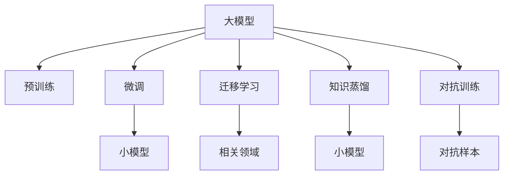

                 

# 大模型：从理论到实践的商业应用

## 1. 背景介绍

### 1.1 问题由来

近年来，人工智能（AI）领域的飞速发展，特别是深度学习技术的进步，使得大模型（Large Models）在商业应用中变得日益重要。大模型指的是通过大规模数据进行训练，具有庞大参数量的人工智能模型，比如GPT-3、BERT等。这些大模型在自然语言处理（NLP）、计算机视觉（CV）、语音识别（ASR）等任务上展现出卓越的性能。

### 1.2 问题核心关键点

大模型在商业应用中的核心关键点包括：

- **性能优越**：大模型通过大规模数据训练，能够捕捉复杂的语言模式和特征，适用于多种任务，并具有很好的泛化能力。
- **广泛应用**：除了NLP领域，大模型还在图像识别、语音处理、自动驾驶等多个领域展现出潜力。
- **数据依赖**：大模型需要大量的标注数据进行训练，数据获取成本高昂，且数据质量对模型性能影响巨大。
- **资源需求**：大模型的训练和推理需要大量的计算资源，包括高性能GPU、TPU等，对硬件环境要求较高。
- **应用难度**：虽然大模型的性能优越，但其应用场景复杂，需要深入理解模型架构和训练细节，对开发者的要求较高。
- **伦理与公平性**：大模型可能存在偏见和歧视，如何确保模型公平性、透明度和可解释性成为重要问题。

## 2. 核心概念与联系

### 2.1 核心概念概述

在进行商业应用时，了解大模型的核心概念及其联系至关重要。以下是几个关键概念及其关系：

- **大模型（Large Models）**：指具有大量参数，经过大规模数据训练的深度神经网络模型，如GPT-3、BERT等。
- **预训练（Pre-training）**：指在大规模无标注数据上对模型进行训练，以学习通用的语言或视觉特征，如GPT-3的预训练基于大规模文本数据。
- **微调（Fine-tuning）**：指在大模型的基础上，使用特定任务的标注数据对模型进行调整，以适应特定任务的需求。
- **迁移学习（Transfer Learning）**：指将在一个领域中训练好的模型应用到另一个相关领域，以提高新任务的性能。
- **知识蒸馏（Knowledge Distillation）**：指将大规模模型的知识转移到小模型中，以提升小模型的性能。
- **对抗训练（Adversarial Training）**：指在大模型上引入对抗样本，以增强模型的鲁棒性和泛化能力。

这些概念通过以下Mermaid流程图来展示：



### 2.2 核心概念原理和架构

- **大模型架构**：通常采用Transformer或其变种作为模型架构，如BERT、GPT等，这些模型具有自注意力机制，能够学习到输入数据的多层次表示。
- **预训练原理**：在无标注数据上对模型进行自监督预训练，如语言模型预测、掩码预测等任务，学习通用的语言特征。
- **微调原理**：在特定任务的标注数据上进行有监督微调，以调整模型的输出层，适应特定任务的需求。
- **迁移学习原理**：通过将预训练模型的权重初始化应用到新任务上，加速新任务的学习过程。
- **知识蒸馏原理**：在大模型和学生模型之间构建教师-学生关系，通过知识转移提升学生模型的性能。
- **对抗训练原理**：通过引入对抗样本，增加模型的鲁棒性，防止模型过拟合。

## 3. 核心算法原理 & 具体操作步骤

### 3.1 算法原理概述

大模型的商业应用主要基于预训练-微调范式，具体步骤如下：

1. **数据准备**：收集特定任务的大量标注数据，用于微调。
2. **模型选择**：选择适合任务的预训练模型，如BERT、GPT等。
3. **微调步骤**：
   - 冻结预训练模型的部分参数，仅微调顶层输出层。
   - 设定合适的学习率和优化器。
   - 使用标注数据进行微调训练，通过反向传播更新模型参数。
   - 定期在验证集上评估模型性能，防止过拟合。
   - 选择最优模型进行测试和部署。

### 3.2 算法步骤详解

以下是详细的微调步骤：

1. **数据准备**：
   - 收集任务相关的标注数据集，如自然语言处理（NLP）中的情感分析、问答系统等。
   - 将数据集划分为训练集、验证集和测试集。
   - 对数据进行预处理，如文本分词、标准化等。

2. **模型选择**：
   - 选择预训练模型，如BERT、GPT等。
   - 将预训练模型作为初始权重，准备微调。

3. **微调步骤**：
   - **模型结构**：根据任务需求，修改模型的输出层，如添加分类器或回归器。
   - **优化器选择**：常用的优化器包括Adam、SGD等，需要根据任务和数据集特点选择合适的优化器。
   - **学习率**：一般从一个小学习率开始，逐步调整。
   - **损失函数**：根据任务选择合适的损失函数，如交叉熵、均方误差等。
   - **正则化**：使用L2正则、Dropout等方法防止过拟合。
   - **评估与调整**：在验证集上评估模型性能，根据性能调整学习率、超参数等。

4. **测试与部署**：
   - 在测试集上评估微调后的模型性能。
   - 对模型进行优化和调整，如模型压缩、量化等。
   - 将模型部署到实际应用中，如API接口、移动应用等。

### 3.3 算法优缺点

**优点**：
- **泛化能力强**：大模型经过大规模数据训练，具有很好的泛化能力，适用于多种商业应用。
- **性能优越**：大模型能够捕捉复杂的特征，在各种任务上都能取得不错的效果。
- **应用广泛**：适用于自然语言处理、计算机视觉、语音识别等多个领域，具有很高的商业价值。

**缺点**：
- **数据依赖高**：需要大量标注数据进行训练，数据获取成本高昂。
- **资源需求大**：训练和推理需要高性能计算资源，如GPU、TPU等。
- **应用复杂**：需要深入理解模型架构和训练细节，对开发者要求较高。
- **伦理与公平性**：存在偏见和歧视，如何确保模型公平性和透明度是一大挑战。

### 3.4 算法应用领域

大模型在商业应用中具有广泛的应用场景，以下是几个典型领域：

1. **自然语言处理（NLP）**：
   - 情感分析：识别用户对产品或服务的情感倾向。
   - 机器翻译：将一种语言翻译成另一种语言。
   - 问答系统：回答用户提出的问题。

2. **计算机视觉（CV）**：
   - 图像分类：识别图像中的物体。
   - 目标检测：在图像中检测并定位特定物体。
   - 图像生成：生成逼真的图像。

3. **语音识别（ASR）**：
   - 语音转文本：将语音转换成文本。
   - 情感识别：识别语音中的情感。
   - 说话人识别：识别说话人身份。

4. **智能推荐系统**：
   - 推荐商品：根据用户的历史行为和兴趣推荐商品。
   - 推荐视频：根据用户的观看历史推荐视频。
   - 推荐新闻：根据用户的新闻阅读历史推荐新闻。

5. **智能客服**：
   - 自动回答：自动回答用户提出的问题。
   - 语音客服：通过语音识别和生成技术实现智能客服。
   - 情感分析：识别用户情绪，提供更精准的服务。

## 4. 数学模型和公式 & 详细讲解 & 举例说明

### 4.1 数学模型构建

以情感分析为例，构建数学模型如下：

1. **输入**：输入文本 $x$，通过分词、编码等预处理，得到嵌入向量 $x_e$。
2. **模型**：使用预训练模型如BERT，得到上下文表示 $h$。
3. **输出**：根据上下文表示 $h$ 计算情感得分 $s$，通过sigmoid函数得到情感概率 $p$。
4. **损失函数**：使用交叉熵损失函数 $L$，计算模型的预测值和实际值之间的差异。

### 4.2 公式推导过程

以BERT为例，情感分析的计算过程如下：

1. **输入表示**：将输入文本 $x$ 转换为BERT模型所需的格式，通过分词、编码等步骤，得到嵌入向量 $x_e$。
2. **上下文表示**：使用BERT模型对嵌入向量 $x_e$ 进行处理，得到上下文表示 $h$。
3. **情感得分**：根据上下文表示 $h$ 计算情感得分 $s$，计算公式如下：

$$
s = \frac{1}{d} \sum_{i=1}^d w_i h_i
$$

其中 $d$ 为BERT的隐藏层维度，$w_i$ 为权重向量，$h_i$ 为BERT模型的隐藏层向量。
4. **情感概率**：使用sigmoid函数将情感得分 $s$ 转化为情感概率 $p$：

$$
p = \sigma(s)
$$

5. **损失函数**：使用交叉熵损失函数计算模型的预测值和实际值之间的差异：

$$
L = -\frac{1}{N} \sum_{i=1}^N (y_i \log p_i + (1-y_i) \log (1-p_i))
$$

其中 $N$ 为样本数量，$y_i$ 为样本的真实情感标签，$p_i$ 为模型的情感预测概率。

### 4.3 案例分析与讲解

以Google BERT为例，分析其在商业应用中的作用和效果：

1. **预训练**：BERT在大规模无标注文本数据上进行预训练，学习通用的语言特征。
2. **微调**：将BERT应用于特定任务，如新闻分类、情感分析等，通过微调优化模型的输出层。
3. **效果**：在多个NLP任务上，BERT取得优越的性能，例如在GLUE数据集上的多个任务中都取得了SOTA（State Of The Art）的成绩。

## 5. 项目实践：代码实例和详细解释说明

### 5.1 开发环境搭建

为了进行大模型的商业应用，需要搭建相应的开发环境：

1. **硬件环境**：配置高性能GPU、TPU等计算资源。
2. **软件环境**：安装深度学习框架如TensorFlow、PyTorch等，安装NLP工具包如NLTK、SpaCy等。
3. **开发工具**：使用Jupyter Notebook、PyCharm等开发工具。

### 5.2 源代码详细实现

以下是一个基于PyTorch的情感分析代码实现：

```python
import torch
import torch.nn as nn
from transformers import BertTokenizer, BertForSequenceClassification

# 加载模型和分词器
tokenizer = BertTokenizer.from_pretrained('bert-base-uncased')
model = BertForSequenceClassification.from_pretrained('bert-base-uncased', num_labels=2)

# 准备数据
inputs = tokenizer("I love this movie", return_tensors="pt")
labels = torch.tensor([1])

# 前向传播
with torch.no_grad():
    outputs = model(**inputs, labels=labels)
    logits = outputs.logits

# 计算损失
loss = nn.CrossEntropyLoss()(logits, labels)

# 反向传播和优化
optimizer = torch.optim.Adam(model.parameters(), lr=2e-5)
optimizer.zero_grad()
loss.backward()
optimizer.step()

# 评估模型
correct = 0
total = 0
with torch.no_grad():
    for batch in validation_loader:
        inputs, labels = batch
        outputs = model(**inputs)
        logits = outputs.logits
        _, predicted = torch.max(logits, 1)
        total += labels.size(0)
        correct += (predicted == labels).sum().item()

accuracy = 100 * correct / total
print(f"Validation accuracy: {accuracy}%")
```

### 5.3 代码解读与分析

上述代码实现了使用BERT模型进行情感分析的微调：

1. **模型加载**：使用`BertForSequenceClassification`加载预训练的BERT模型。
2. **数据准备**：使用`BertTokenizer`对输入文本进行分词，转换为模型所需的格式。
3. **前向传播**：通过模型计算情感得分，得到模型的预测结果。
4. **损失计算**：使用交叉熵损失函数计算模型预测与真实标签之间的差异。
5. **反向传播与优化**：使用Adam优化器更新模型参数，以最小化损失函数。
6. **模型评估**：在验证集上评估模型性能，计算准确率。

## 6. 实际应用场景

### 6.1 智能客服

大模型在智能客服中具有广泛应用，能够自动回答用户问题，提供24小时不间断服务。例如，通过微调BERT模型，可以实现自然语言处理（NLP）的问答系统，自动识别用户意图并提供相应的回复。

### 6.2 金融分析

大模型在金融领域中用于风险评估、情感分析、舆情监测等任务。例如，通过微调BERT模型，可以实现对金融新闻的情感分析，帮助投资者识别市场情绪，做出投资决策。

### 6.3 医疗诊断

大模型在医疗领域中用于辅助医生诊断、病历分析等任务。例如，通过微调BERT模型，可以实现对医疗文本的情感分析，帮助医生了解患者情绪，改善诊疗体验。

### 6.4 未来应用展望

未来，大模型在商业应用中将展现出更加广泛的应用前景：

1. **多模态融合**：大模型将融合视觉、语音等多模态数据，实现更全面的信息处理。
2. **个性化推荐**：大模型将用于个性化推荐系统，根据用户行为和兴趣推荐商品、视频等。
3. **智能驾驶**：大模型将用于智能驾驶系统，提高自动驾驶的性能和安全性。
4. **智能安防**：大模型将用于智能安防系统，实现人脸识别、行为分析等任务。

## 7. 工具和资源推荐

### 7.1 学习资源推荐

1. **深度学习框架**：TensorFlow、PyTorch等深度学习框架，提供丰富的NLP工具包和预训练模型。
2. **自然语言处理工具**：NLTK、SpaCy等工具，用于文本预处理和分析。
3. **NLP数据集**：GLUE、CoNLL等数据集，用于模型训练和评测。

### 7.2 开发工具推荐

1. **Jupyter Notebook**：用于数据探索、模型训练和评估的轻量级开发工具。
2. **PyCharm**：全功能的Python开发环境，提供丰富的插件和调试功能。
3. **Git**：版本控制系统，用于协作开发和管理代码版本。

### 7.3 相关论文推荐

1. **BERT论文**：Devlin等人提出的BERT模型，用于自然语言处理任务。
2. **GPT论文**：Radford等人提出的GPT模型，用于生成自然语言文本。
3. **ALBERT论文**：Zhou等人提出的ALBERT模型，用于提高预训练和微调效率。

## 8. 总结：未来发展趋势与挑战

### 8.1 总结

本文从理论到实践，系统地介绍了大模型在商业应用中的应用。通过分析大模型的核心概念和应用场景，展示了其强大的性能和广泛的应用前景。通过具体的代码实例和案例分析，进一步验证了其商业价值。

### 8.2 未来发展趋势

未来，大模型在商业应用中将呈现以下趋势：

1. **模型规模扩大**：随着硬件条件的提升和数据规模的增加，大模型的参数量将进一步扩大，性能将更上一层楼。
2. **应用领域拓展**：大模型将广泛应用于金融、医疗、智能驾驶等更多领域，带来深刻的变革。
3. **模型可解释性提升**：未来的大模型将更加注重可解释性和可理解性，增强模型的透明度和可信度。
4. **隐私保护加强**：未来的大模型将更加注重隐私保护，确保数据和模型的安全。
5. **多模态融合**：未来的大模型将融合视觉、语音等多模态数据，实现更全面的信息处理。

### 8.3 面临的挑战

尽管大模型在商业应用中展现出巨大潜力，但仍面临诸多挑战：

1. **数据获取困难**：大规模数据获取成本高昂，数据质量对模型性能影响巨大。
2. **计算资源需求高**：大模型的训练和推理需要高性能计算资源，硬件成本较高。
3. **模型可解释性不足**：大模型的决策过程难以解释，缺乏透明性和可理解性。
4. **模型偏见和歧视**：大模型可能存在偏见和歧视，如何确保模型的公平性和透明度是一大挑战。
5. **隐私和安全问题**：大模型涉及大量敏感数据，数据和模型的安全保护是一大难题。

### 8.4 研究展望

未来，研究大模型在商业应用中的相关问题将从以下几个方向展开：

1. **数据获取与处理**：如何获取高质量的数据，并从中提取有用的特征，是未来研究的重要方向。
2. **模型优化**：如何优化模型架构和训练过程，提升模型性能和可解释性。
3. **隐私和安全保护**：如何保护数据隐私和模型安全，确保模型的公平性和可信度。
4. **多模态融合**：如何将视觉、语音等多模态数据融合到模型中，提升模型的性能和应用范围。
5. **模型部署和优化**：如何高效地部署大模型，并对其进行优化，提升推理速度和效率。

## 9. 附录：常见问题与解答

**Q1：大模型在商业应用中是否存在偏见和歧视？**

A：大模型可能存在偏见和歧视，尤其是训练数据存在偏差时。例如，如果训练数据集中包含大量特定性别、种族或文化背景的样本，大模型可能倾向于对这些群体有偏见。如何确保模型的公平性和透明度，是一个重要问题。

**Q2：大模型在商业应用中如何保护数据隐私？**

A：大模型在商业应用中涉及大量敏感数据，数据隐私保护至关重要。可以采用差分隐私、联邦学习等技术，确保数据在隐私保护的前提下进行模型训练和推理。

**Q3：大模型在商业应用中如何提高可解释性？**

A：大模型在商业应用中提高可解释性可以通过以下方法：
1. 使用可解释性技术，如LIME、SHAP等。
2. 进行可视化分析，如特征重要性分析、部分依赖图等。
3. 采用可解释性模型，如LSTM、决策树等。

**Q4：大模型在商业应用中如何处理多模态数据？**

A：大模型在商业应用中处理多模态数据可以采用以下方法：
1. 融合多模态数据，如视觉、语音、文本等。
2. 使用多模态学习框架，如MIMO等。
3. 设计多模态神经网络架构，如DenseNet等。

**Q5：大模型在商业应用中如何提高推理效率？**

A：大模型在商业应用中提高推理效率可以采用以下方法：
1. 模型压缩，如剪枝、量化等。
2. 分布式推理，如使用多GPU、TPU等加速推理。
3. 模型优化，如使用AdamW、Adafactor等优化器。

通过本文的介绍和分析，可以全面了解大模型在商业应用中的核心概念、算法原理和操作步骤，掌握相关的开发环境和工具，理解其应用场景和未来发展趋势。希望本文能为您提供有价值的技术参考，促进大模型在商业应用中的深入研究和广泛应用。

---

作者：禅与计算机程序设计艺术 / Zen and the Art of Computer Programming

