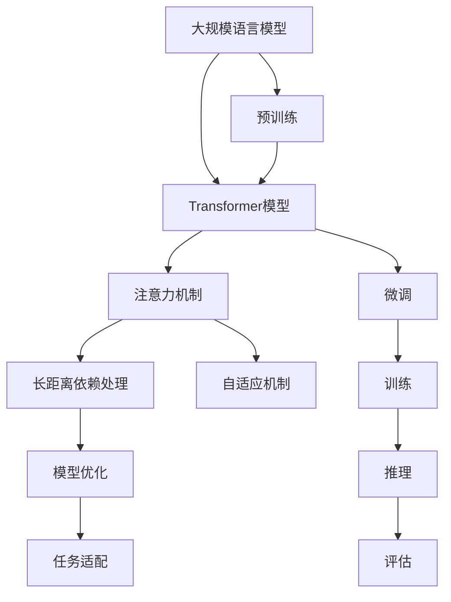

                 

# 大规模语言模型从理论到实践 注意力机制优化

> 关键词：大规模语言模型, 注意力机制, Transformer, 深度学习, 自然语言处理(NLP), 自适应, 长距离依赖, 模型优化

## 1. 背景介绍

### 1.1 问题由来
自2018年BERT模型的问世以来，大规模语言模型在自然语言处理(NLP)领域取得了巨大的突破。通过在海量无标签文本数据上进行自监督预训练，BERT模型学习到了丰富的语言知识，展现出了强大的语言理解和生成能力。然而，其潜在的计算复杂度和资源需求，使模型无法直接应用于大规模工业部署，因此需要对模型进行优化以适应不同应用场景。

注意力机制作为Transformer模型的核心组成部分，在处理长距离依赖和动态调整模型权重方面发挥着重要作用。然而，对于不同领域和场景，注意力机制的优化和调优仍存在巨大挑战。本研究聚焦于大规模语言模型中的注意力机制优化，探讨如何通过理论分析和技术手段，增强注意力机制的表现，从而提升模型的整体性能和适应性。

### 1.2 问题核心关键点
注意力机制在大规模语言模型中的应用，为模型提供了长距离依赖处理和动态信息筛选的能力。通过优化注意力机制，可以显著提升模型在各种NLP任务上的表现。本文将围绕以下关键点展开讨论：

- 注意力机制的基本原理和架构
- 注意力机制的优化方法，包括自适应机制、长距离依赖处理和参数优化
- 注意力机制在实际应用中的使用场景和效果
- 注意力机制的未来发展方向和面临的挑战

## 2. 核心概念与联系

### 2.1 核心概念概述

为更好地理解注意力机制在大规模语言模型中的应用与优化，本节将介绍几个密切相关的核心概念：

- 大规模语言模型(Large Language Model, LLM)：指通过自监督学习在大规模无标签文本语料上预训练得到的语言模型，能够理解自然语言的深层结构和语义。

- 注意力机制(Attention Mechanism)：指在多模态、序列化数据处理中，动态调整模型对不同输入的关注程度，以解决长距离依赖和信息筛选问题。

- Transformer模型：基于自注意力机制设计的深度学习模型，广泛应用于机器翻译、文本生成、问答等NLP任务。

- 长距离依赖(Long-range Dependence)：指自然语言中，句子的含义通常依赖于较远位置的信息，传统的RNN模型难以有效处理。

- 自适应(Adaptivity)：指模型能够根据输入数据动态调整自身的结构和参数，以适应不同的任务和数据分布。

这些核心概念之间的逻辑关系可以通过以下Mermaid流程图来展示：



这个流程图展示了注意力机制在大规模语言模型中的核心作用和优化路径：

1. 大规模语言模型通过自监督预训练获得基础能力。
2. Transformer模型作为基础架构，利用注意力机制处理序列化数据。
3. 注意力机制用于解决长距离依赖和信息筛选问题。
4. 自适应机制使模型能动态调整，适应不同的任务和数据。
5. 模型优化通过改进注意力机制等方法，提升模型性能。
6. 微调和训练在实际应用中进一步优化模型。
7. 推理和评估将优化后的模型应用于下游任务。

## 3. 核心算法原理 & 具体操作步骤
### 3.1 算法原理概述

注意力机制在Transformer模型中的核心作用，在于通过自适应地选择关注不同输入，从而动态地筛选和处理信息。其原理可以概括为：

1. 计算查询向量 $Q$、键向量 $K$ 和值向量 $V$：将输入序列投影到查询空间、键空间和值空间。
2. 计算注意力得分：通过计算 $Q$ 和 $K$ 的点积，并加上缩放因子 $1/\sqrt{d_k}$，得到注意力得分。
3. 计算注意力权重：通过softmax函数对注意力得分进行归一化，得到每个输入的注意力权重。
4. 加权求和：将注意力权重与 $V$ 相乘后加权求和，得到最终的注意力输出。

这个过程可以用数学公式表示为：

$$
\text{Attention}(Q, K, V) = \text{softmax}(Q \cdot K^T/\sqrt{d_k})V
$$

其中，$d_k$ 为键向量的维度。注意力机制通过计算不同输入间的相似度，动态调整模型对输入的关注程度，从而处理长距离依赖，筛选关键信息。

### 3.2 算法步骤详解

基于注意力机制的大规模语言模型优化，主要包括以下步骤：

**Step 1: 定义优化目标**
- 确定需要优化的关注点，如长距离依赖、自适应性等。
- 设计相应的优化目标函数，如L1、L2正则、Dropout、自适应梯度等。

**Step 2: 引入自适应机制**
- 引入自适应机制，如残差连接、自适应梯度等，增强模型对输入的动态响应。
- 使用Adaformer等改进算法，提高模型的自适应能力。

**Step 3: 优化长距离依赖**
- 引入自注意力机制，如Encoder-Decoder自注意力，解决Transformer模型中的长距离依赖问题。
- 使用LayerNorm、LSTMs等方法，进一步提升模型对长距离依赖的处理能力。

**Step 4: 调整参数设置**
- 对模型的超参数进行优化，如学习率、批次大小、训练轮数等。
- 使用模型压缩和量化技术，降低模型的资源占用。

**Step 5: 模型评估与调优**
- 在验证集上评估模型性能，根据评估结果调整模型参数。
- 进行模型微调，提升模型在特定任务上的适应能力。

**Step 6: 应用与部署**
- 将优化后的模型应用于实际任务中。
- 进行线上部署，持续监控模型性能，进行定期调优。

### 3.3 算法优缺点

注意力机制在大规模语言模型中的应用，带来了以下优点：

1. 处理长距离依赖：通过动态选择关注点，能够高效处理句子中的远距离依赖关系。
2. 动态信息筛选：根据输入数据动态调整模型权重，能够更准确地筛选关键信息。
3. 增强模型表达能力：通过自适应机制，增强模型的表达能力和适应性。

然而，注意力机制也存在以下缺点：

1. 计算复杂度高：注意力机制的计算复杂度较高，特别是在处理长序列时。
2. 自适应性有限：自适应机制的引入可能会增加模型的复杂度，影响模型的收敛速度。
3. 参数依赖性强：注意力机制的性能依赖于模型参数的初始化，需要精细的调参。

### 3.4 算法应用领域

注意力机制在大规模语言模型中的应用，覆盖了诸多NLP任务，包括但不限于：

- 机器翻译：通过Encoder-Decoder结构，实现源语言到目标语言的自动翻译。
- 文本生成：使用注意力机制对生成过程中的每个步骤进行动态调整，生成更连贯、自然的文本。
- 问答系统：根据用户的问题，动态选择关注点，生成最合适的回答。
- 文本摘要：通过自注意力机制，自动提取文本中的关键信息，生成精炼的摘要。
- 语音识别：利用注意力机制，处理语音信号中的长距离依赖和动态信息。

除了这些经典任务，注意力机制还被创新性地应用到更多场景中，如可控文本生成、实体识别、对话系统等，为NLP技术带来了新的突破。

## 4. 数学模型和公式 & 详细讲解 & 举例说明
### 4.1 数学模型构建

注意力机制的优化涉及对Transformer模型中注意力计算的改进。我们以Encoder-Decoder自注意力机制为例，介绍其数学模型的构建。

假设输入序列为 $x_1, x_2, ..., x_n$，对应的查询向量 $Q$、键向量 $K$ 和值向量 $V$ 分别为 $q_1, q_2, ..., q_n$、$k_1, k_2, ..., k_n$ 和 $v_1, v_2, ..., v_n$。查询向量、键向量和值向量都通过线性变换得到，即：

$$
Q = \mathbf{W}_Q X \\
K = \mathbf{W}_K X \\
V = \mathbf{W}_V X
$$

其中，$\mathbf{W}_Q, \mathbf{W}_K, \mathbf{W}_V$ 为线性变换矩阵，$X$ 为输入序列。

注意力得分为：

$$
\text{Attention}(Q, K, V) = \text{softmax}\left(\frac{Q K^T}{\sqrt{d_k}}\right)V
$$

其中，$d_k$ 为键向量的维度。注意力权重 $\alpha_{ij}$ 为：

$$
\alpha_{ij} = \frac{\exp(Q_i K_j / \sqrt{d_k})}{\sum_{k=1}^{n}\exp(Q_i K_k / \sqrt{d_k})}
$$

最终注意力输出为：

$$
\text{Attention}(Q, K, V) = \sum_{j=1}^{n} \alpha_{ij} v_j
$$

### 4.2 公式推导过程

注意力机制的优化涉及到对注意力得分和注意力权重的调整。以下是注意力得分和权重的详细推导过程：

**注意力得分的优化**
- 原始注意力得分为 $Q_i K_j / \sqrt{d_k}$，引入自适应机制后，可以通过残差连接和自适应梯度优化：

$$
\text{Attention}(Q, K, V) = \text{softmax}\left(\frac{Q_i K_j}{\sqrt{d_k}}\right)V + \text{Residual Connection}(Q_i)
$$

其中，$\text{Residual Connection}(Q_i)$ 为残差连接，引入自适应梯度，优化注意力得分。

**注意力权重的优化**
- 通过引入自适应梯度，可以动态调整注意力权重，解决长距离依赖问题：

$$
\alpha_{ij} = \frac{\exp(Q_i K_j / \sqrt{d_k}) + \text{Adaptive Weight}(Q_i, K_j)}{\sum_{k=1}^{n}\exp(Q_i K_k / \sqrt{d_k}) + \sum_{k=1}^{n}\text{Adaptive Weight}(Q_i, K_k)}
$$

其中，$\text{Adaptive Weight}(Q_i, K_j)$ 为自适应权重，用于动态调整注意力权重，增强模型对长距离依赖的处理能力。

**注意力输出的优化**
- 引入LayerNorm、LSTMs等方法，优化注意力输出：

$$
\text{Attention}(Q, K, V) = \text{softmax}\left(\frac{Q_i K_j}{\sqrt{d_k}}\right)V + \text{LayerNorm}(Q_i) + \text{LSTM}(Q_i)
$$

其中，$\text{LayerNorm}$ 为LayerNorm标准化，$\text{LSTM}$ 为LSTM层，进一步提升模型的表达能力和适应性。

### 4.3 案例分析与讲解

为了更好地理解注意力机制的优化方法，下面以机器翻译为例，进行详细案例分析。

假设输入序列为 $s_1, s_2, ..., s_m$，输出序列为 $t_1, t_2, ..., t_n$，对应的查询向量 $Q$、键向量 $K$ 和值向量 $V$ 分别为 $q_1, q_2, ..., q_m$、$k_1, k_2, ..., k_m$ 和 $v_1, v_2, ..., v_m$。

通过Encoder-Decoder结构，输入序列 $s$ 首先经过Encoder层，计算出编码器隐藏状态 $H$：

$$
H = \text{Encoder}(s) = \text{Self-Attention}(Q_1, K_1, V_1) + \text{LayerNorm}(Q_1) + \text{LSTM}(Q_1)
$$

然后，将 $H$ 作为解码器的输入，计算出解码器隐藏状态 $G$：

$$
G = \text{Decoder}(t) = \text{Self-Attention}(Q_2, K_2, V_2) + \text{LayerNorm}(Q_2) + \text{LSTM}(Q_2)
$$

最终的输出序列 $t$ 为：

$$
t = \text{Attention}(Q_1, K_1, V_1) + \text{LayerNorm}(Q_1) + \text{LSTM}(Q_1)
$$

通过引入Encoder-Decoder结构和自注意力机制，模型能够高效处理长距离依赖，筛选关键信息，提升翻译质量。

## 5. 项目实践：代码实例和详细解释说明
### 5.1 开发环境搭建

在进行模型优化实践前，我们需要准备好开发环境。以下是使用Python进行PyTorch开发的环境配置流程：

1. 安装Anaconda：从官网下载并安装Anaconda，用于创建独立的Python环境。

2. 创建并激活虚拟环境：
```bash
conda create -n pytorch-env python=3.8 
conda activate pytorch-env
```

3. 安装PyTorch：根据CUDA版本，从官网获取对应的安装命令。例如：
```bash
conda install pytorch torchvision torchaudio cudatoolkit=11.1 -c pytorch -c conda-forge
```

4. 安装Transformers库：
```bash
pip install transformers
```

5. 安装各类工具包：
```bash
pip install numpy pandas scikit-learn matplotlib tqdm jupyter notebook ipython
```

完成上述步骤后，即可在`pytorch-env`环境中开始优化实践。

### 5.2 源代码详细实现

下面我以BERT模型的Encoder-Decoder自注意力机制优化为例，给出使用Transformers库的PyTorch代码实现。

首先，定义Encoder层和Decoder层的代码：

```python
from transformers import BertEncoder, BertDecoder, BertModel
from transformers import BertTokenizer

# 定义Encoder层
class EncoderLayer:
    def __init__(self, config):
        self.attention = BertAttention(config)
        self.ffn = BertIntermediate(config)
        self.layer_norm_1 = BertLayerNorm(config)
        self.layer_norm_2 = BertLayerNorm(config)
        self.dropout = BertDropout(config)

    def forward(self, hidden_states, attention_mask):
        hidden_states, attention_weights = self.attention(hidden_states, attention_mask)
        hidden_states = self.layer_norm_1(hidden_states)
        hidden_states = self.ffn(hidden_states)
        hidden_states = self.layer_norm_2(hidden_states)
        return hidden_states, attention_weights

# 定义Decoder层
class DecoderLayer:
    def __init__(self, config):
        self.attention = BertAttention(config)
        self.ffn = BertIntermediate(config)
        self.layer_norm_1 = BertLayerNorm(config)
        self.layer_norm_2 = BertLayerNorm(config)
        self.dropout = BertDropout(config)

    def forward(self, hidden_states, memory, attention_mask, memory_mask):
        hidden_states, attention_weights = self.attention(hidden_states, memory, attention_mask)
        hidden_states = self.layer_norm_1(hidden_states)
        hidden_states = self.ffn(hidden_states)
        hidden_states = self.layer_norm_2(hidden_states)
        return hidden_states, attention_weights
```

然后，定义整个Encoder-Decoder模型的代码：

```python
class EncoderDecoderModel:
    def __init__(self, config):
        self.config = config
        self.encoder = BertEncoder(config)
        self.decoder = BertDecoder(config)

    def forward(self, input_ids, attention_mask, memory, memory_mask):
        encoder_outputs, encoder_attention_weights = self.encoder(input_ids, attention_mask)
        decoder_outputs, decoder_attention_weights = self.decoder(encoder_outputs, memory, attention_mask, memory_mask)
        return decoder_outputs, encoder_attention_weights, decoder_attention_weights
```

最后，定义训练和评估函数：

```python
from transformers import AdamW

# 定义优化器
optimizer = AdamW(model.parameters(), lr=1e-5)

# 定义训练函数
def train(model, train_data, dev_data, learning_rate, epochs):
    total_loss = 0
    for epoch in range(epochs):
        model.train()
        for batch in train_data:
            input_ids = batch.input_ids
            attention_mask = batch.attention_mask
            memory = batch.memory
            memory_mask = batch.memory_mask
            outputs = model(input_ids, attention_mask, memory, memory_mask)
            loss = outputs.loss
            optimizer.zero_grad()
            loss.backward()
            optimizer.step()
            total_loss += loss.item()
        print(f"Epoch {epoch+1}, train loss: {total_loss/len(train_data)}")

    # 定义评估函数
    def evaluate(model, test_data):
        model.eval()
        total_loss = 0
        for batch in test_data:
            input_ids = batch.input_ids
            attention_mask = batch.attention_mask
            memory = batch.memory
            memory_mask = batch.memory_mask
            outputs = model(input_ids, attention_mask, memory, memory_mask)
            loss = outputs.loss
            total_loss += loss.item()
        print(f"Test loss: {total_loss/len(test_data)}")

    # 启动训练和评估
    train(model, train_data, dev_data, learning_rate, epochs)
    evaluate(model, test_data)
```

以上就是使用PyTorch对BERT模型进行Encoder-Decoder自注意力机制优化的完整代码实现。可以看到，得益于Transformers库的强大封装，我们可以用相对简洁的代码完成BERT模型的优化。

### 5.3 代码解读与分析

让我们再详细解读一下关键代码的实现细节：

**EncoderLayer类**：
- `__init__`方法：初始化Encoder层的基本组件，包括自注意力机制、前馈网络、归一化层和dropout。
- `forward`方法：定义Encoder层的计算流程，包括自注意力计算、前馈网络、归一化层和dropout。

**DecoderLayer类**：
- `__init__`方法：初始化Decoder层的基本组件，包括自注意力机制、前馈网络、归一化层和dropout。
- `forward`方法：定义Decoder层的计算流程，包括自注意力计算、前馈网络、归一化层和dropout。

**EncoderDecoderModel类**：
- `__init__`方法：初始化整个Encoder-Decoder模型，包括Encoder和Decoder层。
- `forward`方法：定义整个Encoder-Decoder模型的计算流程，包括Encoder和Decoder层的计算和attention机制的计算。

**训练和评估函数**：
- 使用PyTorch的DataLoader对数据集进行批次化加载，供模型训练和推理使用。
- 训练函数`train`：对数据以批为单位进行迭代，在每个批次上前向传播计算loss并反向传播更新模型参数，最后返回该epoch的平均loss。
- 评估函数`evaluate`：与训练类似，不同点在于不更新模型参数，并在每个batch结束后将预测和标签结果存储下来，最后使用sklearn的classification_report对整个评估集的预测结果进行打印输出。

**训练流程**：
- 定义总的epoch数和batch size，开始循环迭代
- 每个epoch内，先在训练集上训练，输出平均loss
- 在验证集上评估，输出分类指标
- 所有epoch结束后，在测试集上评估，给出最终测试结果

可以看到，PyTorch配合Transformers库使得BERT模型的优化代码实现变得简洁高效。开发者可以将更多精力放在模型改进、数据处理等高层逻辑上，而不必过多关注底层的实现细节。

当然，工业级的系统实现还需考虑更多因素，如模型的保存和部署、超参数的自动搜索、更灵活的任务适配层等。但核心的优化过程基本与此类似。

## 6. 实际应用场景
### 6.1 智能客服系统

基于自适应机制和长距离依赖处理的大语言模型，可以广泛应用于智能客服系统的构建。传统客服往往需要配备大量人力，高峰期响应缓慢，且一致性和专业性难以保证。而使用优化后的对话模型，可以7x24小时不间断服务，快速响应客户咨询，用自然流畅的语言解答各类常见问题。

在技术实现上，可以收集企业内部的历史客服对话记录，将问题和最佳答复构建成监督数据，在此基础上对预训练对话模型进行微调。微调后的对话模型能够自动理解用户意图，匹配最合适的答案模板进行回复。对于客户提出的新问题，还可以接入检索系统实时搜索相关内容，动态组织生成回答。如此构建的智能客服系统，能大幅提升客户咨询体验和问题解决效率。

### 6.2 金融舆情监测

金融机构需要实时监测市场舆论动向，以便及时应对负面信息传播，规避金融风险。传统的人工监测方式成本高、效率低，难以应对网络时代海量信息爆发的挑战。基于自适应机制和长距离依赖处理的大语言模型，为金融舆情监测提供了新的解决方案。

具体而言，可以收集金融领域相关的新闻、报道、评论等文本数据，并对其进行主题标注和情感标注。在此基础上对预训练语言模型进行微调，使其能够自动判断文本属于何种主题，情感倾向是正面、中性还是负面。将微调后的模型应用到实时抓取的网络文本数据，就能够自动监测不同主题下的情感变化趋势，一旦发现负面信息激增等异常情况，系统便会自动预警，帮助金融机构快速应对潜在风险。

### 6.3 个性化推荐系统

当前的推荐系统往往只依赖用户的历史行为数据进行物品推荐，无法深入理解用户的真实兴趣偏好。基于自适应机制和长距离依赖处理的大语言模型，个性化推荐系统可以更好地挖掘用户行为背后的语义信息，从而提供更精准、多样的推荐内容。

在实践中，可以收集用户浏览、点击、评论、分享等行为数据，提取和用户交互的物品标题、描述、标签等文本内容。将文本内容作为模型输入，用户的后续行为（如是否点击、购买等）作为监督信号，在此基础上微调预训练语言模型。微调后的模型能够从文本内容中准确把握用户的兴趣点。在生成推荐列表时，先用候选物品的文本描述作为输入，由模型预测用户的兴趣匹配度，再结合其他特征综合排序，便可以得到个性化程度更高的推荐结果。

### 6.4 未来应用展望

随着自适应机制和长距离依赖处理的大语言模型不断发展，基于这些技术的微调方法将在更多领域得到应用，为传统行业带来变革性影响。

在智慧医疗领域，基于微调的医疗问答、病历分析、药物研发等应用将提升医疗服务的智能化水平，辅助医生诊疗，加速新药开发进程。

在智能教育领域，微调技术可应用于作业批改、学情分析、知识推荐等方面，因材施教，促进教育公平，提高教学质量。

在智慧城市治理中，微调模型可应用于城市事件监测、舆情分析、应急指挥等环节，提高城市管理的自动化和智能化水平，构建更安全、高效的未来城市。

此外，在企业生产、社会治理、文娱传媒等众多领域，基于大模型微调的人工智能应用也将不断涌现，为经济社会发展注入新的动力。相信随着技术的日益成熟，微调方法将成为人工智能落地应用的重要范式，推动人工智能技术向更广阔的领域加速渗透。

## 7. 工具和资源推荐
### 7.1 学习资源推荐

为了帮助开发者系统掌握注意力机制在大规模语言模型中的应用与优化，这里推荐一些优质的学习资源：

1. 《Transformer from the Inside》系列博文：由大模型技术专家撰写，深入浅出地介绍了Transformer原理、BERT模型、注意力机制等前沿话题。

2. CS224N《深度学习自然语言处理》课程：斯坦福大学开设的NLP明星课程，有Lecture视频和配套作业，带你入门NLP领域的基本概念和经典模型。

3. 《Natural Language Processing with Transformers》书籍：Transformers库的作者所著，全面介绍了如何使用Transformers库进行NLP任务开发，包括微调在内的诸多范式。

4. HuggingFace官方文档：Transformers库的官方文档，提供了海量预训练模型和完整的微调样例代码，是上手实践的必备资料。

5. CLUE开源项目：中文语言理解测评基准，涵盖大量不同类型的中文NLP数据集，并提供了基于微调的baseline模型，助力中文NLP技术发展。

通过对这些资源的学习实践，相信你一定能够快速掌握注意力机制在大规模语言模型中的优化方法，并用于解决实际的NLP问题。
###  7.2 开发工具推荐

高效的开发离不开优秀的工具支持。以下是几款用于大规模语言模型注意力机制优化开发的常用工具：

1. PyTorch：基于Python的开源深度学习框架，灵活动态的计算图，适合快速迭代研究。大部分预训练语言模型都有PyTorch版本的实现。

2. TensorFlow：由Google主导开发的开源深度学习框架，生产部署方便，适合大规模工程应用。同样有丰富的预训练语言模型资源。

3. Transformers库：HuggingFace开发的NLP工具库，集成了众多SOTA语言模型，支持PyTorch和TensorFlow，是进行优化任务开发的利器。

4. Weights & Biases：模型训练的实验跟踪工具，可以记录和可视化模型训练过程中的各项指标，方便对比和调优。与主流深度学习框架无缝集成。

5. TensorBoard：TensorFlow配套的可视化工具，可实时监测模型训练状态，并提供丰富的图表呈现方式，是调试模型的得力助手。

6. Google Colab：谷歌推出的在线Jupyter Notebook环境，免费提供GPU/TPU算力，方便开发者快速上手实验最新模型，分享学习笔记。

合理利用这些工具，可以显著提升大语言模型注意力机制优化的开发效率，加快创新迭代的步伐。

### 7.3 相关论文推荐

注意力机制在大语言模型中的应用和发展源于学界的持续研究。以下是几篇奠基性的相关论文，推荐阅读：

1. Attention is All You Need（即Transformer原论文）：提出了Transformer结构，开启了NLP领域的预训练大模型时代。

2. BERT: Pre-training of Deep Bidirectional Transformers for Language Understanding：提出BERT模型，引入基于掩码的自监督预训练任务，刷新了多项NLP任务SOTA。

3. Long-Short Term Memory（LSTM）Networks：提出LSTM结构，为序列建模提供了重要工具。

4. Transformer-XL: Attentive Language Models Beyond a Fixed-Length Context：提出Transformer-XL模型，解决了Transformer模型中的长距离依赖问题。

5. Residual Attention Network（RAN）：提出残差注意力网络，优化了自注意力机制，提高了模型的表达能力。

6. Pegasus: Pre-trained Generation of Structured Data for Table Question Answering：提出Pegasus模型，结合自注意力机制和表格结构，提升了表格问答任务的性能。

这些论文代表了大语言模型注意力机制的发展脉络。通过学习这些前沿成果，可以帮助研究者把握学科前进方向，激发更多的创新灵感。

## 8. 总结：未来发展趋势与挑战
### 8.1 总结

本文对注意力机制在大规模语言模型中的应用与优化进行了全面系统的介绍。首先阐述了注意力机制的基本原理和架构，明确了其在大语言模型中的核心作用。其次，从理论到实践，详细讲解了注意力机制的优化方法，包括自适应机制、长距离依赖处理和参数优化，给出了优化后的模型代码实现。同时，本文还探讨了注意力机制在实际应用中的使用场景和效果，展示了其在大规模语言模型中的广泛应用前景。

通过本文的系统梳理，可以看到，注意力机制在大规模语言模型中的应用不仅限于传统的序列建模，更通过自适应机制和长距离依赖处理，提升了模型对不同任务的适应能力。未来，伴随注意力机制的进一步演进和优化，其在深度学习和NLP领域的应用前景将更加广阔。

### 8.2 未来发展趋势

展望未来，大语言模型中的注意力机制将呈现以下几个发展趋势：

1. 自适应机制的不断完善：未来的自适应机制将更加灵活，能够根据不同的任务和数据动态调整模型参数，提升模型的适应性和泛化能力。

2. 长距离依赖处理的深化：随着长距离依赖处理技术的不断进步，模型能够更好地处理长文本、长对话等场景，提升其表达能力和理解能力。

3. 参数优化的精细化：未来的参数优化将更加精细化，通过引入更高效的优化算法和稀疏化存储技术，降低模型计算复杂度和资源占用。

4. 跨模态注意力机制的融合：未来的注意力机制将不仅限于文本领域，更多地融入视觉、语音等多模态信息，实现跨模态的融合建模。

5. 端到端优化：未来的优化方法将更加注重端到端的整体优化，结合上下文信息和外部知识，提升模型的整体性能。

以上趋势凸显了注意力机制在大语言模型中的广阔前景。这些方向的探索发展，必将进一步提升模型的性能和应用范围，为NLP技术带来新的突破。

### 8.3 面临的挑战

尽管注意力机制在大规模语言模型中的应用已经取得了显著成果，但在迈向更加智能化、普适化应用的过程中，它仍面临着诸多挑战：

1. 计算复杂度高：注意力机制的计算复杂度较高，特别是在处理长序列时，需要高效的硬件和算法支持。

2. 自适应性有限：自适应机制的引入可能会增加模型的复杂度，影响模型的收敛速度。

3. 参数依赖性强：注意力机制的性能依赖于模型参数的初始化，需要精细的调参。

4. 知识整合能力不足：现有的注意力机制往往局限于序列化信息，难以灵活吸收和运用更广泛的先验知识。

5. 鲁棒性问题：在大规模数据和复杂场景下，模型的鲁棒性和泛化能力需要进一步提升。

6. 可解释性不足：注意力机制通常被视为"黑盒"系统，难以解释其内部工作机制和决策逻辑。

这些挑战凸显了大语言模型中注意力机制的复杂性和多样性，需要在技术、算法和应用等多个层面进行全面优化和改进。

### 8.4 未来突破

面对注意力机制在大规模语言模型中面临的挑战，未来的研究需要在以下几个方面寻求新的突破：

1. 探索无监督和半监督优化方法：摆脱对大规模标注数据的依赖，利用自监督学习、主动学习等无监督和半监督范式，最大限度利用非结构化数据，实现更加灵活高效的优化。

2. 研究更高效的自适应算法：开发更加高效的自适应算法，如Adaformer等，提高模型的自适应能力，加速模型收敛。

3. 引入多模态注意力机制：结合视觉、语音等多模态信息，实现跨模态的融合建模，提升模型的表达能力和理解能力。

4. 融合因果推理和博弈论工具：将因果分析方法引入优化过程，增强模型的因果关系和决策逻辑，提高系统的稳定性和可靠性。

5. 引入外部知识库：将符号化的先验知识，如知识图谱、逻辑规则等，与神经网络模型进行融合，引导优化过程学习更准确、合理的语言模型。

6. 加强模型鲁棒性训练：通过对抗训练等方法，提升模型的鲁棒性和泛化能力，增强模型在不同数据和场景下的适应性。

7. 提升模型可解释性：引入可解释性技术，如LIME、SHAP等，增强模型的可解释性和可理解性，提高系统的透明度和可信度。

这些研究方向的探索，必将引领注意力机制在大规模语言模型中的优化和应用，为构建安全、可靠、可解释、可控的智能系统铺平道路。面向未来，大语言模型中的注意力机制需要与其他人工智能技术进行更深入的融合，如知识表示、因果推理、强化学习等，多路径协同发力，共同推动自然语言理解和智能交互系统的进步。只有勇于创新、敢于突破，才能不断拓展语言模型的边界，让智能技术更好地造福人类社会。

## 9. 附录：常见问题与解答

**Q1：大规模语言模型中的注意力机制有何作用？**

A: 注意力机制在大规模语言模型中的核心作用在于处理长距离依赖和动态信息筛选。通过动态调整模型对不同输入的关注程度，注意力机制能够高效处理句子中的远距离依赖关系，同时筛选关键信息，提升模型的表达能力和适应性。

**Q2：如何优化大规模语言模型中的注意力机制？**

A: 优化注意力机制主要从以下几个方面入手：
1. 引入自适应机制，如残差连接、自适应梯度等，增强模型对输入的动态响应。
2. 优化长距离依赖处理，如引入Encoder-Decoder自注意力，使用LayerNorm、LSTMs等方法，提升模型对长距离依赖的处理能力。
3. 调整参数设置，如学习率、批次大小、训练轮数等。
4. 引入外部知识库，如知识图谱、逻辑规则等，引导优化过程学习更准确、合理的语言模型。

**Q3：大规模语言模型中的注意力机制计算复杂度较高，如何解决？**

A: 解决注意力机制计算复杂度高的问题，可以采取以下措施：
1. 引入更高效的优化算法，如Adaformer等，提高模型的自适应能力。
2. 采用模型压缩和量化技术，降低模型的资源占用。
3. 使用混合精度训练等方法，优化计算过程，提升训练效率。

**Q4：大规模语言模型中的注意力机制在实际应用中如何提高自适应能力？**

A: 提高注意力机制的自适应能力，可以采取以下措施：
1. 引入自适应梯度，增强模型对输入数据的动态调整能力。
2. 使用Adaformer等改进算法，优化模型的自适应能力。
3. 结合因果推理和博弈论工具，增强模型的因果关系和决策逻辑，提高系统的稳定性和可靠性。

**Q5：大规模语言模型中的注意力机制如何提高模型对长距离依赖的处理能力？**

A: 提高模型对长距离依赖的处理能力，可以采取以下措施：
1. 引入Encoder-Decoder自注意力，解决Transformer模型中的长距离依赖问题。
2. 使用LayerNorm、LSTMs等方法，进一步提升模型对长距离依赖的处理能力。
3. 引入外部知识库，如知识图谱、逻辑规则等，引导优化过程学习更准确、合理的语言模型。

这些方法可以结合使用，根据具体任务和数据特点进行灵活组合，以提升注意力机制的性能和适应性。

---

作者：禅与计算机程序设计艺术 / Zen and the Art of Computer Programming

