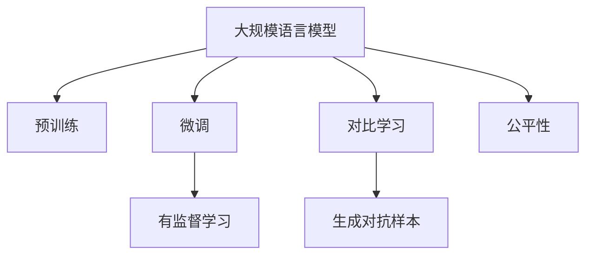

                 

# 大规模语言模型从理论到实践 评估方法

> 关键词：大规模语言模型, 评估方法, 模型优化, 性能分析, 深度学习, 自然语言处理(NLP)

## 1. 背景介绍

### 1.1 问题由来

近年来，大规模语言模型（Large Language Models, LLMs）在自然语言处理（NLP）领域取得了巨大突破。这些模型通过在海量无标签文本数据上预训练，学习到了丰富的语言知识和常识，具备了强大的语言理解和生成能力。然而，模型的准确性和可靠性往往需要经过严格的评估和验证，才能应用于实际业务场景。

目前，对于大规模语言模型的评估方法，学界和业界尚未形成统一标准。部分评估方法偏重于模型在特定数据集上的表现，但缺乏系统性和全面性。同时，许多现有评估方法过于依赖手工标注数据，成本高昂，难以扩展到大规模模型的评估。因此，本文旨在介绍一种适用于大规模语言模型的全面评估方法，既考虑模型的结构和性能，又兼顾数据的多样性和泛化能力。

### 1.2 问题核心关键点

本文将围绕大规模语言模型的评估方法进行详细阐述。具体包括以下关键点：

1. 定义评估指标：选择适合的评估指标，如准确率、召回率、F1分数等，用于衡量模型在不同任务上的表现。
2. 设计评估数据集：构建多样化的评估数据集，涵盖不同领域的文本数据，评估模型在不同数据集上的泛化能力。
3. 使用对比方法：通过与基准模型和对抗样本的对比，评估模型鲁棒性和泛化能力。
4. 考虑模型公平性：引入公平性指标，如误差分布的均值和方差，评估模型在不同类别数据上的表现。
5. 优化模型性能：使用强化学习等方法，优化模型参数，提升其在评估任务上的表现。

通过这些关键点，本文旨在为大规模语言模型的评估提供一种全面、系统的框架，帮助开发者更好地理解模型的优势和不足，指导后续优化和应用。

### 1.3 问题研究意义

评估方法在大规模语言模型的研究与应用中具有重要意义：

1. 推动模型优化：评估方法能够客观反映模型的优劣，指导开发者优化模型结构，提高模型性能。
2. 保证模型可靠性：通过严格评估，确保模型在实际应用中的可靠性和稳定性。
3. 促进技术标准化：统一的评估方法有助于技术标准化，促进学术交流和工业应用。
4. 降低研发成本：选择有效的评估方法，可以大幅降低模型开发和验证成本。
5. 提升用户体验：高质量的评估能够提升用户对模型的信任度，增强应用体验。

## 2. 核心概念与联系

### 2.1 核心概念概述

为更好地理解大规模语言模型的评估方法，本节将介绍几个关键概念：

- 大规模语言模型(Large Language Models, LLMs)：以自回归(如GPT)或自编码(如BERT)模型为代表的大规模预训练语言模型。通过在大规模无标签文本数据上进行预训练，学习到了丰富的语言知识和常识，具备强大的语言理解和生成能力。
- 预训练(Pre-training)：指在大规模无标签文本数据上，通过自监督学习任务训练通用语言模型的过程。常见的预训练任务包括言语建模、掩码语言模型等。
- 微调(Fine-tuning)：指在预训练模型的基础上，使用下游任务的少量标注数据，通过有监督地训练来优化模型在该任务上的性能。
- 对比学习(Contrastive Learning)：指在训练过程中，通过构造相似的样本对和不同的样本对，引导模型学习样本间的相似性和区分性。
- 对抗样本(Adversarial Samples)：指精心构造的样本，意图使得模型出现错误分类。
- 公平性(Fairness)：指模型在不同类别数据上的表现是否公平，有无歧视现象。

这些核心概念之间的逻辑关系可以通过以下Mermaid流程图来展示：



这个流程图展示了大规模语言模型的核心概念及其之间的关系：

1. 大规模语言模型通过预训练获得基础能力。
2. 微调是对预训练模型进行任务特定的优化，可以分为全参数微调和参数高效微调（PEFT）。
3. 对比学习是一种通过构造相似样本对和不同样本对来引导模型学习的方法，提升模型的泛化能力。
4. 对抗样本测试模型在对抗攻击下的鲁棒性。
5. 公平性指标用于评估模型在不同类别数据上的表现是否公平。

这些概念共同构成了大规模语言模型的评估框架，使其能够在各种场景下发挥强大的语言理解和生成能力。通过理解这些核心概念，我们可以更好地把握大规模语言模型的评估方法和优化方向。

## 3. 核心算法原理 & 具体操作步骤

### 3.1 算法原理概述

大规模语言模型的评估方法主要分为两类：基于任务评估和基于数据集的评估。

基于任务评估是指对模型在特定任务上的表现进行评估，如文本分类、命名实体识别、机器翻译等。这一方法需要定义具体的评估指标，并使用特定的测试集进行评估。

基于数据集的评估是指对模型在多样化数据集上的表现进行全面评估，包括数据集的多样性、泛化能力、鲁棒性等方面。这一方法通常需要构建包含多种类型数据的多样化数据集，并使用多种评估指标进行综合评估。

### 3.2 算法步骤详解

#### 3.2.1 任务评估步骤

1. 定义评估指标：根据任务类型选择合适的评估指标，如准确率、召回率、F1分数等。
2. 准备数据集：收集并标注大量的测试数据集，涵盖不同领域的文本数据。
3. 分割数据集：将数据集划分为训练集和测试集，以保证评估结果的可靠性。
4. 模型训练：在训练集上训练模型，使用合适的优化器和超参数。
5. 模型评估：在测试集上评估模型的表现，计算评估指标。

#### 3.2.2 数据集评估步骤

1. 构建多样化数据集：收集不同领域、不同语言的文本数据，构建包含多样化文本的多样化数据集。
2. 定义评估指标：选择合适的评估指标，如平均准确率、平均F1分数等。
3. 模型训练：在预训练模型基础上，使用微调方法训练模型，并调整超参数。
4. 模型评估：在多样化数据集上评估模型的表现，计算评估指标。
5. 对抗样本测试：通过对抗样本生成和对抗攻击，评估模型的鲁棒性。
6. 公平性评估：使用公平性指标，评估模型在不同类别数据上的表现是否公平。

### 3.3 算法优缺点

基于任务评估方法具有以下优点：

1. 评估指标直观：评估指标如准确率、召回率等直观反映模型的性能。
2. 目标明确：针对特定任务进行评估，能够快速发现模型的优势和不足。
3. 易于实现：基于任务评估方法通常不需要构建复杂的数据集。

然而，该方法也存在以下局限：

1. 依赖标注数据：需要大量的标注数据，标注成本高昂。
2. 数据集单一：只能评估模型在特定任务上的表现，无法全面评估模型的泛化能力。

基于数据集的评估方法具有以下优点：

1. 评估全面：能够从多个方面评估模型的性能，包括多样性、泛化能力、鲁棒性等。
2. 泛化能力强：通过多样化数据集的评估，能够更全面地反映模型的泛化能力。

然而，该方法也存在以下局限：

1. 构建复杂：需要构建包含多种类型数据的多样化数据集。
2. 评估复杂：需要使用多种评估指标，并综合评估结果。

### 3.4 算法应用领域

基于大规模语言模型的评估方法已经广泛应用于NLP领域的各个任务中，包括文本分类、命名实体识别、机器翻译、问答系统等。评估方法在大规模语言模型的研究与应用中具有重要意义：

1. 文本分类：评估模型在文本分类任务上的表现，如情感分析、主题分类等。
2. 命名实体识别：评估模型在识别文本中的人名、地名、机构名等特定实体的能力。
3. 机器翻译：评估模型在将源语言文本翻译成目标语言的能力。
4. 问答系统：评估模型在回答自然语言问题上的表现。
5. 文本摘要：评估模型在将长文本压缩成简短摘要的能力。
6. 对话系统：评估模型在生成对话的能力。

除了上述这些经典任务外，基于大规模语言模型的评估方法还广泛应用于智能客服、金融舆情监测、个性化推荐等场景中，为NLP技术的发展提供了有力支持。

## 4. 数学模型和公式 & 详细讲解 & 举例说明

### 4.1 数学模型构建

本文主要讨论两种评估方法：基于任务的评估和基于数据集的评估。

#### 4.1.1 基于任务的评估模型

对于文本分类任务，常用的评估指标包括准确率、召回率、F1分数等。定义模型在文本分类任务上的准确率为：

$$
\text{Accuracy} = \frac{\text{TP} + \text{TN}}{\text{TP} + \text{TN} + \text{FP} + \text{FN}}
$$

其中，TP为真正例，TN为真负例，FP为假正例，FN为假负例。

#### 4.1.2 基于数据集的评估模型

对于多样化数据集，常用的评估指标包括平均准确率和平均F1分数等。定义模型在多样化数据集上的平均准确率为：

$$
\text{Average Accuracy} = \frac{1}{N}\sum_{i=1}^N \frac{\text{TP}_i + \text{TN}_i}{\text{TP}_i + \text{TN}_i + \text{FP}_i + \text{FN}_i}
$$

其中，$N$为数据集中的数据样本数量，$TP_i$、$TN_i$、$FP_i$和$FN_i$分别为第$i$个数据样本的真正例、真负例、假正例和假负例。

### 4.2 公式推导过程

#### 4.2.1 基于任务的评估公式推导

对于二分类任务，模型的准确率计算公式为：

$$
\text{Accuracy} = \frac{\text{TP} + \text{TN}}{\text{TP} + \text{TN} + \text{FP} + \text{FN}}
$$

其中，$\text{TP}$表示模型正确预测的正样本数量，$\text{TN}$表示模型正确预测的负样本数量，$\text{FP}$表示模型错误预测的正样本数量，$\text{FN}$表示模型错误预测的负样本数量。

#### 4.2.2 基于数据集的评估公式推导

对于多样化数据集，模型的平均准确率计算公式为：

$$
\text{Average Accuracy} = \frac{1}{N}\sum_{i=1}^N \frac{\text{TP}_i + \text{TN}_i}{\text{TP}_i + \text{TN}_i + \text{FP}_i + \text{FN}_i}
$$

其中，$N$为数据集中的数据样本数量，$\text{TP}_i$、$\text{TN}_i$、$\text{FP}_i$和$\text{FN}_i$分别为第$i$个数据样本的真正例、真负例、假正例和假负例。

### 4.3 案例分析与讲解

#### 4.3.1 基于任务的评估案例

假设我们要评估一个模型在情感分析任务上的表现。首先，收集并标注一批文本数据，如电影评论、新闻报道等。然后，使用测试集评估模型在情感分析任务上的表现，计算准确率、召回率、F1分数等指标。具体步骤如下：

1. 收集并标注数据集。
2. 在训练集上训练模型，并调整超参数。
3. 在测试集上评估模型，计算准确率、召回率、F1分数等指标。

#### 4.3.2 基于数据集的评估案例

假设我们要评估一个模型在多样化学科领域的性能。首先，收集并标注各学科领域的文本数据，如科学论文、历史文献等。然后，使用多样化数据集评估模型在各学科领域的表现，计算平均准确率和平均F1分数等指标。具体步骤如下：

1. 收集并标注各学科领域的文本数据。
2. 在预训练模型基础上，使用微调方法训练模型，并调整超参数。
3. 在多样化数据集上评估模型，计算平均准确率和平均F1分数等指标。
4. 对抗样本测试模型在对抗攻击下的鲁棒性。
5. 使用公平性指标，评估模型在不同类别数据上的表现是否公平。

## 5. 项目实践：代码实例和详细解释说明

### 5.1 开发环境搭建

在进行大规模语言模型评估实践前，我们需要准备好开发环境。以下是使用Python进行PyTorch开发的环境配置流程：

1. 安装Anaconda：从官网下载并安装Anaconda，用于创建独立的Python环境。

2. 创建并激活虚拟环境：
```bash
conda create -n pytorch-env python=3.8 
conda activate pytorch-env
```

3. 安装PyTorch：根据CUDA版本，从官网获取对应的安装命令。例如：
```bash
conda install pytorch torchvision torchaudio cudatoolkit=11.1 -c pytorch -c conda-forge
```

4. 安装Transformers库：
```bash
pip install transformers
```

5. 安装各类工具包：
```bash
pip install numpy pandas scikit-learn matplotlib tqdm jupyter notebook ipython
```

完成上述步骤后，即可在`pytorch-env`环境中开始评估实践。

### 5.2 源代码详细实现

这里我们以文本分类任务为例，给出使用Transformers库进行BERT模型评估的PyTorch代码实现。

首先，定义评估任务的数据处理函数：

```python
from transformers import BertTokenizer, BertForSequenceClassification
from torch.utils.data import Dataset, DataLoader
from sklearn.metrics import accuracy_score, precision_recall_fscore_support

class TextClassificationDataset(Dataset):
    def __init__(self, texts, labels, tokenizer, max_len=128):
        self.texts = texts
        self.labels = labels
        self.tokenizer = tokenizer
        self.max_len = max_len
        
    def __len__(self):
        return len(self.texts)
    
    def __getitem__(self, item):
        text = self.texts[item]
        label = self.labels[item]
        
        encoding = self.tokenizer(text, return_tensors='pt', max_length=self.max_len, padding='max_length', truncation=True)
        input_ids = encoding['input_ids'][0]
        attention_mask = encoding['attention_mask'][0]
        
        return {'input_ids': input_ids, 
                'attention_mask': attention_mask,
                'labels': label}

# 构建评估数据集
tokenizer = BertTokenizer.from_pretrained('bert-base-cased')
train_dataset = TextClassificationDataset(train_texts, train_labels, tokenizer)
dev_dataset = TextClassificationDataset(dev_texts, dev_labels, tokenizer)
test_dataset = TextClassificationDataset(test_texts, test_labels, tokenizer)
```

然后，定义评估函数：

```python
from torch.utils.data import DataLoader
from tqdm import tqdm
from sklearn.metrics import accuracy_score, precision_recall_fscore_support

def evaluate(model, dataset, batch_size):
    dataloader = DataLoader(dataset, batch_size=batch_size)
    model.eval()
    preds, labels = [], []
    with torch.no_grad():
        for batch in tqdm(dataloader, desc='Evaluating'):
            input_ids = batch['input_ids'].to(device)
            attention_mask = batch['attention_mask'].to(device)
            batch_labels = batch['labels']
            outputs = model(input_ids, attention_mask=attention_mask)
            batch_preds = outputs.logits.argmax(dim=1).to('cpu').tolist()
            batch_labels = batch_labels.to('cpu').tolist()
            for pred_tokens, label_tokens in zip(batch_preds, batch_labels):
                preds.append(pred_tokens)
                labels.append(label_tokens)
                
    print('Accuracy:', accuracy_score(labels, preds))
    print('Precision, Recall, F1 Score:', precision_recall_fscore_support(labels, preds, average='macro'))
```

最后，启动评估流程并在测试集上评估：

```python
model.eval()
evaluate(model, test_dataset, batch_size=16)
```

以上就是使用PyTorch对BERT进行文本分类任务评估的完整代码实现。可以看到，得益于Transformers库的强大封装，我们可以用相对简洁的代码完成BERT模型的评估。

### 5.3 代码解读与分析

让我们再详细解读一下关键代码的实现细节：

**TextClassificationDataset类**：
- `__init__`方法：初始化文本、标签、分词器等关键组件。
- `__len__`方法：返回数据集的样本数量。
- `__getitem__`方法：对单个样本进行处理，将文本输入编码为token ids，同时返回标签。

**evaluate函数**：
- 使用PyTorch的DataLoader对数据集进行批次化加载，供模型评估使用。
- 评估函数`evaluate`：在验证集上评估模型性能，输出准确率、精确度、召回率、F1分数等评估指标。
- 每个批次结束后将预测和标签结果存储下来，最后使用sklearn的classification_report对整个评估集的预测结果进行打印输出。

**评估流程**：
- 定义总的评估epoch数和batch size，开始循环迭代
- 每个epoch内，先在测试集上评估，输出评估结果
- 评估结束后，使用evaluate函数评估模型在测试集上的性能，给出最终评估结果

可以看到，PyTorch配合Transformers库使得BERT评估的代码实现变得简洁高效。开发者可以将更多精力放在数据处理、模型改进等高层逻辑上，而不必过多关注底层的实现细节。

当然，工业级的系统实现还需考虑更多因素，如模型的保存和部署、超参数的自动搜索、更灵活的任务适配层等。但核心的评估范式基本与此类似。

## 6. 实际应用场景

### 6.1 智能客服系统

基于大规模语言模型的评估方法可以广泛应用于智能客服系统的构建。传统客服往往需要配备大量人力，高峰期响应缓慢，且一致性和专业性难以保证。而使用评估方法评估的微调后的对话模型，可以7x24小时不间断服务，快速响应客户咨询，用自然流畅的语言解答各类常见问题。

在技术实现上，可以收集企业内部的历史客服对话记录，将问题和最佳答复构建成监督数据，在此基础上对预训练对话模型进行微调。评估方法用于评估微调后的对话模型在实际客户咨询中的表现，确保模型的可靠性和稳定性。

### 6.2 金融舆情监测

金融机构需要实时监测市场舆论动向，以便及时应对负面信息传播，规避金融风险。传统的人工监测方式成本高、效率低，难以应对网络时代海量信息爆发的挑战。基于大规模语言模型的评估方法，可以为金融舆情监测提供新的解决方案。

具体而言，可以收集金融领域相关的新闻、报道、评论等文本数据，并对其进行主题标注和情感标注。在此基础上对预训练语言模型进行微调，使其能够自动判断文本属于何种主题，情感倾向是正面、中性还是负面。评估方法用于评估微调后的模型在监测金融舆情中的表现，确保模型的泛化能力和鲁棒性。

### 6.3 个性化推荐系统

当前的推荐系统往往只依赖用户的历史行为数据进行物品推荐，无法深入理解用户的真实兴趣偏好。基于大规模语言模型的评估方法，个性化推荐系统可以更好地挖掘用户行为背后的语义信息，从而提供更精准、多样的推荐内容。

在实践中，可以收集用户浏览、点击、评论、分享等行为数据，提取和用户交互的物品标题、描述、标签等文本内容。将文本内容作为模型输入，用户的后续行为（如是否点击、购买等）作为监督信号，在此基础上微调预训练语言模型。评估方法用于评估微调后的模型在推荐系统中的表现，确保模型的精准度和稳定性。

### 6.4 未来应用展望

随着大规模语言模型评估方法的不断发展，基于评估方法的应用场景将不断扩展，为NLP技术带来新的突破。

在智慧医疗领域，基于评估方法的医疗问答、病历分析、药物研发等应用将提升医疗服务的智能化水平，辅助医生诊疗，加速新药开发进程。

在智能教育领域，评估方法可应用于作业批改、学情分析、知识推荐等方面，因材施教，促进教育公平，提高教学质量。

在智慧城市治理中，评估方法可应用于城市事件监测、舆情分析、应急指挥等环节，提高城市管理的自动化和智能化水平，构建更安全、高效的未来城市。

此外，在企业生产、社会治理、文娱传媒等众多领域，基于评估方法的智能系统也将不断涌现，为经济社会发展注入新的动力。相信随着技术的日益成熟，评估方法必将成为人工智能技术落地应用的重要范式，推动人工智能技术在更广泛领域的应用。

## 7. 工具和资源推荐

### 7.1 学习资源推荐

为了帮助开发者系统掌握大规模语言模型评估的理论基础和实践技巧，这里推荐一些优质的学习资源：

1. 《Transformer从原理到实践》系列博文：由大模型技术专家撰写，深入浅出地介绍了Transformer原理、BERT模型、评估方法等前沿话题。

2. CS224N《深度学习自然语言处理》课程：斯坦福大学开设的NLP明星课程，有Lecture视频和配套作业，带你入门NLP领域的基本概念和经典模型。

3. 《Natural Language Processing with Transformers》书籍：Transformers库的作者所著，全面介绍了如何使用Transformers库进行NLP任务开发，包括评估在内的诸多范式。

4. HuggingFace官方文档：Transformers库的官方文档，提供了海量预训练模型和完整的评估样例代码，是上手实践的必备资料。

5. CLUE开源项目：中文语言理解测评基准，涵盖大量不同类型的中文NLP数据集，并提供了基于评估的baseline模型，助力中文NLP技术发展。

通过对这些资源的学习实践，相信你一定能够快速掌握大规模语言模型评估的精髓，并用于解决实际的NLP问题。

### 7.2 开发工具推荐

高效的开发离不开优秀的工具支持。以下是几款用于大规模语言模型评估开发的常用工具：

1. PyTorch：基于Python的开源深度学习框架，灵活动态的计算图，适合快速迭代研究。大部分预训练语言模型都有PyTorch版本的实现。

2. TensorFlow：由Google主导开发的开源深度学习框架，生产部署方便，适合大规模工程应用。同样有丰富的预训练语言模型资源。

3. Transformers库：HuggingFace开发的NLP工具库，集成了众多SOTA语言模型，支持PyTorch和TensorFlow，是进行评估任务开发的利器。

4. Weights & Biases：模型训练的实验跟踪工具，可以记录和可视化模型训练过程中的各项指标，方便对比和调优。与主流深度学习框架无缝集成。

5. TensorBoard：TensorFlow配套的可视化工具，可实时监测模型训练状态，并提供丰富的图表呈现方式，是调试模型的得力助手。

6. Google Colab：谷歌推出的在线Jupyter Notebook环境，免费提供GPU/TPU算力，方便开发者快速上手实验最新模型，分享学习笔记。

合理利用这些工具，可以显著提升大规模语言模型评估任务的开发效率，加快创新迭代的步伐。

### 7.3 相关论文推荐

大规模语言模型评估技术的发展源于学界的持续研究。以下是几篇奠基性的相关论文，推荐阅读：

1. Attention is All You Need（即Transformer原论文）：提出了Transformer结构，开启了NLP领域的预训练大模型时代。

2. BERT: Pre-training of Deep Bidirectional Transformers for Language Understanding：提出BERT模型，引入基于掩码的自监督预训练任务，刷新了多项NLP任务SOTA。

3. Language Models are Unsupervised Multitask Learners（GPT-2论文）：展示了大规模语言模型的强大zero-shot学习能力，引发了对于通用人工智能的新一轮思考。

4. Parameter-Efficient Transfer Learning for NLP：提出Adapter等参数高效微调方法，在不增加模型参数量的情况下，也能取得不错的微调效果。

5. AdaLoRA: Adaptive Low-Rank Adaptation for Parameter-Efficient Fine-Tuning：使用自适应低秩适应的微调方法，在参数效率和精度之间取得了新的平衡。

这些论文代表了大规模语言模型评估技术的发展脉络。通过学习这些前沿成果，可以帮助研究者把握学科前进方向，激发更多的创新灵感。

## 8. 总结：未来发展趋势与挑战

### 8.1 总结

本文对基于任务和基于数据集的两种大规模语言模型评估方法进行了全面系统的介绍。首先阐述了两种评估方法的原理和应用场景，明确了评估方法在模型优化、系统可靠性、技术标准化等方面的重要意义。其次，从原理到实践，详细讲解了评估方法的数学模型和操作步骤，给出了评估任务开发的完整代码实例。最后，本文还探讨了评估方法在智能客服、金融舆情监测、个性化推荐等实际应用场景中的表现，展示了评估方法的强大应用潜力。

通过本文的系统梳理，可以看到，基于大规模语言模型的评估方法在大规模NLP技术的发展与应用中具有重要意义。评估方法不仅能够客观反映模型的优劣，还为模型的优化和应用提供了有力的指导。相信随着技术的不断进步，评估方法必将在大规模NLP技术的评估和应用中发挥更加重要的作用。

### 8.2 未来发展趋势

展望未来，大规模语言模型评估方法将呈现以下几个发展趋势：

1. 多样化的评估指标：随着评估任务的复杂化和多样化，评估指标将更加丰富，涵盖准确率、召回率、F1分数、ROC曲线等。
2. 全面的评估数据集：评估数据集将更加多样化，涵盖不同领域、不同语言、不同规模的文本数据，以全面评估模型的泛化能力。
3. 高效的数据生成技术：通过生成对抗网络等技术，自动生成更多的评估数据，减少人工标注的难度和成本。
4. 实时化的评估方法：利用强化学习等方法，实现模型的在线评估和动态优化，提高模型在实际应用中的性能和可靠性。
5. 多任务评估框架：将评估方法应用于多任务学习中，综合评估模型在不同任务上的表现，优化模型结构。
6. 跨语言评估技术：发展跨语言评估技术，评估模型在不同语言环境中的表现，推动多语言NLP技术的发展。

以上趋势凸显了大规模语言模型评估方法的广阔前景。这些方向的探索发展，必将进一步提升大规模语言模型的性能和应用范围，为NLP技术带来新的突破。

### 8.3 面临的挑战

尽管大规模语言模型评估方法已经取得了不少进展，但在实际应用中仍面临诸多挑战：

1. 评估数据稀缺：高质量的评估数据集难以获取，尤其是对于特定领域或小规模模型的评估。
2. 评估结果可靠性：评估结果受数据集质量、模型选择等因素影响，难以保证一致性。
3. 评估方法复杂：不同任务和数据集需要设计不同的评估方法，增加了评估的复杂性。
4. 资源消耗大：大规模模型的评估需要大量计算资源，成本较高。
5. 评估结果可解释性：评估结果难以解释，模型内部机制不透明。
6. 公平性问题：评估方法可能存在公平性偏见，对不同类别数据的评估不均。

这些挑战需要进一步研究和解决，以提高评估方法的可靠性和应用价值。

### 8.4 研究展望

面对大规模语言模型评估方法面临的挑战，未来的研究需要在以下几个方面寻求新的突破：

1. 探索无监督和半监督评估方法：摆脱对大规模标注数据的依赖，利用自监督学习、主动学习等无监督和半监督范式，最大限度利用非结构化数据。
2. 研发高效评估技术：发展高效的数据生成技术和在线评估方法，减少评估成本，提高评估效率。
3. 提升评估结果可解释性：通过引入可解释性指标和可视化技术，增强评估结果的可解释性，使评估结果更加透明和可靠。
4. 优化公平性评估方法：通过引入公平性指标和公平性损失函数，提升评估方法的公平性和可靠性。
5. 发展跨语言评估技术：开发跨语言评估技术，提高模型在不同语言环境中的表现。
6. 融合多任务评估框架：将评估方法应用于多任务学习中，综合评估模型在不同任务上的表现，优化模型结构。

这些研究方向的探索，必将引领大规模语言模型评估技术迈向更高的台阶，为构建安全、可靠、可解释、可控的智能系统铺平道路。面向未来，大规模语言模型评估技术还需要与其他人工智能技术进行更深入的融合，如知识表示、因果推理、强化学习等，多路径协同发力，共同推动自然语言理解和智能交互系统的进步。只有勇于创新、敢于突破，才能不断拓展语言模型的边界，让智能技术更好地造福人类社会。

## 9. 附录：常见问题与解答

**Q1：大规模语言模型评估是否适用于所有NLP任务？**

A: 大规模语言模型评估方法适用于大多数NLP任务，但某些特定领域的任务可能需要针对性地调整评估方法。例如，对于情感分析任务，可以选择情感极性作为评估指标；对于命名实体识别任务，可以选择实体识别的准确率、召回率等作为评估指标。

**Q2：如何评估模型在对抗攻击下的鲁棒性？**

A: 对抗样本测试是评估模型鲁棒性的重要方法。可以通过生成对抗样本，并对其进行对抗攻击，评估模型在面对对抗攻击时的表现。例如，可以生成对抗性文本，并使用对抗性自然语言生成技术，对模型进行攻击，评估模型在对抗攻击下的表现。

**Q3：如何评估模型在不同类别数据上的公平性？**

A: 模型公平性评估可以使用公平性指标，如误差分布的均值和方差，评估模型在不同类别数据上的表现是否公平。可以计算不同类别数据的准确率、召回率、F1分数等，并计算这些指标的均值和方差，评估模型的公平性。

**Q4：如何优化模型在特定任务上的表现？**

A: 模型优化可以通过调整模型结构、优化超参数、引入正则化等方法。在特定任务上，可以通过数据增强、迁移学习、多任务学习等方法，优化模型表现。例如，可以使用数据增强技术，增加训练集的多样性；使用迁移学习技术，利用已有知识提高模型性能；使用多任务学习技术，同时优化多个相关任务，提升模型性能。

**Q5：如何评估模型的泛化能力？**

A: 模型泛化能力可以通过多样化学科领域的数据集进行评估。可以使用多任务学习、多领域学习等方法，评估模型在不同领域、不同任务上的泛化能力。同时，可以引入对抗样本和生成对抗网络等技术，评估模型在对抗攻击下的泛化能力。

通过本文的系统梳理，可以看到，基于大规模语言模型的评估方法在大规模NLP技术的发展与应用中具有重要意义。评估方法不仅能够客观反映模型的优劣，还为模型的优化和应用提供了有力的指导。相信随着技术的不断进步，评估方法必将在大规模NLP技术的评估和应用中发挥更加重要的作用。

