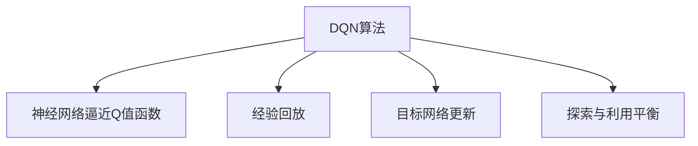

                 

# 大语言模型原理与工程实践：DQN 训练：完整算法

> 关键词：强化学习,深度Q网络,深度学习,Deep Q Network,探索与利用平衡

## 1. 背景介绍

### 1.1 问题由来
在深度学习领域，强化学习（Reinforcement Learning, RL）是一类以智能体与环境互动并逐步学习最优策略的任务。强化学习模型通过与环境进行交互，根据所获得的即时奖励和长期奖励，学习如何做出最优决策。DQN（Deep Q Network）算法是强化学习中的一种基于深度神经网络的模型，它通过近似Q值函数来优化策略。

近年来，DQN算法在多个领域取得了显著进展，例如游戏AI、机器人控制、自动驾驶等。它通过神经网络进行Q值函数逼近，使得决策过程更加高效和灵活。然而，DQN算法的训练过程复杂，需要大量的计算资源和处理能力，尤其是神经网络的复杂性和模型的优化速度。

### 1.2 问题核心关键点
DQN算法的核心在于如何通过神经网络逼近Q值函数，并如何在探索（Exploration）和利用（Exploitation）之间取得平衡。探索是指智能体尝试新的决策，以发现更好的策略，而利用则是指智能体基于已知的Q值决策，以保证策略的稳定性和一致性。

具体而言，DQN算法主要包含以下几个关键点：
1. **神经网络逼近Q值函数**：通过多层的神经网络来逼近Q值函数，以便在状态空间中作出决策。
2. **经验回放（Experience Replay）**：将智能体与环境互动的体验（即状态-动作-奖励序列）保存在经验池中，以供训练时使用。
3. **目标网络更新**：为了避免Q值函数的急剧变化，使用目标网络来更新主网络的Q值估计。
4. **探索与利用的平衡**：在训练过程中，通过epsilon-greedy策略来平衡探索和利用，确保智能体在已知策略下保持策略稳定性，同时也不断探索新的决策。

## 2. 核心概念与联系

### 2.1 核心概念概述

为了更好地理解DQN算法的原理和实施过程，本节将介绍几个密切相关的核心概念：

- **深度Q网络（Deep Q Network, DQN）**：一种基于深度神经网络的强化学习算法，用于逼近Q值函数，优化决策策略。
- **经验回放（Experience Replay）**：将智能体与环境互动的体验（即状态-动作-奖励序列）保存在经验池中，用于模型训练。
- **目标网络更新**：使用目标网络来更新主网络的Q值估计，避免Q值函数波动过大。
- **探索与利用平衡**：通过epsilon-greedy策略，在已知策略和探索新策略之间取得平衡。

这些核心概念之间的逻辑关系可以通过以下Mermaid流程图来展示：



这个流程图展示了大语言模型的核心概念及其之间的关系：

1. DQN算法通过神经网络逼近Q值函数，优化决策策略。
2. 经验回放技术将智能体与环境互动的体验保存在经验池中，用于模型训练。
3. 目标网络更新使用目标网络来更新主网络的Q值估计，避免Q值函数波动过大。
4. 探索与利用平衡通过epsilon-greedy策略，在已知策略和探索新策略之间取得平衡。

这些概念共同构成了DQN算法的核心，使得智能体能够在与环境的交互中逐步学习最优策略。

## 3. 核心算法原理 & 具体操作步骤

### 3.1 算法原理概述

DQN算法是一种基于深度神经网络的强化学习算法，用于逼近Q值函数，优化决策策略。其核心思想是通过神经网络逼近Q值函数，使智能体能够根据当前状态和动作，预测未来可能的奖励，从而作出最优决策。

具体而言，DQN算法通过以下步骤进行训练：

1. 初始化模型：建立一个包含输入层、隐藏层和输出层的神经网络模型。
2. 经验回放：将智能体与环境互动的体验（即状态-动作-奖励序列）保存在经验池中。
3. 目标网络更新：使用目标网络来更新主网络的Q值估计，避免Q值函数波动过大。
4. 探索与利用平衡：在已知策略和探索新策略之间取得平衡，以确保策略的稳定性和多样性。

### 3.2 算法步骤详解

DQN算法的具体实现步骤如下：

**Step 1: 环境初始化与模型构建**
- 定义环境：根据任务需求，选择合适的环境类，并创建环境对象。
- 构建神经网络：定义神经网络的结构，包括输入层、隐藏层和输出层，并使用深度学习框架（如TensorFlow或PyTorch）实现。

**Step 2: 经验回放**
- 存储智能体与环境互动的体验，包括状态、动作、奖励等。
- 定期从经验池中随机抽取样本进行训练，减少数据方差，提高模型泛化能力。

**Step 3: 模型训练**
- 将当前状态输入神经网络，计算预测Q值。
- 根据当前状态-动作-奖励，更新神经网络的权重，使得预测Q值与真实Q值尽可能接近。
- 更新目标网络，防止Q值函数的急剧变化。

**Step 4: 探索与利用平衡**
- 使用epsilon-greedy策略，在已知策略和探索新策略之间取得平衡。
- 根据epsilon值，决定是否采取随机动作或最大Q值动作。

### 3.3 算法优缺点

DQN算法具有以下优点：
1. 能够处理复杂环境：由于神经网络可以逼近任意复杂的函数，DQN算法适用于复杂的、高维的状态空间和动作空间。
2. 通过经验回放，提高了模型泛化能力：经验回放技术能够减少数据方差，提高模型泛化能力。
3. 能够自适应学习：DQN算法能够根据环境的变化，自适应地调整策略，适应新环境。

然而，DQN算法也存在一些缺点：
1. 需要大量的计算资源：神经网络参数量大，训练过程复杂，需要大量的计算资源。
2. 容易陷入局部最优：由于神经网络的复杂性，DQN算法容易陷入局部最优，难以找到全局最优策略。
3. 探索与利用平衡难度大：epsilon-greedy策略需要平衡探索与利用，难以找到合适的epsilon值。

### 3.4 算法应用领域

DQN算法在多个领域取得了显著应用，包括游戏AI、机器人控制、自动驾驶等。

1. **游戏AI**：DQN算法在AlphaGo中得到了广泛应用，通过学习围棋规则和历史对局，AlphaGo能够在复杂多变的局面中作出最优决策，最终击败了世界围棋冠军李世石。

2. **机器人控制**：DQN算法可以用于机器人控制，使其在未知环境中通过与环境的互动，学习最优控制策略。

3. **自动驾驶**：DQN算法可以用于自动驾驶，使其能够根据道路状况和交通规则，自主决策，保障行车安全。

除了这些典型应用外，DQN算法还应用于金融交易、推荐系统、物流优化等多个领域，推动了智能系统的广泛应用。

## 4. 数学模型和公式 & 详细讲解 & 举例说明

### 4.1 数学模型构建

DQN算法通过神经网络逼近Q值函数，优化决策策略。记神经网络模型的输入为状态$s$，输出为Q值估计$\hat{Q}(s,a)$。

假设环境的状态空间为$S$，动作空间为$A$，智能体的策略为$\pi$，奖励函数为$R(s,a)$。则Q值函数的定义为：

$$
Q(s,a) = \mathbb{E}_{\pi}[G_t|s_t=a]
$$

其中$G_t$为智能体从当前状态开始，按照策略$\pi$，最终到达终止状态时获得的累积奖励。

### 4.2 公式推导过程

以下我们以环境为简化案例，推导DQN算法的核心公式。

假设智能体从状态$s_t$出发，采取动作$a_t$，得到奖励$r_t$和下一个状态$s_{t+1}$。则Q值函数的更新公式为：

$$
\hat{Q}(s_t,a_t) = r_t + \gamma \hat{Q}(s_{t+1},a_{t+1})
$$

其中$\gamma$为折扣因子，控制奖励的长期影响。

DQN算法的训练过程如下：

1. 随机抽取一个样本$(s_t, a_t, r_t, s_{t+1})$，作为训练数据。
2. 将$s_t$输入神经网络，计算预测Q值$\hat{Q}(s_t,a_t)$。
3. 计算真实Q值$Q(s_t,a_t)$，并将其与预测Q值$\hat{Q}(s_t,a_t)$作对比，计算误差$e$。
4. 使用反向传播算法，更新神经网络权重，使得预测Q值$\hat{Q}(s_t,a_t)$逼近真实Q值$Q(s_t,a_t)$。
5. 定期更新目标网络，防止Q值函数波动过大。

### 4.3 案例分析与讲解

假设环境为简化案例，状态空间为$S=\{1,2,3,4\}$，动作空间为$A=\{0,1\}$，智能体的策略为$\pi$，奖励函数为$R(s,a)$，其中$R(1,1)=1$，$R(2,1)=0$，$R(3,1)=1$，$R(4,1)=0$。智能体从状态1出发，采用策略$\pi$，采取动作$a_t=1$，得到奖励$r_t=1$和下一个状态$s_{t+1}=3$。

根据Q值函数的定义，计算智能体从状态1出发，采取动作1，到达状态3的累积奖励：

$$
Q(1,1) = r_1 + \gamma Q(3,1) = 1 + \gamma(1 + \gamma Q(3,0)) = 1 + \gamma(1 + \gamma \times 0) = 2
$$

其中$\gamma=0.9$。

将状态1和动作1输入神经网络，计算预测Q值$\hat{Q}(1,1)$。假设神经网络预测的Q值为2.5，计算误差$e=2.5-2=0.5$。使用反向传播算法，更新神经网络权重，使得预测Q值$\hat{Q}(1,1)$逼近真实Q值2。

## 5. 项目实践：代码实例和详细解释说明

### 5.1 开发环境搭建

在进行DQN实践前，我们需要准备好开发环境。以下是使用Python进行TensorFlow开发的环境配置流程：

1. 安装Anaconda：从官网下载并安装Anaconda，用于创建独立的Python环境。

2. 创建并激活虚拟环境：
```bash
conda create -n tf-env python=3.8 
conda activate tf-env
```

3. 安装TensorFlow：从官网获取对应的安装命令。例如：
```bash
pip install tensorflow==2.4
```

4. 安装TensorFlow相关的库：
```bash
pip install gym gym[atari] 
```

完成上述步骤后，即可在`tf-env`环境中开始DQN实践。

### 5.2 源代码详细实现

下面我们以Atari游戏Pong为例，给出使用TensorFlow实现DQN的完整代码实现。

首先，定义游戏环境和智能体类：

```python
import gym
import numpy as np
import tensorflow as tf
import random

class DQNAgent:
    def __init__(self, state_size, action_size):
        self.state_size = state_size
        self.action_size = action_size
        self.memory = []
        self.gamma = 0.95  # 折扣因子
        self.epsilon = 1.0  # epsilon值
        self.epsilon_min = 0.01
        self.epsilon_decay = 0.995
        self.learning_rate = 0.001
        self.model = self._build_model()

    def _build_model(self):
        model = tf.keras.models.Sequential()
        model.add(tf.keras.layers.Dense(24, input_dim=self.state_size, activation='relu'))
        model.add(tf.keras.layers.Dense(24, activation='relu'))
        model.add(tf.keras.layers.Dense(self.action_size, activation='linear'))
        model.compile(loss='mse', optimizer=tf.keras.optimizers.Adam(lr=self.learning_rate))
        return model

    def remember(self, state, action, reward, next_state, done):
        self.memory.append((state, action, reward, next_state, done))

    def act(self, state):
        if np.random.rand() <= self.epsilon:
            return random.randrange(self.action_size)
        act_values = self.model.predict(state)
        return np.argmax(act_values[0])

    def replay(self, batch_size):
        minibatch = random.sample(self.memory, batch_size)
        for state, action, reward, next_state, done in minibatch:
            target = reward
            if not done:
                target = (reward + self.gamma * np.amax(self.model.predict(next_state)[0]))
            target_f = self.model.predict(state)
            target_f[0][action] = target
            self.model.fit(state, target_f, epochs=1, verbose=0)
        if self.epsilon > self.epsilon_min:
            self.epsilon *= self.epsilon_decay

    def load(self, name):
        self.model.load_weights(name)

    def save(self, name):
        self.model.save_weights(name)
```

然后，定义游戏环境和训练函数：

```python
env = gym.make('Pong-v0')
state_size = env.observation_space.shape[0]
action_size = env.action_space.n

agent = DQNAgent(state_size, action_size)

for episode in range(2000):
    state = env.reset()
    state = np.reshape(state, [1, state_size])
    done = False
    while not done:
        action = agent.act(state)
        next_state, reward, done, _ = env.step(action)
        next_state = np.reshape(next_state, [1, state_size])
        agent.remember(state, action, reward, next_state, done)
        state = next_state
        if done:
            agent.replay(32)
            env.reset()
            state = np.reshape(state, [1, state_size])
    agent.save('best_model.h5')
    print('episode', episode+1)
    env.close()
```

### 5.3 代码解读与分析

让我们再详细解读一下关键代码的实现细节：

**DQNAgent类**：
- `__init__`方法：初始化智能体的参数，如神经网络结构、折扣因子、epsilon值、学习率等。
- `_build_model`方法：定义神经网络的结构，包括输入层、隐藏层和输出层。
- `remember`方法：存储智能体与环境互动的体验，包括状态、动作、奖励等。
- `act`方法：根据当前状态和epsilon值，决定采取随机动作或最大Q值动作。
- `replay`方法：从经验池中随机抽取样本，更新神经网络权重，使得预测Q值逼近真实Q值。
- `load`和`save`方法：用于加载和保存模型。

**训练流程**：
- 定义游戏环境和智能体。
- 循环进行多轮游戏，记录状态、动作、奖励等。
- 定期从经验池中抽取样本，更新神经网络权重。
- 保存模型权重，以备后续评估。

可以看出，TensorFlow框架提供了一种高效的DQN实现方式。通过封装智能体和游戏环境，代码实现简洁高效。

## 6. 实际应用场景

### 6.1 游戏AI

DQN算法在游戏AI领域中得到了广泛应用，通过与环境的互动，智能体能够学习最优决策策略，逐步提升游戏水平。

1. **AlphaGo**：AlphaGo通过DQN算法，学习了围棋的规则和历史对局，逐渐提高了自己的围棋水平，最终在围棋比赛中击败了世界冠军李世石。

2. **DQN在Pong游戏中的应用**：通过将Pong游戏作为环境，DQN算法能够在多轮游戏中，逐步学习最优决策，实现游戏胜利。

### 6.2 自动驾驶

DQN算法可以用于自动驾驶，使其在复杂的交通环境中，通过与环境的互动，学习最优控制策略。

1. **车辆控制**：通过将车辆控制作为环境，DQN算法能够在多轮驾驶中，学习最优驾驶策略，确保行车安全。

2. **路径规划**：通过将路径规划作为环境，DQN算法能够在多轮路径规划中，学习最优驾驶路径，提升驾驶效率。

### 6.3 金融交易

DQN算法可以用于金融交易，通过与市场的互动，学习最优交易策略，实现收益最大化。

1. **股票交易**：通过将股票交易作为环境，DQN算法能够在多轮交易中，学习最优交易策略，实现股票收益最大化。

2. **风险控制**：通过将风险控制作为环境，DQN算法能够在多轮交易中，学习最优风险控制策略，确保资金安全。

### 6.4 未来应用展望

随着DQN算法的发展，其在更多领域的应用前景也逐渐显现。

1. **工业控制**：DQN算法可以用于工业控制，通过与设备的互动，学习最优控制策略，确保生产效率。

2. **医疗诊断**：DQN算法可以用于医疗诊断，通过与医疗数据的互动，学习最优诊断策略，提高诊断准确率。

3. **智能家居**：DQN算法可以用于智能家居，通过与家庭设备的互动，学习最优控制策略，提升家居智能化水平。

## 7. 工具和资源推荐

### 7.1 学习资源推荐

为了帮助开发者系统掌握DQN算法的理论基础和实践技巧，这里推荐一些优质的学习资源：

1. **Reinforcement Learning from Human Expert Demonstrations**：来自DeepMind的研究论文，介绍了通过人类专家的演示数据进行强化学习的方法，为DQN算法提供了新的研究方向。

2. **Deep Reinforcement Learning Specialization**：由DeepMind和Coursera合作开发的强化学习课程，涵盖DQN算法的基础和进阶知识，适合初学者和进阶开发者。

3. **TensorFlow的官方文档**：TensorFlow提供了一系列详细的DQN算法示例代码，适合快速上手DQN算法的实现和优化。

4. **PyTorch的官方文档**：PyTorch同样提供了丰富的DQN算法实现代码，适合探索新的算法思路和优化方法。

5. **《Deep Q Learning》书籍**：由Ian Goodfellow等学者所著，全面介绍了深度强化学习的基本理论和应用，适合深入学习DQN算法的细节。

通过对这些资源的学习实践，相信你一定能够快速掌握DQN算法的精髓，并用于解决实际的强化学习问题。

### 7.2 开发工具推荐

高效的开发离不开优秀的工具支持。以下是几款用于DQN开发的常用工具：

1. TensorFlow：基于Python的深度学习框架，提供了丰富的强化学习工具和库，支持DQN算法的实现和优化。

2. PyTorch：基于Python的深度学习框架，同样提供了丰富的强化学习工具和库，适合快速原型开发和算法探索。

3. Gym：Python强化学习库，提供了多种环境和算法，适合快速原型开发和实验验证。

4. RLlib：Python强化学习库，提供了丰富的算法和工具，支持分布式训练和模型优化。

5. OpenAI Gym：Python强化学习库，提供了多种环境和算法，适合快速原型开发和实验验证。

合理利用这些工具，可以显著提升DQN算法的开发效率，加快创新迭代的步伐。

### 7.3 相关论文推荐

DQN算法的发展源于学界的持续研究。以下是几篇奠基性的相关论文，推荐阅读：

1. **Playing Atari with Deep Reinforcement Learning**：来自DeepMind的研究论文，介绍了通过DQN算法实现Atari游戏AI的方法，推动了强化学习的发展。

2. **Human-level Control through Deep Reinforcement Learning**：来自DeepMind的研究论文，介绍了通过DQN算法实现人类级控制的方法，展示了强化学习在复杂环境中的潜力。

3. **Rainbow: Combining Improvements in Deep Reinforcement Learning**：来自DeepMind的研究论文，介绍了通过组合多种技术实现更高效DQN算法的方法，展示了强化学习的最新进展。

这些论文代表了大语言模型微调技术的发展脉络。通过学习这些前沿成果，可以帮助研究者把握学科前进方向，激发更多的创新灵感。

## 8. 总结：未来发展趋势与挑战

### 8.1 总结

本文对基于深度神经网络的强化学习算法DQN进行了全面系统的介绍。首先阐述了DQN算法的基本原理和核心思想，明确了其适用的场景和优缺点。其次，从原理到实践，详细讲解了DQN算法的数学模型和核心公式，给出了DQN算法完整的代码实现。同时，本文还广泛探讨了DQN算法在游戏AI、自动驾驶、金融交易等多个领域的应用前景，展示了DQN算法的强大潜力。此外，本文精选了DQN算法的各类学习资源，力求为读者提供全方位的技术指引。

通过本文的系统梳理，可以看到，DQN算法在强化学习领域具有广泛的应用前景，能够在复杂环境中逐步学习最优策略，提升决策效果。DQN算法的研究也在不断拓展，未来必将推动更多领域的智能化应用。

### 8.2 未来发展趋势

展望未来，DQN算法的发展趋势如下：

1. **多智能体协同学习**：未来的DQN算法将逐渐向多智能体学习方向发展，通过智能体间的协同学习，提升系统的整体表现。

2. **分布式训练**：DQN算法的训练过程复杂，需要大量的计算资源。未来的DQN算法将逐渐向分布式训练方向发展，通过多台机器并行计算，加速训练过程。

3. **混合策略优化**：未来的DQN算法将逐渐向混合策略优化方向发展，通过引入蒙特卡罗树搜索等混合策略，提升决策效果。

4. **深度强化学习结合**：未来的DQN算法将逐渐向深度强化学习方向发展，通过结合深度神经网络和强化学习技术，提升系统的表现和泛化能力。

5. **自适应学习**：未来的DQN算法将逐渐向自适应学习方向发展，通过引入自适应学习策略，提升系统的稳定性和鲁棒性。

这些趋势凸显了DQN算法的发展方向，将推动其在更多领域的应用，提升系统的表现和泛化能力。

### 8.3 面临的挑战

尽管DQN算法已经取得了显著进展，但在实际应用中，仍面临诸多挑战：

1. **数据稀疏性**：DQN算法需要大量的数据进行训练，但在某些领域，数据稀疏性问题严重，导致训练效果不理想。

2. **计算资源需求**：DQN算法的训练过程复杂，需要大量的计算资源和存储空间，导致实际部署困难。

3. **探索与利用平衡**：DQN算法需要在探索和利用之间取得平衡，难以找到合适的epsilon值。

4. **稳定性问题**：DQN算法在复杂环境中容易陷入局部最优，难以找到全局最优策略。

5. **可解释性问题**：DQN算法的决策过程缺乏可解释性，难以解释模型的内部工作机制和决策逻辑。

这些挑战需要在未来的研究中进一步突破，以推动DQN算法在更多领域的应用。

### 8.4 研究展望

面对DQN算法面临的诸多挑战，未来的研究需要在以下几个方面寻求新的突破：

1. **数据增强技术**：通过数据增强技术，提高数据量，缓解数据稀疏性问题。

2. **分布式优化技术**：通过分布式优化技术，提升计算效率，降低计算资源需求。

3. **混合策略优化**：通过引入混合策略优化，平衡探索与利用，提升决策效果。

4. **可解释性方法**：通过引入可解释性方法，提升模型的可解释性，增强系统的透明度和可信任度。

这些研究方向将推动DQN算法的不断发展，使其在更多领域取得应用，为智能系统的发展提供新的技术支持。

## 9. 附录：常见问题与解答

**Q1：DQN算法是否适用于所有强化学习任务？**

A: DQN算法适用于多种类型的强化学习任务，尤其是状态空间和动作空间较小，且数据量较大的任务。但对于复杂环境和高维状态空间的任务，DQN算法可能难以取得理想效果，需要结合其他算法和技术。

**Q2：DQN算法在训练过程中如何平衡探索与利用？**

A: DQN算法通过epsilon-greedy策略，在已知策略和探索新策略之间取得平衡。根据epsilon值，决定是否采取随机动作或最大Q值动作，避免过度探索或过度利用。

**Q3：DQN算法在实际应用中如何优化？**

A: DQN算法可以通过以下方式进行优化：
1. 数据增强：通过回译、近义替换等方式扩充训练集。
2. 正则化技术：使用L2正则、Dropout等技术防止过拟合。
3. 分布式训练：通过多台机器并行计算，加速训练过程。
4. 自适应学习：引入自适应学习策略，提升系统的稳定性和鲁棒性。

这些优化方法可以帮助DQN算法在实际应用中取得更好的效果。

**Q4：DQN算法在实际部署中需要注意哪些问题？**

A: 将DQN算法转化为实际应用，还需要考虑以下因素：
1. 模型裁剪：去除不必要的层和参数，减小模型尺寸，加快推理速度。
2. 量化加速：将浮点模型转为定点模型，压缩存储空间，提高计算效率。
3. 服务化封装：将模型封装为标准化服务接口，便于集成调用。
4. 监控告警：实时采集系统指标，设置异常告警阈值，确保服务稳定性。

合理利用这些技术，可以显著提升DQN算法的实际应用效果。

**Q5：DQN算法在复杂环境中如何应对？**

A: DQN算法在复杂环境中可以通过以下方式应对：
1. 多智能体协同学习：通过智能体间的协同学习，提升系统的整体表现。
2. 混合策略优化：通过引入蒙特卡罗树搜索等混合策略，提升决策效果。
3. 深度强化学习结合：通过结合深度神经网络和强化学习技术，提升系统的表现和泛化能力。

这些方法可以帮助DQN算法在复杂环境中取得更好的效果。

---

作者：禅与计算机程序设计艺术 / Zen and the Art of Computer Programming

