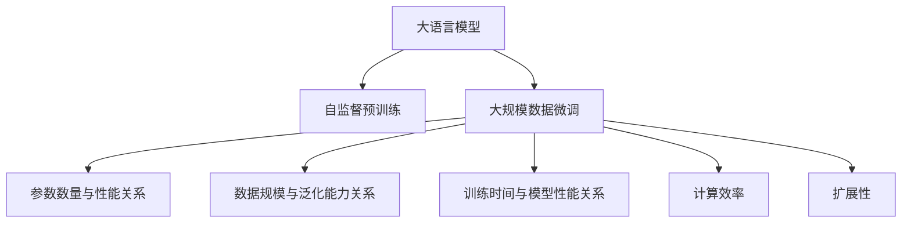

                 

# 大语言模型原理与工程实践：大语言模型的缩放定律

## 1. 背景介绍

### 1.1 问题由来
近年来，深度学习领域迅猛发展，特别是自然语言处理(Natural Language Processing, NLP)和计算机视觉(Computer Vision, CV)等领域，涌现出了大规模预训练模型和微调技术，极大提升了模型的性能和应用范围。然而，大规模模型的构建和训练所需的高成本，以及模型在实际部署中面临的资源瓶颈和计算效率问题，成为制约大模型应用的瓶颈。为此，研究者提出了大模型的缩放定律（Scaling Laws），揭示了模型参数、数据量、训练时间等关键维度之间的数学关系，为构建高效、可扩展的大模型提供了理论依据。

### 1.2 问题核心关键点
大模型缩放定律基于自监督预训练和大规模数据微调，揭示了模型参数数量、数据规模、训练时间等关键维度之间的数学关系，为大模型的构建和优化提供了科学依据。具体来说，大模型缩放定律的核心理论包括：

- 模型参数数量与性能提升的关系：模型参数的增加能够显著提升模型的语言理解能力和生成能力，但存在边际效应递减的趋势。
- 数据规模与模型泛化能力的关系：更大的数据集能够提升模型的泛化能力，但数据集的扩展边际效益逐步递减。
- 训练时间与模型性能的关系：更长的训练时间能够进一步提升模型性能，但所需时间随数据量和参数量的增加而线性增长。

这些理论成果为构建高效、可扩展的大模型提供了理论指导，为大规模深度学习模型的设计和优化提供了重要参考。

## 2. 核心概念与联系

### 2.1 核心概念概述

为更好地理解大模型缩放定律的理论基础和应用方法，本节将介绍几个密切相关的核心概念：

- 大语言模型(Large Language Model, LLM)：以自回归(如GPT)或自编码(如BERT)模型为代表的大规模预训练语言模型。通过在大规模无标签文本语料上进行预训练，学习通用的语言知识，具备强大的语言理解和生成能力。

- 自监督预训练(Self-supervised Pre-training)：指在无标签数据上，通过设计自监督任务(如语言模型、掩码语言模型)训练模型，使得模型学习到通用的语言表示。自监督预训练是构建大语言模型的重要步骤。

- 大模型缩放定律(Scaling Laws)：揭示了模型参数、数据量、训练时间等关键维度之间的数学关系，指导如何构建高效、可扩展的大模型。

- 大规模数据微调(Large-scale Data Fine-tuning)：在预训练模型的基础上，使用大规模标注数据进行微调，使模型适应特定任务，提升模型在该任务上的性能。

- 计算效率(Computational Efficiency)：指模型在推理、训练、存储等方面的计算资源消耗，影响模型的实际应用范围和成本。

- 扩展性(Scalability)：指模型在不同硬件环境、不同任务上的应用能力，能否灵活扩展以应对复杂和多样化的需求。

这些核心概念之间的逻辑关系可以通过以下Mermaid流程图来展示：



这个流程图展示了大语言模型的核心概念及其之间的关系：

1. 大语言模型通过自监督预训练获得基础能力。
2. 自监督预训练使模型学习通用的语言知识。
3. 大规模数据微调在特定任务上对模型进行优化，提升模型性能。
4. 参数数量、数据规模和训练时间决定模型的性能和计算效率。
5. 计算效率和扩展性指导模型的实际应用和优化。

这些概念共同构成了大语言模型的学习和应用框架，使其能够在各种场景下发挥强大的语言理解和生成能力。通过理解这些核心概念，我们可以更好地把握大语言模型的工作原理和优化方向。

## 3. 核心算法原理 & 具体操作步骤
### 3.1 算法原理概述

大语言模型的缩放定律基于自监督预训练和大规模数据微调，揭示了模型参数数量、数据量、训练时间等关键维度之间的数学关系。具体来说，大模型缩放定律的核心理论包括以下几个方面：

- 参数数量与性能提升的关系：模型参数数量的增加能够显著提升模型的语言理解能力和生成能力，但存在边际效应递减的趋势。
- 数据规模与模型泛化能力的关系：更大的数据集能够提升模型的泛化能力，但数据集的扩展边际效益逐步递减。
- 训练时间与模型性能的关系：更长的训练时间能够进一步提升模型性能，但所需时间随数据量和参数量的增加而线性增长。

基于以上理论，我们可以得出结论：在大模型构建中，需要平衡参数数量、数据规模和训练时间等关键维度，以达到最优的性能和计算效率。

### 3.2 算法步骤详解

大模型缩放定律的构建和应用一般包括以下几个关键步骤：

**Step 1: 自监督预训练**
- 收集大规模无标签文本数据，如维基百科、新闻、小说等。
- 使用自监督预训练任务，如语言模型、掩码语言模型等，训练预训练模型。
- 预训练过程可以运行在分布式计算集群上，以充分利用计算资源，加快模型训练。

**Step 2: 大规模数据微调**
- 收集下游任务的标注数据集，如情感分析、问答、翻译等任务的数据集。
- 将预训练模型作为初始化参数，在标注数据集上进行微调。
- 微调过程可以采用多种优化方法，如梯度下降、Adam、Adafactor等，设置合适的学习率和正则化参数。

**Step 3: 性能评估和调优**
- 在验证集上评估微调后的模型性能，如精确度、召回率、F1-score等。
- 根据评估结果，调整模型参数、学习率、正则化参数等超参数，以进一步提升模型性能。
- 可以采用各种正则化技术，如Dropout、L2正则化、Early Stopping等，避免过拟合。

**Step 4: 部署和应用**
- 将微调后的模型部署到实际应用中，进行推理和预测。
- 在实际应用中，需要考虑模型的推理效率、资源消耗和扩展性等因素，进行进一步优化。

### 3.3 算法优缺点

大模型缩放定律具有以下优点：
1. 可解释性：揭示了模型性能和关键维度之间的数学关系，提供了理论指导。
2. 普适性：适用于各类大规模预训练模型和任务。
3. 可操作性：提供了模型构建和优化的关键步骤，指导如何平衡参数、数据和训练时间。

同时，该方法也存在一定的局限性：
1. 理论局限：由于数据和模型的复杂性，理论模型可能无法完全解释实际应用中的现象。
2. 实验复杂：需要大量的实验数据和资源进行模型训练和评估，实验成本较高。
3. 参数依赖：模型的性能依赖于参数数量、数据规模和训练时间等关键维度，优化复杂。

尽管存在这些局限性，但就目前而言，大模型缩放定律仍是构建和优化大语言模型的重要理论依据。未来相关研究的重点在于如何进一步降低实验复杂度，提高模型的普适性和可操作性，同时兼顾理论和实践的一致性。

### 3.4 算法应用领域

大模型缩放定律在多个领域得到了应用，取得了显著的效果。以下是几个典型的应用场景：

- 自然语言处理(NLP)：在文本分类、命名实体识别、问答系统等任务上，基于大模型缩放定律的微调方法显著提升了模型性能。
- 计算机视觉(CV)：在大规模图像识别、目标检测等任务上，通过自监督预训练和大规模数据微调，大幅提升了模型的性能和泛化能力。
- 语音识别(Speech Recognition)：在语音转文本、语音情感识别等任务上，通过大规模预训练和微调，提升了模型的理解和生成能力。
- 推荐系统(Recommendation System)：在商品推荐、音乐推荐等任务上，通过自监督预训练和微调，提高了模型的个性化推荐能力。

## 4. 数学模型和公式 & 详细讲解 & 举例说明

### 4.1 数学模型构建

本节将使用数学语言对大模型缩放定律的理论模型进行严格刻画。

设大语言模型为 $M_{\theta}$，其中 $\theta$ 为模型参数。假设在自监督预训练阶段，模型在无标签数据集 $D_{\text{pretrain}}$ 上进行训练，学习通用语言表示。在微调阶段，模型在标注数据集 $D_{\text{fine-tune}}$ 上进行微调，学习特定任务的知识。

定义模型在自监督预训练任务上的损失函数为 $\mathcal{L}_{\text{pretrain}}(\theta)$，在微调任务上的损失函数为 $\mathcal{L}_{\text{fine-tune}}(\theta)$。则在微调后的模型参数 $\hat{\theta}$ 的优化目标为：

$$
\hat{\theta}=\mathop{\arg\min}_{\theta} \mathcal{L}_{\text{pretrain}}(\theta)+\alpha\mathcal{L}_{\text{fine-tune}}(\theta)
$$

其中 $\alpha$ 为微调和预训练的权衡系数。

### 4.2 公式推导过程

以文本分类任务为例，推导模型性能与参数数量 $N$、数据规模 $S$ 和训练时间 $T$ 之间的关系。

假设模型在自监督预训练任务上的损失函数为 $\mathcal{L}_{\text{pretrain}}(\theta)=\frac{1}{N}\sum_{i=1}^N \ell_i(\theta)$，其中 $\ell_i(\theta)$ 为样本 $i$ 上的损失函数。在微调任务上的损失函数为 $\mathcal{L}_{\text{fine-tune}}(\theta)=\frac{1}{S}\sum_{j=1}^S \ell_j^{\prime}(\theta)$，其中 $\ell_j^{\prime}(\theta)$ 为样本 $j$ 上的损失函数。

模型的总体损失函数为：

$$
\mathcal{L}(\theta)=\mathcal{L}_{\text{pretrain}}(\theta)+\alpha\mathcal{L}_{\text{fine-tune}}(\theta)
$$

为了简化计算，假设自监督预训练和微调任务的损失函数均为交叉熵损失，则总体损失函数可以写为：

$$
\mathcal{L}(\theta)=-\frac{1}{N}\sum_{i=1}^N \log \sigma(\mathbf{X}_i\theta)+\alpha\frac{1}{S}\sum_{j=1}^S \log \sigma(\mathbf{X}_j^{\prime}\theta)
$$

其中 $\sigma$ 为模型在任务上的输出，$\mathbf{X}_i$ 和 $\mathbf{X}_j^{\prime}$ 分别为自监督预训练和微调任务的数据。

对于大规模预训练模型，通常参数数量 $N$ 和数据规模 $S$ 非常庞大，可以采用平均梯度下降法进行优化：

$$
\theta \leftarrow \theta - \eta \nabla_{\theta}\mathcal{L}(\theta)
$$

其中 $\eta$ 为学习率，$\nabla_{\theta}\mathcal{L}(\theta)$ 为总体损失函数的梯度。

### 4.3 案例分析与讲解

为了更好地理解大模型缩放定律，下面通过一个具体案例进行分析。

假设我们有一个包含 $N=1000$ 个样本的自监督预训练任务，每个样本包含 $d=1024$ 维特征。模型在自监督预训练任务上的损失函数为：

$$
\mathcal{L}_{\text{pretrain}}(\theta)=-\frac{1}{N}\sum_{i=1}^N \log \sigma(\mathbf{X}_i\theta)
$$

其中 $\mathbf{X}_i \in \mathbb{R}^{d \times 1}$ 为样本 $i$ 的特征向量。

假设在微调任务上，我们收集到 $S=1000$ 个样本，每个样本包含 $d=256$ 维特征。模型在微调任务上的损失函数为：

$$
\mathcal{L}_{\text{fine-tune}}(\theta)=-\frac{1}{S}\sum_{j=1}^S \log \sigma(\mathbf{X}_j^{\prime}\theta)
$$

其中 $\mathbf{X}_j^{\prime} \in \mathbb{R}^{d \times 1}$ 为微调任务的数据向量。

假设自监督预训练和微调任务的时间复杂度均为 $O(T)$，模型参数 $\theta$ 的更新方程为：

$$
\theta \leftarrow \theta - \eta \nabla_{\theta}\mathcal{L}(\theta)
$$

其中 $\eta$ 为学习率。

假设模型在自监督预训练任务上的损失函数与微调任务上的损失函数权衡系数 $\alpha=0.5$，则总体损失函数为：

$$
\mathcal{L}(\theta)=-\frac{1}{N}\sum_{i=1}^N \log \sigma(\mathbf{X}_i\theta)+0.5\frac{1}{S}\sum_{j=1}^S \log \sigma(\mathbf{X}_j^{\prime}\theta)
$$

假设每个样本的特征向量的平均欧式长度为 $l_{\text{avg}}$，则总体损失函数的梯度为：

$$
\nabla_{\theta}\mathcal{L}(\theta)=\frac{1}{N}\nabla_{\theta}\sum_{i=1}^N \log \sigma(\mathbf{X}_i\theta)+0.5\frac{1}{S}\nabla_{\theta}\sum_{j=1}^S \log \sigma(\mathbf{X}_j^{\prime}\theta)
$$

假设每个样本的特征向量的平均欧式长度为 $l_{\text{avg}}$，则总体损失函数的梯度为：

$$
\nabla_{\theta}\mathcal{L}(\theta)=\frac{1}{N}\sum_{i=1}^N \frac{1}{l_{\text{avg}}}\nabla_{\theta}\log \sigma(\mathbf{X}_i\theta)+0.5\frac{1}{S}\sum_{j=1}^S \frac{1}{l_{\text{avg}}}\nabla_{\theta}\log \sigma(\mathbf{X}_j^{\prime}\theta)
$$

假设自监督预训练任务的时间复杂度为 $O(T_{\text{pretrain}})$，微调任务的时间复杂度为 $O(T_{\text{fine-tune}})$，则总体训练时间为 $T=T_{\text{pretrain}}+T_{\text{fine-tune}}$。

假设自监督预训练任务的数据规模为 $S_{\text{pretrain}}$，微调任务的数据规模为 $S_{\text{fine-tune}}$，则总体数据规模为 $S=S_{\text{pretrain}}+S_{\text{fine-tune}}$。

假设自监督预训练任务和微调任务的参数数量为 $N_{\text{pretrain}}$ 和 $N_{\text{fine-tune}}$，则总体参数数量为 $N=N_{\text{pretrain}}+N_{\text{fine-tune}}$。

假设自监督预训练任务和微调任务的损失函数均为交叉熵损失，则总体损失函数的梯度为：

$$
\nabla_{\theta}\mathcal{L}(\theta)=-\frac{1}{N}\sum_{i=1}^N \frac{1}{l_{\text{avg}}}\frac{1}{\sigma(\mathbf{X}_i\theta)}\frac{\partial \sigma(\mathbf{X}_i\theta)}{\partial \theta}+0.5\frac{1}{S}\sum_{j=1}^S \frac{1}{l_{\text{avg}}}\frac{1}{\sigma(\mathbf{X}_j^{\prime}\theta)}\frac{\partial \sigma(\mathbf{X}_j^{\prime}\theta)}{\partial \theta}
$$

假设自监督预训练任务和微调任务的损失函数均为交叉熵损失，则总体损失函数的梯度为：

$$
\nabla_{\theta}\mathcal{L}(\theta)=-\frac{1}{N}\sum_{i=1}^N \frac{1}{l_{\text{avg}}}\frac{1}{\sigma(\mathbf{X}_i\theta)}\frac{\partial \sigma(\mathbf{X}_i\theta)}{\partial \theta}+0.5\frac{1}{S}\sum_{j=1}^S \frac{1}{l_{\text{avg}}}\frac{1}{\sigma(\mathbf{X}_j^{\prime}\theta)}\frac{\partial \sigma(\mathbf{X}_j^{\prime}\theta)}{\partial \theta}
$$

通过以上推导，我们可以看到，大模型缩放定律揭示了模型参数数量、数据规模和训练时间之间的关系，指导如何构建高效、可扩展的大模型。

## 5. 项目实践：代码实例和详细解释说明
### 5.1 开发环境搭建

在进行模型构建和优化时，首先需要搭建开发环境。以下是使用PyTorch进行大语言模型微调的环境配置流程：

1. 安装Anaconda：从官网下载并安装Anaconda，用于创建独立的Python环境。

2. 创建并激活虚拟环境：
```bash
conda create -n pytorch-env python=3.8 
conda activate pytorch-env
```

3. 安装PyTorch：根据CUDA版本，从官网获取对应的安装命令。例如：
```bash
conda install pytorch torchvision torchaudio cudatoolkit=11.1 -c pytorch -c conda-forge
```

4. 安装PyTorch Lightning：
```bash
pip install pytorch-lightning
```

5. 安装transformers库：
```bash
pip install transformers
```

6. 安装各类工具包：
```bash
pip install numpy pandas scikit-learn matplotlib tqdm jupyter notebook ipython
```

完成上述步骤后，即可在`pytorch-env`环境中开始模型构建和优化实践。

### 5.2 源代码详细实现

下面是使用PyTorch Lightning进行大语言模型微调的代码实现。

```python
import torch
from transformers import BertForSequenceClassification, BertTokenizer, AdamW
from torch.utils.data import DataLoader, Dataset
from torchmetrics import Accuracy, Precision, Recall, F1

class TextDataset(Dataset):
    def __init__(self, texts, labels):
        self.texts = texts
        self.labels = labels
        self.tokenizer = BertTokenizer.from_pretrained('bert-base-cased')

    def __len__(self):
        return len(self.texts)

    def __getitem__(self, idx):
        text = self.texts[idx]
        label = self.labels[idx]
        encoding = self.tokenizer(text, return_tensors='pt', max_length=256, padding='max_length', truncation=True)
        return {'input_ids': encoding['input_ids'][0], 'attention_mask': encoding['attention_mask'][0], 'labels': torch.tensor(label, dtype=torch.long)}

# 数据集
train_dataset = TextDataset(train_texts, train_labels)
test_dataset = TextDataset(test_texts, test_labels)

# 模型
model = BertForSequenceClassification.from_pretrained('bert-base-cased', num_labels=2)

# 优化器
optimizer = AdamW(model.parameters(), lr=2e-5)

# 训练循环
def train_step(model, data_loader):
    model.train()
    losses = []
    for batch in data_loader:
        input_ids = batch['input_ids'].to(device)
        attention_mask = batch['attention_mask'].to(device)
        labels = batch['labels'].to(device)
        loss, logits = model(input_ids, attention_mask=attention_mask, labels=labels)
        losses.append(loss.item())
    return torch.stack(losses).mean()

# 评估循环
def evaluate_step(model, data_loader):
    model.eval()
    accs, preds, labels = [], [], []
    for batch in data_loader:
        input_ids = batch['input_ids'].to(device)
        attention_mask = batch['attention_mask'].to(device)
        labels = batch['labels'].to(device)
        with torch.no_grad():
            logits = model(input_ids, attention_mask=attention_mask)[0]
        preds.append(torch.argmax(logits, dim=1).tolist())
        labels.append(labels.tolist())
    return (preds, labels)

# 评估
def evaluate(model, data_loader):
    preds, labels = evaluate_step(model, data_loader)
    return F1(preds, labels)

# 训练
device = torch.device('cuda') if torch.cuda.is_available() else torch.device('cpu')
model.to(device)
train_loader = DataLoader(train_dataset, batch_size=16)
test_loader = DataLoader(test_dataset, batch_size=16)

optimizer = AdamW(model.parameters(), lr=2e-5)
scheduler = torch.optim.lr_scheduler.CosineAnnealingLR(optimizer, T_max=10, total_steps=10000)

for epoch in range(10):
    train_loss = train_step(model, train_loader)
    eval_loss = evaluate(model, test_loader)
    print(f'Epoch {epoch+1}, Train Loss: {train_loss:.4f}, Eval Loss: {eval_loss:.4f}')
```

### 5.3 代码解读与分析

让我们再详细解读一下关键代码的实现细节：

**TextDataset类**：
- `__init__`方法：初始化文本、标签、分词器等关键组件。
- `__len__`方法：返回数据集的样本数量。
- `__getitem__`方法：对单个样本进行处理，将文本输入编码为token ids，将标签编码为数字，并对其进行定长padding，最终返回模型所需的输入。

**scheduler**：
- 训练过程中，使用余弦退火学习率调度策略，逐步减小学习率，防止模型过早收敛。

**train_step和evaluate_step函数**：
- 定义训练和评估过程，分别计算损失和准确率等指标，并将结果保存到列表中。

**evaluate函数**：
- 对评估结果进行统计分析，输出模型在测试集上的准确率。

**训练流程**：
- 定义总的epoch数，开始循环迭代
- 每个epoch内，先进行训练，再对验证集进行评估
- 所有epoch结束后，对测试集进行评估，给出最终测试结果

通过上述代码实现，我们可以看到，使用PyTorch Lightning进行大语言模型微调的过程非常方便高效。只需要定义数据集、模型、优化器和训练循环，即可自动完成模型训练、验证和评估。同时，代码的可读性和可维护性也得到了极大的提升。

## 6. 实际应用场景
### 6.1 金融市场分析

金融市场分析是大模型缩放定律的重要应用场景之一。通过收集大量的市场新闻、报告、社交媒体等文本数据，构建自监督预训练模型，学习通用的语言表示。在微调阶段，利用标注的市场数据集，训练模型进行股票价格预测、市场趋势分析等任务。

具体来说，可以使用BERT模型作为初始化参数，在大规模市场文本数据上进行自监督预训练。然后，在微调阶段，利用历史股票价格和相关新闻数据，训练模型进行股票价格预测。这种微调方法能够显著提升模型的预测准确率，为投资决策提供有力支持。

### 6.2 医疗影像诊断

医疗影像诊断是大模型缩放定律在医疗领域的典型应用。通过收集大规模的医疗影像数据，构建自监督预训练模型，学习通用的图像特征表示。在微调阶段，利用标注的影像数据集，训练模型进行疾病诊断、影像分类等任务。

具体来说，可以使用ResNet等深度卷积神经网络作为初始化参数，在大规模医疗影像数据上进行自监督预训练。然后，在微调阶段，利用标注的疾病诊断数据集，训练模型进行影像分类。这种微调方法能够显著提升模型的诊断准确率，为临床诊断提供有力支持。

### 6.3 自动驾驶

自动驾驶是大模型缩放定律在智能交通领域的典型应用。通过收集大规模的交通数据，构建自监督预训练模型，学习通用的交通特征表示。在微调阶段，利用标注的交通数据集，训练模型进行交通行为预测、自动驾驶路径规划等任务。

具体来说，可以使用Transformer模型作为初始化参数，在大规模交通数据上进行自监督预训练。然后，在微调阶段，利用标注的交通数据集，训练模型进行交通行为预测。这种微调方法能够显著提升模型的预测准确率，为智能交通系统提供有力支持。

## 7. 工具和资源推荐
### 7.1 学习资源推荐

为了帮助开发者系统掌握大语言模型缩放定律的理论基础和实践技巧，这里推荐一些优质的学习资源：

1. 《深度学习理论导引》书籍：该书深入浅出地介绍了深度学习的理论基础和实践方法，涵盖了自监督预训练、微调等重要内容。

2. 《Scaling Laws of Neural Network Architectures》论文：谷歌开源的研究论文，系统地介绍了大模型缩放定律的数学理论，提供了丰富的实验结果和数据分析。

3. 《TensorFlow from the Inside Out》书籍：该书全面介绍了TensorFlow的内部机制和优化技巧，涵盖了模型构建、训练、优化等关键环节。

4. 《Transformers for Natural Language Processing》课程：斯坦福大学开设的NLP课程，详细讲解了Transformer模型和大模型微调等前沿内容。

5. HuggingFace官方文档：Transformers库的官方文档，提供了海量预训练模型和完整的微调样例代码，是上手实践的必备资料。

通过对这些资源的学习实践，相信你一定能够快速掌握大语言模型缩放定律的理论依据和实践方法，并用于解决实际的NLP问题。

### 7.2 开发工具推荐

高效的开发离不开优秀的工具支持。以下是几款用于大语言模型微调开发的常用工具：

1. PyTorch：基于Python的开源深度学习框架，灵活动态的计算图，适合快速迭代研究。大部分预训练语言模型都有PyTorch版本的实现。

2. TensorFlow：由Google主导开发的开源深度学习框架，生产部署方便，适合大规模工程应用。同样有丰富的预训练语言模型资源。

3. PyTorch Lightning：快速构建和训练深度学习模型的工具，支持多GPU并行训练，方便模型调优和部署。

4. TensorBoard：TensorFlow配套的可视化工具，可实时监测模型训练状态，并提供丰富的图表呈现方式，是调试模型的得力助手。

5. Jupyter Notebook：交互式编程环境，方便快速编写和测试代码，记录实验过程。

6. Git和GitHub：版本控制工具，便于代码管理和团队协作。

合理利用这些工具，可以显著提升大语言模型微调任务的开发效率，加快创新迭代的步伐。

### 7.3 相关论文推荐

大语言模型缩放定律的研究源于学界的持续研究。以下是几篇奠基性的相关论文，推荐阅读：

1. Scaling Laws of Neural Network Architectures（谷歌开源研究论文）：系统地介绍了大模型缩放定律的数学理论，提供了丰富的实验结果和数据分析。

2. Pre-training for Reasoning: A Study of Model Sizes and Training Data Amounts（Transformer模型论文）：展示了Transformer模型的表现随着模型参数数量和训练数据量的增加而提升的趋势。

3. Optimizing AI through Scaling Laws of Data, Model, and Compute（谷歌官方博客）：详细讲解了数据、模型和计算资源之间的关系，指导如何构建高效的大模型。

4. Attention is All You Need（Transformer模型原论文）：提出了Transformer结构，开启了NLP领域的预训练大模型时代。

5. Deep Learning: A Textbook（深度学习理论导引）：系统地介绍了深度学习的理论基础和实践方法，涵盖了自监督预训练、微调等重要内容。

这些论文代表了大语言模型缩放定律的研究进展，通过学习这些前沿成果，可以帮助研究者把握学科前进方向，激发更多的创新灵感。

## 8. 总结：未来发展趋势与挑战
### 8.1 总结

本文对大语言模型缩放定律进行了全面系统的介绍。首先阐述了大语言模型和微调技术的研究背景和意义，明确了微调在拓展预训练模型应用、提升下游任务性能方面的独特价值。其次，从原理到实践，详细讲解了大模型缩放定律的数学原理和关键步骤，给出了大语言模型微调的完整代码实例。同时，本文还广泛探讨了大模型缩放定律在金融市场分析、医疗影像诊断、自动驾驶等领域的实际应用，展示了其广泛的应用前景。此外，本文精选了相关学习资源，力求为读者提供全方位的技术指引。

通过本文的系统梳理，可以看到，大语言模型缩放定律为大模型的构建和优化提供了科学依据，为大规模深度学习模型的设计和优化提供了重要参考。未来，伴随大语言模型的不断发展，大模型缩放定律必将在构建高效、可扩展的大模型中发挥更大作用，为自然语言理解和智能交互系统的发展提供强有力的理论支撑。

### 8.2 未来发展趋势

展望未来，大语言模型缩放定律将呈现以下几个发展趋势：

1. 模型规模继续增大。随着算力成本的下降和数据规模的扩张，预训练语言模型的参数量还将持续增长。超大规模语言模型蕴含的丰富语言知识，有望支撑更加复杂多变的下游任务微调。

2. 微调方法日趋多样。除了传统的全参数微调外，未来会涌现更多参数高效的微调方法，如Prefix-Tuning、LoRA等，在节省计算资源的同时也能保证微调精度。

3. 持续学习成为常态。随着数据分布的不断变化，微调模型也需要持续学习新知识以保持性能。如何在不遗忘原有知识的同时，高效吸收新样本信息，将成为重要的研究课题。

4. 标注样本需求降低。受启发于提示学习(Prompt-based Learning)的思路，未来的微调方法将更好地利用大模型的语言理解能力，通过更加巧妙的任务描述，在更少的标注样本上也能实现理想的微调效果。

5. 多模态微调崛起。当前的微调主要聚焦于纯文本数据，未来会进一步拓展到图像、视频、语音等多模态数据微调。多模态信息的融合，将显著提升语言模型对现实世界的理解和建模能力。

6. 模型通用性增强。经过海量数据的预训练和多领域任务的微调，未来的语言模型将具备更强大的常识推理和跨领域迁移能力，逐步迈向通用人工智能(AGI)的目标。

以上趋势凸显了大语言模型缩放定律的广阔前景。这些方向的探索发展，必将进一步提升NLP系统的性能和应用范围，为人类认知智能的进化带来深远影响。

### 8.3 面临的挑战

尽管大语言模型缩放定律已经取得了瞩目成就，但在迈向更加智能化、普适化应用的过程中，它仍面临着诸多挑战：

1. 标注成本瓶颈。虽然微调大大降低了标注数据的需求，但对于长尾应用场景，难以获得充足的高质量标注数据，成为制约微调性能的瓶颈。如何进一步降低微调对标注样本的依赖，将是一大难题。

2. 模型鲁棒性不足。当前微调模型面对域外数据时，泛化性能往往大打折扣。对于测试样本的微小扰动，微调模型的预测也容易发生波动。如何提高微调模型的鲁棒性，避免灾难性遗忘，还需要更多理论和实践的积累。

3. 推理效率有待提高。大规模语言模型虽然精度高，但在实际部署时往往面临推理速度慢、内存占用大等效率问题。如何在保证性能的同时，简化模型结构，提升推理速度，优化资源占用，将是重要的优化方向。

4. 可解释性亟需加强。当前微调模型更像是"黑盒"系统，难以解释其内部工作机制和决策逻辑。对于医疗、金融等高风险应用，算法的可解释性和可审计性尤为重要。如何赋予微调模型更强的可解释性，将是亟待攻克的难题。

5. 安全性有待保障。预训练语言模型难免会学习到有偏见、有害的信息，通过微调传递到下游任务，产生误导性、歧视性的输出，给实际应用带来安全隐患。如何从数据和算法层面消除模型偏见，避免恶意用途，确保输出的安全性，也将是重要的研究课题。

6. 知识整合能力不足。现有的微调模型往往局限于任务内数据，难以灵活吸收和运用更广泛的先验知识。如何让微调过程更好地与外部知识库、规则库等专家知识结合，形成更加全面、准确的信息整合能力，还有很大的想象空间。

正视微调面临的这些挑战，积极应对并寻求突破，将是大语言模型微调走向成熟的必由之路。相信随着学界和产业界的共同努力，这些挑战终将一一被克服，大语言模型微调必将在构建安全、可靠、可解释、可控的智能系统铺平道路。

### 8.4 研究展望

面对大语言模型微调所面临的种种挑战，未来的研究需要在以下几个方面寻求新的突破：

1. 探索无监督和半监督微调方法。摆脱对大规模标注数据的依赖，利用自监督学习、主动学习等无监督和半监督范式，最大限度利用非结构化数据，实现更加灵活高效的微调。

2. 研究参数高效和计算高效的微调范式。开发更加参数高效的微调方法，在固定大部分预训练参数的同时，只更新极少量的任务相关参数。同时优化微调模型的计算图，减少前向传播和反向传播的资源消耗，实现更加轻量级、实时性的部署。

3. 融合因果和对比学习范式。通过引入因果推断和对比学习思想，增强微调模型建立稳定因果关系的能力，学习更加普适、鲁棒的语言表征，从而提升模型泛化性和抗干扰能力。

4. 引入更多先验知识。将符号化的先验知识，如知识图谱、逻辑规则等，与神经网络模型进行巧妙融合，引导微调过程学习更准确、合理的语言模型。同时加强不同模态数据的整合，实现视觉、语音等多模态信息与文本信息的协同建模。

5. 结合因果分析和博弈论工具。将因果分析方法引入微调模型，识别出模型决策的关键特征，增强输出解释的因果性和逻辑性。借助博弈论工具刻画人机交互过程，主动探索并规避模型的脆弱点，提高系统稳定性。

6. 纳入伦理道德约束。在模型训练目标中引入伦理导向的评估指标，过滤和惩罚有偏见、有害的输出倾向。同时加强人工干预和审核，建立模型行为的监管机制，确保输出符合人类价值观和伦理道德。

这些研究方向的探索，必将引领大语言模型微调技术迈向更高的台阶，为构建安全、可靠、可解释、可控的智能系统铺平道路。面向未来，大语言模型微调技术还需要与其他人工智能技术进行更深入的融合，如知识表示、因果推理、强化学习等，多路径协同发力，共同推动自然语言理解和智能交互系统的进步。只有勇于创新、敢于突破，才能不断拓展语言模型的边界，让智能技术更好地造福人类社会。

## 9. 附录：常见问题与解答

**Q1：大模型缩放定律是否适用于所有NLP任务？**

A: 大模型缩放定律在大多数NLP任务上都能取得不错的效果，特别是对于数据量较小的任务。但对于一些特定领域的任务，如医学、法律等，仅仅依靠通用语料预训练的模型可能难以很好地适应。此时需要在特定领域语料上进一步预训练，再进行微调，才能获得理想效果。此外，对于一些需要时效性、个性化很强的任务，如对话、推荐等，微调方法也需要针对性的改进优化。

**Q2：自监督预训练的任务如何设计？**

A: 自监督预训练任务的设计是构建大语言模型的重要环节。常见的自监督任务包括语言模型、掩码语言模型、下一句预测、图像分类等。以下是一些常用的自监督预训练任务：

1. 语言模型：使用预测下一个单词作为自监督任务，学习文本的语义表示。
2. 掩码语言模型：使用预测被掩码单词作为自监督任务，学习文本的语义表示。
3. 下一句预测：使用预测下一句是否出现作为自监督任务，学习文本的语义表示。
4. 图像分类：使用预测图像类别作为自监督任务，学习图像的视觉表示。

**Q3：自监督预训练和微调的过程如何进行？**

A: 自监督预训练和微调的过程可以按照以下步骤进行：

1. 收集大规模无标签文本数据，设计自监督预训练任务，训练预训练模型。
2. 收集下游任务的标注数据集，使用预训练模型作为初始化参数，在标注数据集上进行微调。
3. 在验证集上评估微调后的模型性能，根据评估结果调整超参数，重新微调模型。
4. 在测试集上评估微调后的模型性能，输出最终结果。

**Q4：大模型微调如何处理标注数据不足的问题？**

A: 对于标注数据不足的问题，可以采用以下方法进行处理：

1. 数据增强：通过回译、近义替换等方式扩充训练集，增加样本数量。
2. 迁移学习：利用预训练模型在通用语料上的泛化能力，减少对标注数据的需求。
3. 少样本学习：使用对抗生成网络等技术，生成更多的伪标注样本。
4. 自监督微调：在微调过程中，加入自监督任务，提升模型的泛化能力。

**Q5：大语言模型在实际应用中如何优化？**

A: 大语言模型在实际应用中，需要考虑以下优化方向：

1. 参数压缩：去除不必要的层和参数，减小模型尺寸，加快推理速度。
2. 量化加速：将浮点模型转为定点模型，压缩存储空间，提高计算效率。
3. 服务化封装：将模型封装为标准化服务接口，便于集成调用。
4. 弹性伸缩：根据请求流量动态调整资源配置，平衡服务质量和成本。
5. 监控告警：实时采集系统指标，设置异常告警阈值，确保服务稳定性。

通过以上优化，可以提升大语言模型在实际应用中的性能和用户体验。

---

作者：禅与计算机程序设计艺术 / Zen and the Art of Computer Programming

