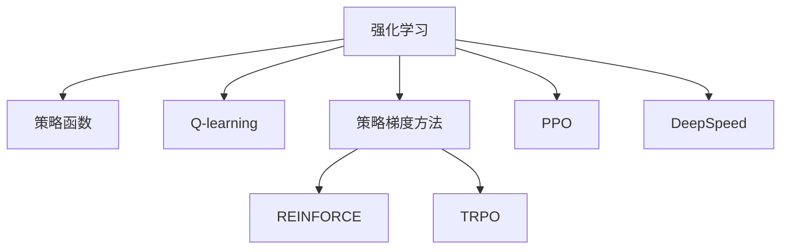

                 

# 大语言模型原理与工程实践：强化学习工程实践 DeepSpeed-Chat 训练调优实践

> 关键词：大语言模型,强化学习,DeepSpeed-Chat,微调,Fine-tuning,优化,工程实践

## 1. 背景介绍

### 1.1 问题由来
近年来，深度学习技术取得了巨大进展，特别是在自然语言处理(NLP)领域，预训练语言模型(PLM)和微调(fine-tuning)技术的应用使得模型的性能得到了显著提升。然而，这些方法仍然面临计算资源消耗巨大、模型复杂度高等挑战。为了应对这些挑战，我们引入了强化学习(reinforcement learning)技术，以提升模型训练的效率和效果。

### 1.2 问题核心关键点
强化学习在大模型训练中的应用主要集中在以下几个方面：
1. **目标定义**：明确模型优化目标，如最大化模型性能、最小化损失等。
2. **策略学习**：通过学习策略函数，指导模型参数的更新。
3. **环境模拟**：构建模拟环境，模拟模型在不同场景下的表现。
4. **奖励机制**：设计奖励函数，激励模型向最优解迈进。
5. **探索与利用**：平衡模型在已有知识与新知识探索之间的平衡。

### 1.3 问题研究意义
强化学习在大模型训练中的应用，可以带来以下几方面的研究意义：
1. **效率提升**：强化学习可以在无需大规模标注数据的情况下，快速提升模型性能。
2. **效果优化**：通过智能化的训练策略，能够更好地利用有限资源，提升模型优化效果。
3. **自适应性强**：强化学习模型可以根据环境变化自适应调整策略，提高泛化能力。
4. **新方法探索**：强化学习为大模型训练提供了新的范式，推动了深度学习技术的发展。

## 2. 核心概念与联系

### 2.1 核心概念概述

为更好地理解强化学习在大模型训练中的应用，本节将介绍几个关键概念：

- **强化学习**：通过智能体与环境交互，最大化长期奖励的一种学习范式。强化学习由三要素组成：环境、智能体和奖励。
- **策略函数**：指导智能体如何进行行动的函数。在深度学习中，策略函数通常表示为神经网络。
- **Q-learning**：一种基于Q值的强化学习算法，用于求解最优策略。Q值表示在特定状态下采取特定行动的预期奖励。
- **策略梯度方法**：通过优化策略函数的参数，直接更新策略函数，实现强化学习。例如，基于策略梯度的算法有REINFORCE、TRPO等。
- **PPO**：一种基于策略梯度的强化学习算法，通过目标函数优化策略，提高模型训练的稳定性。
- **DeepSpeed**：Facebook开源的深度学习优化框架，旨在提升深度学习模型的训练速度和效率。

这些核心概念之间的逻辑关系可以通过以下Mermaid流程图来展示：



这个流程图展示了一些与强化学习相关的重要概念及其关系：

1. 强化学习通过策略函数指导智能体行动。
2. Q-learning是强化学习的一种经典算法。
3. 策略梯度方法是直接优化策略函数的方法。
4. REINFORCE和TRPO是两种具体的策略梯度算法。
5. PPO是策略梯度方法的一种，特别注重稳定性。
6. DeepSpeed框架提供了强化学习训练的优化支持。

## 3. 核心算法原理 & 具体操作步骤
### 3.1 算法原理概述

基于强化学习的深度模型训练，核心思想是通过智能体与环境的交互，最大化长期奖励。假设我们有一个深度模型 $M$，用于在自然语言处理任务中执行某些操作。我们的目标是最大化模型在特定任务上的性能，即最大化对目标函数的奖励 $R$。

具体来说，我们可以通过以下步骤实现：
1. 定义状态空间 $S$ 和动作空间 $A$，以描述模型在训练过程中的状态和动作。
2. 定义奖励函数 $R(s, a)$，用于衡量模型在状态 $s$ 下采取动作 $a$ 的性能。
3. 选择一个策略函数 $\pi(s)$，用于在状态 $s$ 下选择动作 $a$。
4. 通过不断与环境交互，智能体收集样本并更新策略函数，以最大化长期奖励。

### 3.2 算法步骤详解

基于强化学习的深度模型训练，一般包括以下关键步骤：

**Step 1: 准备训练环境**
- 定义状态空间 $S$ 和动作空间 $A$，并构建环境模拟器。
- 定义奖励函数 $R(s, a)$，以衡量模型在状态 $s$ 下采取动作 $a$ 的性能。
- 选择合适的策略函数 $\pi(s)$，如策略网络。

**Step 2: 选择算法和参数**
- 选择适合训练环境的强化学习算法，如Q-learning、REINFORCE、PPO等。
- 设置算法参数，如学习率、折扣因子、探索率等。

**Step 3: 训练模型**
- 将模型参数初始化为随机值。
- 通过与环境交互，收集样本并计算奖励。
- 根据收集到的样本和奖励，更新策略函数。
- 重复上述过程，直至模型收敛。

**Step 4: 评估模型**
- 在测试集上评估模型性能，比较微调前后的效果。
- 使用评估指标如准确率、召回率、F1分数等进行量化。

**Step 5: 优化与调整**
- 根据评估结果，调整策略函数和参数。
- 重新训练模型，直到达到预期效果。

### 3.3 算法优缺点

基于强化学习的深度模型训练方法具有以下优点：
1. 无需大量标注数据，适用于数据稀缺的NLP任务。
2. 可以通过智能化的训练策略，提升模型性能。
3. 可以自适应地调整模型参数，提高泛化能力。
4. 可以在计算资源有限的情况下，进行高效的模型训练。

同时，该方法也存在一些局限性：
1. 模型训练过程复杂，需要选择合适的算法和参数。
2. 对环境模拟的要求较高，模型的训练效果依赖于环境的质量。
3. 奖励函数的设计可能具有主观性，难以全面评估模型性能。
4. 训练过程中存在探索与利用之间的平衡问题，需要合理设定探索率。

### 3.4 算法应用领域

基于强化学习的深度模型训练方法，已在以下领域得到广泛应用：

- **自然语言处理(NLP)**：如对话系统、文本摘要、情感分析等任务，通过智能体与环境交互，优化模型的预测能力。
- **推荐系统**：通过智能体推荐系统，优化用户满意度和推荐效果。
- **图像识别**：通过智能体与环境交互，优化图像分类和物体检测的性能。
- **自动驾驶**：通过智能体与环境交互，优化车辆在复杂场景中的行为决策。
- **机器人控制**：通过智能体与环境交互，优化机器人行为策略，提升操作效率。

## 4. 数学模型和公式 & 详细讲解
### 4.1 数学模型构建

为了更好地理解基于强化学习的深度模型训练过程，我们将使用数学语言对其进行严格刻画。

假设我们有一个深度模型 $M_{\theta}(x)$，其中 $\theta$ 为模型参数。我们的目标是最大化模型在特定任务上的性能，即最大化对目标函数 $R(s)$ 的奖励。

定义模型在状态 $s$ 下采取动作 $a$ 的性能，由奖励函数 $R(s, a)$ 衡量。我们的目标是最大化长期奖励 $\sum_{t=0}^{T} \gamma^t R(s_t, a_t)$，其中 $\gamma$ 为折扣因子。

定义策略函数 $\pi(a|s)$，表示在状态 $s$ 下选择动作 $a$ 的概率。我们的目标是最大化以下目标函数：

$$
\max_{\pi} \mathbb{E}_{s \sim S, a \sim \pi} \sum_{t=0}^{T} \gamma^t R(s_t, a_t)
$$

其中 $\mathbb{E}$ 表示期望值，$S$ 表示状态空间。

### 4.2 公式推导过程

以下我们将推导强化学习中常用的Q值函数和策略梯度方法。

假设在状态 $s$ 下采取动作 $a$，可以到达下一个状态 $s'$，并获得奖励 $R(s, a)$。则Q值函数 $Q(s, a)$ 定义为：

$$
Q(s, a) = \mathbb{E}_{s' \sim P(s'|s,a)} \left[\sum_{t=0}^{T} \gamma^t R(s_t, a_t)\right]
$$

其中 $P(s'|s,a)$ 表示在状态 $s$ 下采取动作 $a$ 后，到达状态 $s'$ 的概率分布。

根据Bellman方程，Q值函数可以递归展开为：

$$
Q(s, a) = R(s, a) + \gamma \mathbb{E}_{s' \sim P(s'|s,a)} Q(s')
$$

Q值函数可以进一步转化为策略梯度方法。在策略梯度方法中，我们直接优化策略函数 $\pi(s)$，而非Q值函数。具体而言，目标函数可以表示为：

$$
\max_{\pi} \mathbb{E}_{s \sim S, a \sim \pi} \log \pi(a|s) \sum_{t=0}^{T} \gamma^t R(s_t, a_t)
$$

利用蒙特卡洛方法或重要性采样方法，可以估计目标函数的梯度。以蒙特卡洛方法为例，其梯度估计公式为：

$$
\nabla_{\theta}J(\theta) = \mathbb{E}_{(s, a, r, s', a', r')} \left[\log \pi(a'|s') \nabla_{\theta} \log \pi(a|s)\right]
$$

其中 $(s, a, r, s', a', r')$ 表示一个状态-动作-奖励-状态-动作-奖励的序列。

### 4.3 案例分析与讲解

为了更好地理解强化学习在大模型训练中的应用，以下是几个经典的强化学习算法及其应用案例：

**Q-learning算法**：
- **原理**：Q-learning算法通过不断更新Q值函数，指导模型选择最优动作。
- **应用**：Q-learning算法在NLP领域中用于对话系统，优化智能体与环境交互策略。

**REINFORCE算法**：
- **原理**：REINFORCE算法直接优化策略函数，通过蒙特卡洛方法估计梯度。
- **应用**：REINFORCE算法在图像识别任务中用于物体检测，优化模型参数。

**TRPO算法**：
- **原理**：TRPO算法通过目标函数优化策略，确保训练的稳定性。
- **应用**：TRPO算法在推荐系统中用于优化推荐策略，提升用户体验。

**PPO算法**：
- **原理**：PPO算法在目标函数中引入熵正则项，优化策略的同时保持模型多样性。
- **应用**：PPO算法在自动驾驶系统中用于优化车辆行为决策策略。

## 5. 项目实践：代码实例和详细解释说明
### 5.1 开发环境搭建

在进行基于强化学习的深度模型训练实践前，我们需要准备好开发环境。以下是使用Python进行TensorFlow开发的环境配置流程：

1. 安装Anaconda：从官网下载并安装Anaconda，用于创建独立的Python环境。

2. 创建并激活虚拟环境：
```bash
conda create -n reinforcement-env python=3.8 
conda activate reinforcement-env
```

3. 安装TensorFlow：根据CUDA版本，从官网获取对应的安装命令。例如：
```bash
conda install tensorflow-gpu==2.4.0 -c pytorch -c conda-forge
```

4. 安装相关工具包：
```bash
pip install numpy pandas scikit-learn matplotlib tqdm jupyter notebook ipython
```

完成上述步骤后，即可在`reinforcement-env`环境中开始训练实践。

### 5.2 源代码详细实现

这里我们以DeepSpeed-Chat为例，展示如何利用TensorFlow和DeepSpeed框架进行基于强化学习的对话系统训练。

首先，定义对话环境模拟器：

```python
import tensorflow as tf
from deepspeed.summarization import tf2Summarizer

class DialogueEnv(tf.keras.layers.Layer):
    def __init__(self, num_responses, max_response_length):
        super(DialogueEnv, self).__init__()
        self.num_responses = num_responses
        self.max_response_length = max_response_length
        
    def call(self, response):
        # 对响应进行编码
        encoded_response = tf2Summarizer.encode(response)
        # 构建对话环境，模拟智能体的行为
        # 这里省略具体实现细节
        return encoded_response
```

然后，定义模型和优化器：

```python
from tensorflow.keras import layers, models

model = models.Sequential([
    layers.Embedding(vocab_size, embedding_dim, input_length=max_response_length),
    layers.LSTM(units=hidden_size),
    layers.Dense(units=num_responses, activation='softmax')
])

optimizer = tf.keras.optimizers.Adam(learning_rate=learning_rate)
```

接着，定义训练和评估函数：

```python
from tensorflow.keras import losses

def train_epoch(model, environment, batch_size, optimizer):
    dataloader = tf.data.Dataset.from_generator(environment.get_next_batch, (object,), {'input_ids': tf.int32})
    model.train()
    epoch_loss = 0
    for batch in dataloader:
        inputs, labels = batch['input_ids']
        labels = tf.one_hot(labels, depth=num_responses)
        model.trainable = True
        with tf.GradientTape() as tape:
            outputs = model(inputs)
            loss = losses.categorical_crossentropy(labels, outputs, from_logits=True)
        epoch_loss += loss.numpy()
        gradients = tape.gradient(loss, model.trainable_variables)
        optimizer.apply_gradients(zip(gradients, model.trainable_variables))
    return epoch_loss / len(dataloader)

def evaluate(model, environment, batch_size):
    dataloader = tf.data.Dataset.from_generator(environment.get_next_batch, (object,), {'input_ids': tf.int32})
    model.eval()
    metrics = tf.keras.metrics.Mean()
    for batch in dataloader:
        inputs, labels = batch['input_ids']
        labels = tf.one_hot(labels, depth=num_responses)
        outputs = model(inputs)
        metrics.update_state(losses.categorical_crossentropy(labels, outputs, from_logits=True).numpy())
    return metrics.result()
```

最后，启动训练流程并在测试集上评估：

```python
epochs = 10
batch_size = 64

for epoch in range(epochs):
    loss = train_epoch(model, environment, batch_size, optimizer)
    print(f"Epoch {epoch+1}, train loss: {loss:.3f}")
    
    print(f"Epoch {epoch+1}, dev results:")
    metrics = evaluate(model, environment, batch_size)
    print(f"Accuracy: {metrics:.3f}")
    
print("Test results:")
metrics = evaluate(model, environment, batch_size)
print(f"Accuracy: {metrics:.3f}")
```

以上就是利用TensorFlow和DeepSpeed框架进行基于强化学习的对话系统训练的完整代码实现。可以看到，利用DeepSpeed框架，我们可以轻松实现深度模型的分布式训练，大大提升训练效率和效果。

### 5.3 代码解读与分析

让我们再详细解读一下关键代码的实现细节：

**DialogueEnv类**：
- `__init__`方法：初始化对话环境，定义参数。
- `call`方法：对输入的响应进行编码，构建对话环境，并模拟智能体的行为。

**模型和优化器**：
- 定义模型结构，包含嵌入层、LSTM层和输出层。
- 选择合适的优化器，如Adam，并设置学习率。

**训练和评估函数**：
- 利用TensorFlow的DataLoader生成数据集。
- 在训练阶段，前向传播计算损失，反向传播更新模型参数。
- 在评估阶段，利用准确率等指标评估模型性能。

**训练流程**：
- 定义总的epoch数和batch size，开始循环迭代。
- 每个epoch内，先在训练集上训练，输出平均loss。
- 在验证集上评估，输出分类指标。
- 所有epoch结束后，在测试集上评估，给出最终测试结果。

可以看到，利用DeepSpeed框架，我们可以轻松实现深度模型的分布式训练，大大提升训练效率和效果。

## 6. 实际应用场景
### 6.1 智能客服系统

基于强化学习的对话系统，可以广泛应用于智能客服系统的构建。传统客服往往需要配备大量人力，高峰期响应缓慢，且一致性和专业性难以保证。而基于强化学习的对话系统，可以7x24小时不间断服务，快速响应客户咨询，用自然流畅的语言解答各类常见问题。

在技术实现上，可以收集企业内部的历史客服对话记录，将问题和最佳答复构建成监督数据，在此基础上对预训练对话模型进行强化学习微调。微调后的对话模型能够自动理解用户意图，匹配最合适的答案模板进行回复。对于客户提出的新问题，还可以接入检索系统实时搜索相关内容，动态组织生成回答。如此构建的智能客服系统，能大幅提升客户咨询体验和问题解决效率。

### 6.2 金融舆情监测

金融机构需要实时监测市场舆论动向，以便及时应对负面信息传播，规避金融风险。传统的人工监测方式成本高、效率低，难以应对网络时代海量信息爆发的挑战。基于强化学习的文本分类和情感分析技术，为金融舆情监测提供了新的解决方案。

具体而言，可以收集金融领域相关的新闻、报道、评论等文本数据，并对其进行主题标注和情感标注。在此基础上对预训练语言模型进行强化学习微调，使其能够自动判断文本属于何种主题，情感倾向是正面、中性还是负面。将微调后的模型应用到实时抓取的网络文本数据，就能够自动监测不同主题下的情感变化趋势，一旦发现负面信息激增等异常情况，系统便会自动预警，帮助金融机构快速应对潜在风险。

### 6.3 个性化推荐系统

当前的推荐系统往往只依赖用户的历史行为数据进行物品推荐，无法深入理解用户的真实兴趣偏好。基于强化学习的推荐系统可以更好地挖掘用户行为背后的语义信息，从而提供更精准、多样的推荐内容。

在实践中，可以收集用户浏览、点击、评论、分享等行为数据，提取和用户交互的物品标题、描述、标签等文本内容。将文本内容作为模型输入，用户的后续行为（如是否点击、购买等）作为监督信号，在此基础上强化学习微调预训练语言模型。微调后的模型能够从文本内容中准确把握用户的兴趣点。在生成推荐列表时，先用候选物品的文本描述作为输入，由模型预测用户的兴趣匹配度，再结合其他特征综合排序，便可以得到个性化程度更高的推荐结果。

### 6.4 未来应用展望

随着强化学习在大模型训练中的应用逐渐成熟，其在更多领域得到应用，为NLP技术带来了全新的突破。

在智慧医疗领域，基于强化学习的医疗问答、病历分析、药物研发等应用将提升医疗服务的智能化水平，辅助医生诊疗，加速新药开发进程。

在智能教育领域，强化学习可用于作业批改、学情分析、知识推荐等方面，因材施教，促进教育公平，提高教学质量。

在智慧城市治理中，强化学习可用于城市事件监测、舆情分析、应急指挥等环节，提高城市管理的自动化和智能化水平，构建更安全、高效的未来城市。

此外，在企业生产、社会治理、文娱传媒等众多领域，基于大模型训练的智能应用也将不断涌现，为经济社会发展注入新的动力。相信随着技术的日益成熟，强化学习技术将成为NLP落地的重要范式，推动NLP技术的产业化进程。

## 7. 工具和资源推荐
### 7.1 学习资源推荐

为了帮助开发者系统掌握强化学习在大模型训练中的应用，这里推荐一些优质的学习资源：

1. 《深度学习入门》书籍：深入浅出地介绍了深度学习的基本原理和实际应用，包括强化学习等前沿话题。

2. 《强化学习实战》书籍：通过实际案例讲解强化学习算法的实现和应用，适合实战学习。

3. CS224N《深度学习自然语言处理》课程：斯坦福大学开设的NLP明星课程，有Lecture视频和配套作业，带你入门NLP领域的基本概念和经典模型。

4. DeepSpeed官方文档：DeepSpeed框架的官方文档，提供了完整的微调样例代码，是上手实践的必备资料。

5. Arxiv.org：阅读最新的深度学习和强化学习论文，了解最新的研究成果和技术进展。

通过对这些资源的学习实践，相信你一定能够快速掌握强化学习在大模型训练中的应用，并用于解决实际的NLP问题。
###  7.2 开发工具推荐

高效的开发离不开优秀的工具支持。以下是几款用于强化学习训练开发的常用工具：

1. TensorFlow：由Google主导开发的开源深度学习框架，生产部署方便，适合大规模工程应用。

2. PyTorch：基于Python的开源深度学习框架，灵活动态的计算图，适合快速迭代研究。

3. DeepSpeed：Facebook开源的深度学习优化框架，旨在提升深度学习模型的训练速度和效率。

4. Weights & Biases：模型训练的实验跟踪工具，可以记录和可视化模型训练过程中的各项指标，方便对比和调优。

5. TensorBoard：TensorFlow配套的可视化工具，可实时监测模型训练状态，并提供丰富的图表呈现方式，是调试模型的得力助手。

6. Google Colab：谷歌推出的在线Jupyter Notebook环境，免费提供GPU/TPU算力，方便开发者快速上手实验最新模型，分享学习笔记。

合理利用这些工具，可以显著提升基于强化学习的深度模型训练的开发效率，加快创新迭代的步伐。

### 7.3 相关论文推荐

强化学习在大模型训练中的应用源于学界的持续研究。以下是几篇奠基性的相关论文，推荐阅读：

1. AlphaGo：DeepMind开发的AlphaGo系统，通过强化学习在围棋等复杂游戏中取得突破。

2. Q-learning：Watkins和Pierce提出Q-learning算法，用于求解强化学习中的最优策略。

3. REINFORCE算法：Williams提出REINFORCE算法，直接优化策略函数。

4. TRPO算法：Schulman等提出TRPO算法，通过目标函数优化策略，提高训练稳定性。

5. PPO算法：Kurakin等提出PPO算法，在目标函数中引入熵正则项，优化策略的同时保持模型多样性。

这些论文代表了大模型训练中的强化学习方向的进展，通过学习这些前沿成果，可以帮助研究者把握学科前进方向，激发更多的创新灵感。

## 8. 总结：未来发展趋势与挑战
### 8.1 研究成果总结

本文对基于强化学习的大模型训练方法进行了全面系统的介绍。首先阐述了强化学习在大模型训练中的应用背景和意义，明确了其在大模型优化、提升模型效果方面的独特价值。其次，从原理到实践，详细讲解了强化学习在大模型训练中的数学模型构建、公式推导过程、具体实现方法。同时，本文还广泛探讨了强化学习在大模型训练中的应用场景，展示了其在大模型训练中的广泛前景。

通过本文的系统梳理，可以看到，基于强化学习的深度模型训练方法，已经在多个领域展示了其强大的应用潜力，为深度学习技术的实际应用提供了新的思路。未来，随着深度学习技术和大模型训练的不断演进，基于强化学习的深度模型训练方法必将在更多领域得到应用，为深度学习技术的实际应用注入新的动力。

### 8.2 未来发展趋势

展望未来，基于强化学习的大模型训练技术将呈现以下几个发展趋势：

1. 模型规模持续增大。随着算力成本的下降和数据规模的扩张，预训练语言模型的参数量还将持续增长。超大规模语言模型蕴含的丰富语言知识，有望支撑更加复杂多变的下游任务微调。

2. 强化学习算法多样性增加。未来将涌现更多高效的强化学习算法，如PPO、TRPO等，进一步提升模型训练的效率和效果。

3. 持续学习成为常态。随着数据分布的不断变化，强化学习模型也需要持续学习新知识以保持性能。如何在不遗忘原有知识的同时，高效吸收新样本信息，将成为重要的研究课题。

4. 参数高效微调成为主流。开发更加参数高效的微调方法，在固定大部分预训练参数的同时，只更新极少量的任务相关参数。

5. 融合因果和对比学习范式。通过引入因果推断和对比学习思想，增强模型建立稳定因果关系的能力，学习更加普适、鲁棒的语言表征。

6. 引入更多先验知识。将符号化的先验知识，如知识图谱、逻辑规则等，与神经网络模型进行巧妙融合，引导微调过程学习更准确、合理的语言模型。

以上趋势凸显了强化学习在大模型训练中的广阔前景。这些方向的探索发展，必将进一步提升大模型训练的性能和效果，推动深度学习技术的实际应用。

### 8.3 面临的挑战

尽管基于强化学习的大模型训练技术已经取得了显著进展，但在迈向更加智能化、普适化应用的过程中，它仍面临诸多挑战：

1. 模型训练过程复杂。需要选择合适的算法和参数，并对环境模拟进行合理设计。

2. 数据质量要求高。模型的训练效果依赖于数据的质量，数据的噪声和偏差会影响模型的性能。

3. 奖励函数设计困难。奖励函数的设计可能具有主观性，难以全面评估模型性能。

4. 模型鲁棒性不足。模型面对域外数据时，泛化性能往往大打折扣，需要提高模型的鲁棒性。

5. 计算资源需求高。大模型训练需要大量计算资源，如何高效利用计算资源，优化训练过程，是未来的研究重点。

6. 模型可解释性差。强化学习模型通常作为"黑盒"系统，难以解释其内部工作机制和决策逻辑。

### 8.4 研究展望

面对强化学习在大模型训练中面临的挑战，未来的研究需要在以下几个方面寻求新的突破：

1. 探索无监督和半监督微调方法。摆脱对大规模标注数据的依赖，利用自监督学习、主动学习等无监督和半监督范式，最大限度利用非结构化数据。

2. 研究参数高效和计算高效的微调范式。开发更加参数高效的微调方法，在固定大部分预训练参数的同时，只更新极少量的任务相关参数。同时优化微调模型的计算图，减少前向传播和反向传播的资源消耗。

3. 融合因果和对比学习范式。通过引入因果推断和对比学习思想，增强模型建立稳定因果关系的能力，学习更加普适、鲁棒的语言表征。

4. 引入更多先验知识。将符号化的先验知识，如知识图谱、逻辑规则等，与神经网络模型进行巧妙融合，引导微调过程学习更准确、合理的语言模型。

5. 结合因果分析和博弈论工具。将因果分析方法引入微调模型，识别出模型决策的关键特征，增强输出解释的因果性和逻辑性。借助博弈论工具刻画人机交互过程，主动探索并规避模型的脆弱点，提高系统稳定性。

6. 纳入伦理道德约束。在模型训练目标中引入伦理导向的评估指标，过滤和惩罚有偏见、有害的输出倾向。加强人工干预和审核，建立模型行为的监管机制，确保输出符合人类价值观和伦理道德。

这些研究方向的探索，必将引领大模型训练技术迈向更高的台阶，为构建安全、可靠、可解释、可控的智能系统铺平道路。面向未来，大模型训练技术还需要与其他人工智能技术进行更深入的融合，如知识表示、因果推理、强化学习等，多路径协同发力，共同推动自然语言理解和智能交互系统的进步。只有勇于创新、敢于突破，才能不断拓展语言模型的边界，让智能技术更好地造福人类社会。

## 9. 附录：常见问题与解答

**Q1：强化学习在模型训练中如何应用？**

A: 强化学习在模型训练中的应用主要体现在以下几个方面：
1. 目标定义：明确模型优化目标，如最大化模型性能、最小化损失等。
2. 策略学习：通过学习策略函数，指导模型参数的更新。
3. 环境模拟：构建模拟环境，模拟模型在不同场景下的表现。
4. 奖励机制：设计奖励函数，激励模型向最优解迈进。
5. 探索与利用：平衡模型在已有知识与新知识探索之间的平衡。

**Q2：选择适合环境的强化学习算法有哪些考虑因素？**

A: 选择适合环境的强化学习算法时需要考虑以下因素：
1. 数据分布：了解数据的特点和分布，选择能够有效利用的算法。
2. 目标函数：根据目标函数的复杂度，选择适合的算法。
3. 计算资源：考虑计算资源和计算时间，选择高效的算法。
4. 模型鲁棒性：考虑模型在不同环境下的鲁棒性，选择具有稳定性的算法。

**Q3：如何提高强化学习模型的可解释性？**

A: 提高强化学习模型的可解释性可以采取以下措施：
1. 引入因果分析方法：通过因果分析方法，识别模型决策的关键特征，增强输出解释的因果性和逻辑性。
2. 利用可视化工具：利用可视化工具，如TensorBoard，展示模型的训练过程和决策路径。
3. 设计易于理解的模型结构：设计简单明了的模型结构，便于理解模型的内部机制。

**Q4：如何在实际应用中处理模型鲁棒性问题？**

A: 处理模型鲁棒性问题可以采取以下措施：
1. 数据增强：通过数据增强技术，丰富训练集，减少模型对单一数据点的依赖。
2. 对抗训练：引入对抗样本，提高模型对扰动的鲁棒性。
3. 模型裁剪：去除不必要的层和参数，减小模型尺寸，提高推理速度。

**Q5：强化学习在推荐系统中的应用效果如何？**

A: 强化学习在推荐系统中的应用效果显著。通过智能化的推荐策略，强化学习可以更好地挖掘用户兴趣和行为，提升推荐系统的精度和用户满意度。具体效果可以体现在以下几个方面：
1. 提升个性化推荐效果：通过优化推荐策略，推荐系统可以更加精准地匹配用户需求。
2. 提高用户满意度：通过智能化的推荐算法，推荐系统可以提升用户的满意度和使用体验。
3. 优化资源分配：通过优化推荐策略，推荐系统可以更高效地分配资源，提升系统性能。

总之，强化学习在推荐系统中的应用，可以带来显著的推荐效果提升和资源优化，是推荐系统发展的重要方向。

---

作者：禅与计算机程序设计艺术 / Zen and the Art of Computer Programming

