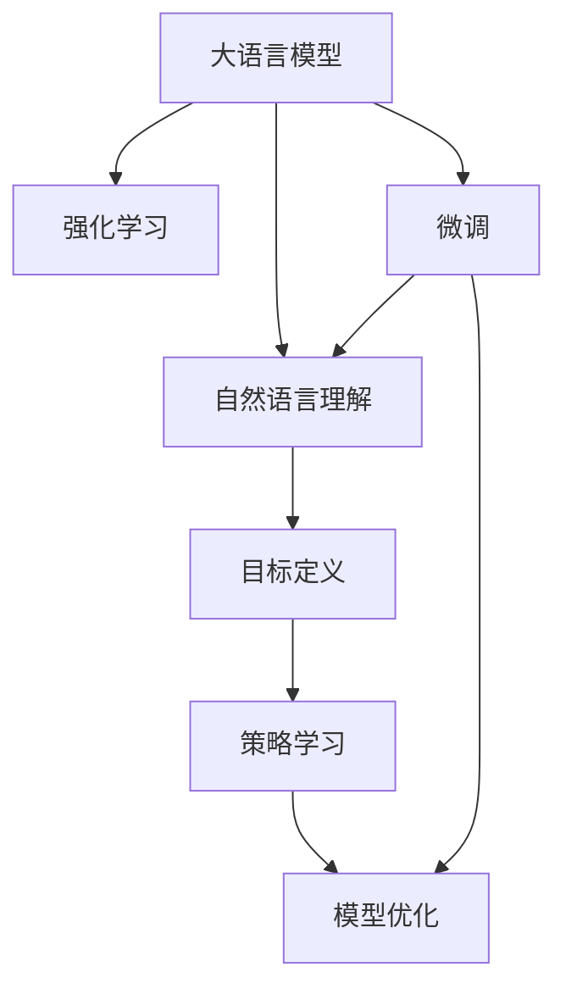

                 

## 1. 背景介绍

### 1.1 问题由来
强化学习(RL)在过去十年里取得了飞速的进展，并已成功应用于多个领域的复杂问题中。从棋类游戏到机器人控制，再到金融投资和推荐系统，RL展示了其强大的问题解决能力。但是，尽管RL在许多问题上取得了突破，但其在大规模语言模型(LLMs)中的应用仍然相对有限。

### 1.2 问题核心关键点
这背后的核心问题是：RL如何在复杂的语言环境中导航并执行任务？这个问题不仅需要语言理解能力，还需要对环境的动态变化做出灵活反应。传统的语言模型通常是在大规模无标签文本上进行预训练，然后通过微调或继续学习来适配特定任务。但这种基于监督学习的方法在适应动态环境方面显得力不从心。

强化学习提供了一种更为灵活的方法，它不需要标注数据，通过与环境的交互来学习和优化模型。这使得RL在大规模语言模型中的应用成为一个重要的研究方向。本文将探讨基于强化学习的大语言模型在自然语言理解任务中的应用，包括目标定义、策略学习、模型优化等方面。

## 2. 核心概念与联系

### 2.1 核心概念概述

为了更好地理解基于强化学习的大语言模型，我们先介绍几个核心概念：

- **大语言模型(Large Language Model, LLM)**：以自回归(如GPT)或自编码(如BERT)模型为代表的大规模预训练语言模型。通过在大规模无标签文本语料上进行预训练，学习到语言的通用表示，具备强大的语言理解和生成能力。

- **强化学习(RL)**：一种机器学习方法，通过智能体与环境的交互，不断学习最优的策略来最大化奖励。强化学习的核心在于智能体在每个时间步上的决策和环境的响应，以及如何从奖励中学习。

- **自然语言理解(Natural Language Understanding, NLU)**：使计算机能够理解、分析和生成人类语言的技术。NLU是大语言模型应用的核心领域之一，涉及任务如文本分类、情感分析、问答系统等。

- **目标定义**：在强化学习中，目标函数（或奖励函数）用于衡量智能体的决策效果，通常是最大化某个指标（如准确率、召回率等）。

- **策略学习**：通过与环境的交互，智能体学习到一套最优的决策策略，即如何在每个时间步选择行动。

- **模型优化**：在模型参数空间内搜索最优解，使得模型能够在特定任务上表现最佳。

这些概念之间的逻辑关系可以通过以下Mermaid流程图来展示：



这个流程图展示了基于强化学习的大语言模型在自然语言理解任务中的应用：

1. 大语言模型通过预训练获得基础能力。
2. 在目标定义的指导下，智能体通过策略学习在环境中导航，执行任务。
3. 模型优化用于提升智能体决策的质量，使其在特定任务上表现最佳。
4. 微调为大语言模型提供进一步的优化和适配。

## 3. 核心算法原理 & 具体操作步骤
### 3.1 算法原理概述

基于强化学习的大语言模型微调，本质上是一个智能体与环境交互的学习过程。其核心思想是：将大语言模型视为智能体，通过与环境的交互，学习到一套最优的决策策略，以适应特定任务。

在强化学习中，假设大语言模型作为智能体，任务为自然语言理解（如文本分类、情感分析等），环境为自然语言文本数据集。智能体的目标是最大化文本数据集上的特定指标（如准确率、召回率等）。智能体通过与环境的交互（即阅读和理解文本数据），不断调整自己的决策策略，最终学习到最优的模型参数。

### 3.2 算法步骤详解

基于强化学习的大语言模型微调一般包括以下几个关键步骤：

**Step 1: 目标定义**
- 定义任务的目标函数，如准确率、召回率、F1分数等，作为智能体行为的评价标准。

**Step 2: 策略设计**
- 设计智能体的决策策略，即如何在每个时间步选择行动。在自然语言理解任务中，策略可以简单地表示为在输入文本上执行分类、情感分析等任务。

**Step 3: 模型训练**
- 初始化模型参数，开始训练过程。
- 在每个时间步，智能体读取环境（输入文本），执行策略（任务），观察环境响应（预测结果）。
- 根据奖励函数计算智能体的奖励，更新模型参数。

**Step 4: 策略优化**
- 使用强化学习算法（如Q-learning、Policy Gradient等）优化智能体的策略。
- 重复训练过程，直到智能体达到满意的目标。

**Step 5: 模型评估**
- 在验证集上评估智能体的性能，记录性能指标。
- 重复Step 3-4，直到目标性能达标。

### 3.3 算法优缺点

基于强化学习的大语言模型微调方法具有以下优点：
1. 无需标注数据。强化学习不需要大量的标注数据，适用于数据稀缺的应用场景。
2. 自适应强。强化学习智能体可以在与环境的交互中不断优化，适用于复杂动态环境。
3. 通用性强。智能体策略可以适应不同的自然语言理解任务，具有良好的泛化能力。
4. 提升模型效果。强化学习可以发现最优的决策策略，提升模型在特定任务上的性能。

同时，该方法也存在一些局限性：
1. 训练时间长。强化学习需要大量的训练时间，特别是在大规模语言模型上。
2. 收敛性差。强化学习智能体的策略可能会陷入局部最优，难以收敛到全局最优。
3. 策略设计复杂。设计合适的策略对强化学习的效果有很大影响，需要丰富的经验和知识。
4. 模型复杂度较高。强化学习的模型通常较为复杂，维护和调试难度较大。

尽管存在这些局限性，但强化学习为大语言模型提供了新的解决方案，尤其在需要自适应和复杂任务解决能力的应用中，具有重要的应用前景。

### 3.4 算法应用领域

基于强化学习的大语言模型微调技术，在自然语言理解任务中具有广泛的应用，包括但不限于以下几个领域：

- **文本分类**：如新闻文章分类、情感分析、主题分类等。通过智能体学习最优分类策略，对输入文本进行分类。
- **命名实体识别**：从文本中识别出人名、地名、组织名等实体。智能体通过学习实体识别策略，对输入文本进行实体标注。
- **关系抽取**：从文本中抽取实体之间的语义关系。智能体通过学习关系抽取策略，对输入文本进行关系标注。
- **问答系统**：对自然语言问题给出答案。智能体通过学习问答策略，对输入问题进行回答。
- **文本摘要**：将长文本压缩成简短摘要。智能体通过学习摘要策略，对输入文本进行摘要生成。

除了这些经典任务外，强化学习还可以应用于更多场景中，如对话系统、代码生成、数据增强等，为自然语言处理技术带来新的突破。随着预训练模型和强化学习方法的不断进步，相信强化学习范式将成为自然语言处理领域的重要工具，推动技术向更深层次的应用发展。

## 4. 数学模型和公式 & 详细讲解  
### 4.1 数学模型构建

在强化学习中，智能体的行为可以用以下框架来描述：

假设智能体的策略为 $\pi$，模型的状态为 $s_t$，动作为 $a_t$，奖励为 $r_t$，下一状态为 $s_{t+1}$。智能体在时间步 $t$ 的策略为 $\pi(a_t|s_t)$，即在状态 $s_t$ 下选择动作 $a_t$ 的概率。模型的奖励函数为 $R$，定义为 $R(s_{t+1},a_t,s_t)$，表示在状态 $s_t$ 下执行动作 $a_t$ 并转移到状态 $s_{t+1}$ 时的奖励。

目标函数 $J(\pi)$ 定义为智能体在所有时间步内获得的总奖励期望，即：

$$
J(\pi) = \mathbb{E}\left[\sum_{t=1}^T R(s_{t+1},a_t,s_t)\right]
$$

其中 $T$ 为终止时间步。

### 4.2 公式推导过程

在强化学习中，常用的算法包括Q-learning和Policy Gradient等。这里以Q-learning为例，推导其核心公式。

Q-learning的核心思想是通过与环境的交互，不断更新模型参数，使得模型的预测值与实际奖励值尽可能接近。Q-learning的更新公式为：

$$
Q_{\theta}(s_t,a_t) \leftarrow Q_{\theta}(s_t,a_t) + \alpha [R(s_{t+1},a_t,s_t) + \gamma \max_{a'} Q_{\theta}(s_{t+1},a') - Q_{\theta}(s_t,a_t)]
$$

其中 $\theta$ 为模型参数，$\alpha$ 为学习率，$\gamma$ 为折扣因子，表示未来奖励的折扣。

在实践中，我们通常使用神经网络来逼近Q值函数 $Q(s_t,a_t)$，即：

$$
Q(s_t,a_t) = \mathbb{E}[Q_{\theta}(s_t,a_t)]
$$

其中 $\theta$ 为神经网络的参数。在每个时间步 $t$，智能体根据当前状态 $s_t$ 和策略 $\pi$ 选择动作 $a_t$，观察奖励 $r_t$ 和下一状态 $s_{t+1}$。然后，使用Q-learning更新模型的参数，以使模型的Q值逼近真实的奖励值。

### 4.3 案例分析与讲解

这里以一个简单的情感分类任务为例，展示如何使用强化学习微调大语言模型。

假设我们有一个包含正面和负面情感的文本数据集，目标是训练一个模型，能够对新文本进行情感分类。我们可以将情感分类任务视为一个强化学习问题，智能体在每个时间步读取一个文本样本，执行情感分类，观察分类结果，并根据分类结果获得奖励。

在训练过程中，智能体不断调整自己的决策策略，优化模型的参数，以提升分类准确率。具体来说，智能体在每个时间步读取一个文本样本 $s_t$，执行情感分类任务，输出情感分类结果 $a_t$，观察分类结果是否与真实情感 $r_t$ 一致。根据分类结果的准确率，智能体获得奖励 $R(s_{t+1},a_t,s_t)$。智能体使用Q-learning算法更新模型的参数，以逼近最优的情感分类策略。

## 5. 项目实践：代码实例和详细解释说明
### 5.1 开发环境搭建

在进行强化学习微调实践前，我们需要准备好开发环境。以下是使用Python进行强化学习微调的环境配置流程：

1. 安装Anaconda：从官网下载并安装Anaconda，用于创建独立的Python环境。

2. 创建并激活虚拟环境：
```bash
conda create -n reinforcement-env python=3.8 
conda activate reinforcement-env
```

3. 安装必要的库：
```bash
pip install gym gym[atari] stable-baselines3 stable-baselines3-contrib
```

4. 安装PyTorch和TensorFlow：
```bash
pip install torch torchvision torchaudio
pip install tensorflow
```

5. 安装相关的预训练语言模型：
```bash
pip install transformers
```

完成上述步骤后，即可在`reinforcement-env`环境中开始强化学习微调实践。

### 5.2 源代码详细实现

下面以一个简单的情感分类任务为例，给出使用Gym环境进行强化学习微调的PyTorch代码实现。

```python
import gym
import torch
import torch.nn as nn
import torch.optim as optim
from torch.distributions import Categorical

class QNetwork(nn.Module):
    def __init__(self, input_size, output_size):
        super(QNetwork, self).__init__()
        self.fc1 = nn.Linear(input_size, 64)
        self.fc2 = nn.Linear(64, output_size)

    def forward(self, x):
        x = self.fc1(x)
        x = torch.relu(x)
        x = self.fc2(x)
        return x

class ReinforcementAgent:
    def __init__(self, input_size, output_size, gamma):
        self.input_size = input_size
        self.output_size = output_size
        self.gamma = gamma
        self.q = QNetwork(input_size, output_size)
        self.optimizer = optim.Adam(self.q.parameters(), lr=0.001)

    def act(self, state):
        state = torch.from_numpy(state).float()
        with torch.no_grad():
            q_value = self.q(state)
        m = Categorical(q_value)
        action = m.sample()
        return action.item(), q_value

    def update(self, state, action, reward, next_state):
        next_q_value = self.q(torch.tensor(next_state)).detach()
        max_q_value = next_q_value.max().item()
        target_q_value = reward + self.gamma * max_q_value
        q_value = self.q(torch.tensor(state))
        target_q_value = torch.tensor(target_q_value, device=q_value.device)
        loss = nn.SmoothL1Loss()(q_value, target_q_value)
        self.optimizer.zero_grad()
        loss.backward()
        self.optimizer.step()

    def train(self, env, total_episodes, batch_size):
        state = env.reset()
        total_reward = 0
        for episode in range(total_episodes):
            state = torch.from_numpy(state).float()
            action, q_value = self.act(state)
            total_reward += reward
            next_state, reward, done, info = env.step(action)
            self.update(state, action, reward, next_state)
            state = next_state
            if done:
                print(f"Episode {episode+1}, total reward: {total_reward}")
                state = env.reset()
                total_reward = 0
```

在上述代码中，我们定义了一个简单的Q-learning智能体，用于情感分类任务。智能体使用Q-learning算法不断调整模型的参数，以适应环境的变化。

### 5.3 代码解读与分析

让我们再详细解读一下关键代码的实现细节：

**QNetwork类**：
- `__init__`方法：初始化神经网络结构，包括两个全连接层。
- `forward`方法：前向传播，计算模型的预测值。

**ReinforcementAgent类**：
- `__init__`方法：初始化智能体的参数，包括输入大小、输出大小、折扣因子等。
- `act`方法：根据当前状态选择动作，并返回动作和Q值。
- `update`方法：根据状态、动作、奖励和下一状态更新模型的参数。
- `train`方法：在Gym环境中进行训练，并记录训练过程中的奖励。

**Gym环境**：
- `reset`方法：重置环境，并返回初始状态。
- `step`方法：根据智能体的动作，执行环境操作，并返回奖励和下一状态。

在训练过程中，智能体在每个时间步读取环境的状态，根据当前策略选择动作，观察奖励，并根据Q-learning算法更新模型参数。训练过程中，智能体不断调整自己的决策策略，优化模型的参数，以提升情感分类的准确率。

## 6. 实际应用场景
### 6.1 智能客服系统

基于强化学习的大语言模型，可以广泛应用于智能客服系统的构建。传统客服往往需要配备大量人力，高峰期响应缓慢，且一致性和专业性难以保证。而使用强化学习微调的大语言模型，可以7x24小时不间断服务，快速响应客户咨询，用自然流畅的语言解答各类常见问题。

在技术实现上，可以收集企业内部的历史客服对话记录，将问题和最佳答复构建成监督数据，在此基础上对预训练大语言模型进行强化学习微调。微调后的语言模型能够自动理解用户意图，匹配最合适的答案模板进行回复。对于客户提出的新问题，还可以接入检索系统实时搜索相关内容，动态组织生成回答。如此构建的智能客服系统，能大幅提升客户咨询体验和问题解决效率。

### 6.2 金融舆情监测

金融机构需要实时监测市场舆论动向，以便及时应对负面信息传播，规避金融风险。传统的人工监测方式成本高、效率低，难以应对网络时代海量信息爆发的挑战。基于强化学习的大语言模型微调技术，为金融舆情监测提供了新的解决方案。

具体而言，可以收集金融领域相关的新闻、报道、评论等文本数据，并对其进行主题标注和情感标注。在此基础上对预训练语言模型进行强化学习微调，使其能够自动判断文本属于何种主题，情感倾向是正面、中性还是负面。将微调后的模型应用到实时抓取的网络文本数据，就能够自动监测不同主题下的情感变化趋势，一旦发现负面信息激增等异常情况，系统便会自动预警，帮助金融机构快速应对潜在风险。

### 6.3 个性化推荐系统

当前的推荐系统往往只依赖用户的历史行为数据进行物品推荐，无法深入理解用户的真实兴趣偏好。基于强化学习的大语言模型微调技术，可以更好地挖掘用户行为背后的语义信息，从而提供更精准、多样的推荐内容。

在实践中，可以收集用户浏览、点击、评论、分享等行为数据，提取和用户交互的物品标题、描述、标签等文本内容。将文本内容作为模型输入，用户的后续行为（如是否点击、购买等）作为监督信号，在此基础上强化学习微调预训练语言模型。微调后的模型能够从文本内容中准确把握用户的兴趣点。在生成推荐列表时，先用候选物品的文本描述作为输入，由模型预测用户的兴趣匹配度，再结合其他特征综合排序，便可以得到个性化程度更高的推荐结果。

### 6.4 未来应用展望

随着强化学习在大语言模型中的应用不断发展，基于强化学习的大语言模型微调技术将在更多领域得到应用，为传统行业带来变革性影响。

在智慧医疗领域，基于强化学习的大语言模型微调技术可以应用于医疗问答、病历分析、药物研发等应用，提升医疗服务的智能化水平，辅助医生诊疗，加速新药开发进程。

在智能教育领域，强化学习微调技术可应用于作业批改、学情分析、知识推荐等方面，因材施教，促进教育公平，提高教学质量。

在智慧城市治理中，强化学习微调模型可应用于城市事件监测、舆情分析、应急指挥等环节，提高城市管理的自动化和智能化水平，构建更安全、高效的未来城市。

此外，在企业生产、社会治理、文娱传媒等众多领域，基于强化学习的大语言模型微调技术也将不断涌现，为NLP技术带来新的突破。相信随着预训练模型和强化学习方法的不断进步，强化学习范式将成为自然语言处理领域的重要工具，推动技术向更深层次的应用发展。

## 7. 工具和资源推荐
### 7.1 学习资源推荐

为了帮助开发者系统掌握强化学习在大语言模型中的应用，这里推荐一些优质的学习资源：

1. 《Reinforcement Learning: An Introduction》：书籍，由Richard S. Sutton和Andrew G. Barto合著，系统介绍了强化学习的基本原理和算法。
2. CS294 - Reinforcement Learning by Pieter Abbeel：斯坦福大学开设的强化学习课程，涵盖了强化学习的基本理论和算法。
3. DeepMind的官方博客：DeepMind作为强化学习的先驱，其博客中介绍了许多前沿的强化学习算法和技术。
4. OpenAI的官方文档：OpenAI作为深度学习领域的领导者，其博客和文档涵盖了强化学习在大规模语言模型中的应用。
5. PyTorch Lightning：基于PyTorch的强化学习库，提供了丰富的组件和示例，帮助开发者快速上手。

通过对这些资源的学习实践，相信你一定能够快速掌握强化学习在大语言模型中的应用，并用于解决实际的NLP问题。
###  7.2 开发工具推荐

高效的开发离不开优秀的工具支持。以下是几款用于强化学习微调开发的常用工具：

1. PyTorch：基于Python的开源深度学习框架，灵活动态的计算图，适合快速迭代研究。大部分预训练语言模型都有PyTorch版本的实现。
2. TensorFlow：由Google主导开发的开源深度学习框架，生产部署方便，适合大规模工程应用。同样有丰富的预训练语言模型资源。
3. OpenAI的CLIP模型：基于CLIP（Contrastive Language Image Pre-training）架构，支持零样本和少样本学习，非常适合用于计算机视觉和自然语言理解任务。
4. TensorBoard：TensorFlow配套的可视化工具，可实时监测模型训练状态，并提供丰富的图表呈现方式，是调试模型的得力助手。
5. PyTorch Lightning：基于PyTorch的强化学习库，提供了丰富的组件和示例，帮助开发者快速上手。

合理利用这些工具，可以显著提升强化学习微调任务的开发效率，加快创新迭代的步伐。

### 7.3 相关论文推荐

强化学习在大语言模型中的应用研究近年来取得了显著进展，以下是几篇奠基性的相关论文，推荐阅读：

1. Reinforcement Learning for Natural Language Understanding：介绍使用强化学习进行自然语言理解任务的优化方法。
2. Language Modeling with Reinforcement Learning：提出使用强化学习进行语言模型训练的方法，并展示其效果。
3. Deep Q-Learning for Language Modeling：提出使用Q-learning进行语言模型训练的方法，并展示其效果。
4. Multi-Agent Policy Optimization for Text Generation：提出使用多智能体强化学习进行文本生成的优化方法。
5. Curriculum for Teaching Pre-trained Neural Networks to Read and Answer Questions：介绍使用强化学习进行问答系统的优化方法。

这些论文代表了大语言模型和强化学习的发展脉络。通过学习这些前沿成果，可以帮助研究者把握学科前进方向，激发更多的创新灵感。

## 8. 总结：未来发展趋势与挑战

### 8.1 总结

本文对基于强化学习的大语言模型微调方法进行了全面系统的介绍。首先阐述了强化学习在自然语言理解任务中的应用背景，明确了强化学习在适应动态环境、提升模型效果方面的独特价值。其次，从原理到实践，详细讲解了强化学习的核心算法和具体操作步骤，给出了强化学习微调任务开发的完整代码实例。同时，本文还广泛探讨了强化学习在智能客服、金融舆情、个性化推荐等多个行业领域的应用前景，展示了强化学习范式的巨大潜力。此外，本文精选了强化学习的各类学习资源，力求为读者提供全方位的技术指引。

通过本文的系统梳理，可以看到，基于强化学习的大语言模型微调方法正在成为自然语言处理领域的重要范式，极大地拓展了预训练语言模型的应用边界，催生了更多的落地场景。受益于大规模语料的预训练，强化学习可以发现最优的决策策略，提升模型在特定任务上的性能。未来，伴随预训练语言模型和强化学习方法的不断进步，强化学习范式将成为自然语言处理领域的重要工具，推动技术向更深层次的应用发展。

### 8.2 未来发展趋势

展望未来，强化学习在大语言模型中的应用将呈现以下几个发展趋势：

1. 模型规模持续增大。随着算力成本的下降和数据规模的扩张，预训练语言模型的参数量还将持续增长。超大语言模型蕴含的丰富语言知识，将为强化学习提供更多的数据和知识支持，提升模型的性能。

2. 强化学习范式多样化。除了传统的Q-learning，未来将涌现更多先进的强化学习算法，如策略优化（Policy Optimization）、信任度强化学习（Trust Region Policy Optimization）等，提升模型的训练效率和性能。

3. 多智能体协作学习。强化学习不仅适用于单个智能体，多个智能体协作学习可以更好地处理复杂问题。未来的强化学习模型将更多地引入多智能体协作学习，提升模型的泛化能力和鲁棒性。

4. 混合学习范式。结合强化学习和监督学习，提升模型的泛化能力和性能。强化学习在部分任务上进行优化，监督学习在部分任务上进行优化，形成混合学习范式。

5. 跨领域迁移能力。强化学习模型可以学习到跨领域的知识，适应不同的应用场景。未来的模型将更好地迁移知识和技能，提升模型的适应性和泛化能力。

这些趋势凸显了强化学习在大语言模型中的应用前景。这些方向的探索发展，必将进一步提升自然语言处理系统的性能和应用范围，为人类认知智能的进化带来深远影响。

### 8.3 面临的挑战

尽管强化学习在大语言模型中的应用取得了显著进展，但在迈向更加智能化、普适化应用的过程中，它仍面临着诸多挑战：

1. 训练时间长。强化学习需要大量的训练时间，特别是在大规模语言模型上。如何在有限的时间内训练出高效的模型，是一个重要的研究方向。

2. 收敛性差。强化学习智能体的策略可能会陷入局部最优，难以收敛到全局最优。如何设计更好的优化算法，提升模型的收敛速度和性能，还需要进一步研究。

3. 策略设计复杂。设计合适的策略对强化学习的效果有很大影响，需要丰富的经验和知识。如何简化策略设计，使其更易于实现和优化，是未来的研究重点。

4. 模型复杂度较高。强化学习的模型通常较为复杂，维护和调试难度较大。如何设计更简单、更高效的结构，是未来的重要研究方向。

尽管存在这些挑战，但强化学习在大语言模型中的应用已经展示了巨大的潜力。相信随着学界和产业界的共同努力，这些挑战终将一一被克服，强化学习范式将成为自然语言处理领域的重要工具，推动技术向更深层次的应用发展。

### 8.4 研究展望

面对强化学习在大语言模型中的应用所面临的挑战，未来的研究需要在以下几个方面寻求新的突破：

1. 探索无监督和半监督强化学习方法。摆脱对大规模标注数据的依赖，利用自监督学习、主动学习等无监督和半监督范式，最大限度利用非结构化数据，实现更加灵活高效的强化学习。

2. 研究参数高效和计算高效的强化学习范式。开发更加参数高效的强化学习算法，在固定大部分预训练参数的同时，只更新极少量的任务相关参数。同时优化强化学习算法的计算图，减少前向传播和反向传播的资源消耗，实现更加轻量级、实时性的部署。

3. 融合因果和对比学习范式。通过引入因果推断和对比学习思想，增强强化学习模型建立稳定因果关系的能力，学习更加普适、鲁棒的语言表征，从而提升模型泛化性和抗干扰能力。

4. 引入更多先验知识。将符号化的先验知识，如知识图谱、逻辑规则等，与神经网络模型进行巧妙融合，引导强化学习过程学习更准确、合理的语言模型。同时加强不同模态数据的整合，实现视觉、语音等多模态信息与文本信息的协同建模。

5. 结合因果分析和博弈论工具。将因果分析方法引入强化学习模型，识别出模型决策的关键特征，增强输出解释的因果性和逻辑性。借助博弈论工具刻画人机交互过程，主动探索并规避模型的脆弱点，提高系统稳定性。

6. 纳入伦理道德约束。在模型训练目标中引入伦理导向的评估指标，过滤和惩罚有偏见、有害的输出倾向。同时加强人工干预和审核，建立模型行为的监管机制，确保输出符合人类价值观和伦理道德。

这些研究方向的探索，必将引领强化学习在大语言模型中的应用向更高的台阶发展，为构建安全、可靠、可解释、可控的智能系统铺平道路。面向未来，强化学习需要与其他人工智能技术进行更深入的融合，如知识表示、因果推理、强化学习等，多路径协同发力，共同推动自然语言理解和智能交互系统的进步。只有勇于创新、敢于突破，才能不断拓展语言模型的边界，让智能技术更好地造福人类社会。

## 9. 附录：常见问题与解答

**Q1：强化学习是否适用于所有NLP任务？**

A: 强化学习在大规模语言模型中的应用非常广泛，尤其在需要自适应和复杂任务解决能力的应用中，具有重要的应用前景。但对于一些特定领域的任务，如医学、法律等，仅仅依靠通用语料预训练的模型可能难以很好地适应。此时需要在特定领域语料上进一步预训练，再进行强化学习微调，才能获得理想效果。

**Q2：在强化学习中，如何选择合适的奖励函数？**

A: 选择合适的奖励函数对强化学习的效果有很大影响。通常，奖励函数应该与任务的目标一致，能够准确反映智能体的行为效果。对于情感分类任务，可以设计奖励函数，如分类准确率、召回率等。对于对话系统，可以设计奖励函数，如对话的流畅度、用户的满意度等。

**Q3：强化学习智能体在训练过程中如何避免过拟合？**

A: 在强化学习中，过拟合是一个常见的问题。为了避免过拟合，可以采取以下措施：

1. 数据增强：通过回译、近义替换等方式扩充训练集。
2. 正则化：使用L2正则、Dropout、Early Stopping等防止模型过度适应训练集。
3. 混合学习：结合强化学习和监督学习，提升模型的泛化能力和性能。
4. 多智能体协作学习：通过多个智能体的协作学习，提升模型的鲁棒性和泛化能力。

这些措施可以结合使用，最大限度地避免过拟合，提升模型的性能。

**Q4：在强化学习中，如何设计高效的策略？**

A: 设计高效的策略是强化学习中一个关键问题。通常，可以通过以下方式设计策略：

1. 经验回溯：从历史数据中学习策略，避免重复犯错误。
2. 模型融合：将多个策略融合，提升策略的性能和鲁棒性。
3. 自适应策略：根据环境的变化，动态调整策略，提升策略的适应性。
4. 多智能体协作：通过多个智能体的协作，提升策略的性能和鲁棒性。

设计高效的策略需要结合具体任务和环境，灵活运用上述方法，设计出最适合的策略。

**Q5：在强化学习中，如何选择最合适的学习算法？**

A: 在选择强化学习算法时，需要考虑以下几个因素：

1. 任务特性：不同的任务可能需要不同的算法。例如，Q-learning适用于静态环境，而REINFORCE适用于连续动作空间。
2. 数据规模：对于大规模数据集，REINFORCE等基于策略梯度的方法可能更合适。
3. 收敛速度：一些算法如Q-learning可能收敛速度较快，但性能可能不如其他算法。
4. 计算复杂度：一些算法如Q-learning计算复杂度较低，但可能需要更多的训练时间。

需要综合考虑这些因素，选择最合适的算法。

---

作者：禅与计算机程序设计艺术 / Zen and the Art of Computer Programming

