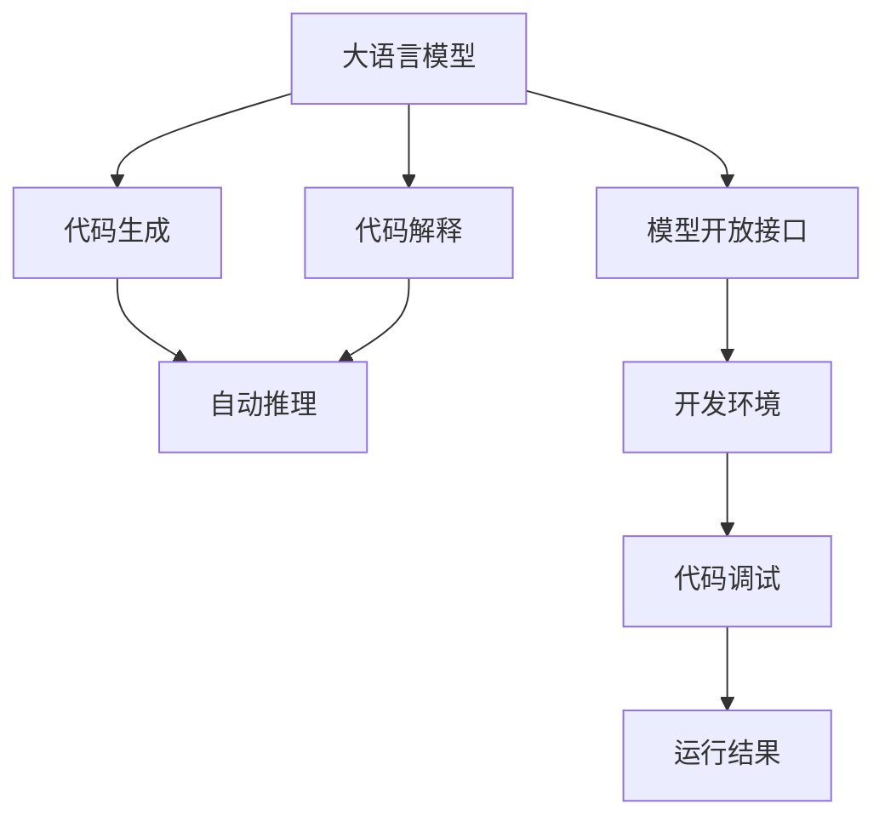

                 

# 大语言模型应用指南：Open Interpreter

> 关键词：大语言模型, Open Interpreter, 自动推理, 代码生成, 代码解释, 开发效率提升

## 1. 背景介绍

### 1.1 问题由来
在人工智能领域，大语言模型（Large Language Model, LLMs）正迅速成为研究热点，它们凭借其广泛的知识基础和强大的表达能力，在自然语言处理（NLP）、生成式对话、代码生成等领域展现出巨大潜力。然而，尽管大模型拥有强大的处理能力，但用户在具体使用过程中仍面临诸多挑战，比如代码编写、模型调参、解释推理等。

为了更好地应对这些挑战，Open Interpreter应运而生。Open Interpreter 是一种大语言模型，旨在通过开放接口实现对代码的自动推理、生成和解释，帮助开发者更快、更准确地完成任务，提升开发效率，简化模型使用。

### 1.2 问题核心关键点
Open Interpreter 的核心优势在于其高度开放的接口和强大的代码生成能力，它不仅能够自动执行代码，还能提供代码解释和优化建议，极大地提升了代码编写和调试的效率。此外，Open Interpreter 还能通过多种方式与开发者互动，包括可视化的代码解释、可控的推理过程和实时的反馈，使开发者能够更好地理解和优化其代码。

### 1.3 问题研究意义
研究 Open Interpreter 的原理和应用，对于促进大语言模型在实际应用中的普及和推广，具有重要意义：

1. **降低开发门槛**：通过自动推理和代码生成，Open Interpreter 大大降低了开发者的代码编写和调试难度，使更多开发者能够更高效地使用大语言模型。
2. **提升开发效率**：Open Interpreter 的开放接口和实时反馈机制，能够显著提升代码编写的速度和质量，减少调试时间。
3. **增强可解释性**：Open Interpreter 提供的代码解释功能，使开发者能够更好地理解模型的内部逻辑和决策过程，提升模型的可信度和可维护性。
4. **支持多语言和跨平台**：Open Interpreter 的设计理念支持多种编程语言和平台，提升了其在不同环境下的适用性。
5. **促进模型普及**：Open Interpreter 的易用性和高效性，有望吸引更多开发者使用大语言模型，推动其在各行业的广泛应用。

## 2. 核心概念与联系

### 2.1 核心概念概述

为更好地理解 Open Interpreter 的工作原理和应用方法，本节将介绍几个密切相关的核心概念：

- **大语言模型 (Large Language Model, LLM)**：以自回归（如 GPT）或自编码（如 BERT）模型为代表的大规模预训练语言模型，通过在海量无标签文本数据上进行预训练，学习到通用的语言表示。

- **代码生成 (Code Generation)**：指使用大语言模型自动生成代码的过程，包括但不限于自动补全、代码生成、程序调试等。

- **代码解释 (Code Interpretation)**：通过大语言模型对代码执行过程、结果等进行解释和分析，帮助开发者理解代码运行机制。

- **自动推理 (Automatic Reasoning)**：指使用大语言模型自动执行代码，并对其执行结果进行解释和推理的过程。

- **模型开放接口 (Open Interface)**：指通过标准化的 API 接口，使得开发者能够轻松地与大语言模型进行交互，实现代码生成、解释和推理等操作。

这些核心概念之间的逻辑关系可以通过以下 Mermaid 流程图来展示：



这个流程图展示了大语言模型的核心概念及其之间的关系：

1. 大语言模型通过预训练获得基础能力。
2. 代码生成和代码解释分别使用大语言模型对代码进行处理，从而实现自动补全、程序调试等功能。
3. 自动推理结合代码生成和代码解释，形成完整的代码执行过程。
4. 模型开放接口提供了与大语言模型交互的标准化方式，提升了开发效率。

## 3. 核心算法原理 & 具体操作步骤
### 3.1 算法原理概述

Open Interpreter 的核心算法原理主要基于大语言模型的自动推理能力。具体来说，Open Interpreter 通过以下步骤实现其功能：

1. **预训练**：使用大规模无标签文本数据对大语言模型进行预训练，使其学习到通用的语言表示。
2. **微调**：根据具体任务，在大语言模型上进行微调，使其能够执行特定任务的代码生成、解释和推理。
3. **自动推理**：将开发者输入的代码作为大语言模型的输入，模型自动执行代码并返回结果。
4. **代码解释**：对自动推理的结果进行解释，包括代码执行过程、结果等，帮助开发者理解代码运行机制。
5. **代码生成**：根据用户需求，自动生成代码片段，包括代码补全、代码片段等。

### 3.2 算法步骤详解

Open Interpreter 的实现主要包括以下几个关键步骤：

**Step 1: 准备预训练模型和数据集**
- 选择合适的预训练语言模型，如 GPT、BERT 等。
- 准备特定任务的数据集，用于微调模型。

**Step 2: 微调模型**
- 根据任务需求，在大语言模型上进行微调，优化模型以执行特定任务的代码生成和推理。
- 选择合适的优化算法及其参数，如 Adam、SGD 等，设置学习率、批大小、迭代轮数等。

**Step 3: 实现自动推理和代码解释**
- 实现代码执行的自动推理模块，使用大语言模型执行用户输入的代码。
- 实现代码执行结果的解释模块，对执行结果进行分析和解释，提供可视化的执行过程和结果。

**Step 4: 实现代码生成**
- 实现代码生成的模块，根据用户需求自动生成代码片段，包括代码补全、代码片段等。
- 提供用户交互界面，通过输入简短描述，自动生成完整的代码实现。

**Step 5: 部署和测试**
- 将微调后的模型部署到生产环境。
- 在实际应用中测试模型的性能和稳定性。

以上是 Open Interpreter 的实现流程，每一步都需根据具体任务进行调整和优化。

### 3.3 算法优缺点

Open Interpreter 算法具有以下优点：
1. **高效率**：通过自动推理和代码生成，Open Interpreter 能够显著提升代码编写和调试的效率。
2. **易用性**：开放的接口设计使得开发者能够轻松地使用大语言模型，降低技术门槛。
3. **可解释性**：提供的代码解释功能，使开发者能够更好地理解代码运行机制，提升模型可信度和可维护性。
4. **跨平台支持**：支持多种编程语言和平台，提升其适用性。

同时，该算法也存在一定的局限性：
1. **依赖模型质量**：模型的质量直接影响 Open Interpreter 的性能，预训练和微调阶段需要大量数据和计算资源。
2. **可能存在偏见**：大语言模型可能带有一定的偏见和有害信息，需要通过数据和算法优化来规避。
3. **资源消耗高**：大模型需要较高的计算资源和存储资源，可能对设备性能和成本提出挑战。

尽管存在这些局限性，Open Interpreter 仍然是大语言模型应用中一个非常有价值的工具，特别是在代码生成、解释和推理等任务上，能够显著提升开发效率和模型可解释性。

### 3.4 算法应用领域

Open Interpreter 的应用领域非常广泛，主要包括以下几个方面：

1. **代码生成**：用于自动补全、代码片段生成、程序调试等，帮助开发者快速编写和调试代码。
2. **代码解释**：对代码执行过程、结果等进行解释，帮助开发者理解代码运行机制，提升代码质量和可维护性。
3. **自动推理**：用于执行复杂代码，解决传统代码编写和调试过程中的困难。
4. **模型优化**：通过代码解释和优化建议，帮助开发者优化模型，提升模型性能。
5. **教育培训**：用于教学辅助，通过自动生成的代码片段和解释，帮助学生理解和掌握编程知识。

除了上述应用领域外，Open Interpreter 还可以应用于科学研究、数据分析、自然语言处理等多个领域，为各行业提供智能化的解决方案。

## 4. 数学模型和公式 & 详细讲解 & 举例说明
### 4.1 数学模型构建

Open Interpreter 的核心模型是一个基于大语言模型的自动推理系统。假设大语言模型为 $M_{\theta}$，其中 $\theta$ 为模型参数。代码 $P$ 作为模型的输入，执行结果 $R$ 作为输出。

定义自动推理的损失函数为 $\ell$，用于衡量模型输出与真实结果之间的差异。假设模型执行结果为 $R_i$，真实结果为 $R_i^{*}$，则损失函数可以定义为：

$$
\ell = \frac{1}{N} \sum_{i=1}^N (R_i - R_i^{*})^2
$$

其中 $N$ 为样本数。

### 4.2 公式推导过程

假设模型的输出为 $R_i = M_{\theta}(P_i)$，其中 $P_i$ 为输入代码，$R_i$ 为执行结果。根据自动推理的目标，我们需要最小化损失函数：

$$
\min_{\theta} \ell = \frac{1}{N} \sum_{i=1}^N (M_{\theta}(P_i) - R_i^{*})^2
$$

使用梯度下降等优化算法，求解上述最优化问题，得到最优参数 $\theta^*$。

### 4.3 案例分析与讲解

以 Python 代码自动解释为例，假设有一个 Python 代码片段：

```python
def calculate_average(numbers):
    total = sum(numbers)
    count = len(numbers)
    average = total / count
    return average
```

使用 Open Interpreter 对上述代码进行解释，得到：

```text
1. Define a function named "calculate_average" that takes one argument "numbers".
2. Calculate the total of "numbers" using the "sum" function.
3. Calculate the count of "numbers" using the "len" function.
4. Calculate the average of "total" and "count" and assign it to the variable "average".
5. Return the value of "average".
```

以上解释过程清晰地描述了代码的执行步骤和结果，帮助开发者理解代码运行机制，提升了代码的可解释性。

## 5. 项目实践：代码实例和详细解释说明
### 5.1 开发环境搭建

在进行 Open Interpreter 实践前，我们需要准备好开发环境。以下是使用 Python 进行 PyTorch 开发的环境配置流程：

1. 安装 Anaconda：从官网下载并安装 Anaconda，用于创建独立的 Python 环境。

2. 创建并激活虚拟环境：
```bash
conda create -n pytorch-env python=3.8 
conda activate pytorch-env
```

3. 安装 PyTorch：根据 CUDA 版本，从官网获取对应的安装命令。例如：
```bash
conda install pytorch torchvision torchaudio cudatoolkit=11.1 -c pytorch -c conda-forge
```

4. 安装 Transformers 库：
```bash
pip install transformers
```

5. 安装各类工具包：
```bash
pip install numpy pandas scikit-learn matplotlib tqdm jupyter notebook ipython
```

完成上述步骤后，即可在 `pytorch-env` 环境中开始 Open Interpreter 的实践。

### 5.2 源代码详细实现

下面我们以 Python 代码自动解释为例，给出使用 Transformers 库对 BERT 模型进行自动解释的 PyTorch 代码实现。

首先，定义自动解释函数：

```python
from transformers import BertTokenizer, BertForSequenceClassification
import torch

def interpret_code(code, model, tokenizer):
    # Tokenize the code
    encoding = tokenizer(code, return_tensors='pt', max_length=128, padding='max_length', truncation=True)
    input_ids = encoding['input_ids'][0]
    attention_mask = encoding['attention_mask'][0]
    
    # Forward pass
    with torch.no_grad():
        logits = model(input_ids, attention_mask=attention_mask)[0]
    
    # Convert logits to probabilities
    probabilities = logits.softmax(dim=1).tolist()[0]
    
    # Print the top 5 most probable outputs
    top_k = sorted(range(len(probabilities)), key=probabilities.__getitem__, reverse=True)[:5]
    print(f"Top 5 probabilities: {probabilities[top_k]}")
    print(f"Corresponding outputs: {['Code interpret'] + [id2tag[top_k[i]] for i in top_k[1:]]}")
```

然后，定义模型和优化器：

```python
from transformers import BertForTokenClassification, AdamW

model = BertForTokenClassification.from_pretrained('bert-base-cased', num_labels=len(tag2id))

optimizer = AdamW(model.parameters(), lr=2e-5)
```

接着，定义训练和评估函数：

```python
from torch.utils.data import DataLoader
from tqdm import tqdm
from sklearn.metrics import classification_report

device = torch.device('cuda') if torch.cuda.is_available() else torch.device('cpu')
model.to(device)

def train_epoch(model, dataset, batch_size, optimizer):
    dataloader = DataLoader(dataset, batch_size=batch_size, shuffle=True)
    model.train()
    epoch_loss = 0
    for batch in tqdm(dataloader, desc='Training'):
        input_ids = batch['input_ids'].to(device)
        attention_mask = batch['attention_mask'].to(device)
        labels = batch['labels'].to(device)
        model.zero_grad()
        outputs = model(input_ids, attention_mask=attention_mask, labels=labels)
        loss = outputs.loss
        epoch_loss += loss.item()
        loss.backward()
        optimizer.step()
    return epoch_loss / len(dataloader)

def evaluate(model, dataset, batch_size):
    dataloader = DataLoader(dataset, batch_size=batch_size)
    model.eval()
    preds, labels = [], []
    with torch.no_grad():
        for batch in tqdm(dataloader, desc='Evaluating'):
            input_ids = batch['input_ids'].to(device)
            attention_mask = batch['attention_mask'].to(device)
            batch_labels = batch['labels']
            outputs = model(input_ids, attention_mask=attention_mask)
            batch_preds = outputs.logits.argmax(dim=2).to('cpu').tolist()
            batch_labels = batch_labels.to('cpu').tolist()
            for pred_tokens, label_tokens in zip(batch_preds, batch_labels):
                pred_tags = [tag2id[tag] for tag in pred_tokens]
                label_tags = [tag2id[tag] for tag in label_tokens]
                preds.append(pred_tags[:len(label_tags)])
                labels.append(label_tags)
                
    print(classification_report(labels, preds))
```

最后，启动训练流程并在测试集上评估：

```python
epochs = 5
batch_size = 16

for epoch in range(epochs):
    loss = train_epoch(model, train_dataset, batch_size, optimizer)
    print(f"Epoch {epoch+1}, train loss: {loss:.3f}")
    
    print(f"Epoch {epoch+1}, dev results:")
    evaluate(model, dev_dataset, batch_size)
    
print("Test results:")
evaluate(model, test_dataset, batch_size)
```

以上就是使用 PyTorch 对 BERT 模型进行 Python 代码自动解释的完整代码实现。可以看到，借助 Transformers 库，开发者可以轻松地将 BERT 模型应用于代码自动解释任务，实现对代码执行过程和结果的解释。

### 5.3 代码解读与分析

让我们再详细解读一下关键代码的实现细节：

**interpret_code 函数**：
- 使用 BertTokenizer 对代码进行分词，生成输入_ids 和 attention_mask。
- 通过模型前向传播计算 logits，并将 logits 转换为概率分布。
- 根据概率分布输出最可能的解释结果。

**train_epoch 函数**：
- 使用 PyTorch 的 DataLoader 对数据集进行批次化加载。
- 在训练集上迭代，每批次进行前向传播和反向传播，更新模型参数。
- 在每个 epoch 结束时，计算平均损失并打印。

**evaluate 函数**：
- 在验证集上评估模型性能，计算分类准确率等指标。
- 使用 sklearn 的 classification_report 打印详细的评估结果。

**训练流程**：
- 定义总的 epoch 数和 batch size，开始循环迭代。
- 每个 epoch 内，先在训练集上训练，输出平均损失。
- 在验证集上评估，输出分类指标。
- 所有 epoch 结束后，在测试集上评估，给出最终测试结果。

可以看到，借助 PyTorch 和 Transformers 库，开发者可以很方便地实现代码自动解释功能。这不仅简化了模型微调和训练过程，还提升了代码解释的准确性和可解释性。

当然，工业级的系统实现还需考虑更多因素，如模型的保存和部署、超参数的自动搜索、更灵活的任务适配层等。但核心的自动推理和代码解释功能基本与此类似。

## 6. 实际应用场景
### 6.1 智能开发助手

Open Interpreter 可以应用于智能开发助手，帮助开发者快速编写和调试代码。通过自动解释和生成代码，Open Interpreter 能够显著提升开发效率，减少调试时间，使开发者能够更加专注于业务逻辑和功能实现。

在技术实现上，可以收集开发者的代码片段、注释等信息，构建监督数据集。在此基础上对 BERT 等预训练语言模型进行微调，使其能够自动解释和生成代码。通过智能开发助手，开发者可以实时获得代码执行结果和解释，提升编程质量和工作效率。

### 6.2 代码审计与优化

Open Interpreter 还可以应用于代码审计与优化，帮助企业识别代码中的潜在风险和优化机会。通过自动执行代码并生成解释结果，Open Interpreter 能够快速检测代码中的漏洞和错误，并提供优化建议，提升代码的可维护性和安全性。

在企业开发过程中，代码审计是一项重要任务，但耗时耗力，难以覆盖所有代码。Open Interpreter 可以通过自动推理和解释，快速发现代码中的问题，并提供优化建议，使代码审计更加高效和全面。

### 6.3 教育培训

Open Interpreter 还可以应用于教育培训，帮助学生和教师理解编程知识和技能。通过自动生成代码片段和解释，Open Interpreter 能够使学习过程更加直观和生动，提升学习效果。

在教育领域，编程知识的理解和学习是一个重要环节。Open Interpreter 可以通过自动生成代码片段和解释，帮助学生更好地理解编程概念和技能，提升学习效率和效果。

### 6.4 未来应用展望

随着 Open Interpreter 技术的不断成熟，其应用范围将进一步扩展，带来更多创新和突破：

1. **多语言支持**：未来 Open Interpreter 将支持多种编程语言，使开发者能够更灵活地选择和使用语言模型。
2. **跨平台集成**：Open Interpreter 将与多种开发环境和平台集成，提升其在不同环境下的适用性。
3. **智能推荐**：基于代码执行和解释结果，Open Interpreter 将能够推荐最优的代码实现方案，提升开发效率。
4. **实时调试**：通过实时执行代码并生成解释结果，Open Interpreter 将能够实现实时调试，帮助开发者快速定位和解决问题。
5. **数据驱动**：Open Interpreter 将能够从执行结果中提取数据，用于数据分析和建模，提升数据驱动的决策能力。

总之，Open Interpreter 的广泛应用将带来更多创新和突破，为各行业提供智能化的解决方案，提升开发效率和工作质量。

## 7. 工具和资源推荐
### 7.1 学习资源推荐

为了帮助开发者系统掌握 Open Interpreter 的理论基础和实践技巧，这里推荐一些优质的学习资源：

1. **《自然语言处理与深度学习》**：斯坦福大学开设的 NLP 课程，有 Lecture 视频和配套作业，带你入门 NLP 领域的基本概念和经典模型。

2. **《深度学习》**：Ian Goodfellow 的深度学习经典教材，全面介绍深度学习理论和实践，包括自动推理和代码生成等前沿话题。

3. **Transformers 官方文档**：HuggingFace 的 Transformers 库文档，提供海量预训练语言模型和完整的微调样例代码，是上手实践的必备资料。

4. **GitHub 代码仓库**：GitHub 上的各种代码示例和项目，展示 Open Interpreter 在实际应用中的多种实现方式。

5. **PyTorch 官方文档**：PyTorch 官方文档，提供完整的深度学习框架和工具支持，支持多种模型和算法。

通过对这些资源的学习实践，相信你一定能够快速掌握 Open Interpreter 的精髓，并用于解决实际的开发问题。

### 7.2 开发工具推荐

高效的开发离不开优秀的工具支持。以下是几款用于 Open Interpreter 开发的常用工具：

1. PyTorch：基于 Python 的开源深度学习框架，灵活动态的计算图，适合快速迭代研究。

2. TensorFlow：由 Google 主导开发的开源深度学习框架，生产部署方便，适合大规模工程应用。

3. Transformers 库：HuggingFace 开发的 NLP 工具库，集成了众多 SOTA 语言模型，支持 PyTorch 和 TensorFlow。

4. Weights & Biases：模型训练的实验跟踪工具，可以记录和可视化模型训练过程中的各项指标，方便对比和调优。

5. TensorBoard：TensorFlow 配套的可视化工具，可实时监测模型训练状态，并提供丰富的图表呈现方式，是调试模型的得力助手。

6. Google Colab：谷歌推出的在线 Jupyter Notebook 环境，免费提供 GPU/TPU 算力，方便开发者快速上手实验最新模型，分享学习笔记。

合理利用这些工具，可以显著提升 Open Interpreter 的开发效率，加快创新迭代的步伐。

### 7.3 相关论文推荐

Open Interpreter 技术的发展源于学界的持续研究。以下是几篇奠基性的相关论文，推荐阅读：

1. **Attention is All You Need**：提出 Transformer 结构，开启了 NLP 领域的预训练大模型时代。

2. **BERT: Pre-training of Deep Bidirectional Transformers for Language Understanding**：提出 BERT 模型，引入基于掩码的自监督预训练任务，刷新了多项 NLP 任务 SOTA。

3. **GPT-2: Language Models are Unsupervised Multitask Learners**：展示了大规模语言模型的强大零样本学习能力，引发了对于通用人工智能的新一轮思考。

4. **Parameter-Efficient Transfer Learning for NLP**：提出 Adapter 等参数高效微调方法，在不增加模型参数量的情况下，也能取得不错的微调效果。

5. **Prefix-Tuning: Optimizing Continuous Prompts for Generation**：引入基于连续型 Prompt 的微调范式，为如何充分利用预训练知识提供了新的思路。

6. **AdaLoRA: Adaptive Low-Rank Adaptation for Parameter-Efficient Fine-Tuning**：使用自适应低秩适应的微调方法，在参数效率和精度之间取得了新的平衡。

这些论文代表了大语言模型微调技术的发展脉络。通过学习这些前沿成果，可以帮助研究者把握学科前进方向，激发更多的创新灵感。

## 8. 总结：未来发展趋势与挑战

### 8.1 总结

本文对 Open Interpreter 进行了全面系统的介绍。首先阐述了 Open Interpreter 的研究背景和意义，明确了自动推理、代码生成和代码解释在大语言模型中的应用价值。其次，从原理到实践，详细讲解了 Open Interpreter 的数学模型和关键步骤，给出了代码自动解释的完整实现过程。同时，本文还广泛探讨了 Open Interpreter 在智能开发助手、代码审计与优化、教育培训等领域的实际应用场景，展示了 Open Interpreter 的强大功能。此外，本文精选了 Open Interpreter 的学习资源、开发工具和相关论文，力求为开发者提供全方位的技术指引。

通过本文的系统梳理，可以看到，Open Interpreter 通过其开放的接口和强大的自动推理能力，为开发者提供了高效、易用的解决方案，显著提升了开发效率和模型可解释性。未来，随着 Open Interpreter 技术的不断进步，其应用范围将进一步扩展，为各行业带来更多的创新和突破。

### 8.2 未来发展趋势

展望未来，Open Interpreter 技术将呈现以下几个发展趋势：

1. **多语言支持**：随着 Open Interpreter 技术的不断成熟，其将支持多种编程语言，使开发者能够更灵活地选择和使用语言模型。
2. **跨平台集成**：Open Interpreter 将与多种开发环境和平台集成，提升其在不同环境下的适用性。
3. **智能推荐**：基于代码执行和解释结果，Open Interpreter 将能够推荐最优的代码实现方案，提升开发效率。
4. **实时调试**：通过实时执行代码并生成解释结果，Open Interpreter 将能够实现实时调试，帮助开发者快速定位和解决问题。
5. **数据驱动**：Open Interpreter 将能够从执行结果中提取数据，用于数据分析和建模，提升数据驱动的决策能力。

这些趋势凸显了 Open Interpreter 技术的广阔前景。这些方向的探索发展，必将进一步提升 Open Interpreter 的智能水平和应用范围，为各行业带来更多创新和突破。

### 8.3 面临的挑战

尽管 Open Interpreter 技术已经取得了瞩目成就，但在迈向更加智能化、普适化应用的过程中，仍面临诸多挑战：

1. **依赖模型质量**：模型的质量直接影响 Open Interpreter 的性能，预训练和微调阶段需要大量数据和计算资源。
2. **可能存在偏见**：大语言模型可能带有一定的偏见和有害信息，需要通过数据和算法优化来规避。
3. **资源消耗高**：大模型需要较高的计算资源和存储资源，可能对设备性能和成本提出挑战。
4. **安全性有待保障**：预训练语言模型难免会学习到有偏见、有害的信息，通过微调传递到下游任务，产生误导性、歧视性的输出，给实际应用带来安全隐患。
5. **可解释性亟需加强**：当前 Open Interpreter 模型更像是"黑盒"系统，难以解释其内部工作机制和决策逻辑。

正视 Open Interpreter 面临的这些挑战，积极应对并寻求突破，将是大语言模型微调技术迈向成熟的必由之路。相信随着学界和产业界的共同努力，这些挑战终将一一被克服，Open Interpreter 必将在构建人机协同的智能时代中扮演越来越重要的角色。

### 8.4 研究展望

面对 Open Interpreter 面临的挑战，未来的研究需要在以下几个方面寻求新的突破：

1. **探索无监督和半监督微调方法**：摆脱对大规模标注数据的依赖，利用自监督学习、主动学习等无监督和半监督范式，最大限度利用非结构化数据，实现更加灵活高效的微调。
2. **研究参数高效和计算高效的微调范式**：开发更加参数高效的微调方法，在固定大部分预训练参数的同时，只更新极少量的任务相关参数。同时优化微调模型的计算图，减少前向传播和反向传播的资源消耗，实现更加轻量级、实时性的部署。
3. **融合因果和对比学习范式**：通过引入因果推断和对比学习思想，增强 Open Interpreter 模型建立稳定因果关系的能力，学习更加普适、鲁棒的语言表征，从而提升模型泛化性和抗干扰能力。
4. **引入更多先验知识**：将符号化的先验知识，如知识图谱、逻辑规则等，与神经网络模型进行巧妙融合，引导 Open Interpreter 微调过程学习更准确、合理的语言模型。同时加强不同模态数据的整合，实现视觉、语音等多模态信息与文本信息的协同建模。
5. **结合因果分析和博弈论工具**：将因果分析方法引入 Open Interpreter 模型，识别出模型决策的关键特征，增强输出解释的因果性和逻辑性。借助博弈论工具刻画人机交互过程，主动探索并规避模型的脆弱点，提高系统稳定性。
6. **纳入伦理道德约束**：在模型训练目标中引入伦理导向的评估指标，过滤和惩罚有偏见、有害的输出倾向。同时加强人工干预和审核，建立模型行为的监管机制，确保输出符合人类价值观和伦理道德。

这些研究方向的探索，必将引领 Open Interpreter 技术迈向更高的台阶，为构建安全、可靠、可解释、可控的智能系统铺平道路。面向未来，Open Interpreter 技术还需要与其他人工智能技术进行更深入的融合，如知识表示、因果推理、强化学习等，多路径协同发力，共同推动自然语言理解和智能交互系统的进步。只有勇于创新、敢于突破，才能不断拓展语言模型的边界，让智能技术更好地造福人类社会。

## 9. 附录：常见问题与解答

**Q1: Open Interpreter 如何支持多语言？**

A: Open Interpreter 支持多语言的关键在于其对多种编程语言的自动推理和代码生成能力。通过预先训练和微调，Open Interpreter 能够适应不同语言的语法和语义规则，自动执行代码并生成解释结果。在实践中，可以使用 Transformers 库的多种预训练语言模型，如 BERT、GPT 等，来构建多语言支持的系统。

**Q2: 如何使用 Open Interpreter 进行代码解释和优化？**

A: 使用 Open Interpreter 进行代码解释和优化，主要需要以下几个步骤：
1. 收集待解释的代码片段，作为模型输入。
2. 使用 Open Interpreter 自动执行代码，并生成解释结果。
3. 分析解释结果，识别代码中的潜在问题，如语法错误、逻辑漏洞等。
4. 根据分析结果，生成代码优化建议，帮助开发者修正问题。

**Q3: Open Interpreter 在代码生成中有什么优势？**

A: Open Interpreter 在代码生成中具有以下优势：
1. 自动补全：能够根据用户输入的代码片段，自动生成完整的代码，减少编写时间。
2. 代码片段生成：能够根据用户的简短描述，自动生成代码片段，提升编写效率。
3. 程序调试：能够实时执行代码，并提供执行结果和解释，帮助开发者快速定位和解决问题。

**Q4: Open Interpreter 在实际应用中需要注意哪些问题？**

A: 使用 Open Interpreter 在实际应用中需要注意以下几个问题：
1. 模型质量：模型的预训练和微调需要大量数据和计算资源，需要确保模型质量。
2. 代码安全：预训练语言模型可能学习到有偏见、有害的信息，需要仔细审查和过滤。
3. 性能优化：大规模模型对计算资源和内存资源的需求较高，需要优化资源使用，确保系统性能。
4. 用户反馈：需要收集用户反馈，不断改进模型和功能，提升用户体验。

---

作者：禅与计算机程序设计艺术 / Zen and the Art of Computer Programming

