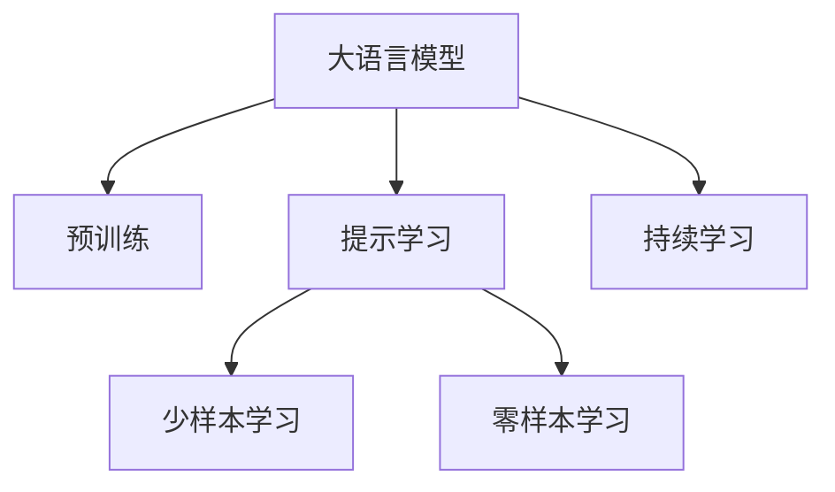

                 

# 大语言模型应用指南：基于提示的工具

> 关键词：大语言模型,提示学习,Prompt Engineering,自然语言处理,NLP,预训练,Transformer,BERT

## 1. 背景介绍

### 1.1 问题由来
近年来，随着深度学习技术的快速发展，尤其是大语言模型（Large Language Models, LLMs）在自然语言处理（Natural Language Processing, NLP）领域取得了显著的突破。这些模型通过在大规模无标签文本数据上进行预训练，学习到了丰富的语言知识和常识，具备了强大的语言理解和生成能力。然而，如何在大规模语言模型上应用，特别是在特定任务上取得更好的表现，成为一个重要的研究方向。

提示学习（Prompt Engineering）作为一种基于自然语言处理技术的应用方法，已经成为大语言模型应用的重要工具之一。提示学习通过精心设计输入文本的格式，引导模型按期望方式输出，可以在不更新模型参数的情况下，实现零样本或少样本学习。这种方法不仅能够大幅提升模型的预测精度，还能够减少微调过程中的计算成本和时间成本，使得大语言模型在实际应用中更具实用性和灵活性。

### 1.2 问题核心关键点
提示学习（Prompt Engineering）的核心在于如何通过输入文本的格式，有效利用预训练模型学到的知识，进行特定任务的推理和生成。具体来说，提示学习包括：

- 提示模板设计：精心设计提示模板，包含任务相关的关键词和逻辑，引导模型进行推理或生成。
- 模板优化：通过不断的迭代实验，找到最有效的提示模板。
- 模型融合：将多个提示模板进行组合使用，提高模型的泛化能力。

提示学习在大规模语言模型上的应用，已经成为NLP技术的重要创新方向。其能够通过简单的文本格式化，实现对模型推理逻辑的控制，从而提升模型的预测准确率和实用性。

### 1.3 问题研究意义
研究提示学习技术，对于拓展大语言模型的应用范围，提升下游任务的性能，加速NLP技术的产业化进程，具有重要意义：

1. 降低应用开发成本。提示学习可以显著减少从头开发所需的数据、计算和人力等成本投入。
2. 提升模型效果。提示学习使得通用大模型更好地适应特定任务，在应用场景中取得更优表现。
3. 加速开发进度。standing on the shoulders of giants，提示学习使得开发者可以更快地完成任务适配，缩短开发周期。
4. 带来技术创新。提示学习催生了提示学习、少样本学习等新的研究方向。
5. 赋能产业升级。提示学习使得NLP技术更容易被各行各业所采用，为传统行业数字化转型升级提供新的技术路径。

## 2. 核心概念与联系

### 2.1 核心概念概述

为更好地理解基于提示学习的大语言模型应用方法，本节将介绍几个密切相关的核心概念：

- 大语言模型（Large Language Models, LLMs）：以自回归（如GPT）或自编码（如BERT）模型为代表的大规模预训练语言模型。通过在大规模无标签文本语料上进行预训练，学习到丰富的语言知识和常识，具备强大的语言理解和生成能力。

- 预训练（Pre-training）：指在大规模无标签文本语料上，通过自监督学习任务训练通用语言模型的过程。常见的预训练任务包括言语建模、遮挡语言模型等。预训练使得模型学习到语言的通用表示。

- 提示学习（Prompt Engineering）：通过精心设计输入文本的格式，引导大语言模型进行特定任务的推理和生成。可以在不更新模型参数的情况下，实现零样本或少样本学习。

- 少样本学习（Few-shot Learning）：指在只有少量标注样本的情况下，模型能够快速适应新任务的学习方法。在大语言模型中，通常通过在输入中提供少量示例来实现，无需更新模型参数。

- 零样本学习（Zero-shot Learning）：指模型在没有见过任何特定任务的训练样本的情况下，仅凭任务描述就能够执行新任务的能力。大语言模型通过预训练获得的广泛知识，使其能够理解任务指令并生成相应输出。

- 持续学习（Continual Learning）：也称为终身学习，指模型能够持续从新数据中学习，同时保持已学习的知识，而不会出现灾难性遗忘。这对于保持大语言模型的时效性和适应性至关重要。

这些核心概念之间的逻辑关系可以通过以下Mermaid流程图来展示：



这个流程图展示了大语言模型的核心概念及其之间的关系：

1. 大语言模型通过预训练获得基础能力。
2. 提示学习是一种不更新模型参数的方法，可以实现少样本学习和零样本学习。
3. 提示学习是连接预训练模型与下游任务的桥梁，可以通过提示模板实现任务适配。
4. 持续学习旨在使模型能够不断学习新知识，同时避免遗忘旧知识。

这些概念共同构成了大语言模型的学习和应用框架，使其能够在各种场景下发挥强大的语言理解和生成能力。通过理解这些核心概念，我们可以更好地把握大语言模型的工作原理和优化方向。

## 3. 核心算法原理 & 具体操作步骤
### 3.1 算法原理概述

基于提示学习的大语言模型应用，本质上是一种无监督的特征提取和推理过程。其核心思想是：利用预训练模型在通用语料上学习到的语言表示，通过特定的输入文本格式，引导模型输出期望的推理结果。

具体来说，假设我们有一个通用的预训练模型 $M_{\theta}$，其中 $\theta$ 为预训练得到的模型参数。对于下游任务 $T$，我们希望模型能够根据输入文本 $x$，输出相应的推理结果 $y$。我们可以通过设计合适的提示模板 $P(x)$，使得模型能够理解输入文本 $x$ 中隐含的语义信息，从而输出正确的推理结果。

因此，提示学习的目标可以表述为：

$$
y^* = M_{\theta}(P(x))
$$

其中 $P(x)$ 表示输入文本 $x$ 的格式化提示模板，$y^*$ 为模型输出的期望结果。

### 3.2 算法步骤详解

基于提示学习的大语言模型应用一般包括以下几个关键步骤：

**Step 1: 设计提示模板**

提示模板设计是提示学习的关键步骤。一个好的提示模板应该包含以下几个要素：

- 任务相关性：提示模板应该包含与任务相关的关键词和逻辑结构，使得模型能够快速理解任务需求。
- 语法规范性：提示模板应该符合语法规则，易于模型处理。
- 简洁明了：提示模板应该简洁明了，避免冗余和不必要的干扰。

例如，对于命名实体识别（NER）任务，一个可能的提示模板可以是：

```
在以下文本中，识别出所有的人名：
输入文本：（输入文本）
```

**Step 2: 模型推理**

设计好提示模板后，我们可以将输入文本 $x$ 输入到模型中，通过推理得到输出结果 $y$。需要注意的是，在推理时，我们并不需要更新模型的权重，而是在保持预训练权重不变的情况下，通过推理计算输出。

具体来说，我们可以使用预训练模型的自动编码器部分作为特征提取器，将输入文本编码成向量表示。然后，通过设计好的提示模板，将编码后的向量输入到解码器中，输出模型的推理结果。

**Step 3: 结果评估**

对于每个输入文本，我们都可以通过模型推理得到相应的输出结果。为了评估模型的性能，我们需要将模型的输出结果与任务的真实标签进行比较。如果模型的输出结果与真实标签一致，说明模型正确理解了输入文本，并且完成了正确的推理任务。

例如，对于命名实体识别任务，我们可以将模型的输出结果与真实标签进行比较，计算准确率、召回率和F1-score等指标，评估模型的性能。

**Step 4: 迭代优化**

提示学习是一个迭代优化的过程。通过不断调整提示模板，可以找到最优的提示模板，提升模型的性能。具体的迭代优化步骤包括：

- 收集多组输入文本及其真实标签。
- 设计多个提示模板，并计算每个模板的性能指标。
- 选择性能最好的提示模板。
- 使用选择好的提示模板进行模型推理，评估性能。
- 重复上述步骤，直到性能达到预期。

### 3.3 算法优缺点

基于提示学习的大语言模型应用方法具有以下优点：

1. 简单高效。提示学习可以显著减少从头开发所需的数据、计算和人力等成本投入。
2. 灵活性强。提示学习可以根据具体任务的特点，设计多种提示模板，提升模型的泛化能力。
3. 不依赖标注数据。提示学习可以在没有标注数据的情况下，通过简单的文本格式化，实现对模型的推理和生成。

同时，该方法也存在一定的局限性：

1. 需要精心设计提示模板。提示模板的设计需要一定的经验和技巧，否则可能无法得到理想的效果。
2. 模型泛化能力受限。当提示模板与任务需求不匹配时，模型的泛化能力可能下降。
3. 模型依赖提示模板。提示模板的微小变化可能导致模型输出结果的大幅波动。

尽管存在这些局限性，但就目前而言，基于提示学习的方法仍然是NLP任务应用的重要手段。未来相关研究的重点在于如何进一步降低提示模板的设计成本，提高模型的泛化能力和鲁棒性。

### 3.4 算法应用领域

基于提示学习的大语言模型应用方法，在NLP领域已经得到了广泛的应用，覆盖了几乎所有常见任务，例如：

- 文本分类：如情感分析、主题分类、意图识别等。通过设计合适的提示模板，引导模型进行分类。
- 命名实体识别：识别文本中的人名、地名、机构名等特定实体。通过设计提示模板，帮助模型识别实体边界和类型。
- 关系抽取：从文本中抽取实体之间的语义关系。通过设计提示模板，引导模型抽取实体-关系三元组。
- 问答系统：对自然语言问题给出答案。通过设计提示模板，帮助模型理解问题并生成回答。
- 机器翻译：将源语言文本翻译成目标语言。通过设计提示模板，引导模型学习语言-语言映射。
- 文本摘要：将长文本压缩成简短摘要。通过设计提示模板，引导模型抓取要点。
- 对话系统：使机器能够与人自然对话。通过设计提示模板，引导模型生成响应。

除了上述这些经典任务外，提示学习还被创新性地应用到更多场景中，如可控文本生成、常识推理、代码生成、数据增强等，为NLP技术带来了全新的突破。随着预训练模型和提示学习方法的不断进步，相信NLP技术将在更广阔的应用领域大放异彩。

## 4. 数学模型和公式 & 详细讲解  
### 4.1 数学模型构建

本节将使用数学语言对基于提示学习的大语言模型应用过程进行更加严格的刻画。

记预训练语言模型为 $M_{\theta}$，其中 $\theta$ 为预训练得到的模型参数。假设提示模板为 $P(x)$，输入文本为 $x$，模型输出的期望结果为 $y^*$。

定义模型在提示模板 $P(x)$ 下的推理结果为：

$$
y = M_{\theta}(P(x))
$$

其中 $P(x)$ 表示输入文本 $x$ 的格式化提示模板。

通过损失函数 $\ell(y, y^*)$ 度量模型输出与真实标签之间的差异，目标是最小化损失函数：

$$
\mathcal{L}(\theta) = \mathbb{E}_{P(x)}[\ell(y, y^*)]
$$

其中 $\mathbb{E}_{P(x)}$ 表示对提示模板 $P(x)$ 的期望。

### 4.2 公式推导过程

以下我们以命名实体识别（NER）任务为例，推导提示模板的设计和计算过程。

假设提示模板为：

```
在以下文本中，识别出所有人名：
输入文本：（输入文本）
```

对于每个输入文本 $x$，我们可以将输入文本 $x$ 与提示模板进行拼接，得到新的输入：

$$
x' = x + \text{'在以下文本中，识别出所有人名：' + ' ' + x}
$$

然后，将新的输入 $x'$ 输入到模型 $M_{\theta}$ 中，得到模型的推理结果 $y$。通过对比推理结果 $y$ 与真实标签 $y^*$，计算损失函数：

$$
\ell(y, y^*) = \sum_{i=1}^n \mathbb{I}(y_i \neq y^*_i) \log(y_i)
$$

其中 $\mathbb{I}$ 为指示函数，表示 $y_i$ 是否与 $y^*_i$ 一致。

通过最小化损失函数，即可优化模型在提示模板下的性能。需要注意的是，由于模型输出 $y$ 是一个概率分布，我们需要使用交叉熵损失函数，对模型的推理结果进行评估和优化。

## 5. 项目实践：代码实例和详细解释说明
### 5.1 开发环境搭建

在进行提示学习实践前，我们需要准备好开发环境。以下是使用Python进行PyTorch开发的环境配置流程：

1. 安装Anaconda：从官网下载并安装Anaconda，用于创建独立的Python环境。

2. 创建并激活虚拟环境：
```bash
conda create -n pytorch-env python=3.8 
conda activate pytorch-env
```

3. 安装PyTorch：根据CUDA版本，从官网获取对应的安装命令。例如：
```bash
conda install pytorch torchvision torchaudio cudatoolkit=11.1 -c pytorch -c conda-forge
```

4. 安装Transformers库：
```bash
pip install transformers
```

5. 安装各类工具包：
```bash
pip install numpy pandas scikit-learn matplotlib tqdm jupyter notebook ipython
```

完成上述步骤后，即可在`pytorch-env`环境中开始提示学习实践。

### 5.2 源代码详细实现

下面我们以命名实体识别（NER）任务为例，给出使用Transformers库对BERT模型进行提示学习的PyTorch代码实现。

首先，定义NER任务的数据处理函数：

```python
from transformers import BertTokenizer
from torch.utils.data import Dataset
import torch

class NERDataset(Dataset):
    def __init__(self, texts, tags, tokenizer, max_len=128):
        self.texts = texts
        self.tags = tags
        self.tokenizer = tokenizer
        self.max_len = max_len
        
    def __len__(self):
        return len(self.texts)
    
    def __getitem__(self, item):
        text = self.texts[item]
        tags = self.tags[item]
        
        encoding = self.tokenizer(text, return_tensors='pt', max_length=self.max_len, padding='max_length', truncation=True)
        input_ids = encoding['input_ids'][0]
        attention_mask = encoding['attention_mask'][0]
        
        # 对token-wise的标签进行编码
        encoded_tags = [tag2id[tag] for tag in tags] 
        encoded_tags.extend([tag2id['O']] * (self.max_len - len(encoded_tags)))
        labels = torch.tensor(encoded_tags, dtype=torch.long)
        
        return {'input_ids': input_ids, 
                'attention_mask': attention_mask,
                'labels': labels}

# 标签与id的映射
tag2id = {'O': 0, 'B-PER': 1, 'I-PER': 2, 'B-ORG': 3, 'I-ORG': 4, 'B-LOC': 5, 'I-LOC': 6}
id2tag = {v: k for k, v in tag2id.items()}

# 创建dataset
tokenizer = BertTokenizer.from_pretrained('bert-base-cased')

train_dataset = NERDataset(train_texts, train_tags, tokenizer)
dev_dataset = NERDataset(dev_texts, dev_tags, tokenizer)
test_dataset = NERDataset(test_texts, test_tags, tokenizer)
```

然后，定义模型和提示模板：

```python
from transformers import BertForTokenClassification, AdamW

model = BertForTokenClassification.from_pretrained('bert-base-cased', num_labels=len(tag2id))

prompt_template = "在以下文本中，识别出所有人名："

# 提示模板中的标记符号
tokenizer = BertTokenizer.from_pretrained('bert-base-cased')
prompt_tokens = tokenizer.encode(prompt_template, add_special_tokens=False)
prompt_len = len(prompt_tokens)

# 提示模板的输入
prompt_input_ids = torch.tensor(prompt_tokens + [tokenizer.mask_token_id] * (max_seq_len - prompt_len))
prompt_attention_mask = torch.zeros(max_seq_len, dtype=torch.long)
prompt_attention_mask[:prompt_len] = 1

# 提示模板的输出
prompt_labels = torch.zeros(max_seq_len, dtype=torch.long)
```

接着，定义训练和评估函数：

```python
from torch.utils.data import DataLoader
from tqdm import tqdm
from sklearn.metrics import classification_report

device = torch.device('cuda') if torch.cuda.is_available() else torch.device('cpu')
model.to(device)

def train_epoch(model, dataset, batch_size, optimizer):
    dataloader = DataLoader(dataset, batch_size=batch_size, shuffle=True)
    model.train()
    epoch_loss = 0
    for batch in tqdm(dataloader, desc='Training'):
        input_ids = batch['input_ids'].to(device)
        attention_mask = batch['attention_mask'].to(device)
        labels = batch['labels'].to(device)
        model.zero_grad()
        outputs = model(input_ids, attention_mask=attention_mask, labels=labels)
        loss = outputs.loss
        epoch_loss += loss.item()
        loss.backward()
        optimizer.step()
    return epoch_loss / len(dataloader)

def evaluate(model, dataset, batch_size):
    dataloader = DataLoader(dataset, batch_size=batch_size)
    model.eval()
    preds, labels = [], []
    with torch.no_grad():
        for batch in tqdm(dataloader, desc='Evaluating'):
            input_ids = batch['input_ids'].to(device)
            attention_mask = batch['attention_mask'].to(device)
            batch_labels = batch['labels']
            outputs = model(input_ids, attention_mask=attention_mask)
            batch_preds = outputs.logits.argmax(dim=2).to('cpu').tolist()
            batch_labels = batch_labels.to('cpu').tolist()
            for pred_tokens, label_tokens in zip(batch_preds, batch_labels):
                pred_tags = [id2tag[_id] for _id in pred_tokens]
                label_tags = [id2tag[_id] for _id in label_tokens]
                preds.append(pred_tags[:len(label_tags)])
                labels.append(label_tags)
                
    print(classification_report(labels, preds))
```

最后，启动训练流程并在测试集上评估：

```python
epochs = 5
batch_size = 16

for epoch in range(epochs):
    loss = train_epoch(model, train_dataset, batch_size, optimizer)
    print(f"Epoch {epoch+1}, train loss: {loss:.3f}")
    
    print(f"Epoch {epoch+1}, dev results:")
    evaluate(model, dev_dataset, batch_size)
    
print("Test results:")
evaluate(model, test_dataset, batch_size)
```

以上就是使用PyTorch对BERT进行命名实体识别任务的提示学习代码实现。可以看到，得益于Transformers库的强大封装，我们可以用相对简洁的代码完成BERT模型的加载和提示学习。

### 5.3 代码解读与分析

让我们再详细解读一下关键代码的实现细节：

**NERDataset类**：
- `__init__`方法：初始化文本、标签、分词器等关键组件。
- `__len__`方法：返回数据集的样本数量。
- `__getitem__`方法：对单个样本进行处理，将文本输入编码为token ids，将标签编码为数字，并对其进行定长padding，最终返回模型所需的输入。

**tag2id和id2tag字典**：
- 定义了标签与数字id之间的映射关系，用于将token-wise的预测结果解码回真实的标签。

**提示模板定义**：
- 提示模板为一个字符串，在代码中使用 `tokenizer.encode` 函数将字符串转换为模型可以处理的token序列，并在序列末尾添加一个标记符号。
- 提示模板的输入和输出分别用 `prompt_input_ids` 和 `prompt_labels` 表示，用于在模型训练时引导模型的推理过程。

**训练和评估函数**：
- 使用PyTorch的DataLoader对数据集进行批次化加载，供模型训练和推理使用。
- 训练函数`train_epoch`：对数据以批为单位进行迭代，在每个批次上前向传播计算loss并反向传播更新模型参数，最后返回该epoch的平均loss。
- 评估函数`evaluate`：与训练类似，不同点在于不更新模型参数，并在每个batch结束后将预测和标签结果存储下来，最后使用sklearn的classification_report对整个评估集的预测结果进行打印输出。

**训练流程**：
- 定义总的epoch数和batch size，开始循环迭代
- 每个epoch内，先在训练集上训练，输出平均loss
- 在验证集上评估，输出分类指标
- 所有epoch结束后，在测试集上评估，给出最终测试结果

可以看到，PyTorch配合Transformers库使得BERT提示学习的代码实现变得简洁高效。开发者可以将更多精力放在数据处理、模型改进等高层逻辑上，而不必过多关注底层的实现细节。

当然，工业级的系统实现还需考虑更多因素，如模型的保存和部署、超参数的自动搜索、更灵活的任务适配层等。但核心的提示学习范式基本与此类似。

## 6. 实际应用场景
### 6.1 智能客服系统

基于大语言模型提示学习的应用，可以广泛应用于智能客服系统的构建。传统客服往往需要配备大量人力，高峰期响应缓慢，且一致性和专业性难以保证。而使用提示学习后的对话模型，可以7x24小时不间断服务，快速响应客户咨询，用自然流畅的语言解答各类常见问题。

在技术实现上，可以收集企业内部的历史客服对话记录，将问题和最佳答复构建成监督数据，在此基础上对预训练对话模型进行提示学习。提示学习后的对话模型能够自动理解用户意图，匹配最合适的答案模板进行回复。对于客户提出的新问题，还可以接入检索系统实时搜索相关内容，动态组织生成回答。如此构建的智能客服系统，能大幅提升客户咨询体验和问题解决效率。

### 6.2 金融舆情监测

金融机构需要实时监测市场舆论动向，以便及时应对负面信息传播，规避金融风险。传统的人工监测方式成本高、效率低，难以应对网络时代海量信息爆发的挑战。基于大语言模型提示学习的文本分类和情感分析技术，为金融舆情监测提供了新的解决方案。

具体而言，可以收集金融领域相关的新闻、报道、评论等文本数据，并对其进行主题标注和情感标注。在此基础上对预训练语言模型进行提示学习，使其能够自动判断文本属于何种主题，情感倾向是正面、中性还是负面。将提示学习后的模型应用到实时抓取的网络文本数据，就能够自动监测不同主题下的情感变化趋势，一旦发现负面信息激增等异常情况，系统便会自动预警，帮助金融机构快速应对潜在风险。

### 6.3 个性化推荐系统

当前的推荐系统往往只依赖用户的历史行为数据进行物品推荐，无法深入理解用户的真实兴趣偏好。基于大语言模型提示学习的个性化推荐系统可以更好地挖掘用户行为背后的语义信息，从而提供更精准、多样的推荐内容。

在实践中，可以收集用户浏览、点击、评论、分享等行为数据，提取和用户交互的物品标题、描述、标签等文本内容。将文本内容作为模型输入，用户的后续行为（如是否点击、购买等）作为监督信号，在此基础上提示学习预训练语言模型。提示学习后的模型能够从文本内容中准确把握用户的兴趣点。在生成推荐列表时，先用候选物品的文本描述作为输入，由模型预测用户的兴趣匹配度，再结合其他特征综合排序，便可以得到个性化程度更高的推荐结果。

### 6.4 未来应用展望

随着大语言模型提示学习技术的发展，基于提示学习的应用场景将进一步拓展，为各行各业带来变革性影响。

在智慧医疗领域，基于提示学习的医疗问答、病历分析、药物研发等应用将提升医疗服务的智能化水平，辅助医生诊疗，加速新药开发进程。

在智能教育领域，提示学习可应用于作业批改、学情分析、知识推荐等方面，因材施教，促进教育公平，提高教学质量。

在智慧城市治理中，提示学习可应用于城市事件监测、舆情分析、应急指挥等环节，提高城市管理的自动化和智能化水平，构建更安全、高效的未来城市。

此外，在企业生产、社会治理、文娱传媒等众多领域，基于大模型提示学习的人工智能应用也将不断涌现，为经济社会发展注入新的动力。相信随着技术的日益成熟，提示学习技术将成为人工智能落地应用的重要范式，推动人工智能技术在各个垂直行业的深度应用。

## 7. 工具和资源推荐
### 7.1 学习资源推荐

为了帮助开发者系统掌握大语言模型提示学习的理论基础和实践技巧，这里推荐一些优质的学习资源：

1. 《Transformer从原理到实践》系列博文：由大模型技术专家撰写，深入浅出地介绍了Transformer原理、BERT模型、提示学习等前沿话题。

2. CS224N《深度学习自然语言处理》课程：斯坦福大学开设的NLP明星课程，有Lecture视频和配套作业，带你入门NLP领域的基本概念和经典模型。

3. 《Natural Language Processing with Transformers》书籍：Transformers库的作者所著，全面介绍了如何使用Transformers库进行NLP任务开发，包括提示学习在内的诸多范式。

4. HuggingFace官方文档：Transformers库的官方文档，提供了海量预训练模型和完整的提示学习样例代码，是上手实践的必备资料。

5. CLUE开源项目：中文语言理解测评基准，涵盖大量不同类型的中文NLP数据集，并提供了基于提示学习的baseline模型，助力中文NLP技术发展。

通过对这些资源的学习实践，相信你一定能够快速掌握大语言模型提示学习的精髓，并用于解决实际的NLP问题。
###  7.2 开发工具推荐

高效的开发离不开优秀的工具支持。以下是几款用于大语言模型提示学习开发的常用工具：

1. PyTorch：基于Python的开源深度学习框架，灵活动态的计算图，适合快速迭代研究。大部分预训练语言模型都有PyTorch版本的实现。

2. TensorFlow：由Google主导开发的开源深度学习框架，生产部署方便，适合大规模工程应用。同样有丰富的预训练语言模型资源。

3. Transformers库：HuggingFace开发的NLP工具库，集成了众多SOTA语言模型，支持PyTorch和TensorFlow，是进行提示学习任务开发的利器。

4. Weights & Biases：模型训练的实验跟踪工具，可以记录和可视化模型训练过程中的各项指标，方便对比和调优。与主流深度学习框架无缝集成。

5. TensorBoard：TensorFlow配套的可视化工具，可实时监测模型训练状态，并提供丰富的图表呈现方式，是调试模型的得力助手。

6. Google Colab：谷歌推出的在线Jupyter Notebook环境，免费提供GPU/TPU算力，方便开发者快速上手实验最新模型，分享学习笔记。

合理利用这些工具，可以显著提升大语言模型提示学习的开发效率，加快创新迭代的步伐。

### 7.3 相关论文推荐

大语言模型和提示学习的发展源于学界的持续研究。以下是几篇奠基性的相关论文，推荐阅读：

1. Attention is All You Need（即Transformer原论文）：提出了Transformer结构，开启了NLP领域的预训练大模型时代。

2. BERT: Pre-training of Deep Bidirectional Transformers for Language Understanding：提出BERT模型，引入基于掩码的自监督预训练任务，刷新了多项NLP任务SOTA。

3. Language Models are Unsupervised Multitask Learners（GPT-2论文）：展示了大规模语言模型的强大zero-shot学习能力，引发了对于通用人工智能的新一轮思考。

4. Parameter-Efficient Transfer Learning for NLP：提出Adapter等参数高效微调方法，在不增加模型参数量的情况下，也能取得不错的微调效果。

5. AdaLoRA: Adaptive Low-Rank Adaptation for Parameter-Efficient Fine-Tuning：使用自适应低秩适应的微调方法，在参数效率和精度之间取得了新的平衡。

6. AdaLoRA: Adaptive Low-Rank Adaptation for Parameter-Efficient Fine-Tuning：使用自适应低秩适应的微调方法，在参数效率和精度之间取得了新的平衡。

这些论文代表了大语言模型提示学习技术的发展脉络。通过学习这些前沿成果，可以帮助研究者把握学科前进方向，激发更多的创新灵感。

## 8. 总结：未来发展趋势与挑战

### 8.1 总结

本文对基于提示学习的大语言模型应用方法进行了全面系统的介绍。首先阐述了提示学习技术的研究背景和意义，明确了提示学习在大规模语言模型应用中的重要价值。其次，从原理到实践，详细讲解了提示学习的数学原理和关键步骤，给出了提示学习任务开发的完整代码实例。同时，本文还广泛探讨了提示学习方法在智能客服、金融舆情、个性化推荐等多个行业领域的应用前景，展示了提示学习范式的巨大潜力。此外，本文精选了提示学习技术的各类学习资源，力求为读者提供全方位的技术指引。

通过本文的系统梳理，可以看到，基于大语言模型的提示学习技术正在成为NLP领域的重要范式，极大地拓展了预训练语言模型的应用边界，催生了更多的落地场景。受益于大规模语料的预训练，提示学习模型以更低的时间和标注成本，在小样本条件下也能取得理想的提示效果，有力推动了NLP技术的产业化进程。未来，伴随预训练语言模型和提示学习方法的不断进步，相信NLP技术将在更广阔的应用领域大放异彩，深刻影响人类的生产生活方式。

### 8.2 未来发展趋势

展望未来，大语言模型提示学习技术将呈现以下几个发展趋势：

1. 模型规模持续增大。随着算力成本的下降和数据规模的扩张，预训练语言模型的参数量还将持续增长。超大批次的训练和推理也可能遇到显存不足的问题。因此，提示学习也需要进行资源优化，提高模型的实时性和高效性。

2. 提示模板设计自动化。未来提示模板设计将更依赖于深度学习模型的辅助，通过模型自动生成或优化提示模板，减少人工设计的工作量。

3. 多模态提示学习。当前的提示学习主要聚焦于纯文本数据，未来会进一步拓展到图像、视频、语音等多模态数据提示学习。多模态信息的融合，将显著提升语言模型对现实世界的理解和建模能力。

4. 跨领域迁移能力增强。未来的提示学习模型将具备更强的跨领域迁移能力，通过在多个领域进行提示学习，学习更全面的语言表示，从而提升模型在不同领域的应用效果。

5. 多任务提示学习。提示学习将不再局限于单一任务，而是支持多任务提示学习，通过在多个任务上进行联合训练，学习任务间的相关性，提升模型的泛化能力。

以上趋势凸显了大语言模型提示学习技术的广阔前景。这些方向的探索发展，必将进一步提升NLP系统的性能和应用范围，为人类认知智能的进化带来深远影响。

### 8.3 面临的挑战

尽管大语言模型提示学习技术已经取得了瞩目成就，但在迈向更加智能化、普适化应用的过程中，它仍面临着诸多挑战：

1. 提示模板设计难度高。提示模板的设计需要一定的经验和技巧，否则可能无法得到理想的效果。

2. 模型泛化能力受限。当提示模板与任务需求不匹配时，模型的泛化能力可能下降。

3. 模型依赖提示模板。提示模板的微小变化可能导致模型输出结果的大幅波动。

尽管存在这些局限性，但就目前而言，基于提示学习的方法仍然是NLP任务应用的重要手段。未来相关研究的重点在于如何进一步降低提示模板的设计成本，提高模型的泛化能力和鲁棒性。

### 8.4 研究展望

面对大语言模型提示学习所面临的种种挑战，未来的研究需要在以下几个方面寻求新的突破：

1. 探索无监督和半监督提示学习方法。摆脱对大规模标注数据的依赖，利用自监督学习、主动学习等无监督和半监督范式，最大限度利用非结构化数据，实现更加灵活高效的提示学习。

2. 研究参数高效和计算高效的提示范式。开发更加参数高效的提示方法，在固定大部分预训练参数的同时，只更新极少量的任务相关参数。同时优化提示学习模型的计算图，减少前向传播和反向传播的资源消耗，实现更加轻量级、实时性的部署。

3. 引入更多先验知识。将符号化的先验知识，如知识图谱、逻辑规则等，与神经网络模型进行巧妙融合，引导提示学习过程学习更准确、合理的语言模型。同时加强不同模态数据的整合，实现视觉、语音等多模态信息与文本信息的协同建模。

4. 结合因果分析和博弈论工具。将因果分析方法引入提示学习模型，识别出模型决策的关键特征，增强输出解释的因果性和逻辑性。借助博弈论工具刻画人机交互过程，主动探索并规避模型的脆弱点，提高系统稳定性。

5. 纳入伦理道德约束。在模型训练目标中引入伦理导向的评估指标，过滤和惩罚有偏见、有害的输出倾向。同时加强人工干预和审核，建立模型行为的监管机制，确保输出符合人类价值观和伦理道德。

这些研究方向的探索，必将引领大语言模型提示学习技术迈向更高的台阶，为构建安全、可靠、可解释、可控的智能系统铺平道路。面向未来，大语言模型提示学习技术还需要与其他人工智能技术进行更深入的融合，如知识表示、因果推理、强化学习等，多路径协同发力，共同推动自然语言理解和智能交互系统的进步。只有勇于创新、敢于突破，才能不断拓展语言模型的边界，让智能技术更好地造福人类社会。

## 9. 附录：常见问题与解答

**Q1：大语言模型提示学习是否适用于所有NLP任务？**

A: 大语言模型提示学习在大多数NLP任务上都能取得不错的效果，特别是对于数据量较小的任务。但对于一些特定领域的任务，如医学、法律等，仅仅依靠通用语料预训练的模型可能难以很好地适应。此时需要在特定领域语料上进一步预训练，再进行提示学习，才能获得理想效果。此外，对于一些需要时效性、个性化很强的任务，如对话、推荐等，提示学习方法也需要针对性的改进优化。

**Q2：提示模板设计难度高，如何降低设计成本？**

A: 提示模板设计的确需要一定的经验和技巧，但未来可以通过深度学习模型辅助设计。例如，使用预训练语言模型作为模板生成器，通过在大量的标注数据上进行训练，能够自动生成高质量的提示模板。

**Q3：提示学习依赖提示模板，如何提高模型的鲁棒性？**

A: 提示学习模型对提示模板的微小变化可能非常敏感，因此可以通过多种提示模板组合使用，或者使用动态提示模板生成器，在输入文本的基础上动态生成提示模板，从而提高模型的鲁棒性。

**Q4：提示学习需要大量的标注数据，如何降低对标注数据的依赖？**

A: 提示学习可以在没有标注数据的情况下进行零样本或少样本学习。通过精心设计提示模板，可以引导模型利用预训练知识，在不更新模型参数的情况下进行推理和生成。未来，随着无监督和半监督学习技术的发展，提示学习将更多地依赖非结构化数据进行训练，降低对标注数据的依赖。

**Q5：提示学习如何应用于企业生产、社会治理等垂直行业？**

A: 提示学习可以应用于企业生产、社会治理等垂直行业，通过收集相关领域的数据和任务描述，设计合适的提示模板，引导模型进行任务适配。例如，在金融舆情监测中，可以收集金融领域的新闻、报道、评论等文本数据，设计任务相关的提示模板，提升模型在金融领域的感知和推理能力。

通过本文的系统梳理，可以看到，基于大语言模型的提示学习技术正在成为NLP领域的重要范式，极大地拓展了预训练语言模型的应用边界，催生了更多的落地场景。受益于大规模语料的预训练，提示学习模型以更低的时间和标注成本，在小样本条件下也能取得理想的提示效果，有力推动了NLP技术的产业化进程。未来，伴随预训练语言模型和提示学习方法的不断进步，相信NLP技术将在更广阔的应用领域大放异彩，深刻影响人类的生产生活方式。

