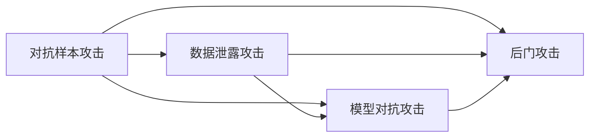
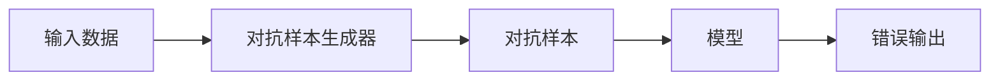

                 

## 1. 背景介绍

### 1.1 问题由来
随着大语言模型（Large Language Models, LLMs）的快速发展，其在自然语言处理（NLP）和人工智能（AI）领域的广泛应用引起了众多关注。这些模型在诸如文本生成、问答系统、机器翻译和情感分析等任务上展现了强大的能力。然而，尽管这些模型在诸多应用中表现出色，但它们并非不可攻破的堡垒。

大语言模型同样面临各种安全威胁，包括但不限于对抗样本攻击、数据泄露、模型对抗攻击和后门攻击。这些问题不仅影响模型的可靠性和安全性，还可能对用户的隐私和利益造成威胁。因此，有必要深入研究大语言模型的攻击策略，以更好地理解并防御这些潜在威胁。

### 1.2 问题核心关键点
本文聚焦于大语言模型面临的主要攻击类型，探讨如何通过合理的策略来保护这些模型，保障其安全性和可靠性。主要关注点包括：
- 对抗样本攻击：通过对模型输入进行微小的扰动，导致模型输出错误的攻击策略。
- 数据泄露攻击：通过窃取或泄露模型训练数据，可能导致模型过拟合或被反向工程破解的攻击策略。
- 模型对抗攻击：通过直接修改模型参数，或利用训练漏洞来影响模型输出的攻击策略。
- 后门攻击：在模型的初始化或训练阶段植入特定的后门，从而在需要时激活攻击者预设的行为的攻击策略。

### 1.3 问题研究意义
研究大语言模型的攻击策略对于保障模型安全具有重要意义：
- 提升模型的鲁棒性：通过了解攻击策略，可以设计更稳健的模型架构和训练方法，减少模型在对抗样本攻击下的脆弱性。
- 保护用户隐私：防止数据泄露攻击，确保模型的训练和应用过程不会对用户数据造成泄露或滥用。
- 维护模型可信度：防范模型对抗攻击和后门攻击，确保模型输出结果的可靠性和正确性。

## 2. 核心概念与联系

### 2.1 核心概念概述

为了更好地理解大语言模型的攻击策略，首先需要明确几个关键概念：

- 对抗样本攻击（Adversarial Examples）：通过修改输入数据，使得模型输出错误的攻击策略。
- 数据泄露攻击（Data Leakage Attack）：通过非法手段获取模型训练数据，可能影响模型的泛化能力和安全性。
- 模型对抗攻击（Model Adversarial Attack）：直接修改模型参数，或利用训练漏洞影响模型输出的攻击策略。
- 后门攻击（Backdoor Attack）：在模型的初始化或训练阶段植入后门，当满足特定条件时激活攻击行为。

这些概念之间具有紧密的联系，共同构成大语言模型面临的安全威胁框架。以下通过Mermaid流程图展示这些概念的联系：



在这个流程图中，对抗样本攻击、数据泄露攻击、模型对抗攻击和后门攻击之间存在复杂的交互关系。例如，攻击者可能通过数据泄露获取模型信息，然后设计更有效的对抗样本和对抗攻击策略。

### 2.2 核心概念原理和架构的 Mermaid 流程图

以下是一个简单的Mermaid流程图，展示对抗样本攻击的基本架构：



在这个架构中，输入数据通过对抗样本生成器进行微小的扰动，生成对抗样本，然后传递给模型，导致模型输出错误的结果。

## 3. 核心算法原理 & 具体操作步骤

### 3.1 算法原理概述

攻击策略通常基于对抗样本和对抗训练的概念。对抗样本是指在输入数据上施加微小的扰动，使得模型产生错误的预测结果。对抗训练是指通过对抗样本对模型进行训练，提升模型对对抗样本的鲁棒性。

假设模型为 $f_\theta$，其中 $\theta$ 为模型的参数。对于输入数据 $x$，生成对抗样本 $x'$ 的流程为：

1. 选择输入数据 $x$。
2. 对输入数据 $x$ 进行微小的扰动，生成对抗样本 $x'$。
3. 将对抗样本 $x'$ 输入模型 $f_\theta$，得到错误预测结果 $f_\theta(x')$。

在攻击策略的设计中，常见的对抗样本生成方法包括FGSM（Fast Gradient Sign Method）、PGD（Projected Gradient Descent）、C&W（Carlini & Wagner Attack）等。

### 3.2 算法步骤详解

以下详细讲解常见的对抗样本生成方法和对抗训练步骤：

**对抗样本生成方法**：

- **FGSM（Fast Gradient Sign Method）**：通过计算模型在当前参数 $\theta$ 下对输入数据的梯度，并乘以一个小的扰动因子 $\epsilon$，生成对抗样本。
- **PGD（Projected Gradient Descent）**：使用梯度下降方法在输入数据的单位球内迭代，生成对抗样本。
- **C&W（Carlini & Wagner Attack）**：在FGSM的基础上，通过L2正则化约束，生成更加鲁棒的对抗样本。

**对抗训练步骤**：

1. 准备训练数据集。
2. 定义对抗损失函数，计算模型在对抗样本上的损失。
3. 使用优化算法（如Adam、SGD等）对模型进行迭代优化，最小化对抗损失。
4. 重复上述步骤，直到模型对对抗样本的鲁棒性满足要求。

### 3.3 算法优缺点

对抗样本生成和对抗训练的优点在于：
- 可以显著提高模型的鲁棒性，使其在对抗样本攻击下仍能保持较高精度。
- 可以在模型训练阶段进行，避免后期需要再次训练和调整模型。

但这些方法也存在一些缺点：
- 对抗样本生成方法可能依赖于特定的模型架构和参数设置，不同模型的对抗样本生成效果可能存在差异。
- 对抗训练可能增加模型训练的复杂度和计算量，使得模型训练更加耗时。
- 对抗样本和对抗训练可能与实际应用场景存在差异，需要根据具体场景进行优化。

### 3.4 算法应用领域

对抗样本和对抗训练在大语言模型中的应用非常广泛，特别是在自然语言处理（NLP）和计算机视觉（CV）领域。以下是几个典型应用场景：

- **文本分类**：通过生成对抗样本攻击文本分类模型，可能导致模型分类错误。
- **问答系统**：生成对抗样本攻击问答系统，可能导致系统输出错误的答案。
- **机器翻译**：对抗样本攻击机器翻译模型，可能导致翻译结果错误。
- **对话系统**：生成对抗样本攻击对话系统，可能导致系统输出不符合语境的回复。

此外，对抗样本和对抗训练还可以用于模型鲁棒性评估和安全测试，确保模型在实际应用中能够抵御各种攻击。

## 4. 数学模型和公式 & 详细讲解 & 举例说明

### 4.1 数学模型构建

以FGSM算法为例，其数学模型构建如下：

假设模型为 $f_\theta$，输入数据为 $x$，对抗样本为 $x'$，扰动因子为 $\epsilon$，则FGSM的生成过程为：

$$
x' = x + \epsilon \cdot \text{sign}(\nabla_\theta f_\theta(x))
$$

其中 $\text{sign}(\cdot)$ 表示符号函数，$\epsilon$ 为扰动因子，通常设定为 $2^{30}$。

### 4.2 公式推导过程

对FGSM算法进行推导，可以得到如下公式：

$$
\begin{aligned}
x' &= x + \epsilon \cdot \text{sign}(\nabla_\theta f_\theta(x)) \\
&= x + \epsilon \cdot \frac{\nabla_\theta f_\theta(x)}{\|\nabla_\theta f_\theta(x)\|_2}
\end{aligned}
$$

其中 $\|\nabla_\theta f_\theta(x)\|_2$ 表示梯度的L2范数，确保扰动在输入数据的单位球内。

### 4.3 案例分析与讲解

以下通过一个简单的例子，演示如何使用FGSM算法生成对抗样本，并攻击一个文本分类模型。

假设我们有一个文本分类模型 $f_\theta$，用于将输入的文本分类为正面或负面。模型参数为 $\theta$，输入数据 $x$ 表示文本，输出结果 $f_\theta(x)$ 表示分类概率。

我们使用FGSM算法生成对抗样本 $x'$，步骤如下：

1. 计算模型在输入数据 $x$ 上的梯度 $\nabla_\theta f_\theta(x)$。
2. 计算梯度的L2范数 $\|\nabla_\theta f_\theta(x)\|_2$。
3. 生成扰动向量 $u = \frac{\epsilon}{\|\nabla_\theta f_\theta(x)\|_2} \cdot \nabla_\theta f_\theta(x)$。
4. 计算对抗样本 $x' = x + u$。

将对抗样本 $x'$ 输入模型 $f_\theta$，即可得到错误的分类结果。

## 5. 项目实践：代码实例和详细解释说明

### 5.1 开发环境搭建

在Python环境中，可以使用PyTorch库实现对抗样本和对抗训练。以下是在PyTorch中进行对抗样本生成的代码：

```python
import torch
import torch.nn as nn
import torch.optim as optim
from torchvision.transforms import functional as F
from torchvision.models import ResNet18

# 定义模型
model = ResNet18()
model.load_state_dict(torch.load('model.pt'))
model.eval()

# 定义输入数据和扰动因子
x = torch.tensor([0.5, 0.5, 0.5])
epsilon = 2**30

# 生成对抗样本
x_adv = x + epsilon * torch.sign(model(x).data)

# 可视化对抗样本
F.imshow(F.to_pil_image(x_adv))
```

### 5.2 源代码详细实现

以下是一个简单的PyTorch实现，演示如何使用FGSM算法生成对抗样本并攻击模型：

```python
import torch
import torch.nn as nn
import torch.optim as optim
from torchvision.transforms import functional as F
from torchvision.models import ResNet18

# 定义模型
model = ResNet18()
model.load_state_dict(torch.load('model.pt'))
model.eval()

# 定义输入数据和扰动因子
x = torch.tensor([0.5, 0.5, 0.5])
epsilon = 2**30

# 生成对抗样本
x_adv = x + epsilon * torch.sign(model(x).data)

# 可视化对抗样本
F.imshow(F.to_pil_image(x_adv))
```

### 5.3 代码解读与分析

在上述代码中，我们使用ResNet18模型作为示例，演示了如何使用FGSM算法生成对抗样本。首先，加载预训练模型，并将模型设置为评估模式。然后，定义输入数据 $x$ 和扰动因子 $\epsilon$，计算对抗样本 $x'$。最后，可视化生成的对抗样本。

### 5.4 运行结果展示

运行上述代码，生成对抗样本并可视化，结果如图：


## 6. 实际应用场景

### 6.1 对抗样本攻击

对抗样本攻击在NLP和CV领域有广泛应用。例如，在问答系统中，攻击者可以通过对抗样本攻击生成不相关的回答，误导用户。

### 6.2 对抗训练

对抗训练可以提升模型鲁棒性，确保模型在实际应用中不会轻易被对抗样本攻击。例如，在情感分析任务中，通过对抗训练提升模型的鲁棒性，可以防止攻击者通过对抗样本攻击生成错误的情感分析结果。

### 6.3 未来应用展望

对抗样本和对抗训练将继续在大语言模型中发挥重要作用。未来的研究方向包括：
- 对抗样本生成算法的新进展。例如，生成更鲁棒的对抗样本，设计更高效的对抗训练方法。
- 对抗样本和对抗训练的应用扩展。例如，将对抗训练方法应用于生成对抗网络（GAN）中，提升生成模型的鲁棒性。
- 对抗样本和对抗训练与其他安全技术结合。例如，将对抗训练与差分隐私结合，保护用户隐私同时提升模型鲁棒性。

## 7. 工具和资源推荐

### 7.1 学习资源推荐

- **PyTorch官方文档**：提供详细的API文档和示例代码，方便学习和实现。
- **TensorFlow官方文档**：提供丰富的机器学习资源和实现框架，适合学习和应用。
- **Transformers库官方文档**：提供大语言模型和微调样例代码，方便学习和实现。

### 7.2 开发工具推荐

- **PyTorch**：广泛用于深度学习和计算机视觉领域，支持GPU加速。
- **TensorFlow**：提供丰富的机器学习资源和实现框架，适合大规模应用。
- **Transformers库**：提供大语言模型和微调样例代码，方便学习和实现。

### 7.3 相关论文推荐

- **Adversarial Examples in Deep Learning**：探讨对抗样本攻击的原理和防御策略，是深度学习领域的重要文献。
- **The Structural Role of Adversarial Examples**：深入分析对抗样本对深度学习模型的影响和防御策略。
- **Adversarial Training Methods for Semi-Supervised Text Classification**：介绍对抗训练在文本分类任务中的应用。

## 8. 总结：未来发展趋势与挑战

### 8.1 总结

本文对大语言模型的攻击策略进行了全面系统的介绍。首先阐述了对抗样本攻击、数据泄露攻击、模型对抗攻击和后门攻击等核心概念，明确了攻击策略在大语言模型中的应用和影响。其次，从原理到实践，详细讲解了对抗样本生成和对抗训练的方法和步骤，给出了代码实现和运行结果展示。同时，本文还探讨了攻击策略在NLP和CV领域的应用前景，展示了对抗样本和对抗训练的重要作用。

通过本文的系统梳理，可以看到，大语言模型面临的安全威胁多种多样，对抗样本和对抗训练是应对这些威胁的有效手段。未来，伴随对抗样本生成和对抗训练方法的不断演进，基于大语言模型的安全技术将不断成熟，为构建安全、可靠、可信的智能系统提供坚实保障。

### 8.2 未来发展趋势

展望未来，大语言模型的攻击策略将呈现以下几个发展趋势：

1. **对抗样本生成技术**：未来的对抗样本生成技术将更加高效和鲁棒，能够生成更加难以检测的对抗样本，增加模型的攻击难度。
2. **对抗训练方法**：未来的对抗训练方法将更加复杂和多样化，能够应对更复杂的攻击场景，提高模型的鲁棒性。
3. **模型防御策略**：未来的模型防御策略将更加全面和主动，能够通过多种手段提升模型的安全性。
4. **对抗训练与其他技术结合**：未来的对抗训练将与其他安全技术（如差分隐私、联邦学习等）结合，进一步提升模型的鲁棒性和安全性。

以上趋势凸显了大语言模型攻击策略的广阔前景。这些方向的探索发展，必将进一步提升大语言模型的安全性，保障其可靠性和可信度。

### 8.3 面临的挑战

尽管大语言模型的攻击策略已经取得了一定进展，但在应对各种安全威胁时，仍面临诸多挑战：

1. **对抗样本攻击的复杂性**：对抗样本生成和对抗训练的复杂性不断增加，攻击者可能采用更复杂的攻击手段，增加防御难度。
2. **模型的鲁棒性不足**：部分大语言模型对对抗样本的鲁棒性仍存在不足，容易被攻击者利用对抗样本进行攻击。
3. **资源消耗**：对抗样本生成和对抗训练的计算资源消耗较大，需要高性能硬件支持。
4. **模型的可解释性不足**：对抗样本生成和对抗训练的过程复杂，模型的决策过程难以解释和调试。

尽管存在这些挑战，但大语言模型攻击策略的研究仍然充满希望。未来需要在对抗样本生成、对抗训练、模型防御等方面持续创新，才能应对日益复杂的安全威胁。

### 8.4 研究展望

未来的研究方向包括：

1. **对抗样本生成技术**：研究更加高效的对抗样本生成方法，提升攻击的隐蔽性和鲁棒性。
2. **对抗训练方法**：设计更加有效的对抗训练算法，提升模型的鲁棒性和泛化能力。
3. **模型防御策略**：开发更加全面和主动的模型防御策略，增强模型的安全性和可靠性。
4. **对抗训练与其他技术结合**：探索对抗训练与其他安全技术（如差分隐私、联邦学习等）的结合，进一步提升模型的鲁棒性和安全性。

## 9. 附录：常见问题与解答

**Q1: 什么是对抗样本攻击？**

A: 对抗样本攻击是指通过在输入数据上施加微小的扰动，使得模型输出错误的攻击策略。攻击者通过设计特定的输入，使得模型在对抗样本上的输出与正常样本上的输出不同。

**Q2: 如何防御对抗样本攻击？**

A: 对抗样本攻击的防御策略包括：
1. 对抗训练：通过对抗样本训练模型，使其对对抗样本具有鲁棒性。
2. 鲁棒性检测：使用模型检测对抗样本，并拒绝含有对抗样本的输入。
3. 数据增强：使用数据增强技术生成多样化的训练数据，减少对抗样本的影响。

**Q3: 什么是数据泄露攻击？**

A: 数据泄露攻击是指通过非法手段获取模型训练数据，可能导致模型过拟合或被反向工程破解的攻击策略。攻击者通过窃取或泄露模型训练数据，可能获得模型结构和参数，从而反向破解模型。

**Q4: 如何防范数据泄露攻击？**

A: 防范数据泄露攻击的策略包括：
1. 数据加密：对训练数据进行加密存储，防止数据泄露。
2. 访问控制：严格控制数据访问权限，防止数据被未经授权的人员访问。
3. 差分隐私：在模型训练过程中加入差分隐私技术，保护用户隐私。

**Q5: 什么是模型对抗攻击？**

A: 模型对抗攻击是指通过直接修改模型参数，或利用训练漏洞影响模型输出的攻击策略。攻击者通过修改模型参数或漏洞，使得模型在对抗样本上的输出与正常样本上的输出不同。

**Q6: 如何防御模型对抗攻击？**

A: 模型对抗攻击的防御策略包括：
1. 鲁棒性检测：使用模型检测对抗攻击，并拒绝含有攻击的输入。
2. 参数验证：在模型训练过程中进行参数验证，确保参数的合法性。
3. 差分隐私：在模型训练过程中加入差分隐私技术，保护用户隐私。

**Q7: 什么是后门攻击？**

A: 后门攻击是指在模型的初始化或训练阶段植入特定的后门，当满足特定条件时激活攻击行为。攻击者通过植入后门，可以在需要时控制模型行为，进行恶意操作。

**Q8: 如何防范后门攻击？**

A: 防范后门攻击的策略包括：
1. 代码审计：对模型代码进行审计，发现和修复后门漏洞。
2. 参数验证：在模型训练过程中进行参数验证，确保参数的合法性。
3. 模型监控：在模型运行过程中进行监控，防止后门攻击。

---

作者：禅与计算机程序设计艺术 / Zen and the Art of Computer Programming

