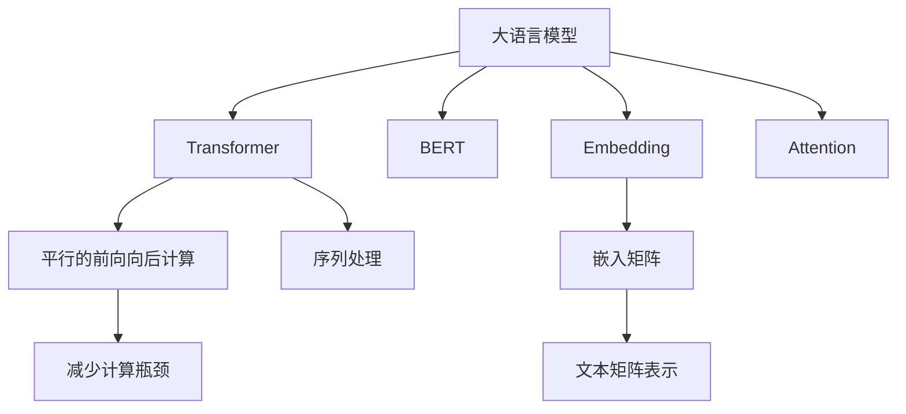

                 

# 大语言模型应用指南：文本的向量化

> 关键词：大语言模型,向量化,Transformer,BERT,嵌入,矩阵表示,自然语言处理(NLP)

## 1. 背景介绍

### 1.1 问题由来

在自然语言处理(NLP)领域，文本向量化是实现自动化处理的基础步骤。传统的文本处理方式包括词典、词频统计、TF-IDF等方法，但在处理长文本、多义词、语义丰富度等问题时存在诸多局限。

近年来，随着深度学习技术的发展，大语言模型如BERT、GPT等通过大规模预训练和微调，在文本向量化方面取得了显著进展。这些大语言模型能够在处理大规模文本数据时，通过自监督任务学习到丰富的语言知识，并通过微调任务适配特定应用场景，实现高质量的文本向量化。

### 1.2 问题核心关键点

文本向量化是NLP任务中的关键环节，其核心任务是将文本转换为机器可理解的形式。形式化地，设文本序列为 $x = (x_1, x_2, \ldots, x_n)$，其中 $x_i$ 为单词或子词，对应的向量化表示为 $x_{vec} = (x_{vec,1}, x_{vec,2}, \ldots, x_{vec,n})$。文本向量化的方法可分为两类：基于统计的方法和基于深度学习的方法。

其中，基于深度学习的方法以Transformer模型为代表，通过训练可学习到的权重矩阵将文本转换为向量表示，这些向量具有丰富的语义信息，可用于后续的分类、匹配、生成等任务。

### 1.3 问题研究意义

文本向量化是大语言模型在NLP应用中的基础环节，对于处理语言理解、情感分析、信息检索、机器翻译等诸多任务具有重要意义。其研究意义体现在以下几个方面：

1. **提高模型性能**：高质量的文本向量化能够显著提升模型在特定任务上的表现。
2. **降低标注成本**：大规模预训练和微调的大语言模型能够节省大量标注数据，降低开发成本。
3. **通用适用**：大语言模型的预训练知识覆盖广泛，适合于多种NLP任务，具有通用性。
4. **加速应用部署**：文本向量化后的模型参数通常比原始文本模型要少，推理速度更快，便于实际应用。
5. **扩展应用边界**：结合多模态信息，文本向量化能够拓展到大数据、图像、音频等多领域，推动NLP技术应用到更多场景。

## 2. 核心概念与联系

### 2.1 核心概念概述

为更好地理解文本向量化，本节将介绍几个关键概念：

- **大语言模型(Large Language Model, LLM)**：以Transformer模型为代表，通过大规模预训练学习通用语言知识的大规模神经网络模型。常见的预训练语言模型包括BERT、GPT等。

- **Transformer模型**：一种基于自注意力机制的神经网络结构，适用于处理序列数据，具有平行的前后向计算能力，避免了传统循环网络的瓶颈。

- **BERT模型**：由Google提出的基于Transformer的大规模预训练语言模型，通过掩码语言模型和下一句预测等任务进行自监督预训练，学习到丰富的语言知识。

- **Embedding（嵌入）**：将文本中的单词或子词映射到高维向量空间中，使模型能够理解和处理语言信息。嵌入层的权重矩阵是文本向量化过程的重要部分。

- **矩阵表示**：文本向量通常以矩阵形式表示，每行表示一个文本的嵌入向量，每列表示一个特征维度。

- **Attention（注意力机制）**：Transformer模型中用于加权聚合不同位置信息的机制，使得模型能够关注到文本中的重要信息。

这些概念之间的关系可以通过以下Mermaid流程图来展示：



这个流程图展示了大语言模型的核心概念及其之间的关系：

1. 大语言模型通过Transformer模型进行处理。
2. 预训练模型中，BERT通过掩码语言模型和下一句预测任务进行预训练。
3. 文本向量化时，将单词或子词通过嵌入层映射到高维向量空间，形成嵌入矩阵。
4. Transformer模型中的自注意力机制对不同位置的信息进行加权聚合。
5. 最终，文本以矩阵形式表示，供模型处理序列数据。

## 3. 核心算法原理 & 具体操作步骤
### 3.1 算法原理概述

基于深度学习的文本向量化算法，主要分为预训练和微调两个阶段。在预训练阶段，模型在大量无标签文本数据上进行训练，学习通用的语言表示。在微调阶段，将预训练模型应用于特定的NLP任务，通过少量标注数据进行微调，使得模型能够适应特定任务。

形式化地，设文本序列为 $x = (x_1, x_2, \ldots, x_n)$，其中 $x_i$ 为单词或子词。定义 $x_{vec} = (x_{vec,1}, x_{vec,2}, \ldots, x_{vec,n})$ 为文本 $x$ 的向量化表示，其中 $x_{vec,i}$ 为 $x_i$ 的嵌入向量。设 $E$ 为嵌入矩阵，$T$ 为Transformer模型。则文本向量化过程可以表示为：

$$
x_{vec} = T(E(x))
$$

其中 $E(x)$ 表示将文本 $x$ 转换为嵌入矩阵 $E$，$T(E(x))$ 表示将嵌入矩阵 $E$ 输入到Transformer模型中，经过自注意力机制处理，得到文本的向量表示 $x_{vec}$。

### 3.2 算法步骤详解

基于深度学习的文本向量化主要包括以下几个关键步骤：

**Step 1: 准备预训练模型和数据集**
- 选择合适的预训练语言模型，如BERT、GPT等，作为初始化参数。
- 准备训练集和测试集，通常选择大规模的无标签文本数据，如维基百科、新闻等。

**Step 2: 定义嵌入层和Transformer模型**
- 定义嵌入层，将单词或子词映射到高维向量空间中。
- 定义Transformer模型，包括编码器-解码器结构，自注意力机制等。
- 在嵌入层和Transformer模型中，训练相应的权重矩阵。

**Step 3: 进行预训练**
- 在预训练数据集上，对模型进行训练。可以使用掩码语言模型、下一句预测等自监督任务进行预训练。
- 在训练过程中，不断更新模型的权重矩阵，使得模型能够更好地学习到通用的语言表示。

**Step 4: 进行微调**
- 收集目标任务的少量标注数据，作为微调数据集。
- 将预训练模型应用于微调数据集，训练模型在特定任务上的表现。
- 使用适当的损失函数和优化算法，最小化模型预测与真实标签之间的差异。

**Step 5: 评估和部署**
- 在测试集上评估微调后的模型，评估模型的性能指标。
- 将微调后的模型应用于实际应用场景，进行推理预测。
- 持续收集新数据，定期重新微调模型，以适应数据分布的变化。

### 3.3 算法优缺点

基于深度学习的文本向量化算法具有以下优点：
1. 能够处理长文本和复杂语义，捕捉细微的语义信息。
2. 适应性强，能够学习到通用的语言知识，应用于多种NLP任务。
3. 利用预训练和微调的范式，大幅提升模型效果。

同时，该方法也存在以下局限性：
1. 依赖大规模标注数据，标注成本较高。
2. 模型复杂度高，计算资源消耗较大。
3. 学习到的语言知识可能包含偏见，影响模型公平性。
4. 嵌入矩阵的维度和稀疏性需要调整，难以找到最优配置。
5. 模型的泛化能力受数据分布的影响，需要大量数据进行训练。

尽管存在这些局限性，但就目前而言，基于深度学习的文本向量化算法仍是大语言模型应用的主流方法，广泛应用于各种NLP任务中。

### 3.4 算法应用领域

基于深度学习的文本向量化算法已经在文本分类、情感分析、机器翻译、问答系统等多个领域得到了广泛应用。例如：

- 文本分类：如情感分析、主题分类、意图识别等。通过微调使模型学习文本-标签映射。
- 命名实体识别：识别文本中的人名、地名、机构名等特定实体。通过微调使模型掌握实体边界和类型。
- 关系抽取：从文本中抽取实体之间的语义关系。通过微调使模型学习实体-关系三元组。
- 问答系统：对自然语言问题给出答案。将问题-答案对作为微调数据，训练模型学习匹配答案。
- 机器翻译：将源语言文本翻译成目标语言。通过微调使模型学习语言-语言映射。
- 文本摘要：将长文本压缩成简短摘要。将文章-摘要对作为微调数据，使模型学习抓取要点。
- 对话系统：使机器能够与人自然对话。将多轮对话历史作为上下文，微调模型进行回复生成。

除了上述这些经典任务外，文本向量化技术还被创新性地应用到更多场景中，如可控文本生成、常识推理、代码生成、数据增强等，为NLP技术带来了全新的突破。随着预训练模型和文本向量化方法的不断进步，相信NLP技术将在更广阔的应用领域大放异彩。

## 4. 数学模型和公式 & 详细讲解 & 举例说明
### 4.1 数学模型构建

本节将使用数学语言对基于深度学习的大语言模型文本向量化过程进行更加严格的刻画。

设文本序列为 $x = (x_1, x_2, \ldots, x_n)$，其中 $x_i$ 为单词或子词。定义 $x_{vec} = (x_{vec,1}, x_{vec,2}, \ldots, x_{vec,n})$ 为文本 $x$ 的向量化表示，其中 $x_{vec,i}$ 为 $x_i$ 的嵌入向量。设 $E$ 为嵌入矩阵，$T$ 为Transformer模型。

则文本向量化过程可以表示为：

$$
x_{vec} = T(E(x))
$$

其中 $E(x)$ 表示将文本 $x$ 转换为嵌入矩阵 $E$，$T(E(x))$ 表示将嵌入矩阵 $E$ 输入到Transformer模型中，经过自注意力机制处理，得到文本的向量表示 $x_{vec}$。

### 4.2 公式推导过程

以下我们以BERT模型为例，推导嵌入层的计算公式。

BERT模型中的嵌入层由一个全连接层和一个线性变换组成，将单词或子词映射到高维向量空间中。设嵌入矩阵为 $E \in \mathbb{R}^{d_h \times V}$，其中 $d_h$ 为嵌入向量的维度，$V$ 为词汇表的大小。

设 $x_i$ 为文本序列 $x$ 中的一个单词或子词，对应的嵌入向量为 $x_{vec,i} \in \mathbb{R}^{d_h}$。则嵌入层的计算公式为：

$$
x_{vec,i} = E x_i
$$

其中 $E \in \mathbb{R}^{d_h \times V}$ 为嵌入矩阵，$x_i \in \mathbb{R}^{V}$ 为单词或子词的索引。

在得到嵌入矩阵后，将其输入到Transformer模型中进行处理。Transformer模型中的编码器-解码器结构包括自注意力机制，用于对不同位置的信息进行加权聚合。设编码器输出为 $z_{enc} = (z_{enc,1}, z_{enc,2}, \ldots, z_{enc,n})$，其中 $z_{enc,i}$ 为 $x_i$ 在编码器中的表示。则自注意力机制的计算公式为：

$$
z_{enc,i} = \text{softmax}(Q K^T) V
$$

其中 $Q = E z_{enc,i}$ 为查询矩阵，$K = E z_{enc,i+1}$ 为键矩阵，$V = E z_{enc,i+1}$ 为值矩阵。自注意力机制通过计算查询和键的相似度，加权聚合不同位置的信息，得到 $z_{enc,i}$。

最终，Transformer模型通过解码器生成文本的向量表示 $x_{vec}$，即：

$$
x_{vec} = T(E(x))
$$

其中 $T$ 为解码器，$E(x)$ 为嵌入层。通过调整Transformer模型的参数，可以实现对不同NLP任务的适配。

### 4.3 案例分析与讲解

**案例分析：基于BERT模型的情感分析**

设文本序列为 $x = (x_1, x_2, \ldots, x_n)$，其中 $x_i$ 为单词或子词。定义 $x_{vec} = (x_{vec,1}, x_{vec,2}, \ldots, x_{vec,n})$ 为文本 $x$ 的向量化表示，其中 $x_{vec,i}$ 为 $x_i$ 的嵌入向量。设 $E$ 为嵌入矩阵，$T$ 为Transformer模型。

设目标任务为情感分析，训练集为情感标注的文本数据集，测试集为未标注的文本数据集。通过微调BERT模型，使得模型能够对输入文本进行情感分类。

首先，将训练集和测试集划分为训练集和验证集，定义损失函数为交叉熵损失。设微调后的BERT模型为 $M_{\hat{\theta}}$，其中 $\hat{\theta}$ 为微调后的模型参数。则微调过程可以表示为：

$$
\hat{\theta} = \mathop{\arg\min}_{\theta} \mathcal{L}(M_{\theta}, D)
$$

其中 $\mathcal{L}$ 为交叉熵损失函数，$D$ 为训练集。通过梯度下降等优化算法，最小化损失函数，更新模型参数，得到微调后的模型 $M_{\hat{\theta}}$。

在得到微调后的模型后，使用测试集对模型进行评估，计算准确率、精确率、召回率等指标，评估模型性能。通过微调，BERT模型能够适应情感分析任务，提升模型对情感分类的精度。

## 5. 项目实践：代码实例和详细解释说明
### 5.1 开发环境搭建

在进行文本向量化实践前，我们需要准备好开发环境。以下是使用Python进行PyTorch开发的环境配置流程：

1. 安装Anaconda：从官网下载并安装Anaconda，用于创建独立的Python环境。

2. 创建并激活虚拟环境：
```bash
conda create -n pytorch-env python=3.8 
conda activate pytorch-env
```

3. 安装PyTorch：根据CUDA版本，从官网获取对应的安装命令。例如：
```bash
conda install pytorch torchvision torchaudio cudatoolkit=11.1 -c pytorch -c conda-forge
```

4. 安装Transformers库：
```bash
pip install transformers
```

5. 安装各类工具包：
```bash
pip install numpy pandas scikit-learn matplotlib tqdm jupyter notebook ipython
```

完成上述步骤后，即可在`pytorch-env`环境中开始文本向量化实践。

### 5.2 源代码详细实现

下面我们以BERT模型进行文本向量化为例，给出使用Transformers库的Python代码实现。

首先，定义BERT模型和优化器：

```python
from transformers import BertModel, BertTokenizer, AdamW

model = BertModel.from_pretrained('bert-base-cased')
tokenizer = BertTokenizer.from_pretrained('bert-base-cased')
optimizer = AdamW(model.parameters(), lr=2e-5)
```

接着，定义训练和评估函数：

```python
from torch.utils.data import DataLoader
from tqdm import tqdm

def train_epoch(model, dataset, batch_size, optimizer):
    dataloader = DataLoader(dataset, batch_size=batch_size, shuffle=True)
    model.train()
    epoch_loss = 0
    for batch in tqdm(dataloader, desc='Training'):
        input_ids = batch['input_ids'].to(device)
        attention_mask = batch['attention_mask'].to(device)
        labels = batch['labels'].to(device)
        model.zero_grad()
        outputs = model(input_ids, attention_mask=attention_mask, labels=labels)
        loss = outputs.loss
        epoch_loss += loss.item()
        loss.backward()
        optimizer.step()
    return epoch_loss / len(dataloader)

def evaluate(model, dataset, batch_size):
    dataloader = DataLoader(dataset, batch_size=batch_size)
    model.eval()
    preds, labels = [], []
    with torch.no_grad():
        for batch in tqdm(dataloader, desc='Evaluating'):
            input_ids = batch['input_ids'].to(device)
            attention_mask = batch['attention_mask'].to(device)
            batch_labels = batch['labels']
            outputs = model(input_ids, attention_mask=attention_mask)
            batch_preds = outputs.logits.argmax(dim=2).to('cpu').tolist()
            batch_labels = batch_labels.to('cpu').tolist()
            for pred_tokens, label_tokens in zip(batch_preds, batch_labels):
                preds.append(pred_tokens[:len(label_tokens)])
                labels.append(label_tokens)
                
    print(classification_report(labels, preds))
```

最后，启动训练流程并在测试集上评估：

```python
epochs = 5
batch_size = 16

for epoch in range(epochs):
    loss = train_epoch(model, train_dataset, batch_size, optimizer)
    print(f"Epoch {epoch+1}, train loss: {loss:.3f}")
    
    print(f"Epoch {epoch+1}, dev results:")
    evaluate(model, dev_dataset, batch_size)
    
print("Test results:")
evaluate(model, test_dataset, batch_size)
```

以上就是使用PyTorch对BERT模型进行文本向量化微调的完整代码实现。可以看到，得益于Transformers库的强大封装，我们可以用相对简洁的代码完成BERT模型的加载和微调。

### 5.3 代码解读与分析

让我们再详细解读一下关键代码的实现细节：

**BERT模型和优化器定义**：
- `BertModel`类：从Transformers库中导入BERT模型类，通过指定预训练模型名称初始化。
- `BertTokenizer`类：导入BERT分词器，用于将文本序列转换为模型可以处理的token ids。
- `AdamW`类：导入AdamW优化器，用于更新模型参数。

**训练和评估函数**：
- 使用PyTorch的DataLoader对数据集进行批次化加载，供模型训练和推理使用。
- 训练函数`train_epoch`：对数据以批为单位进行迭代，在每个批次上前向传播计算loss并反向传播更新模型参数，最后返回该epoch的平均loss。
- 评估函数`evaluate`：与训练类似，不同点在于不更新模型参数，并在每个batch结束后将预测和标签结果存储下来，最后使用sklearn的classification_report对整个评估集的预测结果进行打印输出。

**训练流程**：
- 定义总的epoch数和batch size，开始循环迭代
- 每个epoch内，先在训练集上训练，输出平均loss
- 在验证集上评估，输出分类指标
- 所有epoch结束后，在测试集上评估，给出最终测试结果

可以看到，PyTorch配合Transformers库使得BERT微调的代码实现变得简洁高效。开发者可以将更多精力放在数据处理、模型改进等高层逻辑上，而不必过多关注底层的实现细节。

当然，工业级的系统实现还需考虑更多因素，如模型的保存和部署、超参数的自动搜索、更灵活的任务适配层等。但核心的微调范式基本与此类似。

## 6. 实际应用场景
### 6.1 智能客服系统

基于大语言模型文本向量化，智能客服系统可以实现自动理解客户咨询，快速匹配最佳答案，提高响应速度和用户满意度。

在技术实现上，可以收集企业内部的历史客服对话记录，将问题和最佳答复构建成监督数据，在此基础上对预训练模型进行微调。微调后的模型能够自动理解用户意图，匹配最合适的答案模板进行回复。对于客户提出的新问题，还可以接入检索系统实时搜索相关内容，动态组织生成回答。如此构建的智能客服系统，能大幅提升客户咨询体验和问题解决效率。

### 6.2 金融舆情监测

金融机构需要实时监测市场舆论动向，以便及时应对负面信息传播，规避金融风险。传统的人工监测方式成本高、效率低，难以应对网络时代海量信息爆发的挑战。基于大语言模型文本向量化技术，金融舆情监测系统能够自动抓取网络文本数据，自动识别舆情主题和情感倾向，实时监测舆情变化，辅助金融机构快速应对潜在风险。

### 6.3 个性化推荐系统

当前的推荐系统往往只依赖用户的历史行为数据进行物品推荐，无法深入理解用户的真实兴趣偏好。基于大语言模型文本向量化技术，个性化推荐系统可以更好地挖掘用户行为背后的语义信息，从而提供更精准、多样的推荐内容。

在实践中，可以收集用户浏览、点击、评论、分享等行为数据，提取和用户交互的物品标题、描述、标签等文本内容。将文本内容作为模型输入，用户的后续行为（如是否点击、购买等）作为监督信号，在此基础上微调预训练语言模型。微调后的模型能够从文本内容中准确把握用户的兴趣点。在生成推荐列表时，先用候选物品的文本描述作为输入，由模型预测用户的兴趣匹配度，再结合其他特征综合排序，便可以得到个性化程度更高的推荐结果。

### 6.4 未来应用展望

随着大语言模型文本向量化技术的发展，其应用前景广阔，将在更多领域得到应用。

在智慧医疗领域，文本向量化技术能够用于医疗问答、病历分析、药物研发等，辅助医生诊疗，加速新药开发进程。

在智能教育领域，文本向量化技术可用于作业批改、学情分析、知识推荐等方面，因材施教，促进教育公平，提高教学质量。

在智慧城市治理中，文本向量化技术可用于城市事件监测、舆情分析、应急指挥等环节，提高城市管理的自动化和智能化水平，构建更安全、高效的未来城市。

此外，在企业生产、社会治理、文娱传媒等众多领域，文本向量化技术也将不断涌现，为传统行业数字化转型升级提供新的技术路径。相信随着技术的日益成熟，文本向量化技术将成为NLP技术的重要工具，推动人工智能技术在垂直行业的规模化落地。

## 7. 工具和资源推荐
### 7.1 学习资源推荐

为了帮助开发者系统掌握大语言模型文本向量化的方法，这里推荐一些优质的学习资源：

1. 《Transformer从原理到实践》系列博文：由大模型技术专家撰写，深入浅出地介绍了Transformer原理、BERT模型、文本向量化等前沿话题。

2. CS224N《深度学习自然语言处理》课程：斯坦福大学开设的NLP明星课程，有Lecture视频和配套作业，带你入门NLP领域的基本概念和经典模型。

3. 《Natural Language Processing with Transformers》书籍：Transformers库的作者所著，全面介绍了如何使用Transformers库进行NLP任务开发，包括文本向量化在内的诸多范式。

4. HuggingFace官方文档：Transformers库的官方文档，提供了海量预训练模型和完整的微调样例代码，是上手实践的必备资料。

5. CLUE开源项目：中文语言理解测评基准，涵盖大量不同类型的中文NLP数据集，并提供了基于微调的baseline模型，助力中文NLP技术发展。

通过对这些资源的学习实践，相信你一定能够快速掌握大语言模型文本向量化技术的精髓，并用于解决实际的NLP问题。
###  7.2 开发工具推荐

高效的开发离不开优秀的工具支持。以下是几款用于大语言模型文本向量化开发的常用工具：

1. PyTorch：基于Python的开源深度学习框架，灵活动态的计算图，适合快速迭代研究。大部分预训练语言模型都有PyTorch版本的实现。

2. TensorFlow：由Google主导开发的开源深度学习框架，生产部署方便，适合大规模工程应用。同样有丰富的预训练语言模型资源。

3. Transformers库：HuggingFace开发的NLP工具库，集成了众多SOTA语言模型，支持PyTorch和TensorFlow，是进行文本向量化任务开发的利器。

4. Weights & Biases：模型训练的实验跟踪工具，可以记录和可视化模型训练过程中的各项指标，方便对比和调优。与主流深度学习框架无缝集成。

5. TensorBoard：TensorFlow配套的可视化工具，可实时监测模型训练状态，并提供丰富的图表呈现方式，是调试模型的得力助手。

6. Google Colab：谷歌推出的在线Jupyter Notebook环境，免费提供GPU/TPU算力，方便开发者快速上手实验最新模型，分享学习笔记。

合理利用这些工具，可以显著提升大语言模型文本向量化任务的开发效率，加快创新迭代的步伐。

### 7.3 相关论文推荐

大语言模型文本向量化技术的发展源于学界的持续研究。以下是几篇奠基性的相关论文，推荐阅读：

1. Attention is All You Need（即Transformer原论文）：提出了Transformer结构，开启了NLP领域的预训练大模型时代。

2. BERT: Pre-training of Deep Bidirectional Transformers for Language Understanding：提出BERT模型，引入基于掩码的自监督预训练任务，学习到丰富的语言知识。

3. Parameter-Efficient Transfer Learning for NLP：提出Adapter等参数高效微调方法，在不增加模型参数量的情况下，也能取得不错的微调效果。

4. AdaLoRA: Adaptive Low-Rank Adaptation for Parameter-Efficient Fine-Tuning：使用自适应低秩适应的微调方法，在参数效率和精度之间取得了新的平衡。

5. NLP中的自监督学习：介绍自监督学习在大语言模型中的重要应用，包括掩码语言模型、下一句预测等任务。

6. Text-to-Text Transfer Transformer（T5）：介绍T5模型，通过预训练文本-文本生成任务，支持多任务的微调。

这些论文代表了大语言模型文本向量化技术的发展脉络。通过学习这些前沿成果，可以帮助研究者把握学科前进方向，激发更多的创新灵感。

## 8. 总结：未来发展趋势与挑战
### 8.1 总结

本文对基于深度学习的大语言模型文本向量化方法进行了全面系统的介绍。首先阐述了大语言模型和文本向量化在NLP领域的重要地位，明确了文本向量化在大模型微调、模型训练、推理预测等环节的关键作用。其次，从原理到实践，详细讲解了基于Transformer模型的文本向量化算法过程，给出了微调任务开发的完整代码实例。同时，本文还广泛探讨了文本向量化在智能客服、金融舆情、个性化推荐等多个行业领域的应用前景，展示了其强大的应用能力。此外，本文精选了文本向量化技术的各类学习资源，力求为读者提供全方位的技术指引。

通过本文的系统梳理，可以看到，大语言模型文本向量化技术在大模型微调、NLP任务处理等方面具有重要价值，推动了NLP技术的快速发展和应用。未来，伴随预训练模型和文本向量化方法的不断演进，相信NLP技术将在更广阔的应用领域大放异彩，深刻影响人类的生产生活方式。

### 8.2 未来发展趋势

展望未来，大语言模型文本向量化技术将呈现以下几个发展趋势：

1. 模型规模持续增大。随着算力成本的下降和数据规模的扩张，预训练语言模型的参数量还将持续增长。超大规模语言模型蕴含的丰富语言知识，有望支撑更加复杂多变的NLP任务。

2. 向量化方法更加多样化。除了传统的基于Transformer的方法外，未来会涌现更多参数高效的向量化方法，如AdaLoRA、LoRA等，在节省计算资源的同时也能保证模型效果。

3. 序列处理更加高效。未来的文本向量化算法将更加注重序列处理的效率，通过优化自注意力机制、使用向量压缩技术等手段，提升模型计算速度。

4. 多模态信息融合。当前的文本向量化算法通常只关注文本信息，未来会拓展到图像、视频、音频等多模态信息的整合，实现多模态信息的高效融合。

5. 跨语言翻译。未来的文本向量化技术将实现跨语言的自动翻译，通过预训练和微调，实现高效准确的翻译效果。

6. 可解释性增强。未来的大语言模型文本向量化算法将更加注重模型的可解释性，通过引入因果分析、可解释性增强技术等手段，提升模型输出的可理解性。

以上趋势凸显了大语言模型文本向量化技术的广阔前景。这些方向的探索发展，必将进一步提升NLP系统的性能和应用范围，为人类认知智能的进化带来深远影响。

### 8.3 面临的挑战

尽管大语言模型文本向量化技术已经取得了显著成就，但在迈向更加智能化、普适化应用的过程中，它仍面临着诸多挑战：

1. 标注成本瓶颈。尽管大语言模型文本向量化在一定程度上降低了标注数据的需求，但对于长尾应用场景，难以获得充足的高质量标注数据，成为制约向量化性能的瓶颈。如何进一步降低向量化对标注样本的依赖，将是一大难题。

2. 模型鲁棒性不足。当前文本向量化模型面对域外数据时，泛化性能往往大打折扣。对于测试样本的微小扰动，向量化模型的预测也容易发生波动。如何提高文本向量化模型的鲁棒性，避免灾难性遗忘，还需要更多理论和实践的积累。

3. 推理效率有待提高。大规模语言模型虽然精度高，但在实际部署时往往面临推理速度慢、内存占用大等效率问题。如何在保证性能的同时，简化模型结构，提升推理速度，优化资源占用，将是重要的优化方向。

4. 可解释性亟需加强。当前文本向量化模型更像是"黑盒"系统，难以解释其内部工作机制和决策逻辑。对于医疗、金融等高风险应用，算法的可解释性和可审计性尤为重要。如何赋予文本向量化模型更强的可解释性，将是亟待攻克的难题。

5. 安全性有待保障。预训练语言模型难免会学习到有偏见、有害的信息，通过向量化传递到下游任务，产生误导性、歧视性的输出，给实际应用带来安全隐患。如何从数据和算法层面消除模型偏见，避免恶意用途，确保输出的安全性，也将是重要的研究课题。

6. 知识整合能力不足。现有的文本向量化模型往往局限于任务内数据，难以灵活吸收和运用更广泛的先验知识。如何让向量化过程更好地与外部知识库、规则库等专家知识结合，形成更加全面、准确的信息整合能力，还有很大的想象空间。

正视文本向量化面临的这些挑战，积极应对并寻求突破，将是大语言模型文本向量化技术走向成熟的必由之路。相信随着学界和产业界的共同努力，这些挑战终将一一被克服，大语言模型文本向量化必将在构建人机协同的智能时代中扮演越来越重要的角色。

### 8.4 未来突破

面对大语言模型文本向量化所面临的种种挑战，未来的研究需要在以下几个方面寻求新的突破：

1. 探索无监督和半监督向量化方法。摆脱对大规模标注数据的依赖，利用自监督学习、主动学习等无监督和半监督范式，最大限度利用非结构化数据，实现更加灵活高效的向量化。

2. 研究参数高效和计算高效的向量化范式。开发更加参数高效的向量化方法，在固定大部分预训练参数的同时，只更新极少量的任务相关参数。同时优化向量化模型的计算图，减少前向传播和反向传播的资源消耗，实现更加轻量级、实时性的部署。

3. 融合因果和对比学习范式。通过引入因果推断和对比学习思想，增强向量化模型建立稳定因果关系的能力，学习更加普适、鲁棒的语言表征，从而提升模型泛化性和抗干扰能力。

4. 引入更多先验知识。将符号化的先验知识，如知识图谱、逻辑规则等，与神经网络模型进行巧妙融合，引导向量化过程学习更准确、合理的语言模型。同时加强不同模态数据的整合，实现视觉、语音等多模态信息与文本信息的协同建模。

5. 结合因果分析和博弈论工具。将因果分析方法引入向量化模型，识别出模型决策的关键特征，增强输出解释的因果性和逻辑性。借助博弈论工具刻画人机交互过程，主动探索并规避模型的脆弱点，提高系统稳定性。

6. 纳入伦理道德约束。在模型训练目标中引入伦理导向的评估指标，过滤和惩罚有偏见、有害的输出倾向。同时加强人工干预和审核，建立模型行为的监管机制，确保输出符合人类价值观和伦理道德。

这些研究方向的探索，必将引领大语言模型文本向量化技术迈向更高的台阶，为构建安全、可靠、可解释、可控的智能系统铺平道路。面向未来，大语言模型文本向量化技术还需要与其他人工智能技术进行更深入的融合，如知识表示、因果推理、强化学习等，多路径协同发力，共同推动自然语言理解和智能交互系统的进步。只有勇于创新、敢于突破，才能不断拓展语言模型的边界，让智能技术更好地造福人类社会。

## 9. 附录：常见问题与解答

**Q1：大语言模型文本向量化是否适用于所有NLP任务？**

A: 大语言模型文本向量化在大多数NLP任务上都能取得不错的效果，特别是对于数据量较小的任务。但对于一些特定领域的任务，如医学、法律等，仅仅依靠通用语料预训练的模型可能难以很好地适应。此时需要在特定领域语料上进一步预训练，再进行微调，才能获得理想效果。此外，对于一些需要时效性、个性化很强的任务，如对话、推荐等，向量化方法也需要针对性的改进优化。

**Q2：微调过程中如何选择合适的学习率？**

A: 微调的学习率一般要比预训练时小1-2个数量级，如果使用过大的学习率，容易破坏预训练权重，导致过拟合。一般建议从1e-5开始调参，逐步减小学习率，直至收敛。也可以使用warmup策略，在开始阶段使用较小的学习率，再逐渐过渡到预设值。需要注意的是，不同的优化器(如AdamW、Adafactor等)以及不同的学习率调度策略，可能需要设置不同的学习率阈值。

**Q3：采用大模型向量化时会面临哪些资源瓶颈？**

A: 目前主流的预训练大模型动辄以亿计的参数规模，对算力、内存、存储都提出了很高的要求。GPU/TPU等高性能设备是必不可少的，但即便如此，超大批次的训练和推理也可能遇到显存不足的问题。因此需要采用一些资源优化技术，如梯度积累、混合精度训练、模型并行等，来突破硬件瓶颈。同时，模型的存储和读取也可能占用大量时间和空间，需要采用模型压缩、稀疏化存储等方法进行优化。

**Q4：如何缓解向量化过程中的过拟合问题？**

A: 过拟合是向量化面临的主要挑战，尤其是在标注数据不足的情况下。常见的缓解策略包括：
1. 数据增强：通过回译、近义替换等方式扩充训练集
2. 正则化：使用L2正则、Dropout、Early Stopping等避免过拟合
3. 对抗训练：引入对抗样本，提高模型鲁棒性
4. 参数高效微调：只调整少量参数(如Adapter、Prefix等)，减小过拟合风险
5. 多模型集成：训练多个向量化模型，取平均输出，抑制过拟合

这些策略往往需要根据具体任务和数据特点进行灵活组合。只有在数据、模型、训练、推理等各环节进行全面优化，才能最大限度地发挥大模型文本向量化算法的威力。

**Q5：向量化模型在落地部署时需要注意哪些问题？**

A: 将向量化模型转化为实际应用，还需要考虑以下因素：
1. 模型裁剪：去除不必要的层和参数，减小模型尺寸，加快推理速度
2. 量化加速：将浮点模型转为定点模型，压缩存储空间，提高计算效率
3. 服务化封装：将模型封装为标准化服务接口，便于集成调用
4. 弹性伸缩：根据请求流量动态调整资源配置，平衡服务质量和成本
5. 监控告警：实时采集系统指标，设置异常告警阈值，确保服务稳定性
6. 安全防护：采用访问鉴权、数据脱敏等措施，保障数据和模型安全

大语言模型文本向量化为NLP应用开启了广阔的想象空间，但如何将强大的性能转化为稳定、高效、安全的业务价值，还需要工程实践的不断打磨。唯有从数据、算法、工程、业务等多个维度协同发力，才能真正实现人工智能技术在垂直行业的规模化落地。总之，向量化需要开发者根据具体任务，不断迭代和优化模型、数据和算法，方能得到理想的效果。

---

作者：禅与计算机程序设计艺术 / Zen and the Art of Computer Programming

