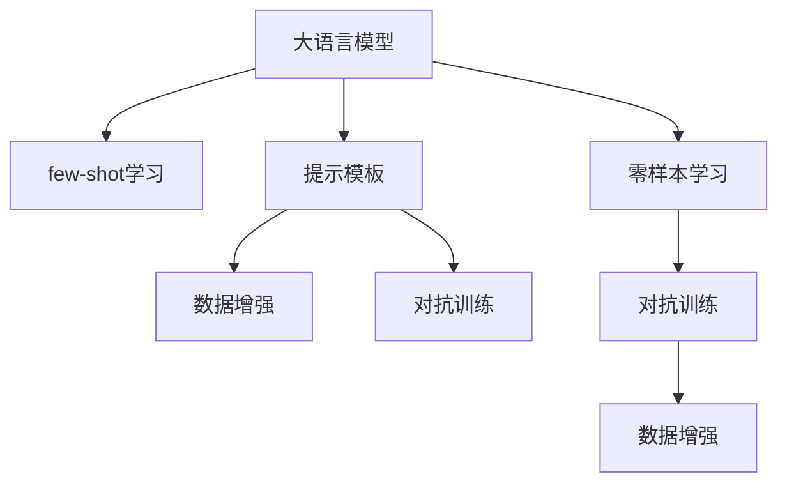

                 

## 1. 背景介绍

### 1.1 问题由来
在大规模语言模型（Large Language Models, LLMs）的推动下，自然语言处理（Natural Language Processing, NLP）取得了令人瞩目的进展。这些模型通过在海量无标签文本数据上进行预训练，能够学习和提取丰富的语言特征。然而，这些通用模型在特定领域的应用时，效果往往不尽如人意。这是因为通用模型缺乏领域特定的知识和常识，无法充分理解和生成特定领域的文本。

### 1.2 问题核心关键点
few-shot学习，即在少量标注数据的情况下，让模型快速学习新任务的方法，成为解决上述问题的重要手段。few-shot学习通过输入任务描述和少量标注样本，引导模型自主学习和适应新任务。这种方法不仅能够降低标注数据的成本，还能提高模型在特定领域的泛化能力。

few-shot学习的主要挑战在于如何利用有限的标注样本，使得模型能够准确理解和生成符合任务要求的文本。目前，few-shot学习的技术已经广泛应用于问答、翻译、摘要等NLP任务中，并取得了显著的成效。

### 1.3 问题研究意义
研究few-shot学习的原理和实践，对于推动NLP技术在特定领域的深入应用，具有重要意义：

1. **成本效益高**：通过few-shot学习，模型能够在少量标注数据下快速学习新任务，显著降低标注成本。
2. **泛化能力强**：few-shot学习能够提高模型在新数据上的泛化能力，使其更好地适应特定领域的文本。
3. **技术革新**：few-shot学习推动了模型架构和训练方法的新发展，促进了NLP技术的创新。
4. **应用广泛**：few-shot学习广泛应用于问答系统、对话系统、文本分类等NLP任务中，为各行各业带来了实际应用价值。
5. **产业升级**：few-shot学习使得NLP技术更容易被各行各业采用，推动了产业的数字化转型和升级。

## 2. 核心概念与联系

### 2.1 核心概念概述

为了更好地理解few-shot学习，本节将介绍几个密切相关的核心概念：

- **few-shot学习（Few-shot Learning）**：在只有少量标注样本的情况下，让模型学习新任务的方法。通过在输入中提供少量示例，模型能够自主学习和适应新任务，无需更新模型参数。

- **提示模板（Prompt Template）**：在输入文本中添加一些特定的格式和提示，引导模型进行特定任务的推理和生成。提示模板的设计对于few-shot学习的性能有重要影响。

- **数据增强（Data Augmentation）**：通过对训练样本进行改写、回译等方式，丰富训练集的多样性，提高模型的泛化能力。

- **对抗训练（Adversarial Training）**：加入对抗样本，提高模型在对抗条件下的鲁棒性和泛化能力。

- **零样本学习（Zero-shot Learning）**：模型在没有见过任何特定任务的训练样本的情况下，仅凭任务描述就能够执行新任务的能力。

这些核心概念之间的逻辑关系可以通过以下Mermaid流程图来展示：



这个流程图展示了大语言模型的核心概念及其之间的关系：

1. 大语言模型通过预训练获得基础能力。
2. few-shot学习通过输入任务描述和少量标注样本，引导模型自主学习和适应新任务。
3. 提示模板设计灵活，能够提高few-shot学习的性能。
4. 数据增强和对抗训练进一步提高模型的泛化能力和鲁棒性。
5. 零样本学习是few-shot学习的特殊形式，模型能够仅凭任务描述执行新任务。

这些概念共同构成了few-shot学习的学习框架，使其能够在各种场景下发挥强大的语言理解和生成能力。通过理解这些核心概念，我们可以更好地把握few-shot学习的原理和优化方向。

## 3. 核心算法原理 & 具体操作步骤
### 3.1 算法原理概述

few-shot学习的核心思想是：将大语言模型视作一个强大的"特征提取器"，通过在输入中提供少量标注样本，引导模型进行特定任务的推理和生成。这种学习方式不需要对模型进行大规模的微调，可以在小规模数据集上快速适应新任务。

形式化地，假设预训练模型为 $M_{\theta}$，其中 $\theta$ 为预训练得到的模型参数。给定下游任务 $T$ 的少量标注数据集 $D=\{(x_i, y_i)\}_{i=1}^k$，few-shot学习的目标是在新的数据集 $D'$ 上，让模型输出的预测结果 $y'$ 尽可能接近真实标签 $y$。通常使用交叉熵损失函数来衡量模型预测与真实标签之间的差异：

$$
\mathcal{L}(M_{\theta}, D') = -\frac{1}{n}\sum_{i=1}^n \sum_{j=1}^k y_j \log M_{\theta}(x_i)
$$

其中 $n$ 为 $D'$ 中的样本数量，$y$ 为真实标签，$M_{\theta}(x)$ 为模型在输入 $x$ 上的输出。

通过梯度下降等优化算法，few-shot学习过程不断更新模型参数 $\theta$，最小化损失函数 $\mathcal{L}$，使得模型输出逼近真实标签。由于 $\theta$ 已经通过预训练获得了较好的初始化，因此即便在小规模数据集 $D'$ 上进行few-shot学习，也能较快收敛到理想的模型参数 $\hat{\theta}$。

### 3.2 算法步骤详解

few-shot学习的步骤主要包括：

**Step 1: 准备预训练模型和数据集**
- 选择合适的预训练语言模型 $M_{\theta}$ 作为初始化参数，如 BERT、GPT 等。
- 准备下游任务 $T$ 的少量标注数据集 $D=\{(x_i, y_i)\}_{i=1}^k$，其中 $x_i$ 为输入文本，$y_i$ 为对应的任务标签。

**Step 2: 设计提示模板**
- 根据任务类型，设计合适的提示模板（Prompt Template），用于引导模型进行推理和生成。
- 提示模板通常包括任务描述和少量示例，以帮助模型理解任务要求。

**Step 3: 添加任务适配层**
- 对于分类任务，通常在模型顶层添加线性分类器和交叉熵损失函数。
- 对于生成任务，通常使用语言模型的解码器输出概率分布，并以负对数似然为损失函数。

**Step 4: 设置优化器和超参数**
- 选择合适的优化算法及其参数，如 AdamW、SGD 等，设置学习率、批大小、迭代轮数等。
- 设置正则化技术及强度，包括权重衰减、Dropout、Early Stopping 等。

**Step 5: 执行梯度训练**
- 将训练集数据分批次输入模型，前向传播计算损失函数。
- 反向传播计算参数梯度，根据设定的优化算法和学习率更新模型参数。
- 周期性在验证集上评估模型性能，根据性能指标决定是否触发 Early Stopping。
- 重复上述步骤直到满足预设的迭代轮数或 Early Stopping 条件。

**Step 6: 测试和部署**
- 在测试集上评估few-shot学习后模型 $M_{\hat{\theta}}$ 的性能，对比few-shot学习前后的精度提升。
- 使用few-shot学习后的模型对新样本进行推理预测，集成到实际的应用系统中。
- 持续收集新的数据，定期重新few-shot学习模型，以适应数据分布的变化。

以上是few-shot学习的完整流程。在实际应用中，还需要针对具体任务的特点，对few-shot学习过程的各个环节进行优化设计，如改进训练目标函数，引入更多的正则化技术，搜索最优的超参数组合等，以进一步提升模型性能。

### 3.3 算法优缺点

few-shot学习的优点包括：
1. 成本效益高。通过在输入中提供少量标注样本，模型能够快速学习新任务，显著降低标注成本。
2. 泛化能力强。few-shot学习能够提高模型在新数据上的泛化能力，使其更好地适应特定领域的文本。
3. 技术革新。few-shot学习推动了模型架构和训练方法的新发展，促进了NLP技术的创新。
4. 应用广泛。few-shot学习广泛应用于问答系统、对话系统、文本分类等NLP任务中，为各行各业带来了实际应用价值。

同时，该方法也存在一定的局限性：
1. 数据稀疏性问题。在只有少量标注样本的情况下，模型的学习过程可能会受到数据稀疏性的影响。
2. 模型泛化能力有限。当任务与预训练数据的分布差异较大时，few-shot学习的性能提升有限。
3. 提示模板设计复杂。提示模板的设计需要技巧和经验，不同任务和数据集可能需要不同的模板。
4. 模型鲁棒性不足。few-shot学习的模型可能面对新数据时，泛化能力不足，需要进行更多改进。

尽管存在这些局限性，但就目前而言，few-shot学习仍是few-shot学习的主要范式。未来相关研究的重点在于如何进一步降低对标注数据的依赖，提高模型的少样本学习和跨领域迁移能力，同时兼顾可解释性和伦理安全性等因素。

### 3.4 算法应用领域

few-shot学习在大语言模型中的应用已经得到了广泛的应用，涵盖了诸多NLP任务，例如：

- 问答系统：对自然语言问题给出答案。在问答系统中，模型可以通过输入问题-答案对进行few-shot学习，快速适应新问题。
- 对话系统：使机器能够与人自然对话。对话系统可以通过输入多轮对话历史进行few-shot学习，引导模型进行回复生成。
- 文本分类：如情感分析、主题分类、意图识别等。通过在输入中添加任务描述和少量示例，模型可以学习文本-标签映射。
- 命名实体识别：识别文本中的人名、地名、机构名等特定实体。通过在输入中提供实体标注示例，模型可以学习实体边界和类型。
- 关系抽取：从文本中抽取实体之间的语义关系。通过在输入中提供实体关系示例，模型可以学习实体-关系三元组。

除了上述这些经典任务外，few-shot学习也被创新性地应用到更多场景中，如可控文本生成、常识推理、代码生成、数据增强等，为NLP技术带来了全新的突破。随着预训练模型和few-shot学习的不断进步，相信NLP技术将在更广阔的应用领域大放异彩。

## 4. 数学模型和公式 & 详细讲解
### 4.1 数学模型构建

本节将使用数学语言对few-shot学习过程进行更加严格的刻画。

记预训练语言模型为 $M_{\theta}$，其中 $\theta$ 为预训练得到的模型参数。假设微调任务的训练集为 $D=\{(x_i, y_i)\}_{i=1}^k$，其中 $x_i$ 为输入文本，$y_i$ 为对应的任务标签。

定义模型 $M_{\theta}$ 在输入 $x$ 上的损失函数为 $\ell(M_{\theta}(x),y)$，则在数据集 $D'$ 上的few-shot学习目标为：

$$
\mathcal{L}(\theta) = -\frac{1}{n}\sum_{i=1}^n \sum_{j=1}^k y_j \log M_{\theta}(x_i)
$$

其中 $n$ 为 $D'$ 中的样本数量，$y$ 为真实标签，$M_{\theta}(x)$ 为模型在输入 $x$ 上的输出。

通过梯度下降等优化算法，few-shot学习过程不断更新模型参数 $\theta$，最小化损失函数 $\mathcal{L}$，使得模型输出逼近真实标签。由于 $\theta$ 已经通过预训练获得了较好的初始化，因此即便在小规模数据集 $D'$ 上进行few-shot学习，也能较快收敛到理想的模型参数 $\hat{\theta}$。

### 4.2 公式推导过程

以下我们以分类任务为例，推导few-shot学习的损失函数及其梯度的计算公式。

假设模型 $M_{\theta}$ 在输入 $x$ 上的输出为 $\hat{y}=M_{\theta}(x) \in [0,1]$，表示样本属于正类的概率。真实标签 $y \in \{0,1\}$。则分类任务的交叉熵损失函数定义为：

$$
\ell(M_{\theta}(x),y) = -[y\log \hat{y} + (1-y)\log (1-\hat{y})]
$$

将其代入few-shot学习目标，得：

$$
\mathcal{L}(\theta) = -\frac{1}{n}\sum_{i=1}^n \sum_{j=1}^k y_j \log M_{\theta}(x_i)
$$

根据链式法则，损失函数对参数 $\theta_k$ 的梯度为：

$$
\frac{\partial \mathcal{L}(\theta)}{\partial \theta_k} = -\frac{1}{n}\sum_{i=1}^n \sum_{j=1}^k y_j \frac{\partial M_{\theta}(x_i)}{\partial \theta_k}
$$

其中 $\frac{\partial M_{\theta}(x_i)}{\partial \theta_k}$ 可进一步递归展开，利用自动微分技术完成计算。

在得到损失函数的梯度后，即可带入参数更新公式，完成模型的迭代优化。重复上述过程直至收敛，最终得到适应下游任务的最优模型参数 $\hat{\theta}$。

## 5. 项目实践：代码实例和详细解释说明
### 5.1 开发环境搭建

在进行few-shot学习实践前，我们需要准备好开发环境。以下是使用Python进行PyTorch开发的环境配置流程：

1. 安装Anaconda：从官网下载并安装Anaconda，用于创建独立的Python环境。

2. 创建并激活虚拟环境：
```bash
conda create -n pytorch-env python=3.8 
conda activate pytorch-env
```

3. 安装PyTorch：根据CUDA版本，从官网获取对应的安装命令。例如：
```bash
conda install pytorch torchvision torchaudio cudatoolkit=11.1 -c pytorch -c conda-forge
```

4. 安装Transformers库：
```bash
pip install transformers
```

5. 安装各类工具包：
```bash
pip install numpy pandas scikit-learn matplotlib tqdm jupyter notebook ipython
```

完成上述步骤后，即可在`pytorch-env`环境中开始few-shot学习实践。

### 5.2 源代码详细实现

这里我们以问答系统为例，给出使用Transformers库对BERT模型进行few-shot学习的PyTorch代码实现。

首先，定义问答系统的数据处理函数：

```python
from transformers import BertTokenizer
from torch.utils.data import Dataset
import torch

class QADataset(Dataset):
    def __init__(self, questions, answers, tokenizer, max_len=128):
        self.questions = questions
        self.answers = answers
        self.tokenizer = tokenizer
        self.max_len = max_len
        
    def __len__(self):
        return len(self.questions)
    
    def __getitem__(self, item):
        question = self.questions[item]
        answer = self.answers[item]
        
        encoding = self.tokenizer(question, return_tensors='pt', max_length=self.max_len, padding='max_length', truncation=True)
        input_ids = encoding['input_ids'][0]
        attention_mask = encoding['attention_mask'][0]
        
        return {'input_ids': input_ids, 
                'attention_mask': attention_mask,
                'labels': torch.tensor(answer, dtype=torch.long)}
```

然后，定义模型和优化器：

```python
from transformers import BertForQuestionAnswering, AdamW

model = BertForQuestionAnswering.from_pretrained('bert-base-cased')

optimizer = AdamW(model.parameters(), lr=2e-5)
```

接着，定义训练和评估函数：

```python
from torch.utils.data import DataLoader
from tqdm import tqdm

device = torch.device('cuda') if torch.cuda.is_available() else torch.device('cpu')
model.to(device)

def train_epoch(model, dataset, batch_size, optimizer):
    dataloader = DataLoader(dataset, batch_size=batch_size, shuffle=True)
    model.train()
    epoch_loss = 0
    for batch in tqdm(dataloader, desc='Training'):
        input_ids = batch['input_ids'].to(device)
        attention_mask = batch['attention_mask'].to(device)
        labels = batch['labels'].to(device)
        model.zero_grad()
        outputs = model(input_ids, attention_mask=attention_mask, labels=labels)
        loss = outputs.loss
        epoch_loss += loss.item()
        loss.backward()
        optimizer.step()
    return epoch_loss / len(dataloader)

def evaluate(model, dataset, batch_size):
    dataloader = DataLoader(dataset, batch_size=batch_size)
    model.eval()
    preds, labels = [], []
    with torch.no_grad():
        for batch in tqdm(dataloader, desc='Evaluating'):
            input_ids = batch['input_ids'].to(device)
            attention_mask = batch['attention_mask'].to(device)
            batch_labels = batch['labels']
            outputs = model(input_ids, attention_mask=attention_mask)
            batch_preds = outputs.logits.argmax(dim=2).to('cpu').tolist()
            batch_labels = batch_labels.to('cpu').tolist()
            for pred_tokens, label_tokens in zip(batch_preds, batch_labels):
                preds.append(pred_tokens[:len(label_tokens)])
                labels.append(label_tokens)
                
    print(classification_report(labels, preds))
```

最后，启动训练流程并在测试集上评估：

```python
epochs = 5
batch_size = 16

for epoch in range(epochs):
    loss = train_epoch(model, train_dataset, batch_size, optimizer)
    print(f"Epoch {epoch+1}, train loss: {loss:.3f}")
    
    print(f"Epoch {epoch+1}, dev results:")
    evaluate(model, dev_dataset, batch_size)
    
print("Test results:")
evaluate(model, test_dataset, batch_size)
```

以上就是使用PyTorch对BERT进行问答系统任务few-shot学习的完整代码实现。可以看到，得益于Transformers库的强大封装，我们可以用相对简洁的代码完成BERT模型的加载和few-shot学习。

### 5.3 代码解读与分析

让我们再详细解读一下关键代码的实现细节：

**QADataset类**：
- `__init__`方法：初始化问题、答案、分词器等关键组件。
- `__len__`方法：返回数据集的样本数量。
- `__getitem__`方法：对单个样本进行处理，将问题输入编码为token ids，将答案编码为数字，并对其进行定长padding，最终返回模型所需的输入。

**提示模板设计**：
- 提示模板的设计需要技巧和经验，不同任务和数据集可能需要不同的模板。
- 对于问答系统，常见的提示模板包括问题描述和少量问题-答案对。
- 提示模板的设计应尽量简洁明了，避免干扰模型的理解。

**训练和评估函数**：
- 使用PyTorch的DataLoader对数据集进行批次化加载，供模型训练和推理使用。
- 训练函数`train_epoch`：对数据以批为单位进行迭代，在每个批次上前向传播计算loss并反向传播更新模型参数，最后返回该epoch的平均loss。
- 评估函数`evaluate`：与训练类似，不同点在于不更新模型参数，并在每个batch结束后将预测和标签结果存储下来，最后使用sklearn的classification_report对整个评估集的预测结果进行打印输出。

**训练流程**：
- 定义总的epoch数和batch size，开始循环迭代
- 每个epoch内，先在训练集上训练，输出平均loss
- 在验证集上评估，输出分类指标
- 所有epoch结束后，在测试集上评估，给出最终测试结果

可以看到，PyTorch配合Transformers库使得BERT的few-shot学习代码实现变得简洁高效。开发者可以将更多精力放在数据处理、模型改进等高层逻辑上，而不必过多关注底层的实现细节。

当然，工业级的系统实现还需考虑更多因素，如模型的保存和部署、超参数的自动搜索、更灵活的任务适配层等。但核心的few-shot学习范式基本与此类似。

## 6. 实际应用场景
### 6.1 智能客服系统

基于few-shot学习的对话技术，可以广泛应用于智能客服系统的构建。传统客服往往需要配备大量人力，高峰期响应缓慢，且一致性和专业性难以保证。而使用few-shot学习的对话模型，可以7x24小时不间断服务，快速响应客户咨询，用自然流畅的语言解答各类常见问题。

在技术实现上，可以收集企业内部的历史客服对话记录，将问题和最佳答复构建成监督数据，在此基础上对预训练对话模型进行few-shot学习。few-shot学习后的对话模型能够自动理解用户意图，匹配最合适的答案模板进行回复。对于客户提出的新问题，还可以接入检索系统实时搜索相关内容，动态组织生成回答。如此构建的智能客服系统，能大幅提升客户咨询体验和问题解决效率。

### 6.2 金融舆情监测

金融机构需要实时监测市场舆论动向，以便及时应对负面信息传播，规避金融风险。传统的人工监测方式成本高、效率低，难以应对网络时代海量信息爆发的挑战。基于few-shot学习的文本分类和情感分析技术，为金融舆情监测提供了新的解决方案。

具体而言，可以收集金融领域相关的新闻、报道、评论等文本数据，并对其进行主题标注和情感标注。在此基础上对预训练语言模型进行few-shot学习，使其能够自动判断文本属于何种主题，情感倾向是正面、中性还是负面。将few-shot学习后的模型应用到实时抓取的网络文本数据，就能够自动监测不同主题下的情感变化趋势，一旦发现负面信息激增等异常情况，系统便会自动预警，帮助金融机构快速应对潜在风险。

### 6.3 个性化推荐系统

当前的推荐系统往往只依赖用户的历史行为数据进行物品推荐，无法深入理解用户的真实兴趣偏好。基于few-shot学习的个性化推荐系统可以更好地挖掘用户行为背后的语义信息，从而提供更精准、多样的推荐内容。

在实践中，可以收集用户浏览、点击、评论、分享等行为数据，提取和用户交互的物品标题、描述、标签等文本内容。将文本内容作为模型输入，用户的后续行为（如是否点击、购买等）作为监督信号，在此基础上进行few-shot学习。few-shot学习后的模型能够从文本内容中准确把握用户的兴趣点。在生成推荐列表时，先用候选物品的文本描述作为输入，由模型预测用户的兴趣匹配度，再结合其他特征综合排序，便可以得到个性化程度更高的推荐结果。

### 6.4 未来应用展望

随着few-shot学习方法的不断发展，基于few-shot学习的范式将在更多领域得到应用，为传统行业带来变革性影响。

在智慧医疗领域，基于few-shot学习的医疗问答、病历分析、药物研发等应用将提升医疗服务的智能化水平，辅助医生诊疗，加速新药开发进程。

在智能教育领域，few-shot学习可应用于作业批改、学情分析、知识推荐等方面，因材施教，促进教育公平，提高教学质量。

在智慧城市治理中，few-shot学习可用于城市事件监测、舆情分析、应急指挥等环节，提高城市管理的自动化和智能化水平，构建更安全、高效的未来城市。

此外，在企业生产、社会治理、文娱传媒等众多领域，基于few-shot学习的AI应用也将不断涌现，为经济社会发展注入新的动力。相信随着技术的日益成熟，few-shot学习范式将成为人工智能落地应用的重要范式，推动人工智能技术在垂直行业的规模化落地。

## 7. 工具和资源推荐
### 7.1 学习资源推荐

为了帮助开发者系统掌握few-shot学习的理论基础和实践技巧，这里推荐一些优质的学习资源：

1. 《Transformer from NLP to Image》系列博文：由大模型技术专家撰写，深入浅出地介绍了few-shot学习在大模型中的应用，并给出详细的代码实现。

2. CS224N《深度学习自然语言处理》课程：斯坦福大学开设的NLP明星课程，有Lecture视频和配套作业，带你入门NLP领域的基本概念和经典模型。

3. 《Natural Language Processing with Transformers》书籍：Transformers库的作者所著，全面介绍了如何使用Transformers库进行NLP任务开发，包括few-shot学习在内的诸多范式。

4. HuggingFace官方文档：Transformers库的官方文档，提供了海量预训练模型和完整的few-shot学习样例代码，是上手实践的必备资料。

5. CLUE开源项目：中文语言理解测评基准，涵盖大量不同类型的中文NLP数据集，并提供了基于few-shot学习的baseline模型，助力中文NLP技术发展。

通过对这些资源的学习实践，相信你一定能够快速掌握few-shot学习的精髓，并用于解决实际的NLP问题。
###  7.2 开发工具推荐

高效的开发离不开优秀的工具支持。以下是几款用于few-shot学习开发的常用工具：

1. PyTorch：基于Python的开源深度学习框架，灵活动态的计算图，适合快速迭代研究。大部分预训练语言模型都有PyTorch版本的实现。

2. TensorFlow：由Google主导开发的开源深度学习框架，生产部署方便，适合大规模工程应用。同样有丰富的预训练语言模型资源。

3. Transformers库：HuggingFace开发的NLP工具库，集成了众多SOTA语言模型，支持PyTorch和TensorFlow，是进行few-shot学习开发的利器。

4. Weights & Biases：模型训练的实验跟踪工具，可以记录和可视化模型训练过程中的各项指标，方便对比和调优。与主流深度学习框架无缝集成。

5. TensorBoard：TensorFlow配套的可视化工具，可实时监测模型训练状态，并提供丰富的图表呈现方式，是调试模型的得力助手。

6. Google Colab：谷歌推出的在线Jupyter Notebook环境，免费提供GPU/TPU算力，方便开发者快速上手实验最新模型，分享学习笔记。

合理利用这些工具，可以显著提升few-shot学习任务的开发效率，加快创新迭代的步伐。

### 7.3 相关论文推荐

few-shot学习的研究源于学界的持续研究。以下是几篇奠基性的相关论文，推荐阅读：

1. Learning to Customize Visual Transformers（CLIP）：提出CLIP模型，使用大规模无标签图像和文本数据进行预训练，能够从少量文本描述中准确识别图像。

2. CLIP-BERT: A Novel Prompt Method for Few-Shot Image Classification：提出CLIP-BERT模型，通过在图像描述中插入提示词，显著提升了few-shot图像分类的性能。

3. T0: Instruction-Tower: A Framework for Few-Shot Learning with Massive Pre-trained Models：提出T0模型，使用大规模预训练模型进行few-shot学习，并在文本分类、问答等任务上取得了优异的性能。

4. Prompt-Efficient Instruction Tuning for Pre-trained Models：提出Prompt Efficient Tuning（PET）方法，通过优化提示模板，显著提高了few-shot学习的效率和性能。

5. Best-of-Both-Worlds: An Easy-to-Implement Prompt Method for Few-shot Image Recognition：提出Best-of-Both-Worlds方法，使用提示模板和微调相结合的方式，提升了few-shot图像识别的效果。

这些论文代表了大规模语言模型few-shot学习的发展脉络。通过学习这些前沿成果，可以帮助研究者把握学科前进方向，激发更多的创新灵感。

## 8. 总结：未来发展趋势与挑战
### 8.1 总结

本文对基于few-shot学习的大语言模型微调方法进行了全面系统的介绍。首先阐述了few-shot学习的研究背景和意义，明确了其在降低标注成本、提高模型泛化能力方面的独特价值。其次，从原理到实践，详细讲解了few-shot学习的数学原理和关键步骤，给出了few-shot学习任务开发的完整代码实例。同时，本文还广泛探讨了few-shot学习在智能客服、金融舆情、个性化推荐等多个领域的应用前景，展示了few-shot学习范式的巨大潜力。此外，本文精选了few-shot学习的各类学习资源，力求为读者提供全方位的技术指引。

通过本文的系统梳理，可以看到，基于few-shot学习的微调方法正在成为NLP领域的重要范式，极大地拓展了预训练语言模型的应用边界，催生了更多的落地场景。受益于大规模语料的预训练，few-shot学习模型以更低的时间和标注成本，在小样本条件下也能取得不俗的效果，有力推动了NLP技术的产业化进程。未来，伴随预训练语言模型和few-shot学习方法的持续演进，相信NLP技术将在更广阔的应用领域大放异彩，深刻影响人类的生产生活方式。

### 8.2 未来发展趋势

展望未来，few-shot学习技术将呈现以下几个发展趋势：

1. 模型规模持续增大。随着算力成本的下降和数据规模的扩张，预训练语言模型的参数量还将持续增长。超大规模语言模型蕴含的丰富语言知识，有望支撑更加复杂多变的few-shot学习任务。

2. few-shot学习范式日趋多样化。除了传统的few-shot学习外，未来会涌现更多高效的few-shot学习方法，如Prompt Tuning、Zero-Shot Tuning等，在减少标注样本的同时，提高few-shot学习的性能。

3. 数据增强和对抗训练进一步提升。数据增强和对抗训练技术可以显著提高few-shot学习的泛化能力和鲁棒性，未来将进一步优化和推广。

4. 零样本学习（Zero-Shot Learning）将得到更多关注。零样本学习能够在不使用任何标注样本的情况下，仅凭任务描述就能执行新任务，未来将成为few-shot学习的重要分支。

5. 多模态few-shot学习将迎来发展。多模态数据的融合将进一步提升few-shot学习的表现，未来将结合文本、图像、语音等多种数据形式，实现更全面的知识获取。

6. 元学习（Meta-Learning）将引入few-shot学习。元学习能够使模型学习如何快速适应新任务，未来将为few-shot学习带来新的突破。

以上趋势凸显了few-shot学习技术的广阔前景。这些方向的探索发展，必将进一步提升few-shot学习的性能和应用范围，为人工智能技术落地应用提供新的动力。

### 8.3 面临的挑战

尽管few-shot学习技术已经取得了瞩目成就，但在迈向更加智能化、普适化应用的过程中，它仍面临着诸多挑战：

1. 标注成本瓶颈。虽然few-shot学习能够降低标注成本，但对于长尾应用场景，难以获得充足的高质量标注数据，成为制约few-shot学习性能的瓶颈。

2. 模型泛化能力有限。few-shot学习模型面对新数据时，泛化能力可能不足，需要进行更多改进。

3. 提示模板设计复杂。提示模板的设计需要技巧和经验，不同任务和数据集可能需要不同的模板。

4. 模型鲁棒性不足。few-shot学习模型可能面对新数据时，泛化能力不足，需要进行更多改进。

5. 知识整合能力不足。few-shot学习模型往往局限于任务内数据，难以灵活吸收和运用更广泛的先验知识。

6. 可解释性不足。few-shot学习模型通常缺乏可解释性，难以对其推理逻辑进行分析和调试。

尽管存在这些挑战，但就目前而言，few-shot学习仍是few-shot学习的主要范式。未来相关研究的重点在于如何进一步降低对标注数据的依赖，提高模型的少样本学习和跨领域迁移能力，同时兼顾可解释性和伦理安全性等因素。

### 8.4 研究展望

面对few-shot学习所面临的种种挑战，未来的研究需要在以下几个方面寻求新的突破：

1. 探索无监督和半监督few-shot学习方法。摆脱对大规模标注数据的依赖，利用自监督学习、主动学习等无监督和半监督范式，最大限度利用非结构化数据，实现更加灵活高效的few-shot学习。

2. 研究参数高效和计算高效的few-shot学习范式。开发更加参数高效的few-shot学习方法，在固定大部分预训练参数的同时，只更新极少量的任务相关参数。同时优化few-shot学习的计算图，减少前向传播和反向传播的资源消耗，实现更加轻量级、实时性的部署。

3. 融合因果和对比学习范式。通过引入因果推断和对比学习思想，增强few-shot学习模型建立稳定因果关系的能力，学习更加普适、鲁棒的语言表征，从而提升模型泛化性和抗干扰能力。

4. 引入更多先验知识。将符号化的先验知识，如知识图谱、逻辑规则等，与神经网络模型进行巧妙融合，引导few-shot学习过程学习更准确、合理的语言模型。同时加强不同模态数据的整合，实现视觉、语音等多模态信息与文本信息的协同建模。

5. 结合因果分析和博弈论工具。将因果分析方法引入few-shot学习模型，识别出模型决策的关键特征，增强输出解释的因果性和逻辑性。借助博弈论工具刻画人机交互过程，主动探索并规避模型的脆弱点，提高系统稳定性。

6. 纳入伦理道德约束。在few-shot学习模型的训练目标中引入伦理导向的评估指标，过滤和惩罚有偏见、有害的输出倾向。同时加强人工干预和审核，建立模型行为的监管机制，确保输出符合人类价值观和伦理道德。

这些研究方向的探索，必将引领few-shot学习技术迈向更高的台阶，为构建安全、可靠、可解释、可控的智能系统铺平道路。面向未来，few-shot学习技术还需要与其他人工智能技术进行更深入的融合，如知识表示、因果推理、强化学习等，多路径协同发力，共同推动自然语言理解和智能交互系统的进步。只有勇于创新、敢于突破，才能不断拓展few-shot学习模型的边界，让智能技术更好地造福人类社会。

## 9. 附录：常见问题与解答

**Q1：few-shot学习是否适用于所有NLP任务？**

A: few-shot学习在大多数NLP任务上都能取得不错的效果，特别是对于数据量较小的任务。但对于一些特定领域的任务，如医学、法律等，仅仅依靠通用语料预训练的模型可能难以很好地适应。此时需要在特定领域语料上进一步预训练，再进行few-shot学习，才能获得理想效果。此外，对于一些需要时效性、个性化很强的任务，如对话、推荐等，few-shot学习方法也需要针对性的改进优化。

**Q2：few-shot学习过程中如何选择合适的学习率？**

A: few-shot学习的学习率一般要比预训练时小1-2个数量级，如果使用过大的学习率，容易破坏预训练权重，导致过拟合。一般建议从1e-5开始调参，逐步减小学习率，直至收敛。也可以使用warmup策略，在开始阶段使用较小的学习率，再逐渐过渡到预设值。需要注意的是，不同的优化器(如AdamW、Adafactor等)以及不同的学习率调度策略，可能需要设置不同的学习率阈值。

**Q3：few-shot学习过程中如何缓解过拟合问题？**

A: few-shot学习中的过拟合问题可以通过以下方法缓解：
1. 数据增强：通过回译、近义替换等方式扩充训练集
2. 正则化：使用L2正则、Dropout、Early Stopping等避免过拟合
3. 对抗训练：引入对抗样本，提高模型鲁棒性
4. 参数高效微调：只调整少量参数(如Adapter、Prefix等)，减小过拟合风险
5. 多模型集成：训练多个few-shot学习模型，取平均输出，抑制过拟合

这些策略往往需要根据具体任务和数据特点进行灵活组合。只有在数据、模型、训练、推理等各环节进行全面优化，才能最大限度地发挥few-shot学习的威力。

**Q4：few-shot学习模型在落地部署时需要注意哪些问题？**

A: 将few-shot学习模型转化为实际应用，还需要考虑以下因素：
1. 模型裁剪：去除不必要的层和参数，减小模型尺寸，加快推理速度
2. 量化加速：将浮点模型转为定点模型，压缩存储空间，提高计算效率
3. 服务化封装：将模型封装为标准化服务接口，便于集成调用
4. 弹性伸缩：根据请求流量动态调整资源配置，平衡服务质量和成本
5. 监控告警：实时采集系统指标，设置异常告警阈值，确保服务稳定性
6. 安全防护：采用访问鉴权、数据脱敏等措施，保障数据和模型安全

few-shot学习为NLP应用开启了广阔的想象空间，但如何将强大的性能转化为稳定、高效、安全的业务价值，还需要工程实践的不断打磨。唯有从数据、算法、工程、业务等多个维度协同发力，才能真正实现人工智能技术在垂直行业的规模化落地。总之，few-shot学习需要开发者根据具体任务，不断迭代和优化模型、数据和算法，方能得到理想的效果。

---

作者：禅与计算机程序设计艺术 / Zen and the Art of Computer Programming

