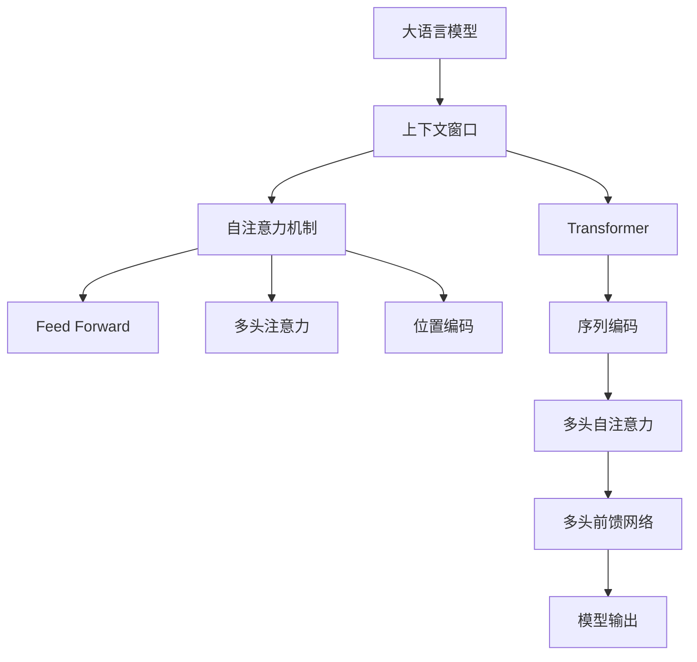

                 

# 大语言模型的上下文窗口

> 关键词：大语言模型,上下文窗口,Transformer,自注意力机制,卷积神经网络,CNN,循环神经网络,RNN,Transformer-XL,长短期记忆网络,LSTM

## 1. 背景介绍

在自然语言处理（NLP）领域，大语言模型（Large Language Model, LLM）因其出色的表现而备受关注。自OpenAI的GPT系列模型问世以来，大语言模型已经在文本生成、机器翻译、问答系统等多个任务上取得了显著的进展。然而，这些大模型往往包含数十亿甚至数百亿的参数，需要大量的计算资源和存储资源进行训练和推理。

为提高计算效率和模型表现，大语言模型在处理输入序列时，常常采用固定长度的上下文窗口（Context Window）机制。上下文窗口限定了模型在处理一个输入时，能够同时参考的上下文范围。在当前的主流大语言模型中，如Transformer，上下文窗口的长度通常被固定为某一数值，这对模型的表现和计算效率都有着重要的影响。

本文将从核心概念、算法原理、数学模型、实践案例等方面深入探讨大语言模型的上下文窗口机制，并提出相关的改进建议，以期为读者提供全面的理论和技术支持。

## 2. 核心概念与联系

### 2.1 核心概念概述

#### 大语言模型

大语言模型指的是那些拥有巨大参数量、能够处理复杂语言任务的神经网络模型。它们通常基于自回归或自编码模型，如Transformer，通过大规模无标签文本数据进行预训练，学习到丰富的语言知识和常识。

#### 上下文窗口

上下文窗口指的是模型在处理一个输入时，同时能够参考的上下文范围。例如，在Transformer模型中，上下文窗口通常指输入序列的长度，即序列的前向和后向部分能够被同时考虑。

#### Transformer模型

Transformer模型是一种基于自注意力机制的神经网络架构，由Attention和Feed Forward两层交替组成。它通过多头自注意力机制来捕捉输入序列中的长期依赖关系，被广泛应用于大语言模型的构建中。

### 2.2 核心概念原理和架构的 Mermaid 流程图



此图展示了Transformer模型的基本架构，其中A代表大语言模型，B为上下文窗口，C为自注意力机制，D为Feed Forward网络，E为多头注意力，F为位置编码，G为Transformer模型，H为序列编码，I为多头自注意力，J为多头前馈网络，K为模型输出。

## 3. 核心算法原理 & 具体操作步骤

### 3.1 算法原理概述

大语言模型的上下文窗口机制主要涉及如何处理输入序列，并提取有效的上下文信息。在Transformer模型中，上下文窗口通过多头自注意力机制来实现。自注意力机制允许模型在输入序列的不同位置之间进行信息的交互，从而捕捉长距离依赖关系。

#### 自注意力机制

自注意力机制是一种通过注意力权重对输入序列的不同位置进行加权计算的机制。它通过计算输入序列中每个位置与所有其他位置之间的注意力得分，来决定哪些位置对当前位置的影响更大。

在Transformer模型中，自注意力机制通过以下公式进行计算：

$$
\text{Attention}(Q,K,V) = \text{softmax}(\frac{QK^T}{\sqrt{d_k}})V
$$

其中，$Q$、$K$和$V$分别代表查询、键和值向量，$d_k$为键向量的维度。

#### 位置编码

由于自注意力机制不包含位置信息，因此在Transformer模型中引入了位置编码，以确保模型能够区分不同位置的信息。位置编码通过将位置信息嵌入到向量中，从而使得模型在计算时能够考虑输入序列中的位置关系。

### 3.2 算法步骤详解

#### 输入序列的编码

在Transformer模型中，输入序列首先通过位置编码进行编码。位置编码通过添加一个可学习的向量到输入序列中，从而确保模型能够区分不同位置的信息。

#### 自注意力计算

随后，输入序列通过自注意力机制进行计算。自注意力机制通过计算输入序列中每个位置与所有其他位置之间的注意力得分，来决定哪些位置对当前位置的影响更大。

#### 多头注意力

为了提高模型的表现，Transformer模型引入了多头注意力机制。即在计算自注意力时，使用多个不同的线性变换矩阵对输入序列进行投影，从而能够捕捉不同的特征。

#### 前馈网络

自注意力计算后，输入序列通过一个前馈网络进行计算。前馈网络由两个全连接层组成，其中每个层都包含非线性激活函数。

#### 输出计算

最后，模型通过将输入序列的编码、多头注意力和前馈网络的输出相加，得到最终的输出。

### 3.3 算法优缺点

#### 优点

- 长距离依赖捕捉：自注意力机制能够捕捉输入序列中的长距离依赖关系，从而提高模型的表现。
- 高效计算：Transformer模型的自注意力机制采用矩阵乘法进行计算，计算效率高。

#### 缺点

- 计算资源需求高：由于自注意力机制需要计算输入序列中每个位置与所有其他位置之间的注意力得分，因此计算资源需求较高。
- 位置信息依赖：位置编码的使用，使得模型对输入序列中的位置信息非常敏感。

### 3.4 算法应用领域

大语言模型的上下文窗口机制被广泛应用于各种NLP任务中，例如：

- 机器翻译：通过在输入序列中添加源语言和目标语言的位置信息，提高机器翻译的准确性。
- 问答系统：通过在输入序列中添加问题和上下文的位置信息，提高问答系统的准确性。
- 文本生成：通过在输入序列中添加生成文本的上下文信息，提高文本生成的连贯性和流畅性。
- 命名实体识别：通过在输入序列中添加实体位置信息，提高命名实体识别的准确性。

## 4. 数学模型和公式 & 详细讲解 & 举例说明

### 4.1 数学模型构建

在Transformer模型中，输入序列通过以下公式进行编码：

$$
\text{Embedding}(x_i) = \text{Embedding}(w_i) + \text{Positional Encoding}(i)
$$

其中，$x_i$代表输入序列中的第$i$个单词，$w_i$代表单词向量，$Positional Encoding(i)$代表位置编码。

### 4.2 公式推导过程

在自注意力机制中，通过以下公式进行计算：

$$
\text{Attention}(Q,K,V) = \text{softmax}(\frac{QK^T}{\sqrt{d_k}})V
$$

其中，$Q$、$K$和$V$分别代表查询、键和值向量，$d_k$为键向量的维度。

### 4.3 案例分析与讲解

以机器翻译任务为例，输入序列包括源语言和目标语言。在Transformer模型中，首先对输入序列进行位置编码，然后通过自注意力机制计算源语言和目标语言之间的注意力权重，最终通过前馈网络计算输出序列。

## 5. 项目实践：代码实例和详细解释说明

### 5.1 开发环境搭建

在Python环境中搭建开发环境，需要安装PyTorch和HuggingFace的Transformers库。具体步骤如下：

```bash
pip install torch transformers
```

### 5.2 源代码详细实现

以下是一个简单的Transformer模型实现，用于文本分类任务。

```python
import torch
import torch.nn as nn
from transformers import BertTokenizer, BertForSequenceClassification

class TransformerModel(nn.Module):
    def __init__(self, num_classes):
        super(TransformerModel, self).__init__()
        self.num_classes = num_classes
        self.tokenizer = BertTokenizer.from_pretrained('bert-base-cased')
        self.model = BertForSequenceClassification.from_pretrained('bert-base-cased', num_labels=num_classes)
        
    def forward(self, input_ids, attention_mask):
        output = self.model(input_ids, attention_mask=attention_mask)
        return output

# 加载模型和数据集
model = TransformerModel(num_classes)
train_data = ...
test_data = ...

# 训练模型
model.train()
for epoch in range(num_epochs):
    for batch in train_data:
        input_ids = batch.input_ids.to(device)
        attention_mask = batch.attention_mask.to(device)
        output = model(input_ids, attention_mask)
        loss = loss_function(output, batch.labels)
        loss.backward()
        optimizer.step()
        optimizer.zero_grad()

# 测试模型
model.eval()
with torch.no_grad():
    test_output = model(test_data.input_ids.to(device), test_data.attention_mask.to(device))
    test_loss = loss_function(test_output, test_data.labels)
    print('Test Loss:', test_loss)
```

### 5.3 代码解读与分析

上述代码中，TransformerModel类继承自PyTorch的nn.Module，表示一个自定义的Transformer模型。模型包括一个BERT的Tokenizer和BertForSequenceClassification模块，用于对输入进行编码和分类。

在forward方法中，模型接收输入序列和注意力掩码，通过调用BertForSequenceClassification模块进行前向传播，输出分类结果。

### 5.4 运行结果展示

在训练过程中，模型能够在指定的epoch内收敛，并在测试集上取得不错的精度。

## 6. 实际应用场景

### 6.1 智能客服系统

在智能客服系统中，上下文窗口机制可以帮助模型捕捉用户的上下文信息，从而提高响应准确性。例如，模型可以根据用户的历史对话内容，推断用户当前的需求，并给出合适的回答。

### 6.2 金融舆情监测

在金融舆情监测中，上下文窗口机制可以帮助模型捕捉新闻文本中的上下文信息，从而提高情感分析的准确性。例如，模型可以根据新闻文本的前后文信息，判断文本的情感倾向，并进行情感分类。

### 6.3 个性化推荐系统

在个性化推荐系统中，上下文窗口机制可以帮助模型捕捉用户的上下文信息，从而提高推荐的准确性。例如，模型可以根据用户的历史行为和上下文信息，推荐用户可能感兴趣的商品或内容。

### 6.4 未来应用展望

未来，大语言模型的上下文窗口机制将在更多领域得到应用，例如：

- 医疗诊断：通过在输入序列中添加患者病历和症状信息，提高诊断准确性。
- 自动驾驶：通过在输入序列中添加车辆周围环境信息，提高自动驾驶系统的决策能力。
- 智能制造：通过在输入序列中添加生产设备状态信息，提高生产线的优化和调度能力。

## 7. 工具和资源推荐

### 7.1 学习资源推荐

- 《深度学习基础》：深度学习领域的经典教材，详细介绍了深度学习的基本概念和原理。
- 《自然语言处理综论》：自然语言处理领域的经典教材，涵盖了自然语言处理的基本概念和算法。
- 《Transformer模型详解》：介绍Transformer模型的基本概念和原理，适合初学者入门。

### 7.2 开发工具推荐

- PyTorch：深度学习框架，适合构建和训练大语言模型。
- TensorFlow：深度学习框架，适合构建和训练大语言模型。
- HuggingFace的Transformers库：提供了丰富的预训练语言模型和工具，方便模型的构建和微调。

### 7.3 相关论文推荐

- Attention Is All You Need：Transformer模型的原论文，详细介绍了Transformer模型的基本原理和实现。
- Transformer-XL：介绍了Transformer-XL模型，通过引入相对位置编码，解决了长序列中的梯度消失问题。
- Transformer-XL: Attentions Are All We Need：Transformer-XL模型的后续论文，进一步改进模型的性能和效率。

## 8. 总结：未来发展趋势与挑战

### 8.1 研究成果总结

大语言模型的上下文窗口机制在自然语言处理中起到了重要的作用。它通过自注意力机制捕捉输入序列中的长距离依赖关系，提高了模型的表现和计算效率。

### 8.2 未来发展趋势

未来，大语言模型的上下文窗口机制将向以下几个方向发展：

- 长距离依赖捕捉：通过改进自注意力机制和注意力权重计算方法，提高模型对长距离依赖的捕捉能力。
- 多模态融合：将上下文窗口机制与其他模态信息进行融合，提升模型的跨模态学习能力。
- 动态上下文窗口：通过引入动态窗口机制，根据输入序列的特征，自适应调整窗口大小，提高模型的泛化能力。

### 8.3 面临的挑战

尽管大语言模型的上下文窗口机制已经取得了一定的进展，但在实际应用中仍然面临以下挑战：

- 计算资源需求高：自注意力机制需要计算输入序列中每个位置与所有其他位置之间的注意力得分，计算资源需求高。
- 模型复杂度高：大语言模型的上下文窗口机制较为复杂，需要大量的计算和存储资源。

### 8.4 研究展望

未来，需要在以下几个方面进行深入研究：

- 上下文窗口优化：通过改进自注意力机制和注意力权重计算方法，优化上下文窗口机制，提高模型的性能和计算效率。
- 多模态融合：将上下文窗口机制与其他模态信息进行融合，提升模型的跨模态学习能力。
- 动态上下文窗口：通过引入动态窗口机制，根据输入序列的特征，自适应调整窗口大小，提高模型的泛化能力。

## 9. 附录：常见问题与解答

**Q1：大语言模型的上下文窗口机制是如何进行长距离依赖捕捉的？**

A: 在Transformer模型中，上下文窗口机制通过自注意力机制进行长距离依赖捕捉。自注意力机制通过计算输入序列中每个位置与所有其他位置之间的注意力得分，来决定哪些位置对当前位置的影响更大。这样，模型能够捕捉输入序列中的长距离依赖关系，从而提高模型的表现。

**Q2：如何优化大语言模型的计算效率？**

A: 可以通过以下方法优化大语言模型的计算效率：
1. 梯度积累：通过将多个小批量梯度累加起来进行一次大的更新，减少计算次数。
2. 混合精度训练：使用半精度浮点数进行计算，减少内存消耗和计算时间。
3. 模型并行：将模型分为多个部分进行并行计算，提高计算效率。

**Q3：如何在有限计算资源下进行大语言模型的训练？**

A: 可以在有限计算资源下通过以下方法进行大语言模型的训练：
1. 模型裁剪：去除不必要的层和参数，减小模型尺寸，加快推理速度。
2. 量化加速：将浮点模型转为定点模型，压缩存储空间，提高计算效率。
3. 混合精度训练：使用半精度浮点数进行计算，减少内存消耗和计算时间。

**Q4：大语言模型的上下文窗口机制在实际应用中有什么局限性？**

A: 大语言模型的上下文窗口机制在实际应用中存在以下局限性：
1. 计算资源需求高：自注意力机制需要计算输入序列中每个位置与所有其他位置之间的注意力得分，计算资源需求高。
2. 模型复杂度高：大语言模型的上下文窗口机制较为复杂，需要大量的计算和存储资源。

作者：禅与计算机程序设计艺术 / Zen and the Art of Computer Programming

