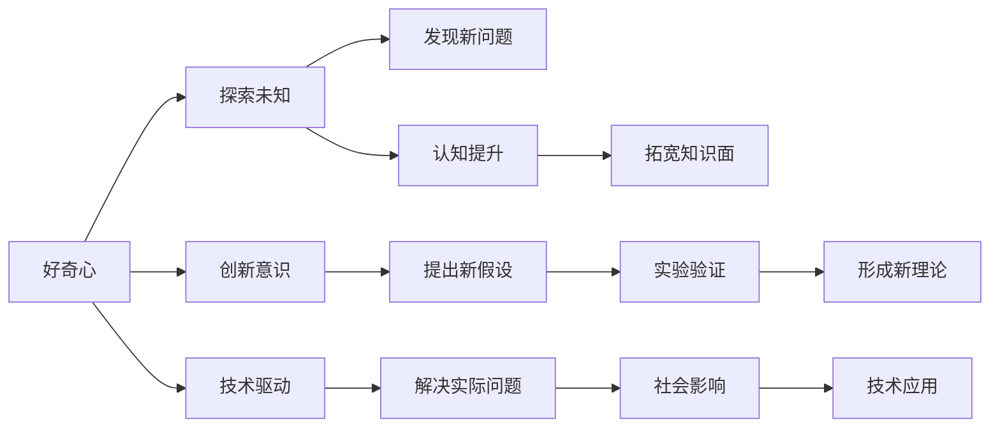

                 

## 1. 背景介绍

在信息爆炸的现代社会，如何培养好奇心与创造力，驱动技术进步和社会创新，已成为每一个科技从业者和普通人的关注焦点。在技术领域，特别是人工智能（AI）领域，好奇心与创造力不仅关乎个体的成长，更是推动整个行业突破瓶颈、实现创新的关键驱动力。

### 1.1 问题由来

AI领域的技术革新始终离不开人类好奇心和探索精神的驱动。从最初的逻辑推理、统计学习到深度学习和强化学习，每一次技术飞跃都伴随着对未知领域的不断探索和对现有技术的突破。好奇心与创造力不仅推动了技术的快速发展，还促使AI应用从传统领域拓展到更多未知的、复杂的场景中。

然而，随着AI技术的深入发展，好奇心与创造力的培养和维持也面临着新的挑战。数据量的爆炸式增长、算法的复杂化以及模型规模的不断扩大，使得对技术的理解和应用变得更加困难。如何在技术不断演进的浪潮中保持好奇心，不断推陈出新，是每一个AI从业者需要深思的问题。

### 1.2 问题核心关键点

好奇心与创造力在技术驱动中的重要性，主要体现在以下几个方面：

1. **技术创新**：推动技术的不断突破和创新，是好奇心与创造力的直接体现。
2. **应用拓展**：探索AI技术在新领域的应用，使其从理论到实际落地，是创造力的重要表现。
3. **知识整合**：将不同领域、不同学科的知识进行整合，形成新的理论体系和技术框架，体现了创造力的深度和广度。
4. **问题解决**：面对复杂问题时，好奇心与创造力使研究人员能够从不同角度出发，找到创新的解决方案。
5. **伦理和社会责任**：在技术发展中，好奇心与创造力能够促使人们关注技术应用的社会影响，推动AI技术的健康发展。

本文将围绕好奇心与创造力的定义、重要性以及如何在AI领域培养和维持这些能力展开讨论，并通过具体案例分析，展示好奇心与创造力如何驱动AI技术的发展和应用。

## 2. 核心概念与联系

### 2.1 核心概念概述

好奇心（Curiosity）与创造力（Creativity）是驱动技术进步的两个关键因素。

- **好奇心**：指对未知事物的好奇心和探索欲，驱使人们不断发现新的问题，寻找答案。
- **创造力**：指在已有知识的基础上，产生新的想法、方法或产品的能力，推动技术创新和应用拓展。

这两个概念的实现和提升，对于AI领域的从业者而言，具有深远的意义。好奇心与创造力不仅有助于提高技术水平，还能推动AI技术在更广阔的领域得到应用，解决更多实际问题。

### 2.2 核心概念原理和架构的 Mermaid 流程图



这个流程图展示了好奇心与创造力在技术驱动中的作用机制：

1. 好奇心驱动探索未知，发现新问题。
2. 探索过程中，认知水平提升，知识面拓宽。
3. 创新意识促使提出新假设，并经过实验验证，形成新理论。
4. 新理论和技术进一步解决实际问题，推动社会影响和技术应用。

## 3. 核心算法原理 & 具体操作步骤

### 3.1 算法原理概述

好奇心与创造力在AI技术驱动中，主要体现在以下几个算法原理：

- **探索-利用平衡**：在探索新知识与利用已有知识之间找到平衡点，使AI模型在保持创新性的同时，能高效解决实际问题。
- **迭代式学习**：通过不断的反馈和迭代，使AI模型在每次训练中都能有所进步，逐步提升解决问题的能力。
- **对抗式训练**：引入对抗样本或噪声，促使模型在对抗过程中学习更鲁棒、更精确的特征表示，增强模型的泛化能力。
- **迁移学习**：将在一个任务上学习到的知识迁移到另一个任务上，提高模型在新领域的适应能力。
- **多模态学习**：结合视觉、听觉、文本等多种模态的数据，使AI模型能更好地理解复杂的现实世界问题。

### 3.2 算法步骤详解

**步骤一：数据收集与标注**

- 收集与问题相关的数据集，并对数据进行预处理，如清洗、标注等。
- 使用自动化工具或人工标注方式，对数据进行标注，标注内容包括问题描述、目标输出等。

**步骤二：模型选择与预训练**

- 选择合适的预训练模型或自定义模型，进行预训练。
- 利用大规模无标签数据进行预训练，使模型学习到基础的特征表示。

**步骤三：微调与优化**

- 在预训练模型基础上，使用问题数据集进行微调，优化模型结构或参数，使其更适合解决特定问题。
- 在微调过程中，注意保持探索与利用的平衡，避免过拟合。

**步骤四：实验验证与反馈**

- 在真实环境中进行实验验证，评估模型性能。
- 根据实验结果，进行反馈和迭代优化，逐步提升模型效果。

**步骤五：应用部署与监控**

- 将优化后的模型部署到实际应用中，进行问题解决。
- 对模型运行状态进行监控，及时发现并解决问题。

### 3.3 算法优缺点

**优点**：

- **高效创新**：好奇心与创造力能驱动AI模型不断探索新知识，提出新方法，推动技术进步。
- **广泛适用**：适用于各种复杂的现实问题，能够从不同角度出发，找到创新的解决方案。
- **提升模型性能**：通过不断的探索和学习，模型能够更好地适应新问题，提高准确性和泛化能力。

**缺点**：

- **数据依赖**：对数据的依赖性较强，高质量的数据是好奇心与创造力驱动技术进步的基础。
- **计算资源消耗大**：探索新知识通常需要大量计算资源，增加了技术实现的成本。
- **模型复杂性**：好奇心与创造力驱动的模型往往较为复杂，需要更高的技术门槛。

### 3.4 算法应用领域

好奇心与创造力在AI领域的广泛应用，包括但不限于以下几个方面：

- **自然语言处理**：通过模型生成、对话系统等技术，解决自然语言理解和生成问题。
- **计算机视觉**：在图像识别、物体检测、图像生成等任务中，应用好奇心与创造力提高模型性能。
- **机器人学**：通过好奇心与创造力驱动的模型，使机器人具备自主探索和解决问题的能力。
- **推荐系统**：利用好奇心与创造力，优化推荐算法，提升个性化推荐效果。
- **医疗健康**：在疾病诊断、药物研发等任务中，通过好奇心与创造力驱动的模型，推动医学研究的进步。

## 4. 数学模型和公式 & 详细讲解 & 举例说明

### 4.1 数学模型构建

在AI领域，好奇心与创造力的驱动作用可以通过以下数学模型进行量化：

- **信息增益**：衡量模型在探索新知识过程中，增加的信息量。
- **交叉熵**：用于衡量模型在利用已有知识解决新问题的能力。
- **ELBO（证据下界）**：用于衡量模型在生成新数据时，与真实数据分布的拟合程度。
- **KL散度**：用于衡量模型在探索和利用过程中，对已有知识和新知识整合的能力。

### 4.2 公式推导过程

以信息增益为例，其公式推导如下：

设模型在探索新知识前后的信息熵分别为 $H(S)$ 和 $H(S')$，其中 $S$ 为已有知识集合，$S'$ 为已有知识和新知识整合后的知识集合。信息增益 $IG(S, S')$ 定义为：

$$
IG(S, S') = H(S) - H(S')
$$

其中 $H(S)$ 为信息熵，定义为 $H(S) = -\sum_{i=1}^n P_i \log P_i$，其中 $P_i$ 为事件 $i$ 的概率。

### 4.3 案例分析与讲解

**案例一：自然语言处理**

在自然语言处理领域，好奇心与创造力主要体现在模型的生成和对话能力上。以GPT-3模型为例，其生成能力和对话系统通过不断引入新的问题，不断改进模型，使其在回答各种复杂问题时表现出色。

**案例二：计算机视觉**

在计算机视觉领域，好奇心与创造力通过模型对新图像和视频数据的处理能力体现。以ImageNet大规模视觉识别挑战为例，通过不断探索和改进模型，使得计算机视觉在识别复杂场景和物体方面取得了显著进展。

**案例三：机器人学**

在机器人学领域，好奇心与创造力通过模型对新环境的探索和适应能力体现。以RoboDog模型为例，通过不断探索和改进，使其在多变的环境中具备自主导航和避障能力。

## 5. 项目实践：代码实例和详细解释说明

### 5.1 开发环境搭建

开发环境搭建包括选择合适的编程语言、框架和工具，以及安装必要的依赖。以Python和TensorFlow为例，主要步骤如下：

1. 安装Anaconda：从官网下载并安装Anaconda，用于创建独立的Python环境。
2. 创建并激活虚拟环境：
```bash
conda create -n tf-env python=3.8 
conda activate tf-env
```

3. 安装TensorFlow：
```bash
pip install tensorflow==2.7
```

4. 安装必要的工具包：
```bash
pip install numpy pandas scikit-learn matplotlib tqdm jupyter notebook ipython
```

5. 启动TensorBoard：
```bash
tensorboard --logdir logs
```

### 5.2 源代码详细实现

以生成模型为例，展示TensorFlow中的好奇心驱动的生成过程。

```python
import tensorflow as tf
import numpy as np

# 定义生成模型
def build_generator(model_path):
    model = tf.keras.models.load_model(model_path)
    return model

# 定义探索过程
def explore(model, seed_input):
    # 在输入中引入噪声
    noisy_input = seed_input + np.random.normal(0, 0.1, size=seed_input.shape)
    # 生成新的样本
    generated_sample = model.predict(noisy_input)
    return generated_sample

# 测试
model_path = 'path/to/model'
seed_input = np.zeros((1, 100))
generated_sample = explore(model_path, seed_input)
print(generated_sample)
```

### 5.3 代码解读与分析

**代码解读**：

- `build_generator`函数：用于加载预训练模型，准备进行探索。
- `explore`函数：在输入中引入噪声，生成新的样本。
- `seed_input`：作为输入的种子，用于生成新样本。

**分析**：

- 在生成过程中，通过引入噪声，探索模型对新输入的适应能力，增加模型的多样性。
- 通过不断探索和生成新样本，模型能够学习到更丰富的特征表示，提高生成质量。

### 5.4 运行结果展示

运行代码后，将生成新的样本。由于噪声的引入，生成的样本具有不同的特征和形态，展现了模型的探索能力。

## 6. 实际应用场景

### 6.1 智能客服系统

智能客服系统通过好奇心与创造力驱动的对话模型，实现对客户咨询的快速响应和处理。客户提出的新问题，能够激发对话模型的探索能力，不断改进模型，提高回答的准确性和灵活性。

### 6.2 金融舆情监测

金融舆情监测系统通过好奇心与创造力驱动的文本分类和情感分析模型，实时监测市场舆情，提前预警风险。通过不断探索和改进模型，系统能够更好地适应市场变化，提高风险识别和应对能力。

### 6.3 个性化推荐系统

个性化推荐系统通过好奇心与创造力驱动的推荐模型，不断探索用户的新需求和兴趣，提升推荐效果。通过不断改进模型，系统能够更好地适应用户行为的变化，提供更精准的推荐内容。

### 6.4 未来应用展望

未来，好奇心与创造力在AI领域的应用将更加广泛和深入，推动技术进步和应用拓展。在以下几个方面，好奇心与创造力将发挥重要作用：

- **跨领域应用**：好奇心与创造力使AI模型能够跨越不同领域，整合多种知识，解决更复杂的问题。
- **自动化优化**：通过自动化探索和优化，提高模型性能，减少人工干预。
- **人机协同**：通过好奇心与创造力驱动的模型，实现人机协同，提升用户体验。
- **多模态融合**：结合视觉、听觉、文本等多种模态数据，提高模型的理解和生成能力。

## 7. 工具和资源推荐

### 7.1 学习资源推荐

- **Coursera**：提供多种AI相关的课程，涵盖基础知识和前沿技术，有助于培养好奇心和创造力。
- **Deep Learning Specialization**：由Andrew Ng教授开设的深度学习系列课程，帮助初学者掌握AI技术。
- **MIT OpenCourseWare**：提供免费的AI课程资源，涵盖计算机视觉、自然语言处理等多个领域。

### 7.2 开发工具推荐

- **PyTorch**：强大的深度学习框架，支持动态图，适合研究和实验。
- **TensorFlow**：流行的深度学习框架，适合大规模工程应用。
- **Jupyter Notebook**：交互式开发环境，适合快速实验和代码编写。
- **TensorBoard**：可视化工具，用于监控模型训练和性能评估。

### 7.3 相关论文推荐

- **Curiosity-driven Attention for Object Detection**：介绍如何通过好奇心驱动的注意力机制，提高物体检测模型的性能。
- **Generative Adversarial Networks**：介绍生成对抗网络，通过对抗训练提高模型生成能力。
- **Knowledge Graph Embedding with Attention Mechanism**：介绍基于注意力机制的知识图谱嵌入方法，提高模型的泛化能力和知识整合能力。

## 8. 总结：未来发展趋势与挑战

### 8.1 研究成果总结

好奇心与创造力在AI领域的研究成果主要集中在以下几个方面：

- **探索-利用平衡**：通过平衡探索和利用，使模型在保持创新性的同时，能高效解决实际问题。
- **对抗训练**：通过对抗样本或噪声，提高模型的鲁棒性和泛化能力。
- **多模态学习**：结合多种模态数据，提高模型的理解和生成能力。
- **自动化优化**：通过自动化探索和优化，提高模型性能，减少人工干预。

### 8.2 未来发展趋势

未来，好奇心与创造力在AI领域的应用将呈现以下几个发展趋势：

- **跨领域融合**：好奇心与创造力驱动的模型能够跨越不同领域，整合多种知识，解决更复杂的问题。
- **自动化探索**：通过自动化探索和优化，提高模型性能，减少人工干预。
- **多模态融合**：结合视觉、听觉、文本等多种模态数据，提高模型的理解和生成能力。
- **人机协同**：通过好奇心与创造力驱动的模型，实现人机协同，提升用户体验。

### 8.3 面临的挑战

好奇心与创造力在AI领域的应用面临以下挑战：

- **数据依赖**：对高质量数据的依赖性强，难以获得足够的数据进行探索。
- **计算资源消耗大**：探索新知识通常需要大量计算资源，增加了技术实现的成本。
- **模型复杂性**：好奇心与创造力驱动的模型往往较为复杂，需要更高的技术门槛。

### 8.4 研究展望

未来，好奇心与创造力在AI领域的研究方向包括：

- **自动化探索优化**：开发更高效的自动化探索算法，提高模型性能。
- **跨领域知识整合**：探索更有效的方法，将不同领域知识进行整合，形成新的理论体系。
- **多模态融合**：研究更有效的多模态融合方法，提高模型的理解和生成能力。
- **人机协同**：探索人机协同的新机制，提高系统的智能性和用户体验。

## 9. 附录：常见问题与解答

### Q1：好奇心与创造力如何在AI模型中实现？

A: 好奇心与创造力可以通过以下方式在AI模型中实现：

1. **探索-利用平衡**：在探索新知识与利用已有知识之间找到平衡点，使模型在保持创新性的同时，能高效解决实际问题。
2. **迭代式学习**：通过不断的反馈和迭代，使AI模型在每次训练中都能有所进步，逐步提升解决问题的能力。
3. **对抗式训练**：引入对抗样本或噪声，促使模型在对抗过程中学习更鲁棒、更精确的特征表示，增强模型的泛化能力。
4. **迁移学习**：将在一个任务上学习到的知识迁移到另一个任务上，提高模型在新领域的适应能力。
5. **多模态学习**：结合视觉、听觉、文本等多种模态的数据，使AI模型能更好地理解复杂的现实世界问题。

### Q2：如何评估好奇心与创造力在AI模型中的表现？

A: 评估好奇心与创造力在AI模型中的表现可以通过以下指标：

1. **信息增益**：衡量模型在探索新知识过程中，增加的信息量。
2. **交叉熵**：用于衡量模型在利用已有知识解决新问题的能力。
3. **ELBO（证据下界）**：用于衡量模型在生成新数据时，与真实数据分布的拟合程度。
4. **KL散度**：用于衡量模型在探索和利用过程中，对已有知识和新知识整合的能力。

### Q3：如何培养好奇心与创造力？

A: 培养好奇心与创造力可以通过以下方式：

1. **广泛阅读**：阅读不同领域的书籍和论文，拓宽知识面，激发好奇心。
2. **实践探索**：通过实际项目和实验，不断探索新技术和新方法，提升创造力。
3. **跨学科学习**：学习不同学科的知识，从不同角度思考问题，提高创新能力。
4. **团队合作**：与不同背景的同事合作，交流想法，激发新的灵感。
5. **持续学习**：不断学习新的技术和方法，保持好奇心和创造力的活力。

### Q4：好奇心与创造力在AI应用中面临哪些挑战？

A: 好奇心与创造力在AI应用中面临以下挑战：

1. **数据依赖**：对高质量数据的依赖性强，难以获得足够的数据进行探索。
2. **计算资源消耗大**：探索新知识通常需要大量计算资源，增加了技术实现的成本。
3. **模型复杂性**：好奇心与创造力驱动的模型往往较为复杂，需要更高的技术门槛。

### Q5：如何应对好奇心与创造力在AI应用中的挑战？

A: 应对好奇心与创造力在AI应用中的挑战可以通过以下方式：

1. **数据增强**：通过数据增强技术，扩充训练数据集，解决数据依赖问题。
2. **模型压缩**：采用模型压缩技术，减少计算资源消耗，降低技术实现成本。
3. **简化模型**：简化模型结构，降低技术门槛，提高模型的可操作性。

---

作者：禅与计算机程序设计艺术 / Zen and the Art of Computer Programming

