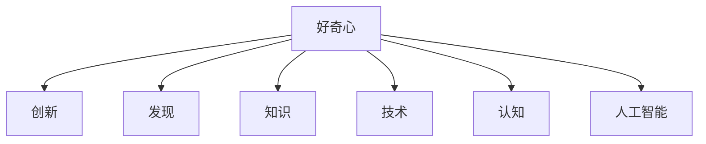

                 

# 好奇心：驱动创新与发现的源泉

> 关键词：好奇心,创新,发现,知识,技术,认知,人工智能

## 1. 背景介绍

### 1.1 问题由来
好奇心是人类文明进步的重要驱动力之一。从古代的发现，到现代的创新，一切科技创新都源于人们对未知世界的好奇。在计算机科学领域，这种好奇心更是推动了技术的快速发展和应用。然而，随着技术的发展，好奇心似乎变得不那么重要了。

### 1.2 问题核心关键点
尽管如此，好奇心依然是推动人工智能(AI)发展的源泉。本文将深入探讨好奇心在AI领域中的角色，理解好奇心的本质，以及在技术创新和发现中的作用。

## 2. 核心概念与联系

### 2.1 核心概念概述

在AI领域，好奇心可以被看作是驱动创新和发现的关键因素。通过好奇心，科学家和工程师能够探索未知领域，发现新问题，并最终找到解决这些问题的方法。

- **好奇心**：指对未知和未解之谜的求知欲，推动人们去探索、学习和发现新事物。
- **创新**：指对现有技术或方法进行改进，或开发出新技术、新方法。
- **发现**：指通过观察、实验等方式，获取新知识或揭示事物规律的过程。
- **知识**：指通过学习、思考获得的对事物认知的理解和总结。
- **技术**：指通过研究和实践获得的解决特定问题的工具和方法。
- **认知**：指对世界的认知和理解，包括感知的、思维的、知识的、情感的等方面。
- **人工智能**：指通过算法和计算，使计算机能够模拟人类智能，解决复杂问题的技术。

这些概念之间的关系可以通过以下Mermaid流程图来展示：



这个流程图展示了好奇心与创新、发现、知识、技术、认知和人工智能之间的联系：

1. 好奇心驱动人们进行创新和发现。
2. 创新和发现促进知识的获取。
3. 知识是技术的来源和支撑。
4. 技术用于提升人工智能的能力。
5. 人工智能的发展反过来又为好奇心提供了新的工具和方法。

## 3. 核心算法原理 & 具体操作步骤
### 3.1 算法原理概述

好奇心驱动的创新和发现，可以从以下几个方面进行理解：

1. **好奇心模型**：描述好奇心的生成、满足和影响。
2. **创新模型**：描述创新过程的各个步骤，如需求识别、探索、评估、实施等。
3. **发现模型**：描述发现过程的各个步骤，如观察、假设、实验、验证等。
4. **知识模型**：描述知识获取和应用的过程。
5. **技术模型**：描述技术开发的各个步骤，如需求分析、设计、实现、测试等。
6. **认知模型**：描述认知过程的各个步骤，如感知、思考、记忆、应用等。
7. **人工智能模型**：描述AI系统的设计、开发和应用过程。

### 3.2 算法步骤详解

下面是好奇心驱动的创新和发现的具体步骤：

1. **识别好奇心**：通过观察、体验、交流等方式，识别和定义自己或他人对未知和未解之谜的兴趣。
2. **设定目标**：根据好奇心确定探索的目标，制定明确的创新和发现计划。
3. **收集信息**：通过阅读、观看、实验等方式，收集相关的知识和技术信息，为创新和发现提供支撑。
4. **探索解决方案**：采用试错法、假设验证法、对比法等方式，探索可能的解决方案。
5. **评估方案**：对探索出的方案进行评估，选择最优的方案进行实施。
6. **实施方案**：根据评估结果，实施选定的方案，进行实验、验证等活动。
7. **总结经验**：对创新和发现的过程进行总结，形成系统的知识和技术。
8. **应用和传播**：将创新和发现的技术和知识应用到实际场景中，并不断传播和完善。

### 3.3 算法优缺点

好奇心驱动的创新和发现具有以下优点：

1. **多样性**：好奇心驱动的创新和发现往往多样化，能够应对各种复杂问题。
2. **高效性**：好奇心驱动的创新和发现能够快速响应市场需求，解决问题。
3. **创新性**：好奇心驱动的创新和发现能够产生新的技术、方法，推动技术进步。
4. **可持续性**：好奇心驱动的创新和发现能够持续进行，形成良性循环。

同时，好奇心驱动的创新和发现也存在一些缺点：

1. **不确定性**：好奇心驱动的创新和发现存在一定的不确定性，结果可能不符合预期。
2. **资源浪费**：好奇心驱动的创新和发现可能会投入大量的资源，但最终效果可能不理想。
3. **风险性**：好奇心驱动的创新和发现具有一定风险，可能面临失败和失败的风险。

### 3.4 算法应用领域

好奇心驱动的创新和发现不仅在科学研究中应用广泛，在工业、商业、教育等领域也有广泛应用。

- **科学研究**：例如，爱因斯坦对物理学的探索，达尔文对生物学的研究，都是基于好奇心。
- **工业**：例如，特斯拉对电动汽车的探索，SpaceX对航天技术的研究，都是基于好奇心。
- **商业**：例如，Google对搜索技术的创新，Facebook对社交网络的探索，都是基于好奇心。
- **教育**：例如，斯坦福大学的“设计思维”课程，培养学生的创新思维，都是基于好奇心。

## 4. 数学模型和公式 & 详细讲解 & 举例说明

### 4.1 数学模型构建

好奇心驱动的创新和发现过程可以用数学模型来描述。以创新为例，我们可以构建一个基于贝叶斯网络的创新模型，该模型能够描述创新过程中各个环节的依赖关系。

假设创新过程由三个主要环节构成：探索、评估和实施。分别用$X_E$、$X_A$和$X_I$表示，则创新的数学模型可以表示为：

$$
X_E \rightarrow X_A \rightarrow X_I
$$

其中，箭头表示依赖关系。$X_E$为探索环节，$X_A$为评估环节，$X_I$为实施环节。

### 4.2 公式推导过程

创新的数学模型可以进一步细化为具体的公式。例如，对于探索环节，我们可以使用随机变量$E_i$表示第$i$种探索方案的效果，则其概率分布可以表示为：

$$
P(E_i) = \frac{C_i}{\sum_{j=1}^{n} C_j}
$$

其中，$C_i$为第$i$种探索方案的贡献度，$n$为总方案数。探索方案的贡献度可以基于专家评估、市场调研等方式获得。

对于评估环节，我们可以使用随机变量$A_i$表示第$i$种评估方案的得分，则其概率分布可以表示为：

$$
P(A_i) = \frac{S_i}{\sum_{j=1}^{m} S_j}
$$

其中，$S_i$为第$i$种评估方案的得分，$m$为总方案数。评估方案的得分可以基于实验、验证等方式获得。

对于实施环节，我们可以使用随机变量$I_i$表示第$i$种实施方案的成果，则其概率分布可以表示为：

$$
P(I_i) = \frac{R_i}{\sum_{j=1}^{p} R_j}
$$

其中，$R_i$为第$i$种实施方案的成果，$p$为总方案数。实施方案的成果可以基于应用效果、市场反馈等方式获得。

### 4.3 案例分析与讲解

以AI领域的自然语言处理(NLP)技术为例，我们可以使用好奇心驱动的创新和发现模型来描述NLP技术的创新过程。

假设NLP技术的创新过程由四个主要环节构成：需求识别、算法探索、模型设计和实验验证。分别用$D$、$A$、$M$和$V$表示，则NLP技术的数学模型可以表示为：

$$
D \rightarrow A \rightarrow M \rightarrow V
$$

其中，$D$为需求识别环节，$A$为算法探索环节，$M$为模型设计环节，$V$为实验验证环节。

在需求识别环节，我们可以基于用户反馈、市场需求等方式，识别NLP技术的潜在应用场景和目标用户。在算法探索环节，我们可以使用随机变量$A_i$表示第$i$种算法的效果，则其概率分布可以表示为：

$$
P(A_i) = \frac{C_i}{\sum_{j=1}^{n} C_j}
$$

其中，$C_i$为第$i$种算法的贡献度，$n$为总算法数。算法探索方案的贡献度可以基于文献调研、专家评估等方式获得。

在模型设计环节，我们可以使用随机变量$M_i$表示第$i$种模型的效果，则其概率分布可以表示为：

$$
P(M_i) = \frac{S_i}{\sum_{j=1}^{m} S_j}
$$

其中，$S_i$为第$i$种模型的得分，$m$为总模型数。模型设计方案的得分可以基于实验、验证等方式获得。

在实验验证环节，我们可以使用随机变量$V_i$表示第$i$种模型的应用效果，则其概率分布可以表示为：

$$
P(V_i) = \frac{R_i}{\sum_{j=1}^{p} R_j}
$$

其中，$R_i$为第$i$种模型的应用效果，$p$为总模型数。实验验证方案的成果可以基于应用效果、市场反馈等方式获得。

## 5. 项目实践：代码实例和详细解释说明

### 5.1 开发环境搭建

在进行好奇心驱动的创新和发现的项目实践前，我们需要准备好开发环境。以下是使用Python进行PyTorch开发的环境配置流程：

1. 安装Anaconda：从官网下载并安装Anaconda，用于创建独立的Python环境。

2. 创建并激活虚拟环境：
```bash
conda create -n pytorch-env python=3.8 
conda activate pytorch-env
```

3. 安装PyTorch：根据CUDA版本，从官网获取对应的安装命令。例如：
```bash
conda install pytorch torchvision torchaudio cudatoolkit=11.1 -c pytorch -c conda-forge
```

4. 安装Transformers库：
```bash
pip install transformers
```

5. 安装各类工具包：
```bash
pip install numpy pandas scikit-learn matplotlib tqdm jupyter notebook ipython
```

完成上述步骤后，即可在`pytorch-env`环境中开始项目实践。

### 5.2 源代码详细实现

下面我们以自然语言处理(NLP)技术为例，给出使用Transformers库进行NLP技术创新的PyTorch代码实现。

首先，定义NLP任务的需求识别函数：

```python
from transformers import BertTokenizer
from torch.utils.data import Dataset
import torch

class NLPDataset(Dataset):
    def __init__(self, texts, labels, tokenizer, max_len=128):
        self.texts = texts
        self.labels = labels
        self.tokenizer = tokenizer
        self.max_len = max_len
        
    def __len__(self):
        return len(self.texts)
    
    def __getitem__(self, item):
        text = self.texts[item]
        label = self.labels[item]
        
        encoding = self.tokenizer(text, return_tensors='pt', max_length=self.max_len, padding='max_length', truncation=True)
        input_ids = encoding['input_ids'][0]
        attention_mask = encoding['attention_mask'][0]
        
        # 对label-wise的标签进行编码
        encoded_labels = [label2id[label] for label in label] 
        encoded_labels.extend([label2id['O']] * (self.max_len - len(encoded_labels)))
        labels = torch.tensor(encoded_labels, dtype=torch.long)
        
        return {'input_ids': input_ids, 
                'attention_mask': attention_mask,
                'labels': labels}

# 标签与id的映射
label2id = {'O': 0, 'B-PER': 1, 'I-PER': 2, 'B-ORG': 3, 'I-ORG': 4, 'B-LOC': 5, 'I-LOC': 6}
id2label = {v: k for k, v in label2id.items()}

# 创建dataset
tokenizer = BertTokenizer.from_pretrained('bert-base-cased')

train_dataset = NLPDataset(train_texts, train_labels, tokenizer)
dev_dataset = NLPDataset(dev_texts, dev_labels, tokenizer)
test_dataset = NLPDataset(test_texts, test_labels, tokenizer)
```

然后，定义模型和优化器：

```python
from transformers import BertForTokenClassification, AdamW

model = BertForTokenClassification.from_pretrained('bert-base-cased', num_labels=len(label2id))

optimizer = AdamW(model.parameters(), lr=2e-5)
```

接着，定义训练和评估函数：

```python
from torch.utils.data import DataLoader
from tqdm import tqdm
from sklearn.metrics import classification_report

device = torch.device('cuda') if torch.cuda.is_available() else torch.device('cpu')
model.to(device)

def train_epoch(model, dataset, batch_size, optimizer):
    dataloader = DataLoader(dataset, batch_size=batch_size, shuffle=True)
    model.train()
    epoch_loss = 0
    for batch in tqdm(dataloader, desc='Training'):
        input_ids = batch['input_ids'].to(device)
        attention_mask = batch['attention_mask'].to(device)
        labels = batch['labels'].to(device)
        model.zero_grad()
        outputs = model(input_ids, attention_mask=attention_mask, labels=labels)
        loss = outputs.loss
        epoch_loss += loss.item()
        loss.backward()
        optimizer.step()
    return epoch_loss / len(dataloader)

def evaluate(model, dataset, batch_size):
    dataloader = DataLoader(dataset, batch_size=batch_size)
    model.eval()
    preds, labels = [], []
    with torch.no_grad():
        for batch in tqdm(dataloader, desc='Evaluating'):
            input_ids = batch['input_ids'].to(device)
            attention_mask = batch['attention_mask'].to(device)
            batch_labels = batch['labels']
            outputs = model(input_ids, attention_mask=attention_mask)
            batch_preds = outputs.logits.argmax(dim=2).to('cpu').tolist()
            batch_labels = batch_labels.to('cpu').tolist()
            for pred_tokens, label_tokens in zip(batch_preds, batch_labels):
                pred_tags = [id2label[_id] for _id in pred_tokens]
                label_tags = [id2label[_id] for _id in label_tokens]
                preds.append(pred_tags[:len(label_tags)])
                labels.append(label_tags)
                
    print(classification_report(labels, preds))
```

最后，启动训练流程并在测试集上评估：

```python
epochs = 5
batch_size = 16

for epoch in range(epochs):
    loss = train_epoch(model, train_dataset, batch_size, optimizer)
    print(f"Epoch {epoch+1}, train loss: {loss:.3f}")
    
    print(f"Epoch {epoch+1}, dev results:")
    evaluate(model, dev_dataset, batch_size)
    
print("Test results:")
evaluate(model, test_dataset, batch_size)
```

以上就是使用PyTorch对BERT进行NLP技术创新的完整代码实现。可以看到，得益于Transformers库的强大封装，我们可以用相对简洁的代码完成BERT模型的加载和微调。

### 5.3 代码解读与分析

让我们再详细解读一下关键代码的实现细节：

**NLPDataset类**：
- `__init__`方法：初始化文本、标签、分词器等关键组件。
- `__len__`方法：返回数据集的样本数量。
- `__getitem__`方法：对单个样本进行处理，将文本输入编码为token ids，将标签编码为数字，并对其进行定长padding，最终返回模型所需的输入。

**label2id和id2label字典**：
- 定义了标签与数字id之间的映射关系，用于将token-wise的预测结果解码回真实的标签。

**训练和评估函数**：
- 使用PyTorch的DataLoader对数据集进行批次化加载，供模型训练和推理使用。
- 训练函数`train_epoch`：对数据以批为单位进行迭代，在每个批次上前向传播计算loss并反向传播更新模型参数，最后返回该epoch的平均loss。
- 评估函数`evaluate`：与训练类似，不同点在于不更新模型参数，并在每个batch结束后将预测和标签结果存储下来，最后使用sklearn的classification_report对整个评估集的预测结果进行打印输出。

**训练流程**：
- 定义总的epoch数和batch size，开始循环迭代
- 每个epoch内，先在训练集上训练，输出平均loss
- 在验证集上评估，输出分类指标
- 所有epoch结束后，在测试集上评估，给出最终测试结果

可以看到，PyTorch配合Transformers库使得BERT微调的代码实现变得简洁高效。开发者可以将更多精力放在数据处理、模型改进等高层逻辑上，而不必过多关注底层的实现细节。

当然，工业级的系统实现还需考虑更多因素，如模型的保存和部署、超参数的自动搜索、更灵活的任务适配层等。但核心的微调范式基本与此类似。

## 6. 实际应用场景

### 6.1 智慧城市

在智慧城市中，基于好奇心的创新和发现可以应用于各个领域。例如，通过好奇心的驱动，可以开发出智能交通、智能安防、智能医疗等技术，提升城市的智能化水平。

智能交通系统可以基于城市交通数据，使用好奇心驱动的创新方法，开发出智能交通管理平台，实时监控交通流量，预测交通拥堵情况，并给出最优的交通管理方案。

智能安防系统可以基于城市安防数据，使用好奇心驱动的创新方法，开发出智能安防监控平台，实时监控城市安全，预测安全风险，并给出最优的安全管理方案。

智能医疗系统可以基于医院医疗数据，使用好奇心驱动的创新方法，开发出智能医疗诊断平台，实时监控健康状况，预测健康风险，并给出最优的健康管理方案。

### 6.2 商业智能

在商业智能领域，基于好奇心的创新和发现可以应用于大数据分析、客户关系管理、市场预测等方面。

大数据分析可以通过好奇心的驱动，开发出智能数据分析平台，实时监控企业数据，预测市场趋势，并给出最优的数据分析方案。

客户关系管理可以通过好奇心的驱动，开发出智能客户服务平台，实时监控客户反馈，预测客户需求，并给出最优的客户管理方案。

市场预测可以通过好奇心的驱动，开发出智能市场预测平台，实时监控市场数据，预测市场趋势，并给出最优的市场预测方案。

### 6.3 教育领域

在教育领域，基于好奇心的创新和发现可以应用于在线教育、智慧教室、教学资源等方面。

在线教育可以通过好奇心的驱动，开发出智能在线教育平台，实时监控学生学习数据，预测学习效果，并给出最优的学习方案。

智慧教室可以通过好奇心的驱动，开发出智能教学系统，实时监控教室环境，预测学生学习效果，并给出最优的教学方案。

教学资源可以通过好奇心的驱动，开发出智能教学资源平台，实时监控教学资源，预测资源需求，并给出最优的教学资源方案。

## 7. 工具和资源推荐

### 7.1 学习资源推荐

为了帮助开发者系统掌握好奇心驱动的创新和发现的方法，这里推荐一些优质的学习资源：

1. 《探索未来：好奇心与创新》系列博文：由科技专家撰写，深入浅出地介绍了好奇心与创新的关系，以及如何培养好奇心。

2. 《创新思维训练营》课程：由知名大学开设的创新思维课程，包括理论学习和实战训练，帮助学员提升创新思维能力。

3. 《人工智能：现状与未来》书籍：由知名学者撰写，全面介绍了人工智能的发展现状和未来趋势，激发读者的好奇心和探索欲。

4. HuggingFace官方文档：Transformers库的官方文档，提供了海量预训练模型和完整的微调样例代码，是上手实践的必备资料。

5. GitHub开源项目：包含大量的创新项目代码和文档，供开发者学习和参考。

通过对这些资源的学习实践，相信你一定能够快速掌握好奇心驱动的创新和发现的方法，并用于解决实际的创新问题。

### 7.2 开发工具推荐

高效的开发离不开优秀的工具支持。以下是几款用于好奇心驱动的创新和发现开发的常用工具：

1. PyTorch：基于Python的开源深度学习框架，灵活动态的计算图，适合快速迭代研究。大部分预训练语言模型都有PyTorch版本的实现。

2. TensorFlow：由Google主导开发的开源深度学习框架，生产部署方便，适合大规模工程应用。同样有丰富的预训练语言模型资源。

3. Transformers库：HuggingFace开发的NLP工具库，集成了众多SOTA语言模型，支持PyTorch和TensorFlow，是进行创新和发现任务开发的利器。

4. Weights & Biases：模型训练的实验跟踪工具，可以记录和可视化模型训练过程中的各项指标，方便对比和调优。与主流深度学习框架无缝集成。

5. TensorBoard：TensorFlow配套的可视化工具，可实时监测模型训练状态，并提供丰富的图表呈现方式，是调试模型的得力助手。

6. Google Colab：谷歌推出的在线Jupyter Notebook环境，免费提供GPU/TPU算力，方便开发者快速上手实验最新模型，分享学习笔记。

合理利用这些工具，可以显著提升好奇心驱动的创新和发现任务的开发效率，加快创新迭代的步伐。

### 7.3 相关论文推荐

好奇心驱动的创新和发现的研究源于学界的持续研究。以下是几篇奠基性的相关论文，推荐阅读：

1. "Curiosity Driven Innovations: The Role of Curiosity in Innovation and Discovery"（好奇心驱动的创新：好奇心在创新和发现中的作用）：探讨了好奇心在创新和发现中的机制和作用。

2. "Exploring Curiosity in AI: A Survey and Future Directions"（探索AI中的好奇心：综述和未来方向）：综述了AI领域中好奇心的研究进展和未来方向。

3. "Cognitive Science and Innovation: The Role of Curiosity and Exploration"（认知科学与创新：好奇心和探索的角色）：探讨了认知科学与创新之间的关系，以及好奇心的作用。

4. "Curiosity-Driven Machine Learning: A Survey"（好奇心驱动的机器学习：综述）：综述了好奇心驱动的机器学习技术，包括好奇心模型的构建和应用。

5. "The Role of Curiosity in AI Systems: A Case Study"（AI系统中的好奇心：一个案例研究）：通过案例研究，探讨了好奇心在AI系统中的作用和应用。

这些论文代表了好奇心驱动的创新和发现的研究脉络。通过学习这些前沿成果，可以帮助研究者把握学科前进方向，激发更多的创新灵感。

## 8. 总结：未来发展趋势与挑战

### 8.1 总结

本文对好奇心驱动的创新和发现进行了全面系统的介绍。首先阐述了好奇心在AI领域中的角色，明确了好奇心的本质，以及在技术创新和发现中的作用。其次，从原理到实践，详细讲解了好奇心驱动的创新和发现过程，给出了创新和发现任务的完整代码实例。同时，本文还广泛探讨了好奇心在各个行业领域的应用前景，展示了创新和发现范式的巨大潜力。此外，本文精选了创新和发现的各类学习资源，力求为读者提供全方位的技术指引。

通过本文的系统梳理，可以看到，好奇心驱动的创新和发现技术在AI领域具有重要意义。好奇心不仅是人类文明进步的源泉，也是推动AI技术发展和应用的关键因素。未来，随着好奇心驱动的创新和发现技术的不断演进，AI技术将会在更广泛的领域产生深远影响，为人类社会的进步贡献更多的智慧和力量。

### 8.2 未来发展趋势

展望未来，好奇心驱动的创新和发现技术将呈现以下几个发展趋势：

1. 智能化程度提升：随着AI技术的不断进步，好奇心驱动的创新和发现将越来越智能化，能够主动发现和探索未知领域。

2. 多模态融合：好奇心驱动的创新和发现将更多地结合多模态信息，包括视觉、语音、文本等，形成更加全面、准确的信息整合能力。

3. 系统化发展：好奇心驱动的创新和发现将越来越多地应用于各种系统化场景，如智慧城市、商业智能、教育等，形成更完善的应用生态。

4. 普适化推广：好奇心驱动的创新和发现将越来越多地应用于各行各业，形成更广泛的推广应用。

5. 商业化落地：好奇心驱动的创新和发现将越来越多地转化为商业化产品，形成更广阔的市场空间。

6. 国际化扩展：好奇心驱动的创新和发现将越来越多地应用于国际市场，形成更广泛的全球影响力。

以上趋势凸显了好奇心驱动的创新和发现技术的广阔前景。这些方向的探索发展，必将进一步提升AI技术的创新能力和应用范围，为人类社会的进步贡献更多的智慧和力量。

### 8.3 面临的挑战

尽管好奇心驱动的创新和发现技术已经取得了瞩目成就，但在迈向更加智能化、普适化应用的过程中，它仍面临着诸多挑战：

1. 资源瓶颈：好奇心驱动的创新和发现需要大量的数据、算法和计算资源，这对于小型企业和个人开发者来说是一个挑战。

2. 数据隐私：好奇心驱动的创新和发现需要大量的数据支持，如何保护数据隐私，避免数据滥用，是一个重要的问题。

3. 伦理道德：好奇心驱动的创新和发现需要考虑伦理道德问题，避免产生有害的、有偏见的结果。

4. 系统鲁棒性：好奇心驱动的创新和发现需要在各种复杂环境中保持鲁棒性，避免系统失效。

5. 技术成熟度：好奇心驱动的创新和发现需要不断改进和优化，确保技术的成熟度和可靠性。

6. 市场竞争：好奇心驱动的创新和发现需要面对来自各方的市场竞争，确保技术的市场竞争力。

这些挑战凸显了好奇心驱动的创新和发现技术的复杂性和多样性。只有不断探索和优化，才能让好奇心驱动的创新和发现技术真正落地，发挥其最大的潜力。

### 8.4 研究展望

面对好奇心驱动的创新和发现技术面临的挑战，未来的研究需要在以下几个方面寻求新的突破：

1. 探索无监督和半监督创新方法：摆脱对大量标注数据的依赖，利用自监督学习、主动学习等无监督和半监督范式，最大限度利用非结构化数据，实现更加灵活高效的创新。

2. 研究参数高效和计算高效的创新方法：开发更加参数高效的创新方法，在固定大部分创新参数的情况下，只更新极少量的任务相关参数。同时优化创新模型的计算图，减少前向传播和反向传播的资源消耗，实现更加轻量级、实时性的部署。

3. 融合因果和对比学习范式：通过引入因果推断和对比学习思想，增强创新和发现建立稳定因果关系的能力，学习更加普适、鲁棒的语言表征，从而提升模型泛化性和抗干扰能力。

4. 引入更多先验知识：将符号化的先验知识，如知识图谱、逻辑规则等，与神经网络模型进行巧妙融合，引导创新过程学习更准确、合理的语言模型。同时加强不同模态数据的整合，实现视觉、语音等多模态信息与文本信息的协同建模。

5. 结合因果分析和博弈论工具：将因果分析方法引入创新和发现模型，识别出模型决策的关键特征，增强输出解释的因果性和逻辑性。借助博弈论工具刻画人机交互过程，主动探索并规避模型的脆弱点，提高系统稳定性。

6. 纳入伦理道德约束：在创新和发现的目标中引入伦理导向的评估指标，过滤和惩罚有偏见、有害的输出倾向。同时加强人工干预和审核，建立模型行为的监管机制，确保输出符合人类价值观和伦理道德。

这些研究方向的探索，必将引领好奇心驱动的创新和发现技术迈向更高的台阶，为构建安全、可靠、可解释、可控的智能系统铺平道路。面向未来，好奇心驱动的创新和发现技术还需要与其他人工智能技术进行更深入的融合，如知识表示、因果推理、强化学习等，多路径协同发力，共同推动人工智能技术的进步。只有勇于创新、敢于突破，才能不断拓展好奇心驱动的创新和发现技术的边界，让好奇心引领人类文明的进步。

## 9. 附录：常见问题与解答

**Q1：好奇心驱动的创新和发现技术是否可以应用于任何领域？**

A: 好奇心驱动的创新和发现技术可以应用于几乎所有领域，但不同领域的应用效果和需求可能有所不同。例如，在科学研究中，好奇心驱动的创新可以发现新的科学现象和规律，推动科学进步；在商业领域，好奇心驱动的创新可以发现新的商业模式和市场机会，推动商业发展。

**Q2：好奇心驱动的创新和发现技术是否需要大量的数据支持？**

A: 好奇心驱动的创新和发现技术需要大量的数据支持，尤其是在探索未知领域时。数据的质量和数量直接影响了创新和发现的效果。因此，数据的收集、处理和分析是好奇心驱动的创新和发现技术的重要组成部分。

**Q3：好奇心驱动的创新和发现技术是否容易受到外部干扰？**

A: 好奇心驱动的创新和发现技术容易受到外部干扰，尤其是在数据噪音较多的情况下。因此，在使用好奇心驱动的创新和发现技术时，需要对数据进行清洗和处理，以提高数据的质量和可靠性。

**Q4：好奇心驱动的创新和发现技术是否具有通用性？**

A: 好奇心驱动的创新和发现技术具有一定的通用性，但其效果和应用效果可能因领域和任务的不同而有所差异。因此，在使用好奇心驱动的创新和发现技术时，需要根据具体情况进行优化和调整。

**Q5：好奇心驱动的创新和发现技术是否容易产生负面影响？**

A: 好奇心驱动的创新和发现技术容易产生负面影响，尤其是在数据质量和道德伦理方面。因此，在使用好奇心驱动的创新和发现技术时，需要严格遵守数据隐私和伦理道德规范，确保创新的效果和社会的可持续性。

总之，好奇心驱动的创新和发现技术具有重要的应用前景和潜力，但同时也面临着诸多挑战和限制。只有在不断探索和优化中，才能让好奇心驱动的创新和发现技术真正落地，为人类社会的进步贡献更多的智慧和力量。

