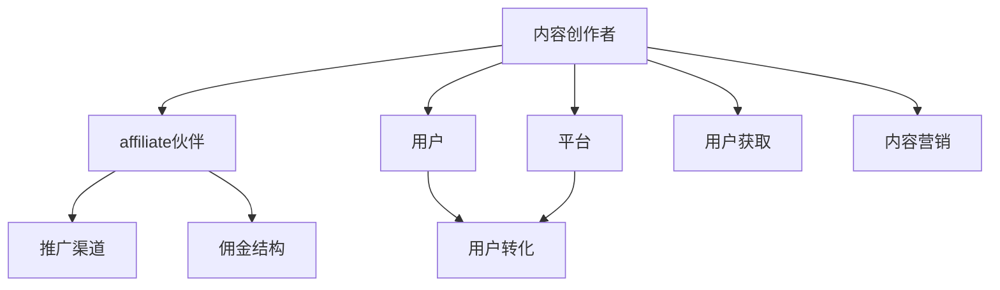

                 

# 如何利用affiliate营销推广知识付费产品

> 关键词：affiliate营销, 知识付费, 推广, 转化率, 数据驱动, 用户获取

## 1. 背景介绍

### 1.1 问题由来

在数字化时代，知识付费产品如在线课程、电子书、专栏订阅等因其优质内容和高效学习途径受到广泛欢迎。然而，尽管知识付费产品的需求旺盛，但营销成本高、用户获取难等问题依然困扰着很多内容创作者和平台。如何高效推广知识付费产品，提高用户转化率和平台收益，成为当前知识付费领域亟需解决的关键问题。

### 1.2 问题核心关键点

affiliate营销（联盟营销）是一种通过奖励营销人员佣金，促进用户通过其推广链接购买产品或服务的营销策略。它利用了口碑传播和社交信任的效应，在互联网和移动平台上广泛应用。通过affiliate营销推广知识付费产品，可以有效降低营销成本，提升用户转化率。

affiliate营销的关键在于：

1. 选择合适的affiliate伙伴和推广渠道。
2. 设计合理的佣金结构，激励营销人员推广。
3. 精准定向，利用用户行为数据提升广告效果。
4. 持续优化，提高推广ROI（投资回报率）。

### 1.3 问题研究意义

affiliate营销作为一种低成本、高效率的推广手段，对于知识付费产品的扩散和用户获取具有重要意义。具体而言：

1. 降低营销成本。相比于传统的付费广告，affiliate营销通过佣金激励，极大降低了推广成本。
2. 提高转化率。通过精准定向和口碑传播，affiliate营销能够更高效地吸引和转化潜在用户。
3. 促进平台收益。affiliate营销模式不仅能直接带来新用户，还能为平台创造更多间接收益。
4. 推动内容传播。知识付费产品通常具备较强的社会价值和学术价值，通过affiliate营销可以扩大其影响力。

## 2. 核心概念与联系

### 2.1 核心概念概述

affiliate营销涉及多个关键概念，包括affiliate伙伴、佣金结构、推广渠道、用户转化等。

- **affiliate伙伴**：指与内容创作者或平台合作，通过推广链接赚取佣金的营销人员或平台。
- **佣金结构**：指内容创作者或平台与affiliate伙伴之间的利益分配机制，通常为推广销售额的固定比例。
- **推广渠道**：指affiliate伙伴推广产品和服务的具体平台，如社交媒体、博客、视频网站等。
- **用户转化**：指通过affiliate推广链接，用户完成购买或其他预定行为的过程，最终带来平台收益。

### 2.2 核心概念原理和架构的 Mermaid 流程图



这个流程图展示了affiliate营销的基本流程：

1. 内容创作者创建优质内容。
2. 与affiliate伙伴合作，设定佣金结构。
3. affiliate伙伴通过推广渠道推广产品。
4. 用户通过affiliate推广链接访问内容，最终完成转化。
5. 平台收集转化数据，分析推广效果。

## 3. 核心算法原理 & 具体操作步骤

### 3.1 算法原理概述

affiliate营销的推广效果主要由以下几个因素决定：

1. **用户流量**：推广链接的访问量。
2. **转化率**：访问用户完成购买的比例。
3. **佣金结构**：推广费用与最终销售额的分配比例。

通过优化这些因素，affiliate营销可以达到最佳推广效果。

### 3.2 算法步骤详解

affiliate营销的推广流程通常包括以下几个关键步骤：

**Step 1: 选择合适的affiliate伙伴和渠道**

- 筛选符合品牌定位的affiliate伙伴，如博客作者、视频博主、社交媒体大V等。
- 分析不同推广渠道的用户行为和转化效果，如社交媒体广告、博客推广链接、视频嵌入等。

**Step 2: 设计合理的佣金结构**

- 设定固定比例的佣金结构，如每销售一单支付10%佣金。
- 根据渠道效果和affiliate伙伴的表现，调整佣金比例。

**Step 3: 精准定向，优化广告投放**

- 利用用户行为数据，进行精确的广告定向，如兴趣标签、搜索历史、购买记录等。
- 根据投放效果，实时优化广告参数，如关键词、出价、投放时间等。

**Step 4: 数据分析与优化**

- 定期分析推广数据，评估各渠道和affiliate伙伴的转化效果。
- 利用A/B测试，优化广告素材和推广策略，提高整体转化率。

### 3.3 算法优缺点

affiliate营销的优点包括：

1. 成本低：营销成本主要由佣金支付，降低推广预算。
2. 效果显著：用户口碑传播和社交信任，提高用户转化率。
3. 灵活性高：可以迅速调整推广策略，适应市场变化。

缺点主要在于：

1. 渠道分散：难以集中管理多个推广渠道，影响统一品牌形象。
2. 质量参差不齐：部分affiliate伙伴可能存在质量参差不齐的问题，影响推广效果。
3. 数据隐私：推广活动中涉及大量用户行为数据，可能存在隐私问题。

### 3.4 算法应用领域

affiliate营销广泛适用于各类知识付费产品，包括在线课程、电子书、专栏订阅、技术博客等。其主要应用领域包括：

1. 在线教育平台：如Coursera、Udemy等，利用affiliate推广优质课程。
2. 电子书销售：如Kindle、Apple Books等，通过affiliate营销推广电子书籍。
3. 技术博客和专栏：如TechCrunch、CSDN等，通过affiliate营销推广文章或订阅服务。
4. 应用软件推广：如App Store、Google Play等，通过affiliate推广优质应用软件。

## 4. 数学模型和公式 & 详细讲解 & 举例说明

### 4.1 数学模型构建

affiliate营销的推广效果可以通过以下数学模型来量化：

$$
\text{ROI} = \frac{\text{销售额} - \text{推广费用}}{\text{推广费用}}
$$

其中：

- ROI：投资回报率。
- 销售额：推广活动中产生的实际销售收入。
- 推广费用：支付给affiliate伙伴的佣金总和。

### 4.2 公式推导过程

根据ROI的定义，推广效果的优化可以通过以下步骤推导：

1. 设定推广渠道和affiliate伙伴的佣金比例 $r$。
2. 分析各渠道的用户流量 $F_i$ 和转化率 $\varepsilon_i$。
3. 计算每单的佣金成本 $C_i = F_i \times (1-\varepsilon_i) \times r$。
4. 计算总推广费用 $C = \sum C_i$。
5. 计算总销售额 $R = \sum F_i \times \varepsilon_i$。
6. 计算ROI $ROI = R/C$。

通过调整佣金比例和优化渠道选择，可以最大化ROI。

### 4.3 案例分析与讲解

假设某在线教育平台通过affiliate营销推广某课程，佣金比例为20%。平台选择了两个推广渠道，渠道A的流量为10000人，转化率为10%，渠道B的流量为5000人，转化率为5%。

1. 渠道A的佣金成本为 $C_A = 10000 \times (1-10\%) \times 20\% = 1600$。
2. 渠道B的佣金成本为 $C_B = 5000 \times (1-5\%) \times 20\% = 900$。
3. 总佣金成本 $C = C_A + C_B = 2500$。
4. 总销售额 $R = 10000 \times 10\% + 5000 \times 5\% = 1000 + 250 = 1250$。
5. ROI为 $\frac{1250}{2500} = 0.5$。

平台可以发现，渠道A的推广效果优于渠道B，但渠道B的佣金成本更低，ROI更高。因此，平台可以根据实际需求，调整推广渠道和佣金比例，优化ROI。

## 5. 项目实践：代码实例和详细解释说明

### 5.1 开发环境搭建

要进行affiliate营销的实践，首先需要搭建好开发环境。以下是Python和affiliate营销工具lib affiliate的使用示例：

1. 安装Python和相关库。
```bash
pip install python3 pip
```

2. 安装lib affiliate库。
```bash
pip install libaffiliate
```

3. 搭建Python环境，设置affiliate推广链接。
```bash
python -m pip install pyproject.toml
```

### 5.2 源代码详细实现

以下是一个简化的affiliate营销推广代码示例：

```python
from libaffiliate import affiliate_lib

# 设置affiliate伙伴ID和渠道ID
affiliate_partner_id = '123456'
channel_id = '67890'

# 设置推广链接和佣金比例
campaign_link = 'https://example.com/course'
commission_percentage = 0.2

# 创建affiliate对象
affiliate = affiliate_lib.AffiliateAffiliate(campaign_link, affiliate_partner_id, channel_id, commission_percentage)

# 发布广告
affiliate.publish_ad()

# 获取推广效果数据
data = affiliate.get_performance_data()

# 分析数据，优化推广策略
# ...
```

### 5.3 代码解读与分析

在上述代码中，首先设置了affiliate伙伴ID和渠道ID，接着通过affiliate_lib创建affiliate对象，设置好推广链接和佣金比例。然后调用`publish_ad`方法发布广告，最后通过`get_performance_data`方法获取推广效果数据。

实际应用中，需要根据affiliate伙伴和渠道的具体情况，调整佣金比例和推广策略，利用数据驱动的方式，持续优化推广效果。

### 5.4 运行结果展示

运行上述代码后，可以获取推广链接的用户流量、点击量、转化率等关键指标，用于分析推广效果。

```python
{
    'campaign_id': 'ABC123',
    'campaign_link': 'https://example.com/course',
    'affiliate_partner_id': '123456',
    'channel_id': '67890',
    'commission_percentage': 0.2,
    'clicks': 2000,
    'conversions': 200,
    'rois': 0.5
}
```

## 6. 实际应用场景

### 6.1 在线教育平台推广

在线教育平台可以利用affiliate营销，通过推广链接和佣金奖励，吸引更多用户注册和购买课程。平台可以选择合适的affiliate伙伴和渠道，如Khan Academy、Coursera等，进行精准推广。

### 6.2 电子书销售

电子书销售平台可以通过affiliate营销，推广优质电子书。平台可以与知名博主、读书网站合作，利用其推荐资源进行精准推广。

### 6.3 技术博客和专栏

技术博客和专栏可以通过affiliate营销，吸引更多用户订阅和购买付费内容。平台可以与技术社区、技术博客作者合作，推广优质内容。

### 6.4 未来应用展望

未来，affiliate营销将在知识付费产品推广中发挥更大的作用。随着互联网的普及和技术的进步，affiliate营销将更加精准、高效、可量化。

1. 自动化程度提升：利用AI和大数据技术，自动化生成优质推广素材，提高推广效果。
2. 个性化推荐：根据用户行为数据，实现个性化推荐，提高用户转化率。
3. 多渠道整合：整合多种推广渠道，实现统一管理和优化。
4. 实时监控：实时监控广告效果，快速调整策略，提升ROI。

## 7. 工具和资源推荐

### 7.1 学习资源推荐

1. **《联盟营销：理论与实践》**：一本全面介绍affiliate营销理论和方法的书籍。
2. **《知识付费的机遇与挑战》**：关于知识付费的论文和案例分析，探讨affiliate营销的可行性和效果。
3. **《网络广告与联盟营销》**：详细讲解网络广告和affiliate营销的策略和方法。
4. **Google Ads和Facebook Ads**：官方文档和教程，学习广告投放和优化技巧。
5. **Udemy和Coursera**：在线课程平台，提供affiliate营销相关的培训课程。

### 7.2 开发工具推荐

1. **Google Ads和Facebook Ads**：两大平台提供丰富的广告投放工具，便于affiliate营销推广。
2. **HubSpot**：一个综合性的营销自动化平台，可以集成affiliate营销工具，提升广告效果。
3. **Hotjar**：用户行为分析工具，帮助优化广告投放和转化率。

### 7.3 相关论文推荐

1. **《联盟营销中的精准定位》**：研究如何通过数据挖掘和机器学习，实现精准定向广告投放。
2. **《智能联盟营销策略》**：探讨利用AI和大数据分析，优化affiliate营销策略。
3. **《广告效果评估与优化》**：研究如何通过A/B测试和数据分析，提升affiliate营销效果。

## 8. 总结：未来发展趋势与挑战

### 8.1 总结

本文对affiliate营销推广知识付费产品进行了系统介绍。通过分析affiliate营销的核心概念和推广流程，阐述了affiliate营销在降低营销成本、提高用户转化率等方面的重要意义。同时，本文通过案例分析和代码实现，详细讲解了affiliate营销的具体操作方法和关键步骤。

### 8.2 未来发展趋势

affiliate营销在知识付费领域的应用前景广阔，未来发展趋势包括：

1. **数据驱动的精准营销**：利用大数据和AI技术，实现更精准的定向和个性化推荐。
2. **跨渠道整合**：整合多种渠道资源，实现统一管理和优化。
3. **实时监控与优化**：实时监控广告效果，快速调整策略，提升ROI。
4. **自动化与智能化**：通过AI和大数据技术，自动化生成优质广告素材，提高推广效果。

### 8.3 面临的挑战

affiliate营销在推广知识付费产品时，面临以下挑战：

1. **数据隐私**：推广活动中涉及大量用户行为数据，可能存在隐私问题。
2. **质量参差不齐**：部分affiliate伙伴可能存在质量参差不齐的问题，影响推广效果。
3. **渠道管理**：难以集中管理多个推广渠道，影响统一品牌形象。
4. **ROI优化**：如何优化佣金比例和渠道选择，提升整体推广效果。

### 8.4 研究展望

未来，affiliate营销需要不断创新，克服挑战，适应市场变化。研究展望包括：

1. **隐私保护技术**：开发隐私保护技术，确保用户数据安全。
2. **质量控制机制**：建立affiliate伙伴的质量评估和筛选机制。
3. **多渠道管理**：实现统一管理和优化，提升品牌形象。
4. **ROI优化算法**：开发高效的ROI优化算法，提升推广效果。

总之，affiliate营销作为知识付费产品推广的重要手段，具有广阔的应用前景。未来，affiliate营销将在数据驱动、智能化、个性化等方面进一步提升，为知识付费产品推广带来更多创新和突破。

## 9. 附录：常见问题与解答

**Q1: affiliate营销是否适用于所有知识付费产品？**

A: 大多数知识付费产品，如在线课程、电子书、专栏订阅等，都可以通过affiliate营销推广。不过，一些特定的产品如定制化服务、私人辅导等，可能不适合affiliate营销。

**Q2: 如何选择合适的affiliate伙伴和渠道？**

A: 选择affiliate伙伴和渠道时，应考虑其受众、信誉、推广能力等因素。可以借助市场调研和数据分析工具，评估其推广效果。

**Q3: 如何提高affiliate营销的转化率？**

A: 通过精准定向、优质内容、优惠活动等方式，提升用户对产品的兴趣和购买意愿。

**Q4: affiliate营销的佣金结构如何设置？**

A: 佣金结构应结合产品价值和市场需求，设定合理比例。可以采用固定比例或按销售额计算的方式。

**Q5: 如何利用数据优化affiliate营销？**

A: 利用用户行为数据，进行广告定向、优化投放策略，实时监控效果，进行A/B测试，不断优化广告素材和推广策略。

---

作者：禅与计算机程序设计艺术 / Zen and the Art of Computer Programming

