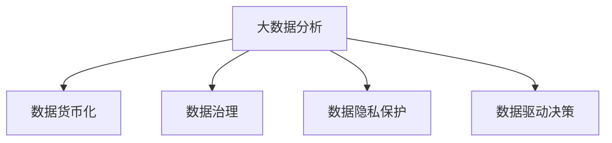

                 

# 如何利用技术能力进行数据变现

> 关键词：
- 数据变现
- 大数据分析
- 数据货币化
- 数据驱动决策
- 数据隐私保护
- 数据价值最大化
- 数据治理

## 1. 背景介绍

### 1.1 问题由来
在数字经济时代，数据成为了重要的资产，如何高效利用数据、实现数据变现，已成为各行业关注的重点。数据变现（Data Monetization）指的是通过技术手段将数据转化为具有经济价值的产品或服务的过程，其目的在于提升数据的使用效率，创造更多的商业价值。大数据分析、机器学习、人工智能等技术的飞速发展，为数据变现提供了强有力的技术支撑。

### 1.2 问题核心关键点
数据变现的核心关键点包括：
- 数据质量管理：确保数据准确、完整、一致，避免数据噪声和偏差影响分析结果。
- 数据治理：通过数据标注、分类、清洗等措施，提高数据的可用性和可理解性。
- 数据分析与建模：运用大数据分析、机器学习等技术，发现数据中的规律和趋势，构建数据模型。
- 数据货币化：将数据模型转化为具体产品或服务，如推荐系统、智能客服、智能营销等。
- 数据隐私保护：在数据变现过程中，保障用户数据的安全性和隐私权，避免数据滥用和数据泄露。

这些关键点相互关联，形成一个完整的数据变现流程，为数据的深度挖掘和商业化应用提供保障。

### 1.3 问题研究意义
数据变现对企业来说具有重要的战略意义：
- 提升竞争力：通过数据驱动决策，企业可以更精准地把握市场动态，制定更有效的业务策略。
- 创造收入：通过数据产品或服务，企业可以在不增加硬件和人力成本的情况下，获得新的收入来源。
- 降低风险：大数据分析和机器学习可以帮助企业识别潜在风险，提前采取应对措施，减少损失。
- 促进创新：数据变现推动了技术创新和业务模式的变革，加速了各行业的数字化转型。

通过深入研究数据变现的技术方法和实际应用，可以帮助企业更好地理解和利用数据，实现数据价值的最大化。

## 2. 核心概念与联系

### 2.1 核心概念概述

为更好地理解数据变现的过程，本节将介绍几个核心概念及其相互关系：

- 大数据分析（Big Data Analytics）：指利用大数据技术，从海量数据中提取有用信息、发现规律和趋势的过程。
- 数据货币化（Data Monetization）：指将数据转化为具有经济价值的产品或服务的过程。
- 数据治理（Data Governance）：通过一系列政策和措施，确保数据的质量、安全性和合规性，保障数据治理的长期可持续性。
- 数据隐私保护（Data Privacy Protection）：在数据收集、存储、使用和共享过程中，保护个人隐私权，避免数据滥用和泄露。
- 数据驱动决策（Data-Driven Decision Making）：利用数据分析结果，辅助企业做出更加科学、精准的商业决策。

这些核心概念之间存在密切联系，共同构成了数据变现的生态系统，其逻辑关系可以通过以下Mermaid流程图展示：



这个流程图展示了大数据分析与其他数据变现核心概念之间的逻辑关系：

1. 大数据分析是数据变现的基础，通过对海量数据的深度挖掘，发现有用的信息。
2. 数据治理和数据隐私保护是数据变现的前提，确保数据的质量和安全。
3. 数据驱动决策是数据变现的指导思想，通过数据分析结果指导决策，提升企业竞争力。

## 3. 核心算法原理 & 具体操作步骤
### 3.1 算法原理概述

数据变现的过程可以分为数据准备、数据分析、数据建模、数据货币化、数据治理和数据隐私保护等几个步骤。其中，数据分析和数据建模是数据变现的核心环节，其主要任务是从数据中提取有用信息，构建数据模型。

以下是对数据变现过程的详细介绍：

### 3.2 算法步骤详解

数据变现的一般流程包括：

**Step 1: 数据准备**
- 数据收集：从内部系统和外部渠道收集各种结构化和非结构化数据。
- 数据清洗：去除数据中的噪声、重复和错误，确保数据的准确性和完整性。
- 数据标注：对数据进行标注，如分类、实体识别、情感分析等，提升数据的可用性和可理解性。
- 数据存储：将处理后的数据存放到数据仓库或数据湖中，便于后续分析和应用。

**Step 2: 数据分析**
- 探索性数据分析（EDA）：通过可视化工具和统计分析方法，了解数据的基本特征和分布情况。
- 预测建模：利用机器学习算法，构建预测模型，预测未来趋势和行为。
- 关联分析：通过数据挖掘技术，发现数据之间的关联性和模式，如聚类、关联规则等。

**Step 3: 数据建模**
- 特征工程：选择合适的特征，构建特征集合，提升模型的预测能力。
- 模型选择：选择适当的机器学习算法，如回归、分类、聚类等，构建数据模型。
- 模型训练和评估：使用训练集训练模型，在验证集上评估模型的性能，调整模型参数。

**Step 4: 数据货币化**
- 产品设计：根据数据模型和业务需求，设计具体的数据产品或服务，如推荐系统、智能客服、智能营销等。
- 产品开发：使用数据产品开发工具和技术，实现数据产品的功能和性能。
- 产品部署：将数据产品部署到实际应用环境中，进行测试和优化。

**Step 5: 数据治理**
- 数据质量管理：监控数据质量，及时发现和修复数据问题，确保数据的准确性和完整性。
- 数据访问控制：限制数据访问权限，防止未授权人员访问和修改数据。
- 数据生命周期管理：管理数据从创建到销毁的全过程，确保数据的有效性和可追溯性。

**Step 6: 数据隐私保护**
- 数据加密：对敏感数据进行加密处理，防止数据泄露和窃取。
- 数据匿名化：对数据进行匿名化处理，保护个人隐私权。
- 数据合规性：确保数据处理和使用的过程符合相关法律法规和行业标准，如GDPR、CCPA等。

### 3.3 算法优缺点

数据变现技术具有以下优点：
- 提升决策效率：通过数据分析和建模，辅助企业做出更科学、精准的决策。
- 创造新的收入来源：数据变现可以带来新的业务模式和收入渠道，增加企业的盈利能力。
- 降低风险：数据分析可以帮助企业识别潜在的风险和机会，提前采取应对措施，减少损失。

但同时也存在一些缺点：
- 技术复杂度高：数据变现涉及大量数据处理和建模工作，需要较高的技术水平和经验。
- 数据隐私风险：数据变现过程中可能会涉及敏感数据，需严格遵守数据隐私保护法规，防止数据滥用和泄露。
- 成本投入大：数据变现需要投入大量的技术和人力资源，成本较高。

### 3.4 算法应用领域

数据变现技术在多个领域得到了广泛应用，具体包括：

- 金融领域：利用数据分析和建模，预测股市趋势、评估信用风险、开发智能投顾等。
- 零售行业：通过推荐系统、智能客服、消费者行为分析等，提升客户体验，增加销售额。
- 医疗健康：利用数据分析和预测模型，优化诊疗方案、个性化健康管理等。
- 制造行业：通过数据分析和智能制造系统，提升生产效率，降低运营成本。
- 物流行业：利用数据分析和预测模型，优化物流路径，提高配送效率。

## 4. 数学模型和公式 & 详细讲解  
### 4.1 数学模型构建

数据变现过程涉及大量数学模型和公式，以下我们将详细介绍其中的几个关键模型：

**回归模型**
- 假设数据集中存在线性关系 $y = \beta_0 + \beta_1x_1 + \cdots + \beta_nx_n + \epsilon$，其中 $y$ 为目标变量，$x_1,\cdots,x_n$ 为特征变量，$\epsilon$ 为误差项。
- 最小二乘法估计模型参数：
$$\beta = \arg\min_{\beta} \sum_{i=1}^n (y_i - \beta_0 - \beta_1x_{1i} - \cdots - \beta_nx_{ni})^2$$

**分类模型**
- 假设数据集中存在分类关系，可以通过逻辑回归、支持向量机等模型进行建模。
- 逻辑回归模型：$P(y|x) = \frac{1}{1+\exp(-\beta_0 - \beta_1x_1 - \cdots - \beta_nx_n)}$
- 支持向量机模型：$y = \sum_{i=1}^n w_i x_i + b$

**聚类模型**
- K-means聚类算法：将数据集分成 $k$ 个簇，簇心 $C_i$ 满足：$\sum_{x_j \in C_i} \Vert x_j - C_i \Vert^2$ 最小化。

**关联规则**
- 利用Apriori算法，从数据集中发现关联规则：$I = \lbrace p_1, p_2, \cdots, p_m \rbrace$，其中 $p_i = x_{i1} \land x_{i2} \land \cdots \land x_{in}$，表示 $n$ 个特征的逻辑组合。

### 4.2 公式推导过程

以下是回归模型、分类模型、聚类模型和关联规则的公式推导过程：

**回归模型**
- 最小二乘法估计：$\beta = (X^TX)^{-1}X^Ty$，其中 $X^T$ 为 $x_i$ 的转置矩阵。

**分类模型**
- 逻辑回归：$\beta = (X^TX)^{-1}X^T\sum_{i=1}^n y_i$
- 支持向量机：$\beta = \arg\min_{\beta} \frac{1}{2} \Vert w \Vert^2 + C\sum_{i=1}^n \max(0, -y_i(\beta_0 + \beta_1x_1 + \cdots + \beta_nx_n + b))$

**聚类模型**
- K-means聚类算法：$\lbrace C_1, \cdots, C_k \rbrace = \arg\min_{\lbrace C_1, \cdots, C_k \rbrace} \sum_{i=1}^n \Vert x_i - C_i \Vert^2$
- 其中 $C_i = \arg\min_{C_i} \sum_{x_j \in C_i} \Vert x_j - C_i \Vert^2$

**关联规则**
- 利用Apriori算法，通过多次扫描数据集，发现频繁项集和关联规则。

### 4.3 案例分析与讲解

**案例分析：金融风险预测**

金融行业利用数据变现技术，构建预测模型，评估客户的信用风险。具体步骤如下：
- 数据收集：收集客户的财务报表、交易记录、社交媒体信息等。
- 数据清洗：去除数据中的缺失值、异常值和重复数据。
- 特征工程：选择客户年龄、收入、婚姻状况、信用评分等特征，构建特征集合。
- 模型选择：选择逻辑回归、支持向量机等分类模型。
- 模型训练和评估：在训练集上训练模型，在验证集上评估模型性能，选择最优模型。
- 数据货币化：开发智能投顾系统，根据客户信用评分进行投资建议。

**案例分析：零售推荐系统**

零售行业利用数据变现技术，构建推荐系统，提升客户体验和销售额。具体步骤如下：
- 数据收集：收集客户的浏览记录、购买记录、搜索记录等。
- 数据清洗：去除数据中的噪声、重复和错误。
- 特征工程：选择商品类别、价格、促销活动、用户偏好等特征，构建特征集合。
- 模型选择：选择协同过滤、基于内容的推荐算法等。
- 模型训练和评估：在训练集上训练模型，在验证集上评估模型性能，选择最优模型。
- 数据货币化：开发推荐引擎，根据客户偏好推荐商品。

## 5. 项目实践：代码实例和详细解释说明
### 5.1 开发环境搭建

在进行数据变现项目实践前，我们需要准备好开发环境。以下是使用Python进行Scikit-learn开发的环境配置流程：

1. 安装Anaconda：从官网下载并安装Anaconda，用于创建独立的Python环境。

2. 创建并激活虚拟环境：
```bash
conda create -n data-monetization python=3.8 
conda activate data-monetization
```

3. 安装Scikit-learn：
```bash
pip install scikit-learn
```

4. 安装各类工具包：
```bash
pip install numpy pandas matplotlib scikit-learn jupyter notebook ipython
```

完成上述步骤后，即可在`data-monetization`环境中开始数据变现项目实践。

### 5.2 源代码详细实现

以下是使用Scikit-learn库进行数据变现项目开发的Python代码实现。

首先，定义数据处理函数：

```python
import pandas as pd
from sklearn.preprocessing import StandardScaler
from sklearn.model_selection import train_test_split
from sklearn.linear_model import LogisticRegression

def load_and_process_data(data_path):
    data = pd.read_csv(data_path)
    features = data.drop('target', axis=1)
    target = data['target']
    scaler = StandardScaler()
    features = scaler.fit_transform(features)
    X_train, X_test, y_train, y_test = train_test_split(features, target, test_size=0.2, random_state=42)
    return X_train, X_test, y_train, y_test
```

然后，定义模型和优化器：

```python
from sklearn.linear_model import LogisticRegression
from sklearn.metrics import accuracy_score

model = LogisticRegression()
```

接着，定义训练和评估函数：

```python
def train_model(X_train, y_train, X_test, y_test):
    model.fit(X_train, y_train)
    y_pred = model.predict(X_test)
    accuracy = accuracy_score(y_test, y_pred)
    return accuracy

def evaluate_model(model, X_test, y_test):
    y_pred = model.predict(X_test)
    accuracy = accuracy_score(y_test, y_pred)
    return accuracy
```

最后，启动训练流程并在测试集上评估：

```python
X_train, X_test, y_train, y_test = load_and_process_data('data.csv')
train_accuracy = train_model(X_train, y_train, X_test, y_test)
print(f'Train Accuracy: {train_accuracy:.2f}')

test_accuracy = evaluate_model(model, X_test, y_test)
print(f'Test Accuracy: {test_accuracy:.2f}')
```

以上就是使用Scikit-learn库对数据变现项目进行建模和评估的完整代码实现。可以看到，得益于Scikit-learn库的强大封装，我们可以用相对简洁的代码完成数据模型的构建和评估。

### 5.3 代码解读与分析

让我们再详细解读一下关键代码的实现细节：

**load_and_process_data函数**
- 读取数据集，并进行数据清洗和标准化处理。
- 使用train_test_split将数据集划分为训练集和测试集，确保模型在未见过的数据上进行评估。

**train_model函数**
- 使用train_model训练模型，并在测试集上进行预测。
- 使用accuracy_score计算模型在测试集上的准确率。

**evaluate_model函数**
- 与train_model类似，但只评估模型在测试集上的表现。

**启动训练流程**
- 调用load_and_process_data加载数据，并进行模型训练和评估。
- 输出训练集和测试集上的准确率。

通过上述代码，可以看到数据变现项目中的关键步骤，包括数据加载、处理、模型训练和评估等。开发者可以根据具体项目需求，选择不同的数据来源和特征工程方法，构建更精确、更高效的数据模型。

## 6. 实际应用场景
### 6.1 金融风险评估

金融行业利用数据变现技术，构建风险评估模型，帮助金融机构识别和评估客户的信用风险。具体场景包括：
- 贷款审批：基于客户的财务记录、信用评分等信息，预测其还款能力和还款意愿。
- 欺诈检测：通过分析客户的交易行为和历史数据，识别潜在的欺诈行为。

### 6.2 零售个性化推荐

零售行业利用数据变现技术，构建推荐系统，提升客户体验和销售额。具体场景包括：
- 商品推荐：根据客户的浏览记录、购买历史和偏好，推荐相关商品。
- 营销活动：基于客户的消费行为和偏好，定制个性化的营销活动。

### 6.3 医疗健康预测

医疗行业利用数据变现技术，构建预测模型，辅助医生诊疗，提升医疗服务质量。具体场景包括：
- 疾病预测：基于患者的健康记录和基因信息，预测其患病风险。
- 治疗方案：根据患者的病情和历史数据，制定个性化的治疗方案。

### 6.4 物流优化

物流行业利用数据变现技术，构建优化模型，提升配送效率和成本控制。具体场景包括：
- 路径规划：通过分析历史物流数据，优化配送路径和车辆调度。
- 库存管理：基于需求预测和历史销售数据，优化库存管理和补货策略。

### 6.5 智能客服

智能客服利用数据变现技术，构建聊天机器人，提升客户服务效率。具体场景包括：
- 问题解答：基于客户的历史咨询记录，自动回答常见问题。
- 情感分析：通过分析客户的咨询内容和语气，判断客户的情绪和需求。

## 7. 工具和资源推荐
### 7.1 学习资源推荐

为了帮助开发者系统掌握数据变现的理论基础和实践技巧，这里推荐一些优质的学习资源：

1. 《Python数据分析实战》系列博文：由数据科学专家撰写，详细讲解了数据清洗、特征工程、模型评估等关键技术，适合初学者入门。

2. 《机器学习》课程：由斯坦福大学开设的机器学习经典课程，涵盖各类机器学习算法和应用实例，深入浅出地讲解了机器学习的原理和实践。

3. 《数据科学基础》书籍：该书系统介绍了数据科学的基本概念和方法，包括数据采集、数据清洗、数据分析、数据可视化等，是数据变现技术的重要参考资料。

4. Kaggle：数据科学和机器学习的竞赛平台，提供大量的数据集和代码示例，适合实践和竞赛。

5. Coursera《机器学习基础》课程：由Johns Hopkins大学开设的机器学习入门课程，适合初学者和进阶学习者。

通过对这些资源的学习实践，相信你一定能够快速掌握数据变现的精髓，并用于解决实际的业务问题。

### 7.2 开发工具推荐

高效的开发离不开优秀的工具支持。以下是几款用于数据变现开发的常用工具：

1. Jupyter Notebook：Python的交互式开发环境，支持代码编写、数据可视化和协作开发，适合数据科学和机器学习项目。

2. Scikit-learn：Python机器学习库，提供了大量的算法和工具，支持数据清洗、特征工程、模型训练和评估等。

3. Pandas：Python数据处理库，提供了高效的数据读取、处理和分析功能，适合处理大型数据集。

4. PyTorch：深度学习框架，支持神经网络的构建和训练，适合复杂的机器学习任务。

5. TensorFlow：由Google开发的深度学习框架，支持分布式计算和大规模模型训练，适合高性能计算环境。

6. Apache Spark：分布式计算框架，支持大数据处理和分析，适合处理海量数据。

合理利用这些工具，可以显著提升数据变现项目的开发效率，加快创新迭代的步伐。

### 7.3 相关论文推荐

数据变现技术的发展源于学界的持续研究。以下是几篇奠基性的相关论文，推荐阅读：

1. 《A Survey on Data Monetization: Towards the Commercialization of Data》：详细介绍了数据变现的理论基础和应用场景，涵盖了数据清洗、数据建模、数据货币化等多个方面。

2. 《Machine Learning for Data Monetization》：讨论了机器学习在数据变现中的应用，包括分类、回归、聚类、关联规则等算法。

3. 《Data Governance for Data Monetization》：探讨了数据治理在数据变现中的重要性，介绍了数据质量管理、数据隐私保护等关键技术。

4. 《Data-Driven Decision Making: An Overview》：详细讲解了数据驱动决策的原理和应用，包括数据收集、数据处理、模型构建和结果应用等。

这些论文代表了大数据变现技术的发展脉络。通过学习这些前沿成果，可以帮助研究者把握学科前进方向，激发更多的创新灵感。

## 8. 总结：未来发展趋势与挑战

### 8.1 总结

本文对数据变现技术进行了全面系统的介绍。首先阐述了数据变现的原理和核心概念，明确了数据变现在提升企业竞争力、创造新收入来源和降低风险等方面的战略意义。其次，从数据收集、数据清洗、数据分析、数据建模、数据货币化、数据治理和数据隐私保护等环节，详细讲解了数据变现的全过程。最后，我们探讨了数据变现在金融、零售、医疗、物流、客服等多个领域的应用前景，以及未来的发展趋势和面临的挑战。

通过本文的系统梳理，可以看到，数据变现技术已经成为各行业重要的技术支撑，具有广泛的应用价值和广阔的发展前景。未来，伴随大数据和人工智能技术的进一步发展，数据变现技术也将不断迭代和优化，为数据驱动的智能经济注入新的活力。

### 8.2 未来发展趋势

展望未来，数据变现技术将呈现以下几个发展趋势：

1. 数据自动化处理：引入自然语言处理、语音识别等技术，自动化处理数据收集和清洗，提高数据处理效率。

2. 智能决策支持：利用机器学习和深度学习技术，构建智能决策系统，辅助企业做出更科学、精准的决策。

3. 跨领域数据融合：将不同领域的数据进行融合，构建多模态数据模型，提升数据的利用价值。

4. 数据共享和交换：通过数据交换平台和标准化协议，促进数据共享和数据互联互通，实现数据的最大化利用。

5. 数据隐私保护和合规：加强数据隐私保护技术，保障用户数据的安全性和合规性，应对日益严格的数据隐私法规。

6. 数据可视化和大数据技术：利用数据可视化和大数据技术，将数据变现过程和结果进行展示和分析，提供更直观、更深入的数据洞察。

以上趋势凸显了数据变现技术的广阔前景。这些方向的探索发展，必将进一步提升数据变现的效果和效率，为数据驱动的智能经济注入新的活力。

### 8.3 面临的挑战

尽管数据变现技术已经取得了瞩目成就，但在迈向更加智能化、普适化应用的过程中，它仍面临着诸多挑战：

1. 数据质量问题：数据质量差、数据偏差等问题，会影响数据分析结果的准确性和可靠性。
2. 技术复杂度高：数据变现涉及大量数据处理和建模工作，需要较高的技术水平和经验。
3. 数据隐私风险：数据变现过程中可能会涉及敏感数据，需严格遵守数据隐私保护法规，防止数据滥用和泄露。
4. 数据成本高：数据收集、存储、处理和分析需要投入大量的成本和资源，特别是在数据量较大时，成本问题尤为突出。
5. 数据共享难题：不同企业之间的数据孤岛现象，导致数据难以共享和交换，降低了数据的利用价值。

这些挑战需要我们在技术、管理和政策等多个层面进行综合应对，才能确保数据变现技术的健康发展和广泛应用。

### 8.4 研究展望

面对数据变现所面临的挑战，未来的研究需要在以下几个方面寻求新的突破：

1. 自动化数据处理：开发自动化数据清洗和处理工具，提高数据处理效率和数据质量。

2. 智能决策系统：结合机器学习和深度学习技术，构建更智能、更精准的决策支持系统，提升企业的决策能力。

3. 多模态数据融合：将不同领域的数据进行融合，构建多模态数据模型，提升数据的利用价值。

4. 数据共享和交换：通过数据交换平台和标准化协议，促进数据共享和数据互联互通，实现数据的最大化利用。

5. 数据隐私保护：加强数据隐私保护技术，保障用户数据的安全性和合规性，应对日益严格的数据隐私法规。

6. 数据可视化：利用数据可视化技术，将数据变现过程和结果进行展示和分析，提供更直观、更深入的数据洞察。

这些研究方向的探索，必将引领数据变现技术迈向更高的台阶，为数据驱动的智能经济注入新的活力。

## 9. 附录：常见问题与解答

**Q1：数据变现和数据货币化有什么区别？**

A: 数据变现和数据货币化是密切相关的概念。数据变现是指将数据转化为具有经济价值的产品或服务的过程，强调数据的应用和价值实现。而数据货币化是数据变现的一部分，指的是通过数据产品或服务实现经济收益的过程。简而言之，数据货币化是数据变现的具体实现方式之一。

**Q2：数据变现需要哪些关键步骤？**

A: 数据变现需要以下关键步骤：
1. 数据收集：从内部系统和外部渠道收集各种结构化和非结构化数据。
2. 数据清洗：去除数据中的噪声、重复和错误，确保数据的准确性和完整性。
3. 数据标注：对数据进行标注，如分类、实体识别、情感分析等，提升数据的可用性和可理解性。
4. 数据存储：将处理后的数据存放到数据仓库或数据湖中，便于后续分析和应用。
5. 数据分析：通过探索性数据分析、预测建模、关联分析等技术，挖掘数据中的有用信息。
6. 数据建模：选择合适的特征和算法，构建数据模型。
7. 数据货币化：将数据模型转化为具体产品或服务，如推荐系统、智能客服、智能营销等。
8. 数据治理：通过数据质量管理、数据访问控制、数据生命周期管理等措施，保障数据的质量和安全。
9. 数据隐私保护：在数据收集、存储、使用和共享过程中，保护个人隐私权，避免数据滥用和泄露。

通过以上步骤，可以实现数据变现的全过程。

**Q3：数据变现有哪些实际应用场景？**

A: 数据变现技术在多个领域得到了广泛应用，具体包括：
1. 金融风险评估：利用数据变现技术，构建风险评估模型，帮助金融机构识别和评估客户的信用风险。
2. 零售个性化推荐：利用数据变现技术，构建推荐系统，提升客户体验和销售额。
3. 医疗健康预测：利用数据变现技术，构建预测模型，辅助医生诊疗，提升医疗服务质量。
4. 物流优化：利用数据变现技术，构建优化模型，提升配送效率和成本控制。
5. 智能客服：利用数据变现技术，构建聊天机器人，提升客户服务效率。
6. 智能投顾：利用数据变现技术，构建智能投顾系统，提供个性化的投资建议。

通过以上应用场景，数据变现技术在多个行业得到了广泛应用，提升了企业的业务效率和竞争力。

**Q4：如何进行数据隐私保护？**

A: 数据隐私保护是数据变现中的重要环节，具体措施包括：
1. 数据匿名化：对敏感数据进行匿名化处理，保护个人隐私权。
2. 数据加密：对敏感数据进行加密处理，防止数据泄露和窃取。
3. 数据访问控制：限制数据访问权限，防止未授权人员访问和修改数据。
4. 数据合规性：确保数据处理和使用的过程符合相关法律法规和行业标准，如GDPR、CCPA等。

通过以上措施，可以有效保障数据隐私安全，避免数据滥用和泄露。

**Q5：数据变现与人工智能的关系是什么？**

A: 数据变现与人工智能紧密相关。人工智能技术，如机器学习、深度学习等，是数据变现的重要技术支撑。通过人工智能技术，可以从数据中提取有用信息、发现规律和趋势，构建数据模型，实现数据的价值变现。

人工智能技术在数据分析、数据建模和数据货币化等多个环节中都有广泛应用。例如，利用深度学习技术，可以实现图像识别、语音识别、自然语言处理等高级应用，提升数据分析和建模的效果。利用机器学习技术，可以实现预测建模、关联分析等任务，挖掘数据中的有用信息。

因此，数据变现与人工智能技术相辅相成，共同推动了数据驱动的智能经济发展。

---

作者：禅与计算机程序设计艺术 / Zen and the Art of Computer Programming

