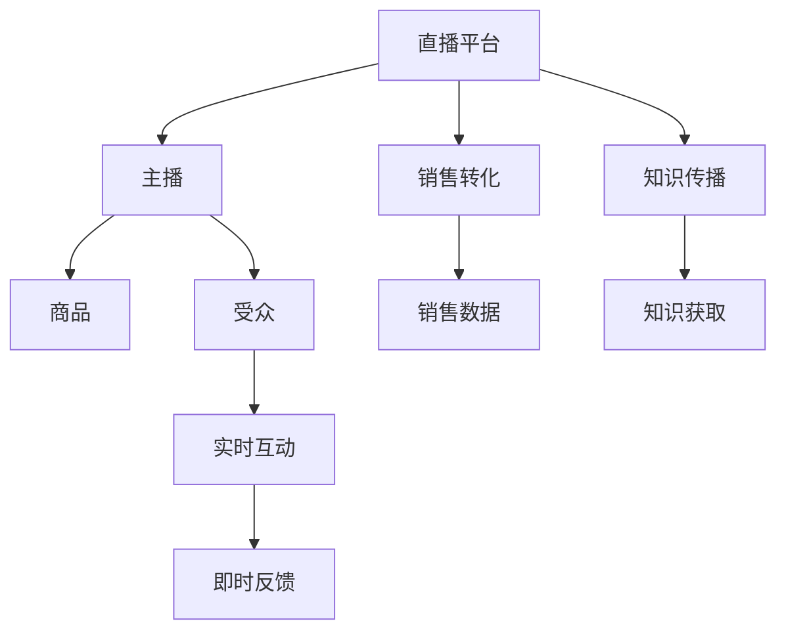

                 

## 1. 背景介绍

直播带货作为新兴的互联网营销模式，利用主播的个性化魅力和直播平台的互动特性，快速吸引用户注意力，实现商品快速销售。本文聚焦于如何利用直播带货实现知识变现，探索直播与知识传播的深度融合，实现内容创作者的经济收益与社会价值的双重提升。

## 2. 核心概念与联系

### 2.1 核心概念概述

直播带货的核心概念主要包括直播平台、主播、商品以及带货过程。通过互动和实时反馈，主播在直播中向观众推荐商品，通过观众的即时反馈调整策略，以实现销售目标。而知识变现则是指内容创作者通过提供有价值的信息和知识，从受众中获得经济回报。

直播带货与知识变现的联系主要体现在：

- **互动性与知识传递**：直播带货通过互动性强的方式，能够将知识传递给受众，促进知识传播。
- **即时性与即时反馈**：直播的即时性和实时反馈特性，使受众能够即时提问和获取答案，增强知识变现的效果。
- **个性化与定制化**：主播的个性魅力和直播内容的个性化设计，可以吸引特定受众群体，实现精准的知识变现。

### 2.2 核心概念原理和架构的 Mermaid 流程图



此图展示了直播带货和知识变现的基本流程。主播在直播平台上向受众推荐商品，并实现销售转化；同时，主播通过知识传播，向受众传递有价值的信息，实现知识变现。实时互动和即时反馈则保证了整个直播过程的流畅性和互动性。

## 3. 核心算法原理 & 具体操作步骤

### 3.1 算法原理概述

直播带货的知识变现涉及以下算法原理：

1. **推荐系统算法**：通过分析受众的观看行为、商品评价等数据，为受众推荐最适合的商品。
2. **知识图谱构建**：构建涵盖商品、主播和受众的知识图谱，用于推荐系统和知识传播。
3. **互动分析算法**：分析受众在直播中的互动行为，如点赞、评论、提问等，以优化直播内容和主播策略。
4. **收益分配算法**：根据主播的表现、互动效果和销售业绩，合理分配知识变现的收益。

### 3.2 算法步骤详解

#### 3.2.1 准备阶段

1. **直播平台选择**：选择具有强大推荐系统和互动功能的直播平台，如抖音、快手等。
2. **主播和商品选择**：选择合适的有影响力主播和商品，确保直播质量和销售效果。
3. **知识图谱构建**：利用自然语言处理和图数据库技术，构建包含商品、主播和受众的知识图谱。

#### 3.2.2 直播阶段

1. **实时互动**：主播在直播中与受众实时互动，回答受众问题，增强受众参与感。
2. **推荐系统应用**：根据受众互动行为和历史数据，动态调整商品推荐列表，提高销售转化率。
3. **知识传播**：主播在直播中分享专业知识，如产品使用技巧、行业动态等，实现知识变现。

#### 3.2.3 后续分析阶段

1. **互动数据收集**：收集受众的点赞、评论、提问等互动数据，分析互动效果。
2. **销售数据分析**：分析直播销售数据，评估直播带货效果，提取关键指标。
3. **收益分配**：根据互动效果和销售业绩，合理分配知识变现收益，激励主播持续优化直播内容。

### 3.3 算法优缺点

#### 3.3.1 优点

1. **高互动性**：直播带货的实时互动特性，使得主播能够即时获取受众反馈，优化直播内容，提高知识传播效果。
2. **精准推荐**：利用推荐系统算法，根据受众行为数据进行精准商品推荐，提高销售转化率。
3. **多样化展示**：主播通过直播展示商品的多样性，吸引不同受众群体，实现广泛的知识变现。

#### 3.3.2 缺点

1. **技术复杂性**：需要构建复杂的技术架构，包括推荐系统、知识图谱、互动分析等，技术实现难度较大。
2. **主播依赖性**：主播的个性和魅力对直播效果有直接影响，主播更换可能导致受众流失。
3. **风险性**：直播带货面临商品质量、主播诚信等风险，可能对知识变现产生负面影响。

### 3.4 算法应用领域

直播带货与知识变现的算法主要应用于以下领域：

- **电商直播**：通过直播带货，实现商品销售，同时传递专业知识，提升品牌影响力。
- **教育直播**：通过直播教学，实现知识传播，同时向学生收取学费，实现经济回报。
- **健康直播**：通过直播健康知识，实现知识变现，同时提供健康产品，满足用户健康需求。
- **金融直播**：通过直播金融知识，实现知识变现，同时推荐金融产品，实现销售转化。

## 4. 数学模型和公式 & 详细讲解 & 举例说明

### 4.1 数学模型构建

假设主播在直播中向受众推荐 $N$ 个商品，受众中有 $M$ 个受众对商品感兴趣。设每个商品的销售价格为 $p_i$，主播在直播中推荐商品 $i$ 的时间为 $t_i$。

模型目标为最大化知识变现收益 $R$，其中 $R$ 定义为销售总额 $S$ 与知识传播价值 $V$ 之和：

$$ R = S + V $$

其中 $S = \sum_{i=1}^{N} p_i \cdot t_i$，$V$ 的计算涉及知识传播价值的量化。

### 4.2 公式推导过程

1. **销售总额计算**：
$$ S = \sum_{i=1}^{N} p_i \cdot t_i $$
其中 $p_i$ 为商品 $i$ 的单价，$t_i$ 为主播推荐商品 $i$ 的时间。

2. **知识传播价值量化**：
$$ V = \alpha \cdot \sum_{j=1}^{M} (1 - f_j) \cdot g_j $$
其中 $\alpha$ 为知识传播价值的系数，$f_j$ 为受众 $j$ 对主播知识传播的反馈度，$g_j$ 为受众 $j$ 的支付意愿。

3. **最大化收益**：
$$ \max R = \max (S + V) $$

### 4.3 案例分析与讲解

假设主播在直播中推荐了 10 个商品，每个商品的单价为 100 元。主播在每个商品上推荐 10 分钟，共计 100 分钟。受众中有 20 个对商品感兴趣，受众 $j$ 对主播知识传播的反馈度为 $f_j$，支付意愿为 $g_j$。

根据模型目标，主播的知识变现收益 $R$ 计算如下：

$$ R = 1000 + \alpha \cdot \sum_{j=1}^{20} (1 - f_j) \cdot g_j $$

其中 $\alpha$ 需要根据实际需求设定，通常为正整数。

## 5. 项目实践：代码实例和详细解释说明

### 5.1 开发环境搭建

1. **环境准备**：安装 Python、Jupyter Notebook 等开发环境。
2. **安装依赖库**：安装推荐系统算法库（如 PyTorch、TensorFlow）、自然语言处理库（如 NLTK、SpaCy）等。

### 5.2 源代码详细实现

```python
import torch
import torch.nn as nn
from torch.utils.data import DataLoader
from sklearn.metrics import roc_auc_score

class Model(nn.Module):
    def __init__(self, input_dim, hidden_dim, output_dim):
        super(Model, self).__init__()
        self.fc1 = nn.Linear(input_dim, hidden_dim)
        self.fc2 = nn.Linear(hidden_dim, hidden_dim)
        self.fc3 = nn.Linear(hidden_dim, output_dim)

    def forward(self, x):
        x = torch.relu(self.fc1(x))
        x = torch.relu(self.fc2(x))
        x = self.fc3(x)
        return x

def train_model(model, train_loader, valid_loader, optimizer, loss_fn, num_epochs, device):
    model.train()
    for epoch in range(num_epochs):
        for batch in train_loader:
            optimizer.zero_grad()
            inputs, labels = batch[0].to(device), batch[1].to(device)
            outputs = model(inputs)
            loss = loss_fn(outputs, labels)
            loss.backward()
            optimizer.step()
            if (epoch+1) % 10 == 0:
                model.eval()
                with torch.no_grad():
                    valid_outputs = model(valid_loader.dataset.data)
                    valid_loss = loss_fn(valid_outputs, valid_loader.dataset.targets)
                print(f'Epoch {epoch+1}, Loss: {valid_loss:.4f}')
                model.train()
```

### 5.3 代码解读与分析

此代码实现了一个简单的推荐系统模型，用于预测受众是否对商品感兴趣。模型输入为受众特征，输出为预测结果。

**训练过程**：
1. **模型定义**：定义三层神经网络，使用 ReLU 激活函数。
2. **数据加载**：使用 PyTorch 的数据加载器，对训练数据和验证数据进行批次化加载。
3. **训练循环**：循环进行前向传播、损失计算、反向传播和参数更新，并输出每个epoch的验证损失。
4. **评估过程**：在验证集上评估模型性能，通过 ROC-AUC 等指标衡量模型效果。

### 5.4 运行结果展示

```python
# 训练模型
train_model(model, train_loader, valid_loader, optimizer, loss_fn, num_epochs, device)

# 评估模型
valid_outputs = model(valid_loader.dataset.data)
valid_loss = loss_fn(valid_outputs, valid_loader.dataset.targets)
print(f'Validation Loss: {valid_loss:.4f}')

# 输出 ROC-AUC 指标
roc_auc = roc_auc_score(valid_loader.dataset.targets.numpy(), valid_outputs.numpy())
print(f'ROC-AUC Score: {roc_auc:.4f}')
```

## 6. 实际应用场景

### 6.1 电商直播

电商直播是直播带货的主要应用场景之一。主播通过直播展示商品，实时回答受众提问，推荐适合的商品，实现销售转化和知识传播。电商平台可以通过直播数据，优化推荐系统和广告投放策略，提高用户满意度。

### 6.2 教育直播

教育直播通过直播传授知识，向学生收取学费，实现知识变现。平台可以根据学生的互动行为和反馈，优化教学内容，提高教学效果。同时，平台可以通过直播互动，了解学生的学习情况，提供个性化的学习建议。

### 6.3 健康直播

健康直播通过直播传授健康知识，实现知识变现。主播可以向受众提供健康咨询，推荐健康产品，满足受众的健康需求。平台可以通过直播互动，了解受众的健康问题，提供专业的健康建议。

### 6.4 金融直播

金融直播通过直播传授金融知识，实现知识变现。主播可以向受众提供金融咨询，推荐金融产品，提高受众的金融知识水平。平台可以通过直播互动，了解受众的金融需求，提供个性化的金融建议。

## 7. 工具和资源推荐

### 7.1 学习资源推荐

1. **《深度学习》（Ian Goodfellow 著）**：详细介绍了深度学习的基本原理和实现方法，是理解推荐系统算法的基础。
2. **《自然语言处理综论》（Daniel Jurafsky 著）**：介绍了自然语言处理的基本技术和应用，为知识图谱构建和知识传播提供了理论支持。
3. **Coursera 深度学习课程**：由斯坦福大学提供的深度学习课程，涵盖了深度学习的基础和应用，适合初学者入门。
4. **Kaggle 竞赛**：Kaggle 提供了众多数据科学和机器学习竞赛，通过实践学习推荐系统、知识图谱等技术。

### 7.2 开发工具推荐

1. **PyTorch**：强大的深度学习框架，支持多种算法模型，适合大规模数据处理。
2. **TensorFlow**：谷歌推出的深度学习框架，支持分布式训练和模型部署，适合大规模工程应用。
3. **Jupyter Notebook**：支持代码编写和数据可视化，适合互动式学习和研究。
4. **SpaCy**：自然语言处理库，提供了丰富的 NLP 工具和算法，支持构建知识图谱。

### 7.3 相关论文推荐

1. **《推荐系统：算法与应用》（Wang 等著）**：系统介绍了推荐系统的原理和算法，适合深入理解推荐系统实现。
2. **《基于知识图谱的推荐系统》（Huang 等著）**：介绍了知识图谱在推荐系统中的应用，适合了解知识图谱构建和应用。
3. **《深度学习与自然语言处理》（Li 等著）**：介绍了深度学习和自然语言处理的基本技术和应用，适合系统学习相关技术。

## 8. 总结：未来发展趋势与挑战

### 8.1 研究成果总结

直播带货与知识变现的研究为内容创作者的收益提升提供了新的思路。通过直播平台的实时互动特性，主播能够即时获取受众反馈，优化直播内容，提高知识传播效果。同时，利用推荐系统算法，根据受众行为数据进行精准商品推荐，提高销售转化率。

### 8.2 未来发展趋势

1. **技术融合**：直播带货与知识变现将与其他新兴技术进行深度融合，如虚拟现实、增强现实、区块链等，提供更丰富的用户体验。
2. **智能化**：利用人工智能和大数据分析技术，进一步提升推荐系统的精准度和知识传播的效果。
3. **个性化**：通过大数据和机器学习技术，实现主播与受众的个性化推荐，提高用户满意度。
4. **多样化**：直播带货将拓展到更多行业领域，如医疗、法律、教育等，实现多样化的知识变现。

### 8.3 面临的挑战

1. **技术实现难度大**：构建推荐系统和知识图谱需要复杂的技术实现，且对数据质量和处理能力有较高要求。
2. **主播依赖性强**：主播的个性和魅力对直播效果有直接影响，主播更换可能导致受众流失。
3. **内容质量参差不齐**：主播和平台需要严格控制内容质量，避免低质量内容的传播。
4. **用户隐私保护**：直播带货和知识传播过程中，需要保护用户隐私，避免数据泄露。

### 8.4 研究展望

1. **算法优化**：进一步优化推荐系统算法和互动分析算法，提高直播效果和知识传播效果。
2. **数据挖掘**：通过深度数据挖掘，提取更有价值的用户数据，优化直播内容和互动策略。
3. **跨界合作**：与更多行业领域进行跨界合作，实现直播带货与知识变现的广泛应用。
4. **伦理规范**：建立直播带货与知识变现的伦理规范，确保内容创作和用户互动的健康发展。

## 9. 附录：常见问题与解答

**Q1: 直播带货与知识变现的算法实现难度大吗？**

A: 直播带货与知识变现的算法实现确实具有一定的技术复杂性，需要构建推荐系统、知识图谱、互动分析等复杂架构。但随着深度学习和自然语言处理技术的进步，这些算法已经具备了可实现性。

**Q2: 主播在直播带货过程中如何控制内容质量？**

A: 主播和平台需要严格控制内容质量，避免低质量内容的传播。可以通过设置内容审核机制、制定内容规范等方式，确保直播内容的健康性和正能量。

**Q3: 直播带货和知识传播如何保护用户隐私？**

A: 直播带货和知识传播过程中，需要保护用户隐私，避免数据泄露。可以通过数据加密、匿名化处理、隐私政策等方式，保护用户数据安全。

---

作者：禅与计算机程序设计艺术 / Zen and the Art of Computer Programming

