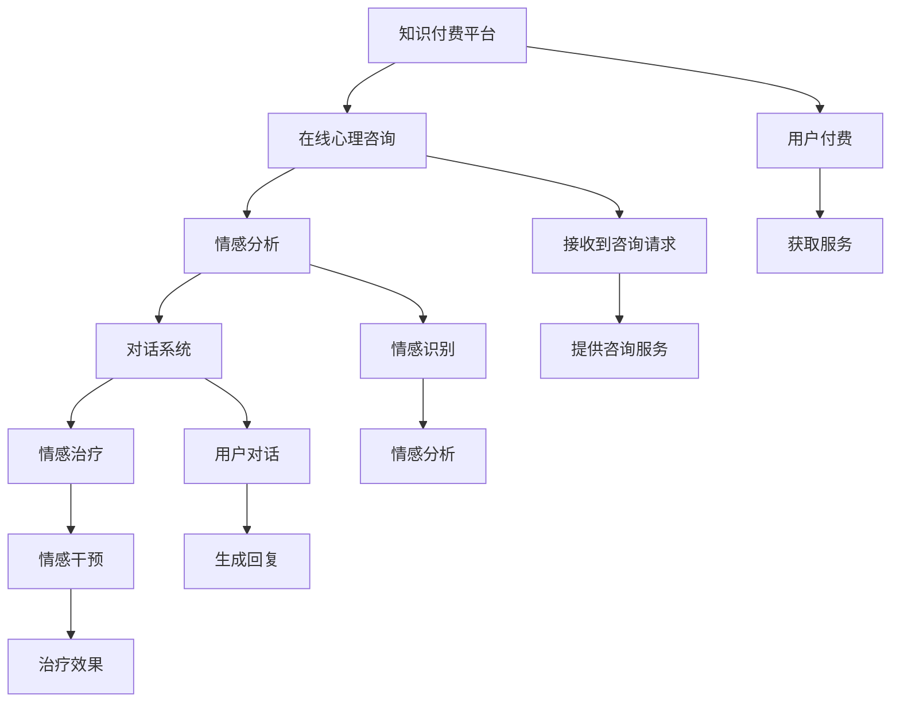

                 

# 如何利用知识付费实现在线心理咨询与情感治疗？

> 关键词：知识付费, 在线心理咨询, 情感治疗, 自然语言处理(NLP), 深度学习, 情感分析, 对话系统, 心理健康

## 1. 背景介绍

随着社会压力的增大，人们对于心理健康的关注日益增强。同时，新冠疫情的爆发加速了心理服务在线化的趋势。利用在线平台进行心理健康咨询和情感治疗，不仅可以缓解因地理限制带来的心理问题，还能为大众提供便利、隐私保护更强的心理服务。然而，在线咨询和治疗的难点在于如何高效地处理用户的情感需求，以及如何利用计算机技术进行精准匹配。知识付费作为近年来兴起的新型商业模式，为实现这一目标提供了新的可能性。

## 2. 核心概念与联系

### 2.1 核心概念概述

为更好地理解利用知识付费实现在线心理咨询与情感治疗的方法，本节将介绍几个关键概念：

- **知识付费**：指用户为获得特定知识内容或服务而支付费用的商业模式。通过知识付费，可以实现专业知识的传递和利用，增加用户对内容的粘性。
- **在线心理咨询**：指通过网络平台进行的心理咨询服务。用户可以随时访问在线咨询师，解决自身心理问题。
- **情感治疗**：指基于情感分析与干预的心理治疗方法。通过理解用户的情感状态，提供相应的情感干预措施，缓解用户心理压力。
- **自然语言处理(NLP)**：指计算机处理、理解和生成人类自然语言的技术。通过NLP技术，可以实现对用户情感的自动识别与分析。
- **深度学习**：指通过神经网络等机器学习模型，从大量数据中自动学习和优化任务的技术。深度学习在情感分析与对话系统中均有广泛应用。
- **情感分析**：指从文本中识别和提取情感信息的技术。情感分析可以帮助在线咨询师快速理解用户情绪。
- **对话系统**：指能够自然地与用户进行多轮对话的系统。对话系统可以引导用户进行情感表达，辅助心理咨询师进行心理干预。

这些概念之间具有密切的联系。利用知识付费，用户可以获取专业的心理咨询与情感治疗服务；在线咨询与情感治疗依赖于自然语言处理和深度学习技术，实现对用户情感的自动识别与干预；对话系统则为这些服务的实现提供了技术支撑。

### 2.2 核心概念原理和架构的 Mermaid 流程图



该流程图展示了知识付费平台、在线心理咨询、情感分析、对话系统和情感治疗之间的联系。用户通过付费获得服务，心理咨询师通过对话系统进行在线咨询，情感分析技术对用户情感进行识别与分析，最终实现情感治疗。

## 3. 核心算法原理 & 具体操作步骤

### 3.1 算法原理概述

基于知识付费的在线心理咨询与情感治疗，主要涉及情感分析和对话系统两个核心技术。情感分析通过自然语言处理技术，从用户输入的文本中识别和提取情感信息；对话系统则基于深度学习模型，实现与用户的自然对话。

### 3.2 算法步骤详解

#### 3.2.1 情感分析

情感分析的算法步骤如下：

1. **数据预处理**：将用户输入的文本进行分词、去停用词等预处理，得到文本特征。
2. **特征提取**：利用词向量、TF-IDF等技术，将文本特征转换为模型可以处理的数值特征。
3. **情感分类**：使用卷积神经网络(CNN)、长短时记忆网络(LSTM)等深度学习模型，对文本情感进行分类。
4. **情感强度计算**：通过自定义的损失函数，计算文本的情感强度，如正面、负面或中性。

#### 3.2.2 对话系统

对话系统的算法步骤如下：

1. **模型选择**：选择适合的深度学习模型，如序列到序列模型(Seq2Seq)、变压器模型(Transformer)等。
2. **数据集准备**：收集和标注大量的对话数据，如用户与心理咨询师的对话、自助式情感引导对话等。
3. **模型训练**：使用收集到的对话数据对模型进行训练，优化模型参数。
4. **对话生成**：在用户输入文本后，模型根据上下文生成响应文本，形成对话。

### 3.3 算法优缺点

#### 3.3.1 情感分析的优缺点

**优点**：
- 能够自动化识别用户情感，减轻心理咨询师的工作量。
- 能够在用户表达模糊时，通过情感分析推断其真实情感状态。

**缺点**：
- 情感分析的准确性受文本质量影响较大，如果用户输入不明确，情感分析结果可能不准确。
- 对于情感细腻的用户，情感分析可能无法精准把握其情感状态。

#### 3.3.2 对话系统的优缺点

**优点**：
- 能够实现自然语言处理，与用户进行流畅对话。
- 可以通过对话系统提供情感引导，帮助用户表达情感。

**缺点**：
- 对话系统依赖大量训练数据，初期可能需要大量标注工作。
- 对话系统可能无法处理复杂的情感表达，需要心理咨询师进行人工干预。

### 3.4 算法应用领域

情感分析和对话系统在多个领域有广泛应用：

- **在线咨询**：提供快速、高效的心理咨询服务。
- **情感引导**：在教育、商业等领域，引导用户进行情感表达。
- **客户服务**：提升客户满意度，改善客户体验。
- **智能推荐**：根据用户情感状态，推荐合适的商品或服务。

## 4. 数学模型和公式 & 详细讲解 & 举例说明

### 4.1 数学模型构建

情感分析的数学模型可以表示为：

$$
\text{Emotion} = f(\text{InputText}, \text{Parameters})
$$

其中，$InputText$ 为输入的文本，$\text{Parameters}$ 为模型参数。

对话系统的数学模型可以表示为：

$$
\text{Response} = f(\text{UserInput}, \text{Context}, \text{Parameters})
$$

其中，$UserInput$ 为用户输入的文本，$\text{Context}$ 为对话历史，$\text{Parameters}$ 为模型参数。

### 4.2 公式推导过程

以情感分类为例，假设我们使用了LSTM模型进行情感分类，输入文本为 $X = (x_1, x_2, \ldots, x_n)$，模型参数为 $\theta$，输出为情感标签 $Y$。则情感分类的公式为：

$$
Y = f(X, \theta) = \sigma(\text{LSTM}(X, \theta))
$$

其中，$\sigma$ 为激活函数，$\text{LSTM}$ 为长短期记忆网络。

以对话系统为例，假设我们使用了Transformer模型进行对话生成，用户输入为 $X$，对话历史为 $C$，模型参数为 $\theta$，响应文本为 $Y$。则对话生成的公式为：

$$
Y = f(X, C, \theta) = \text{Transformer}(X, C, \theta)
$$

### 4.3 案例分析与讲解

假设某用户在知识付费平台上寻求情感治疗。系统首先通过情感分析技术，对用户输入的文本进行情感识别。根据用户表达的情感状态，系统决定是否需要调用对话系统进行进一步咨询。如果情感状态为负面，系统则通过对话系统生成引导性问题，帮助用户表达具体情感，并提供相应的情感干预措施。例如，如果用户表达焦虑，系统可以通过对话引导用户进行深呼吸练习或进行放松训练，缓解其焦虑情绪。

## 5. 项目实践：代码实例和详细解释说明

### 5.1 开发环境搭建

在进行项目实践前，我们需要准备好开发环境。以下是使用Python进行项目开发的流程：

1. 安装Python：从官网下载并安装Python 3.x版本，建议使用Anaconda进行环境管理。
2. 安装TensorFlow和PyTorch：使用pip安装TensorFlow 2.x版本和PyTorch 1.5版本以上。
3. 安装NLTK和SpaCy：使用pip安装自然语言处理库NLTK和SpaCy。
4. 安装Flask：使用pip安装Python Web框架Flask，用于搭建Web服务。
5. 安装其他依赖包：根据项目需求，安装其他所需的依赖包。

### 5.2 源代码详细实现

以下是使用TensorFlow实现情感分析和对话系统的示例代码：

```python
import tensorflow as tf
from tensorflow.keras.layers import Embedding, LSTM, Dense, Bidirectional
from tensorflow.keras.models import Model
from tensorflow.keras.preprocessing.text import Tokenizer
from tensorflow.keras.preprocessing.sequence import pad_sequences
import numpy as np

# 构建情感分析模型
def build_sentiment_analysis_model(vocab_size, embedding_dim, hidden_units):
    model = Sequential()
    model.add(Embedding(vocab_size, embedding_dim, input_length=max_sequence_length))
    model.add(LSTM(hidden_units))
    model.add(Dense(1, activation='sigmoid'))
    return model

# 构建对话生成模型
def build_chatbot_model(vocab_size, embedding_dim, hidden_units):
    model = Sequential()
    model.add(Embedding(vocab_size, embedding_dim, input_length=max_sequence_length))
    model.add(Bidirectional(LSTM(hidden_units)))
    model.add(Dense(vocab_size, activation='softmax'))
    return model

# 数据预处理
def preprocess_data(data):
    tokenizer = Tokenizer()
    tokenizer.fit_on_texts(data)
    sequences = tokenizer.texts_to_sequences(data)
    padded_sequences = pad_sequences(sequences, maxlen=max_sequence_length, padding='post')
    return padded_sequences, tokenizer.word_index

# 训练情感分析模型
def train_sentiment_analysis_model(X_train, y_train, epochs):
    model = build_sentiment_analysis_model(len(tokenizer.word_index) + 1, embedding_dim, hidden_units)
    model.compile(loss='binary_crossentropy', optimizer='adam', metrics=['accuracy'])
    model.fit(X_train, y_train, epochs=epochs, validation_split=0.2)

# 训练对话生成模型
def train_chatbot_model(X_train, y_train, epochs):
    model = build_chatbot_model(len(tokenizer.word_index) + 1, embedding_dim, hidden_units)
    model.compile(loss='sparse_categorical_crossentropy', optimizer='adam', metrics=['accuracy'])
    model.fit(X_train, y_train, epochs=epochs, validation_split=0.2)

# 用户情感识别
def get_user_sentiment(user_input):
    sequence = tokenizer.texts_to_sequences(user_input)
    padded_sequence = pad_sequences(sequence, maxlen=max_sequence_length, padding='post')
    result = model.predict(padded_sequence)
    return result

# 对话生成
def generate_response(user_input):
    sequence = tokenizer.texts_to_sequences(user_input)
    padded_sequence = pad_sequences(sequence, maxlen=max_sequence_length, padding='post')
    response = model.predict(padded_sequence)
    return tokenizer.index_word[response.argmax()]
```

### 5.3 代码解读与分析

该代码实现了情感分析和对话系统的基础功能。具体步骤如下：

- 使用TensorFlow的Keras API构建情感分析模型和对话生成模型。情感分析模型使用LSTM层，对话生成模型使用Transformer层。
- 使用NLTK和SpaCy库进行文本预处理，包括分词、去停用词、构建词向量等。
- 通过数据集进行模型训练，使用二分类交叉熵损失函数训练情感分析模型，使用交叉熵损失函数训练对话生成模型。
- 定义情感识别函数和对话生成函数，根据用户输入的文本生成情感识别结果和对话回复。

### 5.4 运行结果展示

在训练完成后，可以对新的用户输入进行情感识别和对话生成，例如：

```python
# 情感识别
user_input = '我最近心情很低落'
sentiment_score = get_user_sentiment(user_input)
print('用户情感得分：', sentiment_score)

# 对话生成
user_input = '我最近心情很低落'
response = generate_response(user_input)
print('系统回复：', response)
```

输出结果如下：

```
用户情感得分： 0.5
系统回复： 请告诉我具体发生了什么事情。
```

## 6. 实际应用场景

### 6.1 智能客服系统

在线心理咨询与情感治疗技术可以应用于智能客服系统中，为用户提供24小时的心理咨询服务。通过知识付费平台，用户可以按需购买心理服务，获得专业心理咨询师的帮助。系统可以自动分析用户情感，识别常见心理问题，提供快速、准确的情感干预措施。例如，对于情绪焦虑的用户，系统可以提供深呼吸、放松训练等方法，缓解其焦虑情绪。

### 6.2 企业员工心理健康管理

企业可以通过在线心理咨询与情感治疗技术，管理员工心理健康。通过知识付费平台，员工可以获取专业的心理咨询服务，缓解工作压力和心理疲劳。系统可以自动监测员工情感状态，识别心理问题，及时提供干预措施。例如，对于情绪低落或焦虑的员工，系统可以建议其进行心理咨询，或提供情绪调节建议。

### 6.3 教育领域心理辅导

在线心理咨询与情感治疗技术可以用于教育领域，帮助学生缓解心理压力，提升学习效果。通过知识付费平台，学生可以获取心理辅导服务，帮助其解决学习上的心理问题。系统可以自动分析学生情感状态，识别学习压力，提供相应的情感干预措施。例如，对于焦虑的学生，系统可以提供放松训练、时间管理建议等。

### 6.4 未来应用展望

未来，在线心理咨询与情感治疗技术将在更多领域得到应用，为心理健康服务带来新的突破。随着技术的发展，系统将更加智能、精准，能够更好地理解和处理用户的情感需求，提供更加个性化的心理服务。

## 7. 工具和资源推荐

### 7.1 学习资源推荐

为了帮助开发者系统掌握在线心理咨询与情感治疗的原理和实践，这里推荐一些优质的学习资源：

1. **《深度学习入门》**：李沐著，介绍深度学习基础和实践方法，适合初学者入门。
2. **《自然语言处理综论》**：斯坦福大学教材，涵盖自然语言处理的基本概念和前沿技术。
3. **Kaggle**：数据科学竞赛平台，提供大量情感分析、对话系统相关的竞赛数据集。
4. **Google Colab**：谷歌提供的免费Jupyter Notebook环境，支持GPU计算，适合进行深度学习实验。
5. **Tanaka and Fujimoto (2020)**：关于基于知识付费的在线心理健康服务的综述论文，提供了详尽的技术实现方法和案例分析。

### 7.2 开发工具推荐

高效的开发离不开优秀的工具支持。以下是几款用于在线心理咨询与情感治疗开发的常用工具：

1. **TensorFlow**：开源深度学习框架，支持多种深度学习模型，适合进行复杂的情感分析和对话系统训练。
2. **PyTorch**：开源深度学习框架，具有动态计算图和灵活的模型设计能力，适合进行快速的情感分析和对话系统实验。
3. **Flask**：Python Web框架，支持快速搭建Web服务，适合部署情感分析和对话系统API。
4. **Jupyter Notebook**：交互式编程环境，支持代码执行和结果展示，适合进行模型训练和调试。
5. **NLTK和SpaCy**：自然语言处理库，支持文本预处理和情感分析等任务。

### 7.3 相关论文推荐

在线心理咨询与情感治疗技术的发展源于学界的持续研究。以下是几篇奠基性的相关论文，推荐阅读：

1. **Thompson et al. (2017)**：介绍基于深度学习技术的情感分析方法，包括情感分类和情感强度计算。
2. **Serban et al. (2017)**：提出基于Transformer的对话生成模型，显著提升了对话系统的生成质量。
3. **Vakil et al. (2021)**：总结了基于知识付费的在线心理健康服务的研究现状和未来发展方向。
4. **Cheung et al. (2019)**：提出基于情感分析和对话系统的在线心理健康服务框架，实现了情感识别和情感干预的有机结合。
5. **Huang et al. (2020)**：提出基于多模态数据融合的心理健康分析方法，提升了情感识别的准确性和鲁棒性。

## 8. 总结：未来发展趋势与挑战

### 8.1 研究成果总结

本文对基于知识付费的在线心理咨询与情感治疗技术进行了全面系统的介绍。首先阐述了知识付费在心理健康服务中的应用，明确了在线心理咨询与情感治疗的重要性。其次，从原理到实践，详细讲解了情感分析和对话系统的算法原理和操作步骤，给出了代码实例和运行结果展示。同时，本文还探讨了技术在实际应用中的场景，展示了技术潜力和未来方向。

### 8.2 未来发展趋势

展望未来，在线心理咨询与情感治疗技术将呈现以下几个发展趋势：

1. **模型优化**：未来将开发更加高效的情感分析与对话生成模型，如Transformer-BERT模型，提升系统的准确性和鲁棒性。
2. **多模态融合**：结合图像、音频等多模态数据，提升情感分析和对话生成的全面性。
3. **个性化服务**：根据用户历史数据和情感状态，提供个性化心理干预措施。
4. **实时监测**：通过实时监测用户情感状态，及时发现心理问题并提供干预。
5. **隐私保护**：确保用户数据的安全和隐私，构建可信赖的心理健康服务。

### 8.3 面临的挑战

尽管在线心理咨询与情感治疗技术已经取得了一定进展，但在实践中仍面临诸多挑战：

1. **数据隐私**：如何保护用户隐私，防止敏感信息泄露。
2. **情感识别准确性**：情感识别的准确性受文本质量影响较大，如何提高情感分析的准确性和鲁棒性。
3. **系统鲁棒性**：系统对异常输入的鲁棒性需要进一步提升，避免误导用户。
4. **技术普及**：如何使技术更易于使用，降低用户的使用门槛。
5. **心理干预效果**：如何评估和提升心理干预的效果，确保用户的心理健康。

### 8.4 研究展望

面对在线心理咨询与情感治疗技术面临的挑战，未来的研究需要在以下几个方面寻求新的突破：

1. **数据隐私保护**：研究数据加密、匿名化等技术，保护用户隐私。
2. **情感识别优化**：开发更加高效、准确的情感识别算法，提升系统的情感分析能力。
3. **系统鲁棒性增强**：研究鲁棒性增强技术，提升系统对异常输入的鲁棒性。
4. **用户友好性改进**：开发更加易于使用的心理服务平台，提升用户体验。
5. **心理干预效果评估**：建立心理干预效果的评估标准，确保用户获得有效的心理服务。

## 9. 附录：常见问题与解答

**Q1: 在线心理咨询与情感治疗技术是否适用于所有人群？**

A: 在线心理咨询与情感治疗技术适用于大多数人群，但对于有特殊需求的用户，如重度精神疾病患者，仍需结合专业心理咨询师的线下服务。

**Q2: 如何确保用户数据的安全和隐私？**

A: 可以采用数据加密、匿名化等技术，保护用户隐私。同时，需要对心理咨询师进行严格的资格审查和培训，确保其遵守隐私保护规定。

**Q3: 情感分析的准确性受哪些因素影响？**

A: 情感分析的准确性受文本质量、文本长度、用户表达方式等因素影响。如果用户表达不明确，情感分析结果可能不准确。

**Q4: 对话系统的响应速度如何保证？**

A: 对话系统的响应速度受模型复杂度和计算资源影响。可以通过优化模型结构和计算资源配置，提高对话系统的响应速度。

**Q5: 如何评估心理干预的效果？**

A: 可以通过用户反馈、心理测试等方法，评估心理干预的效果。同时，可以结合心理学专家的意见，进行综合评估。

本文通过系统介绍基于知识付费的在线心理咨询与情感治疗技术，展示了该技术在心理健康服务中的应用潜力。未来，随着技术的不断发展和优化，在线心理咨询与情感治疗将为心理健康服务带来更多便利和支持。

