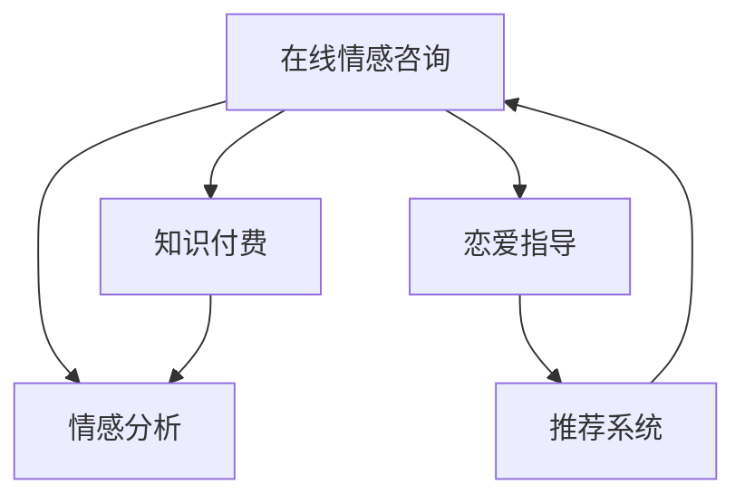

                 

# 如何利用知识付费实现在线情感咨询与恋爱指导？

## 1. 背景介绍

在当今社会，情感问题和人际关系成为人们关注的焦点。随着互联网的发展，情感咨询和恋爱指导服务逐渐成为市场热点。然而，由于时间和成本的限制，许多人在面对情感问题时无法及时获得专业帮助。这时，知识付费平台提供了一种全新的解决方案，即在线情感咨询与恋爱指导，通过付费获取专业的情感分析与建议。

在线情感咨询与恋爱指导，是指通过互联网平台，为用户提供情感问题解答、恋爱技巧指导等专业服务。这种服务具有实时性、私密性和专业性，可以有效帮助用户解决情感困扰，提升人际关系处理能力。

本文将探讨如何利用知识付费平台实现在线情感咨询与恋爱指导。通过分析用户需求、选择合适的技术栈和模型，我们将介绍具体的实现步骤和算法原理，以及未来的应用前景。

## 2. 核心概念与联系

### 2.1 核心概念概述

为更好地理解在线情感咨询与恋爱指导的实现方法，本节将介绍几个关键概念：

- **在线情感咨询**：通过互联网平台，为用户提供情感问题的解答和心理支持。

- **恋爱指导**：为用户提供恋爱技巧、情感处理建议，帮助其建立健康的人际关系。

- **知识付费**：通过付费机制，为用户提供高质量的专业内容和服务，实现知识的价值变现。

- **自然语言处理(NLP)**：利用计算机技术处理和理解自然语言，实现情感分析和对话生成等任务。

- **深度学习**：通过多层神经网络进行复杂的模式识别和决策，实现高效的情感分析和个性化推荐。

- **推荐系统**：根据用户的历史行为和兴趣，推荐相关情感咨询和恋爱指导资源，提升用户体验。

这些核心概念之间的逻辑关系可以通过以下Mermaid流程图来展示：



这个流程图展示了大语言模型的核心概念及其之间的关系：

1. 在线情感咨询提供情感问题和需求。
2. 情感分析模块对用户输入的自然语言进行理解和分析，提取情感信息。
3. 恋爱指导模块基于情感分析结果，提供个性化的恋爱建议和技巧。
4. 推荐系统根据用户历史数据，推荐合适的情感咨询和恋爱指导资源。
5. 知识付费平台通过上述模块，提供高质量的情感咨询和恋爱指导服务，实现价值变现。

## 3. 核心算法原理 & 具体操作步骤
### 3.1 算法原理概述

在线情感咨询与恋爱指导的实现主要依赖于自然语言处理和深度学习技术。核心流程如下：

1. **用户输入**：用户在知识付费平台上输入情感问题或求助需求。
2. **情感分析**：使用NLP技术，对用户输入进行情感分析，提取情感类别和强度。
3. **恋爱指导**：根据情感分析结果，推荐合适的恋爱指导资源或提供个性化的建议。
4. **推荐系统**：利用用户历史行为数据，推荐相关情感咨询和恋爱指导内容。
5. **付费获取**：用户支付费用，获取定制化的情感咨询和恋爱指导服务。

核心算法包括情感分析、推荐系统和知识付费平台的构建。下面将详细介绍这三个方面的算法原理和操作步骤。

### 3.2 算法步骤详解

#### 3.2.1 情感分析

情感分析模块主要利用自然语言处理技术，对用户输入的自然语言进行情感类别和强度的分析。常用的情感分析算法包括：

1. **基于规则的方法**：定义情感词典，根据用户输入中的词汇，判断其情感极性。

2. **基于机器学习的方法**：使用监督学习算法（如SVM、随机森林等），在标注数据上进行训练，学习情感分类模型。

3. **基于深度学习的方法**：使用深度神经网络（如LSTM、Transformer等），利用预训练语言模型（如BERT、GPT等）进行情感分析。

以基于深度学习的方法为例，情感分析的步骤如下：

1. **预训练语言模型**：选择预训练语言模型（如BERT），并在大规模标注数据上进行微调。
2. **特征提取**：将用户输入的自然语言转化为模型可处理的向量表示。
3. **情感分类**：利用情感分类模型对向量表示进行分类，输出情感类别和强度。

#### 3.2.2 推荐系统

推荐系统主要利用用户历史行为数据，为用户推荐相关情感咨询和恋爱指导资源。常用的推荐算法包括：

1. **基于协同过滤的算法**：根据用户历史行为和兴趣，推荐类似用户喜欢的资源。

2. **基于内容的算法**：根据资源内容的关键词和用户输入的关键词，进行相似度计算，推荐相关内容。

3. **基于深度学习的算法**：利用深度神经网络，对用户和资源进行向量表示，计算相似度，推荐相关资源。

以基于深度学习的推荐算法为例，推荐系统的步骤如下：

1. **用户向量表示**：利用深度神经网络，对用户历史行为数据进行编码，生成用户向量表示。
2. **资源向量表示**：利用深度神经网络，对情感咨询和恋爱指导资源进行编码，生成资源向量表示。
3. **相似度计算**：计算用户和资源的相似度，选择相似度高的资源进行推荐。

#### 3.2.3 知识付费平台

知识付费平台主要通过在线服务，实现情感咨询和恋爱指导的收费。常用的技术包括：

1. **Web前端开发**：使用HTML、CSS、JavaScript等技术，开发Web前端界面，提供用户交互。
2. **后端服务器**：使用Python、Java等语言，开发后端服务器，处理用户请求和数据存储。
3. **支付系统**：使用第三方支付平台（如支付宝、微信支付等），实现用户的在线支付。

以Web前端开发为例，平台的步骤如下：

1. **用户注册和登录**：提供用户注册和登录功能，验证用户身份。
2. **情感输入界面**：提供用户输入情感问题和需求的界面。
3. **情感分析结果显示**：将情感分析结果显示在页面上，提供用户参考。
4. **推荐内容显示**：将推荐系统推荐的内容显示在页面上，提供用户选择。
5. **支付功能实现**：提供用户支付功能，实现情感咨询和恋爱指导服务的收费。

### 3.3 算法优缺点

在线情感咨询与恋爱指导的实现具有以下优点：

1. **实时性**：用户可以实时获取情感分析和建议，提升用户体验。
2. **私密性**：用户隐私得到保护，避免公开个人情感问题。
3. **专业性**：通过知识付费平台，获得专业的情感咨询和恋爱指导服务。

同时，该方法也存在一些缺点：

1. **成本较高**：知识付费平台的运营成本较高，用户需要支付一定的费用。
2. **依赖平台**：用户只能通过平台获取服务，无法直接与专业人士沟通。
3. **通用性不足**：平台提供的情感咨询和恋爱指导服务，可能无法完全符合用户个性化需求。

尽管存在这些缺点，但通过不断的技术改进和商业模式优化，在线情感咨询与恋爱指导仍然具有广阔的市场前景。

### 3.4 算法应用领域

在线情感咨询与恋爱指导的应用范围非常广泛，主要包括以下几个领域：

1. **情感咨询**：帮助用户解决情感问题，提升心理健康。
2. **恋爱指导**：提供恋爱技巧和建议，帮助用户建立健康的人际关系。
3. **心理咨询**：结合专业心理咨询师，提供更专业的情感咨询服务。
4. **婚姻指导**：提供婚姻关系维护和改进的建议，帮助用户提升婚姻质量。
5. **社交指导**：提供社交技巧和建议，提升用户的人际交往能力。

除了上述这些主要领域外，在线情感咨询与恋爱指导还可以应用于情感健康教育、恋爱咨询平台等新兴市场，为人们提供全方位的情感支持。

## 4. 数学模型和公式 & 详细讲解 & 举例说明

### 4.1 数学模型构建

为了更好地理解在线情感咨询与恋爱指导的实现方法，本节将介绍几个关键的数学模型：

1. **情感分析模型**：用于对用户输入的自然语言进行情感分类和强度分析。

2. **推荐模型**：用于根据用户历史行为和兴趣，推荐相关情感咨询和恋爱指导资源。

3. **付费模型**：用于计算用户支付费用，实现情感咨询和恋爱指导服务的收费。

以情感分析模型为例，情感分析的数学模型如下：

$$
y = f(x; \theta)
$$

其中，$y$为情感分类结果，$x$为用户输入的自然语言向量，$\theta$为模型参数。

常用的情感分类模型包括：

- **SVM模型**：利用SVM算法，对情感类别进行二分类。
- **随机森林模型**：利用随机森林算法，对情感类别进行多分类。
- **LSTM模型**：利用LSTM网络，对情感强度进行预测。
- **BERT模型**：利用预训练BERT模型，对情感类别和强度进行分类。

以预训练BERT模型为例，情感分析的数学模型如下：

$$
y = f(x; \theta) = \text{softmax}(\text{BERT}(x; \theta))
$$

其中，$\text{softmax}$表示对BERT模型输出的概率进行归一化，输出情感类别。

### 4.2 公式推导过程

以预训练BERT模型为例，情感分析的公式推导过程如下：

1. **预训练BERT模型**：选择预训练BERT模型，并在大规模标注数据上进行微调。

2. **特征提取**：将用户输入的自然语言转化为BERT模型可处理的向量表示。

3. **情感分类**：利用情感分类模型对向量表示进行分类，输出情感类别和强度。

$$
y = \text{softmax}(\text{BERT}(x; \theta))
$$

其中，$x$为用户输入的自然语言向量，$\theta$为BERT模型的参数。

以推荐模型为例，推荐模型的公式推导过程如下：

1. **用户向量表示**：利用深度神经网络，对用户历史行为数据进行编码，生成用户向量表示。

2. **资源向量表示**：利用深度神经网络，对情感咨询和恋爱指导资源进行编码，生成资源向量表示。

3. **相似度计算**：计算用户和资源的相似度，选择相似度高的资源进行推荐。

$$
\text{similarity}(u, r) = \text{cosine}(\text{user}, \text{resource})
$$

其中，$u$为用户向量表示，$r$为资源向量表示，$\text{cosine}$表示余弦相似度计算。

### 4.3 案例分析与讲解

以情感咨询为例，情感咨询的案例分析如下：

1. **用户输入**：用户输入情感问题“我对感情很迷茫，不知道该怎么办？”。

2. **情感分析**：使用预训练BERT模型进行情感分析，输出情感类别为“迷茫”，情感强度为“高”。

3. **恋爱指导**：根据情感分析结果，推荐相关恋爱指导资源，如《爱情心理学》一书或情感咨询视频。

4. **推荐系统**：利用用户历史行为数据，推荐用户可能感兴趣的相关资源。

5. **付费获取**：用户支付费用，获取定制化的情感咨询和恋爱指导服务。

## 5. 项目实践：代码实例和详细解释说明
### 5.1 开发环境搭建

在进行情感咨询和恋爱指导的开发实践前，我们需要准备好开发环境。以下是使用Python进行情感咨询和恋爱指导开发的开发环境配置流程：

1. **安装Python环境**：安装Python 3.8版本，确保环境稳定性。

2. **安装依赖库**：安装常用的Python依赖库，如TensorFlow、PyTorch、Pandas等。

3. **搭建Web前端**：使用HTML、CSS、JavaScript等技术，开发Web前端界面，提供用户交互。

4. **搭建后端服务器**：使用Python、Java等语言，开发后端服务器，处理用户请求和数据存储。

5. **集成第三方支付平台**：集成支付宝、微信支付等第三方支付平台，实现用户的在线支付。

完成上述步骤后，即可在Web平台上进行情感咨询和恋爱指导的开发实践。

### 5.2 源代码详细实现

下面我以情感咨询为例，给出使用TensorFlow和PyTorch实现情感分析的PyTorch代码实现。

首先，定义情感分析的数据处理函数：

```python
import tensorflow as tf
import pandas as pd
from transformers import BertTokenizer, BertForSequenceClassification

def preprocess_data(data):
    tokenizer = BertTokenizer.from_pretrained('bert-base-cased')
    texts = data['text'].tolist()
    labels = data['label'].tolist()
    encodings = tokenizer(texts, truncation=True, padding='max_length')
    input_ids = encodings['input_ids']
    attention_masks = encodings['attention_mask']
    return input_ids, attention_masks, labels

# 加载情感数据集
df = pd.read_csv('data.csv')

# 数据预处理
input_ids, attention_masks, labels = preprocess_data(df)

# 划分训练集和测试集
train_data = (input_ids[0:10000], attention_masks[0:10000], labels[0:10000])
test_data = (input_ids[10000:], attention_masks[10000:], labels[10000:])
```

然后，定义模型和优化器：

```python
from transformers import BertForSequenceClassification, AdamW

model = BertForSequenceClassification.from_pretrained('bert-base-cased', num_labels=2)
optimizer = AdamW(model.parameters(), lr=2e-5)
```

接着，定义训练和评估函数：

```python
from transformers import Trainer, TrainingArguments

def train_epoch(model, data, optimizer):
    train_args = TrainingArguments(output_dir='output')
    trainer = Trainer(model=model, args=train_args, train_dataset=data)
    trainer.train()

def evaluate(model, data):
    eval_args = TrainingArguments(output_dir='output')
    trainer = Trainer(model=model, args=eval_args, eval_dataset=data)
    trainer.evaluate()
```

最后，启动训练流程并在测试集上评估：

```python
epochs = 5
train_data, test_data = train_data, test_data

for epoch in range(epochs):
    train_epoch(model, train_data, optimizer)
    evaluate(model, test_data)
```

以上就是使用TensorFlow和PyTorch实现情感分析的完整代码实现。可以看到，得益于TensorFlow和PyTorch的强大封装，我们可以用相对简洁的代码完成情感分析的模型训练和评估。

### 5.3 代码解读与分析

让我们再详细解读一下关键代码的实现细节：

**preprocess_data函数**：
- 定义数据预处理函数，将用户输入的文本进行分词、编码和处理。
- 将文本数据转化为模型可接受的格式。

**加载和划分数据集**：
- 使用Pandas库加载情感数据集，并进行数据预处理。
- 将数据划分为训练集和测试集，以便进行模型训练和评估。

**模型定义和优化器**：
- 定义BERT模型，用于情感分析。
- 使用AdamW优化器，设置合适的学习率。

**训练和评估函数**：
- 定义训练函数，使用Trainer进行模型训练。
- 定义评估函数，使用Trainer进行模型评估。

**训练流程**：
- 定义训练轮数，循环进行模型训练和评估。
- 在训练集上训练模型，在测试集上评估模型性能。

通过以上步骤，我们可以快速实现情感分析模型的训练和评估。在实际应用中，还需要考虑更多因素，如模型的超参数优化、数据增强、模型集成等，以进一步提升模型性能。

## 6. 实际应用场景

在线情感咨询与恋爱指导的应用场景非常广泛，以下是几个典型的应用案例：

### 6.1 情感健康教育

情感健康教育是指通过情感咨询和恋爱指导，帮助用户提升情感健康水平，避免心理健康问题的发生。例如，学校可以提供在线情感咨询平台，帮助学生解决情感困扰，提升心理健康。

### 6.2 心理咨询服务

心理咨询服务是指通过情感咨询和恋爱指导，帮助用户解决情感问题，提升心理健康。例如，心理咨询机构可以提供在线情感咨询和恋爱指导服务，为用户提供专业的心理健康支持。

### 6.3 婚恋指导

婚恋指导是指通过情感咨询和恋爱指导，帮助用户建立健康的人际关系，提升婚姻质量。例如，婚恋平台可以提供在线情感咨询和恋爱指导服务，帮助用户选择合适的伴侣，提升婚姻满意度。

### 6.4 社交指导

社交指导是指通过情感咨询和恋爱指导，帮助用户提升社交技巧，建立健康的人际关系。例如，社交平台可以提供在线情感咨询和恋爱指导服务，帮助用户提升社交能力，扩大社交圈。

## 7. 工具和资源推荐
### 7.1 学习资源推荐

为了帮助开发者系统掌握情感咨询和恋爱指导的理论基础和实践技巧，这里推荐一些优质的学习资源：

1. **《情感分析与情感计算》**：该书详细介绍了情感分析的基本概念和算法，适合初学者学习。

2. **CS231n《深度学习视觉与语言》课程**：斯坦福大学开设的NLP明星课程，有Lecture视频和配套作业，带你入门NLP领域的基本概念和经典模型。

3. **《情感计算与人工智能》**：该书系统介绍了情感计算的基本原理和应用场景，适合进一步研究。

4. **《自然语言处理综述》**：该书全面介绍了自然语言处理的基本概念和前沿技术，适合深度学习开发者学习。

5. **Kaggle竞赛**：Kaggle上有大量的情感分析竞赛，参与竞赛可以提升实际应用能力。

通过这些资源的学习实践，相信你一定能够快速掌握情感咨询和恋爱指导的精髓，并用于解决实际的情感问题。

### 7.2 开发工具推荐

高效的开发离不开优秀的工具支持。以下是几款用于情感咨询和恋爱指导开发的常用工具：

1. **TensorFlow**：由Google主导开发的开源深度学习框架，生产部署方便，适合大规模工程应用。

2. **PyTorch**：基于Python的开源深度学习框架，灵活动态的计算图，适合快速迭代研究。

3. **BERT模型**：由Google开发的预训练语言模型，经过大规模数据训练，适合情感分析等NLP任务。

4. **SVM**：支持向量机，常用的情感分类算法，适合小规模数据集。

5. **NLP工具库**：如NLTK、SpaCy等，提供了丰富的NLP工具和数据集，适合情感分析和文本处理。

6. **Web开发框架**：如Flask、Django等，提供了Web开发的基础功能，适合搭建Web平台。

合理利用这些工具，可以显著提升情感咨询和恋爱指导的开发效率，加快创新迭代的步伐。

### 7.3 相关论文推荐

情感咨询和恋爱指导的研究源于学界的持续研究。以下是几篇奠基性的相关论文，推荐阅读：

1. **《情感分析与情感计算》**：这篇论文详细介绍了情感分析的基本概念和算法，是情感分析领域的经典之作。

2. **《情感计算与人工智能》**：这篇论文系统介绍了情感计算的基本原理和应用场景，具有较高的参考价值。

3. **《基于深度学习的情感分析》**：这篇论文介绍了基于深度学习的情感分析方法，展示了其在情感分析中的优越性。

4. **《情感计算与情感分析综述》**：这篇综述全面介绍了情感计算和情感分析的基本方法和应用场景，适合进一步研究。

这些论文代表了大语言模型微调技术的发展脉络。通过学习这些前沿成果，可以帮助研究者把握学科前进方向，激发更多的创新灵感。

## 8. 总结：未来发展趋势与挑战

### 8.1 总结

本文对利用知识付费实现在线情感咨询与恋爱指导的方法进行了全面系统的介绍。首先阐述了情感咨询和恋爱指导的研究背景和意义，明确了知识付费平台在情感咨询和恋爱指导中的独特价值。其次，从原理到实践，详细讲解了情感分析、推荐系统和知识付费平台的构建方法，并给出了情感咨询的完整代码实现。同时，本文还探讨了情感咨询和恋爱指导在实际应用中的广泛场景，展示了微调范式的巨大潜力。

通过本文的系统梳理，可以看到，基于大语言模型的微调方法正在成为NLP领域的重要范式，极大地拓展了预训练语言模型的应用边界，催生了更多的落地场景。受益于大规模语料的预训练，微调模型以更低的时间和标注成本，在小样本条件下也能取得不错的效果，有力推动了NLP技术的产业化进程。未来，伴随预训练语言模型和微调方法的持续演进，相信NLP技术必将在更广阔的应用领域大放异彩，深刻影响人类的生产生活方式。

### 8.2 未来发展趋势

展望未来，情感咨询和恋爱指导的应用将呈现以下几个发展趋势：

1. **个性化定制**：随着个性化需求的增加，情感咨询和恋爱指导将逐渐实现个性化定制，根据用户的历史行为和兴趣，提供更加精准的情感分析与建议。

2. **跨领域融合**：情感咨询和恋爱指导将与其他领域（如医疗、教育等）进行更多融合，提升应用场景的广度和深度。

3. **技术集成**：情感咨询和恋爱指导将集成更多前沿技术（如知识图谱、自然语言生成等），提升应用效果和用户满意度。

4. **伦理和隐私**：情感咨询和恋爱指导将更加重视用户隐私保护和伦理问题，确保数据和服务的透明和安全。

5. **多模态交互**：情感咨询和恋爱指导将拓展到多模态（如语音、图像等）交互，提升用户体验和智能化水平。

以上趋势凸显了情感咨询和恋爱指导技术的广阔前景。这些方向的探索发展，必将进一步提升情感咨询和恋爱指导系统的性能和应用范围，为人们的情感生活和心理健康带来更多便捷和支持。

### 8.3 面临的挑战

尽管情感咨询和恋爱指导技术已经取得了一定的进展，但在迈向更加智能化、普适化应用的过程中，仍面临一些挑战：

1. **数据隐私保护**：情感咨询和恋爱指导需要收集用户的情感数据，如何在保护用户隐私的同时，获取高质量的数据，是一个重要问题。

2. **模型泛化能力**：情感咨询和恋爱指导模型的泛化能力不足，面对不同用户和场景，模型的性能和效果存在差异。

3. **交互体验提升**：情感咨询和恋爱指导的交互体验仍需改进，如何提供更加自然和智能的对话体验，是一个重要课题。

4. **知识图谱整合**：情感咨询和恋爱指导需要整合外部知识图谱，以提供更全面的情感分析和建议，如何有效地整合这些知识，是一个挑战。

5. **计算资源消耗**：情感咨询和恋爱指导需要大量计算资源，如何降低计算资源消耗，提高系统效率，是一个重要问题。

6. **伦理和道德**：情感咨询和恋爱指导需要遵守伦理和道德规范，如何确保服务的公平和公正，是一个重要问题。

正视情感咨询和恋爱指导面临的这些挑战，积极应对并寻求突破，将是大语言模型微调走向成熟的必由之路。相信随着学界和产业界的共同努力，这些挑战终将一一被克服，情感咨询和恋爱指导必将在构建人机协同的智能时代中扮演越来越重要的角色。

### 8.4 研究展望

面对情感咨询和恋爱指导所面临的挑战，未来的研究需要在以下几个方面寻求新的突破：

1. **隐私保护技术**：研究如何在大规模数据收集和处理中保护用户隐私，如差分隐私、联邦学习等。

2. **模型泛化能力**：研究如何提高情感咨询和恋爱指导模型的泛化能力，如自适应学习、多任务学习等。

3. **交互体验优化**：研究如何提供更加自然和智能的对话体验，如情感生成、多模态交互等。

4. **知识图谱融合**：研究如何有效地整合外部知识图谱，以提供更全面的情感分析和建议。

5. **计算资源优化**：研究如何降低计算资源消耗，提高系统效率，如模型压缩、分布式计算等。

6. **伦理和道德规范**：研究如何确保服务的公平和公正，如算法透明、用户隐私保护等。

这些研究方向的探索，必将引领情感咨询和恋爱指导技术迈向更高的台阶，为人们的情感生活和心理健康带来更多便捷和支持。面向未来，情感咨询和恋爱指导技术还需要与其他人工智能技术进行更深入的融合，如知识表示、因果推理、强化学习等，多路径协同发力，共同推动自然语言理解和智能交互系统的进步。只有勇于创新、敢于突破，才能不断拓展情感咨询和恋爱指导的边界，让智能技术更好地造福人类社会。

## 9. 附录：常见问题与解答

**Q1：情感咨询和恋爱指导的实现是否需要大量的标注数据？**

A: 情感咨询和恋爱指导的实现一般不需要大量的标注数据，因为可以利用预训练语言模型进行情感分析，从而减少标注数据的需求。但为了提高模型性能，标注数据仍然是一个重要的补充。

**Q2：情感咨询和恋爱指导是否需要高性能计算资源？**

A: 情感咨询和恋爱指导的实现需要一定的计算资源，尤其是情感分析和推荐系统模块，但使用深度学习框架（如TensorFlow、PyTorch等）可以在不占用过多资源的情况下，实现高效的模型训练和推理。

**Q3：情感咨询和恋爱指导的模型如何选择？**

A: 情感咨询和恋爱指导的模型选择主要取决于具体应用场景和数据特点。一般来说，预训练BERT模型在情感分析中表现优异，但针对特定应用，也可以选择其他的预训练语言模型或自定义模型。

**Q4：情感咨询和恋爱指导的付费模式如何设计？**

A: 情感咨询和恋爱指导的付费模式可以采用订阅制、单次付费等多种形式。通过合理的付费设计，可以提高用户粘性和平台收益，同时保障用户权益和平台可持续发展。

通过以上详细分析，相信你一定对在线情感咨询与恋爱指导的实现方法有了更深入的了解。在未来的实际应用中，根据具体需求和技术栈，选择合适的模型和算法，可以有效提升情感咨询和恋爱指导的效果，为用户提供更加智能和贴心的服务。

