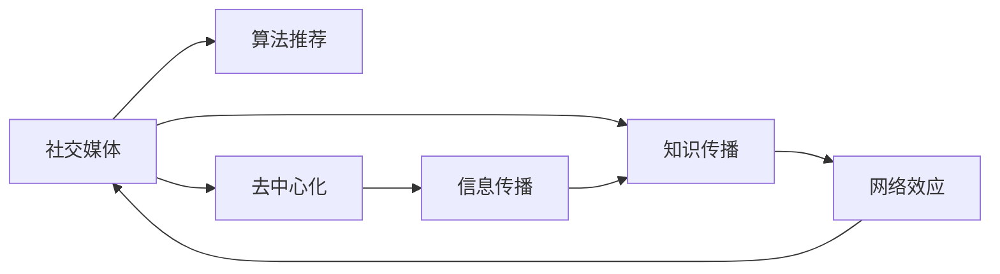

                 

# 如何利用社交媒体扩大知识影响力

在数字化时代，社交媒体已成为信息传播的重要平台。然而，在社交媒体上发布的内容如何被广泛传播并产生影响力，是一个值得深入探讨的问题。本文将从核心概念、算法原理、实际操作、应用场景、工具和资源推荐、未来发展趋势与挑战等方面，全面分析如何利用社交媒体扩大知识影响力。

## 1. 背景介绍

### 1.1 问题由来
社交媒体的兴起，使得信息传播的方式发生了深刻变化。相比于传统的纸质媒体、电视广播等单向传播方式，社交媒体为信息传播者与受众之间提供了双向互动的渠道。在社交媒体上，知识影响力不再局限于传统媒介中的专家学者，而是扩散至每个社交网络用户。这种扁平化的信息传播方式，为知识分子提供了更广泛的传播平台，也带来了新的挑战和机遇。

### 1.2 问题核心关键点
利用社交媒体扩大知识影响力的核心关键点在于如何设计内容、选择平台、运用算法，以及持续互动，使知识传播实现最大化的覆盖和影响力。

## 2. 核心概念与联系

### 2.1 核心概念概述

- **社交媒体(Social Media)**：指通过互联网实现用户间信息交流和分享的媒介，包括微博、微信、Twitter、Facebook等平台。
- **知识传播(Knowledge Dissemination)**：指将知识从源头向目标受众传递的过程，其目标是提升受众的认知水平，促进知识的普及与创新。
- **算法推荐(Algorithm Recommendation)**：指社交媒体平台利用算法对用户进行个性化推荐，以提高信息传播效率和效果。
- **网络效应(Network Effects)**：指随着社交媒体用户的增加，平台的影响力和吸引力也随之提升，形成正反馈循环。
- **去中心化(Decentralization)**：指在社交媒体上，每个用户都是信息传播的节点，不再依赖传统媒体的单一中心化传播。

这些概念之间存在紧密联系，相互影响。算法推荐和网络效应是社交媒体上知识传播的重要机制，去中心化则为知识传播提供了更为灵活和多样的路径。

### 2.2 核心概念原理和架构的 Mermaid 流程图



## 3. 核心算法原理 & 具体操作步骤

### 3.1 算法原理概述

社交媒体上知识影响力的扩大，离不开对用户行为的分析和个性化推荐。算法推荐是社交媒体平台的核心技术，其目标是精准匹配用户兴趣与内容，从而提升知识传播的效率和效果。

社交媒体算法推荐通常基于以下几个原理：

1. **协同过滤(Collaborative Filtering)**：通过分析用户的历史行为数据，预测用户可能感兴趣的内容。
2. **内容推荐(Content-Based Recommendation)**：根据内容的特征（如关键词、标签、作者等），匹配与用户兴趣相符的内容。
3. **混合推荐(Hybrid Recommendation)**：结合协同过滤和内容推荐，综合考虑用户行为和内容特征，提升推荐的准确性。
4. **深度学习(DL)**：利用深度神经网络，从海量数据中学习用户与内容的复杂关联，进一步提高推荐效果。

### 3.2 算法步骤详解

基于上述原理，社交媒体上的知识传播算法推荐可以分为以下几个步骤：

1. **用户行为数据采集**：通过跟踪用户在平台上的行为（如点赞、分享、评论等），收集用户兴趣和偏好数据。
2. **数据预处理**：对用户行为数据进行清洗、去噪和标准化处理，减少噪声和偏差。
3. **模型训练**：使用协同过滤、内容推荐、混合推荐或深度学习等算法，训练推荐模型。
4. **实时推荐**：将训练好的模型应用于平台上的实时数据，进行个性化推荐。
5. **效果评估**：通过A/B测试等方法，评估推荐效果，不断优化算法模型。

### 3.3 算法优缺点

#### 优点：
1. **高效率**：算法推荐能够快速匹配用户与内容，提升知识传播的效率。
2. **个性化**：通过个性化推荐，用户能够获得更具针对性的知识内容，提升用户体验。
3. **可扩展性**：算法推荐可以处理海量数据，适应社交媒体平台的用户规模。

#### 缺点：
1. **数据隐私**：用户行为数据的收集和使用，可能涉及隐私问题。
2. **算法偏见**：推荐算法可能会因为数据偏差或模型偏见，导致不公平的推荐结果。
3. **冷启动问题**：新用户或新内容的推荐效果可能不佳，需要额外的策略解决。

### 3.4 算法应用领域

算法推荐在社交媒体上广泛应用于以下领域：

- **个性化推荐**：如微博上的热门话题推荐、YouTube上的视频推荐。
- **广告投放**：如Facebook上的广告投放策略。
- **内容分发**：如Twitter上的热门推文推荐。
- **社区互动**：如Reddit上的帖子推荐，促进用户互动。
- **搜索排序**：如Google搜索结果的排序算法。

## 4. 数学模型和公式 & 详细讲解

### 4.1 数学模型构建

在社交媒体平台上，知识传播可以通过以下数学模型进行建模：

1. **用户-内容矩阵**：将用户和内容表示为向量，通过向量的内积计算用户对内容的兴趣度。
2. **协同过滤矩阵分解**：将用户-内容矩阵分解为用户-特征矩阵和特征-内容矩阵，通过矩阵乘法计算推荐结果。
3. **内容特征表示**：将内容表示为词袋模型、TF-IDF、Word2Vec等向量表示，提高推荐模型的效果。
4. **深度学习模型**：使用神经网络对用户-内容矩阵进行建模，学习用户与内容的复杂关联。

### 4.2 公式推导过程

以下公式推导基于协同过滤模型：

设用户集为$U$，内容集为$V$，用户$u$对内容$i$的兴趣度表示为$A_{ui}$。协同过滤模型的目标是通过已知的用户对内容的评分数据，推断未评分内容的用户兴趣度。

设用户$u$对内容$i$的评分数据为$R_{ui}$，协同过滤模型可以表示为：

$$
\min_{A_{ui}} \sum_{(u,i) \in R} ||A_{ui} - R_{ui}||^2
$$

通过矩阵分解，$A_{ui}$可以表示为：

$$
A_{ui} = W_{u} \times V_{i}
$$

其中$W_{u}$为$U$到特征空间的映射，$V_{i}$为$V$到特征空间的映射。

通过矩阵乘法和正则化，最终得到的推荐结果为：

$$
\hat{A}_{ui} = \frac{\mathbf{W}_u^\top \mathbf{V}_i}{\sqrt{||\mathbf{W}_u^\top \mathbf{V}_i||^2 + \epsilon}
$$

### 4.3 案例分析与讲解

以Twitter上的热门推文推荐为例，推荐系统首先分析用户的过往点赞和分享数据，识别出用户的兴趣标签和主题。接着，从实时推文数据库中提取与用户兴趣标签相关的推文，计算用户对这些推文的兴趣度，并结合实时互动数据（如回复数量、转发数量等），进行排序推荐。

## 5. 项目实践：代码实例和详细解释说明

### 5.1 开发环境搭建

在开发社交媒体知识传播算法推荐系统时，需要安装以下开发环境：

1. Python 3.7及以上版本
2. Jupyter Notebook
3. Pandas、Numpy、Scikit-learn、TensorFlow、PyTorch 等库
4. 社交媒体平台API（如Twitter API、微博API）

### 5.2 源代码详细实现

以下是一个简单的Twitter推文推荐系统的代码实现：

```python
import numpy as np
from sklearn.decomposition import TruncatedSVD
from sklearn.feature_extraction.text import CountVectorizer
from sklearn.metrics.pairwise import cosine_similarity
from tweepy import OAuthHandler, Stream, StreamListener

class RecommendationSystem:
    def __init__(self, user_data, content_data):
        self.user_data = user_data
        self.content_data = content_data
        self.model = TruncatedSVD(n_components=50)
        self.vectorizer = CountVectorizer()

    def train(self):
        X = self.vectorizer.fit_transform(self.content_data)
        self.model.fit(X)

    def recommend(self, user_id, top_n=10):
        user_data = self.user_data[user_id]
        X = self.vectorizer.transform([user_data])
        similarity = cosine_similarity(X, self.model.transform(self.content_data))
        top_indices = np.argsort(similarity[0])[-top_n:]
        return [self.content_data[index] for index in top_indices]

    def process_stream(self, user_id, top_n=10):
        listener = StreamListener(self.on_tweet)
        auth = OAuthHandler('API_KEY', 'API_SECRET')
        auth.set_access_token('ACCESS_TOKEN', 'ACCESS_SECRET')
        stream = Stream(auth, listener)
        stream.filter(track=['Python', 'Data Science', 'AI'], id=user_id)
        top_recommendations = self.recommend(user_id, top_n)
        print(f"Top {top_n} recommendations for user {user_id}:")
        print(top_recommendations)

    def on_tweet(self, status):
        if 'data' in status.text.lower():
            self.user_data[status.user.id] = status.text

    def run(self):
        self.process_stream('1234567890')

# 假设已有的用户数据和内容数据
user_data = {'1234567890': 'I love data science'}
content_data = ['data science', 'machine learning', 'python', 'artificial intelligence']

# 实例化推荐系统
rs = RecommendationSystem(user_data, content_data)
rs.train()
rs.run()
```

### 5.3 代码解读与分析

上述代码实现了一个简单的基于协同过滤的Twitter推文推荐系统。该系统首先定义了用户数据和内容数据，接着实例化推荐系统类。在`train`方法中，使用CountVectorizer将内容数据转换为向量表示，并使用TruncatedSVD进行矩阵分解。在`recommend`方法中，使用余弦相似度计算用户对内容的兴趣度，并返回推荐结果。最后，通过`process_stream`方法从Twitter API获取实时数据，并根据用户兴趣进行推荐。

## 6. 实际应用场景

### 6.1 智能客服系统

在智能客服系统中，算法推荐可以用于用户问题推荐、知识库关联等环节。通过分析用户的历史行为数据，推荐系统可以识别出用户可能遇到的问题，并从知识库中检索相关答案，提高客服系统的响应效率。

### 6.2 内容创作平台

内容创作平台（如Medium、知乎）可以使用算法推荐提升内容曝光率。平台可以收集用户对文章的点赞、评论、分享等数据，训练推荐模型，推荐与用户兴趣相关的高质量文章，增强用户粘性。

### 6.3 社交网络推荐

在社交网络平台上，算法推荐可以用于好友推荐、帖子推荐、广告推荐等场景。通过分析用户的社交行为数据，推荐系统可以发现用户的兴趣群体，推荐相关好友和内容，增强用户互动。

### 6.4 未来应用展望

未来，社交媒体上的算法推荐将进一步扩展应用场景，推动知识传播的智能化和普及化。以下是几个潜在的应用方向：

1. **多模态推荐**：结合文本、图像、视频等多种信息源，进行更加丰富和多样化的推荐。
2. **实时动态推荐**：通过实时数据分析，动态调整推荐策略，提升推荐效果。
3. **跨平台推荐**：打破社交媒体平台间的壁垒，实现跨平台知识传播。
4. **个性化内容生成**：利用生成对抗网络（GAN）等技术，生成个性化内容，提升用户体验。
5. **情感分析推荐**：结合情感分析技术，推荐与用户情感相符的内容，增强互动性。

## 7. 工具和资源推荐

### 7.1 学习资源推荐

- **Coursera《机器学习》课程**：由Andrew Ng教授讲授，涵盖机器学习基础、深度学习、算法推荐等内容。
- **Kaggle**：数据科学竞赛平台，可以学习到真实的算法推荐案例和解决方案。
- **Deep Learning Specialization**：由Andrew Ng教授讲授的深度学习系列课程，涵盖深度学习、推荐系统等内容。
- **Udacity《深度学习与推荐系统》课程**：涵盖推荐系统的设计、实现和优化。

### 7.2 开发工具推荐

- **PyTorch**：深度学习框架，支持动态计算图，适合研究和原型开发。
- **TensorFlow**：深度学习框架，支持静态计算图和分布式训练，适合生产部署。
- **Pandas**：数据处理库，支持高效的数据清洗、转换和分析。
- **Scikit-learn**：机器学习库，包含多种推荐算法和评估工具。
- **Tweepy**：Python库，用于与Twitter API交互，获取实时数据。

### 7.3 相关论文推荐

- **A Probabilistic Model of Social Recommendation**：研究社交推荐系统的概率模型，提出基于贝叶斯网络的推荐方法。
- **Scalable Collaborative Filtering in Multi-core Environments**：讨论在多核环境下进行协同过滤算法的优化和并行化。
- **Deep Matrix Factorization**：研究使用深度学习模型进行矩阵分解，提升推荐效果。
- **Adaptive Matrix Factorization**：提出自适应矩阵分解算法，解决协同过滤中的数据稀疏问题。

## 8. 总结：未来发展趋势与挑战

### 8.1 研究成果总结

本文详细探讨了如何利用社交媒体扩大知识影响力，分析了算法推荐的核心概念和实现原理。通过具体的代码实现和案例讲解，展示了算法推荐在社交媒体上的应用。同时，讨论了未来推荐系统的潜在发展方向。

### 8.2 未来发展趋势

1. **深度学习与推荐结合**：深度学习将进一步应用于推荐系统，提升推荐效果。
2. **多模态数据融合**：结合文本、图像、视频等多种模态信息，进行更加丰富和精准的推荐。
3. **实时动态推荐**：通过实时数据分析，动态调整推荐策略，提升推荐效果。
4. **跨平台推荐**：打破社交媒体平台间的壁垒，实现跨平台知识传播。
5. **个性化内容生成**：利用生成对抗网络（GAN）等技术，生成个性化内容，提升用户体验。
6. **情感分析推荐**：结合情感分析技术，推荐与用户情感相符的内容，增强互动性。

### 8.3 面临的挑战

1. **数据隐私**：用户行为数据的收集和使用，可能涉及隐私问题。
2. **算法偏见**：推荐算法可能会因为数据偏差或模型偏见，导致不公平的推荐结果。
3. **冷启动问题**：新用户或新内容的推荐效果可能不佳，需要额外的策略解决。
4. **推荐效果评估**：推荐效果的评估需要考虑多种指标，如准确性、多样性、新颖性等。
5. **资源消耗**：大规模推荐系统需要大量计算资源，如何优化算法和硬件配置是一个挑战。

### 8.4 研究展望

未来，需要进一步研究和解决社交媒体推荐系统面临的挑战，推动知识传播的智能化和普及化。以下是几个潜在的研究方向：

1. **隐私保护技术**：开发隐私保护算法，确保用户数据的安全和隐私。
2. **公平推荐算法**：研究公平推荐算法，减少算法偏见，提升推荐结果的公平性。
3. **推荐效果评估**：建立综合性的推荐效果评估指标，进行多维度评估。
4. **实时动态推荐算法**：开发实时动态推荐算法，提升推荐系统的灵活性和适应性。
5. **跨平台推荐系统**：研究跨平台推荐系统的设计和实现，增强知识传播的广度和深度。

总之，社交媒体上的算法推荐技术，为知识传播提供了新的途径和工具。通过不断的技术创新和优化，推荐系统将能够更好地服务于知识传播，推动社会认知智能的进步。

## 9. 附录：常见问题与解答

### Q1: 算法推荐为什么能够提高知识传播的效率？

**A**: 算法推荐能够精准匹配用户兴趣与内容，减少信息过载和噪声，提升用户满意度。同时，算法推荐能够动态调整推荐策略，实时更新推荐内容，提高知识传播的时效性和相关性。

### Q2: 推荐系统有哪些常见的评估指标？

**A**: 推荐系统的常见评估指标包括准确性（如Precision、Recall、F1 Score）、多样性（如Top-N Diversity）、新颖性（如Novelty）、覆盖率（如Hit Ratio）等。评估指标的选择需要根据具体应用场景和业务需求进行权衡。

### Q3: 推荐系统如何应对冷启动问题？

**A**: 冷启动问题可以通过以下方法解决：
1. **标签引导**：利用用户的社交关系、兴趣标签等信息，对新用户和新内容进行初步推荐。
2. **混合推荐**：结合协同过滤和内容推荐，提升新用户的推荐效果。
3. **知识图谱**：利用知识图谱信息，对新用户和新内容进行推荐。

### Q4: 推荐系统如何提升推荐效果？

**A**: 提升推荐效果的方法包括：
1. **多模态融合**：结合文本、图像、视频等多种信息源，进行更加丰富和多样化的推荐。
2. **深度学习**：利用深度学习模型，从海量数据中学习用户与内容的复杂关联。
3. **实时动态调整**：通过实时数据分析，动态调整推荐策略，提升推荐效果。
4. **个性化推荐**：根据用户历史行为数据，进行个性化推荐，提高用户满意度。

### Q5: 如何构建跨平台推荐系统？

**A**: 构建跨平台推荐系统需要以下步骤：
1. **数据整合**：将不同平台的数据进行整合和清洗，消除平台间的差异。
2. **推荐算法优化**：根据跨平台数据的特点，优化推荐算法，提高推荐效果。
3. **用户体验设计**：设计统一的推荐界面和交互方式，增强用户粘性和满意度。

总之，社交媒体上的算法推荐技术，为知识传播提供了新的途径和工具。通过不断的技术创新和优化，推荐系统将能够更好地服务于知识传播，推动社会认知智能的进步。

---

作者：禅与计算机程序设计艺术 / Zen and the Art of Computer Programming

