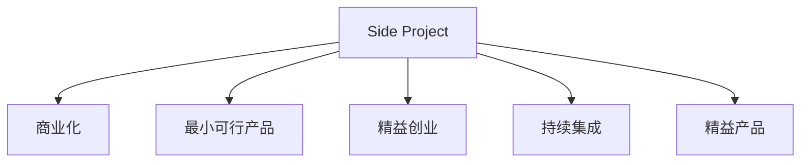

                 

## 1. 背景介绍

### 1.1 问题由来
在当今快速变化的技术环境中，很多技术人员倾向于利用业余时间开展Side Project（副业项目），例如编程爱好者开源的GitHub项目、技术博客等。这些项目往往以个人兴趣或探索新技术为目标，充满激情和创造力，但也常常由于种种原因，无法转化为稳定的主业。

### 1.2 问题核心关键点
将Side Project转化为主业，关键在于构建一个可持续发展的业务模式，包括但不限于商业模式、市场定位、运营策略、技术实现等各个方面。这一过程需要综合考虑技术、市场、资金、团队等多个因素，才能确保项目的长期成功。

### 1.3 问题研究意义
成功的Side Project转化为主业，不仅能够带来经济收益，还能促进个人技术成长和团队发展。这种转化能够推动技术创新，为社会带来积极影响。因此，研究如何将Side Project转化为主业，对于推动技术产业发展和个人职业发展具有重要意义。

## 2. 核心概念与联系

### 2.1 核心概念概述

为更好地理解Side Project转化为主业的过程，本节将介绍几个关键概念：

- **Side Project（副业项目）**：指技术人员在业余时间开发的项目，通常以个人兴趣或技术探索为目标，不直接产生经济效益。
- **商业化（Commercialization）**：将Side Project转化为盈利性业务的过程，包括明确商业模式、寻找客户、优化运营等步骤。
- **最小可行产品（Minimum Viable Product, MVP）**：指在资源有限的情况下，尽快开发的最低功能版本产品，用以测试市场反应，验证商业模式。
- **精益创业（Lean Startup）**：一种创业方法论，强调快速迭代和用户反馈，以最小成本验证商业价值。
- **持续集成（Continuous Integration, CI）**：一种软件开发实践，通过自动化构建和测试，确保代码质量，提升开发效率。
- **精益产品（Lean Product）**：基于用户反馈，快速迭代产品功能和用户体验，以提高产品竞争力和用户满意度。

这些概念之间的逻辑关系可以通过以下Mermaid流程图来展示：



这个流程图展示了很多关键概念及其之间的关系：

1. Side Project通过商业化实现盈利。
2. MVP用于快速验证商业模式和产品功能。
3. 精益创业方法强调快速迭代和市场验证。
4. CI用于自动化代码构建和测试。
5. 精益产品理念指导产品快速迭代和用户反馈。

这些概念共同构成了Side Project转化为主业的全过程，为确保项目成功提供了理论支撑。

## 3. 核心算法原理 & 具体操作步骤
### 3.1 算法原理概述

Side Project转化为主业的过程，本质上是基于市场和用户需求驱动的项目发展过程。核心思想是通过商业化和持续迭代的业务模式，将个人兴趣和技术探索转化为可持续发展的商业模式。

形式化地，假设Side Project为 $P$，市场需求为 $D$。转化过程的目标是找到最佳转化路径 $T$，使得：

$$
\max_{T} \int_{D} P(T) \times D = \text{Total Revenue}
$$

其中，$P(T)$ 表示项目 $P$ 在路径 $T$ 上的实际产出，$D$ 表示市场需求。优化目标是通过路径 $T$ 最大化项目的总收益。

### 3.2 算法步骤详解

Side Project转化为主业的一般包括以下几个关键步骤：

**Step 1: 定义项目愿景和商业模式**

- 明确项目的愿景和核心价值主张。例如，是解决用户痛点，还是探索新技术？
- 设计商业模型，包括收入来源、成本结构、利润分配等。例如，是订阅模式、广告模式，还是B2B销售？

**Step 2: 开发最小可行产品（MVP）**

- 快速构建MVP，实现项目的基本功能，验证核心价值主张。
- 将MVP推向市场，收集用户反馈，确认市场需求。
- 根据用户反馈优化MVP，进行快速迭代。

**Step 3: 进行精益创业**

- 制定精益创业计划，设置明确的目标和里程碑。
- 以最小成本进行市场验证，收集关键数据。
- 根据数据反馈调整产品策略，确保商业模式可行。

**Step 4: 实施持续集成（CI）**

- 建立持续集成流程，自动化代码构建和测试。
- 引入持续集成工具，如Jenkins、GitLab CI等，提高开发效率。
- 确保每次迭代都有稳定的代码质量，减少返工。

**Step 5: 精益产品管理**

- 采用敏捷开发方法，如Scrum、Kanban等，确保快速响应市场变化。
- 引入用户反馈机制，及时调整产品策略和功能。
- 持续优化产品设计和用户体验，提升用户满意度和忠诚度。

**Step 6: 商业化**

- 制定商业化策略，包括市场推广、客户获取、销售渠道等。
- 逐步扩展产品规模，建立稳定的客户基础。
- 优化商业模式，提升盈利能力和市场竞争力。

以上是Side Project转化为主业的一般流程。在实际应用中，还需要针对具体项目的特点，对转化过程的各个环节进行优化设计，如改进产品设计、优化运营流程、引入更多用户反馈机制等，以进一步提升项目成功的可能性。

### 3.3 算法优缺点

Side Project转化为主业的方法具有以下优点：

1. 高效验证市场：通过快速构建MVP，能够迅速验证市场需求和商业模式，减少时间成本和资源浪费。
2. 灵活应对市场变化：通过精益创业方法，能够快速迭代产品策略，快速响应市场变化。
3. 提升开发效率：通过持续集成和自动化测试，确保代码质量，提升开发效率。
4. 用户导向：通过用户反馈机制，能够持续优化产品设计和用户体验，提高用户满意度和忠诚度。

同时，该方法也存在一定的局限性：

1. 需要较高的技术和市场洞察能力：只有具备较强的技术实力和市场洞察能力，才能制定有效的商业策略和产品规划。
2. 初期投入较大：需要投入一定的时间和资金进行市场验证和产品迭代，风险较高。
3. 用户获取成本高：初期用户获取需要大量的市场推广和客户关系维护，成本较高。

尽管存在这些局限性，但就目前而言，Side Project转化为主业的方法仍是大规模项目成功转型的主流范式。未来相关研究的重点在于如何进一步降低转化风险，提高项目成功率。

### 3.4 算法应用领域

Side Project转化为主业的方法已经在软件开发、互联网应用、硬件开发等多个领域得到了广泛的应用，以下是一些典型案例：

- **Spotify**：通过开发最小可行产品（MVP）和精益创业方法，从一个小型音乐推荐应用，发展成为全球领先的流媒体平台。
- **Dropbox**：从一个小型的文件同步工具，逐步扩展功能，成为领先的云存储服务提供商。
- **GitHub**：从一个开源社区，发展成为软件开发协作和版本控制的首选平台。
- **Tesla**：从一个小型电动汽车公司，通过精益创业和持续改进，成为电动汽车行业的领军企业。

这些成功案例展示了Side Project转化为主业的多样性和可行性。未来，随着技术的发展和市场的变化，更多创新型的Side Project将有机会成功转化为主业，推动技术创新和产业发展。

## 4. 数学模型和公式 & 详细讲解  
### 4.1 数学模型构建

本节将使用数学语言对Side Project转化为主业的过程进行更加严格的刻画。

假设Side Project的初始用户数量为 $U_0$，市场规模为 $S$，产品每月新增用户数量为 $G$，用户留存率为 $R$，月平均销售收入为 $I$。假设市场规模增长率为 $g$，产品每月市场推广投入为 $C$，则转化后的总收益 $B$ 可以表示为：

$$
B = (U_0 + G \times (1-R)^{-1} + C) \times I \times (1+g)
$$

其中 $G \times (1-R)^{-1}$ 表示每月新增加的用户数，$C$ 表示每月市场推广投入，$I \times (1+g)$ 表示市场规模的增长对收入的增量贡献。

### 4.2 公式推导过程

以上公式中，每个变量都代表了不同的市场和产品特性。以下推导过程展示了如何将这些变量综合起来，构建最终的收益模型。

1. 用户增长模型：假设用户增长遵循几何增长模型，则每月新增用户数量为 $G$，用户留存率为 $R$。则每月实际新增用户数为 $G \times (1-R)^{-1}$。

2. 收入模型：每月销售收入为 $I$，市场规模增长率为 $g$。则市场规模的增长对收入的增量贡献为 $I \times g$。

3. 成本模型：每月市场推广投入为 $C$。则总收益为 $B = (U_0 + G \times (1-R)^{-1} + C) \times I \times (1+g)$。

通过这个收益模型，可以清晰地看到各个变量对项目收益的影响。优化各个变量的取值，将有助于提升项目的整体收益。

### 4.3 案例分析与讲解

让我们以Tesla为例，分析其在Side Project转化为主业过程中，如何通过精准的市场定位和持续的创新，实现了快速发展。

- **市场定位**：Tesla从一开始就将目标客户定位于环保意识强烈的用户，而不是大众市场。通过精准的市场定位，Tesla在早期就找到了其核心用户群体。
- **技术创新**：Tesla在电池技术、自动驾驶等方面持续投入研发，通过技术创新不断提升产品的竞争力和用户体验。
- **精益创业**：Tesla采用精益创业方法，快速迭代产品设计和市场策略，逐步扩展市场规模。
- **持续改进**：Tesla不断优化供应链和生产流程，提升生产效率和产品质量，巩固了其市场领先地位。

通过这些策略，Tesla从一个小型电动汽车公司，发展成为全球领先的电动汽车品牌，展示了Side Project转化为主业的巨大潜力。

## 5. 项目实践：代码实例和详细解释说明
### 5.1 开发环境搭建

在进行Side Project转化为主业实践前，我们需要准备好开发环境。以下是使用Python进行Django开发的环境配置流程：

1. 安装Python：从官网下载并安装Python，用于编写后端代码。
2. 安装Django：使用pip安装Django框架，用于构建Web应用。
3. 配置数据库：安装并配置SQLite数据库，用于存储应用数据。
4. 安装第三方库：安装Django的第三方库，如django-rest-framework、django-debug-toolbar等，提升开发效率和功能。
5. 设置环境变量：配置应用的环境变量，如调试模式、日志级别等，方便调试和生产环境切换。

完成上述步骤后，即可在本地搭建开发环境，开始Side Project的开发。

### 5.2 源代码详细实现

这里我们以一个简单的博客应用为例，展示如何使用Django构建并优化Side Project。

**1. 初始化项目**

```bash
django-admin startproject myblog
cd myblog
```

**2. 创建应用**

```bash
python manage.py startapp blog
```

**3. 编写视图**

在 `blog/views.py` 中编写视图函数：

```python
from django.shortcuts import render
from django.http import HttpResponse

def index(request):
    return render(request, 'blog/index.html')
```

**4. 创建模板**

在 `blog/templates/blog` 中创建 `index.html` 模板：

```html
<!DOCTYPE html>
<html>
<head>
    <title>My Blog</title>
</head>
<body>
    <h1>Welcome to My Blog</h1>
    <p>This is my first blog post.</p>
</body>
</html>
```

**5. 配置URL**

在 `blog/urls.py` 中配置URL路由：

```python
from django.urls import path

from . import views

urlpatterns = [
    path('', views.index, name='index'),
]
```

**6. 配置应用**

在 `myblog/settings.py` 中配置应用的路径：

```python
INSTALLED_APPS = [
    ...
    'blog',
    ...
]
```

**7. 运行项目**

启动开发服务器：

```bash
python manage.py runserver
```

访问 `http://127.0.0.1:8000/`，即可看到创建好的博客页面。

### 5.3 代码解读与分析

让我们再详细解读一下关键代码的实现细节：

**1. 视图函数**

```python
from django.shortcuts import render
from django.http import HttpResponse

def index(request):
    return render(request, 'blog/index.html')
```

- `render` 函数将请求转发到指定的模板，并渲染模板返回响应。
- 模板 `index.html` 返回欢迎页面，包含欢迎信息和简单内容。

**2. 模板**

```html
<!DOCTYPE html>
<html>
<head>
    <title>My Blog</title>
</head>
<body>
    <h1>Welcome to My Blog</h1>
    <p>This is my first blog post.</p>
</body>
</html>
```

- `<h1>` 标签用于定义页面标题。
- `<p>` 标签用于定义段落内容。

**3. URL路由**

```python
from django.urls import path

from . import views

urlpatterns = [
    path('', views.index, name='index'),
]
```

- `path` 函数定义URL路由。
- `views.index` 函数对应视图函数，当访问根URL时，返回欢迎页面。

**4. 应用配置**

```python
INSTALLED_APPS = [
    ...
    'blog',
    ...
]
```

- `INSTALLED_APPS` 列表用于配置所有已安装的应用。

通过这些代码实现，我们成功地搭建了一个简单的博客应用，展示了如何使用Django进行Web开发。

当然，实际应用中，还需要考虑更多因素，如用户认证、内容管理、SEO优化、静态资源管理等，以提升应用的功能和用户体验。

## 6. 实际应用场景
### 6.1 社交媒体平台

Side Project转化为主业的典型应用场景之一是社交媒体平台的构建。例如，Facebook、Twitter等社交媒体平台的早期版本，都是基于Side Project开发和迭代，逐步发展成为全球用户最多的社交平台。

在技术实现上，可以收集用户的使用反馈，不断迭代产品功能和界面设计，以提升用户满意度和粘性。同时，引入广告和订阅模式，逐步实现商业化，最终成为稳定的盈利业务。

### 6.2 电子商务平台

电子商务平台的Side Project转化也是常见的应用场景。例如，亚马逊的早期版本，就是通过Side Project逐步扩展功能，从一个小型书店网站，发展成为全球领先的电子商务平台。

在技术实现上，可以引入在线支付、物流跟踪、用户评价等功能，提升用户体验。同时，通过B2B和B2C模式，逐步扩大用户群体，实现商业化，最终成为稳定的盈利业务。

### 6.3 软件开发平台

软件开发平台的Side Project转化也是典型的应用场景。例如，GitHub的早期版本，就是通过Side Project逐步扩展功能，从一个开源社区，发展成为软件开发协作和版本控制的首选平台。

在技术实现上，可以引入协作工具、版本控制、代码审查等功能，提升开发效率和协作效果。同时，通过广告和付费服务模式，逐步实现商业化，最终成为稳定的盈利业务。

### 6.4 未来应用展望

随着技术的发展和市场的变化，Side Project转化为主业的应用场景将进一步扩展。未来，更多的创新型Side Project将有机会成功转化为主业，推动技术创新和产业发展。

在智慧医疗领域，基于Side Project的医疗问答、病历分析、药物研发等应用将提升医疗服务的智能化水平，辅助医生诊疗，加速新药开发进程。

在智能教育领域，Side Project的作业批改、学情分析、知识推荐等功能，因材施教，促进教育公平，提高教学质量。

在智慧城市治理中，Side Project的城市事件监测、舆情分析、应急指挥等功能，提高城市管理的自动化和智能化水平，构建更安全、高效的未来城市。

此外，在企业生产、社会治理、文娱传媒等众多领域，基于Side Project的人工智能应用也将不断涌现，为经济社会发展注入新的动力。

## 7. 工具和资源推荐
### 7.1 学习资源推荐

为了帮助开发者系统掌握Side Project转化为主业的理论基础和实践技巧，这里推荐一些优质的学习资源：

1. **《精益创业》（Eric Ries 著）**：经典创业指导书籍，详细介绍了精益创业的各个环节，帮助创业者快速验证市场和商业模式。
2. **《最小可行产品》（Dan Blank 著）**：介绍如何通过构建MVP快速验证市场反应，最大化投资回报。
3. **《Python Web开发实战》（Chris Jones 著）**：详细介绍了如何使用Django、Flask等Python框架开发Web应用，为Side Project的Web开发提供参考。
4. **《持续集成与持续部署》（Jez Humble、David Farley 著）**：介绍CI/CD的原理和实践，帮助开发者提升开发效率和代码质量。
5. **《精益产品管理》（Rick Flanagan 著）**：介绍如何通过用户反馈和市场数据，快速迭代产品功能和用户体验。

通过对这些资源的学习实践，相信你一定能够快速掌握Side Project转化为主业的技巧，并用于解决实际的技术问题。

### 7.2 开发工具推荐

高效的开发离不开优秀的工具支持。以下是几款用于Side Project转化为主业开发的常用工具：

1. **Django**：Python Web开发框架，提供强大的URL路由、模板引擎、ORM等功能，支持快速搭建Web应用。
2. **Flask**：轻量级Web开发框架，灵活易用，适合构建小型Web应用和API接口。
3. **Jenkins**：开源自动化构建工具，支持CI/CD流程，提高开发效率和代码质量。
4. **GitLab CI**：GitLab内置的CI/CD工具，提供强大的构建、测试、部署等功能，支持持续集成和持续交付。
5. **Docker**：容器化平台，帮助开发者构建、部署和管理应用，提升应用的可移植性和稳定性。
6. **Kubernetes**：容器编排工具，支持大规模集群管理和自动化运维，提升应用的扩展性和可用性。

合理利用这些工具，可以显著提升Side Project转化为主业任务的开发效率，加快创新迭代的步伐。

### 7.3 相关论文推荐

Side Project转化为主业的研究源于学界的持续研究。以下是几篇奠基性的相关论文，推荐阅读：

1. **《精益创业方法论》**：介绍精益创业的核心理念和方法，帮助创业者快速验证市场和商业模式。
2. **《最小可行产品的构建与评估》**：探讨最小可行产品的构建和评估方法，帮助开发者快速迭代产品功能。
3. **《持续集成与持续部署的实践》**：介绍CI/CD的原理和实践，帮助开发者提升开发效率和代码质量。
4. **《精益产品管理与用户反馈》**：介绍如何通过用户反馈和市场数据，快速迭代产品功能和用户体验。

这些论文代表了大语言模型微调技术的发展脉络。通过学习这些前沿成果，可以帮助研究者把握学科前进方向，激发更多的创新灵感。

## 8. 总结：未来发展趋势与挑战

### 8.1 总结

本文对Side Project转化为主业的方法进行了全面系统的介绍。首先阐述了Side Project转化为主业的研究背景和意义，明确了商业化和持续迭代的重要性。其次，从原理到实践，详细讲解了Side Project转化的数学模型和核心算法，给出了转化的完整代码实例。同时，本文还广泛探讨了Side Project在多个行业领域的应用前景，展示了转化的巨大潜力。此外，本文精选了Side Project转化的各类学习资源，力求为读者提供全方位的技术指引。

通过本文的系统梳理，可以看到，Side Project转化为主业方法正在成为技术转型的重要范式，极大地拓展了技术项目的市场范围和收益空间。成功转化的关键在于市场洞察、产品设计、商业策略和持续迭代的综合能力。未来，伴随技术的进步和市场的变化，更多创新型的Side Project将有机会成功转化为主业，推动技术创新和产业发展。

### 8.2 未来发展趋势

展望未来，Side Project转化为主业技术将呈现以下几个发展趋势：

1. **技术生态不断完善**：随着技术社区的不断发展，各种开发工具和框架不断优化，为Side Project转化为主业提供了更多的技术支持。
2. **市场环境日益成熟**：随着市场的不断扩大和成熟，更多创业者有机会将Side Project转化为盈利业务。
3. **产品迭代持续加速**：持续创业和快速迭代的理念将深入人心，推动技术和产品的快速发展。
4. **跨领域融合加剧**：Side Project转化为主业不再局限于某一行业，而是向更广泛的技术领域拓展，促进技术创新和产业升级。
5. **全球市场竞争加剧**：全球市场的不断扩大，为Side Project转化为主业提供了更多机会，但也带来了更大的竞争压力。

这些趋势凸显了Side Project转化为主业技术的广阔前景。这些方向的探索发展，必将进一步提升技术项目的商业价值和市场竞争力，为社会带来更大的进步和创新。

### 8.3 面临的挑战

尽管Side Project转化为主业技术已经取得了显著成就，但在迈向更加智能化、普适化应用的过程中，它仍面临着诸多挑战：

1. **资源限制**：初创公司往往面临资源有限的问题，难以在短时间内完成商业化和市场验证。如何高效利用资源，提升转化成功率，是首要挑战。
2. **市场需求变化快**：市场环境和用户需求变化迅速，如何保持灵活适应，快速迭代产品策略，是转化的关键问题。
3. **技术风险高**：技术实现复杂，风险较高。如何降低技术风险，确保项目成功，是转化的重要保障。
4. **用户获取难**：初期用户获取成本高，难以迅速建立稳定的用户基础。如何提升用户获取效率，是转化的核心问题。
5. **竞争激烈**：市场竞争日益激烈，如何建立品牌和市场优势，保持长期竞争力，是转化的重要目标。

尽管存在这些挑战，但通过不断的实践和创新，相信Side Project转化为主业的方法将不断成熟，更多技术项目将成功实现商业化。

### 8.4 研究展望

面向未来，Side Project转化为主业技术的研究方向可能包括以下几个方面：

1. **探索无监督和半监督转化方法**：摆脱对大量标注数据的依赖，利用自监督学习、主动学习等无监督和半监督范式，最大限度利用非结构化数据，实现更加灵活高效的转化。
2. **研究参数高效和计算高效的转化范式**：开发更加参数高效的转化方法，在固定大部分预训练参数的同时，只更新极少量的任务相关参数。同时优化转化模型的计算图，减少前向传播和反向传播的资源消耗，实现更加轻量级、实时性的部署。
3. **融合因果和对比学习范式**：通过引入因果推断和对比学习思想，增强转化模型建立稳定因果关系的能力，学习更加普适、鲁棒的语言表征，从而提升模型泛化性和抗干扰能力。
4. **引入更多先验知识**：将符号化的先验知识，如知识图谱、逻辑规则等，与神经网络模型进行巧妙融合，引导转化过程学习更准确、合理的语言模型。同时加强不同模态数据的整合，实现视觉、语音等多模态信息与文本信息的协同建模。
5. **结合因果分析和博弈论工具**：将因果分析方法引入转化模型，识别出模型决策的关键特征，增强输出解释的因果性和逻辑性。借助博弈论工具刻画人机交互过程，主动探索并规避模型的脆弱点，提高系统稳定性。
6. **纳入伦理道德约束**：在转化模型的训练目标中引入伦理导向的评估指标，过滤和惩罚有偏见、有害的输出倾向。同时加强人工干预和审核，建立模型行为的监管机制，确保输出符合人类价值观和伦理道德。

这些研究方向将推动Side Project转化为主业技术的不断演进，为构建安全、可靠、可解释、可控的智能系统铺平道路。

## 9. 附录：常见问题与解答

**Q1：Side Project转化为主业的第一步是什么？**

A: 定义项目愿景和商业模式是Side Project转化为主业的第一步。需要明确项目的核心价值主张，设计合理的商业模式，为后续的市场验证和产品迭代提供方向。

**Q2：如何高效验证市场？**

A: 通过构建最小可行产品（MVP），快速验证市场需求和商业模式。MVP只需要实现核心功能，最小化成本和时间，最大化验证效果。

**Q3：如何实现持续迭代？**

A: 采用精益创业方法，制定明确的目标和里程碑，快速迭代产品功能和市场策略，逐步优化商业模式。持续收集用户反馈，快速响应市场变化。

**Q4：如何选择技术工具和框架？**

A: 根据项目需求和开发经验选择合适的开发工具和框架。例如，Django适合构建Web应用，Flask适合构建API接口，GitLab CI适合持续集成和持续交付，Kubernetes适合容器编排和大规模集群管理。

**Q5：如何应对技术风险？**

A: 制定详细的产品规划和开发计划，合理分配资源和时间，确保技术实现的质量。引入代码审查、单元测试、持续集成等工具，提升开发效率和代码质量。

**Q6：如何提升用户获取效率？**

A: 利用市场推广和营销策略，提高用户获取效率。通过数据分析和用户反馈，优化产品策略和推广效果，快速积累用户基础。

**Q7：如何保持长期竞争力？**

A: 建立品牌和市场优势，持续优化产品功能和用户体验。引入人工智能和大数据技术，提升产品智能化和个性化水平。

这些问题的解答，为Side Project转化为主业提供了全面的技术指引。通过系统学习和实践，相信你一定能够成功将Side Project转化为盈利业务，推动技术创新和产业发展。

---

作者：禅与计算机程序设计艺术 / Zen and the Art of Computer Programming

