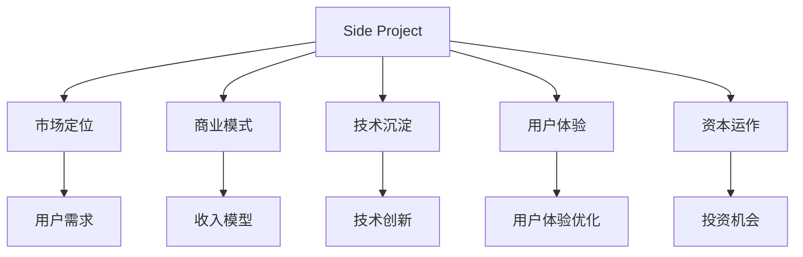

                 

## 1. 背景介绍

### 1.1 问题由来

在今天快速发展的互联网时代，Side Project（副业项目）已经成为了越来越多开发者和创业者的重要选择。Side Project不仅仅是个人兴趣的体现，更是职业发展和商业化探索的舞台。然而，并非所有的Side Project都能像Facebook、Dropbox、Google Maps等经典案例一样，最终成为商业帝国，乃至独角兽企业。究竟是什么原因让Side Project的商业化之路如此艰难？我们又该如何在现有技术、资源和市场中实现Side Project的转型？本文将深入探讨如何将Side Project成功转化为独角兽企业的秘诀。

### 1.2 问题核心关键点

Side Project向独角兽转型的核心关键点包括以下几点：

- **市场定位**：明确目标市场，并在此基础上进行市场研究，找出用户需求和痛点。
- **商业模式**：构建可行的商业模式，确保Side Project的长期可持续性。
- **团队构建**：组建高效的团队，吸纳具有不同背景和技术专长的成员。
- **技术沉淀**：在技术上不断创新和突破，构建核心竞争优势。
- **用户体验**：注重产品设计和用户体验，满足用户需求。
- **资本运作**：寻找投资机会，合理利用资本力量。

这些关键点共同构成了Side Project转型为独角兽企业的基石，每一环节都需要深思熟虑和精心执行。

### 1.3 问题研究意义

将Side Project成功转化为独角兽企业，不仅能够实现个人的职业梦想，更能够带动整个行业的技术进步和商业创新。具体而言，其研究意义在于：

- **推动技术创新**：Side Project往往能够探索前沿技术，引领行业发展。
- **创造就业机会**：成功转型的Side Project能为社会创造大量高附加值就业机会。
- **促进市场繁荣**：独角兽企业对市场环境的改善和产业升级具有积极影响。
- **激励创新精神**：提供丰富的成功案例，激发更多的创业者投入技术创新和商业探索。

## 2. 核心概念与联系

### 2.1 核心概念概述

为更好地理解Side Project转型为独角兽企业的关键路径，本节将介绍几个核心概念：

- **Side Project**：通常指开发者利用业余时间开发的软件或应用，旨在探索技术可能性、解决特定问题或追求个人兴趣。
- **独角兽企业**：指那些估值超过10亿美元的私营科技公司，通常是技术和市场创新的代表。
- **市场定位**：明确目标市场的具体需求和特点，定位Side Project的定位策略。
- **商业模式**：制定具有可行性和竞争力的商业模式，为Side Project的持续发展和盈利提供基础。
- **资本运作**：通过融资、并购等手段，实现Side Project的快速成长和价值提升。

这些核心概念之间的逻辑关系可以通过以下Mermaid流程图来展示：



这个流程图展示了Side Project转型为独角兽企业的关键路径和各个环节：

1. 从Side Project开始，通过市场定位找到目标用户。
2. 结合市场需求，制定可行的商业模式。
3. 在技术上进行持续创新，构建核心竞争力。
4. 注重用户体验，提升用户满意度和留存率。
5. 通过资本运作，加速企业成长和扩展。

## 3. 核心算法原理 & 具体操作步骤

### 3.1 算法原理概述

Side Project向独角兽企业的转型，本质上是商业模式的升级和优化过程。它需要依靠技术创新、市场需求和资本运作三者的有机结合，形成良性循环，最终实现企业价值的最大化。

具体而言，这一过程涉及以下关键算法和操作步骤：

- **市场研究**：利用数据分析和用户调研等手段，深入了解目标市场的需求和痛点，为产品定位和功能设计提供依据。
- **商业模式设计**：根据市场研究结果，设计符合市场需求的收入模型和盈利模式，确保Side Project的商业可持续性。
- **技术沉淀与创新**：通过不断优化产品技术和核心算法，提升用户体验和产品竞争力。
- **资本运作**：寻找合适的投资机会，利用资本力量加速企业成长，扩展市场份额。

### 3.2 算法步骤详解

以下我们将详细介绍Side Project转型为独角兽企业的主要操作步骤：

**Step 1: 市场定位**

- **目标市场**：明确Side Project的目标用户群体。通常可以结合自身技术和兴趣，找到市场缺口和用户需求。
- **市场调研**：收集和分析市场数据，了解目标市场的规模、竞争格局、用户需求等关键信息。可以使用问卷调查、用户访谈、行业报告等手段进行调研。

**Step 2: 商业模式设计**

- **收入模型**：选择合适的收入模式，如订阅制、按需付费、广告收入等，以确保Side Project的盈利能力。
- **盈利模式**：根据收入模型设计盈利模式，如产品销售、增值服务、合作伙伴关系等，构建可持续的商业模式。

**Step 3: 技术沉淀与创新**

- **技术评估**：评估当前技术栈的适用性和可扩展性，找出潜在的技术瓶颈和改进点。
- **持续创新**：结合市场和用户反馈，持续改进产品功能和性能，保持技术领先。

**Step 4: 用户体验优化**

- **用户反馈**：收集用户反馈，了解用户对产品的使用体验和满意度。
- **用户体验设计**：通过UI/UX设计，提升产品易用性和吸引力，满足用户需求。

**Step 5: 资本运作**

- **融资渠道**：寻找天使投资、风投、银行贷款等融资渠道，获取企业成长所需的资金。
- **资本规划**：制定资本运作计划，确保资本的使用高效和合理。

### 3.3 算法优缺点

将Side Project转化为独角兽企业的方法具有以下优点：

- **灵活性高**：Side Project通常由创业者独立开发，具有高度的灵活性和创新空间。
- **资源集中**：创业团队往往能够集中精力解决特定问题，提升产品竞争力。
- **快速迭代**：Side Project可以在短时间内多次迭代和优化，快速适应市场变化。

同时，该方法也存在一些缺点：

- **资源有限**：Side Project通常缺乏大量资源和人力支持，容易受限于技术瓶颈和资金问题。
- **市场风险高**：创业过程充满不确定性，市场反馈和竞争格局的变化都可能影响Side Project的成败。
- **团队管理难**：如何有效管理团队和激励成员，是Side Project转型过程中的一大挑战。

### 3.4 算法应用领域

Side Project向独角兽转型的算法和操作步骤，在多个领域都有广泛的应用。以下是几个典型的应用场景：

- **电商领域**：通过用户行为分析，发现市场缺口，开发具有竞争力的电商平台。
- **社交网络**：基于用户社交关系，构建新型社交平台，如微信、微博等。
- **移动应用**：通过技术创新，开发解决特定问题的移动应用，如滴滴出行、美团点评等。
- **金融科技**：利用大数据和AI技术，开发新型金融服务，如支付宝、蚂蚁金服等。
- **医疗健康**：结合互联网和AI技术，开发健康管理和远程诊疗应用，如春雨医生、阿里健康等。

除了上述这些经典应用外，Side Project的转型在更多垂直领域都有创新性的突破，为各行各业带来了新的商业机会和价值。

## 4. 数学模型和公式 & 详细讲解 & 举例说明

### 4.1 数学模型构建

假设Side Project的目标用户为 $U$，市场需求为 $D$，用户满意度为 $S$，商业模式为 $B$，资本投入为 $C$，市场份额为 $M$，则 Side Project转型的数学模型可以表示为：

$$
M=f(D, S, B, C, U)
$$

其中，函数 $f$ 表示市场份额与需求、满意度、商业模式、资本和用户群之间的关系。

### 4.2 公式推导过程

通过市场调研和用户反馈，可以得到以下公式：

$$
S = \sum_{i=1}^n a_i \times x_i + b
$$

其中，$S$ 为用户满意度，$x_i$ 为影响用户满意度的各项指标，$a_i$ 和 $b$ 为系数。

通过数据分析，可以得到用户满意度的提升对市场份额的直接影响：

$$
M = M_0 + g(S)
$$

其中，$M_0$ 为初始市场份额，$g$ 为市场份额的增函数。

将以上公式整合，可以得到Side Project转型的完整数学模型：

$$
M=f(D, S, B, C, U) = M_0 + g\left(\sum_{i=1}^n a_i \times x_i + b\right) + B - C
$$

### 4.3 案例分析与讲解

以滴滴出行为例，滴滴通过市场调研发现用户对出行效率和便利性的需求，结合自身的技术优势和资本支持，逐步优化用户体验，提升服务质量，从而实现快速增长，最终成为独角兽企业。滴滴的市场定位明确、商业模式创新、技术沉淀和资本运作协同推进，是其成功的关键因素。

## 5. 项目实践：代码实例和详细解释说明

### 5.1 开发环境搭建

在实践Side Project转型为独角兽企业的过程中，我们需要搭建一个完善的开发环境。以下是详细的开发环境搭建流程：

1. **选择编程语言**：根据项目需求选择Python、JavaScript、Java等编程语言，并搭建相应的开发环境。
2. **安装开发工具**：安装必要的开发工具，如Git、IDE、版本控制系统等，确保开发高效。
3. **配置开发环境**：配置服务器、数据库等基础设施，为后续开发和测试提供支持。
4. **设置项目管理工具**：使用Git、Jira等项目管理工具，跟踪任务进度和资源分配。
5. **进行代码版本控制**：使用Git进行代码版本控制，确保项目代码的追踪和备份。

### 5.2 源代码详细实现

以下是一个典型的Side Project转型的代码实现示例，使用Python语言和Flask框架开发：

```python
from flask import Flask, request, jsonify
from flask_sqlalchemy import SQLAlchemy
from transformers import BertTokenizer, BertForSequenceClassification

app = Flask(__name__)
db = SQLAlchemy(app)

class User(db.Model):
    id = db.Column(db.Integer, primary_key=True)
    name = db.Column(db.String(50), nullable=False)
    email = db.Column(db.String(120), unique=True, nullable=False)
    address = db.Column(db.String(100), nullable=False)

class Review(db.Model):
    id = db.Column(db.Integer, primary_key=True)
    user_id = db.Column(db.Integer, db.ForeignKey('user.id'), nullable=False)
    product_id = db.Column(db.Integer, nullable=False)
    rating = db.Column(db.Integer, nullable=False)
    comment = db.Column(db.String(500), nullable=False)

tokenizer = BertTokenizer.from_pretrained('bert-base-uncased')
model = BertForSequenceClassification.from_pretrained('bert-base-uncased', num_labels=5)

@app.route('/reviews', methods=['POST'])
def create_review():
    data = request.get_json()
    user = User.query.get(data['user_id'])
    product = Product.query.get(data['product_id'])
    review = Review(user=user, product=product, rating=data['rating'], comment=data['comment'])
    db.session.add(review)
    db.session.commit()
    return jsonify({'message': 'Review created successfully'})

@app.route('/predict', methods=['POST'])
def predict():
    data = request.get_json()
    inputs = tokenizer(data['text'], return_tensors='pt')
    outputs = model(**inputs)
    predictions = torch.argmax(outputs.logits, dim=1)
    return jsonify({'prediction': predictions.item()})
```

### 5.3 代码解读与分析

上述代码实现了两个关键功能：用户评论管理和情感分析预测。

**用户评论管理**：
- 定义了 `User` 和 `Review` 模型，用于存储用户信息和评论数据。
- 创建了 `create_review` 接口，用于用户评论的创建和管理。

**情感分析预测**：
- 使用 BERT 模型进行序列分类，预测用户评论的情感极性。
- 通过 `predict` 接口，接收用户评论文本，返回情感极性的预测结果。

### 5.4 运行结果展示

运行上述代码，可以使用Flask搭建的Web应用进行用户评论管理和情感分析预测。以下是两个示例：

**用户评论管理**：
```
POST /reviews
Content-Type: application/json

{
    "user_id": 1,
    "product_id": 1,
    "rating": 5,
    "comment": "This product is amazing!"
}
```
**情感分析预测**：
```
POST /predict
Content-Type: application/json

{
    "text": "I really enjoy using this product!"
}
```

通过这些示例，可以看到Side Project的开发实践和商业化过程。

## 6. 实际应用场景

### 6.1 智能家居系统

Side Project向独角兽转型的案例中，智能家居系统是一个典型的代表。通过将家中的设备互联，智能家居系统可以实现自动化控制、智能语音助手、家庭安防等功能，极大提升用户的生活便利性。例如，Google Home、Amazon Echo等产品，最初都是由开发者在业余时间开发的Side Project，最终成长为全球领先的智能家居品牌。

### 6.2 健康管理应用

在健康管理领域，Side Project可以通过整合各种健康数据，提供个性化的健康建议和健康管理方案。例如，基于穿戴设备的数据，开发健康监测和管理应用，如Apple Watch的健康应用。这些应用通过不断的技术创新和用户体验优化，逐步扩展到家庭健康管理、医院诊疗等多个垂直领域，最终成为独角兽企业。

### 6.3 教育平台

教育技术领域也涌现出许多成功的Side Project转型案例。例如，Khan Academy和Coursera等在线教育平台，最初都是由创业者通过业余时间开发的Side Project，逐步发展成为全球知名的教育技术企业。这些平台通过整合全球优质教育资源，提供在线课程和教育资源，极大提升了教育普及率和教育质量。

### 6.4 未来应用展望

随着技术的不断进步，Side Project向独角兽转型的应用场景将进一步扩大。未来的独角兽企业可能涉及更多新兴领域，如AI辅助诊疗、自动驾驶、量子计算等。Side Project的创业者应持续关注技术前沿，结合市场需求和创新思维，抓住机会实现企业的快速成长。

## 7. 工具和资源推荐

### 7.1 学习资源推荐

为帮助开发者系统掌握Side Project向独角兽转型的知识和技能，以下是一些推荐的学习资源：

1. **《从零到一：打造下一个亿万富翁企业的创业之路》**：这本书详细介绍了如何从零开始创立一家成功的公司，并逐步成长为独角兽企业。
2. **《创业融资指南》**：提供创业融资的全面指导，帮助创业者在融资过程中顺利推进。
3. **《产品创新》**：讲解产品设计的各个环节，强调用户体验的重要性。
4. **《商业模式画布》**：介绍商业模式设计的核心框架和方法，帮助创业者制定可行的商业模式。
5. **《精益创业》**：提供创业过程中的实践经验和工具，帮助创业者快速迭代和优化产品。

通过这些资源的学习，相信你一定能够掌握Side Project向独角兽转型的核心知识和技能，成功实现你的创业梦想。

### 7.2 开发工具推荐

以下是一些推荐的工具，用于Side Project向独角兽转型的开发实践：

1. **Git**：版本控制工具，确保代码的版本管理和备份。
2. **Jira**：项目管理工具，帮助团队跟踪任务进度和资源分配。
3. **Flask**：Python的Web框架，便于快速搭建Web应用。
4. **AWS**：云服务提供商，提供丰富的云资源支持。
5. **TensorFlow**：深度学习框架，用于数据处理和模型训练。

合理利用这些工具，可以显著提升Side Project向独角兽转型的开发效率，加快创新迭代的步伐。

### 7.3 相关论文推荐

Side Project向独角兽转型的研究涵盖了多个学科，以下是一些推荐的相关论文：

1. **《从创业到上市：中国独角兽企业的崛起》**：分析中国独角兽企业的崛起路径和成功要素。
2. **《产品管理的实战指南》**：提供产品管理的实践指导，帮助创业者优化产品设计和用户体验。
3. **《商业模式设计》**：讲解商业模式设计的理论和实践，提供可行的商业模式设计框架。
4. **《技术创新与企业成长》**：研究技术创新对企业成长的影响，提供技术创新的策略和案例。
5. **《资本运作的艺术》**：提供融资、并购等资本运作的详细指导，帮助创业者合理利用资本力量。

这些论文代表了Side Project向独角兽转型研究的前沿，有助于深入理解和掌握这一领域的关键知识。

## 8. 总结：未来发展趋势与挑战

### 8.1 总结

本文对Side Project向独角兽转型的核心概念和操作步骤进行了系统介绍。通过明确市场定位、设计商业模式、持续技术创新和合理资本运作，Side Project能够逐步成长为独角兽企业。然而，这一过程也面临诸多挑战，需要不断优化和调整。

通过本文的系统梳理，可以看到Side Project向独角兽转型的潜力和方向，以及创业过程中需要克服的种种挑战。

### 8.2 未来发展趋势

展望未来，Side Project向独角兽转型的发展趋势主要包括以下几个方向：

1. **技术创新**：AI、大数据、区块链等前沿技术将持续推动Side Project的转型和升级。
2. **市场扩展**：随着全球市场的不断扩大，Side Project有更多的机会进行跨市场扩展，获取更多用户和资源。
3. **生态合作**：Side Project之间通过合作，形成生态系统，提升整体竞争力。
4. **资本运作**：越来越多的投资者关注新兴领域，Side Project将有更多融资机会。

这些趋势将为Side Project的转型提供更广阔的空间和更多的机遇。

### 8.3 面临的挑战

Side Project向独角兽转型的过程中，仍面临一些挑战：

1. **市场竞争**：日益激烈的市场竞争，需要Side Project不断创新和优化，才能保持领先地位。
2. **技术瓶颈**：技术上的限制和不足，可能成为Side Project成长的主要障碍。
3. **融资困难**：获取资本支持是Side Project快速成长的重要保障，但融资过程也充满挑战。
4. **团队管理**：高效团队的管理和激励，是Side Project成功转型的关键因素。

这些挑战需要创业者具备坚韧不拔的毅力和系统的解决方案，才能克服重重困难，实现Side Project的成功转型。

### 8.4 研究展望

未来，Side Project向独角兽转型的研究需要在以下几个方面进一步深化：

1. **市场分析**：深入研究市场变化和用户需求，为Side Project的定位和功能设计提供指导。
2. **商业模式创新**：探索新的商业模式和收入模式，提升Side Project的盈利能力。
3. **技术融合**：将更多新技术和新工具融入Side Project的开发和运营，提升产品竞争力。
4. **资本运作优化**：优化资本运作策略，提高资本的使用效率和ROI。

通过这些研究方向的深入探索，Side Project向独角兽转型的成功率将显著提升，进一步推动技术创新和商业创新。

## 9. 附录：常见问题与解答

**Q1: Side Project如何选择合适的市场定位？**

A: 选择合适的市场定位是Side Project成功的关键。可以通过以下步骤进行市场定位：
1. **目标用户分析**：明确Side Project的目标用户群体，了解其需求和痛点。
2. **市场调研**：收集和分析市场数据，了解目标市场的规模、竞争格局、用户需求等关键信息。
3. **竞品分析**：研究竞争对手的产品和服务，找出差异和优势。
4. **产品设计**：根据市场调研和竞品分析结果，设计符合市场需求的Side Project。

**Q2: Side Project如何设计可行的商业模式？**

A: 设计可行的商业模式是Side Project转型的重要环节。以下是设计商业模式的步骤：
1. **收入模型**：选择合适的收入模型，如订阅制、按需付费、广告收入等。
2. **盈利模式**：根据收入模型设计盈利模式，如产品销售、增值服务、合作伙伴关系等。
3. **市场测试**：通过市场测试验证商业模式的可行性，并进行优化。
4. **持续迭代**：根据市场反馈和用户需求，持续改进商业模式。

**Q3: Side Project如何提升用户体验？**

A: 提升用户体验是Side Project成功的关键因素。以下是提升用户体验的步骤：
1. **用户调研**：收集用户反馈，了解用户需求和痛点。
2. **产品设计**：根据用户需求进行产品设计和功能优化，提升易用性和吸引力。
3. **UI/UX设计**：通过UI/UX设计，提升产品的视觉体验和用户界面。
4. **持续改进**：根据用户反馈和市场变化，持续改进产品和服务。

**Q4: Side Project如何寻找投资机会？**

A: 寻找投资机会是Side Project快速成长的关键。以下是寻找投资机会的步骤：
1. **市场调研**：深入了解目标市场的需求和机会。
2. **投资人联系**：建立投资人网络，积极与天使投资、风投等机构联系。
3. **商业计划书**：准备详细的商业计划书，展示Side Project的商业模式和未来发展计划。
4. **融资谈判**：与投资人进行谈判，争取最优融资条件。

**Q5: Side Project如何管理高效团队？**

A: 高效团队的管理是Side Project成功转型的关键。以下是管理高效团队的步骤：
1. **明确目标**：确保团队成员明确Side Project的目标和任务。
2. **激励机制**：建立激励机制，激发团队成员的工作热情和创造力。
3. **角色分工**：根据成员的技能和背景，合理分配角色和任务。
4. **沟通协作**：建立有效的沟通渠道，确保团队协作顺畅。

---

作者：禅与计算机程序设计艺术 / Zen and the Art of Computer Programming

