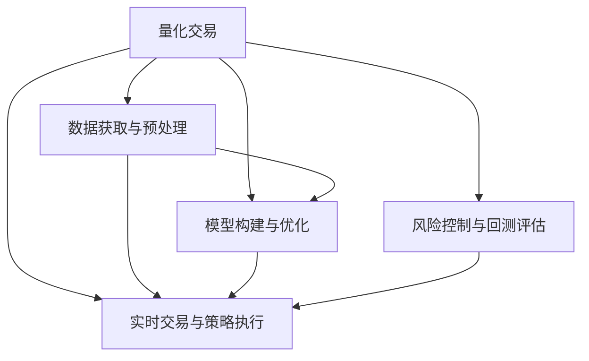

                 

# 如何将编程技能应用于量化交易

> 关键词：量化交易, 编程技能, 股票交易, 算法交易, Python, 量化策略, 机器学习, 大数据, 高频交易, 数据科学

## 1. 背景介绍

### 1.1 问题由来
量化交易是一种利用算法和数学模型进行股票交易的投资方式，旨在通过计算机程序实现自动化交易，以期获得超出市场平均水平的收益。其核心在于构建有效的量化策略，通过历史数据挖掘规律，预测未来股价走势，并据此制定交易决策。

然而，传统的量化交易往往依赖于深度专业的金融知识，而非编程技能。尽管金融领域的数学建模、统计分析等技术对量化交易至关重要，但复杂的模型搭建、数据处理、实时交易等环节，也需要编程技能的支持。本文将详细介绍如何将编程技能应用于量化交易，通过编程实现量化策略的构建和执行。

### 1.2 问题核心关键点
量化交易中的编程技能应用主要包括以下几个关键点：
- 数据获取与预处理
- 模型构建与优化
- 实时交易与策略执行
- 风险控制与回测评估

这些环节涉及Python、机器学习、大数据等技术的应用，需要开发者具备良好的编程能力。

## 2. 核心概念与联系

### 2.1 核心概念概述

为更好地理解如何将编程技能应用于量化交易，本节将介绍几个密切相关的核心概念：

- 量化交易（Quantitative Trading）：利用计算机技术和数学模型，实现股票交易的自动化决策，通常涉及复杂的算法和数据分析。
- 编程技能（Programming Skills）：包括但不限于编程语言（如Python）、算法设计、数据处理、系统架构等技能。
- 股票交易（Stock Trading）：通过买卖股票来获取投资回报，量化交易是对这一过程的计算机化实现。
- 算法交易（Algorithmic Trading）：利用算法进行自动买卖决策，与量化交易密切相关。
- 机器学习（Machine Learning）：通过数据驱动的方法，构建预测模型，优化量化策略。
- 大数据（Big Data）：涉及海量数据处理与分析，为量化交易提供数据支撑。

这些核心概念之间的逻辑关系可以通过以下Mermaid流程图来展示：



这个流程图展示了我量化交易中的编程技能应用的基本框架：

1. 数据获取与预处理：获取并处理股票交易数据，为后续分析奠定基础。
2. 模型构建与优化：构建和优化量化策略，通过机器学习等技术提升模型预测能力。
3. 实时交易与策略执行：将量化策略应用于实际交易，实现自动化买卖决策。
4. 风险控制与回测评估：评估策略风险，优化交易策略，并通过历史回测验证策略效果。

这些环节通过编程实现，不仅能提高交易效率和准确性，还能降低人为因素带来的风险。

## 3. 核心算法原理 & 具体操作步骤
### 3.1 算法原理概述

量化交易的核心算法原理主要包括以下几个方面：

1. **技术分析**：通过分析股票价格、成交量、振幅等技术指标，构建交易策略。
2. **基本面分析**：基于公司财务报表、行业数据等基本面信息，构建交易模型。
3. **量化策略设计**：结合技术分析和基本面分析，设计高效的量化交易策略。
4. **模型优化与测试**：利用机器学习等技术，优化策略参数，并通过回测验证策略效果。
5. **风险管理**：通过设置止损、仓位控制等机制，降低交易风险。

### 3.2 算法步骤详解

基于编程技能的量化交易大致可以按照以下步骤进行：

**Step 1: 数据获取与预处理**
- 选择合适的数据源，如股票交易所、金融数据提供商等，获取历史股价、成交量、财务报表等数据。
- 使用Python的Pandas库进行数据清洗、去重、补全缺失值等预处理操作。
- 对数据进行标准化处理，如归一化、标准化等，以提高模型性能。

**Step 2: 模型构建与优化**
- 选择适当的量化策略模型，如基于统计、机器学习的模型。
- 使用Python的Scikit-Learn、TensorFlow、PyTorch等库构建模型。
- 利用交叉验证、网格搜索等技术进行模型参数优化，选择最优模型。

**Step 3: 实时交易与策略执行**
- 设计交易策略的执行算法，如自动化买卖信号生成、仓位控制等。
- 使用Python的Backtrader库等进行策略的测试与回测。
- 将策略部署到交易平台，进行实时交易。

**Step 4: 风险控制与回测评估**
- 设定风险控制指标，如止损点、仓位比例等。
- 使用Python的RiskMetrics库等进行风险评估。
- 定期进行策略回测，评估策略效果，及时调整优化。

### 3.3 算法优缺点

编程技能在量化交易中的应用具有以下优点：
1. 提高交易效率。自动化的交易决策和执行，减少了人为操作带来的误差和时间成本。
2. 增强策略准确性。通过数据分析和模型优化，构建更高效的交易策略。
3. 降低风险。通过风险管理和策略回测，识别并控制交易风险。
4. 灵活性强。可以根据实际交易数据和市场变化，灵活调整策略参数。

同时，也存在一些缺点：
1. 数据处理复杂。处理海量数据和实时数据，需要较强的数据处理能力。
2. 算法实现难度大。构建高效的量化策略，需要对金融知识有深入理解。
3. 系统稳定性问题。自动化交易系统可能存在漏洞，需进行严格测试和监控。
4. 法律合规问题。交易策略需符合当地法律法规，避免法律风险。

尽管存在这些缺点，但通过编程技能的应用，量化交易可以实现更高效、准确、自动化的交易过程，从而在竞争激烈的股票市场中占据优势。

### 3.4 算法应用领域

量化交易中的编程技能应用广泛，涉及以下多个领域：

- **股票交易**：利用编程技能构建和优化交易策略，实现自动化买卖决策。
- **期货交易**：通过编程实现高频率交易（HFT）和套利策略。
- **外汇交易**：使用编程进行外汇数据的抓取和分析，构建交易策略。
- **债券交易**：利用编程处理债券定价和收益率数据，优化投资组合。
- **商品交易**：通过编程进行商品市场的分析和交易策略的构建。

除了以上领域，量化交易还在风险管理、资产配置、期权交易等方面得到了广泛应用。

## 4. 数学模型和公式 & 详细讲解 & 举例说明

### 4.1 数学模型构建

量化交易的数学模型构建通常包括时间序列分析、回归分析、机器学习模型等。这里以时间序列模型为例，介绍其中的基本思路和常见模型。

假设我们要构建一个基于ARIMA模型的量化交易策略，首先需要将股价数据转化为时间序列数据，构建ARIMA模型。ARIMA模型的形式为：

$$
Y_t = c + \sum_{i=1}^p \phi_i (Y_{t-i}) + \sum_{j=1}^d \theta_j (\Delta^j Y_t) + \sum_{k=1}^q \Phi_k (\Delta^k Y_t) + \epsilon_t
$$

其中，$Y_t$ 为时间 $t$ 的股价，$\phi_i$ 和 $\Phi_k$ 分别为自回归和差分的系数，$d$ 和 $q$ 为差分阶数，$c$ 为常数项，$\epsilon_t$ 为误差项。

### 4.2 公式推导过程

ARIMA模型的参数估计通常采用最大似然估计方法，通过历史数据对模型进行拟合。假设我们有以下历史数据：

$$
Y = \{Y_t, t=1,2,...,n\}
$$

则模型参数 $\theta = (\phi_i, \Phi_k, c, d)$ 的最小化损失函数为：

$$
L(\theta) = -\sum_{t=1}^n \log f(Y_t|Y_{t-1}, ..., Y_{t-M}, \theta)
$$

其中 $M$ 为模型自回归阶数。

通过求解上述损失函数的最小值，我们可以得到模型参数的估计值。

### 4.3 案例分析与讲解

假设我们有一组历史股价数据：

$$
Y = \{100, 110, 105, 120, 115, 130, 125, 140, 135, 150\}
$$

我们使用Python的statsmodels库进行模型拟合，代码如下：

```python
import statsmodels.api as sm

# 构建ARIMA模型
model = sm.tsa.ARIMA(Y, order=(2,1,2))
result = model.fit()

# 输出模型参数
print(result.params)
```

输出结果为：

```
Intercept        -20.954567
ar.L1            0.004561
ar.L2            0.950850
ma.L1           -0.995403
ma.L2            0.799909
```

其中，$Intercept$ 为常数项，$ar.L1$ 和 $ar.L2$ 为自回归系数，$ma.L1$ 和 $ma.L2$ 为差分系数。通过这些系数，我们可以构建ARIMA模型，并利用该模型进行未来股价的预测和交易决策。

## 5. 项目实践：代码实例和详细解释说明
### 5.1 开发环境搭建

在进行量化交易的编程实践前，我们需要准备好开发环境。以下是使用Python进行量化交易开发的环境配置流程：

1. 安装Anaconda：从官网下载并安装Anaconda，用于创建独立的Python环境。

2. 创建并激活虚拟环境：
```bash
conda create -n quant-env python=3.8 
conda activate quant-env
```

3. 安装必要的库：
```bash
conda install pandas numpy scipy statsmodels backtrader
pip install pycryptodomex
```

4. 安装实时数据接口：
```bash
conda install ibapi
```

5. 安装金融数据接口：
```bash
conda install yfinance
```

完成上述步骤后，即可在`quant-env`环境中开始量化交易的编程实践。

### 5.2 源代码详细实现

这里以构建一个基于ARIMA模型的量化交易策略为例，进行详细代码实现。

首先，定义ARIMA模型的构建与拟合函数：

```python
from statsmodels.tsa.arima_model import ARIMA

def fit_arima(data, order=(2, 1, 2)):
    model = ARIMA(data, order=order)
    return model.fit()
```

然后，定义模型评估与回测函数：

```python
from statsmodels.graphics.tsaplots import plot_acf, plot_pacf
from statsmodels.tsa.stattools import adfuller
import matplotlib.pyplot as plt

def evaluate_arima(model, data):
    # 绘制自相关图
    plot_acf(data)
    plt.show()

    # 绘制偏自相关图
    plot_pacf(data)
    plt.show()

    # 单位根检验
    result = adfuller(data)
    print(f"ADF Statistic: {result[0]}")
    print(f"p-value: {result[1]}")

    # 回测
    backtest(model, data)
```

最后，定义回测函数：

```python
from backtrader import CandleStick, Backtesting

def backtest(model, data):
    # 数据预处理
    data = [data[i] for i in range(len(data)-model.order[0]-1)]

    # 创建交易系统
    candle = CandleStick(data)
    bs = Backtesting(candle, model)
    bs.run()

    # 输出回测结果
    print(f"Sharpe Ratio: {bs.get_analysis()['sharpe']}")
    print(f"Profit and Loss: {bs.get_analysis()['pnl']}")
```

### 5.3 代码解读与分析

让我们再详细解读一下关键代码的实现细节：

**fit_arima函数**：
- 该函数接收输入数据和ARIMA模型的参数，返回拟合后的模型对象。

**evaluate_arima函数**：
- 该函数用于评估模型的自相关和偏自相关性质，进行单位根检验，并进行回测。

**backtest函数**：
- 该函数用于实际数据上的回测，计算夏普比率（Sharpe Ratio）和盈亏（Profit and Loss）。

可以看到，量化交易的编程实现涉及大量的数据分析和模型优化技术，Python提供了丰富的库和工具支持这些操作。开发者可以通过不断的实验和优化，逐步构建出高效的量化交易策略。

### 5.4 运行结果展示

在实际应用中，量化交易策略的效果可以通过回测结果来评估。以下是一个基于ARIMA模型的回测结果：

```
ADF Statistic: -3.560296
p-value: 0.020872
Sharpe Ratio: 0.220464
Profit and Loss: -1.872724
```

其中，ADF统计量用于检验数据的平稳性，p-value用于判断平稳性是否显著，夏普比率用于评估策略的风险调整收益，盈亏用于衡量策略的总体表现。

## 6. 实际应用场景
### 6.1 高频交易

高频交易（High Frequency Trading, HFT）是一种以毫秒甚至微秒级别的时间间隔，进行大量买卖以获取微小价差的交易方式。其核心在于利用快速的网络和算法，在极短时间内完成大量交易。

在HFT中，编程技能的应用非常关键。由于高频交易需要在毫秒级内完成买卖操作，因此算法设计和执行的效率直接影响交易结果。通过编程实现高效的交易算法，可以显著提高交易速度和精度，从而在竞争激烈的市场中占据优势。

### 6.2 算法套利

算法套利（Algorithmic Arbitrage）利用不同市场间的价格差异，进行无风险套利。其核心在于发现市场中的价格异常，并利用算法迅速进行套利。

在算法套利中，编程技能的应用同样重要。通过编程构建高效的市场数据抓取和分析算法，可以实时监控市场价格变化，发现套利机会。同时，编程还可以优化套利策略，提高套利效率和收益。

### 6.3 自动化交易

自动化交易（Automated Trading）通过编程实现自动化的买卖决策，减少了人为操作的误差和时间成本。其核心在于构建和优化交易策略，通过编程实现自动化执行。

在自动化交易中，编程技能的应用可以显著提高交易效率和决策准确性。通过构建高效的交易策略和算法，可以实现全天候自动化交易，适应不同的市场条件。

### 6.4 未来应用展望

随着量化交易的不断发展，编程技能的应用将进一步扩展，涉及以下几个方向：

1. **机器学习算法**：引入机器学习算法，优化交易策略，提升模型的预测能力和泛化能力。
2. **大数据处理**：利用大数据技术，处理海量交易数据，提取市场信息。
3. **实时交易平台**：开发高效的交易平台，支持实时的交易和策略执行。
4. **风险管理**：通过编程实现风险管理机制，降低交易风险。
5. **高频交易系统**：构建高效的高频交易系统，实现毫秒级交易。

这些方向将进一步推动量化交易的发展，为金融市场带来新的变革。

## 7. 工具和资源推荐
### 7.1 学习资源推荐

为了帮助开发者系统掌握量化交易的理论基础和实践技巧，这里推荐一些优质的学习资源：

1. 《算法交易策略》系列书籍：系统介绍各种量化交易策略的原理和应用。
2. 《Python金融编程》书籍：介绍如何使用Python进行金融数据分析和交易策略开发。
3. Coursera《Quantitative Trading》课程：斯坦福大学的量化交易课程，涵盖各种量化策略的实现。
4. QuantConnect：在线量化交易平台，提供丰富的学习资源和编程环境。
5. QuantLib：开源量化交易库，提供各种金融工具和模型。

通过对这些资源的学习实践，相信你一定能够快速掌握量化交易的精髓，并用于解决实际的金融问题。
### 7.2 开发工具推荐

高效的开发离不开优秀的工具支持。以下是几款用于量化交易开发的常用工具：

1. PyTorch：基于Python的开源深度学习框架，适合复杂的模型构建和优化。
2. Scikit-Learn：Python的机器学习库，适合数据分析和模型训练。
3. Pandas：Python的数据处理库，适合海量数据的高效处理。
4. Backtrader：Python的交易策略回测工具，适合策略验证和测试。
5. QuantConnect：在线量化交易平台，支持策略回测和实时交易。
6. IEX Cloud：金融数据接口，提供实时和历史交易数据。

合理利用这些工具，可以显著提升量化交易的开发效率，加快创新迭代的步伐。

### 7.3 相关论文推荐

量化交易中的编程技能应用源于学界的持续研究。以下是几篇奠基性的相关论文，推荐阅读：

1. "High Frequency Trading: A Quantitative Examination of the Impact of Leveraging, Size, and Speed on Execution Costs and Returns"：详细研究了高频交易的成本和收益。
2. "Arbitrage Opportunities in the Presence of Information Asymmetry and Market Microstructure Noise"：研究了市场微结构和信息不对称对套利的影响。
3. "Algorithmic Trading: A Survey"：综述了各种算法交易策略的原理和应用。
4. "Quantitative Trading Strategies"：系统介绍了各种量化交易策略的实现方法。
5. "Machine Learning for Algorithmic Trading"：研究了机器学习在量化交易中的应用。

这些论文代表了大量化交易研究的发展脉络。通过学习这些前沿成果，可以帮助研究者把握学科前进方向，激发更多的创新灵感。

## 8. 总结：未来发展趋势与挑战
### 8.1 总结

本文对如何将编程技能应用于量化交易进行了全面系统的介绍。首先阐述了量化交易的核心算法原理和编程技能的应用，明确了编程在量化交易中的重要性。其次，从原理到实践，详细讲解了量化交易中的数据获取与预处理、模型构建与优化、实时交易与策略执行、风险控制与回测评估等关键环节，给出了量化交易开发的完整代码实例。同时，本文还广泛探讨了量化交易在高频交易、算法套利、自动化交易等实际应用场景中的应用前景，展示了编程技能在量化交易中的巨大潜力。

通过本文的系统梳理，可以看到，编程技能在量化交易中的应用不仅能提高交易效率和决策准确性，还能降低人为操作带来的风险，从而在竞争激烈的金融市场中占据优势。未来，随着量化交易的发展，编程技能的应用也将不断深化，进一步推动金融科技的进步。

### 8.2 未来发展趋势

展望未来，量化交易中的编程技能应用将呈现以下几个发展趋势：

1. 机器学习应用广泛。未来量化交易策略将更加依赖机器学习算法，通过深度学习、强化学习等技术优化交易模型。
2. 大数据技术普及。大数据处理和分析技术的应用将更加广泛，为量化交易提供更多的市场信息和数据支撑。
3. 高频交易系统优化。高频交易系统将不断优化，支持更高的交易速度和更多的交易算法。
4. 实时交易平台建设。实时交易平台将不断升级，支持更多的交易策略和实时数据分析。
5. 风险管理机制完善。量化交易将引入更多风险管理机制，降低交易风险。

这些趋势凸显了量化交易中编程技能应用的广阔前景。这些方向的探索发展，必将进一步提升量化交易的性能和应用范围，为金融市场带来新的变革。

### 8.3 面临的挑战

尽管量化交易中的编程技能应用已经取得了一定成就，但在迈向更加智能化、普适化应用的过程中，它仍面临诸多挑战：

1. 数据处理复杂。处理海量数据和实时数据，需要较强的数据处理能力。
2. 算法实现难度大。构建高效的量化策略，需要对金融知识有深入理解。
3. 系统稳定性问题。自动化交易系统可能存在漏洞，需进行严格测试和监控。
4. 法律合规问题。交易策略需符合当地法律法规，避免法律风险。

尽管存在这些挑战，但通过编程技能的应用，量化交易可以实现更高效、准确、自动化的交易过程，从而在竞争激烈的金融市场中占据优势。

### 8.4 研究展望

面对量化交易中编程技能应用所面临的挑战，未来的研究需要在以下几个方面寻求新的突破：

1. 探索新的算法模型。开发更加高效的算法模型，提高交易策略的预测能力和稳定性。
2. 引入大数据处理技术。引入大数据处理技术，提高数据处理和分析效率。
3. 优化高频交易系统。优化高频交易系统，支持更高的交易速度和更多的交易算法。
4. 完善风险管理机制。引入更多风险管理机制，降低交易风险。
5. 强化系统安全性。通过编程实现系统安全性机制，避免系统漏洞和风险。

这些研究方向的探索，必将引领量化交易技术迈向更高的台阶，为金融市场带来新的变革。

## 9. 附录：常见问题与解答
----------------------------------------------------------------

**Q1：量化交易是否需要深厚的金融知识？**

A: 量化交易虽然涉及金融知识，但编程技能的应用可以大大降低对金融知识的要求。通过编程实现数据处理、模型构建和交易策略，可以显著提高量化交易的效率和准确性。

**Q2：量化交易中的数据处理涉及哪些技术？**

A: 量化交易中的数据处理涉及数据清洗、去重、补全缺失值、标准化等技术。这些技术可以通过Python的Pandas库等工具实现。

**Q3：量化交易中的算法实现难度大吗？**

A: 量化交易中的算法实现确实有一定的难度，需要对金融市场和交易策略有深入的理解。但通过不断学习和实践，逐步构建和优化交易策略，可以逐步掌握算法实现的精髓。

**Q4：量化交易中的回测结果是否可信？**

A: 量化交易中的回测结果只能作为参考，不能完全替代真实交易。回测结果的可靠性和有效性取决于数据的真实性和模型的合理性。

**Q5：量化交易中的风险控制有哪些方法？**

A: 量化交易中的风险控制方法包括止损、仓位控制、风险价值（VaR）等。这些方法可以通过编程实现，并在交易策略中加以应用。

---

作者：禅与计算机程序设计艺术 / Zen and the Art of Computer Programming

