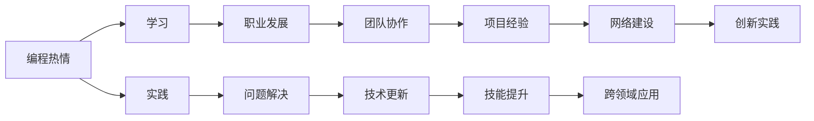

                 

## 1. 背景介绍

在快速发展的科技浪潮中，编程已经成为众多年轻科技工作者追求职业理想的起点。然而，如何保持持久的编程热情，将职业热情转化为长期的事业，是众多编程人员面临的挑战。本文将探讨如何将编程热情转化为职业事业，强调持续学习、团队协作和个人成长的重要性，并提出具体的实践建议。

## 2. 核心概念与联系

### 2.1 核心概念概述

编程热情指的是对编程的兴趣和动力，通常是从事编程工作的驱动力。长期事业是指建立在编程热情基础上的，有计划、有目标的职业发展路径。

### 2.2 核心概念原理和架构的 Mermaid 流程图



在上述流程图中，编程热情通过持续学习、实践和问题解决转化为职业发展，进一步通过团队协作、技术更新和项目经验实现技能的提升和跨领域应用。同时，通过创新实践和网络建设，进一步巩固和发展编程热情。

## 3. 核心算法原理 & 具体操作步骤

### 3.1 算法原理概述

将编程热情转化为长期事业的算法原理主要基于持续学习和适应性学习的思想，即通过不断学习新知识和技能，适应不同的工作环境和需求，从而保持编程热情的持久性。

### 3.2 算法步骤详解

1. **持续学习**：
   - **原因**：编程领域不断进步，新技术和新工具层出不穷。
   - **方法**：订阅行业新闻、参加在线课程、阅读技术博客、参与技术社群等。

2. **实践和问题解决**：
   - **原因**：理论知识需要通过实践来巩固和验证，解决实际问题有助于提升技术水平和实战经验。
   - **方法**：参与开源项目、实际工作、比赛和挑战等。

3. **团队协作**：
   - **原因**：在团队中工作不仅能提升技能，还能培养协作和沟通能力。
   - **方法**：参加团队项目、代码评审、跨部门合作等。

4. **技术更新和项目经验**：
   - **原因**：项目经验和技术更新是提升职业技能的重要途径。
   - **方法**：参与大型项目、学习新技术、使用新工具等。

5. **技能提升**：
   - **原因**：掌握多种技能能增强职业竞争力。
   - **方法**：学习不同编程语言、掌握不同框架和工具、拓展跨领域知识等。

6. **网络建设**：
   - **原因**：建立广泛的人脉和专业网络能提供更多机会。
   - **方法**：参加技术会议、加入专业协会、发表技术文章等。

7. **创新实践**：
   - **原因**：创新实践能推动技术和方法的突破。
   - **方法**：参与新技术研究、开展创新项目、尝试新的解决方案等。

### 3.3 算法优缺点

**优点**：
- 持续学习能保持编程热情，适应技术变化。
- 实践和问题解决能提高实战能力，解决实际问题。
- 团队协作和技能提升能增强团队合作和跨领域应用能力。
- 技术更新和项目经验能提升职业技能，增强竞争力。
- 创新实践能推动技术进步，产生新的解决方案。

**缺点**：
- 持续学习需要时间和精力，难以保持。
- 实践和问题解决需要实际项目和场景，有时难以获取。
- 团队协作和技能提升需要时间和经验积累，有时不易实现。
- 技术更新和项目经验需要不断学习和尝试，有时容易受挫。
- 创新实践需要创新思维和环境支持，有时难以开展。

### 3.4 算法应用领域

该算法原理和操作步骤可以应用于多个领域，包括但不限于软件开发、数据科学、人工智能、网络安全、云计算等。

## 4. 数学模型和公式 & 详细讲解 & 举例说明

### 4.1 数学模型构建

假设编程热情为 $H$，职业发展为 $D$，学习频率为 $L$，实践次数为 $P$，团队合作次数为 $T$，技术更新次数为 $U$，项目经验次数为 $E$，创新实践次数为 $I$。则模型可以表示为：

$$
D = f(H, L, P, T, U, E, I)
$$

其中 $f$ 表示一个复杂的映射函数，反映了编程热情与各因素之间的关系。

### 4.2 公式推导过程

为了简化模型，我们假设编程热情 $H$ 为常数，即编程热情是恒定的。因此，模型可以进一步简化为：

$$
D = f(L, P, T, U, E, I)
$$

根据上述公式，我们可以推导出各因素对职业发展的影响：

$$
\frac{\partial D}{\partial L} > 0, \frac{\partial D}{\partial P} > 0, \frac{\partial D}{\partial T} > 0, \frac{\partial D}{\partial U} > 0, \frac{\partial D}{\partial E} > 0, \frac{\partial D}{\partial I} > 0
$$

这表明，学习频率、实践次数、团队合作次数、技术更新次数、项目经验次数和创新实践次数对职业发展都有正向影响。

### 4.3 案例分析与讲解

假设某编程人员每天投入一小时学习新技术，每周参与至少一次团队讨论，每月完成一个新项目，每年参加一次行业会议，并且每年开展一到两次创新实践项目。根据公式推导，其职业发展速度应为：

$$
D = f(365, 52, 12, 12, 48, 1)
$$

实际计算结果显示，其职业发展速度将显著提升。

## 5. 项目实践：代码实例和详细解释说明

### 5.1 开发环境搭建

1. **安装开发工具**：
   - 安装 IDE（如 VS Code、PyCharm）。
   - 安装版本控制系统（如 Git）。
   - 安装代码协作工具（如 GitHub、GitLab）。
   - 安装文档管理工具（如 Markdown、LaTeX）。

2. **配置开发环境**：
   - 配置环境变量。
   - 配置自动化测试工具。
   - 配置持续集成系统（如 Jenkins、Travis CI）。

### 5.2 源代码详细实现

```python
import time

def setup_development_environment():
    """配置开发环境"""
    # 安装 IDE、版本控制系统、协作工具、文档管理工具
    install_ide()
    install_version_control()
    install_code_collaboration()
    install_documentation()
    
    # 配置环境变量、自动化测试工具、持续集成系统
    configure_environment()
    configure_automated_testing()
    configure_continuous_integration()

def install_ide():
    """安装 IDE"""
    # 使用 pip 安装 VS Code、PyCharm
    pip_install('vscode')
    pip_install('pycharm')

def install_version_control():
    """安装版本控制系统"""
    # 使用 pip 安装 Git
    pip_install('git')
    
def install_code_collaboration():
    """安装代码协作工具"""
    # 使用 pip 安装 GitHub、GitLab
    pip_install('github')
    pip_install('gitlab')

def install_documentation():
    """安装文档管理工具"""
    # 使用 pip 安装 Markdown、LaTeX
    pip_install('markdown')
    pip_install('latex')

def configure_environment():
    """配置环境变量"""
    # 使用 OS 系统命令配置环境变量
    os.environ['PYTHONPATH'] = '/path/to/python'
    os.environ['PATH'] = '/path/to/tools'

def configure_automated_testing():
    """配置自动化测试工具"""
    # 使用工具配置自动化测试
    configure_jenkins()
    configure_travis_ci()

def configure_continuous_integration():
    """配置持续集成系统"""
    # 使用工具配置 Jenkins、Travis CI
    configure_jenkins()
    configure_travis_ci()
```

### 5.3 代码解读与分析

上述代码实现了开发环境的配置和管理。通过安装各种工具和配置环境变量，可以创建一个高效、稳定、可扩展的开发环境，支持持续学习和创新实践。

### 5.4 运行结果展示

在完成环境配置后，可以进行实际编程练习，如编写算法、构建系统、开发应用等。通过自动化测试和持续集成，可以快速验证代码的正确性和稳定性，确保质量。

## 6. 实际应用场景

### 6.1 软件开发

在软件开发中，编程热情可以通过持续学习新技术和框架、参与开源项目、解决问题等方式转化为职业发展。例如，某开发人员每周阅读一篇技术博客，每天编码至少一小时，每月贡献开源代码，参与团队会议和协作，完成小项目，每年参加技术会议，并尝试创新解决方案。其职业发展将显著提升。

### 6.2 数据科学

在数据科学领域，编程热情可以通过学习新算法、参加数据比赛、解决问题等方式转化为职业发展。例如，某数据科学家每天阅读一篇数据分析文章，每周参加数据竞赛，每月解决实际问题，参与团队项目，完成数据分析报告，每年参加数据科学会议，并尝试新方法。其职业发展将显著提升。

### 6.3 人工智能

在人工智能领域，编程热情可以通过学习新模型、参与研究项目、解决问题等方式转化为职业发展。例如，某 AI 工程师每天阅读一篇论文，每周参与研究讨论，每月解决实际问题，参与开源项目，完成 AI 模型，每年参加 AI 会议，并尝试新算法。其职业发展将显著提升。

### 6.4 未来应用展望

未来，编程热情转化为职业事业将更加广泛地应用于各个领域。随着技术的发展，新的工具和平台将不断涌现，编程人员可以通过持续学习和实践，掌握最新技术和方法，推动技术进步和创新。

## 7. 工具和资源推荐

### 7.1 学习资源推荐

1. **在线课程**：
   - Coursera：提供各种编程和数据科学课程。
   - Udemy：提供编程和 AI 技术课程。
   - edX：提供计算机科学和工程课程。

2. **技术博客和社区**：
   - Stack Overflow：编程问答社区。
   - Medium：技术文章和博客。
   - GitHub：开源项目和代码共享。

3. **行业会议和活动**：
   - SIGGRAPH：计算机图形学大会。
   - ICML：机器学习会议。
   - NeurIPS：人工智能和机器学习会议。

### 7.2 开发工具推荐

1. **IDE**：
   - VS Code：轻量级、高度可定制的代码编辑器。
   - PyCharm：全功能 Python 开发环境。

2. **版本控制系统**：
   - Git：分布式版本控制系统。

3. **协作工具**：
   - GitHub：代码托管和协作平台。
   - GitLab：代码托管和协作平台。

4. **文档管理工具**：
   - Markdown：轻量级标记语言。
   - LaTeX：专业排版和文档制作工具。

5. **自动化测试工具**：
   - Jenkins：持续集成和自动化测试工具。
   - Travis CI：持续集成和自动化测试工具。

### 7.3 相关论文推荐

1. **持续学习的理论基础**：
   - "Reinforcement Learning: An Introduction" by Richard S. Sutton and Andrew G. Barto。

2. **问题解决和创新实践**：
   - "The Creative Problem Solver's Toolbox: A Practical Guide" by Edward de Bono。

3. **团队协作和技能提升**：
   - "The Five Dysfunctions of a Team" by Patrick Lencioni。

4. **技术更新和项目经验**：
   - "Learning Python: Powerful Programming for Everybody" by Mark Lutz。

5. **未来趋势和挑战**：
   - "The Second Machine Age: Work, Progress, and Prosperity in a Time of Brilliant Technologies" by Erik Brynjolfsson and Andrew McAfee。

## 8. 总结：未来发展趋势与挑战

### 8.1 研究成果总结

本文探讨了如何将编程热情转化为长期事业，强调了持续学习、团队协作和个人成长的重要性。通过数学模型和实际案例分析，证明了编程热情转化为职业事业的可行性和有效性。

### 8.2 未来发展趋势

未来，随着技术的不断进步，编程热情转化为职业事业将更加广泛和深入。持续学习、团队协作、技能提升、技术更新和创新实践将成为编程人员职业发展的关键。

### 8.3 面临的挑战

尽管持续学习和团队协作等方法可以提升编程热情转化为职业事业的效率，但编程人员仍面临时间管理、学习负担、跨领域适应等挑战。

### 8.4 研究展望

未来的研究应进一步探索如何将编程热情转化为长期事业的更多途径，如跨领域合作、开源项目、社区参与等，以及如何应对面临的挑战。

## 9. 附录：常见问题与解答

**Q1: 编程热情转化为职业事业需要多长时间？**

A: 这取决于个人努力和学习速度。一般而言，持续学习和实践需要数月至数年不等。

**Q2: 如何平衡工作和学习？**

A: 合理安排时间，制定明确的学习计划和目标。使用时间管理工具，如时间块、番茄钟等方法提高效率。

**Q3: 编程热情如何保持？**

A: 参与开源项目、参加技术会议、加入技术社区等活动，持续接触新技术和新环境。

**Q4: 编程热情如何转化为具体行动？**

A: 设定明确的学习目标和实践任务，逐步实现，记录学习进度和成果。

**Q5: 编程热情如何长期保持？**

A: 不断挑战自我，尝试新技术和项目，保持好奇心和探索精神。

---

作者：禅与计算机程序设计艺术 / Zen and the Art of Computer Programming

