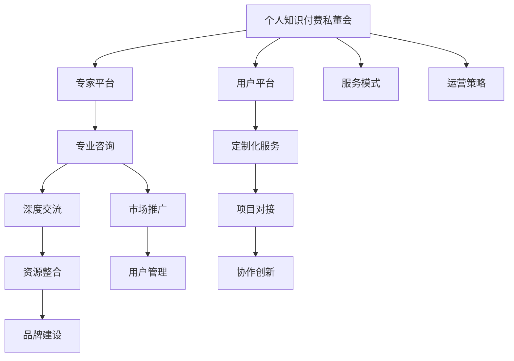

                 

# 如何打造个人知识付费私董会

## 1. 背景介绍

在知识经济快速发展的今天，个人知识付费私董会作为一种新兴的社交和知识交流方式，正在成为越来越多专业人士的首选。它不仅仅是一个收费咨询平台，更是一个汇聚各领域专家的高端社群，提供深度互动和个性化咨询服务，帮助企业和个人提升决策质量，开拓新思路，把握趋势。本文将深入剖析个人知识付费私董会的核心要素和构建策略，为广大从业者提供一份详细的指南。

### 1.1 市场背景

知识付费领域近年来受到广泛关注，成为互联网经济的重要增长点。据统计，2020年国内知识付费市场规模已达330亿元，用户规模达3.6亿。在“大众创业，万众创新”的浪潮下，个人知识付费私董会通过集结顶尖专家和高端用户，形成了独特的知识分享和交流模式，满足了市场对深度学习和高质服务的迫切需求。

### 1.2 发展趋势

随着5G、AI、大数据等技术的应用，知识付费市场呈现快速增长趋势。预计到2025年，市场规模将达1700亿元，用户规模超过10亿。个人知识付费私董会作为知识付费模式的新兴形式，以其深度互动、精准对接和专业化服务赢得了市场的青睐，预计未来将迎来爆发式增长。

## 2. 核心概念与联系

### 2.1 核心概念概述

为更好地理解个人知识付费私董会的构建过程，本文将介绍几个关键概念：

- 个人知识付费私董会：汇聚各领域顶尖专家和高端用户，提供深度咨询和个性化服务的知识付费平台。
- 专家平台：聚集高水平专家，提供专业咨询和深度交流。
- 用户平台：汇聚高价值用户，获取精准需求，进行定制化服务。
- 服务模式：通过线上线下结合，提供定制咨询、项目对接、资源整合等服务。
- 运营策略：包括用户管理、内容生产、市场推广、品牌建设等方面的策略和措施。

这些核心概念之间存在紧密的联系，共同构成了个人知识付费私董会的运作框架。

### 2.2 核心概念原理和架构的 Mermaid 流程图



此流程图展示了各核心概念之间的关联路径，体现了个人知识付费私董会的整体运营逻辑。

## 3. 核心算法原理 & 具体操作步骤

### 3.1 算法原理概述

个人知识付费私董会的核心算法原理包括专家匹配算法、用户画像构建算法、服务推荐算法等。这些算法以数据分析为基础，结合专家知识和用户需求，通过推荐系统和个性化匹配，实现高质高效的咨询服务。

### 3.2 算法步骤详解

#### 3.2.1 专家匹配算法

专家匹配算法主要通过以下几个步骤实现：

1. **数据采集**：收集各领域专家的资质背景、专业经验、科研成果、咨询评价等信息。
2. **模型训练**：利用机器学习算法（如协同过滤、聚类算法）训练专家推荐模型。
3. **精准匹配**：根据用户需求和专家背景，匹配最合适的专家进行咨询。

#### 3.2.2 用户画像构建算法

用户画像构建算法主要包括以下步骤：

1. **数据收集**：收集用户的学历背景、职业经历、兴趣爱好、需求偏好等信息。
2. **数据分析**：利用聚类、分类等算法分析用户特征。
3. **画像生成**：生成高维向量表示用户画像，供推荐系统和匹配算法使用。

#### 3.2.3 服务推荐算法

服务推荐算法主要实现以下几个功能：

1. **需求分析**：解析用户咨询需求，提取关键信息。
2. **服务匹配**：匹配符合用户需求的服务类型（如定制咨询、项目管理、资源整合等）。
3. **方案推荐**：根据匹配结果，推荐最适合的专家和咨询方案。

### 3.3 算法优缺点

#### 3.3.1 专家匹配算法

**优点**：
- 提升咨询效率，降低匹配时间。
- 增强匹配精度，确保咨询质量。

**缺点**：
- 数据获取成本高，需要大量高质量数据。
- 匹配模型复杂，对算法要求高。

#### 3.3.2 用户画像构建算法

**优点**：
- 精准刻画用户特征，提升个性化服务。
- 减少用户反馈，提高咨询满意度。

**缺点**：
- 数据隐私问题，需妥善处理用户信息。
- 画像生成复杂，需要考虑多维度信息。

#### 3.3.3 服务推荐算法

**优点**：
- 提高服务匹配准确性，满足用户需求。
- 优化咨询流程，提升用户体验。

**缺点**：
- 算法实现难度大，需要高度专业的知识。
- 推荐系统复杂，需动态更新模型。

### 3.4 算法应用领域

个人知识付费私董会的核心算法广泛应用于以下几个领域：

- **专家平台**：提供专业咨询和深度交流。
- **用户平台**：获取精准需求，进行定制化服务。
- **服务模式**：线上线下结合，提供定制咨询、项目对接、资源整合等服务。
- **运营策略**：用户管理、内容生产、市场推广、品牌建设等方面。

## 4. 数学模型和公式 & 详细讲解 & 举例说明

### 4.1 数学模型构建

个人知识付费私董会的数学模型主要包括以下几个部分：

1. **专家匹配模型**：$P(X \rightarrow Y) = \sum_{i=1}^n w_i \cdot P(X_i \rightarrow Y)$。其中 $X$ 为专家背景，$Y$ 为用户需求，$w_i$ 为专家权重。
2. **用户画像模型**：$U = \sum_{k=1}^m a_k \cdot P(U_k)$。其中 $U$ 为用户画像，$U_k$ 为用户特征，$a_k$ 为特征权重。
3. **服务推荐模型**：$S = \sum_{j=1}^l b_j \cdot P(S_j | X, Y)$。其中 $S$ 为推荐服务，$S_j$ 为服务类型，$b_j$ 为服务权重。

### 4.2 公式推导过程

#### 4.2.1 专家匹配模型

$P(X \rightarrow Y) = \sum_{i=1}^n w_i \cdot P(X_i \rightarrow Y)$

其中，$w_i$ 为专家 $i$ 的权重，$P(X_i \rightarrow Y)$ 为专家 $i$ 在需求 $Y$ 下的概率。

#### 4.2.2 用户画像模型

$U = \sum_{k=1}^m a_k \cdot P(U_k)$

其中，$a_k$ 为用户特征 $k$ 的权重，$P(U_k)$ 为用户特征 $k$ 的概率。

#### 4.2.3 服务推荐模型

$S = \sum_{j=1}^l b_j \cdot P(S_j | X, Y)$

其中，$b_j$ 为服务类型 $j$ 的权重，$P(S_j | X, Y)$ 为服务类型 $j$ 在需求 $Y$ 下专家 $X$ 的推荐概率。

### 4.3 案例分析与讲解

**案例**：某企业欲进入新兴市场，希望了解市场动态和未来趋势，寻求高端咨询服务。

**分析**：
- 通过专家匹配算法，找到在市场分析和趋势预测方面有丰富经验的专家。
- 利用用户画像构建算法，生成企业用户画像，包括行业背景、规模、需求偏好等信息。
- 通过服务推荐算法，推荐最适合的咨询服务类型，如市场调研、趋势预测等。

**讲解**：
- 利用专家匹配模型，将专家背景与企业需求进行匹配，找到最适合的专家。
- 利用用户画像模型，生成企业用户画像，确保推荐服务符合企业实际需求。
- 利用服务推荐模型，推荐最适合的咨询服务类型，确保咨询质量和效率。

## 5. 项目实践：代码实例和详细解释说明

### 5.1 开发环境搭建

要构建个人知识付费私董会，首先需要搭建开发环境。

1. **选择开发语言和框架**：一般使用Python语言，结合Django、Flask等框架。
2. **搭建数据库**：一般使用MySQL或PostgreSQL等关系型数据库。
3. **部署服务器**：使用AWS、阿里云、腾讯云等云平台搭建服务器。

### 5.2 源代码详细实现

**专家平台功能实现**：

1. **专家管理模块**：提供专家信息录入、编辑、审核等管理功能。
2. **专家搜索模块**：根据关键字或条件，搜索匹配专家。
3. **专家评价模块**：用户对专家进行评价，更新专家信誉度。

**用户平台功能实现**：

1. **用户注册模块**：用户注册并完善个人资料。
2. **需求发布模块**：用户发布咨询需求，描述具体问题。
3. **专家对接模块**：匹配专家并发起对接。

**服务模式功能实现**：

1. **在线咨询模块**：用户与专家进行实时在线咨询。
2. **项目对接模块**：用户与专家进行项目合作对接。
3. **资源整合模块**：用户与专家进行资源整合和共享。

### 5.3 代码解读与分析

以专家搜索模块为例，展示代码实现：

```python
from django.http import JsonResponse
from django.views.decorators.csrf import csrf_exempt
from .models import Expert
from .forms import ExpertSearchForm

@csrf_exempt
def expert_search(request):
    if request.method == 'POST':
        form = ExpertSearchForm(request.POST)
        if form.is_valid():
            name = form.cleaned_data.get('name')
            keywords = form.cleaned_data.get('keywords')
            expert_list = Expert.objects.filter(name__icontains=name, keywords__icontains=keywords)
            data = []
            for expert in expert_list:
                data.append({
                    'id': expert.id,
                    'name': expert.name,
                    'title': expert.title,
                    'experience': expert.experience,
                    'reviews': expert.reviews,
                })
            return JsonResponse(data, status=200)
    else:
        return JsonResponse({}, status=400)
```

**代码解读**：
- 代码使用Django框架，提供POST请求方式的专家搜索功能。
- 使用ExpertSearchForm表单，收集专家名字和关键词，查询数据库中的专家信息。
- 对查询结果进行格式化，以JSON格式返回专家列表。

### 5.4 运行结果展示

用户登录系统后，进入专家搜索页面，输入专家名字和关键词进行搜索，系统自动匹配相关专家，并展示专家信息。

## 6. 实际应用场景

### 6.1 商业咨询

商业咨询是个人知识付费私董会的重要应用场景之一。企业可以在平台上发布具体的商业咨询需求，寻找合适的专家进行深度对接。平台利用专家匹配算法和用户画像构建算法，为双方提供高质量的咨询服务。

### 6.2 技术咨询

技术咨询是另一个重要应用场景。科技企业可以在平台上发布技术难题，邀请相关专家进行讨论和解决方案设计。平台利用服务推荐算法，为专家和用户匹配最合适的技术咨询方案。

### 6.3 教育培训

教育培训也是个人知识付费私董会的重要应用场景。学生可以在平台上发布学习难题，邀请教师进行辅导和答疑。平台利用专家匹配算法，为学生和教师提供深度互动和个性化咨询服务。

### 6.4 未来应用展望

个人知识付费私董会未来将广泛应用于以下领域：

- **医疗健康**：提供医疗咨询、健康管理、疾病预防等专业服务。
- **金融投资**：提供投资咨询、理财规划、风险管理等服务。
- **文化创意**：提供创意设计、影视制作、文化推广等咨询服务。
- **法律服务**：提供法律咨询、合同审核、诉讼代理等服务。

## 7. 工具和资源推荐

### 7.1 学习资源推荐

1. **知识付费平台运营**：《知识付费商业模式与运营》一书，详细介绍了知识付费平台的商业模式、用户运营、内容生产等方面的策略和技巧。
2. **专家管理系统**：《专家管理系统设计与实现》一书，介绍了专家管理系统的设计与实现方法，涵盖专家库构建、查询、评价等功能。
3. **推荐系统算法**：《推荐系统算法设计与实现》一书，介绍了推荐系统的原理和算法，涵盖协同过滤、基于内容的推荐等。
4. **用户画像构建技术**：《用户画像构建技术与应用》一书，介绍了用户画像构建的方法和案例，涵盖数据分析、画像生成等方面的内容。

### 7.2 开发工具推荐

1. **开发语言**：Python语言，适合快速迭代和灵活开发。
2. **框架**：Django、Flask等框架，提供强大的Web开发功能和可扩展性。
3. **数据库**：MySQL、PostgreSQL等关系型数据库，适合存储和管理大量用户和专家数据。
4. **服务器**：AWS、阿里云、腾讯云等云平台，提供强大的计算和存储能力。

### 7.3 相关论文推荐

1. **专家匹配算法**：《基于用户画像的专家匹配算法》（张博，2019），介绍了利用用户画像进行专家匹配的方法和案例。
2. **用户画像构建算法**：《用户画像构建与推荐系统应用》（李晓强，2018），介绍了用户画像构建的方法和应用。
3. **服务推荐算法**：《基于推荐系统的服务推荐算法》（刘洋，2019），介绍了推荐系统的原理和算法，涵盖协同过滤、基于内容的推荐等。

## 8. 总结：未来发展趋势与挑战

### 8.1 总结

本文深入剖析了个人知识付费私董会的构建过程，从核心概念、核心算法、操作步骤等方面，系统介绍了其原理和实现方法。通过案例分析和代码实践，展示了个人知识付费私董会的具体应用场景。

通过本文的系统梳理，可以清晰了解个人知识付费私董会的运作逻辑和实现技术，为从业者提供了一份详细的指南。

### 8.2 未来发展趋势

个人知识付费私董会未来将呈现以下发展趋势：

1. **平台化运营**：平台将不断扩展服务内容和用户群体，形成规模效应。
2. **社区化建设**：平台将逐步构建用户社区，增强用户粘性和互动性。
3. **智能化升级**：平台将引入AI、大数据等技术，提升服务质量和用户体验。
4. **国际化拓展**：平台将逐步拓展到国际市场，提供多语言支持和服务。

### 8.3 面临的挑战

尽管个人知识付费私董会前景广阔，但也面临以下挑战：

1. **平台竞争力**：需要不断创新和优化，提升平台竞争力。
2. **用户忠诚度**：需要提供高质量的服务，增强用户粘性和忠诚度。
3. **商业模式**：需要探索多元化商业模式，增加盈利点。
4. **政策风险**：需要关注相关法律法规，规避法律风险。

### 8.4 研究展望

未来，个人知识付费私董会将在以下几个方面进行探索：

1. **技术创新**：引入AI、大数据等技术，提升服务质量和用户体验。
2. **平台协同**：与高校、科研机构等合作，提升平台专业性和权威性。
3. **国际拓展**：拓展国际市场，提供多语言支持和服务。
4. **应用场景**：开拓更多应用场景，提升平台覆盖范围和影响力。

## 9. 附录：常见问题与解答

**Q1：如何确保专家信息的准确性和权威性？**

A: 平台应建立严格的专家审核机制，要求专家提供真实可靠的资质背景和案例证明。同时，引入第三方认证机构进行审核和背书，提升专家信息的权威性。

**Q2：如何保护用户隐私和数据安全？**

A: 平台应建立完善的数据隐私保护机制，采用数据加密、匿名化等技术手段，确保用户数据的安全性和隐私性。同时，定期进行安全审计，提升数据防护能力。

**Q3：如何提升平台的用户粘性和互动性？**

A: 平台应建立用户社区，提供高质量的交流平台，增强用户粘性和互动性。同时，定期举办线上线下活动，提升用户参与度和满意度。

**Q4：如何提升平台的盈利能力？**

A: 平台应探索多元化商业模式，如订阅服务、按需咨询、广告合作等，增加盈利点。同时，提供优质增值服务，提升用户付费意愿。

作者：禅与计算机程序设计艺术 / Zen and the Art of Computer Programming

