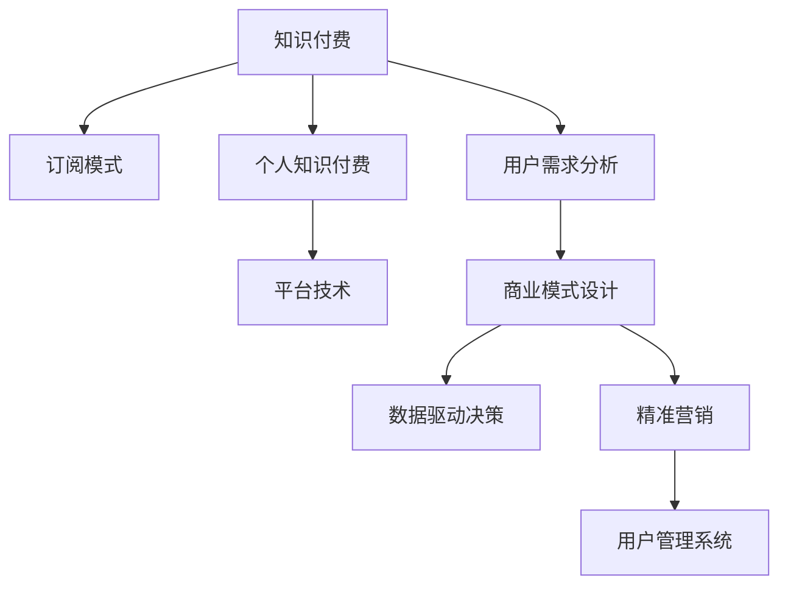

                 

# 如何打造个人知识付费订阅模式

> 关键词：知识付费, 订阅模式, 用户需求分析, 商业模式设计, 数据驱动决策, 精准营销, 平台技术实现

## 1. 背景介绍

随着信息爆炸时代的到来，知识付费逐渐成为一种潮流。在线学习平台、知识分享社区和各类在线课程大行其道，人们越来越愿意为获取高质量知识内容付费。在这样的背景下，个人知识付费订阅模式应运而生，为专业人士、机构或平台提供了一种全新的收入来源和变现方式。

个人知识付费订阅模式是指个人通过其专长和知识向用户提供订阅服务，用户付费购买内容，获取相关知识和信息。这种模式以高质量的原创内容为吸引，以知识分子的个人品牌为支撑，构建了一个多方共赢的生态系统。

## 2. 核心概念与联系

### 2.1 核心概念概述

1. **知识付费**：是指用户为获取知识而支付费用的行为，体现了知识的价值和稀缺性。

2. **订阅模式**：即用户定期（通常是月度或年度）支付费用，以获取持续的、高质量的知识内容。

3. **个人知识付费**：是指以个人作为知识提供者，通过平台或直接向用户提供订阅服务。

4. **平台技术**：是指支撑知识付费订阅模式的平台技术实现，包括内容管理系统、支付系统、用户管理系统等。

5. **用户需求分析**：通过市场调研和数据分析，了解用户对知识和信息的需求，从而设计合理的订阅模式。

6. **商业模式设计**：即如何通过知识付费订阅模式实现盈利，包括定价策略、收益分配等。

7. **数据驱动决策**：利用数据分析和用户行为数据，优化订阅模式和平台运营，提高用户满意度和留存率。

8. **精准营销**：根据用户数据和行为，设计精准的推广策略，提高订阅转化率。

这些核心概念之间的联系可以通过以下Mermaid流程图来展示：



这个流程图展示了从知识付费到订阅模式的演进过程，以及各个环节之间的相互依赖关系。

## 3. 核心算法原理 & 具体操作步骤

### 3.1 算法原理概述

个人知识付费订阅模式的成功，依赖于高质量内容的持续输出、合理的定价策略、有效的用户管理和精准的营销策略。这些因素共同作用，才能实现用户的稳定增长和平台的长期盈利。

### 3.2 算法步骤详解

1. **内容创作与审核**：
   - 创作者提交原创内容，平台进行审核，确保内容的质量和合规性。

2. **用户需求分析**：
   - 通过数据分析工具，收集用户行为数据，分析用户兴趣和需求，为内容创作提供参考。

3. **定价策略设计**：
   - 根据内容价值和市场需求，设计合理的订阅价格，如月度、年度订阅，固定价格或按需付费等。

4. **订阅模式设计**：
   - 设计订阅包，如基础包、高级包、专家包等，满足不同用户的需求。

5. **用户管理系统**：
   - 用户注册、登录、订阅管理等功能，确保用户订阅体验的顺畅。

6. **精准营销**：
   - 利用用户数据分析，设计精准推广策略，如个性化推荐、邮件营销等。

7. **数据分析与优化**：
   - 定期分析订阅数据和用户反馈，优化订阅模式和平台运营。

### 3.3 算法优缺点

#### 优点：

1. **可持续盈利**：个人知识付费订阅模式能提供稳定的收入来源，减少对外部广告的依赖。

2. **高附加值**：通过高质量内容的持续输出，平台可以积累忠实用户，提升品牌价值。

3. **用户粘性强**：订阅模式让用户成为平台的长期用户，提高用户留存率。

4. **灵活定价**：根据市场需求和内容价值，设计多样化的定价策略，满足不同用户的需求。

5. **精准营销**：利用用户数据分析，提高营销效果，降低获客成本。

#### 缺点：

1. **内容创作压力大**：创作者需要持续输出高质量内容，可能面临创作瓶颈。

2. **运营成本高**：平台需要投入大量资源进行内容审核、用户管理、营销推广等。

3. **用户需求变化快**：市场变化快速，需要频繁调整订阅模式和内容策略。

4. **竞争激烈**：市场上知识付费平台众多，如何脱颖而出是一大挑战。

5. **用户流失风险**：用户对价格和内容的需求敏感，一旦不满意，容易流失。

### 3.4 算法应用领域

个人知识付费订阅模式已经广泛应用于各类在线学习平台、专业社区、行业资讯平台等领域。如得到、知乎、Coursera等，都是成功的案例。

## 4. 数学模型和公式 & 详细讲解

### 4.1 数学模型构建

为了更好地理解个人知识付费订阅模式，我们构建以下数学模型：

1. **用户订阅模型**：
   - 用户总数 $U$，订阅用户数 $S$，未订阅用户数 $N$。

2. **订阅转化率**：
   - 订阅转化率 $C = \frac{S}{U}$。

3. **用户留存率**：
   - 用户留存率 $R = \frac{S_{t+1}}{S_t}$，其中 $S_t$ 表示第 $t$ 个月的订阅用户数。

4. **收入模型**：
   - 月度收入 $I = S \times P \times T$，其中 $P$ 为订阅价格，$T$ 为订阅周期（月或年）。

5. **用户流失率**：
   - 用户流失率 $L = \frac{N_{t+1}}{S_t}$。

### 4.2 公式推导过程

根据上述模型，我们可以推导出以下公式：

1. **用户总数变化率**：
   - $\frac{dU}{dt} = \frac{dS}{dt} + \frac{dN}{dt}$。

2. **订阅用户增长率**：
   - $\frac{dS}{dt} = C \times U - L \times S$。

3. **未订阅用户增长率**：
   - $\frac{dN}{dt} = 1 - C \times U + L \times S$。

4. **收入增长率**：
   - $\frac{dI}{dt} = C \times U \times P \times T$。

5. **用户留存率**：
   - $R = 1 - L$。

### 4.3 案例分析与讲解

假设某平台有100万用户，订阅率为20%，月度订阅价格为100元，用户每月新增1万用户，流失率为10%，计算平台第1年、第2年的用户数和收入。

根据公式，我们可以计算出：

1. **用户数变化**：
   - 第1年：$S_0 = 20\% \times 1000000 = 200000$。
   - $S_1 = 20\% \times (1000000 + 10000) - 10\% \times 200000 = 218000$。
   - $S_2 = 20\% \times (1000000 + 20000) - 10\% \times 218000 = 224600$。

2. **收入变化**：
   - 第1年：$I_1 = 218000 \times 100 \times 1 = 21800000$。
   - $I_2 = 224600 \times 100 \times 1 = 22460000$。

通过以上案例分析，可以看出用户数和收入的变化趋势，以及订阅率、流失率等参数对平台运营的影响。

## 5. 项目实践：代码实例和详细解释说明

### 5.1 开发环境搭建

1. **环境准备**：
   - 安装Python 3.7及以上版本。
   - 安装必要的依赖包，如Flask、SQLAlchemy等。

2. **数据库搭建**：
   - 选择MySQL或PostgreSQL作为数据库，创建用户、订阅、内容等数据表。

3. **API开发**：
   - 使用Flask框架开发API，包括用户注册、登录、订阅管理等。

4. **数据分析**：
   - 使用Pandas、NumPy等工具进行数据分析，如用户行为分析、内容推荐等。

### 5.2 源代码详细实现

以下是Python代码示例：

```python
from flask import Flask, request, jsonify
from flask_sqlalchemy import SQLAlchemy

app = Flask(__name__)
app.config['SQLALCHEMY_DATABASE_URI'] = 'sqlite:///subscription.db'
db = SQLAlchemy(app)

class User(db.Model):
    id = db.Column(db.Integer, primary_key=True)
    username = db.Column(db.String(50), unique=True, nullable=False)
    email = db.Column(db.String(50), unique=True, nullable=False)
    password = db.Column(db.String(100), nullable=False)

class Subscription(db.Model):
    id = db.Column(db.Integer, primary_key=True)
    user_id = db.Column(db.Integer, db.ForeignKey('user.id'), nullable=False)
    plan_id = db.Column(db.Integer, db.ForeignKey('plan.id'), nullable=False)
    start_date = db.Column(db.DateTime, nullable=False)
    end_date = db.Column(db.DateTime, nullable=False)

class Plan(db.Model):
    id = db.Column(db.Integer, primary_key=True)
    name = db.Column(db.String(50), unique=True, nullable=False)
    price = db.Column(db.Float, nullable=False)

@app.route('/subscribe', methods=['POST'])
def subscribe():
    user_id = request.json['user_id']
    plan_id = request.json['plan_id']
    start_date = request.json['start_date']
    end_date = request.json['end_date']
    subscription = Subscription(user_id=user_id, plan_id=plan_id, start_date=start_date, end_date=end_date)
    db.session.add(subscription)
    db.session.commit()
    return jsonify({'success': True}), 200

@app.route('/unsubscribe', methods=['POST'])
def unsubscribe():
    user_id = request.json['user_id']
    subscription_id = request.json['subscription_id']
    subscription = Subscription.query.filter_by(id=subscription_id).first()
    if not subscription:
        return jsonify({'success': False, 'error': 'Subscription not found'}), 404
    user = User.query.get(subscription.user_id)
    user.subscriptions.remove(subscription)
    db.session.commit()
    return jsonify({'success': True}), 200
```

### 5.3 代码解读与分析

以上代码实现了用户订阅和取消订阅的API接口，包括用户ID、计划ID、开始和结束日期等关键参数。在后台，使用SQLAlchemy进行数据库操作，记录用户的订阅信息。

1. **用户模型**：
   - 包含用户名、邮箱和密码等字段。

2. **订阅模型**：
   - 包含用户ID、计划ID、开始和结束日期等字段，关联用户和计划信息。

3. **计划模型**：
   - 包含计划名称和价格等字段，为订阅提供价格选项。

4. **API接口**：
   - `subscribe`接口：接收用户ID、计划ID和订阅时间，创建订阅记录。
   - `unsubscribe`接口：接收用户ID和订阅ID，删除订阅记录。

5. **数据操作**：
   - 使用SQLAlchemy进行数据库操作，支持增删改查等常见操作。

### 5.4 运行结果展示

在运行上述代码后，可以通过访问API接口进行订阅操作，如：

```python
# 订阅基础包
response = requests.post('http://localhost:5000/subscribe', json={
    'user_id': 123,
    'plan_id': 1,
    'start_date': '2021-01-01',
    'end_date': '2021-12-31'
})
```

## 6. 实际应用场景

### 6.1 在线教育平台

在线教育平台利用个人知识付费订阅模式，向用户提供各类在线课程和辅导服务。平台通过吸引名师入驻，推出高质量的课程内容，结合社区互动和个性化推荐，提升用户体验和满意度。

### 6.2 专业社区

专业社区利用订阅模式，向用户提供深入的专业知识和最新行业动态。社区通过组织线上线下的技术分享会和培训课程，构建了一个知识交流和合作的平台。

### 6.3 行业资讯平台

行业资讯平台向用户提供定制化的行业报告和市场分析，帮助用户了解行业动态，做出更明智的商业决策。平台通过订阅模式，吸引企业用户订阅，提升平台的商业价值。

## 7. 工具和资源推荐

### 7.1 学习资源推荐

1. **《知识付费盈利模式研究》**：深入探讨知识付费的盈利模式，分析成功的案例和失败的教训。

2. **《订阅经济的商业模型》**：讲解订阅经济的原理和应用，提供订阅模式设计的参考。

3. **《数据驱动的精准营销》**：介绍数据驱动的精准营销策略，利用用户数据分析提升营销效果。

4. **《Python数据分析实战》**：使用Python进行数据分析，帮助开发者掌握数据分析的基本技能。

5. **《Flask Web应用开发实战》**：使用Flask框架开发Web应用，提供API接口设计的最佳实践。

### 7.2 开发工具推荐

1. **Flask**：轻量级的Web框架，适合快速搭建API接口。

2. **SQLAlchemy**：Python的ORM工具，支持多种数据库，方便数据操作。

3. **Pandas**：数据处理和分析工具，支持各种数据格式。

4. **NumPy**：高性能数值计算工具，支持矩阵运算和科学计算。

5. **Jupyter Notebook**：交互式的数据分析和编程环境，方便开发和调试。

### 7.3 相关论文推荐

1. **《知识付费订阅模式的商业价值研究》**：探讨知识付费订阅模式的价值和市场潜力，分析关键成功因素。

2. **《基于用户数据分析的订阅模型优化》**：利用用户数据分析，优化订阅模式，提高用户满意度和留存率。

3. **《数据驱动的精准营销策略研究》**：通过用户数据分析，设计精准的推广策略，提升营销效果。

4. **《个人知识付费平台的运营优化》**：分析个人知识付费平台的运营策略和优化方法，提供可行的运营建议。

5. **《订阅经济的商业模式创新》**：探讨订阅经济的商业模式创新，分析未来的发展趋势和应用场景。

## 8. 总结：未来发展趋势与挑战

### 8.1 总结

本文对个人知识付费订阅模式进行了系统介绍，详细讲解了核心概念、算法原理和具体操作步骤。通过理论分析和代码实例，展示了个人知识付费订阅模式的实现过程，并提出了一些优化建议。

通过本文的系统梳理，可以看出个人知识付费订阅模式在提升知识变现能力、构建知识生态系统和推动用户付费习惯方面的巨大潜力。但同时，平台面临内容创作压力、用户需求变化快、竞争激烈等挑战，需要不断优化和创新，才能实现长期的稳定发展。

### 8.2 未来发展趋势

1. **内容多样化**：未来的知识付费订阅模式将更加多样化，除了传统课程和文章，还将涵盖视频、音频、直播等多种形式。

2. **技术赋能**：通过人工智能、大数据等技术，提升内容推荐、用户管理等环节的效率和精准度。

3. **跨平台融合**：知识付费平台将进一步融合社交、娱乐、商业等多个领域，形成一站式的综合性平台。

4. **全球化布局**：通过本地化内容和全球化推广，拓展全球用户市场，提升平台的国际影响力。

5. **个性化服务**：利用大数据和人工智能技术，提供个性化的学习路径和推荐服务，提升用户粘性和满意度。

6. **可持续发展**：通过多元化收入来源和合理的价格策略，实现平台的可持续发展。

### 8.3 面临的挑战

1. **内容创作的可持续性**：创作者如何持续输出高质量内容是一大挑战，需要通过激励机制、社区建设等方式解决。

2. **用户留存率**：平台如何提升用户留存率，降低用户流失率，需要持续优化用户体验和运营策略。

3. **市场竞争**：如何应对市场上众多的知识付费平台，需要差异化定位和品牌建设。

4. **技术难题**：如何实现高效的内容审核和用户管理，需要不断优化技术架构和算法模型。

5. **法律合规**：如何确保平台的合法合规运营，需要遵循相关法律法规，保护用户隐私和权益。

6. **商业模式创新**：如何设计合理的商业模式，实现盈利和用户增长的平衡，需要深入市场调研和数据分析。

### 8.4 研究展望

未来的研究需要从以下几个方面进行突破：

1. **内容创作激励机制**：设计有效的激励机制，鼓励创作者持续输出高质量内容。

2. **用户行为分析**：通过深度学习和大数据技术，分析用户行为，提升内容推荐和个性化服务的效果。

3. **跨平台协同**：实现跨平台的用户数据和内容融合，提升平台的综合价值和竞争力。

4. **本地化运营**：根据不同地区的用户需求，进行本地化内容和运营策略的设计。

5. **技术创新**：引入最新的人工智能和大数据技术，提升平台的智能化和自动化水平。

6. **可持续发展**：通过多元化的收入来源和合理的定价策略，实现平台的长期稳定发展。

## 9. 附录：常见问题与解答

**Q1: 什么是个人知识付费订阅模式？**

A: 个人知识付费订阅模式是指个人通过其专长和知识向用户提供订阅服务，用户定期支付费用获取高质量内容的模式。

**Q2: 如何设计合理的订阅价格？**

A: 订阅价格的设计需要考虑内容价值、市场需求、竞争环境等多个因素。一般建议采用动态定价策略，根据市场反馈和用户需求进行动态调整。

**Q3: 如何提升用户留存率？**

A: 提升用户留存率需要综合考虑用户体验、内容质量、运营策略等多个因素。常见的方法包括定期更新内容、提供个性化推荐、优化用户互动等。

**Q4: 如何设计精准的营销策略？**

A: 精准营销需要基于用户数据和行为分析，设计个性化的推广策略。常见的方法包括电子邮件营销、社交媒体推广、个性化推荐等。

**Q5: 如何优化订阅模式？**

A: 订阅模式的优化需要不断收集用户反馈和数据分析，调整订阅策略和内容推荐算法。常见的方法包括用户行为分析、内容质量评估、用户体验改进等。

---

作者：禅与计算机程序设计艺术 / Zen and the Art of Computer Programming

