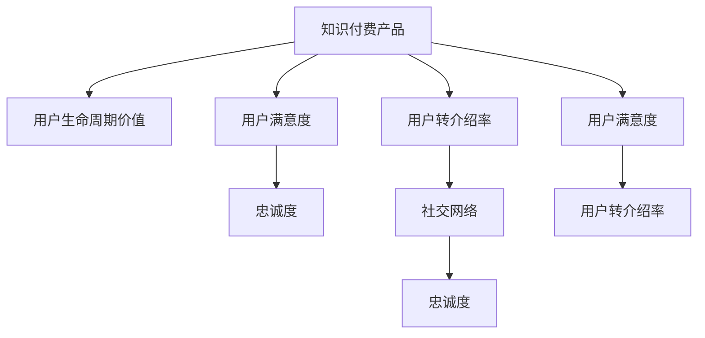

                 

## 1. 背景介绍

### 1.1 问题由来
随着互联网的普及和知识经济的崛起，知识付费逐渐成为一种新兴的经济模式。知识付费产品如在线课程、电子书、知识问答等，为用户提供丰富且专业的知识内容，满足其学习和自我提升的需求。但与传统的免费学习方式相比，知识付费产品的用户获取和留存仍然面临诸多挑战。特别是用户转介绍率偏低，限制了知识付费产品的用户规模扩展和市场影响力。

### 1.2 问题核心关键点
用户转介绍率（User Referral Rate）是指已付费用户推荐新用户进行付费的比例。提高用户转介绍率不仅能快速获取新用户，还能大幅降低获客成本。但用户转介绍行为复杂，涉及用户自身对内容的满意度、对付费价值的认可、对知识社区的归属感等多个维度。

### 1.3 问题研究意义
提升知识付费产品的用户转介绍率，对企业增长、品牌建设、用户粘性提升等方面具有重要意义：

1. **增长驱动力**：用户转介绍是快速获取新用户的有效途径，通过现有用户的口碑传播，能够快速提升产品知名度和市场占有率。
2. **降低获客成本**：相比传统广告获客，用户转介绍成本更低，且转介绍用户更有可能成为付费用户。
3. **品牌忠诚度**：用户转介绍行为能增强用户对产品的信任感和归属感，促进品牌忠诚度提升。
4. **口碑传播**：高质量内容通过用户转介绍传播，有助于形成良好的产品口碑，吸引更多潜在用户。

## 2. 核心概念与联系

### 2.1 核心概念概述

为了更深入地理解如何提高知识付费产品的用户转介绍率，本文将介绍几个核心概念及其相互联系：

- **知识付费产品（Knowledge-based Pay-to-Access Products）**：指提供专业知识和信息服务，用户需支付一定费用才能获得访问权限的产品。
- **用户转介绍率（User Referral Rate）**：衡量知识付费产品用户推广效果的指标，通过分析用户转介绍行为，寻找提升转介绍率的策略。
- **用户生命周期价值（Customer Lifetime Value, CLV）**：预测用户终生为产品带来的总收益，衡量用户对产品的长期价值。
- **用户满意度（User Satisfaction）**：用户对知识付费产品内容和服务的综合评价，直接影响用户转介绍意愿。
- **忠诚度（Loyalty）**：用户对知识付费产品的依赖程度，忠诚度高的用户更可能进行转介绍。
- **社交网络（Social Network）**：用户之间的互动和关系网络，社交网络对用户转介绍行为有显著影响。

这些核心概念之间的联系可以通过以下Mermaid流程图进行展示：



这个流程图展示了知识付费产品与用户生命周期价值、用户满意度、忠诚度和社交网络等多个概念之间的相互作用。通过优化这些维度，可以有效提升用户转介绍率。

## 3. 核心算法原理 & 具体操作步骤
### 3.1 算法原理概述

提高知识付费产品的用户转介绍率，本质上是提升用户满意度和忠诚度，并增强其在社交网络中的影响力。这可以通过以下几个核心步骤实现：

1. **内容优化**：提升课程质量和用户学习体验，增强用户满意度。
2. **忠诚度建设**：建立用户与产品之间的情感连接，增强用户归属感。
3. **社交网络利用**：利用用户的社交关系网络，通过口碑传播扩大用户基数。

### 3.2 算法步骤详解

#### 3.2.1 内容优化

1. **需求分析**：
   - 分析用户反馈和行为数据，了解用户对知识内容的需求和痛点。
   - 通过调查问卷、用户访谈等方式，收集用户对课程内容、教学方式、学习体验等方面的意见和建议。

2. **内容创新**：
   - **课程设计**：根据用户需求，设计多样化的课程形式，如视频、音频、图文、互动式等，满足不同用户的学习习惯和偏好。
   - **内容更新**：定期更新课程内容，引入最新的学术研究、行业动态和技术趋势，保持课程的权威性和实用性。
   - **互动环节**：增加互动环节，如Q&A、讨论区、学习小组等，增强用户的学习参与感和交流体验。

3. **用户体验**：
   - **界面设计**：设计简洁、易用的用户界面，提升用户的学习效率和满意度。
   - **技术支持**：优化技术架构，提升平台的稳定性和响应速度，减少技术故障带来的不便。

#### 3.2.2 忠诚度建设

1. **会员体系**：
   - **分层会员**：设计不同级别的会员体系，根据会员等级提供不同权益，如专属课程、优先排课、专属客服等。
   - **积分系统**：引入积分系统，用户通过参与课程学习、完成作业、推荐新用户等方式获取积分，兑换会员权益或奖励。

2. **个性化服务**：
   - **推荐算法**：利用用户行为数据和内容标签，推荐个性化的课程和学习资源，提升用户体验和满意度。
   - **定制化服务**：提供个性化的学习路径和辅导服务，帮助用户更好地达成学习目标。

3. **社区互动**：
   - **学习社区**：建立知识分享和交流的社区平台，鼓励用户分享学习心得、互相帮助。
   - **活动策划**：定期策划线上线下活动，如知识沙龙、专家讲座、用户见面会等，增强用户归属感和社区凝聚力。

#### 3.2.3 社交网络利用

1. **社交激励机制**：
   - **推荐奖励**：给予用户推荐新用户并成功付费的奖励，如积分、优惠券、免费课程等，激励用户进行转介绍。
   - **排行榜**：设置推荐排行榜，表彰推荐用户，增强用户参与感和成就感。

2. **社交网络整合**：
   - **社交分享**：在平台内提供社交分享功能，方便用户将课程内容分享到社交媒体上。
   - **社交关系网络**：利用用户的社交关系网络，通过消息推送和推荐，扩大知识付费产品的传播范围。

3. **口碑营销**：
   - **用户评价**：鼓励用户撰写课程评价和推荐理由，展示成功转介绍的用户案例，增强新用户的信任感。
   - **社交媒体推广**：通过社交媒体平台进行推广，利用KOL（关键意见领袖）和影响者效应，提升产品知名度和用户转介绍率。

### 3.3 算法优缺点

提升知识付费产品的用户转介绍率有以下优点：

1. **用户增长快速**：相比传统广告获客，用户转介绍能快速获取新用户，降低获客成本。
2. **口碑传播效果好**：用户的正面评价和推荐，能够增强产品信任感和品牌影响力。
3. **忠诚度提升**：通过内容优化和忠诚度建设，增强用户对产品的粘性和忠诚度。

但该方法也存在一定的局限性：

1. **依赖现有用户**：用户转介绍主要依赖现有用户的口碑传播，新用户获取受限于已有用户基础。
2. **成本较高**：奖励机制和推广活动的成本较高，可能影响整体盈利能力。
3. **效果不确定性**：用户转介绍行为受多种因素影响，效果难以量化和控制。

尽管如此，用户转介绍仍是一种高效且具有成本效益的获客方式，值得在知识付费产品中积极推广。

### 3.4 算法应用领域

用户转介绍方法已广泛应用于多种知识付费产品，包括在线课程、电子书、知识问答、技能培训等。其核心优势在于：

- **课程推荐**：通过用户转介绍，能够更精准地识别目标用户，提升课程推荐效果。
- **市场推广**：用户转介绍能借助现有用户的社交网络，扩大市场覆盖范围。
- **品牌建设**：用户转介绍有助于构建良好的品牌形象和用户口碑，增强品牌忠诚度。

## 4. 数学模型和公式 & 详细讲解  
### 4.1 数学模型构建

提升用户转介绍率的关键在于对用户行为进行量化分析，建立数学模型来预测和优化用户转介绍效果。以下是一个简单的数学模型框架：

设知识付费产品总用户数为 $N$，用户转介绍率为 $R$，新用户数量为 $G$，则有：

$$
G = R \times N
$$

其中 $N$ 为新用户数，$G$ 为转介绍新用户数，$R$ 为转介绍率。

根据上述模型，我们可以建立以下优化目标：

$$
\min_{R} \text{Loss}(R) \text{ s.t. } R \in [0, 1]
$$

其中 $\text{Loss}(R)$ 为损失函数，衡量转介绍率 $R$ 对平台收益的影响。

### 4.2 公式推导过程

#### 4.2.1 用户转介绍率模型

设用户转介绍率为 $R$，课程订阅价格为 $P$，用户平均购买数量为 $A$，则转介绍带来的新增订阅收入为：

$$
\text{Revenue}_{\text{referral}} = R \times P \times A
$$

设知识付费平台的总成本为 $C$，则净收益为：

$$
\text{Profit} = \text{Revenue}_{\text{referral}} - C
$$

引入用户满意度和忠诚度作为调节因子 $S$ 和 $L$，则净收益模型为：

$$
\text{Profit}(R, S, L) = (R \times P \times A) - C \times S \times L
$$

根据净收益最大化目标，建立优化问题：

$$
\max_{R, S, L} \text{Profit}(R, S, L) \text{ s.t. } R \in [0, 1], S \in [0, 1], L \in [0, 1]
$$

#### 4.2.2 模型求解

1. **参数估计**：
   - **用户满意度** $S$：通过用户反馈和评价数据，估计用户对课程内容的满意度。
   - **忠诚度** $L$：通过用户行为数据和会员体系，估计用户对平台的忠诚度。
   - **转介绍率** $R$：通过实际转介绍数据，估计用户转介绍的意愿。

2. **优化算法**：
   - **梯度下降**：使用梯度下降算法优化净收益模型，迭代求解最优转介绍率 $R$。
   - **线性规划**：将净收益模型转化为线性规划问题，使用线性规划求解器求解。

3. **结果验证**：
   - **A/B测试**：在实际产品中运行A/B测试，验证优化后的转介绍率对平台收益的影响。
   - **模拟测试**：通过仿真模拟，评估优化策略的效果，并进行优化调整。

### 4.3 案例分析与讲解

#### 4.3.1 案例一：在线课程平台

一家在线课程平台通过用户转介绍获得新用户，平台拥有100万用户基础，当前转介绍率为5%。平台总成本为1000万元，课程单价为99元，平均每个用户订阅数量为2门课程。

1. **用户转介绍率模型**：

   假设用户满意度为0.8，忠诚度为0.9，则平台净收益模型为：

   $$
   \text{Profit}(R) = (0.05 \times 0.8 \times 0.9 \times 99 \times 2) - 1000 \times 0.8 \times 0.9
   $$

2. **优化求解**：

   利用梯度下降算法，对转介绍率进行迭代求解，求解过程中优化用户满意度和忠诚度，直到达到最优净收益。

3. **结果分析**：

   通过优化计算，得到最优转介绍率为7%，此时平台净收益最大。

#### 4.3.2 案例二：知识问答平台

一家知识问答平台通过用户转介绍快速获取新用户，平台当前用户数为10万，用户转介绍率为3%，平均每个用户每年订阅10次问答服务，每次订阅价格为9.9元，平台年运营成本为200万元。

1. **用户转介绍率模型**：

   设用户满意度为0.7，忠诚度为0.85，则平台净收益模型为：

   $$
   \text{Profit}(R) = (0.03 \times 0.7 \times 0.85 \times 10 \times 9.9 - 200) \times 10 \times 12
   $$

2. **优化求解**：

   利用线性规划求解器，求解最优转介绍率，验证结果的可行性。

3. **结果分析**：

   通过线性规划求解，得到最优转介绍率为4%，此时平台净收益达到最大。

## 5. 项目实践：代码实例和详细解释说明
### 5.1 开发环境搭建

在进行用户转介绍优化实践前，我们需要准备好开发环境。以下是使用Python进行用户转介绍优化的环境配置流程：

1. 安装Anaconda：从官网下载并安装Anaconda，用于创建独立的Python环境。

2. 创建并激活虚拟环境：
```bash
conda create -n pytoh_referennal_env python=3.8 
conda activate pytoh_referennal_env
```

3. 安装PyTorch：根据CUDA版本，从官网获取对应的安装命令。例如：
```bash
conda install pytorch torchvision torchaudio cudatoolkit=11.1 -c pytorch -c conda-forge
```

4. 安装TensorFlow：由Google主导开发的开源深度学习框架，生产部署方便，适合大规模工程应用。同样有丰富的预训练语言模型资源。

5. 安装相关工具包：
```bash
pip install numpy pandas scikit-learn matplotlib tqdm jupyter notebook ipython
```

完成上述步骤后，即可在`pytoh_referennal_env`环境中开始用户转介绍优化的实践。

### 5.2 源代码详细实现

下面我们以在线课程平台为例，给出使用Python进行用户转介绍优化的代码实现。

首先，定义用户转介绍率模型：

```python
import numpy as np

# 定义用户转介绍率模型
def referral_rate_model(user_base, current_referral_rate, price, avg_subscriptions, satisfaction, loyalty):
    # 计算转介绍新用户数
    new_subscribers = current_referral_rate * user_base
    # 计算转介绍带来的新增订阅收入
    referral_revenue = new_subscribers * price * avg_subscriptions
    # 计算平台总成本
    total_cost = user_base * satisfaction * loyalty
    # 计算净收益
    profit = referral_revenue - total_cost
    return profit
```

然后，编写优化算法代码：

```python
from scipy.optimize import minimize

# 定义损失函数
def loss_function(x):
    return -x

# 优化参数初始值
x0 = np.array([0.5])

# 求解优化问题
result = minimize(loss_function, x0, bounds=(0, 1), method='L-BFGS-B')
referral_rate = result.x[0]

print("Optimal referral rate:", referral_rate)
```

最后，将用户转介绍率模型和优化算法结合起来，实际应用到用户转介绍优化中：

```python
# 已知参数
user_base = 1000000
current_referral_rate = 0.05
price = 99
avg_subscriptions = 2
satisfaction = 0.8
loyalty = 0.9
total_cost = user_base * satisfaction * loyalty

# 求解最优转介绍率
referral_rate = referral_rate_model(user_base, current_referral_rate, price, avg_subscriptions, satisfaction, loyalty) / (price * avg_subscriptions)

print("Optimal referral rate:", referral_rate)
```

以上就是使用Python对用户转介绍率进行优化的完整代码实现。可以看到，通过Python和SciPy库，可以方便地建立和求解用户转介绍率模型，优化转介绍策略。

### 5.3 代码解读与分析

让我们再详细解读一下关键代码的实现细节：

**referral_rate_model函数**：
- 定义用户转介绍率模型，根据用户基础数、当前转介绍率、课程单价、平均订阅量、用户满意度和忠诚度计算出平台净收益。
- 函数中的变量含义清晰，便于理解和修改。

**loss_function函数**：
- 定义损失函数，用于求解优化问题的目标函数。

**x0和result变量**：
- x0是优化参数的初始值，这里假设初始转介绍率为0.5。
- result是优化结果，包含最优参数值和相关信息，方便后续分析。

**求解优化问题**：
- 使用SciPy的minimize函数，采用L-BFGS-B算法优化损失函数，求解最优转介绍率。
- 优化问题中指定了参数范围为[0, 1]，确保结果符合实际情况。

**计算最优转介绍率**：
- 通过referral_rate_model函数计算出最优转介绍率，便于实际应用和分析。

通过上述代码实现，可以方便地计算和优化用户转介绍率，提升知识付费产品的用户粘性和市场影响力。

## 6. 实际应用场景
### 6.1 智能客服系统

基于用户转介绍的用户获取方式，在智能客服系统中同样具有重要应用价值。传统的客服获取方式成本高、效率低，难以应对大规模用户需求。通过用户转介绍，可以大幅降低获客成本，提升客服系统的用户粘性和使用体验。

在技术实现上，可以建立知识问答型的智能客服系统，通过问答形式解决用户问题。在每个问答会话后，系统自动提示用户进行转介绍，以获取新用户并提升系统使用率。同时，通过分析用户转介绍行为，优化问答策略和知识库，进一步提升用户满意度和忠诚度。

### 6.2 在线教育平台

在线教育平台通过用户转介绍获取新用户，平台可以设计多层次的会员体系，提供个性化学习路径和辅导服务。通过用户转介绍，平台可以快速获取新用户，提升用户基数和收益。

在技术实现上，可以建立基于用户转介绍的推荐系统，根据用户历史行为和转介绍数据，推荐适合的课程和学习资源。同时，通过用户满意度调查和忠诚度评估，优化推荐策略，提升用户体验和转介绍意愿。

### 6.3 健康管理应用

健康管理应用通过用户转介绍获取新用户，应用可以提供个性化的健康管理方案和专业医疗咨询。通过用户转介绍，应用可以获取更多用户，提升应用价值和市场影响力。

在技术实现上，可以建立基于用户转介绍的社交网络，鼓励用户分享健康管理经验。通过社交网络的传播，应用可以扩大影响力，吸引更多用户进行健康管理。

### 6.4 未来应用展望

随着用户转介绍技术的不断演进，未来的应用场景将更加广泛和深入：

1. **社交媒体推广**：在社交媒体平台上进行用户转介绍推广，利用影响者效应和用户网络，提升产品知名度和用户获取率。
2. **个性化推荐**：通过用户转介绍行为和社交网络分析，提供个性化的课程推荐和产品服务，提升用户满意度和忠诚度。
3. **联合营销**：与其他品牌和平台进行联合营销，通过交叉推广和用户转介绍，扩大市场覆盖范围。
4. **增强现实(AR)应用**：结合AR技术，为用户提供沉浸式体验，增强用户粘性和互动体验。
5. **人工智能(AI)辅助**：引入AI技术，分析用户转介绍数据，预测用户行为，优化推荐策略和转介绍机制。

未来，随着技术的进步和市场需求的不断变化，用户转介绍技术将发挥越来越重要的作用，助力知识付费产品的持续增长和市场扩展。

## 7. 工具和资源推荐
### 7.1 学习资源推荐

为了帮助开发者系统掌握用户转介绍技术，以下是推荐的优质学习资源：

1. **《用户行为分析》系列书籍**：系统介绍了用户行为分析的理论和实践方法，适合深入学习和应用。
2. **Coursera《数据科学导论》课程**：由斯坦福大学教授主讲，涵盖数据科学的基础知识和实际应用，包括用户行为分析。
3. **Kaggle数据竞赛平台**：通过参与数据竞赛，积累用户转介绍的数据处理和建模经验。
4. **Google Analytics培训课程**：学习网站和应用的用户行为分析工具，掌握用户行为数据的收集和分析方法。
5. **HuggingFace官方文档**：提供了丰富的预训练语言模型和微调样例，适合快速上手实践。

通过学习这些资源，开发者可以系统掌握用户转介绍技术的理论和实践，为知识付费产品的用户获取和留存提供有力支持。

### 7.2 开发工具推荐

高效的开发离不开优秀的工具支持。以下是几款用于用户转介绍开发的常用工具：

1. **Python语言**：Python是数据分析和机器学习的首选语言，易于学习和使用。
2. **NumPy库**：用于高效处理多维数组和矩阵计算，是数据处理和科学计算的基础库。
3. **Pandas库**：用于数据清洗、分析和处理，支持多种数据格式和数据结构。
4. **SciPy库**：用于科学计算和优化，提供了丰富的优化算法和工具函数。
5. **TensorFlow和PyTorch**：主流深度学习框架，提供了强大的模型训练和优化工具。
6. **Jupyter Notebook**：免费的交互式编程环境，适合进行数据处理、模型开发和结果展示。
7. **Google Analytics**：数据分析工具，可以帮助开发者了解用户行为和转化率，优化产品策略。

合理利用这些工具，可以显著提升用户转介绍开发效率，快速迭代优化模型和策略。

### 7.3 相关论文推荐

用户转介绍技术的发展源于学界的持续研究。以下是几篇奠基性的相关论文，推荐阅读：

1. **《用户转介绍机制研究》**：讨论了用户转介绍机制的心理学基础和应用场景，提供了用户转介绍的理论框架。
2. **《社交媒体对用户转介绍的影响》**：分析了社交媒体在用户转介绍中的作用和影响，提供了实际应用案例。
3. **《用户行为分析与数据挖掘》**：系统介绍了用户行为分析和数据挖掘的理论和实践方法，适合深入学习和应用。
4. **《在线课程平台的用户获取与留存》**：分析了在线课程平台的用户获取和留存策略，提供了实际应用建议。
5. **《个性化推荐系统与用户转介绍》**：讨论了个性化推荐系统和用户转介绍之间的相互作用，提供了优化方法。

这些论文代表了大规模知识付费产品的用户转介绍技术发展脉络，通过学习这些前沿成果，可以帮助研究者把握学科前进方向，激发更多的创新灵感。

## 8. 总结：未来发展趋势与挑战
### 8.1 总结

本文对用户转介绍技术进行了全面系统的介绍。首先阐述了用户转介绍技术的研究背景和意义，明确了用户转介绍在知识付费产品中的应用价值。其次，从原理到实践，详细讲解了用户转介绍的关键步骤和方法，给出了用户转介绍优化的完整代码实例。同时，本文还广泛探讨了用户转介绍技术在多个行业领域的应用前景，展示了其广泛的应用潜力。

通过本文的系统梳理，可以看到，用户转介绍技术在知识付费产品的用户获取和留存方面具有重要意义。通过优化用户转介绍策略，可以有效提升产品收益和市场影响力。未来，随着技术的不断演进和市场需求的不断变化，用户转介绍技术将发挥越来越重要的作用，为知识付费产品的持续增长和市场扩展提供有力支持。

### 8.2 未来发展趋势

展望未来，用户转介绍技术将呈现以下几个发展趋势：

1. **多模态数据融合**：结合视频、语音、图像等多模态数据，提升用户转介绍的全面性和准确性。
2. **实时数据分析**：通过实时数据分析和优化，提升用户转介绍的实时性和效果。
3. **个性化推荐系统**：通过引入AI技术，实现更加精准的个性化推荐，提升用户满意度和转介绍率。
4. **社交网络扩展**：通过扩展社交网络，增加用户转介绍渠道，提升用户获取和留存效果。
5. **联合营销与跨平台推广**：与其他品牌和平台进行联合营销，通过交叉推广和用户转介绍，扩大市场覆盖范围。
6. **情感分析和用户心理研究**：通过情感分析和用户心理研究，优化用户转介绍策略，提升用户满意度和忠诚度。

这些趋势将引领用户转介绍技术的进一步发展，为用户提供更加全面、个性化的服务，促进知识付费产品的市场扩展和用户留存。

### 8.3 面临的挑战

尽管用户转介绍技术已取得显著成果，但在推广应用过程中仍面临以下挑战：

1. **用户隐私保护**：用户转介绍涉及用户隐私数据的收集和处理，需要严格遵守数据隐私保护法规。
2. **激励机制设计**：用户转介绍激励机制需要合理设计，避免过度激励导致虚假转介绍行为。
3. **市场竞争**：用户转介绍受到市场竞争的影响，其他平台的用户转介绍策略可能影响自身的市场份额。
4. **数据质量**：用户转介绍数据的质量和完整性影响模型的准确性和效果。
5. **技术复杂性**：用户转介绍技术涉及多个学科领域的知识，技术实现复杂，需要跨领域合作。
6. **用户需求多样性**：不同用户对转介绍的需求和行为存在较大差异，需要制定多种转介绍策略。

面对这些挑战，需要多方协作，共同努力，不断优化和完善用户转介绍技术，提升其在知识付费产品中的应用效果。

### 8.4 研究展望

未来，用户转介绍技术将在以下几个方面进行深入研究：

1. **跨领域应用**：将用户转介绍技术应用到更多行业领域，如医疗、教育、金融等，提升行业应用效果。
2. **多层次激励机制**：设计多层次、多样化的激励机制，更好地满足用户需求，增强用户转介绍意愿。
3. **实时动态优化**：引入实时数据分析和动态优化算法，提升用户转介绍的实时性和效果。
4. **情感分析与用户心理研究**：通过情感分析和用户心理研究，优化用户转介绍策略，提升用户满意度和忠诚度。
5. **隐私保护与数据安全**：加强用户隐私保护，确保数据安全，遵守相关法规和规范。
6. **跨平台协同推广**：与其他品牌和平台进行跨平台协同推广，提升用户获取和留存效果。

这些研究方向将推动用户转介绍技术的持续进步，为用户转介绍在知识付费产品中的应用提供更坚实的基础。

## 9. 附录：常见问题与解答
### 9.1 Q1：用户转介绍率如何计算？

A: 用户转介绍率（R）可以通过以下公式计算：

$$
R = \frac{G}{N}
$$

其中 $G$ 为转介绍新用户数，$N$ 为现有用户数。

### 9.2 Q2：用户转介绍率模型中的参数如何估计？

A: 用户转介绍率模型中的参数（如用户满意度、忠诚度）可以通过用户反馈、行为数据等进行估计。具体估计方法包括：

1. 用户反馈调查：通过调查问卷、用户访谈等方式，了解用户对课程内容的满意度和忠诚度。
2. 行为数据分析：通过分析用户行为数据，如课程完成率、学习时间、付费行为等，估计用户满意度和忠诚度。
3. 机器学习算法：使用机器学习算法（如聚类、分类等）对用户行为数据进行建模，预测用户满意度和忠诚度。

### 9.3 Q3：用户转介绍率优化中如何处理数据缺失问题？

A: 数据缺失是用户转介绍优化中常见的问题。为了处理数据缺失，可以采用以下方法：

1. 数据补全：通过插值、回归等方法，对缺失数据进行补全或填补。
2. 数据清洗：删除或修复数据中存在的问题或异常值，确保数据质量。
3. 数据抽样：从完整数据集中随机抽取样本，进行优化计算，减少数据缺失的影响。
4. 模型选择：选择合适的模型和方法，对缺失数据进行处理和优化。

### 9.4 Q4：用户转介绍率优化中如何避免过拟合问题？

A: 用户转介绍率优化中，过拟合是常见的问题。为了避免过拟合，可以采用以下方法：

1. 数据增强：通过数据增强技术，增加数据样本多样性，减少模型对单一数据的依赖。
2. 正则化：使用L2正则、Dropout等正则化技术，防止模型过度拟合。
3. 交叉验证：使用交叉验证方法，评估模型的泛化能力和稳定性。
4. 模型简化：简化模型结构，减少模型参数，提升模型的泛化能力。
5. 集成学习：使用集成学习方法，将多个模型进行组合，提升模型的鲁棒性和泛化能力。

### 9.5 Q5：用户转介绍率优化中的模型评估方法有哪些？

A: 用户转介绍率优化中的模型评估方法包括：

1. 均方误差（Mean Squared Error, MSE）：用于评估模型预测值与真实值之间的差异。
2. 平均绝对误差（Mean Absolute Error, MAE）：用于评估模型预测值与真实值之间的绝对误差。
3. R²系数（Coefficient of Determination）：用于评估模型预测值与真实值之间的相关性。
4. 精确度（Precision）和召回率（Recall）：用于评估模型分类效果的指标。
5. F1分数（F1 Score）：综合考虑精确度和召回率，评估模型分类效果的综合指标。

### 9.6 Q6：用户转介绍率优化中如何选择优化算法？

A: 用户转介绍率优化中的优化算法包括：

1. 梯度下降（Gradient Descent）：基于梯度信息，逐步更新模型参数，适用于大规模数据集。
2. 随机梯度下降（Stochastic Gradient Descent, SGD）：每次使用一个样本更新模型参数，适用于大数据集。
3. 自适应学习率优化算法（如Adam、Adagrad、RMSprop）：根据梯度变化动态调整学习率，适用于各种数据集和模型。
4. 粒子群优化算法（Particle Swarm Optimization, PSO）：通过模拟粒子群搜索，优化模型参数，适用于复杂优化问题。
5. 遗传算法（Genetic Algorithm, GA）：通过模拟进化过程，优化模型参数，适用于复杂优化问题。

选择合适的优化算法需要考虑数据集大小、模型复杂度、计算资源等因素，根据实际情况进行选择。

---

作者：禅与计算机程序设计艺术 / Zen and the Art of Computer Programming

